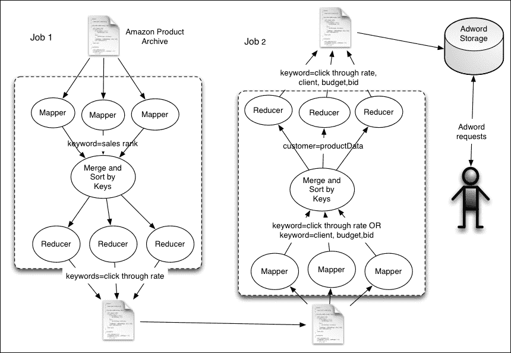

# 九、分类、推荐和查找关系

在本章中，我们将介绍：

*   执行基于内容的推荐
*   利用朴素贝叶斯分类器进行分类
*   使用 Adword Balance 算法将广告分配给关键字

# 简介

本章讨论如何将 Hadoop 用于更复杂的用例，如对数据集进行分类和提出建议。

以下是一些此类场景的几个实例：

*   根据产品之间的相似性(例如，如果一个用户喜欢一本关于历史的书，他/她可能喜欢另一本关于同一主题的书)或基于用户行为模式(例如，如果两个用户相似，他们可能喜欢另一个人读过的书)向用户推荐产品
*   对数据集进行聚类以标识相似实体；例如，标识具有相似兴趣的用户
*   根据历史数据将数据分类为几组

在本食谱中，我们将使用 MapReduce 应用这些技术和其他技术。 对于本章中的食谱，我们将使用亚马逊产品联合采购网络元数据数据集，可从[http://snap.stanford.edu/data/amazon-meta.html](http://snap.stanford.edu/data/amazon-meta.html)获取。

### 备注

本章的内容基于本书前一版*Hadoop MapReduce Cookbook*的[章](08.html "Chapter 8. Searching and Indexing")、*分类、建议和查找关系*。 这一章是由合著者斯里纳特·佩雷拉(Srinath Perera)贡献的。

### 提示

**示例代码**

本书的示例代码和数据文件位于 GitHub的[https://github.com/thilg/hcb-v2](https://github.com/thilg/hcb-v2)中。 代码库的`chapter9`文件夹包含本章的示例源代码文件。 通过在代码库的`chapter9`文件夹中发出`gradle build`命令，可以编译和构建示例代码。 Eclipse IDE 的项目文件可以通过在代码存储库的主文件夹中运行`gradle eclipse`命令来生成。 IntelliJ IDEA IDE 的项目文件可以通过在代码库的主文件夹中运行`gradle idea`命令来生成。

# 执行基于内容的推荐

推荐是对某人可能感兴趣的事情的建议。 例如，你会把一本好书推荐给一位你知道和你有相似兴趣的朋友。 我们经常在网上零售中找到推荐的用例。 例如，当你浏览一款产品时，亚马逊会推荐购买该特定商品的用户也购买的其他产品。

像亚马逊这样的在线零售网站有非常多的商品。 虽然书籍被分成几个类别，但通常每个类别都有太多的书，不能一个接一个地浏览。 推荐使用户的生活变得更轻松，帮助他找到最适合自己口味的产品，同时增加销售。

提出建议的方式有很多种：

*   **基于内容的推荐**：可以使用关于该产品的信息来识别类似的产品。 例如，您可以使用类别、内容相似性等来识别相似的产品，并将它们推荐给已经购买了特定产品的用户。
*   **协作过滤**：另一个选项是使用用户行为来识别产品之间的相似性。 例如，如果同一用户给两个产品打了很高的分数，那么这两个产品之间就有一些相似之处。

这个食谱使用从亚马逊收集的关于产品的数据集来提供基于内容的推荐。 在数据集中，每个产品都有一个由 Amazon 预先确定的提供给用户的类似商品列表。 在本食谱中，我们将使用这些数据来提出建议。

## 怎么做……

1.  Download the dataset from the Amazon product co-purchasing network metadata available at [http://snap.stanford.edu/data/amazon-meta.html](http://snap.stanford.edu/data/amazon-meta.html) and unzip it. We call this directory as `DATA_DIR`.

    通过运行以下命令将数据上传到 HDFS。 如果数据目录已经存在，请将其清理。

    ```scala
    $ hdfs dfs -mkdir data
    $ hdfs dfs -mkdir data/input1
    $ hdfs dfs -put <DATA_DIR>/amazon-meta.txt data/input1

    ```

2.  通过从源代码存储库的`chapter9`目录运行`gradle build`命令编译源代码，并获得`hcb-c9-samples.jar`文件。
3.  使用以下命令运行最频繁的用户查找程序 MapReduce 作业：

    ```scala
    $ hadoop jar hcb-c9-samples.jar \
     chapter9.MostFrequentUserFinder \
     data/input1 data/output1

    ```

4.  通过运行以下命令读取结果：

    ```scala
    $ hdfs dfs -cat data/output1/*

    ```

5.  您将看到 MapReduce 作业已经从每个客户提取了购买数据，结果将如下所示：

    ```scala
    customerID=A1002VY75YRZYF,review=ASIN=0375812253#title=Really Useful Engines (Railway Series)#salesrank=623218#group=Book #rating=4#similar=0434804622|0434804614|0434804630|0679894780|0375827439|,review=ASIN=B000002BMD#title=EverythingMustGo#salesrank=77939#group=Music#rating=4#similar=B00000J5ZX|B000024J5H|B00005AWNW|B000025KKX|B000008I2Z

    ```

6.  使用以下命令运行建议 MapReduce 作业：

    ```scala
    $ hadoop jar hcb-c9-samples.jar \
    chapter9.ContentBasedRecommendation \
    data/output1 data/output2

    ```

7.  通过运行以下命令读取结果：

    ```scala
    $ hdfs dfs -cat data/output2/*

    ```

您将看到它将按如下方式打印结果。 结果的每一行都包含客户 ID 和针对该客户的产品推荐列表。

```scala
A10003PM9DTGHQ  [0446611867, 0446613436, 0446608955, 0446606812, 0446691798, 0446611867, 0446613436, 0446608955, 0446606812, 0446691798]

```

## 它是如何工作的.

下面的清单显示了数据集中一个产品的条目。 这里，每个数据条目包括 ID、标题、分类、与该项目类似的项目以及有关已审阅该项目的用户的信息。 在本例中，我们假设查看了该商品的客户已经购买了该商品。

```scala
Id:   13
ASIN: 0313230269
  title: Clockwork Worlds : Mechanized Environments in SF (Contributions to the Study of Science Fiction and Fantasy)
  group: Book
  salesrank: 2895088
  similar: 2  1559360968  1559361247
  categories: 3
   |Books[283155]|Subjects[1000]|Literature & Fiction[17]|History & Criticism[10204]|Criticism & Theory[10207]|General[10213]
   |Books[283155]|Subjects[1000]|Science Fiction & Fantasy[25]|Fantasy[16190]|History & Criticism[16203]
   |Books[283155]|Subjects[1000]|Science Fiction & Fantasy[25]|Science Fiction[16272]|History & Criticism[16288]
  reviews: total: 2  downloaded: 2  avg rating: 5
    2002-8-5  cutomer: A14OJS0VWMOSWO  rating: 5  votes:   2  helpful:   1
    2003-3-21  cutomer:  A2C27IQUH9N1Z  rating: 5  votes:   4  helpful:   4
```

我们已经编写了 Hadoop InputFormat 来解析 Amazon 产品数据；数据格式类似于我们使用[第 5 章](05.html "Chapter 5. Analytics")，*Analytics*的 MapReduce 配方在*简单分析中编写的格式。 源文件`src/chapter9/amazondata/AmazonDataReader.java`和`src/chapter9/amazondata/AmazonDataFormat.java`包含 Amazon 数据格式化程序的代码。*

Amazon 数据格式化程序将解析数据集，并将有关每个 Amazon 产品的数据作为键-值对发送给`map`函数。 关于每个 Amazon 产品的数据表示为一个字符串，`AmazonCustomer.java`类包括解析和写出有关 Amazon 客户的数据的代码。

此配方包括两个 MapReduce 计算。 这些任务的来源可以从`src/chapter9/MostFrequentUserFinder.java`和`src/chapter9/ ContentBasedRecommendation.java`中找到。 第一个 MapReduce 作业的 Map 任务在日志文件中以不同的键-值对接收有关每个产品的数据。

当 Map 任务接收到产品数据时，它将发出客户 ID 作为关键字，并发出产品信息作为购买产品的每个客户的值。

```scala
public void map(Object key, Text value, Context context) throws IOException, InterruptedException {
    List<AmazonCustomer> customerList = AmazonCustomer.parseAItemLine(value.toString());
    for(AmazonCustomer customer: customerList){
        context.write(new Text(customer.customerID),
        new Text(customer.toString()));
    }
}
```

然后，Hadoop 收集键的所有值，并为每个键调用一次 Reducer。 每个客户都有一个`reduce`函数调用，每个调用都将接收客户购买的所有产品。 Reducer 发出每个客户购买的商品列表，从而构建客户配置文件。 每个项目也包含相似项目的列表。 为了限制数据集的大小，Reducer 将只发出购买了五种以上产品的客户的详细信息。

```scala
public void reduce(Text key, Iterable<Text> values, Context context) throws IOException, InterruptedException {
    AmazonCustomer  customer = new AmazonCustomer();
    customer.customerID = key.toString();

    for(Text value: values){
        Set<ItemData> itemsBought =new AmazonCustomer(
        value.toString()).itemsBought;
        for(ItemData itemData: itemsBrought){
            customer.itemsBought.add(itemData);
        }
    }
    if(customer.itemsBought.size() > 5){
        context.write(
        new IntWritable(customer.itemsBrought.size()),
        new Text(customer.toString()));
    }
}
```

第二个 MapReduce 作业使用第一个 MapReduce 任务生成的数据为每个客户提供建议。 Map 任务接收有关每个客户的数据作为输入，MapReduce 作业使用以下三个步骤提出建议：

1.  来自亚马逊的每个产品(项目)数据都包括与该项目类似的项目。 给定一个客户，`map`函数为该客户购买的每个项目创建一个所有类似项目的列表。
2.  然后，`map`函数从相似项目列表中删除客户已经购买的任何项目。
3.  最后，`map`函数选择 10 个项目作为推荐。

    ```scala
    public void map(Object key, Text value, Context context)
    throws IOException, InterruptedException {
      AmazonCustomer amazonCustomer =
      new AmazonCustomer(value.toString()
      .replaceAll("[0-9]+\\s+", ""));

      List<String> recommendations = new ArrayList<String>();
      for (ItemData itemData : amazonCustomer.itemsBrought) {
        recommendations.addAll(itemData.similarItems);
      }

      for (ItemData itemData : amazonCustomer.itemsBrought) {
        recommendations.remove(itemData.itemID);
      }

      ArrayList<String> finalRecommendations =
      new ArrayList<String>();
      for (int i = 0;
      i < Math.min(10, recommendations.size());i++) {
        finalRecommendations.add(recommendations.get(i));
      }
      context.write(new Text(amazonCustomer.customerID),
      new Text(finalRecommendations.toString()));
    }
    ```

## 还有更多...

您可以从 Anand Rajaraman 和 Jeffrey David Ullman 的[章](09.html "Chapter 9. Classifications, Recommendations, and Finding Relationships")，*推荐系统*，*挖掘海量数据集*，*剑桥大学出版社*一书的[章](09.html "Chapter 9. Classifications, Recommendations, and Finding Relationships")，*推荐系统*中了解更多基于内容的推荐。

Apache Mahout 在[第 7 章](07.html "Chapter 7. Hadoop Ecosystem II – Pig, HBase, Mahout, and Sqoop")、*Hadoop 生态系统 II-Pig、HBase、Mahout 和 Sqoop*中介绍了，并在[第 10 章](10.html "Chapter 10. Mass Text Data Processing")、*海量文本数据处理*中使用，包含几个推荐实现。 以下文章将为您提供有关在 Mahout 中使用基于用户和基于项目的推荐器的信息：

*   [https：//mahout.apache.org/users/recommender/userbased-5-minutes.html](https://mahout.apache.org/users/recommender/userbased-5-minutes.html)
*   [https：//mahout.apache.org/users/recommender/intro-itembased-hadoop.html](https://mahout.apache.org/users/recommender/intro-itembased-hadoop.html)

# 使用朴素贝叶斯分类器进行分类

**分类器**根据输入的某些属性(也称为特征)将输入分配到*N*类之一。 分类器有着广泛的应用，例如电子邮件垃圾邮件过滤、查找最有前途的产品、选择客户进行更密切的交互以及在机器学习的情况下做出决策。 让我们探索如何使用大型数据集实现分类器。 例如，垃圾邮件过滤器会将每个电子邮件分配给两个群集之一：垃圾邮件或非垃圾邮件。

分类算法有很多种。 最简单但有效的算法之一是朴素的贝叶斯分类器，它使用涉及条件概率的贝叶斯定理。

在本食谱中，我们还将一如既往地关注 Amazon 元数据数据集。 我们将查看产品的几个功能，例如收到的评论数量、正面评分和已知的类似项目，以确定有潜力进入前 10,000 个销售排名的产品。 我们将使用朴素贝叶斯分类器进行分类。

### 备注

您可以在[http://en.wikipedia.org/wiki/Naive_Bayes_classifier](http://en.wikipedia.org/wiki/Naive_Bayes_classifier)了解更多关于朴素拜耳分类器的信息。

## 怎么做……

1.  从亚马逊产品的联合购买网络元数据(可从[http://snap.stanford.edu/data/amazon-meta.html](http://snap.stanford.edu/data/amazon-meta.html)下载)下载数据集并解压缩。 我们将此目录命名为`DATA_DIR`。
2.  通过运行以下命令将数据上传到 HDFS。 如果数据目录已经存在，请将其清理。

    ```scala
    $ hdfs dfs -mkdir data
    $ hdfs dfs -mkdir data/input1
    $ hdfs dfs -put <DATA_DIR>/amazon-meta.txt data/input1

    ```

3.  通过从源代码存储库的`chapter9`目录运行`gradle build`命令编译源代码，并获得`hcb-c9-samples.jar`文件。
4.  使用以下命令运行 MapReduce 作业：

    ```scala
    $ hadoop jar hcb-c9-samples.jar \ 
    chapter9.NaiveBayesProductClassifier \
    data/input1 data/output5

    ```

5.  通过运行以下命令读取结果：

    ```scala
    $ hdfs dfs -cat data/output5/*

    ```

6.  您将看到它将打印以下结果。 您可以将这些值与贝叶斯分类器一起使用来对输入进行分类：

    ```scala
    postiveReviews>30       0.635593220338983
    reviewCount>60  0.62890625
    similarItemCount>150    0.5720620842572062

    ```

## 它是如何工作的.

分类器使用以下特征作为指示符，表示该产品可以落入前 10,000 个产品内：

*   对给定产品的评论次数
*   对给定产品的正面评论数量
*   给定产品的类似产品数量

我们首先运行 MapReduce 任务来计算以下概率，然后将这些概率与前面的公式一起使用来对给定产品进行分类：

*   **P1**：如果某项评论超过 60 条，则该条目在前 10,000 个产品中的概率
*   **P2**：如果某个项目的正面评价超过 30 条，则该项目在前 10,000 个产品中的概率
*   **P3**：如果某一项目有超过 150 个类似项目，则该项目在前 10,000 个产品内的概率

您可以在文件`src/chapter9/``NaiveBayesProductClassifier.java`中找到分类器的源。 Mapper 函数如下所示：

```scala
public void map(Object key, Text value, Context context) throws IOException, InterruptedException {
  List<AmazonCustomer> customerList = AmazonCustomer.parseAItemLine(value.toString());
  int salesRank = -1;
  int reviewCount = 0;
  int postiveReviews = 0;
  int similarItemCount = 0;

  for (AmazonCustomer customer : customerList) {
    ItemData itemData =  customer.itemsBrought.iterator().next();
    reviewCount++;
    if (itemData.rating > 3) {
      postiveReviews++;
    }
    similarItemCount = similarItemCount +
      itemData.similarItems.size();
    if (salesRank == -1) {
      salesRank = itemData.salesrank;
    }
  }

  boolean isInFirst10k = (salesRank <= 10000);
  context.write(new Text("total"),
  new BooleanWritable(isInFirst10k));
  if (reviewCount > 60) {
    context.write(new Text("reviewCount>60"),
    new BooleanWritable(isInFirst10k));
  }
  if (postiveReviews > 30) {
    context.write(new Text("postiveReviews>30"),
    new BooleanWritable(isInFirst10k));
  }
  if (similarItemCount > 150) {
    context.write(new Text("similarItemCount>150"),
    new BooleanWritable(isInFirst10k));
  }
}
```

Mapper函数遍历每个产品，评估其特性。 如果功能评估为 true，它将发出功能名称作为关键字，并发出产品是否在前 10,000 个产品内作为值。

MapReduce 为每个功能调用一次 Reducer。 然后，每个 Reduce 作业接收特征为真的所有值，并计算产品在销售排名中的前 10,000 个产品的概率(假设特征为真)。

```scala
public void reduce(Text key, Iterable<BooleanWritable> values, Context context) throws IOException,
  InterruptedException {
    int total = 0;
    int matches = 0;
    for (BooleanWritable value : values) {
      total++;
      if (value.get()) {
        matches++;
      }
    }
  context.write(new Text(key), new DoubleWritable((double) matches / total));
  }
```

在给定产品的情况下，我们将检查并决定以下事项：

*   它有 60 多条评论吗？
*   它有 30 多条正面评论吗？
*   有 150 多种类似的商品吗？

我们可以决定事件 A、B 和 C 的概率，我们可以使用贝叶斯定理计算给定项目在前 10,000 个产品中的概率。 以下代码实现此逻辑：

```scala
public static boolean classifyItem(int similarItemCount, int reviewCount, int postiveReviews){
  double reviewCountGT60 = 0.8;
  double postiveReviewsGT30 = 0.9;
  double similarItemCountGT150 = 0.7;
  double a , b, c;

  if (reviewCount > 60) {
    a = reviewCountGT60;
  }else{
    a= 1 - reviewCountGT60;
  }
  if (postiveReviews > 30) {
    b = postiveReviewsGT30;
  }else{
    b = 1- postiveReviewsGT30;
  }
  if (similarItemCount > 150) {
    c = similarItemCountGT150;
  }else{
    c = 1- similarItemCountGT150;
  }
  double p = a*b*c/ (a*b*c + (1-a)*(1-b)*(1-c));
  return p > 0.5;
}
```

当您运行分类器测试逻辑时，它将加载 MapReduce 作业生成的数据，并对随机选择的 1,000 种产品进行分类。

# 使用 Adword Balance 算法将广告分配给关键字

广告已经成为网络的主要收入媒介。 这是一项价值 10 亿美元的业务，也是硅谷大多数领先公司的收入来源。 此外，它还使谷歌、Facebook、雅虎和 Twitter 等公司可以免费运营其主要服务，同时通过广告收取收入。

AdWords允许人们竞标关键词。 例如，广告商*A*可以 2 美元竞标关键字 Hadoop support，并提供最高 100 美元的预算。 广告商*B*可以以 1.50 美元的价格竞标关键字 Hadoop support，并提供最高 200 美元的预算。 当用户搜索具有给定关键字的文档时，系统将从对这些关键字的出价中选择一个或多个广告。 只有当用户点击广告时，广告商才会付费。

我们的目标是选择广告，使它们的收入最大化。 在设计这样的解决方案时，有几个因素在起作用：

*   我们想展示更有可能经常被点击的广告，因为很多时候，只有点击，而不是展示广告，才能让我们赚到钱。 我们用广告被点击的次数来衡量这一点，而不是广告被播放的次数。 我们把这个关键字的点击率称为点击率。
*   我们希望显示属于预算较高的广告商的广告，而不是预算较低的广告商的广告。

在本配方中，我们将实现一个可用于此类情况的 Adword 平衡算法的简化版本。 为简单起见，我们假设广告商只对单个单词出价。 此外，由于我们找不到真正的 BID 数据集，因此我们将生成一个样本 BID 数据集。 请看下图：



假设您要使用 Amazon 数据集支持基于关键字的广告。 食谱的工作原理如下：

1.  第一个 MapReduce 作业将使用 Amazon 销售指数近似计算关键字的点击率。 这里，我们假设在销售排名较高的产品标题中找到的关键字的点击率会更高。
2.  然后，我们将运行一个 Java 程序来生成投标数据集。
3.  现在，第二个 MapReduce 任务将把同一产品的投标组合在一起，并创建一个可供广告分配程序使用的输出。
4.  最后，我们将使用广告分配程序为广告商分配关键字。 我们将使用以下公式来实现 Adword 平衡算法。 该公式根据每个广告商未花费预算的比例、投标值和点击率来分配优先级：

    ```scala
    Measure = bid value * click-through rate * (1-e^(-1*current budget/ initial budget))
    ```

## 怎么做……

1.  从亚马逊产品联购网络元数据(可从[http://snap.stanford.edu/data/amazon-meta.html](http://snap.stanford.edu/data/amazon-meta.html)下载)下载数据集并解压缩。 我们将此目录命名为`DATA_DIR`。
2.  通过运行以下命令将数据上传到 HDFS。 如果数据目录已经存在，请将其清理。

    ```scala
    $ hdfs dfs -mkdir data
    $ hdfs dfs -mkdir data/input1
    $ hdfs dfs -put <DATA_DIR>/amazon-meta.txt data/input1

    ```

3.  通过从源代码存储库的`chapter9`目录运行`gradle build`命令编译源代码，并获得`hcb-c9-samples.jar`文件。
4.  使用以下命令运行 MapReduce 作业：

    ```scala
    $ hadoop jar hcb-c9-samples.jar \ 
    chapter9.adwords.ClickRateApproximator \
    data/input1 data/output6

    ```

5.  通过运行以下命令将结果下载到您的计算机：

    ```scala
    $ hdfs dfs -get data/output6/part-r-* clickrate.data

    ```

6.  您将看到它将打印以下结果。 您可以将这些值与贝叶斯分类器一起使用来对输入进行分类：

    ```scala
    keyword:(Annals 74
    keyword:(Audio  153
    keyword:(BET    95
    keyword:(Beat   98
    keyword:(Beginners)     429
    keyword:(Beginning      110

    ```

7.  通过运行以下命令生成 BID 数据集。 您可以在`biddata.data`文件中找到结果。

    ```scala
    $ java -cp hcb-c9-samples.jar \
     chapter9.adwords.AdwordsBidGenerator \
     clickrate.data

    ```

8.  创建名为`data/input2`的目录，并使用以下命令将 BID 数据集和早期 MapReduce 任务的结果上传到 HDFS 的`data/input2`目录：

    ```scala
    $ hdfs dfs -put clickrate.data data/input2
    $ hdfs dfs -put biddata.data data/input2

    ```

9.  按如下方式运行第二个 MapReduce 作业：

    ```scala
    $ hadoop jar hcb-c9-samples.jar \
     chapter9.adwords.AdwordsBalanceAlgorithmDataGenerator \
     data/input2 data/output7

    ```

10.  通过运行以下命令将结果下载到您的计算机：

    ```scala
    $ hdfs dfs -get data/output7/part-r-* adwords.data

    ```

11.  检查结果：

    ```scala
    (Animated       client23,773.0,5.0,97.0|
    (Animated)      client33,310.0,8.0,90.0|
    (Annals         client76,443.0,13.0,74.0|
    client51,1951.0,4.0,74.0|
    (Beginners)     client86, 210.0,6.0,429.0|
     client6,236.0,5.0,429.0|
    (Beginning      client31,23.0,10.0,110.0|

    ```

12.  通过运行以下命令对随机的组关键字执行匹配：

    ```scala
    $ java jar hcb-c9-samples.jar \
     chapter9.adwords.AdwordsAssigner adwords.data

    ```

## 它是如何工作的.

正如我们所讨论的，该配方由两个 MapReduce 作业组成。 您可以从文件`src/chapter9/adwords/ClickRateApproximator.java`中找到第一个 MapReduce 作业的源。

Mapper 函数使用 Amazon 数据格式解析 Amazon 数据集，对于每个产品标题中的每个单词，它都会发出该产品的单词和销售排名。 该函数如下所示：

```scala
public void map(Object key, Text value, Context context) {
......
    String[] tokens = itemData.title.split("\\s");
    for(String token: tokens){
        if(token.length() > 3){
            context.write(new Text(token), new IntWritable(itemData.salesrank));
        }
    }
}
```

然后，MapReduce框架按键对发出的键-值对进行排序，并为每个键调用一次 Reducer。 如下所示，减少器使用针对键发出的销售排名来计算点击率的近似值：

```scala
public void reduce(Text key, Iterable<IntWritable> values, Context context) throws IOException, InterruptedException {
    double clickrate = 0;
    for(IntWritable val: values){
        if(val.get() > 1){
            clickrate = clickrate + 1000/Math.log(val.get());
        }else{
            clickrate = clickrate + 1000;
        }
    }
    context.write(new Text("keyword:" +key.toString()),
    new IntWritable((int)clickrate));
}
```

没有公开可用的投标数据集。 因此，我们将使用`AdwordsBidGenerator`程序为我们的食谱生成一个随机投标数据集。 它将读取由前面的配方生成的关键字，并生成随机出价数据集。

然后，我们将使用第二个 MapReduce 作业将投标数据集与点击率合并，并生成一个具有根据关键字排序的投标信息的数据集。 您可以从文件`src/chapter9/adwords/AdwordsBalanceAlgorithmDataGenerator.java`中找到第二个 MapReduce 任务的源。 Mapper 函数如下所示：

```scala
public void map(Object key, Text value, Context context) throws IOException, InterruptedException {
  String[] keyVal = value.toString().split("\\s");
  if (keyVal[0].startsWith("keyword:")) {
    context.write(
    new Text(keyVal[0].replace("keyword:", "")),
    new Text(keyVal[1]));
  } else if (keyVal[0].startsWith("client")) {
    List<String[]> bids = new ArrayList<String[]>();
    double budget = 0;
    String clientid = keyVal[0];
    String[] tokens = keyVal[1].split(",");
    for (String token : tokens) {
      String[] kp = token.split("=");
      if (kp[0].equals("budget")) {
        budget = Double.parseDouble(kp[1]);
      } else if (kp[0].equals("bid")) {
        String[] bidData = kp[1].split("\\|");
        bids.add(bidData);
      }
    }

    for (String[] bid : bids) {
      String keyword = bid[0];
      String bidValue = bid[1];
      Double.parseDouble(bidValue);
      context.write(new Text(keyword),
      new Text(new StringBuffer()
      .append(clientid).append(",")
      .append(budget).append(",")
      .append(bidValue).toString()));
    }
  }
}
```

Mapper函数读取投标数据集和点击率数据集，并根据关键字发出这两种类型的数据。 然后，每个 Reducer 接收所有出价和每个关键字的相关点击数据。 接下来，Reducer 合并数据并发出针对每个关键字的出价列表。

```scala
public void reduce(Text key, Iterable<Text> values,
Context context) throws IOException, InterruptedException {
  String clientid = null;
  String budget = null;
  String bid = null;
  String clickRate = null;

  List<String> bids = new ArrayList<String>();
  for (Text val : values) {
    if (val.toString().indexOf(",") > 0) {
      bids.add(val.toString());
    } else {
      clickRate = val.toString();
    }
  }
  StringBuffer buf = new StringBuffer();
  for (String bidData : bids) {
    String[] vals = bidData.split(",");
    clientid = vals[0];
    budget = vals[1];
    bid = vals[2];
    buf.append(clientid).append(",")
    .append(budget).append(",")
    .append(Double.valueOf(bid)).append(",")
    .append(Math.max(1, Double.valueOf(clickRate)));
    buf.append("|");
  }
  if (bids.size() > 0) {
    context.write(key, new Text(buf.toString()));
  }
}
```

最后，Adword 分配器加载投标数据，并将其与关键字相对应地存储到存储器中。 在给定关键字的情况下，Adword 分配器查找具有以下等式的最大值的出价，并从所有出价中选择用于广告的出价：

```scala
Measure = bid value * click-through rate * (1-e^(-1*current budget/ initial budget))
```

## 还有更多...

前面的配方假设 Adword 分配器可以将所有数据加载到内存中，以做出广告分配决策。 实际上，由于广告竞价系统所需的毫秒级响应时间和大数据集，这些计算由大型集群进行实时决策，这些集群结合了 Apache Storm 等流媒体技术和 HBase 等高吞吐量数据库。

这个菜谱假定用户只对单个单词出价。 然而，为了支持多个关键字竞价，我们需要合并点击率，算法的其余部分可以像前面一样进行。

有关在线广告的更多信息可以在 Anand Rajaraman 和 Jeffrey David Ullman 所著的《*挖掘海量数据集*，*剑桥大学出版社*》一书中找到。