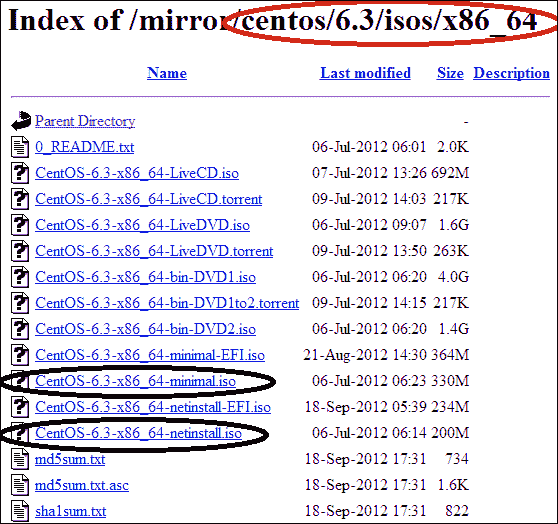
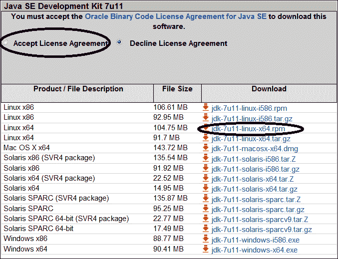

# 第二章准备 Hadoop 安装

在本章中，我们将介绍：

*   为群集节点选择硬件
*   设计群集网络
*   配置群集管理器计算机
*   创建 kickstart 文件和引导介质
*   安装 Linux 操作系统
*   安装 Java 和其他工具
*   配置 SSH

# 简介

Hadoop 集群的配置是一项系统工程，尤其是其规模大、分布广。 需要在选择合适的存储和计算硬件、设计互连网络、安装和配置操作系统等方面下功夫。

在 Hadoop 群集中，不同类型的节点可能需要不同的硬件配置。 例如，**主**节点上的**JobTracker**调度作业并将任务分配给适当的**从**节点执行，而主节点上的**NameNode**管理文件和数据块的元数据。 此外，主节点是默认群集配置中的关键故障点，默认群集配置仅配置一个主节点。 对主节点的一个关键要求是响应和可靠。 另一方面，从节点负责托管数据块并在数据块上运行任务。 由于内置的群集级故障恢复能力，对从节点的可靠性要求不像主节点那么严格。 但是从节点应该有足够的存储空间和计算能力来满足存储和计算需求。

同样，不同的 Hadoop 群集大小可能有不同的配置要求。 例如，对于最多有 100 个从节点的中小型集群，NameNode、JobTracker 和 Second daryNameNode 守护进程可以放在同一台主计算机上。 当集群大小增长到数百个甚至数千个从节点时，建议将这些守护进程放在不同的机器上。 在本书中，我们假设构建一个具有 5 个从节点的集群，这使得将 NameNode、JobTracker 和 Second daryNameNode 守护进程放在同一台物理机上是合理的。

Hadoop 群集中的节点通过交换机和路由器等网络设备互连。 在 MapReduce 作业的不同阶段，数据将通过网络从一个节点传输到另一个节点。 影响 Hadoop 集群性能的因素有很多，其中一些因素的影响比其他因素更大。 例如，设备故障导致的网络分段会大大降低集群的性能，而网络速度和时延对集群性能的影响相对较小。 因此，高可用性和弹性的网络体系结构对于 Hadoop 群集至关重要。

Hadoop 在 Linux 上运行(虽然支持 Windows 操作系统，但在撰写本书时它仍然不稳定)。 在 Hadoop 安装过程之前，我们需要在所有集群节点上安装和配置 Linux。 如果您有使用 Linux 的经验，您可能知道按照安装说明在一台机器上安装 Linux 是很简单的。 例如，我们可以将下载的操作系统 ISO 映像刻录到 DVD 光盘上，然后使用此 DVD 引导和安装操作系统。 但是，这种简单直接的安装方法效率太低，不适用于具有大量节点的 Hadoop 集群。 在本章中，我们将探索更实用、更高效的安装方法。

安装 Linux 操作系统后，需要进行一些操作系统配置。 例如，我们需要配置用户、组和系统安全性，如防火墙和 SELinux。 我们还需要安装所需的 Hadoop 依赖软件 Java，以及一些可以提高集群管理效率的可选工具。

# 为群集节点选择硬件

Hadoop 集群包含两种类型的节点：主节点和从节点。 默认情况下，NameNode、Second daryNameNode 和 JobTracker 守护进程驻留在主节点上，DataNode 和 TaskTracker 守护进程驻留在从节点上。 为这些计算和存储节点正确选择硬件可以最大限度地提高 Hadoop 群集的效率。 在本食谱中，我们将列出有关计算节点硬件选择的建议。

## 怎么做……

尽管对主节点和从节点有特殊要求，但没有为这两种类型的节点选择最佳硬件的黄金标准。 可以说，硬件配置与待处理大数据的属性密切相关。 此外，随着 Hadoop 群集需求的变化，硬件的选择是一个经验性和适应性的过程。 例如，如果对 Hadoop 集群的吞吐量要求很高，我们可能需要选择高端 CPU 和硬盘。 如果我们有大量潜在的 Hadoop 用户，我们可能需要升级主节点和从节点的硬件配置。

根据经验，我们建议中小型 Hadoop 群集使用以下配置：

<colgroup><col style="text-align: left"> <col style="text-align: left"> <col style="text-align: left"></colgroup> 
| 

节点类型

 | 

节点组件

 | 

推荐规格

 |
| --- | --- | --- |
| 主节点 | 中央处理机 | 2 个四核，2.0 GHz |
| RAM(主存储器) | 16 GB |
| 硬盘 / 同 hard disk | 2 个 1TB SATA II 7200 rpm 硬盘或固态硬盘* |
| 网卡 | 1Gbps 以太网 |
| 从节点 | 中央处理机 | 2 个四核 |
| RAM(主存储器) | 16 GB |
| 硬盘 / 同 hard disk | 4 个 1TB 硬盘 |
| 网卡 | 1Gbps 以太网*HDD 代表硬盘驱动器，SSD 代表固态驱动器 |

## 它是如何工作的.

在 Hadoop 主节点上，NameNode 将元数据(如每个文件的权限)保存在主内存中。 主节点所需的内存量取决于要创建和跟踪的文件系统对象的数量(例如，文件和数据块副本的数量)。 当群集较大时，内存需求会很高。 Second daryNameNode 为从 NameNode 镜像的最新文件系统检查点保留备份，因此其内存需求与 NameNode 相似。

### 提示

在默认配置中，主节点是单个故障点。 建议采用高端计算硬件和二次电源。

在 Hadoop 中，每个从节点同时执行多个 map 或 duce 任务。 并行映射/还原任务的最大数量称为映射/还原槽，Hadoop 管理员可以对其进行配置。 每个插槽都是一个由 CPU、内存和磁盘 I/O 资源组成的计算单元。 当 JobTracker 为从节点分配任务时，其 TaskTracker 将为该任务分叉 JVM，分配预先配置的计算资源量。 此外，每个派生的 JVM 还会产生一定的内存需求。 根据经验，Hadoop 作业可能会消耗每个 CPU 核心 1 GB 到 2 GB 的内存。 对于大多数 Hadoop 作业，更高的数据吞吐量要求可能会导致更高的 I/O 操作。 这就是为什么高端和并行硬盘可以帮助提升集群性能。 要最大限度地提高并行度，建议为每个 CPU 核心分配两个插槽。 例如，如果我们的从节点有两个四核 CPU，我们可以为该节点总共分配`2 x 4 x 2 = 16`个插槽(仅映射、仅减少或两者都分配)。

### 提示

在简单的等式中，第一个`2`表示从节点的 CPU 数，数字`4`表示每个 CPU 的核数，另一个`2`表示每个 CPU 核的插槽数。

## 另请参阅

*   [第 2 章](2.html "Chapter 2. Preparing for Hadoop Installation")、*《为 Hadoop 安装做准备]中的*设计群集网络*配方*
*   [第 4 章](4.html "Chapter 4. Managing a Hadoop Cluster")，*管理 Hadoop 群集*中的*管理 HDFS 群集*配方
*   [第 7 章](7.html "Chapter 7. Tuning a Hadoop Cluster for Best Performance")，*调整 Hadoop 群集以获得最佳性能*

# 集群网络设计

该网络是 Hadoop 群集的主干。 它的稳定性对集群的性能至关重要。 在本食谱中，我们将概述一些设计 Hadoop 集群网络的一般规则。

## 怎么做……

中小型群集的网络体系结构可以简单到只需将群集节点与一台或多台交换机连接起来。 连接冗余可以增加网络的可靠性。

### 提示

**警告！**

Hadoop 集群中的计算节点应该配置在同一网段内(**局域网**(**LAN**))。 不建议使用可能导致开销的高级功能，例如 VLAN。 也不建议使用路由器连接节点。

具有数百或数千个节点的 Hadoop 集群的网络体系结构要复杂得多。 在大型集群中，物理节点通常非常小，例如刀片服务器，它们可以安装在机架上。 每个机架都有一个本地交换机，用于互连同一机架上的节点。 然后，这些机架与更先进的交换机互连。

同一机架上的节点可以与 1 Gbps(千兆字节/秒)以太网交换机互连。 然后，群集级别交换机将机架交换机与更快的链路(例如 10 Gbps 光纤链路)和其他网络(例如 InfiniBand)连接起来。 群集级交换机还可以与其他群集级交换机互连，甚至上行链路到另一更高级别的交换基础设施。 随着集群规模的不断增大，网络也将变得越来越大、越来越复杂。 网络高可用性的连接冗余也会增加其复杂性。 在本书中，我们假定讨论基本的网络架构设计方法。 如果您想了解更多先进的网络设计技术，请参考相关书籍和在线材料。

一般来说，中型集群的网络架构可以用下图来描述：


在此图中，我们假设有一台 Hadoop 集群管理员机器，客户端通过网关连接到集群，通过该网关可以提交 Hadoop 作业。

## 它是如何工作的.

随着网络设备带宽的增加，Hadoop 可以跨互联节点加载和复制大型数据集。 弹性和可扩展的网络架构可以确保 Hadoop 群集的高数据吞吐量和性能要求。

# 配置集群管理器计算机

正如我们前面提到的，在大量机器上安装 Linux 最有效的方式是通过网络安装。 在本书中，我们假设使用管理员计算机作为安装服务器。 我们将学习配置此服务器的步骤，包括配置以下两项服务：DHCP 和 FTP。

## 做好准备

在开始之前，我们假设集群管理员机器已经安装了 64 位 Red Hat 兼容的 Linux 操作系统。 机器的主机名是`hadoop.admin`，并且已经创建了管理用户`hdadmin`。 该用户应该具有安装软件包、配置系统服务等的`sudo`权限。 我们还假设此计算机上已安装命令行文本编辑器等管理工具。 我们将在接下来的食谱中直接使用这些工具和命令。

### 提示

在本书中，我们假设使用**CentOS 6.3**(对应于 Red Hat Enterprise Linux(RHEL)6.3)作为 Linux 发行版。 我们将对所有管理命令遵循 Red Hat 语法。 如果您使用的是 CentOS 以外的 Linux 发行版，如 Debian，请参考相应的文档。

1.  以`hdadmin`身份登录到管理员计算机，并使用以下命令更改计算机的主机名：

    ```sh
    sudo sed -i 's/^HOSTNAME.*$/HOSTNAME=hadoop.admin/'/etc/sysconfig/network

    ```

2.  Create directories with the following command:

    ```sh
    mkdir -v ~/mnt ~/isoimages ~/repo

    ```

    ### 提示

    我们将使用目录`~/mnt`作为 ISO 映像的挂载点。 `~/isoimages`目录将用于包含原始镜像文件，`~/repo`目录将用作网络安装的存储库文件夹。

3.  Install the DHCP and FTP servers on the machine with the following commands:

    ```sh
    sudo yum –y install dhcp
    sudo yum -y install vsftpd

    ```

    ### 提示

    我们将在安装过程中使用 DHCP 服务器分配 IP 地址和引导操作系统，并使用 FTP 服务器托管安装包。

4.  Download the latest ISO image from a mirror.

    ### 提示

    CentOS 官网提供全球镜像列表，包括北美、欧洲国家、南美、亚洲、大洋洲、中东、非洲等地区。

    选择最近的镜像后，我们可以使用 HTTP 或 FTP 下载镜像。 让我们通过单击所选镜像对应行中的链接来选择 FTP 作为下载方法。 然后依次选择**6.3**|**isos**|**x86_64**。 在这个目录中，如下面的截图所示，我们选择下载两个 ISO 镜像文件。 镜像文件`CentOS-6.3-x86_64-minimal.iso`包含所有必要的安装包。 `CentOS-6.3-x86_64-netinstall.iso`镜像文件包含用于通过网络引导的 PXE 网络引导文件。

    

    ### 提示

    如果您不确定集群机器的架构，请参考产品硬件菜单。

    或者，我们可以使用以下`rsync`来下载镜像：

    ```sh
    rsync rsync://mirror.its.dal.ca/centos/6.3/isos/x86_64/CentOS-6.3-x86_64-netinstall.iso ~/isoimages

    ```

    我们也可以使用以下`wget`命令下载镜像文件：

    ```sh
    wget http://mirror.its.dal.ca/centos/6.3/isos/x86_64/CentOS-6.3-x86_64-netinstall.iso -P ~/isoimages

    ```

5.  使用以下命令挂载镜像文件：

    ```sh
    sudo mount ~/isoimages/ CentOS-6.3-x86_64-minimal.iso ~/mnt

    ```

6.  使用以下命令将所有文件复制到用于 FTP 托管的`~/repo`目录：

    ```sh
    cp -r ~/mnt/* ~/repo

    ```

7.  Unmount the ISO image with the following command:

    ```sh
    sudo umount ~/mnt

    ```

    最小映像的目录树如下所示：

    ```sh
    ├── EFI
    │ ├── BOOT
    │ │ ├── BOOTX64.conf
    │ │ ├── BOOTX64.efi
    │ │ ├── splash.xpm.gz
    │ │ └── TRANS.TBL
    │ └── TRANS.TBL
    ├── images
    │ ├── efiboot.img
    │ ├── efidisk.img
    │ ├── install.img
    │ ├── TRANS.TBL
    │ └── updates.img
    ├── isolinux
    │ ├── boot.msg
    │ ├── grub.conf
    │ ├── initrd.img
    │ ├── isolinux.bin
    │ ├── isolinux.cfg
    │ ├── memtest
    │ └── vmlinuz
    ├── Packages
    │ ├── ...
    ├── ...

    ```

    `netinstall`镜像的目录树如下所示：

    ```sh
    ├── images
    │ ├── install.img
    │ ├── pxeboot
    │ │ ├── initrd.img
    │ │ ├── TRANS.TBL
    │ │ └── vmlinuz
    │ └── TRANS.TBL
    └── isolinux
     ├── boot.msg
     ├── grub.conf
     ├── initrd.img
     ├── isolinux.bin
     ├── isolinux.cfg
     ├── memtest
     ├── ...
     └── vmlinuz

    3 directories, 16 files

    ```

    ### 提示

    从目录树中我们可以看到，最小安装镜像文件包含用于系统安装的软件包和引导镜像。 `netinstall`软件包仅包含用于引导的文件，包括`images/pxeboot`目录中的网络引导文件。

## 怎么做……

以下配方将解释如何配置 DHCP 服务器：

1.  使用您喜欢的文本编辑器打开文件`/etc/dhcp/dhcpd.conf`并更改以下内容：

    ```sh
    # Domain name
    option domain-name "hadoop.cluster";

    # DNS hostname or IP address
    option domain-name-servers
    dlp.server.world;

    # Default lease time
    default-lease-time 600;

    # Maximum lease time
    max-lease-time 7200;

    # Declare the DHCP server to be valid.
    authoritative;

    # Network address and subnet mask
    subnet 10.0.0.0 netmask 255.255.255.0 {

    # Range of lease IP address, should be based 
        # on the size of the network 
        range dynamic-bootp 10.0.0.200 10.0.0.254;

        # Broadcast address
        option broadcast-address 10.0.0.255;

        # Default gateway
        option routers 10.0.0.1;
    }
    ```

2.  Start the DHCP server with the following command:

    ```sh
    sudo service dhcpd start

    ```

    ### 备注

    DHCP 服务器启动时会显示以下消息：

    **启动 dhcpd：[确定]**

3.  使 DHCP 服务器在系统重新启动后继续运行：

    ```sh
    sudo chkconfig dhcpd --level 3 on

    ```

使用下面的配方配置 FTP 服务器：

1.  使用您喜欢的文本编辑器打开文件`/etc/vsftpd/vsftpd.conf`，并根据以下列表更改内容：

    ```sh
    # The FTP server will run in standalone mode. 
    listen=YES

    # Use Anonymous user. anonymous_enable=YES

    # Disable change root for local users. 
    chroot_local_user=NO
    # Disable uploading and changing files. 
    write_enable=NO

    # Enable logging of uploads and downloads.
    xferlog_enable=YES

    # Enable port 20 data transfer. connect_from_port_20=YES

    # Specify directory for hosting the Linux installation packages.
    anon_ropot=~/repo
    ```

2.  Start the FTP server with the following command:

    ```sh
    $ sudo service vsftpd start

    ```

    ### 备注

    服务器将启动，并显示以下消息：

    **正在启动 vsftpd：[确定]**

3.  Verify the FTP configuration with the following command:

    ```sh
    $ ftp hadoop.admin

    ```

    ### 备注

    如果我们收到以下消息，则配置成功：

    **正在尝试 10.0.0.1...。**

    **已连接到 hadoop.admin(10.0.0.1)。**

    **220(vsFTPd 3.0.0)**

    **名称(nowesis157：hdadmin)：**

## 另请参阅

*   在[第 2 章](2.html "Chapter 2. Preparing for Hadoop Installation")，*准备 Hadoop 安装*中的*创建 kickstart 文件和引导介质*配方。
*   [第 2 章](2.html "Chapter 2. Preparing for Hadoop Installation")，*《为 Hadoop 安装做准备》中的*安装 Linux 操作系统*配方*。

# 创建 kickstart 文件和引导介质

在具有 kickstart 文件的大量节点上安装 Linux 有几个好处。 例如，通过指定要安装的软件包列表并为安装后过程配置系统设置，可以自动执行安装过程。

在本节中，我们将介绍使用操作系统映像创建 kickstart 文件和 USB 引导介质的步骤。

## 做好准备

Kickstart 文件是用于自动安装 Linux 的纯文本文件。

1.  Prepare a USB flash drive with storage capacity larger than 512MB. The drive should have a single `vfat` filesystem partition. We can use the following command to check the filesystem type:

    ```sh
    blkid

    ```

    ### 备注

    我们应该会看到类似以下内容的消息：

    **/dev/sdb1 SEC_TYPE=“MSDOS”LABEL=“LIVE”UUID=“07D9-051C”type=“vFAT”**

2.  如果`TYPE`属性不是`vfat`，请使用以下命令清除驱动器的前几个块：

    ```sh
    dd if=/dev/zero of=/dev/sdb1 bs=1M count=100

    ```

3.  使用以下命令登录到管理计算机：

    ```sh
    ssh hdadmin@hadoop.admin

    ```

## 怎么做……

我们将使用以下步骤创建 kickstart 文件：

1.  使用以下命令安装`kickstart`文件：

    ```sh
    sudo yum install system-config-kickstart

    ```

2.  使用您喜欢的文本编辑器创建包含以下内容的`ks.cfg`文件：

    ```sh
    #!/bin/bash
    # Kickstart for CentOS 6.3 for Hadoop cluster.

    # Install system on the machine.
    install

    # Use ftp as the package repository 
    url --url ftp://hadoop.admin/repo

    # Use the text installation interface.
    text

    # Use UTF-8 encoded USA English as the language. 
    lang en_US.UTF-8

    # Configure time zone. 
    timezone America/New_York

    # Use USA keyboard. 
    keyboard us

    # Set bootloader location.
    bootloader --location=mbr --driveorder=sda rhgb quiet

    # Set root password
    rootpw  --password=hadoop

    ################################
    # Partion the hard disk
    ################################

    # Clear the master boot record on the hard drive. 
    zerombr yes 

    # Clear existing partitions. 
    clearpart --all --initlabel

    # Create /boot partition, size is in MB.
    part /boot --fstype ext3 --size 128 

    # Create / (root) partition. 
    part / --fstype ext3 --size 4096 --grow --maxsize 8192

    # Create /var partition. 
    part /var --fstype ext3 --size 4096 --grow --maxsize 8192 

    # Create Hadoop data storage directory.
    part /hadoop --fstype ext3 --grow

    # Create swap partition, 16GB, double size of the main memory. 
    # Change size according to your hardware memory configuration. 
    part swap --size 16384

    #################################
    # Configure Network device. 
    #################################

    # Use DHCP and disable IPv6.
    network --onboot yes --device eth0 --bootproto dhcp --noipv6

    # Disable firewall.
    firewall --disabled

    # Configure authorization. 
    authconfig --enableshadow

    # Put Selinux in permissive mode. 
    selinux --permissive

    ############################################
    # Specify packages to install. 
    ############################################

    # Automatically resolve package dependencies, 
    # exclude installation of documents and ignore missing packages. 
    %packages --resolvedeps --excludedocs --ignoremissing 

    # Install core packages. 
    @Base

    # Don't install OpenJDK. 
    -java

    # Install wget. 
    wget

    # Install the vim text editor. 
    vim

    # Install the Emacs text editor. 
    emacs

    # Install rsync.
    rsync

    # install nmap network mapper. 
    nmap

    %end

    ####################################
    # Post installation configuration.
    ####################################

    # Enable post process logging. 
    %post --log=~/install-post.log

    # Create Hadoop user hduser with password hduser. 
    useradd -m -p hduser hduser

    # Create group Hadoop. 
    groupadd hadoop

    # Change user hduser's current group to hadoop. 
    usermod -g hadoop hduser

    # Tell the nodes hostname and ip address of the admin machine. 
    echo "10.0.0.1 hadoop.admin" >> /etc/hosts

    # Configure administrative privilege to hadoop group. 

    # Configure the kernel settings.
    ulimit -u

    #########################
    # Startup services. 
    #########################

    service sshd start
    chkconfig sshd on

    %end

    # Reboot after installation. 
    reboot 

    # Disable first boot configuration. 
    firstboot --disable
    ```

3.  Put the kickstart file into the root directory of the FTP server with the command:

    ```sh
    cp ks.cfg ~/repo

    ```

    这将使 kickstart 文件在安装过程中可用。

现在，我们将使用以下配方创建 USB 引导介质：

1.  使用文本编辑器打开文件`~/isolinux/grub.conf`并添加以下内容：

    ```sh
    default=0
    splashimage=@SPLASHPATH@
    timeout 0
    hiddenmenu
    title @PRODUCT@ @VERSION@
     kernel @KERNELPATH@ ks=ftp://hadoop.admin/ks.cfg
     initrd @INITRDPATH@

    ```

2.  使用以下命令从`isolinux`目录创建 ISO 文件：

    ```sh
    mkisofs -o CentOS6.3-x86_64-boot.iso \
    -b ~/repo/isolinux/isolinux.bin \
    -c ~/repo/isolinux/boot.cat \
    -no-emul-boot \
    -boot-load-size 4

    ```

3.  Plug in a USB flash drive on the administrator machine and write the bootable ISO image into the USB flash drive with the following command (assuming the USB drive corresponds to the `/dev/sdb` device file):

    ```sh
    dd if=~/CentOS6.3-x86_64-boot.iso of=/dev/sdb

    ```

    ### 提示

    **警告！**

    请确保您有 USB 闪存驱动器上数据的备份，当我们将 ISO 映像文件写入驱动器时，所有信息都将被擦除。

## 它是如何工作的.

Kickstart 文件指定许多安装选项，例如安装介质、网络配置、防火墙配置等。 以`#`开头的行将被视为注释。

该文件包含`%packages`部分，该部分指定要安装的软件包。 在本节中，可以指定要安装的特定程序包和程序包组。 例如，在我们的 kickstart 文件中，我们配置为使用`@Base`安装 Linux 基本软件包。 此外，如果不打算安装某个软件包，我们可以在该软件包之前添加一个破折号。 例如，如果我们不想安装 OpenJDK，我们可以用`-java`指定。

### 提示

对于 Hadoop 集群，基本包就足够了，因此我们忽略了 kickstart 文件中不必要的包。

`%post`部分允许我们在安装后指定配置和命令。 当我们需要在安装操作系统后进行一些管理配置时，这非常有用。 例如，我们可能希望为 Hadoop 创建一个常规用户，该用户具有运行 Hadoop 命令和配置 SSHD 和 FTP 等系统服务的权限。

USB 引导介质用于引导系统并自动启动安装过程。 我们可以在`grub.conf`文件中指定以下内核启动选项：

```sh
ks=ftp://hadoop.admin/ks.cfg

```

此选项告知 kickstart 文件的位置。 找到 kickstart 文件并将其传输到本地计算机后，将开始自动安装。

## 还有更多...

除了 FTP 之外，还有其他安装方法，例如，我们也可以使用 NFS 和 HTTP。 这些方法与 FTP 的区别只在于对应的存储库 URL 的配置不同。 例如，如果我们要使用 HTTP 服务器，可以在配置中进行以下两个更改：

*   在 kickstart 文件中，将`url --url ftp://hadoop.admin/repo`更改为`url --url http://hadoop.admin:80/repo`。
*   在`grub.conf`文件中，将内核选项从`ks=ftp://hadoop.admin/ks.cfg`更改为`ks=http://hadoop.admin:80/ks.cfg`。

## 另请参阅

*   [第 2 章](2.html "Chapter 2. Preparing for Hadoop Installation")，*《为 Hadoop 安装做准备》中的*安装 Linux 操作系统*配方*

# 安装 Linux 操作系统

虽然有多种方法可以在机器上安装 Linux，但借助 kickstart 文件通过网络进行安装是最有效的选择。 安装过程可以自动化，只需要最少的人工干预。 Kickstart 文件可以保存在服务器上，并在安装过程中由各个机器读取。 在配方中，我们将概述在网络上的许多 Hadoop 节点上安装 Linux 的步骤。

## 做好准备

在开始之前，我们需要验证 DHCP 服务器和 FTP 服务器是否在管理计算机上正常运行。

在管理员计算机上使用以下命令检查 DHCP 服务器是否工作正常：

```sh
ps -ef | grep dhcp

```

如果该命令输出非空，则表示正常工作，否则需要使用以下命令启动服务：

```sh
sudo service dhcpd start

```

同样，可以使用以下命令检查管理员计算机上的 FTP 服务器：

```sh
ftp hadoop.admin

```

我们应该能够匿名登录，并在根目录中列出 kickstart 文件和安装包。

此外，我们假设集群节点已经过物理配置。 例如，机架和网络设备都工作正常，没有任何问题。

## 怎么做……

使用以下方法在计算机上安装 Linux：

1.  插入 USB 闪存驱动器引导介质并打开计算机电源。
2.  Press *F9* to select the boot device.

    ### 提示

    不同的 BIOS 版本可能有不同的快捷键。 如果*F9*不起作用，请参考相关产品手册。

3.  从启动设备列表中，选择**USB**或**Removable Devices**。
4.  安装开始后，您可以取出引导介质并在下一台计算机上开始安装。

## 它是如何工作的.

Linux 系统被设计为灵活的。 其引导过程由以下几个阶段组成：

*   打开物理机
*   选择引导介质
*   阶段 1-引导加载程序
*   阶段 2-引导加载程序
*   加载内核镜像
*   系统初始化

在我们开机并选择作为引导介质之后，引导加载程序(在我们的示例中为 GRUB)将开始工作。 GRUB 包含两个引导加载阶段。 在阶段 1 中，可执行程序将运行并加载阶段 2。然后，阶段 2 将加载驻留在引导介质上的内核。 安装操作系统时，内核启动安装过程的功能非常有限，例如，查找软件包的位置。 在我们的示例中，内核选项 kickstart 文件包含安装过程的所有规范。 因此，从 USB 引导介质引导后，一切都将自动完成。

### 提示

将引导介质与安装程序包库分开的一个优点是，可以并行在多台机器上进行安装，以减少总安装时间。

## 还有更多...

在 kickstart 文件的帮助下，我们可以在许多机器上自动安装 Linux。 这种方法的一个缺点是我们需要手动引导每台机器。 这是单调乏味的，需要大量的重复性工作。 更糟糕的是，在现实中，我们可能会发现很多服务器甚至没有安装显示器或视频卡。 这使得使用此方法不切实际。 因此，我们需要探索替代方法。

在本部分中，我们将介绍在 DHCP 和 TFTP 服务器的帮助下自动执行安装过程的步骤。 DHCP 服务器被配置为引导服务器，其功能类似于 USB 驱动器引导介质，而 TFTP 被配置为托管实际的操作系统软件包。

### 为网络引导配置 DHCP

我们在上一节中提到了DHCP 服务器的基本配置。 要启用 DHCP 的网络引导，我们将使用 TFTP 的**预引导执行环境**(**PXE**)方法。

创建包含以下内容的 DHCP 配置文件`/etc/dhcpd.conf`：

```sh
option domain-name "hadoop.cluster";

default-lease-time 5000;

max-lease-time 7200;

# Enable network booting and bootp protocol. 
allow booting;
allow bootp;

# IP address allocations.
subnet 10.0.0.0 netmask 255.255.255.0 {

  range 10.0.0.200 10.0.0.253;

  option broadcast-address 10.0.0.255;

  # Gateway address
  option routers 10.0.0.1;

  # indicate the dns you want to use
  option domain-name-servers 10.0.0.1;
}

group {
  next-server 10.0.0.1;

  host tftpclient {

  # tftp client hardware address
  hardware ethernet  00:10:DC:27:6C:15;

  filename "/pxelinux.0";
 }
}
```

### 为网络引导配置 TFTP：

1.  使用以下命令登录到管理员计算机：

    ```sh
    ssh hdadmin@hadoop.admin

    ```

2.  使用以下命令安装 TFTP 服务器：

    ```sh
    sudo yum install tftpd

    ```

3.  Open the file `/etc/xinetd.d/tftpd` with your favorite text editor and edit the content to be similar to the following:

    ```sh
    service tftp
    {
        socket_type  = dgram
        protocol     = udp
        wait         = yes
        user         = hdadmin
        server       = /usr/sbin/in.tftpd
        server_args  = -c -s /tftpboot
        disable      = no
        per_source   = 11
        cps          = 100 2
    } 
    ```

    ### 备注

    在此文件中，我们通过将`disable`原语设置为`no`来启用 TFTP 服务。

4.  使用以下命令创建 TFTP 引导镜像目录：

    ```sh
    mkdir -p ~/tftp/boot/centos6.3

    ```

5.  使用以下命令挂载 Net Install ISO 映像：

    ```sh
    sudo mount ~/isoimages/CentOS-6.3-x86_64-netinstall.iso ~/mnt

    ```

6.  使用以下命令将 PXE 引导文件复制到引导镜像目录：

    ```sh
    cp ~/mnt/images/pxeboot/* ~/tftp/boot/centos6.3

    ```

7.  使用以下命令启动 TFTP 服务器：

    ```sh
    sudo service tftpd start

    ```

8.  Test the TFTP configuration with the following command:

    ```sh
    tftp hadoop.admin

    ```

    ### 提示

    如果我们可以登录并列出文件，则 TFTP 配置正确。

9.  通过打开群集机器的电源开始安装过程。

# 安装 Java 等工具

Hadoop 是使用 Java构建的，因此在安装 Hadoop 之前需要 Java。

## 做好准备

在 Linux 下，OpenJDK 提供了一个开源的 Java 实现。 但是如果我们使用 OpenJDK for Hadoop，就会造成层次低、解决困难的问题。 因此，不建议将 OpenJDK 用于 Hadoop 安装。 相反，建议使用 Oracle 的 Java。

1.  Check if OpenJDK has been installed in the system with the command:

    ```sh
    rpm –qa | grep openjdk

    ```

    ### 提示

    如果没有给出输出，则表示尚未安装 OpenJDK。

2.  如果系统中安装了 Java，我们可以使用

    ```sh
    java -version

    ```

    检查它的版本
3.  如果使用 OpenJDK，我们应该能够得到类似于以下内容的输出：

    ```sh
    java version "1.7.0_09-icedtea"
    OpenJDK Runtime Environment (fedora-2.3.4.fc17-x86_64)
    OpenJDK 64-Bit Server VM (build 23.2-b09, mixed mode)

    ```

4.  在确认我们是否使用 OpenJDK 之后，我们需要删除该软件包并重新安装从 Oracle 官网下载的版本。
5.  To remove OpenJDK, we can use the following command:

    ```sh
    sudo yum uninstall java-1.x.y-openjdk

    ```

    在此命令中，`1.x.y`是要删除的 OpenJDK 版本，例如 1.7.0。

    ### 提示

    **警告！**

    此命令可能具有破坏性，特别是在安装了一些相关软件包的情况下。 在这种情况下，它将提示您确认删除 OpenJDK 以及相关的软件包。 如果您不想删除所有软件包，请对问题回答**no**。

6.  Alternatively, we can use the following `rpm` command to remove the package:

    ```sh
    sudo rpm -e java-1.x.y-openjdk

    ```

    此命令将仅删除 OpenJDK 软件包，而不考虑依赖的软件包。

    ### 提示

    请注意，此命令可能会破坏软件包依赖关系，导致依赖软件无法正常工作。

7.  作为另一种替代方法，我们可以调整`PATH`环境变量，让两个 Java 版本在系统上共存，同时让系统更喜欢来自 Oracle 的 Java。
8.  Suppose we have both OpenJDK and Oracle Java installed in `/usr/openjdk` and `/usr/jdk` respectively. We can set the `PATH` environment variable to be the following:

    ```sh
    PATH=/usr/jdk/bin:/usr/openjdk/bin:$PATH

    ```

    或者，如果我们只想使用 Oracle Java，可以将路径设置为：

    ```sh
    PATH=/usr/jdk/bin:$PATH

    ```

9.  要从甲骨文下载 JAVA，请访问：[http://www.oracle.com/technetwork/java/javase/downloads/index.html](http://www.oracle.com/technetwork/java/javase/downloads/index.html)。
10.  选择**Java SE Development Kit 7 Downloads**，即 Java 1.7.x(Hadoop 可以使用版本高于或等于 1.6.0 的 Java)。
11.  接下来，单击**Accept License Agreement**单选按钮，并为 64 位 Linux 计算机选择**jdk-7u11-linux-x64.rpm**。
12.  The preceding operations are shown in the following screenshot:

    

## 怎么做……

使用以下配方安装 Java 和其他工具：

1.  使用以下命令安装 Oracle Java(假设我们将下载的 Java 包保存到主目录：

    ```sh
    sudo yum localinstall ~/java-package-*.rpm

    ```

2.  Verify the installation with the following command:

    ```sh
    java –version

    ```

    如果正确安装了 Java，则输出应与以下内容类似：

    ```sh
    java version "1.6.0_33"
    Java(TM) SE Runtime Environment (build 1.6.0_33-b04)
    Java HotSpot(TM) 64-Bit Server VM (build 20.8-b03, mixed mode)

    ```

3.  Use the following command to install necessary tools:

    ```sh
    sudo yum –y install wget rsync nmap

    ```

    ### 提示

    如果已在安装启动文件中指定了这些软件包，则此步骤将是可选的。

## 它是如何工作的.

GNU`wget`是软件工具，用于使用 HTTP、HTTPS 和 FTP 协议传输文件。 它不是交互式的，可以从命令行和脚本下载文件。 有关更多信息，请访问[http://www.gnu.org/software/wget/](http://www.gnu.org/software/wget/)。

`rsync`是一个提供快速增量文件传输的开源工具。 它被广泛用于 Linux 下的文件复制和同步。 有关 rsync 的更多信息，请访问[http://rsync.samba.org/](http://rsync.samba.org/)。

**Network Mapper**(**nmap**)是著名的网络探测和安全审计工具。 我们可以使用 nmap 扫描大型网络并识别安全问题。 例如，要扫描本地计算机上的服务，可以使用以下命令：

```sh
nmap localhost

```

我们得到类似于以下内容的输出：

```sh
Starting Nmap 6.01 ( http://nmap.org ) at 2013-01-26 23:52 EST
Nmap scan report for localhost (127.0.0.1)
Host is up (0.0021s latency).
rDNS record for 127.0.0.1: localhost.localdomain
Not shown: 995 closed ports
PORT    STATE SERVICE
21/tcp  open  ftp
22/tcp  open  ssh
25/tcp  open  smtp
111/tcp open  rpcbind
631/tcp open  ipp

Nmap done: 1 IP address (1 host up) scanned in 0.14 seconds

```

### 备注

输出告诉我们本地机器正在运行以下服务：`ftp`、`ssh`、`smtp`、`rpcbind`(远程过程调用服务)和`jpp`(Java 打包服务)。

同样，我们可以使用以下命令扫描 IP 段`10.0.1.*`：

```sh
nmap 10.0.0.*

```

该命令将为我们提供从`10.0.0.1`到`10.0.0.255`的 IP 网段下每台主机的服务信息。

## 还有更多...

在 Linux 下，我们可以使用`man`命令来获取命令的用法。 例如，要获得`wget`的用法，我们可以使用`man wget`。

如果需要有关命令的更详细信息，我们可以使用`info`命令。 例如，命令`info wget`提供了有关`wget`命令的更多详细信息。

# 配置 SSH

SSH 是用于安全数据连接和远程命令执行的事实上的标准协议。 安装 Hadoop 需要正确配置 SSH。 在本节中，我们将学习如何在集群节点上配置 SSH。 具体地说，我们正在讨论如何配置 SSH 以无密码登录到远程计算机。

## 做好准备

使用以下命令在所有集群节点(包括从节点和主节点)上启动 sshd 服务：

```sh
sudo service sshd start

```

使用以下命令使服务在系统重新启动后仍然有效：

```sh
sudo chkconfig sshd on

```

验证`sshd`是否与主节点的命令一起正常工作：

```sh
ssh hduser@slave1

```

如果是首次登录主机，我们将收到类似以下内容的消息：

```sh
The authenticity of host 'hdslave.host(10.0.0.1)' can't be established.
RSA key fingerprint is 7c:e0:61:3b:b6:70:07:ab:65:f9:bf:2d:90:77:1b:57.
Are you sure you want to continue connecting (yes/no)?

```

我们需要键入`yes`，然后提供用户`hduser`登录到主机的密码。

## 怎么做……

使用下面的配方配置无密码登录：

1.  使用以下命令从集群管理员机器登录到主节点：

    ```sh
    ssh hduser@master

    ```

2.  Use a text editor to modify the SSHD service configuration file `/etc/ssh/ssh_config` by changing the following line:

    ```sh
    #   StrictHostKeyChecking ask
    ```

    致：

    ```sh
    StrictHostKeyChecking no
    ```

3.  使用以下命令重新启动 sshd 服务器：

    ```sh
    sudo service sshd restart

    ```

4.  Generate private and public keys with the command:

    ```sh
    ssh-keygen

    ```

    按*输入*三次，直到该命令结束。 将生成公钥文件`~/.ssh/id_rsa.pub`和私钥文件`~/.ssh/id_rsa`。

5.  使用以下命令将公钥文件复制到远程计算机：

    ```sh
    ssh-copy-id slave1

    ```

6.  Test the configuration with the following command:

    ```sh
    ssh hduser@slave1

    ```

    ### 备注

    如果我们无需输入密码即可登录，则配置成功！

## 它是如何工作的.

当我们运行命令`ssh-copy-id hdslave.host`时，我们实际上将本地计算机上的公钥文件的内容附加到远程计算机上的文件`~/.ssh/authorized_keys`中。 下次登录时，远程机器上文件`~/.ssh/authorized_keys`中的公钥字符串和本地私钥将用于登录身份验证过程。

## 还有更多...

无密码登录失败的配置可能由许多原因引起，例如，防火墙(更具体地说，是 iptables)、SELinux 的配置，甚至是 SSHD 服务器本身的配置。 我们将讨论处理这些潜在问题的方法。

### 错误的 SSH 设置

如果`/etc/ssh_config`文件包含以下行：

```sh
RSAAuthentication no
PubkeyAuthentication no

```

表示已禁用公钥授权。 我们需要将这两行更改为以下内容：

```sh
RSAAuthentication yes
PubkeyAuthentication yes

```

使用以下命令确保已在远程计算机上成功重新启动 sshd 服务：

```sh
sudo service sshd restart

```

手动检查远程主机上的`~/.ssh/authorized_hosts`文件，并查看是否附加了本地计算机的公钥字符串。 如果没有，我们可以使用以下命令将本地计算机的公钥手动附加到远程计算机上的`~/.ssh/authorized_hosts`：

```sh
scp ~/.ssh/id_rsa.pub hduser@hdslave.host:~/
ssh hduser@hdslave.host -C "cat ~/id_rsa.pub >> ~/.ssh/authorized_hosts"

```

从远程计算机注销并重新登录，如果问题仍然存在，请转到下一节。

### 错误的 iptables 配置

使用以下命令检查`iptables`的状态：

```sh
sudo iptables -L

```

如果未打印任何规则，请转到下一步，否则，请使用以下命令刷新所有现有规则以禁用 iptables：

```sh
sudo iptables -F

```

如果问题仍然存在，请转到下一节。

### SELinux 配置错误

**安全增强型 Linux**(**SELinux**)是Linux 的一项功能，提供支持访问控制安全策略的机制。 处于强制模式的 SELinux 可以阻止无密码登录操作。 我们可以使用以下命令检查当前的 SELinux 状态：

```sh
getenforce

```

如果我们得到类似于以下内容的输出：

```sh
Enforcing

```

输出表示 SELinux 当前处于强制模式，我们需要使用命令将其置于许可模式：

```sh
sudo setenforce 0

```

或者，我们可以通过编辑`/etc/selinux/config`文件来禁用 SELinux，并将`SELINUX=enforcing`更改为`SELINUX=disabled`。 请注意，需要重新启动系统才能使更改在此方法中生效。

## 另请参阅

*   创建 kickstart 文件和引导介质配方