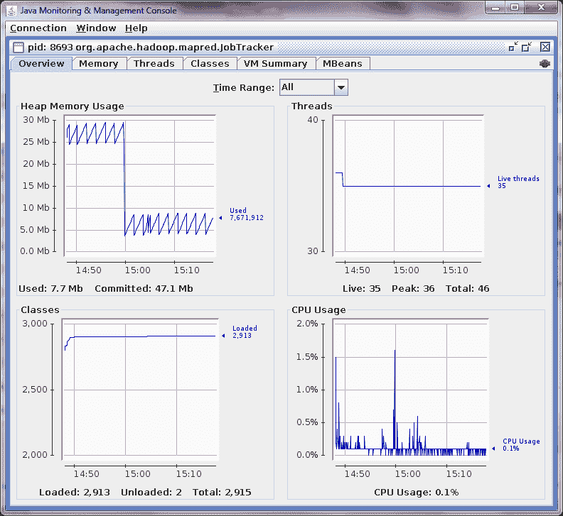
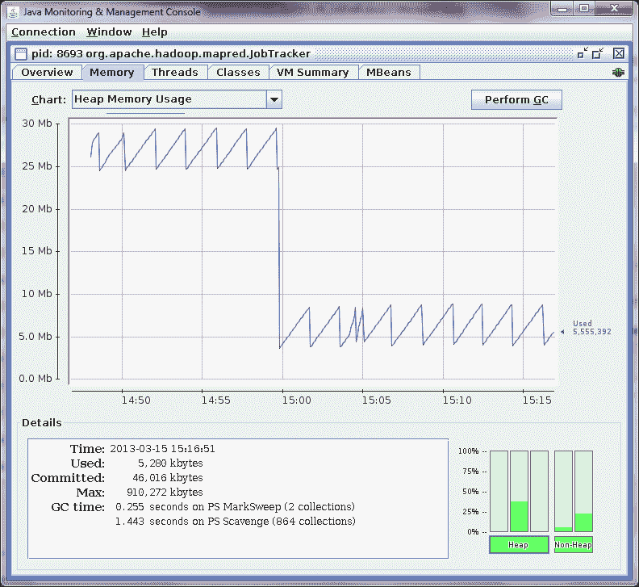
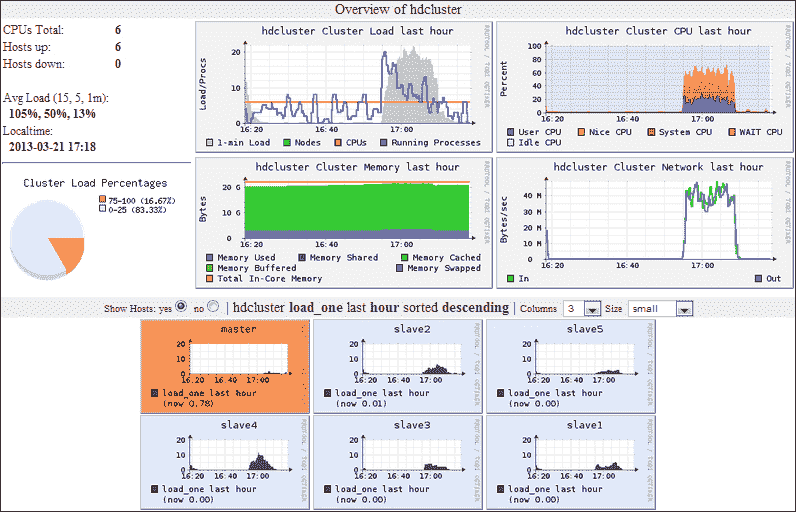
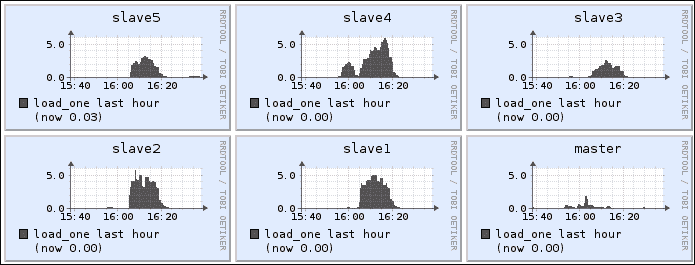
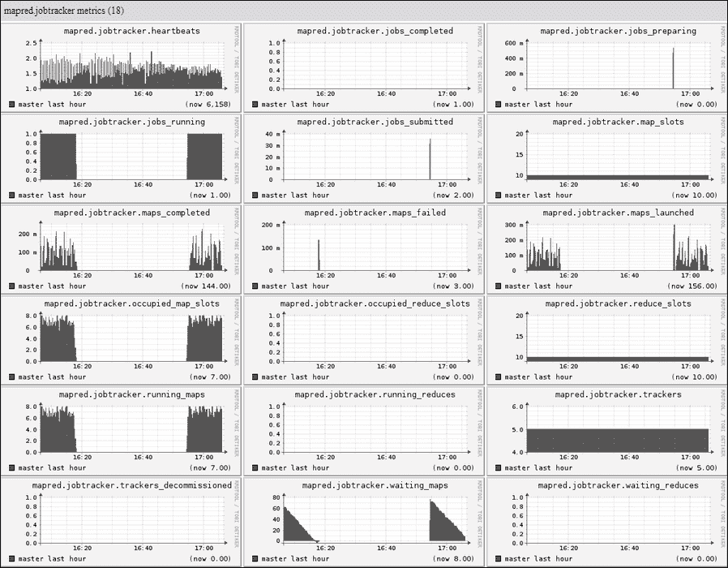
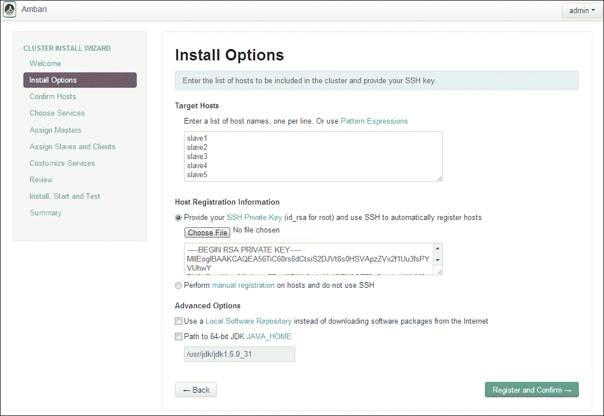
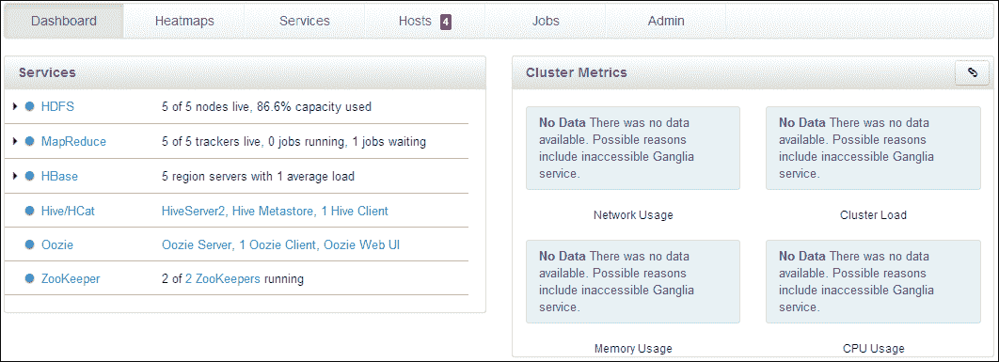
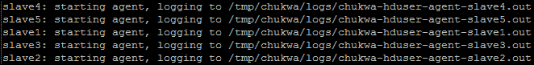

# 六、监控 Hadoop 集群

在本章中，我们将介绍：

*   使用 JMX 监视 Hadoop 集群
*   使用 Ganglia 监视 Hadoop 集群
*   使用 Nagios 监视 Hadoop 集群
*   使用 Ambari 监视 Hadoop 集群
*   使用 Chukwa 监视 Hadoop 集群

# 简介

系统监控对于维护大型分布式系统(如 Hadoop)的健康和可用性至关重要。 常规监控任务包括监控集群节点和网络的健康状况，例如，内存、堆、CPU、网络等的使用情况。 对于 Hadoop 集群，我们可能还需要监视一些特定的指标，例如集群中作业和任务的状态、JobTracker、TaskTracker、NameNode 和 DataNode 的状态。

Hadoop 很幸运地出生在一个开放源码的世界！ 许多非常稳定的开源系统监控工具正在等待加入 Hadoop 大家庭，其中许多系统已经被 Hadoop 用于监控目的。

在本章中，我们将首先介绍用于系统监控的管理框架**Java Management Extension**(**JMX**)。 接下来，我们将介绍两个著名的开源集群监控系统：**Ganglia**和**Nagios**。 Ganglia是一个开源的可伸缩监控系统。 在监视主机上运行的监视守护程序将数据发送到监视服务器主机以进行存储、统计分析和可视化。 Nagios是另一个著名的监控系统。 它使用插件监控集群中的主机。

接下来，我们将介绍特定于 Hadoop 的监视系统**Ambari**和**Chukwa**。 Ambari 旨在成为部署、管理和监控 Hadoop 集群的成熟系统。 它是基于 Ganglia 和 Nagios 的监控框架开发的。 但与 Ganglia 和 Nagios 不同的是，Apache Chukwa 通过分析从 Hadoop 集群收集的系统日志来监控 Hadoop 集群。 Apache**Flume**是另一个用于流式传输数据(如系统日志)的通用数据分析框架。 它可以配置为进行系统监控，这与 Chukwa 类似。

# 使用 JMX 监控 Hadoop 集群

JMX 是 Java 用来构建、监视和管理分布式系统和网络应用的技术。 它已经从**J2SE**Platform 5.0并入 Java。 有关 jmx 的更多信息，请访问官方网站[http://www.oracle.com/technetwork/java/javase/tech/javamanagement-140525.html](http://www.oracle.com/technetwork/java/javase/tech/javamanagement-140525.html)。 在本食谱中，我们将概述使用 JMX 配置 Hadoop 集群监控的步骤。

### 提示

在本章中，我们假设监控 Hadoop 版本 1.1.y 或相应的 0.20.x Hadoop 版本。 监控 Hadoop 版本 2.0.x 或 0.23.x 的配置应该遵循食谱进行一些更改。

## 做好准备

我们假设已经安装了 Oracle JDK，并且我们的 Hadoop 集群已经正确配置，并且所有守护进程都在运行，没有任何问题。

## 怎么做……

使用以下步骤配置 JMX 以监视 Hadoop 集群：

1.  使用以下命令创建用于远程监控的 JMX 密码文件：

    ```sh
    cp $JAVA_HOME/jre/lib/management/jmxremote.password.template $HADOOP_HOME/conf/jmxremote.password

    ```

2.  Open the template password `$HADOOP_HOME/conf/jmxremote.password` file with a text editor and the last few lines of this file will be similar to the following:

    ```sh
    # Following are two commented-out entries.  The “measureRole” role has
    # password “QED”.  The “controlRole” role has password “R&D”.
    #
    # monitorRole  QED
    # controlRole  R&D
    ```

    删除突出显示的两行的注释符号`#`。

    ### 提示

    这两行指定`monitorRole`和`controlRole`的密码。 JMX 将在远程监控中使用它们进行身份验证。

    使用以下命令将密码文件的权限更改为`600`：

    ```sh
    chmod 600 $HADOOP_HOME/conf/jmxremote.password

    ```

    ### 提示

    **警告！**

    如果此文件过于打开，则在启动 Hadoop 集群守护程序时会出现类似以下内容的错误：

    ```sh
    master: Error: Password file read access must be restricted: /usr/local/hadoop/conf/jmxremote.password
    ```

3.  使用文本编辑器打开`$HADOOP_HOME/conf/hadoop-env.sh`文件。
4.  In this file, we will be able to find JMX monitoring configurations for the Hadoop daemons including NameNode, SecondaryNameNode, DataNode, balancer, JobTracker, and TaskTracker. The default configuration will be similar to the following:

    ```sh
    export HADOOP_NAMENODE_OPTS=”-Dcom.sun.management.jmxremote $HADOOP_NAMENODE_OPTS”
    export HADOOP_SECONDARYNAMENODE_OPTS=”-Dcom.sun.management.jmxremote $HADOOP_SECONDARYNAMENODE_OPTS”
    export HADOOP_DATANODE_OPTS=”-Dcom.sun.management.jmxremote $HADOOP_DATANODE_OPTS”
    export HADOOP_BALANCER_OPTS=”-Dcom.sun.management.jmxremote $HADOOP_BALANCER_OPTS”
    export HADOOP_JOBTRACKER_OPTS=”-Dcom.sun.management.jmxremote $HADOOP_JOBTRACKER_OPTS”
    ```

    现在，我们需要通过将原始配置更改为以下内容来配置 Hadoop 守护程序的远程监控端口：

    ```sh
    # Extra Java runtime options. Empty by default.
    export HADOOP_OPTS=”-Dcom.sun.management.jmxremote.authenticate=true -Dcom.sun.management.jmxremote.ssl=false -Dcom.sun.management.jmxremote.password.file=$HADOOP_CONF_DIR/jmxremote.password”

    export HADOOP_NAMENODE_OPTS=”-Dcom.sun.management.jmxremote $HADOOP_NAMENODE_OPTS -Dcom.sun.management.jmxremote.port=8004”
    export HADOOP_SECONDARYNAMENODE_OPTS=”-Dcom.sun.management.jmxremote $HADOOP_SECONDARYNAMENODE_OPTS -Dcom.sun.management.jmxremote.port=8005”
    export HADOOP_DATANODE_OPTS=”-Dcom.sun.management.jmxremote $HADOOP_DATANODE_OPTS -Dcom.sun.management.jmxremote.port=8006”
    export HADOOP_BALANCER_OPTS=”-Dcom.sun.management.jmxremote $HADOOP_BALANCER_OPTS -Dcom.sun.management.jmxremote.port=8007”
    export HADOOP_JOBTRACKER_OPTS=”-Dcom.sun.management.jmxremote $HADOOP_JOBTRACKER_OPTS -Dcom.sun.management.jmxremote.port=8008”
    export HADOOP_TASKTRACKER_OPTS=”-Dcom.sun.management.jmxremote.port=8009”
    ```

5.  Use the following command to start the monitor user interface:

    ```sh
    jconsole

    ```

    我们可以看到一个类似于以下屏幕截图的窗口：

    

    在此窗口中，我们可以检查本地和远程进程的状态。 检查本地进程的状态相对简单。 首先，从进程列表中选择要检查的所需进程。 然后，我们只需单击**连接**按钮。 检查远程进程的状态相对复杂。 我们需要通过指定主机名和端口或协议和 SAP 来指定服务的位置，如屏幕截图所示。 出于验证目的，我们还需要输入**用户名**和**密码**值。 在以下步骤中，我们假设检查本地 JobTracker 进程的状态。

6.  Select the **Local Process** radio button and then click on the **Connect** button. We can get a monitoring window after waiting for a few moments, as shown in the following screenshot:

    

    该窗口显示 JobTracker 的后台进程状态。 在窗口中，我们可以查看内存使用情况、线程、类、JVM 摘要以及 MBean 的详细信息。

7.  Check the memory of the daemon by clicking on the **Memory** tab of the `jconsole` window, and we will get a window similar to the following:

    

    Memory 窗口以时间序列图的形式显示**Heap Memory Usage**页。 在此窗口中，我们可以从不同的图表和时间范围中选择要显示的内容。 窗口的底部是当前内存使用情况的摘要。

8.  By clicking on the **Threads** tab of the window, we can check the running threads of the JobTracker and we can get a window similar to the following screenshot:

    

    窗口的上半部分显示**峰值活动线程数**和当前活动线程数**。 在窗口的下部，我们可以看到一个线程列表，通过单击所需的线程名称可以查看这些线程的信息。**

    **同样，我们可以通过单击窗口的**Classs**选项卡检查当前类，并通过单击窗口的**VM Summary**选项卡检查 JVM 虚拟机的摘要。**

***   The **MBeans** tab is the most informative one if you want to check the status details of the daemon. For example, the following screenshot shows more metrics details for JobTracker:

    

    从该窗口中，我们可以获得多个 JobTracker 指标，例如正在运行的作业的数量、映射和还原插槽的数量以及正在运行的映射和还原任务的数量。** 

 **## 另请参阅

*   *使用 Ganglia*配方监视 Hadoop 集群
*   *使用 Nagios*配方监视 Hadoop 集群
*   *使用 Ambari*配方监视 Hadoop 集群
*   *使用 Chukwa*配方监视 Hadoop 集群
*   参考[http://docs.oracle.com/javase/tutorial/jmx/](http://docs.oracle.com/javase/tutorial/jmx/)
*   请参考[docs.oracle.com/javase/Tutorial/jmx/](http://docs.oracle.com/javase/tutorial/jmx/)

# 使用 Ganglia 监视 Hadoop 集群

**Ganglia**是一个开源、可伸缩的分布式监控系统，用于集群和计算网格。 它有三个主要的组件：**监控守护进程**、**元数据守护进程**和**Web UI**。 在本食谱中，我们将概述为 Hadoop 集群监控配置 Ganglia 的步骤。

## 做好准备

使用以下命令从管理员计算机登录到主节点：

```sh
ssh hdadmin@master

```

使用以下`yum`命令在主计算机上安装 Ganglia：

```sh
sudo yum install -y ganglia-gmond ganglia-gmetad ganglia-web

```

使用以下命令在所有从节点上安装 Ganglia 监视守护进程：

```sh
for host in `cat $HADOOP_HOME/conf/slaves`
do
 echo ‘Installing Ganglia on host ‘ $host
 sudo ssh $host -C “yum install -y ganglia-gmond”
done

```

### 提示

在本配方中，我们假设 Ganglia 服务器将在主节点上运行，监视守护进程在主节点和从节点上运行。

## 怎么做……

使用以下步骤为 Hadoop 集群监视配置 Ganglia：

1.  用文本编辑器打开`gmond`配置文件`/etc/ganglia/gmond.conf`。
2.  将`cluster`属性更改为以下内容：

    ```sh
    cluster {
      name = “hadoop”
      owner = “hduser”
      latlong = “unspecified”
      url = “unspecified”
    }
    ```

3.  将`udp_send_channel`属性更改为以下内容：

    ```sh
    udp_send_channel {
      bind_hostname = yes
      # mcast_join = 239.2.11.71
      host = master
      port = 8649
      ttl = 1
    }
    ```

4.  Change the `udp_recv_channel` attribute to the following:

    ```sh
    udp_recv_channel {
      # mcast_join = 239.2.11.71
      port = 8649
      # bind = 239.2.11.71
    }
    ```

    ### 提示

    Hadoop 支持通过**单播**(使用普通 IP 地址，我们在这里使用的地址)和**多播**(使用多播地址，如`239.2.11.71`)进行网络通信。 要使用组播，所有受监控的主机都应位于同一 IP 网段中。 在本书中，我们假定使用单播。

5.  Add all the hostnames in the cluster to the `gmetad` configuration `/etc/ganglia/gmetad.conf` file, for example, this file should contain the following:

    ```sh
    data_source “hdcluster” master:8649
    ```

    ### 备注

    这里`hdcluster`是 Ganglia 监视的集群的名称，`master:8649`是`gmetad`的网络地址。

6.  Open the `$HADOOP_HOME/conf/hadoop-metrics.properties` file with your favorite text editor and add the following contents into the file:

    ```sh
    jvm.class=org.apache.hadoop.metrics.ganglia.GangliaContext
    jvm.period=10
    jvm.servers=master:8649
    ```

    前三行配置 JVM 监视。

    ```sh
    rpc.class=org.apache.hadoop.metrics.ganglia.GangliaContext
    rpc.period=10
    rpc.servers=master:8649
    ```

    前三行配置 RPC 监视。

    ```sh
    dfs.class=org.apache.hadoop.metrics.ganglia.GangliaContext
    dfs.period=10
    dfs.servers=master:8649
    ```

    前三行配置 HDFS 监视。

    ```sh
    mapred.class=org.apache.hadoop.metrics.ganglia.GangliaContext
    mapred.period=10
    mapred.servers=master:8649
    ```

    前三行配置为监视 MapReduce 指标。

    ```sh
    hbase.class=org.apache.hadoop.metrics.ganglia.GangliaContext
    hbase.period=10
    hbase.servers=master:8649
    ```

    前三行配置监视 HBase 指标。

    ### 提示

    在前面的配置中，我们指定了三个公共参数：`class`、`period`和`servers`。 参数`class`指定 Ganglia 将使用的消息格式(可以是`GangliaContext`或`GangliaContext31`)；`period`指定两个连续度量更新之间的时间间隔，`servers`指定监视消息应该发送到的服务器列表。

7.  使用以下命令将配置文件复制到所有从节点：

    ```sh
    for host in cat $HADOOP_HOME/conf/slaves
    do
     echo ‘Copying ganglia monitoring configuration file to host’ $host;
     sudo scp /etc/ganglia/gmond.conf $host:/etc/ganglia/gmond.conf
     sudo scp /etc/ganglia/gmetad.conf $host:/etc/ganglia/gmetad.conf
     sudo scp $HADOOP_HOME/conf/hadoop-metrics.properties $host:$HADOOP_HOME/conf/hadoop-metrics.properties;
    done

    ```

8.  使用以下命令重新启动Hadoop 集群：

    ```sh
    stop-all.sh
    start-all.sh

    ```

9.  Start the `gmond` daemon with the following command on the master node:

    ```sh
    sudo service gmond start

    ```

    ### 提示

    如果希望该进程在系统重新启动后继续运行，请运行 `sudo chkconfig gmond`ON 命令。

10.  Check the status of `gmond` with the following command:

    ```sh
    curl master:8649

    ```

    此命令将输出 XML 格式的 Ganglia 配置，如下所示：

    ```sh
    <GANGLIA_XML VERSION=”3.1.7” SOURCE=”gmond”>
    <CLUSTER NAME=”hdcluster” LOCALTIME=”1363403519” OWNER=”hduser” LATLONG=”unspecified” URL=”hdcluster.com”>
    <HOST NAME=”master” IP=”10.147.166.55” REPORTED=”1363403500” TN=”19” TMAX=”20” DMAX=”0” LOCATION=”unspecified” GMOND_STARTED=”1363403380”>
    <METRIC NAME=”proc_run” VAL=”3” TYPE=”uint32” UNITS=” “ TN=”42” TMAX=”950” DMAX=”0” SLOPE=”both”>
    <EXTRA_DATA>
    <EXTRA_ELEMENT NAME=”GROUP” VAL=”process”/>
    <EXTRA_ELEMENT NAME=”DESC” VAL=”Total number of running processes”/>
    <EXTRA_ELEMENT NAME=”TITLE” VAL=”Total Running Processes”/>
    </EXTRA_DATA>
    </METRIC>
    <METRIC NAME=”dfs.datanode.heartBeats_avg_time” VAL=”1.0” TYPE=”double” UNITS=”” TN=”2” TMAX=”60” DMAX=”0” SLOPE=”both”>
    <EXTRA_DATA>
    <EXTRA_ELEMENT NAME=”GROUP” VAL=”dfs.datanode”/>
    </EXTRA_DATA>
    </METRIC>
    <METRIC NAME=”mapred.shuffleOutput.shuffle_output_bytes” VAL=”0” TYPE=”float” UNITS=”” TN=”1225” TMAX=”60” DMAX=”0” SLOPE=”positive”>
    <EXTRA_DATA>
    <EXTRA_ELEMENT NAME=”GROUP” VAL=”mapred.shuffleOutput”/>
    </EXTRA_DATA>
    </METRIC>
    ...
    <EXTRA_ELEMENT NAME=”GROUP” VAL=”system”/>
    <EXTRA_ELEMENT NAME=”DESC” VAL=”Operating system release date”/>
    <EXTRA_ELEMENT NAME=”TITLE” VAL=”Operating System Release”/>
    </EXTRA_DATA>
    </METRIC>
    </HOST>
    </CLUSTER>
    </GANGLIA_XML>

    ```

    ### 备注

    突出显示的行显示 Ganglia 正在监视某些 HDFS 和 MapReduce 指标。

11.  在主节点上使用以下命令启动`gmetad`守护进程：

    ```sh
    sudo service gmetad start

    ```

12.  使用以下命令在所有从节点上启动`gmond`：

    ```sh
    for host in cat $HADOOP_HOME/conf/slaves
    do
     echo ‘Starting gmond service on host: ‘ $host;
     sudo ssh $host -C “service gmond start”;
    done

    ```

13.  Open the `/etc/httpd/conf.d/ganglia.conf` file with your favorite text editor and add the following content:

    ```sh
    <Location /ganglia>
       Order deny,allow
       Allow from all
    </Location>
    ```

    ### 备注

    该文件中的`access control`设置允许每个人访问 Ganglia web UI。 出于安全原因，我们可以使用配置中的`Allow from`和`Deny from`语句限制 IP 地址、主机或域。

14.  使用以下命令启动`httpd`守护进程：

    ```sh
    sudo service httpd start

    ```

15.  Check the status of Ganglia by opening URL `http://master:80/ganglia`, and we can get a web page similar to the following screenshot:

    

    UI 的左上角是集群的摘要，包括主机数量、主机状态、平均负载等。

    屏幕截图右上角的部分显示了整个集群的概况，包括集群总负载、CPU 使用率、内存和网络流量。 当一个`teragen`作业正在运行时，屏幕截图包含大约 20 分钟的明显跳转，这会消耗集群资源。

    屏幕截图的下部显示集群中每个节点的状态，包括主节点和所有从节点。 我们可以通过从组合框中选择来更改要显示的指标，如以下屏幕截图所示：

    

    例如，通过选择指标**DFS_datenode.bytes_Writed**，我们可以获得每个节点的以下屏幕截图：

    

    前面的屏幕截图确认 DataNode 是存储数据块的实际位置，而 NameNode 只跟踪数据块的元数据。 因此，NameNode 的写入数据大小要小得多。

16.  Check the details of each cluster node by selecting the option from the combo box, which has the initial value of **--Choose a Node**. For example, if we want to check all the metric values for the master node, we will be able to get a web page similar to the following screenshot:

    

17.  By scrolling down the window, we can check the Hadoop JobTracker metrics as shown in the following screenshot:

    

    前面的屏幕截图包含 JobTracker的状态信息，包括正在运行的作业数、MAP Reduce 插槽数等。

## 它是如何工作的.

Ganglia 监视系统由三个部分组成：监视守护进程`gmond`、元数据处理守护进程`gmetad`和 Web UI。

Ganglia**gmond**守护进程在集群中受监视的每个节点上运行。 它们持续收集指标数据，并将其发送到主节点上运行的**gmetad**守护进程。 **gmetad**守护进程将数据存储到由**rrdtool**维护的数据库中。 Web 用户界面(包括所有图形)是通过 PHP 从数据库中提取数据生成的。 Ganglia 数据流可以用下图描述：


## 另请参阅

*   *使用 JMX*配方监视 Hadoop 集群
*   *使用 Chukwa*配方监视 Hadoop 集群
*   *使用 Nagios*配方监视 Hadoop 集群
*   *使用 Ambari*配方监视 Hadoop 集群
*   参考[http://ganglia.sourceforge.net/](http://ganglia.sourceforge.net/)
*   参考[http://www.ibm.com/developerworks/wikis/display/WikiPtype/ganglia](http://www.ibm.com/developerworks/wikis/display/WikiPtype/ganglia)

# 使用 Nagios 监视 Hadoop 集群

**Nagios**是一个强大的开源集群监控系统。 它不仅可以监控主机和服务器，还可以监控路由器和交换机等互联设备。 警报服务提供快速响应系统问题的通知机制。

Nagios 设计为通用监控系统，可以配置为监控 Hadoop 集群。 在本食谱中，我们将概述为 Hadoop 集群监控配置 Nagios 的步骤。

## 做好准备

在使用 Nagios 监视 Hadoop 集群之前，请执行以下步骤：

1.  To get started with Nagios monitoring, we need to install it first. On CentOS and other Red Hat-compatible Linux systems, we can use the following `yum` command to install Nagios:

    ```sh
    sudo yum install nagios nagios-plugins

    ```

    该命令将自动安装依赖软件包，如`libgd`和`libgd-devel`。 安装后，Nagios 配置文件将位于`/etc/nagios`目录下，Nagios 守护进程将位于`/etc/init.d/`目录下。

2.  Install the **Nagios Remote Plugin Executor** (**NRPE**) package with the following command:

    ```sh
    sudo yum install nrpe

    ```

    NRPE 是一个 Nagios 插件，允许我们在远程机器上执行 Nagios 插件。 详情请查看：[http://nagios.sourceforge.net/docs/3_0/addons.html](http://nagios.sourceforge.net/docs/3_0/addons.html)和[http://nagios.sourceforge.net/docs/nrpe/NRPE.pdf](http://nagios.sourceforge.net/docs/nrpe/NRPE.pdf)。

3.  Download the `check_jmx` Nagios plugin from [http://exchange.nagios.org/directory/Plugins/Java-Applications-and-Servers/check_jmx/details](http://exchange.nagios.org/directory/Plugins/Java-Applications-and-Servers/%E2%80%A8check_jmx/details).

    我们希望使用 Java JMX 作为 Nagios 插件来监控 Hadoop 指标。

    使用以下命令构建`check`_`jmx`包：

    ```sh
    tar xvf check_jmx.tgz
    cd check_jmx
    ant

    ```

4.  在之后，我们希望获得以下目录结构：

    ```sh
    check_jmx
    ├── ...
    ├── nagios
    │ ├── plugin
    │ │ ├── check_jmx
    │ │ └── jmxquery.jar
    │ └── readme.txt
    └── ...

    ```

5.  Copy the two highlighted files in the `/usr/local/nagios/libexec` directory:

    ```sh
    cp check_jmx/nagios/plugin/check_jmx /usr/local/nagios/libexec
    cp check_jmx/nagios/plugin/jmxquery.jar /usr/local/nagios/libexec

    ```

    通过这样做，我们将能够在 Nagios 监视配置中使用`check_jmx`命令。

## 怎么做……

使用以下步骤配置用于 Hadoop 集群监视的 Nagios：

1.  Open the `/etc/nagios/nagios.cfg` file with a text editor.

    ### 提示

    该文件是 Nagios 的主配置文件。 它引用了许多扩展名为`.cfg`的文件，其中包含特定的监控配置。

2.  Change the contacts information for alerting services by changing the e-mail address in the `/usr/local/nagios/etc/objects/contacts.cfg` file:

    ```sh
    define contact{
      contact_name  nagiosadmin
      use   generic-contact
     alias   Nagios 
     email   nagios@localhost
    }
    ```

    ### 提示

    也可以使用其他提醒方法，例如 SMS 消息和寻呼。 有关更多信息，请参阅以下网页：

    [http：//nagios.sourceforge.net/docs/3_0/objectdefinitions.html](http://nagios.sourceforge.net/docs/3_0/objectdefinitions.html)

3.  Change the Apache web server configuration file `/etc/httpd/conf/httpd.conf` by adding the following line:

    ```sh
    Include /etc/httpd/conf/nagios.conf
    ```

    `/etc/httpd/conf/nagios.conf`文件是 Nagios Web 界面的配置文件；该文件的内容应与以下内容类似：

    ```sh
    # Specifies the location of the cgi scripts. 
    ScriptAlias /nagios/cgi-bin /usr/local/nagios/sbin
    <Directory “/usr/local/nagios/sbin”>
      AllowOverride AuthConfig
      Options ExecCGI
      Allow from all
      Order allow,deny
    </Directory>

    # Specifies the Nagios root directory.
    # This will enable us to visit Nagios through http://<host>/nagios
    Alias /nagios /usr/local/nagios/share
    <Directory “/usr/local/nagios/share”>
      Options None
      AllowOverride AuthConfig
      Order allow,deny
      Allow from all
    </Directory>
    ```

    前面的配置指定了 Nagios web UI 的根目录和 CGI 目录；要使用户能够访问，我们需要创建`/usr/local/nagios/sbin/.htaccess`和`/usr/local/nagios/share/.htaccess`文件，内容如下：

    ```sh
    AuthName “Nagios Access”
    AuthType Basic
    AuthUserFile /etc/nagios/htpasswd.users
    require valid-user
    ```

4.  Create an administrator user for the Nagios web UI with the following command:

    ```sh
    sudo htpasswd -c /etc/nagios/htpasswd.users nagiosadmin

    ```

    ### 提示

    我们应该为`nagiosadmin`用户键入两次密码。 用户名和密码将用于登录 Web 用户界面。

现在，我们已经准备好通过以下步骤指定 Hadoop 集群监控配置：

1.  Open the `/etc/nagios/nagios.cfg` file and add the following content:

    ```sh
    cfg_file=/etc/nagios/hosts.cfg
    cfg_file=/etc/nagios/services.cfg
    ```

    前两行告诉主配置文件`nagios.cfg`包括两个特定于用户的配置文件：`hosts.cfg`和`services.cfg`。

2.  Configuration file `hosts.cfg` specifies the hosts we want to monitor, and it should have content similar to the following:

    ```sh
    #####################################
    ## Declare host groups.
    #####################################
    define hostgroup {
     hostgroup_name hdgroup
     alias Hadoop cluster groups.
    }

    #####################################
    # Define a host template.
    # All the hosts configuration in our 
    # cluster should be derived from this 
    # template.
    #####################################
    define host {
       name       hdhost
       use        linux-server
       hostgroups hdgroup
       register   0
    }

    ##########################################
    # This are the real hosts in the cluster.
    ##########################################
    define host{
       host_name    master
       alias        The master node.
       address      10.194.19.16
       use          hdhost
    }

    define host{
       host_name    slave1
       alias        The slave 1.
       address      10.40.193.19
       use          hdhost
    }

    define host{
       host_name    slave2
       alias        The slave 2.
       address      10.36.117.108
       use          hdhost
    }

    define host{
       host_name    slave3
       alias        The slave 3.
       address      10.40.66.245
       use          hdhost
    }

    define host{
       host_name    slave4
       alias        The slave 4.
       address      10.245.133.242
       use          hdhost
    }

    define host{
       host_name    slave5
       alias        The slave 5.
       address      10.12.73.254
       use          hdhost
    }
    ```

    该文件配置集群中要监视的六台主机，包括一个主节点和五个从节点。

3.  The configuration file `services.cfg` specifies the services we want to monitor. The contents of this file should be similar to the following:

    ```sh
    ###############################################
    ## Service definitions.
    ## For example, we want to monitor the status of
    ## the system, including the load, cpu usage, 
    ## memory usage etc. 
    ## For the monitoring of Hadoop clsuters, 
    ###############################################
    # Monitor system metrics. 
    define service{
       use                   generic-service
       hostgroup_name        hdgroup
       service_description   SSH
       check_command         check_ssh
    }

    define service{
       use                   local-service 
       hostgroup_name        hdgroup
       service_description   Swap Usage
       check_command         check_local_swap!20!10
    }

    define service{
       use                   local-service 
       hostgroup_name        hdgroup
       service_description   Total processes
       check_command         check_local_procs!250!400!RSZDT
    }
    ```

    此文件中配置的服务将应用于声称在`hosts.cfg`文件中配置的`hdgroup`组中的每个主机。

4.  Verify the configurations with the following command:

    ```sh
    sudo nagios --verify-config /etc/nagios/nagios.cfg

    ```

    我们将获得类似于以下屏幕截图的输出：

    

5.  使用以下命令启动 Nagios 服务：

    ```sh
    sudo service nagios start

    ```

6.  Check the status of the service with the following command:

    ```sh
    sudo service nagios status

    ```

    如果 Nagios 正在运行，输出应该类似于：

    ```sh
    nagios (pid 21542) is running...

    ```

    如果 SELinux 处于打开状态，我们需要使用以下命令更改 Web 目录的上下文：

    ```sh
    chcon -R -t httpd_sys_content_t /usr/local/nagios/sbin/
    chcon -R -t httpd_sys_content_t /usr/local/nagios/share/

    ```

7.  Restart the web server with the following command:

    ```sh
    sudo service httpd restart

    ```

    现在，我们应该能够通过打开 URL：`http://master/nagios`来检查 Web 用户界面。

    ### 提示

    如果您是第一次打开 Web 用户界面，则需要键入用户名和密码。 用户名应为`nagiosadmin`，密码应为您为`htpasswd`命令输入的密码。

## 它是如何工作的.

Nagios 是一个开源的集中式网络监控系统。 典型的 Nagios 部署由一个监控服务器和多个被监控的主机组成。 管理员使用一个或多个配置文件定义监控规范(哪些主机上有哪些服务)。 有关 Nagios 的更多信息，请参考：[http://www.nagios.org](http://www.nagios.org)。

## 另请参阅

*   *使用 JMX*配方监视 Hadoop 集群
*   *使用 Chukwa*配方监视 Hadoop 集群
*   *使用 Ganglia*配方监视 Hadoop 集群
*   *使用 Ambari*配方监视 Hadoop 集群
*   参考[http://library.nagios.com/library/products/nagioscore/manuals](http://library.nagios.com/library/products/nagioscore/manuals)

# 使用 Ambari 监控 Hadoop 集群

Apache**Ambari**项目([Hadoop](http://incubator.apache.org/ambari/))是一个开源项目，旨在简化http://incubator.apache.org/ambari/集群的管理和监控。 目前，Ambari 支持对该软件的管理：HDFS、MapReduce、HBase 和 HIVE。 在本食谱中，我们将概述配置 Hadoop Ambari 以进行集群安装、监控和管理的步骤。

## 做好准备

我们假设 Hadoop 集群已正确配置。 执行以下步骤：

1.  使用以下命令启用NTP 服务器：

    ```sh
    sudo service ntpd start
    sudo chkconfig ntpd on

    ```

2.  应该在安装了 Ambari 的服务器上禁用 SELinux。 我们可以使用以下命令临时禁用 SELinux：

    ```sh
    sudo setenforce 0

    ```

3.  To permanently disable SELinux, we need to edit the SELinux configuration file `/etc/selinux/config` by changing the state of the `SELINUX` attribute to the following:

    ```sh
    SELINUX=disabled0

    ```

    ### 提示

    更改`/etc/selinux/config`文件后，我们需要重新启动系统才能使其生效。

4.  使用以下命令禁用`iptables`服务：

    ```sh
    sudo service iptables stop
    sudo chkconfig iptables off

    ```

5.  Check the status of iptables with the following command:

    ```sh
    sudo iptables -L

    ```

    输出应与以下内容类似：

    ```sh
    Chain INPUT (policy ACCEPT)
    target     prot opt source               destination

    Chain FORWARD (policy ACCEPT)
    target     prot opt source               destination

    Chain OUTPUT (policy ACCEPT)
    target     prot opt source               destination

    ```

## 怎么做……

使用以下步骤配置 Ambari 以进行 Hadoop 监视和管理：

1.  使用以下命令从 Horntonworks 网站下载存储库文件：

    ```sh
    sudo wget http://public-repo-1.hortonworks.com/ambari/centos6/1.x/GA/ambari.repo -P /etc/yum.repos.d

    ```

2.  使用以下命令安装`epel`存储库：

    ```sh
    sudo yum install epel-release

    ```

3.  Verify the repository list with the following command:

    ```sh
    yum repolist

    ```

    输出应与以下内容类似：

    ```sh
    Loaded plugins: langpacks, presto, refresh-packagekit
    ...
    repo id               repo name                         status
    HDP-UTILS-1.1.0.15    HDP-UTILS-1.1.0.15                52
    Updates-ambari-1.x    ambari-1.x - Updates              10
    ambari-1.x            Ambari 1.x                        5
    epel                  Extra Packages for Enterprise Linux 5 - x86_64

    ```

4.  Install Ambari with the following command:

    ```sh
    sudo yum install ambari-server

    ```

    该命令将自动安装**PostgreSQL**数据库，这是 Ambari 所需的。

5.  Set up the Ambari server with the following command:

    ```sh
    sudo ambari-server setup

    ```

    ### 提示

    如果 SELinux 未禁用，我们将收到警告，如果未禁用，`iptables`服务将被禁用。 在配置过程中，我们将被要求配置 PostgreSQL 数据库的用户名和密码。 如果您选择不这样做(这是默认选项)，则默认用户名和密码将为`ambari-server`和`bigdata`。 然后，安装过程将提示下载 Oracle JDK，我们应该接受许可证。 在集群上部署包时，会将下载的 JDK 安装到主机上。

    设置过程的输出如以下屏幕截图所示：

    

6.  现在，我们可以使用以下命令启动 Ambari 服务器：

    ```sh
    sudo service ambari-server start

    ```

7.  Visit the web UI by opening URL: `http://master:8080`.

    ### 提示

    现在，我们需要使用用户名和密码`admin`登录到 Ambari 服务器。

8.  After logging in, we will be able to install and manage our Hadoop cluster from the Ambari web UI, which is similar to the following screenshot:

    

9.  Next, we need to configure **Install Options** as shown in the following screenshot:

    

10.  After specifying the installation options as shown in the previous screenshot, we can click on the **Register and Confirm** button to start the installation process. This will lead to the host registration progress page as shown in the following screenshot. In this step, we need to confirm the hosts to install Hadoop:

    

11.  By clicking on the **Next** button, we will allow the web page to choose the services to install, as shown in the following screenshot:

    

12.  By default, all the services are selected to be installed; we can make changes based on the requirements and then click on the **Next** button. We will go to a web page to assign hosts as masters, slaves, and clients, as shown in the following screenshot:

    

13.  Next, we will go to a web page for customizing services, for example, configuring the location for the `NameNode` directory. In this step, some services such as Hive and Nagios may ask you to enter administrative usernames and passwords, which are required for service installation.

    

14.  After everything is configured, we will get a summary page about our configurations, as shown in the following screenshot:

    

15.  By clicking on the **Deploy** button, the cluster deployment will start and a progress bar will appear for each service that is being installed, as shown in the following screenshot:

    

16.  After the deployment completes, we will get a **Summary** page as shown in the following screenshot:

    

17.  通过单击**完成**按钮，集群安装过程将完成，和我们将能够看到集群的状态，如以下屏幕截图所示：



## 另请参阅

*   *使用 JMX*配方监视 Hadoop 集群
*   *使用 Chukwa*配方监视 Hadoop 集群
*   *使用 Ganglia*配方监视 Hadoop 集群
*   *使用 Nagios*配方监视 Hadoop 集群
*   参考[http://incubator.apache.org/ambari/](http://incubator.apache.org/ambari/)
*   参考[http://incubator.apache.org/ambari/1.2.1/installing-hadoop-using-ambari/content/index.html](http://incubator.apache.org/ambari/1.2.1/installing-hadoop-using-ambari/content/index.html)

# 使用 Chukwa 监视 Hadoop 集群

**Chukwa**是一个为收集和分析 Hadoop 日志而开发的项目。 它使用 HDFS 作为其存储架构，并包含许多用于日志分析和集群监控的工具包。 在本食谱中，我们将指导您完成配置 Chukwa 以监视 Hadoop 集群的步骤。

## 做好准备

最新版本的Chukwa 使用 HBase 进行键值存储。 因此，在开始之前，我们假设 Hadoop 和 HBase 已经安装并正确配置。

接下来，我们可以使用以下步骤安装 Chukwa：

1.  从官网[http://incubator.apache.org/chukwa](http://incubator.apache.org/chukwa)下载最新版本，例如使用以下命令：

    ```sh
    sudo wget http://mirror.symnds.com/software/Apache/incubator/chukwa/chukwa-0.5.0/chukwa-incubating-src-0.5.0.tar.gz -P /usr/local

    ```

2.  使用以下命令解压缩存档文件：

    ```sh
    sudo tar xvf chukwa-incubating-src-0.5.0.tar.gz

    ```

3.  使用以下命令为目录创建符号链接：

    ```sh
    sudo ln -s chukwa-incubating-src-0.5.0 chukwa

    ```

4.  使用以下命令更改目录的所有权：

    ```sh
    sudo chown hduser.hduser chukwa-incubating-src-0.5.0 -R
    sudo chown hduser.hduser chukwa -R

    ```

5.  通过将以下内容添加到`~/.bashrc`文件中来更改环境变量：

    ```sh
    export CHUKWA_HOME=/usr/local/chukwa
    PATH=$CHUKWA_HOME/bin:$PATH

    ```

6.  使用以下命令从源代码构建Chukwa：

    ```sh
    source ~/.bashrc
    cd $CHUKWA_HOME
    mvn clean package

    ```

7.  When the compilation finishes, the directory structure of Chukwa will be similar to the following:

    ```sh
    chukwa
    ├── bin
    │ ├── chukwa
    │ ├── chukwa-config.sh
    │ ├── slaves.sh
    │ ├── start-agents.sh
    │ ├── start-chukwa.sh
    │ ├── start-collectors.sh
    │ └── VERSION
    ├── conf
    │ ├── auth.conf
    │ ├── chukwa-agent-conf.xml
    │ ├── chukwa-collector-conf.xml
    │ ├── chukwa-demux-conf.xml
    │ ├── chukwa-env.sh
    │ ├── chukwa-log4j.properties
    │ ├── collectors
    │ ├── agents
    │ ├── hadoop-log4j.properties
    │ ├── hadoop-metrics.properties
    │ ├── hbase.schema
    │ ├── initial_adaptors
    │ └── system-data-loader.properties
    └── ...
    29 directories, 93 files

    ```

    ### 提示

    如果您下载的是 Chukwa 的二进制版本，则目录结构可能与此不同。

8.  使用以下命令安装`telnet`：

    ```sh
    sudo yum install telnet

    ```

9.  使用以下命令将中的从管理员计算机登录到主节点：

    ```sh
    ssh hduser@master

    ```

## 怎么做……

使用以下步骤配置 Chukwa 以进行 Hadoop 监视：

1.  将`$HADOOP_HOME/conf/log4j.properties`文件中的`log4j.appender.DRFA`变量更改为以下值：

    ```sh
    log4j.appender.DRFA=org.apache.log4j.net.SocketAppender
    ```

2.  使用以下命令将 Hadoop`metrics`文件从`Chukwa`目录复制到 Hadoop 配置目录：

    ```sh
    cp $CHUKWA_HOME/etc/chukwa/hadoop-metrics.properties $HADOOP_HOME/conf

    ```

3.  使用以下命令将`client.jar`文件从 Chukwa 安装目录复制到 Hadoop 共享目录：

    ```sh
    cp $CHUKWA_HOME/share/chukwa/chukwa-0.5.0-client.jar $HADOOP_HOME/lib

    ```

4.  使用以下命令将`json`库从 Chukwa 库复制到 Hadoop 库：

    ```sh
    cp $CHUKWA_HOME/share/chukwa/lib/json-simple-1.1.jar $HADOOP_HOME/lib

    ```

5.  使用以下命令将文件和配置同步到从节点：

    ```sh
    for host in cat $HADOOP_HOME/conf/slaves
    do
     echo ‘Copying file to ‘ $host
     scp $HADOOP_HOME/lib/chukwa-0.5.0-client.jar $host:$HADOOP_HOME/lib;
     scp $HADOOP_HOME/lib/json-simple-1.1.jar $host: $HADOOP_HOME/lib;
     scp $HADOOP_HOME/conf/hadoop-metrics.properties $host:$HADOOP_HOME/conf
    done

    ```

6.  使用以下命令重启 Hadoop 集群：

    ```sh
    stop-all.sh
    start-all.sh

    ```

7.  使用以下命令启动HBase 后台进程：

    ```sh
    start-hbase.sh

    ```

8.  Import the Chukwa `schema` file to HBase with the following command:

    ```sh
    hbase shell < $CHUKWA_HOME/etc/chukwa/hbase.schema

    ```

    该命令将产生类似于以下内容的输出：

    ```sh
    HBase Shell; enter ‘help<RETURN>’ for list of supported commands.
    Type “exit<RETURN>” to leave the HBase Shell
    Version 0.94.5, r1443843, Fri Feb  8 05:51:25 UTC 2013

    create “Hadoop”,
    {NAME => “ClientTrace”, VERSIONS => 65535},
    {NAME => “dfs_namenode”, VERSIONS => 65535},
    {NAME => “dfs_FSNamesystem”, VERSIONS => 65535},
    {NAME => “dfs_datanode”, VERSIONS => 65535},
    {NAME => “mapred_jobtracker”, VERSIONS => 65535},
    {NAME => “mapred_shuffleOutput”, VERSIONS => 65535},
    {NAME => “mapred_tasktracker”, VERSIONS => 65535},
    {NAME => “jvm_metrics”, VERSIONS => 65535},
    {NAME => “mapred_Queue”, VERSIONS => 65535},
    {NAME => “metricssystem_MetricsSystem”, VERSIONS => 65535},
    {NAME => “rpc_rpc”, VERSIONS => 65535},
    {NAME => “rpcdetailed_rpcdetailed”, VERSIONS => 65535},
    {NAME => “ugi_ugi”, VERSIONS => 65535}
    0 row(s) in 2.7920 seconds

    create “HadoopLog”,
    {NAME => “NameNode”, VERSIONS => 65535},
    {NAME => “Audit”, VERSIONS => 65535}
    0 row(s) in 1.0740 seconds

    create “Jobs”,
    {NAME => “summary” }
    0 row(s) in 1.0610 seconds

    create “SystemMetrics”,
    {NAME => “cpu”, VERSIONS => 65535},
    {NAME => “system”, VERSION => 65535},
    {NAME => “disk”, VERSION => 65535},
    {NAME => “memory”, VERSION => 65535},
    {NAME => “network”, VERSION => 65535},
    {NAME => “tags”, VERSION => 65535}
    0 row(s) in 1.1030 seconds

    create “ClusterSummary”,
    {NAME=> “cpu”, VERSIONS => 65535},
    {NAME => “system”, VERSION => 65535},
    {NAME => “disk”, VERSION => 65535},
    {NAME => “memory”, VERSION => 65535},
    {NAME => “network”, VERSION => 65535},
    {NAME => “hdfs”, VERSION => 65535},
    {NAME => “mapreduce”, VERSION => 65535}
    0 row(s) in 1.0830 seconds

    create “chukwa”,
    {NAME=>”chukwaAgent_chunkQueue”, VERSIONS => 65535},
    {NAME => “chukwaAgent_metrics”, VERSION => 65535},
    {NAME => “chukwaAgent_httpSender”, VERSION => 65535}
    0 row(s) in 1.0860 seconds

    ```

    输出显示已经创建了 6 个 HBase 表。

9.  Use a text editor to open the `$CHUKWA_HOME/etc/chukwa/chukwa-collector-conf.xml` file and comment the `chukwaCollector.pipeline` property by adding the following string before the property:

    ```sh
    <!-- 
    ```

    在属性末尾添加以下字符串：

    ```sh
    -->
    ```

    通过这样做，我们已经将 Chukwa 配置为使用 HBase 进行日志收集存储。

10.  将文件中的环境变量配置为以下值：

    ```sh
    export JAVA_HOME=/usr/java/latest
    export HADOOP_HOME=/usr/local/hadoop
    export HBASE_HOME=/usr/local/hbase
    export HADOOP_CONF_DIR=$HADOOP_HOME/conf
    export HBASE_CONF_DIR=$HBASE_HOME/conf
    ```

11.  通过将以下主机名添加到`$CHUKWA_HOME/etc/chukwa/agents`文件，将 Chukwa 配置为从从节点收集数据：

    ```sh
    slave1
    slave2
    slave3
    ...
    ```

12.  We can run multiple collectors (for example, we want to run collectors on the `master` and `slave1` nodes) by adding the following content into the `$CHUKWA_HOME/etc/chukwa/collectors` file:

    ```sh
    http://master:8081
    http://slave1:8081
    ```

    ### 备注

    多个收集器可以提高数据收集过程的吞吐量。

13.  Start the Chukwa agents with the following command:

    ```sh
    start-agents.sh

    ```

    我们将获得类似于以下屏幕截图的输出：

    

14.  Start the Chukwa collector with the following command:

    ```sh
    start-collectors.sh

    ```

    此命令的输出类似于以下内容：

    

15.  使用

    ```sh
    export PIG_CLASSPATH=$HADOOP_HOME/conf:$HBASE_HOME/conf

    ```

    将 Hadoop 和 HBase 的配置目录添加到 Pig`CLASSPATH`条目
16.  使用`pig`通过以下命令分析数据：

    ```sh
    pig -Dpig.additional.jars=$HBASE_HOME/hbase-0.94.5.jar:$PIG_HOME/pig-0.11.0.jar $CHUKWA_HOME/share/chukwa/script/pig/ClusterSummary.pig

    ```

17.  使用以下命令启动**Hadoop Infrastructure Care Center**(**HICC**)的 Web UI：

    ```sh
    chukwa hicc

    ```

18.  打开 URL`http://master:4080`，并使用`admin`作为登录的用户名和密码。

### 提示

我们可以修改`$CHUKWA_HOME/etc/chukwa/auth.conf`文件以更改登录凭据。

默认情况下，该文件将包含以下内容：

```sh
admin: admin, user
```

这个的意思是`username: password[, role]`。

## 它是如何工作的.

Chukwa旨在收集集群中跨分布式机器动态生成的数据。 它有四个主要组件：*Adaptor*、*收集器*、*MapReduce*或*其他数据处理作业*，以及称为*HICC*的 Web UI。

Chukwa 适配器部署在每台数据源计算机上。 适配器在这些机器上以代理的形式运行，这些代理将收集的数据发送到本地或远程机器上的收集器。

Chukwa 收集器将数据从代理输送到 HDFS 等数据存储系统。 出于性能原因，数据通常作为序列文件写入，这些文件将由 MapReduce 作业处理。

MapReduce 作业将生成键-值对，以供最后一个组件-HICC 进行可视化。 Chukwa 使用嵌入式 Web 服务器**Jetty**部署 Web 存档文件`$CHUKWA_HOME/ share/chukwa/webapps/hicc.war`。

### 提示

有时，您可能在运行 HICC 和访问 Web UI 时遇到问题；最可能的原因是您有不兼容的 Hadoop、HBase 和 Chukwa 的`.jar`文件。 在这种情况下，我的建议是从 GitHub([https://github.com/apache/chukwa](https://github.com/apache/chukwa))克隆源代码，然后从源代码编译`hicc.war`Web 归档文件。 有关更多信息，请查看源代码根目录中的`README.txt`文件。

总而言之，楚科瓦的数据流可以用下图来描述：


有关楚克瓦设计的更多信息，请查看网址：[http://incubator.apache.org/chukwa/docs/r0.5.0/design.html](http://incubator.apache.org/chukwa/docs/r0.5.0/design.html)。

## 还有更多...

由于该软件包的不稳定，在将其部署到集群上时可能需要进行一些调试。 但是，要开始使用 Chukwa，建议始终以本地或伪分布式模式运行它，这将在本地计算机上启动一个代理和一个收集器。 为此，可以使用以下命令：

```sh
chukwa agent local

```

前面的命令将给出以下输出：

```sh
OK chukwaAgent.checkpoint.dir [File] = /tmp/chukwa/log/
OK chukwaAgent.checkpoint.interval [Time] = 5000
OK chukwaAgent.control.port [Portno] = 9093
OK chukwaAgent.sender.fastRetries [Integral] = 4

```

我们还可以使用以下命令：

```sh
chukwa collector local

```

此命令将提供以下输出：

```sh
OK chukwaCollector.http.port [Integral] = 8081
OK chukwaCollector.pipeline [ClassName list] = org.apache.hadoop.chukwa.datacollection.writer.SocketTeeWriter,org.apache.hadoop.chukwa.datacollection.writer.hbase.HBaseWriter
OK chukwaCollector.rotateInterval [Time] = 300000
OK chukwaCollector.writerClass [ClassName] = org.apache.hadoop.chukwa.datacollection.writer.PipelineStageWriter
OK writer.hdfs.filesystem [URI] = hdfs://master:54310
started Chukwa http collector on port 8081

```

我们可以通过使用以下命令跟踪日志文件来检查守护程序的状态：

```sh
tail -f /tmp/chukwa/logs/agent.log
tail -f /tmp/chukwa/logs/collector.log

```

目前，Chukwa 是**Apache Free Software**(**AFS**)基金会下的孵化器项目。 我们可以在[wiki.apache.org/hadoop/chukwa](http://wiki.apache.org/hadoop/chukwa)的维基页面或官方网站[http://incubator.apache.org/chukwa/](http://incubator.apache.org/chukwa/)上查看开发计划和进展。 与许多开放源码项目类似，会报告新的错误并添加新功能；跟上最新更改的一个很好的方法是使用源代码存储库，它可以在：[https://github.com/apache/chukwa](https://github.com/apache/chukwa)中找到。

## 另请参阅

*   *使用 JMX*配方监视 Hadoop 集群
*   *使用 Ganglia*配方监视 Hadoop 集群
*   *使用 Nagios*配方监视 Hadoop 集群
*   *使用 Ambari*配方监视 Hadoop 集群
*   参考[http://incubator.apache.org/chukwa/docs/r0.5.0/admin.html](http://incubator.apache.org/chukwa/docs/r0.5.0/%E2%80%A8admin.html)**