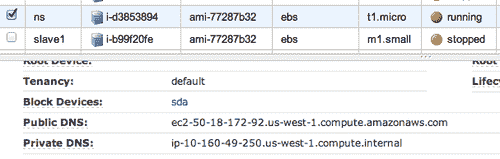
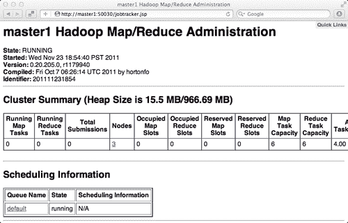
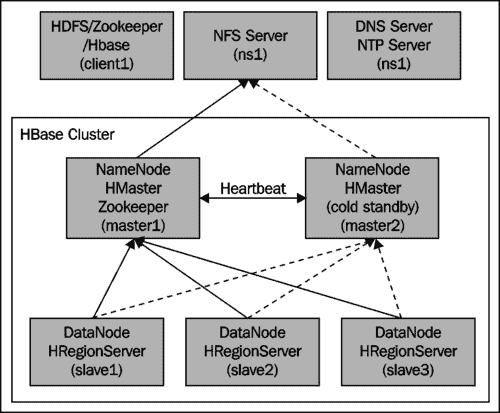

# 第 1 章：设置 HBase 集群

在本章中，我们将介绍：

*   快速启动
*   为 Amazon EC2 做好准备
*   设置 Hadoop
*   设置动物园管理员
*   更改内核设置
*   设置 HBase
*   基本 Hadoop/ZooKeeper/HBase 配置
*   设置多个**高可用性(HA)**主服务器

# 简介

本章介绍如何在 Amazon EC2 上设置 HBase 集群，从基本的独立 HBase 实例到完全分布式、高度可用的 HBase 集群。

根据 Apache HBase 的主页：

> HBase 是 Hadoop 数据库。 当您需要对大数据进行随机、实时读/写访问时，请使用 HBase。 该项目的目标是在商用硬件集群上托管非常大的表-数十亿行 X 数百万列。

HBase 可以在任何文件系统上运行。 例如，您可以在 EXT4 本地文件系统、**Amazon Simple Storage Service(Amazon S3)**和**Hadoop Distributed File System(HDFS)**上运行 HBase，后者是 Hadoop 的主要分布式文件系统。 在大多数情况下，完全分布式的 HBase 集群在 HDFS 实例上运行，因此在继续之前，我们将解释如何设置 Hadoop。

Apache ZooKeeper 是一个开源软件，提供高度可靠的分布式协调服务。 分布式 HBase 依赖于正在运行的 ZooKeeper 集群。

HBase 是一个运行在 Hadoop 上的数据库，它同时保持大量文件处于打开状态。 我们需要更改一些 Linux 内核设置才能顺利运行 HBase。

一个完全分布式的 HBase 集群有一个或多个主节点(HMaster)和多个从节点(RegionServer)，主节点(HMaster)负责协调整个集群，从节点(RegionServer)负责处理实际的数据存储和请求。 下图显示了典型的 HBase 集群结构：


HBase 可以同时运行多个主节点，并使用 ZooKeeper 对主节点进行监控和故障切换。 但是，由于 HBase 使用 HDFS 作为其低层文件系统，如果 HDFS 关闭，HBase 也会关闭。 HDFS 的主节点称为 NameNode，是 HDFS 的**单点故障(Single Point of Failure，SPOF)**，因此它是 HBase 集群的单点故障(Single Point of Failure，SPOF)。 然而，NameNode 作为一个软件是非常健壮和稳定的。 此外，HDFS 团队正在努力开发一个真正的 HA NameNode，预计它将包含在 Hadoop 的下一个主要版本中。

本章的前七个菜谱解释了如何让 HBase 及其所有依赖项协同工作，作为一个完全分布式的 HBase 集群。 最后一个食谱解释了一个关于如何避免集群的 SPOF 问题的高级主题。

我们将从设置一个独立的 HBase 实例开始，然后演示如何在 Amazon EC2 上设置分布式 HBase 集群。

# 快速入门

HBase 有两种运行模式-独立模式和分布式模式。 单机模式是 HBase 的默认模式。 在独立模式下，HBase 使用本地文件系统而不是 HDFS，并在同一 JVM 中运行所有 HBase 守护进程和由 HBase 管理的 ZooKeeper 实例。

本食谱描述了独立 HBase 的设置。 它将引导您完成安装 HBase、以独立模式启动它、通过 HBase Shell 创建表、插入行，然后清理和关闭独立 HBase 实例。

## 做好准备

您将需要一台 Linux 机器来运行堆栈。 不建议在 Windows 上运行 HBase。 在本书中，我们将使用 Debian 6.0.1(Debian Squze)，因为在我的乐天公司(Rakuten Inc.)的生产中，我们有几个运行在 Debian 之上的 Hadoop/HBase 集群，而 6.0.1 是我们在[http://wiki.debian.org/Cloud/AmazonEC2Image](http://wiki.debian.org/Cloud/AmazonEC2Image)上拥有的最新的**Amazon Machine Image**。

由于 HBase 是用 Java 编写的，您需要先安装 Java。 HBase 只能在 Oracle 的 JDK 上运行，因此不要使用 OpenJDK 进行设置。 虽然可以使用 Java7，但我们不建议您现在使用 Java7，因为它需要更多时间进行测试。 您可以从以下链接下载最新的 JavaSE6：[http://www.oracle.com/technetwork/java/javase/downloads/index.html](http://www.oracle.com/technetwork/java/javase/downloads/index.html)。

执行下载的 `bin`文件安装 Java SE 6。我们将在本书中使用 `/usr/local/jdk1.6`作为 `JAVA_HOME`：

```scala
root# ln -s /your/java/install/directory /usr/local/jdk1.6

```

我们将添加一个名为 `hadoop`的用户，作为所有 HBase/Hadoop 守护进程和文件的所有者。 我们将所有 HBase 文件和数据存储在 `/usr/local/hbase:`下

```scala
root# useradd hadoop
root# mkdir /usr/local/hbase
root# chown hadoop:hadoop /usr/local/hbase

```

## 怎么做……

从 HBase 官方网站[http://www.apache.org/dyn/closer.cgi/hbase/](http://www.apache.org/dyn/closer.cgi/hbase/)获取最新稳定的 HBase 版本。 在撰写本书时，当前的稳定版本是 0.92.1。

您可以按照以下说明设置独立的 HBase 实例：

1.  下载 tarball 并解压缩到我们的 HBase 根目录。 我们将使用以下命令设置 `HBASE_HOME`环境变量以简化设置：

    ```scala
    root# su - hadoop
    hadoop$ cd /usr/local/hbase
    hadoop$ tar xfvz hbase-0.92.1.tar.gz
    hadoop$ ln -s hbase-0.92.1 current
    hadoop$ export HBASE_HOME=/usr/local/hbase/current

    ```

2.  使用以下命令在 HBase 的环境设置文件中设置 `JAVA_HOME`：

    ```scala
    hadoop$ vi $HBASE_HOME/conf/hbase-env.sh
    # The java implementation to use. Java 1.6 required.
    export JAVA_HOME=/usr/local/jdk1.6

    ```

3.  使用以下命令为 HBase 创建存储其数据的目录，并在 HBase 配置文件(`hbase-site.xml`)中设置`<configuration>`标记之间的路径：

    ```scala
    hadoop$ mkdir -p /usr/local/hbase/var/hbase
    hadoop$ vi /usr/local/hbase/current/conf/hbase-site.xml
    <property>
    <name>hbase.rootdir</name>
    <value>file:///usr/local/hbase/var/hbase</value>
    </property>

    ```

4.  使用以下命令在独立模式下启动 HBase：

    ```scala
    hadoop$ $HBASE_HOME/bin/start-hbase.sh
    starting master, logging to /usr/local/hbase/current/logs/hbase-hadoop-master-master1.out

    ```

5.  使用以下命令通过 HBase Shell 连接到正在运行的 HBase：

    ```scala
    hadoop$ $HBASE_HOME/bin/hbase shell
    HBase Shell; enter 'help<RETURN>' for list of supported commands.
    Type "exit<RETURN>" to leave the HBase Shell
    Version 0.92.1, r1298924, Fri Mar 9 16:58:34 UTC 2012

    ```

6.  Verify HBase's installation by creating a table and then inserting some values. Create a table named `test`, with a single column family named `cf1`, as shown here:

    ```scala
    hbase(main):001:0> create 'test', 'cf1'
    0 row(s) in 0.7600 seconds

    ```

    I.要列出新创建的表，请使用以下命令：

    ```scala
    hbase(main):002:0> list
    TABLE
    test
    1 row(s) in 0.0440 seconds

    ```

    二、。 要将一些值插入到新创建的表中，请使用以下命令：

    ```scala
    hbase(main):003:0> put 'test', 'row1', 'cf1:a', 'value1'
    0 row(s) in 0.0840 seconds
    hbase(main):004:0> put 'test', 'row1', 'cf1:b', 'value2'
    0 row(s) in 0.0320 seconds

    ```

7.  使用 `scan`命令验证我们插入到 HBase 中的数据：

    ```scala
    hbase(main):003:0> scan 'test'
    ROW COLUMN+CELL row1 column=cf1:a, timestamp=1320947312117, value=value1 row1 column=cf1:b, timestamp=1320947363375, value=value2
    1 row(s) in 0.2530 seconds

    ```

8.  Now clean up all that was done, by using the `disable` and `drop` commands:

    I.要禁用表测试，请使用以下命令：

    ```scala
    hbase(main):006:0> disable 'test'
    0 row(s) in 7.0770 seconds

    ```

    二、。 要删除该表测试，请使用以下命令：

    ```scala
    hbase(main):007:0> drop 'test'
    0 row(s) in 11.1290 seconds

    ```

9.  使用以下命令退出 HBase Shell：

    ```scala
    hbase(main):010:0> exit

    ```

10.  通过执行 `stop`脚本停止 HBase 实例：

```scala
hadoop$ /usr/local/hbase/current/bin/stop-hbase.sh
stopping hbase.......

```

## 它是如何工作的.

我们在一台服务器上安装了 HBase 0.92.1。 我们为它使用了一个名为 `current`的符号链接，这样将来的版本升级就很容易了。

为了通知 HBase 安装 Java 的位置，我们将在 `hbase-env.sh`中设置 `JAVA_HOME`，这是 HBase 的环境设置文件。 您还将在其中看到一些 Java 堆和 HBase 守护进程设置。 我们将在本书的最后两章讨论这些设置。

在步骤 1 中，我们在本地文件系统上创建了一个目录，供 HBase 存储其数据。 对于完全分布式安装，需要将 HBase 配置为使用 HDFS，而不是本地文件系统。 HBase 主守护进程(HMaster)在执行 `start-hbase.sh`的服务器上启动。 因为我们在这里没有配置区域服务器，所以 HBase 也会在同一个 JVM 上启动一个从守护进程(HRegionServer)。

正如我们在*简介*部分中提到的，HBase 依赖于 ZooKeeper 作为其协调服务。 您可能已经注意到，我们在前面的步骤中没有启动 ZooKeeper。 这是因为默认情况下，HBase 将启动并管理自己的动物园管理员组合。

然后我们通过 HBase Shell 连接到 HBase。 使用 HBase Shell，您可以管理集群、访问 HBase 中的数据以及执行许多其他工作。 在这里，我们刚刚创建了一个名为 `test`的表，我们将数据插入到 HBase 中，扫描 `test`表，然后禁用并删除它，然后退出 shell。

可以使用其 `stop-hbase.sh`脚本停止 HBase。 此脚本停止 HMaster 和 HRegionServer 守护进程。

# 为 Amazon EC2 做好准备

**Amazon Elastic Compute Cloud(EC2)**是一项 Web 服务，可在云中提供可调整大小的计算机容量。 通过使用 Amazon EC2，我们可以轻松、低成本地在完全分布式模式下实践 HBase。 我们将在本书中用来演示 HBase 的所有服务器都运行在 Amazon EC2 上。

本食谱描述了 Amazon EC2 环境的设置，为在其上安装 HBase 做准备。 我们将在 Amazon EC2 上设置名称服务器和客户端。 您还可以使用其他托管服务，如 Rackspace 或真实服务器来设置您的 HBase 集群。

## 做好准备

您需要在[http://aws.amazon.com/](http://aws.amazon.com/)注册或创建**亚马逊网络服务(AWS)**帐户。

我们将使用 EC2 命令行工具来管理我们的实例。 您可以按照以下页面提供的说明下载和设置工具：

[http：//docs.amazonwebservices.com/AWSEC2/latest/UserGuide/index.html？SettingUp_CommandLine.html](http://docs.amazonwebservices.com/AWSEC2/latest/UserGuide/index.html?SettingUp_CommandLine.html)。

您需要公钥/私钥才能登录到 EC2 实例。 您可以使用以下说明生成密钥对并将公钥上载到 EC2：

[http：//docs.amazonwebservices.com/AWSEC2/latest/UserGuide/generating-a-keypair.html](http://docs.amazonwebservices.com/AWSEC2/latest/UserGuide/generating-a-keypair.html)。

您必须先授权访问，然后才能登录实例。 以下链接包含向默认安全组添加规则的说明：

[http：//docs.amazonwebservices.com/AWSEC2/latest/UserGuide/adding-security-group-rules.html](http://docs.amazonwebservices.com/AWSEC2/latest/UserGuide/adding-security-group-rules.html)。

完成所有这些步骤后，请查看以下核对表，以确保一切准备就绪：

*   **X.509 证书：**检查是否上传了 X.509 证书。 您可以在帐户的**安全凭证**页面进行检查。
*   **EC2 密钥对：**检查是否上传了 EC2 密钥对。 您可以在**AWS 管理控制台|Amazon EC2|网络&安全|密钥对**查看此信息。
*   **访问：**检查访问是否已授权。 可通过**AWS 管理控制台|Amazon EC2|网络&安全|安全组|入站**进行检查。
*   **环境变量设置：**检查环境变量设置是否已完成。 例如，以下代码片段显示了我的设置；请确保您使用的是您所在地区的正确 `EC2_URL`：

```scala
$ cat ~/.bashrc
export EC2_HOME=~/opt/ec2-api-tools-1.4.4.2
export PATH=$PATH:$EC2_HOME/bin
export EC2_PRIVATE_KEY=~/.ec2/pk-OWRHNWUG7UXIOPJXLOBC5UZTQBOBCVQY.pem
export EC2_CERT=~/.ec2/cert-OWRHNWUG7UXIOPJXLOBC5UZTQBOBCVQY.pem
export JAVA_HOME=/Library/Java/Home
export EC2_URL=https://ec2.us-west-1.amazonaws.com

```

我们需要导入 EC2 密钥对以通过 EC2 命令行工具管理 EC2 实例：

```scala
$ ec2-import-keypair your-key-pair-name --public-key-file ~/.ssh/id_rsa.pub

```

通过键入以下命令验证设置：

```scala
$ ec2-describe-instances

```

如果一切都已正确设置，该命令将以类似于您在前一个命令中配置它们的方式显示您的实例。

### 提示

**下载示例代码**

您可以从您的帐户[http://www.packtpub.com](http://www.packtpub.com)下载购买的所有 Packt 图书的示例代码文件。 如果您在其他地方购买了本书，您可以访问[http://www.packtpub.com/support](http://www.packtpub.com/support)并注册，以便将文件通过电子邮件直接发送给您。

最后的准备是找到合适的 AMI。 AMI 是预配置的操作系统和软件，用于在 EC2 中创建虚拟机。 我们可以在[http://wiki.debian.org/Cloud/AmazonEC2Image](http://wiki.debian.org/Cloud/AmazonEC2Image)找到注册的 Debian AMI。

就实践 HBase 而言，使用 32 位、EBS 支持的 AMI 是最具成本效益的 AMI。 确保您选择的是您所在地区的 AMI。 由于本书使用 US-WEST(US-WEST-1)，因此我们的 AMI ID 为 `ami-77287b32`。 这是一个 32 位的 EC2 小实例。 一个小实例很适合在 EC2 上练习 HBase，因为它很便宜。 对于生产，我们建议您至少将高内存超大型实例与 EBS 配合使用，或者使用真正的服务器。

## 怎么做……

按照以下说明为您的 EC2 实例做好 HBase 的准备。 我们将启动两个 EC2 实例；一个是 DNS/NTP 服务器，另一个是客户端：

1.  启动上述服务器的微型实例。 在本书后面的部分中，我们将使用 `ns1.hbase-admin-cookbook.com (ns1)`作为其**完全限定域名(FQDN)**：

    ```scala
    $ ec2-run-instances ami-77287b32 -t t1.micro -k your-key-pair

    ```

2.  为客户端启动一个小实例。 我们将在本书后面使用 `client1.hbase-admin-cookbook.com (client1)`作为其 FQDN：

    ```scala
    $ ec2-run-instances ami-77287b32 -t m1.small -k your-key-pair

    ```

3.  Verify the startup from **AWS Management Console**, or by typing the following command:

    ```scala
    $ ec2-describe-instances

    ```

    *   您应该从该命令的输出中看到两个实例。 从`ec2-describe-instances`命令或**AWS 管理控制台**的输出中，您可以找到已经启动的实例的公共 DNS。 DNS 显示类似`ec2-xx-xx-xxx-xx.us-west-1`.computer te.amazonaws.com 的值：

    

4.  使用以下命令通过 `SSH`登录实例：

    ```scala
    $ ssh root@ec2-xx-xx-xxx-xx.us-west-1.compute.amazonaws.com

    ```

5.  在服务器上安装软件包之前，请使用以下命令更新软件包索引文件：

    ```scala
    root# apt-get update

    ```

6.  使用以下命令将实例的时区更改为您的本地时区：

    ```scala
    root# dpkg-reconfigure tzdata

    ```

7.  使用以下命令在 DNS 服务器上安装 NTP 服务器守护程序：

    ```scala
    root@ns# apt-get install ntp ntp-server ntpdate

    ```

8.  使用以下命令在客户端/服务器上安装 NTP 客户端：

    ```scala
    root@client1# apt-get install ntp ntpdate

    ```

9.  Configure `/etc/ntp.conf` on `ns1` to run as an NTP server, and `client1` to run as an NTP client, using `ns1` as its server.

    由于 NTP 设置没有特定于 HBase 的配置，因此我们将跳过详细信息。 您可以从本书的示例源代码中找到服务器和客户端的示例`ntp.conf`文件。

10.  使用以下命令在 `ns1`上安装 BIND9 以作为 DNS 服务器运行：

    ```scala
    root@ns# apt-get install bind9

    ```

    *   You will need to configure BIND9 to run as a primary master server for internal lookup, and run as a caching server for external lookup. You also need to configure the DNS server, to allow other EC2 instances to update their record on the DNS server.

        我们将跳过细节，因为这超出了本书的范围。 有关示例 BIND9 配置，请参阅本书附带的源代码。

11.  对于 `client1`，只需使用 `ns1`作为其 DNS 服务器进行设置：

    ```scala
    root@client1# vi /etc/resolv.conf
    nameserver 10.160.49.250 #private IP of ns
    search hbase-admin-cookbook.com #domain name

    ```

12.  Update the DNS hostname automatically. Set up hostname to the EC2 instance's user data of the client. From the **My Instances** page of **AWS Management Console**, select `client1` from the instances list, stop it, and then click **Instance Actions | View | Change User Data**; enter the `hostname` of the instance you want to use (here `client1)` in the pop-up page:

    

13.  使用用户数据创建脚本以更新 DNS 服务器上的客户端记录：

    ```scala
    root@client1# vi ec2-hostname.sh
    #!/bin/bash
    #you will need to set up your DNS server to allow update from this key
    DNS_KEY=/root/etc/Kuser.hbase-admin-cookbook.com.+157+44141.private
    DOMAIN=hbase-admin-cookbook.com
    USER_DATA=`/usr/bin/curl -s http://169.254.169.254/latest/user-data`
    HOSTNAME=`echo $USER_DATA`
    #set also the hostname to the running instance
    hostname $HOSTNAME
    #we only need to update for local IP
    LOCIP=`/usr/bin/curl -s http://169.254.169.254/latest/meta-data/local-ipv4`
    cat<<EOF | /usr/bin/nsupdate -k $DNS_KEY -v
    server ns.$DOMAIN
    zone $DOMAIN
    update delete $HOSTNAME.$DOMAIN A
    update add $HOSTNAME.$DOMAIN 60 A $LOCIP
    send
    EOF

    ```

14.  最后，要在引导时从 `rc.local`运行此脚本，请将以下脚本添加到 `rc.local`文件：

    ```scala
    root@client1# vi /etc/rc.local
    sh /root/bin/ec2-hostname.sh

    ```

### 它是如何工作的.

首先，我们启动了两个实例，一个是 DNS/NTP 服务器的微型实例，另一个是客户端的小实例。 要向其他实例提供名称服务，DNS 名称服务器必须保持运行。 使用微实例可以降低您的 EC2 成本。

在步骤 3 中，我们设置了 NTP 服务器和客户端。 我们将在同一 DNS 服务器上运行我们自己的 NTP 服务器，并在所有其他服务器上运行 NTP 客户端。

### 备注

注意：请确保 HBase 集群成员上的时钟基本对齐。

EC2 实例可以按需启动和停止；我们不需要为停止的实例付费。 但是，重启 EC2 实例会更改实例的 IP 地址，这将使运行 HBase 变得困难。 我们可以通过运行 DNS 服务器为 HBase 集群中的所有 EC2 实例提供名称服务来解决此问题。 我们可以在每次重新启动其他 EC2 实例时更新 DNS 服务器上的 `name`记录。

这正是我们在步骤 4 和 5 中所做的。步骤 4 是正常的 DNS 设置。 在第 5 步中，我们首先将实例名称存储在它的 User Data 属性中，这样当实例重新启动时，我们可以使用 EC2API 将其取回。 此外，我们还将通过 EC2API 获取实例的内网 IP 地址。 有了这些数据，我们就可以在每次实例重新启动时向 DNS 服务器发送 DNS `update`命令。 因此，我们可以始终使用其固定主机名来访问实例。

我们将只保持 DNS 实例持续运行。 您可以在不需要运行 HBase 集群时停止所有其他实例。

# 设置 Hadoop

完全分布式的 HBase 运行在 HDFS 之上。 作为完全分布式的 HBase 集群安装，其主守护进程(HMaster)通常与 HDFS(NameNode)的主节点运行在同一服务器上，而其从守护进程(HRegionServer)与 HDFS 的从节点(称为 DataNode)运行在同一服务器上。

HBase 不需要 Hadoop MapReduce。 不需要启动 MapReduce 后台进程。 如果您喜欢在 HBase 上运行 MapReduce，我们还将在本食谱中介绍 MapReduce 的设置。 对于小型 Hadoop 集群，我们通常在 NameNode 服务器上运行 MapReduce(JobTracker)的主守护进程，在 DataNode 服务器上运行 MapReduce(TaskTracker)的从守护进程。

本食谱描述了 Hadoop 的设置。 我们将有一个主节点(`master1`)在其上运行 NameNode 和 JobTracker。 我们将设置三个从节点(`slave1`到 `slave3)`，它们将分别在它们上运行 DataNode 和 TaskTracker。

## 做好准备

您需要四个小型 EC2 实例，可以使用以下命令获得它们：

```scala
$ec2-run-instances ami-77287b32 -t m1.small -n 4 -k your-key-pair

```

所有这些实例都必须正确设置，如前面的食谱*在 Amazon EC2*上做好准备中所述。 除了 NTP 和 DNS 设置外，所有服务器都需要安装 Java。

我们将使用 `hadoop`用户作为所有 Hadoop 守护进程和文件的所有者。 所有 Hadoop 文件和数据都将存储在 `/usr/local/hadoop`下。 提前添加 `hadoop`用户并在所有服务器上创建一个 `/usr/local/hadoop`目录。

我们还将设置一个 Hadoop 客户端节点。 我们将使用在上一个食谱中设置的 `client1`。 因此，Java 安装、 `hadoop`用户和目录也应该在 `client1`上准备好。

## 怎么做……

以下是设置完全分布式 Hadoop 集群的步骤：

1.  要通过 SSH 登录到集群的所有节点，需要在主节点上生成 `hadoop`用户的公钥：

    ```scala
    hadoop@master1$ ssh-keygen -t rsa -N ""

    ```

    *   此命令将在`~/.ssh/id_rsa.pub.` 为主节点上的`hadoop`用户创建公钥
2.  在所有从节点和客户端节点上，添加 `hadoop`用户的公钥以允许从主节点 SSH 登录：

    ```scala
    hadoop@slave1$ mkdir ~/.ssh
    hadoop@slave1$ chmod 700 ~/.ssh
    hadoop@slave1$ cat >> ~/.ssh/authorized_keys

    ```

3.  复制您在上一步中生成的 `hadoop`用户的公钥，并粘贴到 `~/.ssh/authorized_keys`。 然后，将其权限更改如下：

    ```scala
    hadoop@slave1$ chmod 600 ~/.ssh/authorized_keys

    ```

4.  从 Hadoop 的官方网站[http://www.apache.org/dyn/closer.cgi/hadoop/common/](http://www.apache.org/dyn/closer.cgi/hadoop/common/)获取最新的、稳定的、受 HBase 支持的 Hadoop 版本。 在撰写本章时，HBase 支持的最新稳定 Hadoop 版本是 1.0.2。 下载 tarball 并解压缩到 Hadoop 的 `root`目录，然后添加一个符号链接和一个环境变量：

    ```scala
    hadoop@master1$ ln -s hadoop-1.0.2 current
    hadoop@master1$ export HADOOP_HOME=/usr/local/hadoop/current

    ```

5.  在主节点上创建以下目录：

    ```scala
    hadoop@master1$ mkdir -p /usr/local/hadoop/var/dfs/name
    hadoop@master1$ mkdir -p /usr/local/hadoop/var/dfs/data
    hadoop@master1$ mkdir -p /usr/local/hadoop/var/dfs/namesecondary

    ```

6.  如果不使用 MapReduce，可以跳过以下步骤：

    ```scala
    hadoop@master1$ mkdir -p /usr/local/hadoop/var/mapred

    ```

7.  在 Hadoop 的环境设置文件(hadoop-env.sh)中设置 `JAVA_HOME`：

    ```scala
    hadoop@master1$ vi $HADOOP_HOME/conf/hadoop-env.sh
    export JAVA_HOME=/usr/local/jdk1.6

    ```

8.  将 `hadoop.tmp.dir`属性添加到 `core-site.xml:`

    ```scala
    hadoop@master1$ vi $HADOOP_HOME/conf/core-site.xml
    <property>
    <name>hadoop.tmp.dir</name>
    <value>/usr/local/hadoop/var</value>
    </property>

    ```

9.  将 `fs.default.name`属性添加到 `core-site.xml:`

    ```scala
    hadoop@master1$ vi $HADOOP_HOME/conf/core-site.xml
    <property>
    <name>fs.default.name</name>
    <value>hdfs://master1:8020</value>
    </property>

    ```

10.  如果需要 MapReduce，请将 `mapred.job.tracker`属性添加到 `mapred-site.xml:`

    ```scala
    hadoop@master1$ vi $HADOOP_HOME/conf/mapred-site.xml
    <property>
    <name>mapred.job.tracker</name>
    <value>master1:8021</value>
    </property>

    ```

11.  将从服务器列表添加到 `slaves`文件：

    ```scala
    hadoop@master1$ vi $HADOOP_HOME/conf/slaves
    slave1
    slave2
    slave3

    ```

12.  将所有 Hadoop 文件从主节点同步到客户端和从节点。 初始安装后不同步 `${hadoop.tmp.dir}`：

    ```scala
    hadoop@master1$ rsync -avz /usr/local/hadoop/ client1:/usr/local/hadoop/
    hadoop@master1$ for i in 1 2 3
    do rsync -avz /usr/local/hadoop/ slave$i:/usr/local/hadoop/
    sleep 1
    done

    ```

13.  您需要在启动 Hadoop 之前格式化 NameNode。 仅对初始安装执行此操作：

    ```scala
    hadoop@master1$ $HADOOP_HOME/bin/hadoop namenode -format

    ```

14.  从 `master`节点启动 HDFS：

    ```scala
    hadoop@master1$ $HADOOP_HOME/bin/start-dfs.sh

    ```

15.  You can access your HDFS by typing the following command:

    ```scala
    hadoop@master1$ $HADOOP_HOME/bin/hadoop fs -ls /

    ```

    *   您还可以从浏览器查看 HDFS 管理页面。 确保`50070`端口已打开。 可以在`http://master1:50070/dfshealth.jsp:` 查看 HDFS 管理页面

    

16.  Start MapReduce from the master node, if needed:

    ```scala
    hadoop@master1$ $HADOOP_HOME/bin/start-mapred.sh

    ```

    *   现在，您可以从浏览器访问 MapReduce 管理页面。 确保`50030`端口已打开。 可在`http://master1:50030/jobtracker.jsp:` 查看 MapReduce 管理页面

    

17.  要停止 HDFS，请从主节点执行以下命令：

    ```scala
    hadoop@master1$ $HADOOP_HOME/bin/stop-dfs.sh

    ```

18.  要停止 MapReduce，请从主节点执行以下命令：

    ```scala
    hadoop@master1$ $HADOOP_HOME/bin/stop-mapred.sh

    ```

## 它是如何工作的.

要从主节点启动/停止远程从服务器上的守护程序，需要 `hadoop`用户的无密码 SSH 登录。 我们在步骤 1 中做到了这一点。

HBase 必须在支持持久 `sync`实现的特殊 HDFS 上运行。 如果 HBase 运行在没有持久的 `sync`实现的 HDFS 上，那么如果它的从服务器宕机，它可能会丢失数据。 高于 0.20.205 的 Hadoop 版本，包括我们选择的 Hadoop 1.0.2，都支持此功能。

HDFS 和 MapReduce 使用本地文件系统存储数据。 我们在步骤 3 中创建了 Hadoop 所需的目录，并在步骤 5 中设置了 Hadoop 配置文件的路径。

在步骤 9 到 11 中，我们设置了 Hadoop，以便它可以找到 HDFS、JobTracker 和从服务器。 在启动 Hadoop 之前，所有 Hadoop 目录和设置都需要与从服务器同步。 第一次启动 Hadoop(HDFS)时，需要格式化 NameNode。 请注意，您应该仅在初始安装时执行此操作。

此时，您可以使用 Hadoop 的启动/停止脚本启动/停止 Hadoop。 这里我们分别启动/停止了 HDFS 和 MapReduce，以防您不需要 MapReduce。 您还可以使用 `$HADOOP_HOME/bin/start-all.sh`和 `stop-all.sh`通过一个命令启动/停止 HDFS 和 MapReduce。

# 设置动物园管理员

分布式 HBase 依赖于正在运行的 ZooKeeper 集群。 所有 HBase 集群节点和客户端都需要能够访问 ZooKeeper 集合。

本食谱介绍了如何设置动物园管理员集群。 我们将只为我们的 HBase 集群设置一个独立的 ZooKeeper 节点，但在生产中，建议您运行至少包含三个节点的 ZooKeeper 集成。 此外，请确保运行奇数个节点。

我们将在*中介绍如何设置集群式动物园管理员。* 。 这份食谱的一节。

## 做好准备

首先，确保您的 ZooKeeper 服务器中安装了 Java。

我们将使用 `hadoop`用户作为所有 ZooKeeper 守护进程和文件的所有者。 所有 ZooKeeper 文件和数据都将存储在 `/usr/local/ZooKeeper`下；您需要提前创建此目录。 我们的动物园管理员也会设在 `master1`。

我们将在 `client1`上设置一个动物园管理员客户端。 因此，Java 安装、 `hadoop`用户和目录也应该在 `client1`上准备好。

## 怎么做……

要设置独立的 ZooKeeper 安装，请按照以下说明操作：

1.  从 ZooKeeper 的官方网站[http://ZooKeeper.apache.org/releases.html#download](http://ZooKeeper.apache.org/releases.html#download)获取最新稳定的 ZooKeeper 版本。
2.  下载 tarball 并解压缩到 ZooKeeper 的根目录。 我们将设置 `ZK_HOME`环境变量以简化设置。 在撰写本文时，ZooKeeper 3.4.3 是最新的稳定版本：

    ```scala
    hadoop@master1$ ln -s ZooKeeper-3.4.3 current
    hadoop@master1$ export ZK_HOME=/usr/local/ZooKeeper/current

    ```

3.  为 ZooKeeper 创建目录以存储其快照和事务日志：

    ```scala
    hadoop@master1$ mkdir -p /usr/local/ZooKeeper/data
    hadoop@master1$ mkdir -p /usr/local/ZooKeeper/datalog

    ```

4.  创建 `$ZK_HOME/conf/java.env`文件并将 Java 设置放在那里：

    ```scala
    hadoop@master1$ vi $ZK_HOME/conf/java.env
    JAVA_HOME=/usr/local/jdk1.6
    export PATH=$JAVA_HOME/bin:$PATH

    ```

5.  复制示例 ZooKeeper 设置文件，并进行以下更改以设置 ZooKeeper 应存储其数据的位置：

    ```scala
    hadoop@master1$ cp $ZK_HOME/conf/zoo_sample.cfg $ZK_HOME/conf/zoo.cfg
    hadoop@master1$ vi $ZK_HOME/conf/zoo.cfg
    dataDir=/usr/local/ZooKeeper/var/data
    dataLogDir=/usr/local/ZooKeeper/var/datalog

    ```

6.  将 `/usr/local/ZooKeeper`下的所有文件从主节点同步到客户端。 在此初始安装之后，不要同步 `${dataDir}`和 `${dataLogDir}`。
7.  通过执行以下命令从主节点启动 ZooKeeper：

    ```scala
    hadoop@master1$ $ZK_HOME/bin/zkServer.sh start

    ```

8.  连接到正在运行的 ZooKeeper，并执行一些命令来验证安装：

    ```scala
    hadoop@client1$ $ZK_HOME/bin/zkCli.sh -server master1:2181
    [zk: master1:2181(CONNECTED) 0] ls /
    [ZooKeeper]
    [zk: master1:2181(CONNECTED) 1] quit

    ```

9.  通过执行以下命令从主节点停止 ZooKeeper：

    ```scala
    hadoop@master1$ $ZK_HOME/bin/zkServer.sh stop

    ```

## 它是如何工作的.

在本食谱中，我们设置了一个基本的独立 ZooKeeper 实例。 如您所见，设置非常简单；您所需要做的就是告诉 ZooKeeper 哪里可以找到 Java，哪里可以保存它的数据。

在步骤 4 中，我们创建了一个名为 `java.env`的文件，并将 Java 设置放在该文件中。 您必须使用此文件名作为 ZooKeeper，默认情况下，ZooKeeper 从此文件获取其 Java 设置。

ZooKeeper 的设置文件称为 `zoo.cfg`。 您可以从 ZooKeeper 附带的示例文件中复制设置。 默认设置适用于基本安装。 由于 ZooKeeper 总是在集群系统中扮演核心角色，因此应该对其进行适当的设置，以获得最佳性能。

要连接到正在运行的 ZooKeeper 集合，请使用其命令行工具，并指定要连接的 ZooKeeper 服务器和端口。 默认客户端端口为 `2181`。 如果您使用的是默认端口设置，则不需要指定它。

所有 ZooKeeper 数据都称为**Znode**。 Znode 的结构类似于文件系统层次结构。 ZooKeeper 提供了从其命令行工具访问或更新 Znode 的命令；键入 `help`可获得更多信息。

## 还有更多...

由于 HBase 依赖 ZooKeeper 作为其协调服务，因此 ZooKeeper 服务必须非常可靠。 在生产中，您必须运行至少包含三个节点的 ZooKeeper 群集。 此外，请确保运行奇数个节点。

设置集群式动物园管理员的步骤与本食谱中所示的基本相同。 您可以按照前面的步骤首先设置每个集群节点。 将以下设置添加到每个节点的 `zoo.cfg`，以便每个节点都知道系综中的所有其他节点：

```scala
hadoop@node{1,2,3}$ vi $ZK_HOME/conf/zoo.cfg

```

```scala
server.1=node1:2888:3888
server.2=node2:2888:3888
server.3=node3:2888:3888

```

此外，您还需要在 `${dataDir}`下放置一个 `myid`文件。 `myid`文件由一行组成，仅包含节点 ID。因此， `node1`的 `myid`将不包含文本 `1`。

### 备注

请注意，所有 ZooKeeper 节点上的时钟必须同步。 您可以使用**网络时间协议(NTP)**同步时钟。

分别从集群的每个节点启动 ZooKeeper。 然后，您可以使用以下命令从客户端连接到群集：

```scala
$ zkCli.sh -server node1,node2,node3

```

只要 ZooKeeper 群集中超过一半的节点处于活动状态，ZooKeeper 就会正常工作。 这意味着，在一个三节点集群中，只有一台服务器可以失效。

# 更改内核设置

HBase 是一个运行在 Hadoop 上的数据库，就像其他数据库一样，它同时保持许多文件处于打开状态。 Linux 限制任何一个进程可以打开的文件描述符的数量；默认限制是每个进程 1024 个。 要平稳运行 HBase，您需要为启动 HBase 的用户增加打开文件描述符的最大数量。 在我们的示例中，用户名为 `hadoop`。

您还应该增加 Hadoop 的 `nproc`设置。 `nproc`设置指定用户可以同时存在的最大进程数。 如果 `nproc`太低，可能会发生 `OutOfMemoryError`错误。

在本指南中，我们将介绍如何显示和更改内核设置。

## 做好准备

确保您在所有服务器上都拥有 `root`权限。

## 怎么做……

您需要对群集的所有服务器进行以下内核设置更改：

1.  要确认当前打开的文件限制，请以 `hadoop`用户身份登录并执行以下命令：

    ```scala
    hadoop$ ulimit -n
    1024

    ```

2.  要显示最大进程数的设置，请使用 `ulimit`命令的 `-u`选项：

    ```scala
    hadoop$ ulimit -u
    unlimited

    ```

3.  以 `root`用户身份登录以增加打开文件和 `nproc`限制。 将以下设置添加到 `limits.conf`文件：

    ```scala
    root# vi /etc/security/limits.conf
    hadoop soft nofile 65535
    hadoop hard nofile 65535
    hadoop soft nproc 32000
    hadoop hard nproc 32000

    ```

4.  要应用更改，请将以下行添加到 `/etc/pam.d/common-session`文件中：

    ```scala
    root# echo "session required pam_limits.so" >> /etc/pam.d/common-session

    ```

5.  以 `hadoop`用户身份注销并重新登录，并再次确认设置值；您应该看到已应用上述更改：

    ```scala
    hadoop$ ulimit -n
    65535
    hadoop$ ulimit -u
    32000

    ```

## 它是如何工作的.

前面的设置将 `hadoop`用户的打开文件限制更改为 `65535`。 它还将 `hadoop`用户的最大进程数更改为 `32000`。 更改内核设置后，HBase 可以同时打开足够多的文件，并且运行平稳。

## 另请参阅

*   [第 8 章](08.html "Chapter 8. Basic Performance Tuning")，*基本性能调整*

# 设置 HBase

全分布式 HBase 实例有一个或多个主节点(HMaster)，以及多个在 HDFS 上运行的从节点(RegionServer)。 它使用可靠的 ZooKeeper 集合来协调集群的所有组件，包括主组件、从组件和客户端组件。

没有必要在 HDFS NameNode 的同一台服务器上运行 HMaster，但对于小型集群来说，为了便于管理，通常会将它们运行在同一台服务器上。 RegionServers 通常配置为在 HDFS DataNode 的服务器上运行。 在 DataNode 服务器上运行 RegionServer 还具有**数据局部性**的优势。 最终，在同一服务器上运行的 DataNode 将拥有 RegionServer 所需的所有数据的副本。

本食谱描述了完全分布式 HBase 的设置。 我们将在 `master1`上设置一个 HMaster，并在 `(slave1`到 `slave3)`上设置三个区域服务器。 我们还将在 `client1`上设置一个 HBase 客户端。

## 做好准备

首先，确保集群的所有服务器上都安装了 Java。

我们还将使用 `hadoop`用户作为所有 HBase 守护进程和文件的所有者。 所有 HBase 文件和数据都将存储在 `/usr/local/hbase`下。 提前在您的 HBase 集群的所有服务器上创建此目录。

我们将在 `client1`上设置一个 HBase 客户端。 因此，Java 安装、 `hadoop`用户和目录也应该在 `client1`上准备好。

确保 HDFS 正在运行。 您可以使用以下命令访问 HDFS，以确保其正常启动：

```scala
hadoop@client1$ $HADOOP_HOME/bin/hadoop fs -ls /

```

MapReduce 不需要启动，因为 HBase 通常不使用它。

我们假设您正在管理您自己的动物园管理员，在这种情况下，您可以启动它并确认它是否正常运行。 您可以通过将 `ruok`命令发送到其客户端端口来确保其正常运行

```scala
hadoop@client1$ echo ruok | nc master1 2181

```

## 怎么做……

要设置完全分布式的 HBase 集群，我们将首先在主节点上下载并配置 HBase，然后同步到所有从节点和客户端。

从 HBase 官方网站[http://www.apache.org/dyn/closer.cgi/hbase/](http://www.apache.org/dyn/closer.cgi/hbase/)获取最新稳定的 HBase 版本。

在撰写本书时，当前的稳定版本是 0.92.1。

1.  下载 tarball 并解压缩到 HBase 的 `root`目录。 另外，设置 `HBASE_HOME`环境变量以简化设置：

    ```scala
    hadoop@master1$ ln -s hbase-0.92.1 current
    hadoop@master1$ export HBASE_HOME=/usr/local/hbase/current

    ```

2.  我们将使用 `/usr/local/hbase/var`作为本地文件系统上 HBase 的临时目录。 如果您已为独立的 HBase 安装创建了它，请先将其删除：

    ```scala
    hadoop@master1$ mkdir -p /usr/local/hbase/var

    ```

3.  要告诉 HBase Java 安装在哪里，请在 HBase 环境设置文件(hbase-env.sh)中设置 `JAVA_HOME`：

    ```scala
    hadoop@master1$ vi $HBASE_HOME/conf/hbase-env.sh
    # The java implementation to use. Java 1.6 required.
    export JAVA_HOME=/usr/local/jdk1.6

    ```

4.  设置 HBase 以使用独立的 ZooKeeper 合奏：

    ```scala
    hadoop@master1$ vi $HBASE_HOME/conf/hbase-env.sh
    # Tell HBase whether it should manage it's own instance of ZooKeeper or not.
    export HBASE_MANAGES_ZK=false

    ```

5.  将这些设置添加到 HBase 的配置文件(`hbase-site.xml`)：

    ```scala
    hadoop@master1$ vi $HBASE_HOME/conf/hbase-site.xml
    <configuration>
    <property>
    <name>hbase.rootdir</name>
    <value>hdfs://master1:8020/hbase</value>
    </property>
    <property>
    <name>hbase.cluster.distributed</name>
    <value>true</value>
    </property>
    <property>
    <name>hbase.tmp.dir</name>
    <value>/usr/local/hbase/var</value>
    </property>
    <property>
    <name>hbase.ZooKeeper.quorum</name>
    <value>master1</value>
    </property>
    </configuration>

    ```

6.  配置集群的从节点：

    ```scala
    hadoop@master1$ vi $HBASE_HOME/conf/regionservers
    slave1
    slave2
    slave3

    ```

7.  将 HDFS 配置文件(hdfs-site.xml)链接到 HBase 的 Configuration 文件夹(Conf)，以便 HBase 可以看到 Hadoop 群集上 HDFS 的客户端配置：

    ```scala
    hadoop@master1$ ln -s $HADOOP_HOME/conf/hdfs-site.xml $HBASE_HOME/conf/hdfs-site.xml

    ```

8.  从 Hadoop 和 ZooKeeper 安装复制 `hadoop-core`和 `Zookeeper`JAR 文件及其依赖项：

    ```scala
    hadoop@master1$ rm -i $HBASE_HOME/lib/hadoop-core-*.jar
    hadoop@master1$ rm -i $HBASE_HOME/lib/ZooKeeper-*.jar
    hadoop@master1$ cp -i $HADOOP_HOME/hadoop-core-*.jar $HBASE_HOME/lib/
    hadoop@master1$ cp -i $HADOOP_HOME/lib/commons-configuration-1.6.jar $HBASE_HOME/lib/
    hadoop@master1$ cp -i $ZK_HOME/ZooKeeper-*.jar $HBASE_HOME/lib/

    ```

9.  将 `/usr/local/hbase`下的所有 HBase 文件从 `master`同步到与客户端和从节点相同的目录。
10.  从主节点启动 HBase 集群：

    ```scala
    hadoop@master1$ $HBASE_HOME/bin/start-hbase.sh

    ```

11.  Connect to your HBase cluster from the client node:

    ```scala
    hadoop@client1$ $HBASE_HOME/bin/hbase shell

    ```

    *   您也可以从浏览器访问 HBase Web 用户界面。 确保主服务器的`60010`端口已打开。 URL 为`http://master1:60010/master.jsp:`

    

12.  从主节点停止 HBase 群集：

    ```scala
    hadoop@master1$ $HBASE_HOME/bin/stop-hbase.sh

    ```

## 它是如何工作的.

通过指定 `hbase.rootdir`属性，我们的 HBase 集群被配置为使用 `/hbase`作为其在 HDFS 上的根目录。 由于这是 HBase 第一次启动，它将自动创建目录。 您可以从以下客户端查看 HBase 在 HDFS 上创建的文件：

```scala
hadoop@client1$ $HADOOP_HOME/bin/hadoop fs -ls /hbase

```

我们希望我们的 HBase 在分布式模式下运行，因此我们在 `hbase-site.xml`中将 `hbase.cluster.distributed`设置为 `true`。

我们还通过在 `hbase-env.sh`中指定 `HBASE_MANAGES_ZK=false`将集群设置为使用独立的 ZooKeeper 集合。 ZooKeeper 集合由 `hbase.ZooKeeper.quorum`属性指定。 您可以通过列出集群的所有服务器来使用集群 ZooKeeper，比如 `zoo1,zoo2,zoo3`。

所有区域服务器都在 `$HBASE_HOME/conf/regionservers`文件中配置。 您应该在每个区域服务器上使用一行。 在启动集群时，HBase 将通过 SSH 连接到这里配置的每个区域服务器，并在该服务器上启动 HRegionServer 守护进程。

通过链接 `$HBASE_HOME/conf`目录下的 `hdfs-site.xml`，HBase 将使用您在 `hdfs-site.xml`中为 HDFS 所做的所有客户端配置，例如 `dfs.replication`设置。

HBase 附带预置的 `hadoop-core`和 ZooKeeper JAR 文件。 与您在 Hadoop 和 ZooKeeper 安装中使用的相比，它们可能已经过时了。 确保 HBase 与 Hadoop 和 ZooKeeper 使用相同版本的 `.jar`文件，以避免出现任何意外问题。

# 基本 Hadoop/ZooKeeper/HBase 配置

在前进之前，我们应该调整一些基本设置。 这些是非常基本和重要的 Hadoop(HDFS)、ZooKeeper 和 HBase 设置，您应该在设置集群后立即考虑更改这些设置。

其中一些设置会因为数据持久性或集群可用性(必须配置)而生效，而另一些则是为了平稳运行 HBase 而推荐的配置。

配置设置取决于您的硬件、数据和群集大小。 我们将在这份食谱中描述一条指南。 您可能需要更改设置以适合您的环境。

每次进行更改时，都需要同步到所有客户端和从节点，然后重新启动相应的守护进程以应用更改。

## 怎么做……

应考虑更改的配置如下：

1.  为 HDFS 打开 `dfs.support.append`。 `dfs.support.append`属性确定 HDFS 是否应该支持追加(`sync`)功能。 默认值为 `false`。 它必须设置为 `true`，否则如果区域服务器崩溃，您可能会丢失数据：

    ```scala
    hadoop$ vi $HADOOP_HOME/conf/hdfs-site.xml

    <property>
    <name>dfs.support.append</name>
    <value>true</value>
    </property>

    ```

2.  增加 `dfs.datanode.max.xcievers`值可使 DataNode 保持更多线程打开，以处理更多并发请求：

    ```scala
    hadoop$ vi $HADOOP_HOME/conf/hdfs-site.xml
    <property>
    <name>dfs.datanode.max.xcievers</name>
    <value>4096</value>
    </property>

    ```

3.  增加 ZooKeeper 的堆内存大小，使其不会交换：

    ```scala
    hadoop$ vi $ZK_HOME/conf/java.env
    export JAVA_OPTS="-Xms1000m -Xmx1000m"

    ```

4.  增加 ZooKeeper 的最大客户端连接数以处理更多并发请求：

    ```scala
    hadoop$ echo "maxClientCnxns=60" >> $ZK_HOME/conf/zoo.cfg

    ```

5.  增加 HBase 的堆内存大小以平稳运行 HBase：

    ```scala
    hadoop$ vi $HBASE_HOME/conf/hbase-env.sh

    export HBASE_HEAPSIZE=8000

    ```

6.  减小 `zookeeper.session.timeout`值，以便 HBase 可以快速找到崩溃的地域服务器，并在短时间内恢复：

    ```scala
    hadoop$ vi $HBASE_HOME/conf/hbase-site.xml
    <property>
    <name>zookeeper.session.timeout</name>
    <value>60000</value>
    </property>

    ```

7.  要更改 Hadoop/zooKeeper/HBase 日志设置，请编辑 Hadoop/zooKeeper/HBase 安装目录 `conf`下的 `log4j.properties`文件和 `hadoop-env.sh/hbase-env.sh`文件。 最好将日志目录从安装文件夹中更改出来。 例如，下面指定 HBase 在 `/usr/local/hbase/logs`目录下生成其日志：

    ```scala
    hadoop$ vi $HBASE_HOME/conf/hbase-env.sh
    export HBASE_LOG_DIR=/usr/local/hbase/logs

    ```

### 它是如何工作的.

在步骤 1 中，通过打开 `dfs.support.append`，启用 HDFS 刷新。 启用此功能后，HDFS 的编写器可以通过调用 `flush`调用来保证数据将被持久化。 因此，HBase 可以保证当某个区域服务器死机时，可以使用其**预写日志(WAL)**在其他区域服务器上恢复和重放数据。

要验证是否支持 HDFS 附加，请查看 HBase 启动的 HMaster 日志。 如果追加未转到 `on`，您将发现如下所示的日志：

```scala
$ grep -i "HDFS-200" hbase-hadoop-master-master1.log
...syncFs -- HDFS-200 -- not available, dfs.support.append=false

```

对于步骤 2，我们配置了 `dfs.datanode.max.xcievers`设置，该设置指定 HDFS DataNode 一次服务的文件数的上限。

### 备注

请注意，该名称是 `xcievers—it's`一个拼写错误的名称。 它的默认值是 `256`，这对于在 HDFS 上运行 HBase 来说太低了。

步骤 3 和 4 是关于动物园管理员设置的。 动物园饲养员对交换非常敏感，这将严重降低其性能。 ZooKeeper 的堆大小在 `java.env`文件中设置。 动物园饲养员在任何时候服务的连接数量都有上限。 它的默认值是 `10`，这对于 HBase 来说太低了，特别是在它上运行 MapReduce 时。 我们建议将其设置为 `60`。

在第 5 步中，我们配置了 HBase 的堆内存大小。 HBase 附带的堆大小为 1 GB，对于现代机器来说太低了。 大型计算机的合理值为 8 GB 或更大，但小于 16 GB。

在步骤 6 中，我们将动物园管理员的会话超时更改为一个较低的值。 更低的超时时间意味着 HBase 可以更快地找到崩溃的地域服务器，从而在短时间内恢复其他服务器上的崩溃地域。 另一方面，在会话超时非常短的情况下，HRegionServer 守护进程可能会在群集负载过重时自杀，因为它可能无法在超时之前向 ZooKeeper 发送心跳。

### 另请参阅

*   [第 8 章](08.html "Chapter 8. Basic Performance Tuning")，*基本性能调整*
*   [第 9 章](09.html "Chapter 9. Advanced Configurations and Tuning")，*高级配置和性能调整*

# 设置多个高可用性(HA)主机

Hadoop 和 HBase 旨在自动处理其从节点的故障转移。 由于大型集群中可能有多个节点，因此服务器硬件故障或从节点关机在集群中被视为正常。

对于主节点，HBase 本身没有 SPOF。 HBase 使用动物园管理员作为其中央协调服务。 一个 ZooKeeper 集合通常由三个或更多服务器组成集群；只要集群中超过一半的服务器在线，ZooKeeper 就可以正常提供服务。

HBase 将其活动主节点、根区域服务器位置和其他重要运行数据保存在 ZooKeeper 中。 因此，我们只能在单独的服务器上启动两个或更多 `HMaster`守护进程，最先启动的守护进程将是 HBase 集群的活动主服务器。

但是，HDFS 的 NameNode 是集群的 SPOF。 NameNode 将整个 HDFS 的文件系统映像保存在其本地内存中。 如果 NameNode 关闭，HDFS 将无法再工作，因为 HBase 也关闭了。 正如您可能注意到的，有一个 HDFS 的辅助 NameNode。 请注意，辅助 NameNode 不是 NameNode 的备用名称节点，它只是向 NameNode 提供检查点功能。 因此，高可用集群的挑战是使 NameNode 高度可用。

在本食谱中，我们将描述两个高度可用的主节点的设置，这两个节点将使用**心跳**相互监视。 心跳是一种广泛使用的 HA 解决方案，用于为 Linux 集群提供通信和成员资格。 检测信号需要与**群集资源管理器(CRM)**结合才能启动/停止该群集的服务。 起搏器是心跳信号的首选群集资源管理器。 我们将使用心跳和 Pacemaker 设置**虚拟 IP(VIP)**地址，然后将其与活动主节点相关联。 因为 EC2 不支持静态 IP 地址，所以我们无法在 EC2 上演示它，但我们将讨论使用**弹性 IP(EIP)**来实现我们的目的的替代方法。

我们将重点介绍如何设置 NameNode 和 HBase；您也可以简单地使用类似的方法来设置两个 JobTracker 节点。

## 做好准备

您应该已经安装了 HDFS 和 HBase。 我们将设置一个备用主节点(`master2`)，因为您需要另一台可供使用的服务器。 确保所有依赖项都已正确配置。 将您的 Hadoop 和 HBase 根目录从活动主机(`master1`)同步到备用主机。

在这个食谱中我们也需要 NFS。 设置您的 NFS 服务器，并从 `master1`和 `master2`挂载相同的 NFS 目录。 确保 `hadoop`用户拥有对 NFS 目录的写入权限。 在 NFS 上创建一个目录来存储 Hadoop 的元数据。 我们假设目录为 `/mnt/nfs/hadoop/dfs/name`。

我们将为两个主机设置 VIP，并假设您有以下 IP 地址和 DNS 映射：

*   `master1:`它的 IP 地址为 10.174.14.11。
*   `master2:`它的 IP 地址为 10.174.14.12。
*   `master:`它的 IP 地址为 10.174.14.10。 稍后将设置的是 VIP。

## 怎么做……

以下说明介绍了如何设置两个高度可用的主节点。

### 安装和配置心跳和起搏器

首先，我们将安装心跳和起搏器，并进行一些基本配置：

1.  在 `master1`和 `master2:`

    ```scala
    root# apt-get install heartbeat cluster-glue cluster-agents pacemaker

    ```

    上安装心跳和起搏器
2.  要配置心跳，请对 `master1`和 `master2:`

    ```scala
    root# vi /etc/ha.d/ha.cf
    # enable pacemaker, without stonith
    crm yes
    # log where ?
    logfacility local0
    # warning of soon be dead
    warntime 10
    # declare a host (the other node) dead after:
    deadtime 20
    # dead time on boot (could take some time until net is up)
    initdead 120
    # time between heartbeats
    keepalive 2
    # the nodes
    node master1
    node master2
    # heartbeats, over dedicated replication interface!
    ucast eth0 master1 # ignored by master1 (owner of ip)
    ucast eth0 master2 # ignored by master2 (owner of ip)
    # ping the name server to assure we are online
    ping ns

    ```

    进行以下更改
3.  创建一个 `authkeys`文件。 以 `root`用户身份在 `master1`和 `master2:`

    ```scala
    root# ( echo -ne "auth 1\n1 sha1 "; \
    dd if=/dev/urandom bs=512 count=1 | openssl md5 ) \
    > /etc/ha.d/authkeys
    root# chmod 0600 /etc/ha.d/authkeys

    ```

    上执行以下脚本

### 创建并安装 NameNode 资源代理

起搏器依赖资源代理来管理群集。 资源代理是管理群集资源的可执行文件。 在我们的示例中，VIP 地址和 HDFS NameNode 服务是我们希望使用 Pacemaker 管理的群集资源。 Pacemaker 附带 `IPaddr`资源代理来管理 VIP，因此我们只需要创建自己的 `namenode`资源代理：

1.  Add environment variables to the `.bashrc` file of the `root` user on `master1` and `master2`. Don't forget to apply the changes:

    ```scala
    root# vi /root/.bashrc
    export JAVA_HOME=/usr/local/jdk1.6
    export HADOOP_HOME=/usr/local/hadoop/current
    export OCF_ROOT=/usr/lib/ocf

    ```

    调用以下命令以应用之前的更改：

    ```scala
    root# source /root/.bashrc

    ```

2.  Create a standard **Open Clustering Framework (OCF)** resource agent file called `namenode`, with the following content.

    `namenode`资源代理首先包含如下标准 OCF 功能：

    ```scala
    root# vi namenode
    #!/bin/sh
    : ${OCF_FUNCTIONS_DIR=${OCF_ROOT}/resource.d/heartbeat}
    . ${OCF_FUNCTIONS_DIR}/.ocf-shellfuncs
    usage() {
    echo "Usage: $0 {start|stop|status|monitor|meta-data|validate-all}"
    }

    ```

3.  添加一个 `meta_data()`函数，如以下代码所示。 函数的作用是：将资源代理元数据转储到标准输出。 每个资源代理必须具有一组 XML 元数据，描述其自身用途和支持的参数：

    ```scala
    root# vi namenode
    meta_data() {cat <<END
    <?xml version="1.0"?>
    <!DOCTYPE resource-agent SYSTEM "ra-api-1.dtd">
    <resource-agent name="namenode">
    <version>0.1</version>
    <longdesc lang="en">
    This is a resource agent for NameNode. It manages HDFS namenode daemon.
    </longdesc>
    <shortdesc lang="en">Manage namenode daemon.</shortdesc>
    <parameters></parameters>
    <actions>
    <action name="start" timeout="120" />
    <action name="stop" timeout="120" />
    <action name="status" depth="0" timeout="120" interval="120" />
    <action name="monitor" depth="0" timeout="120" interval="120" />
    <action name="meta-data" timeout="10" />
    <action name="validate-all" timeout="5" />
    </actions>
    </resource-agent>
    END
    }

    ```

4.  添加 `namenode_start()`函数。 Pacemaker 使用此函数实际启动服务器上的 NameNode 守护进程。 在 `namenode_start()`函数中，我们首先检查 NameNode 是否已经在服务器上启动；如果没有启动，我们从 `hadoop`用户调用 `hadoop-daemon.sh`来启动它：

    ```scala
    root# vi namenode
    namenode_start() {
    # if namenode is already started on this server, bail out early
    namenode_status
    if [ $? -eq 0 ]; then
    ocf_log info "namenode is already running on this server, skip"
    return $OCF_SUCCESS
    fi
    # start namenode on this server
    ocf_log info "Starting namenode daemon..."
    su - hadoop -c "${HADOOP_HOME}/bin/hadoop-daemon.sh start name node"
    if [ $? -ne 0 ]; then
    ocf_log err "Can not start namenode daemon."
    return $OCF_ERR_GENERIC;
    fi
    sleep 1
    return $OCF_SUCCESS
    }

    ```

5.  添加 `namenode_stop()`函数。 Pacemaker 使用此函数实际停止服务器上的 NameNode 守护进程。 在 `namenode_stop()`函数中，我们首先检查 NameNode 是否已经在服务器上停止；如果它正在运行，我们从 `hadoop`用户调用 `hadoop-daemon.sh`来停止它：

    ```scala
    root# vi namenode

    namenode_stop () {
    # if namenode is not started on this server, bail out early
    namenode_status
    if [ $? -ne 0 ]; then
    ocf_log info "namenode is not running on this server, skip"
    return $OCF_SUCCESS
    fi
    # stop namenode on this server
    ocf_log info "Stopping namenode daemon..."
    su - hadoop -c "${HADOOP_HOME}/bin/hadoop-daemon.sh stop name node"
    if [ $? -ne 0 ]; then
    ocf_log err "Can not stop namenode daemon."
    return $OCF_ERR_GENERIC;
    fi
    sleep 1
    return $OCF_SUCCESS
    }

    ```

6.  添加 `namenode_status()`函数。 Pacemaker 使用此函数监视服务器上 NameNode 守护程序的状态。 在 `namenode_status()`函数中，我们使用 `jps`命令显示 `hadoop`用户拥有的所有正在运行的 Java 进程，以及 NameNode 守护进程的 `grep`名称以查看它是否已启动：

    ```scala
    root# vi namenode
    namenode_status () {
    ocf_log info "monitor namenode"
    su - hadoop -c "${JAVA_HOME}/bin/jps" | egrep -q "NameNode"
    rc=$?
    # grep will return true if namenode is running on this machine
    if [ $rc -eq 0 ]; then
    ocf_log info "Namenode is running"
    return $OCF_SUCCESS else
    ocf_log info "Namenode is not running" return $OCF_NOT_RUNNING
    fi
    }

    ```

7.  添加 `namenode_validateAll()`函数以确保在运行其他函数之前正确设置环境变量：

    ```scala
    root# vi namenode
    namenode_validateAll () {
    if [ -z "$JAVA_HOME" ]; then
    ocf_log err "JAVA_HOME not set."
    exit $OCF_ERR_INSTALLED
    fi
    if [ -z "$HADOOP_HOME" ]; then
    ocf_log err "HADOOP_HOME not set."
    exit $OCF_ERR_INSTALLED
    fi
    # Any subject is OK
    return $OCF_SUCCESS
    }

    ```

8.  添加以下 Main 例程。 在这里，我们只需调用前面的函数来实现所需的标准 OCF 资源代理操作：

    ```scala
    root# vi namenode
    # See how we were called.
    if [ $# -ne 1 ]; then
    usage
    exit $OCF_ERR_GENERIC
    fi
    namenode_validateAll
    case $1 in
    meta-data) meta_data
    exit $OCF_SUCCESS;;
    usage) usage
    exit $OCF_SUCCESS;;
    *);;
    esac
    case $1 in
    status|monitor) namenode_status;;
    start) namenode_start;;
    stop) namenode_stop;;
    validate-all);;
    *)usage
    exit $OCF_ERR_UNIMPLEMENTED;;
    esac
    exit $?

    ```

9.  更改 `namenode`文件权限，并在 `master1`和 `master2:`

    ```scala
    root# chmod 0755 namenode
    root# ocf-tester -v -n namenode-test /full/path/of/namenode

    ```

    上进行测试
10.  在继续下一步之前，请确保通过所有测试，否则 HA 群集将出现意外行为。
11.  在 `master1`和 `master2:`

    ```scala
    root# mkdir ${OCF_ROOT}/resource.d/hac
    root# cp namenode ${OCF_ROOT}/resource.d/hac
    root# chmod 0755 ${OCF_ROOT}/resource.d/hac/namenode

    ```

    上的 `hac`提供程序下安装 `namenode`资源代理

### 配置高可用性 NameNode

我们已准备好使用心跳和起搏器配置高可用性 NameNode。 我们将设置一个 VIP 地址，并将 Hadoop 和 HBase 配置为使用该 VIP 地址作为它们的主节点。 NameNode 将在分配 VIP 的活动主机上启动。 如果活动主节点崩溃，心跳和 Pacemaker 将检测到它，并将 VIP 地址分配给备用主节点，然后在那里启动 NameNode。

1.  在 `master1`和 `master2:`

    ```scala
    root# /etc/init.d/heartbeat start

    ```

    上启动心跳
2.  更改默认 `crm`配置。 所有与资源相关的命令只执行一次，从 `master1`或 `master2:`

    ```scala
    root# crm configure property stonith-enabled=false
    root# crm configure property default-resource-stickiness=1

    ```

    开始
3.  使用我们的 VIP 地址添加 VIP 资源：

    ```scala
    root# crm configure primitive VIP ocf:heartbeat:IPaddr params ip="10.174.14.10" op monitor interval="10s"

    ```

4.  进行以下更改以将 Hadoop 配置为使用我们的 VIP 地址。 进行更改后，同步到所有主机、客户端和从机：

    ```scala
    hadoop$ vi $HADOOP_HOME/conf/core-site.xml
    <property>
    <name>fs.default.name</name>
    <value>hdfs://master:8020</value>
    </property>

    ```

5.  进行以下更改以将 HBase 配置为使用我们的 VIP 地址。 进行更改后，同步到所有主服务器、客户端和从属服务器：

    ```scala
    hadoop$ vi $HBASE_HOME/conf/hbase-site.xml
    <property>
    <name>hbase.rootdir</name>
    <value>hdfs://master:8020/hbase</value>
    </property>

    ```

6.  要将 Hadoop 配置为将其元数据写入本地磁盘和 NFS，请进行以下更改并同步到所有主机、客户端和从机：

    ```scala
    hadoop$ vi $HADOOP_HOME/conf/hdfs-site.xml
    <property>
    <name>dfs.name.dir</name>
    <value>/usr/local/hadoop/var/dfs/name,/mnt/nfs/hadoop /dfs/name</value>
    </property>

    ```

7.  将我们在步骤 5 中创建的 `namenode`资源代理添加到 Pacemaker。 我们将使用 `NAMENODE`作为其资源名称：

    ```scala
    root# crm configure primitive NAMENODE ocf:hac:namenode op monitor interval="120s" timeout="120s" op start timeout="120s" op stop timeout="120s" meta resource-stickiness="1"

    ```

8.  将 `VIP`资源和 `NAMENODE`资源配置为资源组：

    ```scala
    root# crm configure group VIP-AND-NAMENODE VIP NAMENODE

    ```

9.  配置 VIP 资源的 `colocation`和 `NAMENODE`资源：

    ```scala
    root# crm configure colocation VIP-WITH-NAMENODE inf: VIP NAMENODE

    ```

10.  配置 VIP 资源和 `NAMENODE`资源的资源顺序：

    ```scala
    root# crm configure order IP-BEFORE-NAMENODE inf: VIP NAMENODE

    ```

11.  使用 `crm_mon`命令验证以前的心跳和资源配置。 如果一切配置正确，您应该会看到如下所示的输出：

    ```scala
    root@master1 hac$ crm_mon -1r
    ============
    Last updated: Tue Nov 22 22:39:11 2011
    Stack: Heartbeat
    Current DC: master2 (7fd92a93-e071-4fcb-993f-9a84e6c7846f) - partition with quorum
    Version: 1.0.9-74392a28b7f31d7ddc86689598bd23114f58978b
    2 Nodes configured, 1 expected votes
    1 Resources configured.
    ============
    Online: [ master1 master2 ]
    Full list of resources:
    Resource Group: VIP-AND-NAMENODE
    VIP (ocf::heartbeat:IPaddr): Started master1
    NAMENODE (ocf::hac:namenode): Started master1

    ```

12.  确保在同一台服务器上启动 `VIP`和 `NAMENODE`资源。
13.  现在，从 `master1; VIP-AND-NAMENODE`停止心跳应该在几秒钟后在 `master2`开始。
14.  从 `master1; VIP-AND-NAMENODE`重新启动心跳应保持在 `master2`启动。 资源不应回切到 `master1`。

### 启动 DataNode、HBase 集群和备份 HBase 主机

我们已经确认我们的 HA 配置工作正常，现在可以启动 HDFS 和 HBase 了。 请注意，Pacemaker 已经启动了 NameNode，因此我们只需在此处启动 DataNode：

1.  如果一切正常，我们现在可以启动 DataNode：

    ```scala
    hadoop@master$ for i in 1 2 3
    do
    ssh slave$i "$HADOOP_HOME/bin/hadoop-daemon.sh start datanode"
    sleep 1
    done

    ```

2.  从 `master`启动 HBase 集群，它是与 VIP 地址关联的活动主服务器：

    ```scala
    hadoop@master$ $HBASE_HOME/bin/start-hbase.sh

    ```

3.  从备用主服务器启动备用 HMaster，在本例中为 `master2`：

    ```scala
    hadoop@master2$ $HBASE_HOME/bin/hbase-daemon.sh start master

    ```

## 它是如何工作的.

前面的步骤最终给我们留下了一个如下图所示的集群结构：



首先，我们在两台主机上安装了心跳和起搏器，然后将心跳配置为启用起搏器。

在*创建并安装 NameNode 资源代理*部分的第 2 步中，我们创建了 `namenode`脚本，该脚本作为标准 OCF 资源代理实现。 `namenode`脚本最重要的功能是 `namenode_status`，它监视 NameNode 守护进程的状态。 在这里，我们使用 `jps`命令显示 `hadoop`用户拥有的所有正在运行的 Java 进程，并显示 NameNode 守护进程的 `grep`名称以查看它是否已启动。 Pacemaker 使用 `namenode`资源代理来启动/停止/监视 NameNode 守护进程。 在 `namenode`脚本中，正如您在 `namenode_start`和 `namenode_stop`方法中看到的那样，我们实际上使用 `hadoop-daemon.sh`启动/停止 NameNode，它用于启动/停止单个服务器上的 `Hadoop`守护进程。 您可以在本书附带的源代码中找到完整的代码列表。

我们在测试并安装了 `namenode`资源代理后启动了心跳。 然后，我们对默认的 `crm`配置进行了一些更改。 `default-resource-stickiness=1`设置非常重要，因为它会将资源的 `off`自动回切。

我们向 Pacemaker 添加了一个 `VIP`资源，并在*配置高可用性 NameNode*部分的步骤 3 到 5 中配置了 Hadoop 和 HBase 以使用它。 通过在其配置中使用 VIP，Hadoop 和 HBase 可以在活动主机关闭时切换到与备用主机通信。

在同一节的第 6 步中，我们将 Hadoop(HDFS NameNode)配置为将其元数据写入本地磁盘和 NFS。 如果活动主机关闭，NameNode 将从备用主机启动。 因为它们挂载在相同的 NFS 目录上，所以从备用主机启动的 NameNode 可以应用来自 NFS 的最新元数据，并将 HDFS 恢复到原始活动主机关闭之前的状态。

在步骤 7 到 10 中，我们使用在*创建并安装 NameNode 资源代理*部分的步骤 2 中创建的 `namenode`资源代理添加了 `NAMENODE`资源，然后将 `VIP`和 `NAMENODE`资源设置为一个组(步骤 8)，并确保它们始终运行在同一台服务器上(步骤 9)，并且具有正确的启动顺序(步骤 10)。 我们这样做是因为我们不希望 VIP 在 `master1`上运行，而 NameNode 在 `master2`上运行。

因为 Pacemaker 将通过 `namenode`资源代理为我们启动 NameNode，所以我们需要单独启动 DataNode，这是我们在*启动 DataNode、HBase 集群和备份 HBase MASTER*部分的步骤 1 中所做的。

在正常启动 HBase 之后，我们在备用主服务器上启动了备用 HBase 主服务器(HMaster)。 如果您检查您的 HBase 主日志，您将发现如下所示的输出，它本身显示为备用 HMaster：

```scala
2011-11-21 23:38:55,168 INFO org.apache.hadoop.hbase.master.ActiveMasterManager: Another master is the active master, ip-10-174-14-15.us-west-1.compute.internal:60000; waiting to become the next active master

```

最后，我们让 NameNode 和 HMaster 在具有活动-备用配置的两台服务器上运行。 避免了群集的单点故障。

然而，这给我们在生产上留下了很多工作要做。 您需要在所有罕见情况下测试 HA 集群，例如服务器断电、拔下网线、关闭网络交换机或您能想到的任何其他情况。

另一方面，集群的 SPOF 可能并不像您想象的那么关键。 根据我们的经验，几乎所有群集停机都是由于操作失误或软件升级造成的。 最好让集群变得简单。

## 还有更多...

在 Amazon EC2 上设置高可用性 HBase 集群更为复杂，因为 EC2 不支持静态 IP 地址，因此我们无法在 EC2 上使用 VIP。 另一种方法是使用弹性 IP 地址。 弹性 IP 地址是 EC2 上与您的帐户(而不是特定实例)关联的静态 IP 地址的角色。 如果活动主机关闭，我们可以使用心跳自动将弹性公网 IP 关联到备用主机。 然后，我们将 Hadoop 和 HBase 配置为使用与弹性公网 IP 关联的实例公有 DNS 来查找活动主机。 此外，在 `namenode`资源代理中，我们不仅需要启动/停止 NameNode，还需要启动/停止所有 DataNode。 这是因为活动主机的 IP 地址已更改，但除非重新启动，否则 DataNode 无法找到新的活动主机。

我们将跳过细节，因为它超出了本书的范围。 我们创建了一个 `elastic-ip`资源代理来实现此目的。 您可以在这本书附带的源代码中找到它。