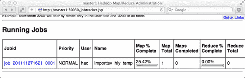
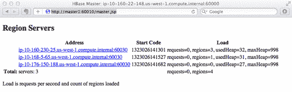
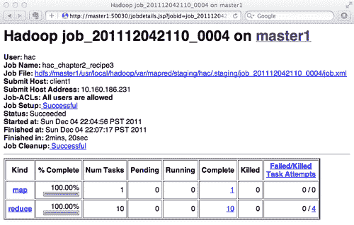

# 第ρ章 2.↔数据迁移

在本章中，我们将介绍：

*   使用单个客户端从 MySQL 导入数据
*   使用批量加载工具从 TSV 文件导入数据
*   编写您自己的 MapReduce 作业以导入数据
*   在将数据移动到 HBase 之前预先创建区域

# 简介

有几种方法可以将数据移动到 HBase 中：

*   使用 HBase PUT API
*   使用 HBase 批量加载工具
*   使用自定义的 MapReduce 作业

HBase**Put**API 是最直接的方法。 它的用法不难学。 然而，在大多数情况下，这并不总是最有效的方法。 当需要在有限的时间内将大量数据传输到 HBase 中时尤其如此。 要处理的数据量通常很大，这可能就是您将使用 HBase 而不是另一个数据库的原因。 在开始 HBase 项目时，您必须仔细考虑如何将所有数据移到 HBase 中；否则，您可能会遇到严重的性能问题。

HBase 具有批量加载功能，支持高效地将海量数据加载到 HBase 中。 大容量加载功能使用 MapReduce 作业将数据加载到特定的 HBase 表中，方法是生成 HBase 的内部 HFile 数据格式文件，然后将数据文件直接加载到正在运行的集群中。 使用此批量加载功能的最简单方法是使用 `importtsv`工具。 `importtsv`是一个内置工具，用于将数据从 TSV 文件加载到 HBase 中。 它将运行 MapReduce 作业从 TSV 文件读取数据，然后将输出直接写入 HBase 表或 HBase 内部数据格式文件。

虽然如果您要将文本数据加载到 HBase 中， `importtsv`工具可能非常有用，但在某些情况下，例如从其他格式导入数据，您可能希望以编程方式生成数据。 MapReduce 是处理海量数据的最有效方式。 这可能是将大量数据加载到 HBase 中的唯一实用方法。 当然，我们可以使用 MapReduce 将数据导入 HBase。 但是，MapReduce 的工作可能非常繁重，因为数据集很大。 如果处理不当，繁重的 MapReduce 作业可能会以较低的吞吐量运行。

通过 HBase 进行数据迁移是一项写入繁重的任务，除非我们生成内部数据文件并将其直接加载到 HBase 中。 尽管 HBase 写入总是很快，但如果没有正确配置，在迁移过程中写入经常会被阻止。 写入繁重任务的另一个问题是，所有写入可能都会进入同一区域服务器，在将大量数据加载到新的 HBase 安装中时尤其如此。 由于所有负载都转到同一台服务器，因此群集不平衡，写入速度将显著减慢。

我们将在本章中讨论这些问题。 我们将从使用其 PUT API 将数据从 MySQL 导入到 HBase 这一简单任务开始。 然后，我们将介绍如何使用 `importtsv`和批量加载工具将 TSV 数据文件加载到 HBase 中。 我们还将提供一个 MapReduce 示例，用于从其他文件格式导入数据。 这包括将数据直接放入 HBase 表，并写入**Hadoop 分布式文件系统(HDFS)**上的 HFile 格式文件。 本章的最后一个诀窍解释了如何在将数据加载到 HBase 之前预先创建区域。

本章附带了几个用 Java 编写的示例源代码。 我们假设您具有基本的 Java 知识，因此我们将跳过在食谱中说明如何编译和打包示例 Java 源代码，但我们将在示例源代码中添加一个介绍。

# 通过单客户端从 MySQL 导入数据

最常见的数据迁移情况可能是将数据从现有的 RDBMS 导入 HBase。 对于这类任务，最简单、最直接的方法可能是从单个客户端获取数据，然后使用 HBase put API 将其放入 HBase。 如果要传输的数据不太多，它工作得很好。

本食谱介绍如何使用其 PUT API 将数据从 MySQL 导入 HBase。 所有操作都将在单个客户端上执行。 本食谱中不包括 MapReduce。 本食谱将引导您通过 HBase Shell 创建一个 HBase 表，从 Java 连接到集群，然后将数据放入 HBase。

## 做好准备

公共数据集是实践 HBase 数据迁移的理想数据源。 互联网上有很多公开的数据集。 本书中我们将使用美国国家海洋和大气局 1981-2010 年的气候常态公开数据。 您可以通过[http://www1.ncdc.noaa.gov/pub/data/normals/1981-2010/](http://www1.ncdc.noaa.gov/pub/data/normals/1981-2010/)访问它。

这是**美国国家海洋和大气管理局(NOAA)生成的气候统计数据。**

### 备注

在本食谱中，我们将在**Products|Hourly**下使用其每小时温度数据，您可以在上面的链接中找到该数据。 从目录下载 `hly-temp-normal.txt`。

本食谱需要运行 MySQL 安装。 使用以下 SQL 语句在 MySQL 数据库中创建 `hly_temp_normal`表：

```scala
create table hly_temp_normal (
id INT NOT NULL AUTO_INCREMENT PRIMARY KEY,
stnid CHAR(11),
month TINYINT,
day TINYINT,
value1 VARCHAR(5),
value2 VARCHAR(5),
value3 VARCHAR(5),
value4 VARCHAR(5),
value5 VARCHAR(5),
value6 VARCHAR(5),
value7 VARCHAR(5),
value8 VARCHAR(5),
value9 VARCHAR(5),
value10 VARCHAR(5),
value11 VARCHAR(5),
value12 VARCHAR(5),
value13 VARCHAR(5),
value14 VARCHAR(5),
value15 VARCHAR(5),
value16 VARCHAR(5),
value17 VARCHAR(5),
value18 VARCHAR(5),
value19 VARCHAR(5),
value20 VARCHAR(5),
value21 VARCHAR(5),
value22 VARCHAR(5),
value23 VARCHAR(5),
value24 VARCHAR(5)
);

```

这本书附带了一些脚本，可以帮助您将数据加载到 MySQL 表中。 您可以使用 `insert_hly.py`加载每小时 NOAA 数据。 您需要在脚本中更改主机、用户、密码和数据库名称。 更改这些设置后，使用：将下载的 `hly-temp-normal.txt`文件中的数据插入到 `hly_temp_normal`表中

```scala
$ python insert_hly.py -f hly-temp-normal.txt -t hly_temp_normal

```

要编译下一节中将提到的 Java 源代码，您将需要以下库：

*   `hadoop-core-1.0.2.jar`
*   `hbase-0.92.1.jar`
*   `mysql-connector-java-5.1.18.jar`

您可以手动将它们添加到类路径中，也可以使用本书提供的示例源代码。

在开始导入数据之前，请确保您的 HDFS、ZooKeeper 和 HBase 集群运行正常。 登录到您的 HBase 客户端节点。

## 怎么做……

要将数据从 MySQL 导入 HBase 到单个客户端，请执行以下操作：

1.  从您的 HBase 客户端服务器通过 HBase Shell 连接到您的 HBase 群集：

    ```scala
    hadoop$ $HBASE_HOME/bin/hbase shell

    ```

2.  在 HBase：

    ```scala
    hbase> create 'hly_temp', {NAME => 'n', VERSIONS => 1}

    ```

    中创建 `hly_temp`表
3.  Write a Java source to import data from MySQL into HBase. Package it as a JAR file. The following steps are to import data using Java source:

    I.创建一个 `connectHBase()`方法，从 Java：连接到特定的 HBase 表

    ```scala
    $ vi Recipe1.java
    private static HTable connectHBase(String tablename) \
    throws IOException {
    HTable table = null;
    Configuration conf = HBaseConfiguration.create();
    table = new HTable(conf, tablename);
    return table;
    }

    ```

    二、。 创建一个 `connectDB()`方法以从 Java 连接到 MySQL：

    ```scala
    $ vi Recipe1.java
    private static Connection connectDB() \
    throws Exception {
    String userName = "db_user";
    String password = "db_password";
    String url = "jdbc:mysql://db_host/database";
    Class.forName("com.mysql.jdbc.Driver").newInstance();
    Connection conn = DriverManager.getConnection(url, userName, password);
    return conn;
    }

    ```

    下面是 Java 类的 main()方法。 在此方法中，我们从 MySQL 获取数据并将该数据放入 HBase：

    ```scala
    $ vi Recipe1.java
    public class Recipe1 {
    public static void main(String[] args) {
    Connection dbConn = null;
    HTable htable = null;
    Statement stmt = null;
    String query = "select * from hly_temp_normal";
    try {
    dbConn = connectDB();
    htable = connectHBase("hly_temp");
    byte[] family = Bytes.toBytes("n");
    stmt = dbConn.createStatement();
    ResultSet rs = stmt.executeQuery(query);
    // time stamp for all inserted rows
    long ts = System.currentTimeMillis();
    while (rs.next()) {
    String stationid = rs.getString("stnid");
    int month = rs.getInt("month");
    int day = rs.getInt("day");
    String rowkey = stationid + Common.lpad(String. valueOf(month), 2, '0') + Common.lpad(String.valueOf(day), 2, '0');
    Put p = new Put(Bytes.toBytes(rowkey));
    // get hourly data from MySQL and put into hbase
    for (int i = 5; i < 29; i++) {
    String columnI = "v" + Common.lpad (String.valueOf(i - 4), 2, '0');
    String valueI = rs.getString(i);
    p.add(family, Bytes.toBytes(columnI), ts, Bytes.toBytes(valueI));
    }
    htable.put(p);
    }
    } catch (Exception e) {
    e.printStackTrace();
    } finally {
    try {
    if (stmt != null) {
    stmt.close();
    }
    if (dbConn != null) {
    dbConn.close();
    }
    if (htable != null) {
    htable.close();
    }
    } catch (Exception e) {
    // ignore
    }
    }
    }
    }

    ```

4.  运行导入作业。 运行 JAR 文件的脚本如下所示：

    ```scala
    #/bin/bash
    bin=`dirname $0`
    bin=`cd $bin;pwd`
    cp=$HBASE_HOME/conf:$HBASE_HOME/hbase-0.92.1.jar:$bin/build/hac-chapter2.jar
    for jar in $bin/lib/*.jar
    do
    cp=$cp:$jar
    done
    for jar in $HBASE_HOME/lib/*.jar
    do
    cp=$cp:$jar
    done
    $JAVA_HOME/bin/java -classpath $cp "hac.chapter2.Recipe1"

    ```

5.  要验证导入到 HBase 中的数据，请通过 HBase Shell 连接到正在运行的 HBase 实例：

    ```scala
    hadoop$ $HBASE_HOME/bin/hbase shell

    ```

6.  验证数据是否已导入 HBase 中的目标表：

    ```scala
    hbase> count 'hly_temp'
    95630 row(s) in 8.9850 seconds
    hbase> scan 'hly_temp', {LIMIT => 10}
    ...
    AQW000617050110 column=n:v23, timestamp=1322958813521, value=814S
    AQW000617050110 column=n:v24, timestamp=1322958813521, value=811C
    10 row(s) in 0.6730 seconds

    ```

## 它是如何工作的.

在步骤 1 和 2 中，我们在 HBase 中创建了要向其中插入数据的目标表。 表名为 `hly_temp`，它只有一个列族 `n`。 我们将其命名为一个字符长度的原因是列族名称将存储在 HBase 中的每个键/值中。 使用非常短的名称可以高效地存储和缓存数据。 我们只需要数据的一个版本，它由列族的 `VERSION`属性指定。

在 Java 源代码中，要连接到 HBase，我们首先创建一个 `Configuration`对象，然后将其与表名一起使用来创建一个 `HTable`实例。 `HTable`对象将处理所有客户端 API 调用。 如您所见，我们没有在源代码中设置任何 ZooKeeper 或 HBase 连接配置。 那么，它如何找到正确运行的 HBase 集群呢？ 这是可能的，因为我们在步骤 4 中将 `$HBase/conf`目录添加到类路径中。通过执行此操作，HBase 客户端 API 将从类路径中的文件 `hbase-site.xml`加载配置。 连接设置在 `hbase-site.xml`文件中指定。

在使用 JDBC 从 MySQL 获取数据之后，我们循环遍历结果集，并将 MySQL 中的一行映射到 HBase 表中的一行。 这里，我们使用 `stationid, month`和 `day`组成 HBase 数据的行键。 我们还向月和日数据添加了左填充 `0`。 这一点很重要，因为 HBase 行键按字典序排序，这意味着 12 排在 2 之前；这当然不是我们预期的结果。

我们使用行键为一行创建了一个 `Put`对象。 每小时数据是通过调用 `Put.add()`来设置的，它以列族、限定符、时间戳和值作为参数。 同样，我们在这里采用了非常短的列名，以提高存储数据的效率。 设置完所有数据后，调用 `HTable.put()`会将数据放入表中。

最后，需要手动关闭所有打开的资源。 我们关闭了源代码最后一块中的 MySQL 和 HBase 连接，以确保即使在导入过程中发生异常也会调用它。

您可以通过对比 MySQL 和 HBase 表的行数来验证导入。 正如您在扫描结果中看到的那样，数据被准确地导入到 HBase 中。

# 使用批量加载工具从 TSV 文件导入数据

HBase 有一个 `importtsv`工具，支持将数据从 TSV 文件导入 HBase。 使用该工具将文本数据加载到 HBase 非常高效，因为它运行 MapReduce 作业来执行导入。 即使您要从现有的 RDBMS 加载数据，也可以以某种方式将数据转储到文本文件，然后使用 `importtsv`将转储的数据导入 HBase。 这种方法在导入大量数据时非常有效，因为转储数据比在 RDBMS 上执行 SQL 快得多。

`importtsv`工具不仅将数据直接加载到 HBase 表中，还支持生成 HBase 内部格式(HFile)文件，因此您可以使用 HBase 批量加载工具将生成的文件直接加载到正在运行的 HBase 集群中。 这样，您就可以在迁移过程中减少数据传输产生的网络流量和 HBase 负载。

本食谱介绍了 `importtsv`和批量加载工具的用法。 我们首先演示如何使用 `importtsv`工具将数据从 TSV 文件加载到 HBase 表中。 我们还将介绍如何生成 HBase 内部格式文件，以及如何将生成的文件直接加载到 HBase 中。

## 做好准备

我们将在本食谱中使用 NOAA 气候正常数据。 数据可从以下链接获得：

[http：//www1.ncdc.noaa.gov/pub/data/normals/1981-2010/](http://www1.ncdc.noaa.gov/pub/data/normals/1981-2010/)

### 备注

下载 `hly-temp-10pctl.txt`文件，该文件位于**Products**|**每小时**目录下。

下载的数据不能直接从 `importtsv`工具加载，因为其格式不受支持。 我们提供脚本来帮助您将数据转换为 TSV 文件。 除了实际数据之外，要加载的 TSV 文件必须包含一个表示 HBase 表行的行键的字段。 本书附带的 `to_tsv_hly.py`脚本从每小时 NOAA 数据文件中读取数据，并生成行键并将数据输出到本地文件系统上的 TSV 文件：

```scala
$ python to_tsv_hly.py -f hly-temp-10pctl.txt -t hly-temp-10pctl.tsv

```

当 `importtsv`工具运行 MapReduce 作业来执行导入时，我们需要在集群上运行 MapReduce。 通过从主节点执行以下命令启动 MapReduce 守护进程：

```scala
hadoop$ $HADOOP_HOME/bin/start-mapred.sh

```

我们将在客户端服务器上添加一个 `hac`用户来运行该作业；这对于生产来说是可取的。 要从客户端运行 MapReduce 作业，您需要向客户端上的 `hac`用户授予对 `${hadoop.tmp.dir}`目录的写入权限。 我们假设将 `${hadoop.tmp.dir}`目录设置为 `/usr/local/hadoop/var:`

```scala
root@client1# usermod -a -G hadoop hac
root@client1# chmod -R 775 /usr/local/hadoop/var

```

在 HDFS 上，为 `hac`用户创建主目录：

```scala
hadoop@client1$ $HADOOP_HOME/bin/hadoop fs -mkdir /user/hac
hadoop@client1$ $HADOOP_HOME/bin/hadoop fs -chown hac /user/hac

```

还要确保 `hac`用户对 HDFS 上的 MapReduce 临时目录具有写入权限：

```scala
hadoop@client1$ $HADOOP_HOME/bin/hadoop fs -chmod -R 775 /usr/local/hadoop/var/mapred

```

## 怎么做……

要使用 MapReduce 将数据从 TSV 文件加载到 HBase 表中，请执行以下步骤：

1.  在 HDFS 上创建一个目录，并将 TSV 文件从本地文件系统复制到 HDFS：

    ```scala
    hac@client1$ $HADOOP_HOME/bin/hadoop fs -mkdir /user/hac/input/2-1
    hac@client1$ $HADOOP_HOME/bin/hadoop fs -copyFromLocal hly-temp-10pctl.tsv /user/hac/input/2-1

    ```

2.  在 HBase 中添加目标表。 连接到 HBase 并将 `hly_temp`表添加到其中：

    ```scala
    hac@client1$ $HBASE_HOME/bin/hbase shell
    hbase> create 'hly_temp', {NAME => 't', VERSIONS => 1}

    ```

3.  如果该表存在(我们在本章的第一个配方中创建了它)，请向其中添加一个新的列族：

    ```scala
    hbase> disable 'hly_temp'
    hbase> alter 'hly_temp', {NAME => 't', VERSIONS => 1}
    hbase> enable 'hly_temp'

    ```

4.  将 `hbase-site.xml`文件添加到 Hadoop 类路径，方法是将其链接到 Hadoop 配置目录下：

    ```scala
    hac@client1$ ln -s $HBASE_HOME/conf/hbase-site.xml $HADOOP_HOME/conf/hbase-site.xml

    ```

5.  通过编辑客户端服务器 `$HADOOP_HOME/conf`目录下的 `hadoop-env.sh`文件将 HBase 依赖 JAR 添加到 Hadoop 类路径：

    ```scala
    hadoop@client1$ vi $HADOOP_HOME/conf/hadoop-env.sh
    export HADOOP_CLASSPATH=/usr/local/zookeeper/current/zookeeper-3.4.3.jar:/usr/local/hbase/current/lib/guava-r09.jar

    ```

6.  通过由 `hac`用户运行以下脚本来运行 `importtsv`工具：

    ```scala
    hac@client1$ $HADOOP_HOME/bin/hadoop jar $HBASE_HOME/hbase-0.92.1.jar importtsv \
    -Dimporttsv.columns=HBASE_ROW_KEY,t:v01,t:v02,t:v03,t:v04,t:v05,t:v06,t:v07,t:v08,t:v09,t:v10,t:v11,t:v12,t:v13,t:v14,t:v15,t:v16,t:v17,t:v18,t:v19,t:v20,t:v21,t:v22,t:v23,t:v24 \
    hly_temp \
    /user/hac/input/2-1

    ```

7.  Check the job status via the MapReduce admin page—`http://master1:50030/jobtracker.jsp:`

    

8.  验证在 HBase 的目标表中导入的数据。 在这里，我们获得 `hly_temp`表中的行数，还扫描表中的一些示例数据。 行数应等于 TSV 文件中的行数。 表中的行键应等于文件中的第一个字段。 每行将有 `t:v01, t:v02`、...、 `t:v24`个单元格，每个单元格的值应等于 TSV 文件中的相对字段：

    ```scala
    hbase> count 'hly_temp'
    95630 row(s) in 12.2020 seconds
    hbase> scan 'hly_temp', {COLUMNS => 't:', LIMIT => 10}
    AQW000617050110 column=t:v23, timestamp=1322959962261, value=781S AQW000617050110 column=t:v24, timestamp=1322959962261, value=774C
    10 row(s) in 0.1850 seconds

    ```

## 它是如何工作的.

`importtsv`工具将只从 HDFS 读取数据，因此我们首先使用 `hadoop fs -copyFromLocal`命令将 TSV 文件从本地文件系统复制到 HDFS。

在步骤 2 中，我们在 HBase 中创建目标表(`hly_temp`)和列族(`t`)。 如果该表已经存在，我们可以将其更改为仅向其中添加我们的列族。 所有数据都将载入到新添加的柱族中；现有柱族中的数据不会受到影响。

为了运行 MapReduce 作业，需要通过 `hadoop jar`命令执行包含类文件的 JAR 文件。 为了将 HBase 配置传递给该命令，我们将 `hbase-site.xml`链接到 `$HADOOP_HOME/conf`目录下；该目录下的所有文件都将被添加到由 `hadoop`命令启动的 Java 进程的类路径中。

在步骤 5 中，通过在 `hadoop-env.sh`中设置 `HADOOP_CLASSPATH`来添加运行时依赖项。 除了 ZooKeeper 库之外， `importtsv`工具还需要 `guava-r09.jar`文件。 它是一个解析 TSV 文件的库。

`importtsv`工具本身是一个包含在 HBase JAR 文件中的 Java 类。 在步骤 6 中，我们通过执行 `hadoop jar`命令来运行该工具。 此命令将为我们启动 Java 进程，并向其添加所有依赖项。 要运行的 JAR 由 `hadoop jar`命令的第一个参数指定；这里是 `hbase-0.92.1.jar`。

以下参数传递给 `hbase-0.92.1.jar:`的主类

*   TSV 文件的字段索引到 HBase 表列的映射信息由 `-Dimporttsv.columns`参数设置。 在我们的示例中，TSV 文件格式为 `(rowkey, value1, value2, ..., value24)`。 我们将数据放入 HBase `t`列族中，使用 `v01`作为 `value1, v02`作为 `value2`，依此类推。 `HBASE_ROW_KEY`是指定行键字段的常量字。
*   在 `-Dimporttsv.columns`参数之后，我们指定了表名(`hly_temp`)，并输入了该命令的 TSV 文件路径(`/user/hac/input/2-1`)。

还可以指定其他几个选项。 不带参数运行 `importtsv`会打印简短的用法信息：

```scala
hac@client1$ $HADOOP_HOME/bin/hadoop jar $HBASE_HOME/hbase-0.92.1.jar importtsv
Usage: importtsv -Dimporttsv.columns=a,b,c <tablename> <inputdir>
Imports the given input directory of TSV data into the specified table.
...

```

可以使用 `-D`指定的其他选项包括：

```scala
-Dimporttsv.skip.bad.lines=false - fail if encountering an invalid line
'-Dimporttsv.separator=|' - eg separate on pipes instead of tabs
-Dimporttsv.timestamp=currentTimeAsLong - use the specified timestamp for the import
-Dimporttsv.mapper.class=my.Mapper - A user-defined Mapper to use instead of org.apache.hadoop.hbase.mapreduce.TsvImporterMapper

```

该工具为我们启动 MapReduce 作业。 在作业的映射阶段，它读取并解析指定输入目录下的 TSV 文件中的行，并使用列映射信息将行放入 HBase 表中。 `Read`和 `Put`操作在多个服务器上并行执行，因此比从单个客户端加载数据要快得多。 默认情况下，作业中没有 Reduce 阶段。 我们可以在 MapReduce 的 Admin 页面上查看作业进度、计数器和其他 MapReduce 信息。

要查看插入到表中的数据，我们可以使用 HBase Shell 的 `scan`命令。 我们指定 `COLUMNS => 't:'`只扫描表中的 `t`列族。

## 还有更多...

默认情况下， `importtsv`工具使用 HBase put API 在其映射阶段使用 `TableOutputFormat`将数据插入到 HBase 表中。 但是当指定 `-Dimporttsv.bulk.output`选项时，它会使用 `HFileOutputFormat`在 HDFS 上生成 HBase 内部格式(HFile)文件。 因此，我们可以使用 `completebulkload`工具将生成的文件加载到正在运行的集群中。 以下步骤用于使用批量输出和加载工具：

1.  在 HDFS 上创建一个目录以将生成的文件放入：

    ```scala
    hac@client1$ $HADOOP_HOME/bin/hadoop fs -mkdir /user/hac/output

    ```

2.  使用批量输出选项运行 `importtsv`：

    ```scala
    hac@client1$ $HADOOP_HOME/bin/hadoop jar $HBASE_HOME/hbase-0.92.1.jar importtsv \
    -Dimporttsv.bulk.output=/user/hac/output/2-1 \
    -Dimporttsv.columns=HBASE_ROW_KEY,t:v01,t:v02,t:v03,t:v04, t:v05,t:v06,t:v07,t:v08,t:v09,t:v10,t:v11,t:v12,t:v13,t:v14, t:v15,t:v16,t:v17,t:v18,t:v19,t:v20,t:v21,t:v22,t:v23,t:v24 \
    hly_temp \
    /user/hac/input/2-1

    ```

3.  完成批量加载：

    ```scala
    hac@client1$ $HADOOP_HOME/bin/hadoop jar $HBASE_HOME/hbase-0.92.1.jar completebulkload \
    /user/hac/output/2-1 \
    hly_temp

    ```

`completebulkload`工具查看生成的文件，确定它们所属的区域，然后联系相应的区域服务器。 地域服务器将采用的 HFile 移动到其存储目录中，并为客户端在线创建数据。

# 编写您自己的 MapReduce 作业以导入数据

虽然 `importtsv`工具对于将文本文件加载到 HBase 非常有用，但在许多情况下，为了完全控制加载过程，您可能需要编写自己的 MapReduce 作业来将数据导入 HBase。 例如，如果要加载其他格式的文件，则 `importtsv`工具不起作用。

HBase 提供 `TableOutputFormat`用于将数据从 MapReduce 作业写入 HBase 表。 您还可以通过使用 `HFileOutputFormat`类在 MapReduce 作业中生成其内部 HFile 格式的文件，然后使用我们在前面的菜谱中描述的 `completebulkload`工具将生成的文件加载到正在运行的 HBase 集群中。

在本食谱中，我们将解释使用您自己的 MapReduce 作业加载数据的步骤。 我们将首先描述如何使用 `TableOutputFormat`。 在*中还有更多..。* 。 一节中，我们将解释如何在 MapReduce 作业中生成 HFile 格式文件。

## 做好准备

在本食谱中，我们将使用原始的 NOAA `hly-temp-normal.txt`文件。 您不需要对下载的数据文件进行任何格式化。 我们将直接从 MapReduce 加载原始数据。

我们假设您的环境已经为在 HBase 上运行 MapReduce 做好了准备。 如果仍然没有，您可以参考使用批量加载工具从 TSV 文件导入的*食谱以了解详细信息。*

## 怎么做……

按照以下说明使用您自己的 MapReduce 作业将数据加载到 HBase 中：

1.  将原始数据文件从本地文件系统复制到 HDFS：

    ```scala
    hac@client1$ $HADOOP_HOME/bin/hadoop fs -mkdir /user/hac/input/2-3
    hac@client1$ $HADOOP_HOME/bin/hadoop fs -copyFromLocal hly-temp-normal.tsv /user/hac/input/2-3

    ```

2.  在客户端服务器上编辑 `hadoop-env.sh`，并将 HBase JAR 文件添加到 Hadoop 类路径：

    ```scala
    hadoop@client1$ vi $HADOOP_HOME/conf/hadoop-env.sh
    export HADOOP_CLASSPATH=/usr/local/hbase/current/hbase-0.92.1.jar

    ```

3.  编写 MapReduce Java 源代码，然后将其打包为 JAR 文件。 Java 源代码应该如下所示：

    ```scala
    $ vi Recipe3.java
    public class Recipe3 {
    public static Job createSubmittableJob (Configuration conf, String[] args) throws IOException {
    String tableName = args[0];
    Path inputDir = new Path(args[1]);
    Job job = new Job (conf, "hac_chapter2_recipe3");
    job.setJarByClass(HourlyImporter.class);
    FileInputFormat.setInputPaths(job, inputDir);
    job.setInputFormatClass(TextInputFormat.class);
    job.setMapperClass(HourlyImporter.class);
    // ++++ insert into table directly using TableOutputFormat ++++
    TableMapReduceUtil.initTableReducerJob(tableName, null, job);
    job.setNumReduceTasks(0);
    TableMapReduceUtil.addDependencyJars(job);
    return job;
    }
    public static void main(String[] args) throws Exception {
    Configuration conf = HBaseConfiguration.create();
    Job job = createSubmittableJob(conf, args);
    System.exit (job.waitForCompletion(true) ? 0 : 1);
    }
    }

    ```

4.  在 `Recipe3.java`中添加一个内部类(`HourlyImporter`)。 此类是 MapReduce 作业的映射器类：

    ```scala
    $ vi Recipe3.java
    static class HourlyImporter extends
    Mapper<LongWritable, Text, ImmutableBytesWritable, Put> {
    private long ts;
    static byte[] family = Bytes.toBytes("n");
    @Override
    protected void setup(Context context) {
    ts = System.currentTimeMillis();
    }
    @Override
    public void map(LongWritable offset, Text value, Context context)throws IOException {
    try {
    String line = value.toString();
    String stationID = line.substring(0, 11);
    String month = line.substring(12, 14);
    String day = line.substring(15, 17);
    String rowkey = stationID + month + day;
    byte[] bRowKey = Bytes.toBytes(rowkey);
    ImmutableBytesWritable rowKey = new ImmutableBytesWritable(bRowKey);
    ImmutableBytesWritable rowKey = new ImmutableBytesWritable(bRowKey);
    Put p = new Put(bRowKey);
    for (int i = 1; i < 25 ; i++) {
    String columnI = "v" + Common.lpad(String.valueOf(i), 2, '0');
    int beginIndex = i * 7 + 11;
    String valueI = line.substring(beginIndex, beginIndex + 6).trim();
    p.add(family, Bytes.toBytes(columnI), ts, Bytes.toBytes(valueI));
    }
    context.write(rowKey, p);
    }
    catch (InterruptedException e) {
    e.printStackTrace();
    }
    }
    }
    }

    ```

5.  In order to run the MapReduce job, package the Java source into a JAR file, and run it from the client by using the `hadoop jar` command:

    ```scala
    hac@client1$ $HADOOP_HOME/bin/hadoop jar hac-chapter2.jar hac.chapter2.Recipe3 \
    hly_temp \
    /user/hac/input/2-3

    ```

    *   检查一下结果。 MapReduce 作业的输出应如以下屏幕截图所示：

    

    ### 提示

    **映射输入记录**应等于输入路径下的文件总行；**映射输出记录**值应等于输入记录计数。 您还可以使用 HBase `count/scan`命令检查结果。

## 它是如何工作的.

要运行 MapReduce 作业，我们首先在 `createSubmittableJob()`中创建一个 `Job`实例。 创建实例后，我们为作业设置输入路径、输入格式和映射器类。 之后，我们调用 `TableMapReduceUtil.initTableReducerJob()`为我们适当地设置作业。 设置包括添加 HBase 配置、设置 `TableOutputFormat`以及向作业添加依赖项。 `TableMapReduceUtil`是在 HBase 上编写 MapReduce 程序的有用实用程序类。

`main`方法中的 `job.waitForCompletion()`调用将作业提交给 MapReduce 框架，并等待作业完成后再退出。 正在运行的作业将读取输入路径下的所有文件，并逐行将数据传递给指定的映射器类(`HourlyImporter`)。

在类的 `map`方法中，我们解析该行，组成行键，创建 `Put`对象，然后通过调用 `Put.add()`将解析的数据添加到相应的列。 最后，通过调用 `context.write()`将数据写入 HBase 表。 在这种情况下不需要还原阶段。

如您所见，编写定制的 MapReduce 作业将数据插入 HBase 非常简单。 该程序类似于从单个客户端使用 HBase API 的程序，我们在*使用单个客户端从 MySQL 导入数据*食谱中描述了这一点。 对于数据量较大的情况，我们建议您使用 MapReduce 将数据加载到 HBase 中。

## 还有更多...

在许多情况下，使用定制的 MapReduce 作业将数据加载到 HBase 中是有意义的。 但是，如果您的数据量很大，则此方法可能效率不够高。 有一些方法可以提高数据迁移的效率。

### 在 MapReduce 中生成 HFile 文件

我们也可以在 MapReduce 作业中生成内部 HFile 格式文件，然后使用我们在第二个菜谱中描述的 `completebulkload`工具将它们加载到集群中，而不是直接将数据写入 HBase 表。 与简单使用 `TableOutputFormat`API：相比，此方法使用的 CPU 和网络资源更少

1.  更改作业配置。 要生成 HFile 文件，请找到 `createSubmittableJob()`方法的以下两行：

    ```scala
    TableMapReduceUtil.initTableReducerJob (tableName, null, job);
    job.setNumReduceTasks(0);

    ```

2.  用以下代码替换它们：

    ```scala
    HTable table = new HTable(conf, tableName);
    job.setReducerClass(PutSortReducer.class);
    Path outputDir = new Path(args[2]);
    FileOutputFormat.setOutputPath (job, outputDir);
    job.setMapOutputKeyClass (ImmutableBytesWritable.class);
    job.setMapOutputValueClass(Put.class);
    HFileOutputFormat.configureIncrementalLoad (job, table);

    ```

3.  将输出路径添加到命令行参数。 编译并打包源代码，然后将输出路径添加到运行作业的命令中：

    ```scala
    hac@client1$ $HADOOP_HOME/bin/hadoop jar hac-chapter2.jar hac.chapter2.Recipe3 \
    hly_temp \
    /user/hac/input/2-3 \
    /user/hac/output/2-3

    ```

4.  完成批量加载：

    ```scala
    hac@client1$ $HADOOP_HOME/bin/hadoop jar $HBASE_HOME/hbase-0.92.1.jar completebulkload \
    /user/hac/output/2-3 \
    hly_temp

    ```

在步骤 1 中，我们更改了作业配置的源。 我们将作业设置为使用 HBase 提供的 `PutSortReducer`Reducer 类。 该类将对一行中的列进行排序，然后再将其写出。 `HFileOutputFormat.configureIncrementalLoad()`方法将负责为作业设置适当的配置以生成 HFile 文件。

在步骤 2 中作业运行完成后，将在我们指定的输出路径下生成内部 HFile 格式文件。 `2-3/n`(列族目录)下的文件将由 `completebulkload`工具加载到我们的 HBase 集群中。


在 MapReduce 作业执行期间，如果您从浏览器打开 HBase 管理页面，您会发现没有请求到达 HBase。 这表明数据没有直接写入 HBase 表。



### 影响数据迁移的重要配置

如果您使用 MapReduce 作业中的 `TableOutputFormat`将数据直接写入 HBase 表，那么在 HBase 上这可能是非常繁重的写操作。 尽管 HBase 设计为能够快速处理写入，但您可能需要调整一些重要的配置，例如：

*   JVM 堆和 GC 设置
*   区域服务器处理程序计数
*   最大区域文件大小
*   给你的 MemStore
*   更新块设置

您需要具备 HBase 体系结构的基本知识，才能了解这些配置如何影响 HBase 的写入性能。 我们将在[第 8 章](08.html "Chapter 8. Basic Performance Tuning")、*基本性能调整*和[第 9 章](09.html "Chapter 9. Advanced Configurations and Tuning")、*高级配置和调整中详细介绍这些内容。*

Hadoop 和 HBase 集群生成了几种类型的日志。 检查日志可以提示您在 MapReduce 数据加载作业期间找出集群的瓶颈。 重要日志包括：

*   Hadoop/HBase/zooKeeper 守护进程的 GC 日志
*   HMaster 后台进程日志

我们将在[章](08.html "Chapter 8. Basic Performance Tuning")，*基本性能调整中描述详细信息。*

## 另请参阅

*   [第 8 章](08.html "Chapter 8. Basic Performance Tuning")，*基本性能调整。*
*   [第 9 章](09.html "Chapter 9. Advanced Configurations and Tuning")，*高级配置和调整*

# 在将数据移入 HBase 之前预先创建区域

每个 HBase 行都属于一个特定的区域。 一个区域保存一系列已排序的 HBase 行。 区域由区域服务器部署和管理。

当我们在 HBase 中创建表时，该表从单个区域开始。 插入到表中的所有数据首先都会进入单个区域。 数据不断被插入，当达到阈值时，该区域将被一分为二。 这称为区域分割。 拆分后的地域将分布到其他地域服务器上，实现集群之间的负载均衡。

您可以想象，如果我们可以使用预先创建的区域初始化表，使用适当的算法，数据迁移的负载将在整个集群上实现均衡，这将显著提高数据加载速度。

在本食谱中，我们将介绍如何创建包含预先创建的区域的表。

## 做好准备

登录到您的 HBase 客户端节点。

## 怎么做……

在客户端节点上执行以下命令：

```scala
$ $HBASE_HOME/bin/hbase org.apache.hadoop.hbase.util.RegionSplitter -c 10 -f n hly_temp2
12/04/06 23:16:32 DEBUG util.RegionSplitter: Creating table hly_temp2 with 1 column families. Presplitting to 10 regions
...
12/04/06 23:16:44 DEBUG util.RegionSplitter: Table created! Waiting for regions to show online in META...
12/04/06 23:16:44 DEBUG util.RegionSplitter: Finished creating table with 10 regions

```

## 它是如何工作的.

此命令使用以下参数调用 `RegionSplitter`类：

*   `-c 10—creates`有 10 个预裂区域的桌子
*   `-f n—creates`名为 `n`的单柱族
*   `hly_temp2—`；表的名称

从浏览器打开 HBase 管理页面，然后单击**用户表**部分中的**HLY_TEMP2**。 您会发现已预先创建了 10 个区域：


`RegionSplitter`是 HBase 提供的实用程序类。 通过使用 `RegionSplitter`，您可以：

*   创建具有指定数量的预创建区域的表
*   对现有表上的所有区域执行滚动拆分
*   使用自定义算法分割区域

如果您运行*编写自己的 MapReduce 作业中讨论的数据加载作业以导入数据*配方，您可能希望将数据写入分发到集群中的所有区域服务器，但结果不同。 在管理页面中，您会发现在 MapReduce 作业执行期间，所有请求都转到同一服务器。


这是因为默认拆分算法(`MD5StringSplit`)不适合我们的情况。 我们的所有行都放入同一区域，因此所有 API 请求都转到保存该区域的区域服务器。 我们需要提供我们的自定义算法来正确分割区域。

预分割区域还会更改生成内部 HFile 格式文件的 MapReduce 作业的行为。 运行*Writing Your Your MapReduce 作业中的作业以导入数据*配方，并在 `hly_temp2`表中打开用于生成 HFile 文件的选项。 如下图所示，您会发现 MapReduce 作业的**Reduce**计数从原来的 1 跳到了 10，这是预先创建的区域数：



这是因为作业的减少器计数基于目标表的区域计数。 如果减少器计数增加，通常意味着负载被分配到多个服务器，因此作业将会快得多。

## 另请参阅

*   在本[第 9 章](09.html "Chapter 9. Advanced Configurations and Tuning")中，*使用您自己的算法*配方预先创建区域