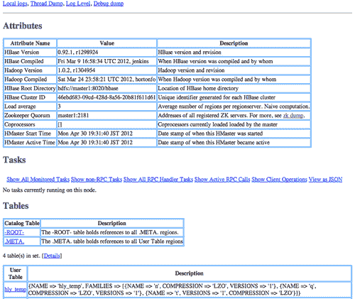
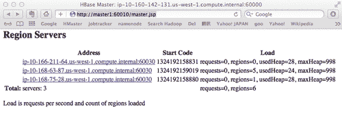
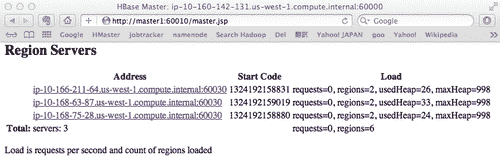
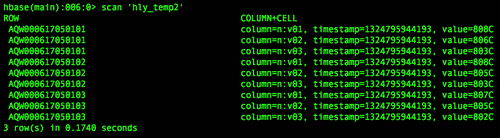
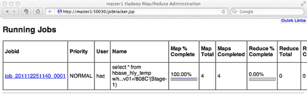

# 第 11-13 章 3.使用管理工具

在本章中，我们将重点介绍：

*   HBase Master Web UI
*   使用 HBase Shell 管理表格
*   使用 HBase Shell 访问 HBase 中的数据
*   使用 HBase Shell 管理群集
*   从 HBase Shell 执行 Java 方法
*   行计数器
*   WAL 工具-手动拆分和转储 WAL
*   HFile 工具-查看带纹理的 HFile 内容
*   HBase `hbck—checking`HBase 群集的运行状况
*   HBase 上的配置单元-使用类似 SQL 的语言查询 HBase

# 简介

每个人都希望他们的 HBase 管理员保持集群平稳运行，在其中存储大量数据，同时、快速、可靠地处理数百万个请求。 保持 HBase 中的大量数据是可访问、可管理和易于查询的，这是管理员的一项重要任务。

除了扎实地了解您正在操作的集群之外，您使用的工具也同样重要。 HBase 附带了几个管理工具，可以让生活变得更轻松。 有一个基于 Web 的管理页面；在该页面上，您可以查看群集的状态并执行简单的管理任务，如区域拆分。 然而，比 HBase web UI 更强大的是 HBase Shell 工具。 该命令行工具具有创建和管理 HBase 表、在表中插入和查看数据的功能，还具有管理集群本身的方法。

HBase 还在其安装过程中提供了大量 Java 实用程序。 您可以直接从 HBase Shell 提示符导入和使用这些实用程序，这将使管理任务更加高效。

我们也有 HBase 工具来处理其内部的**预写日志(WAL)**和 HFile 文件。 这些工具对高级用户非常有用，他们需要更深入地研究数据是如何存储在 HBase 中的。

HBase `hbck`是可用于检查集群运行状况的工具。 在生产中，您可能希望频繁运行 `hbck`，以便快速发现问题。

HIVE 是为 Hadoop 构建的数据仓库软件。 配置单元有一个**配置单元查询语言(HQL)**来管理 Hadoop 中的数据。 HQL 是一种功能强大、易于使用、类似 SQL 的查询语言。 尽管 HBase 有自己的命令来访问其数据，但其功能非常有限。 我们可以将 HBase 表和列映射到配置单元表，这样就可以使用 HQL 对 HBase 数据执行复杂的查询。

在本章中，我们将介绍这些工具的用法。 我们将解释这些工具的用途，以及如何使用它们来解决特定任务。

# HBase Master Web UI

HBase Master web UI 是一个简单但有用的工具，可用于了解集群的当前状态。 从其页面中，您可以获得正在运行的 HBase 的版本、基本配置(包括根 HDFS 路径和 ZooKeeper 仲裁)、集群的平均负载以及表、区域和区域服务器列表。

此外，还可以使用特定边界行键手动拆分区域。 这在禁用簇的自动区域分割时非常有用。

## 做好准备

确保从网络防火墙向客户端计算机开放母版页的端口(默认值为 60010)。 如果您在 Amazon EC2 上运行群集，则可以从**AWS 管理控制台|Amazon EC2|网络&安全|安全组|入站**打开端口。

## 怎么做……

从 Web 浏览器访问以下 URL：

[http：//hbase_master_server：60010/master.jsp](http://hbase_master_server:60010/master.jsp)

### 提示

您需要将 `hbase_master_server`更改为 HBase 主服务器的主机名。

## 它是如何工作的.

HBase Master Web 用户界面如下所示：



如您所见，**Attributes**部分显示了有关 HBase 和 Hadoop 版本、HDFS 上的 HBase 根目录、集群的平均负载和 ZooKeeper 仲裁的信息。 HBase 根目录和 ZooKeeper 仲裁数据是在您的 HBase 配置文件 `hbase-site.xml`中设置的值。 平均负载是每个区域服务器的平均区域数。 单个区域服务器的负载显示在**区域服务器**部分中。

在**目录表**部分中显示了两个表格：**-ROOT-**和**.META**。 这些是 HBase 的系统表。 **-root-**表保存区域服务器的引用，其中所有的**.META**。 表被部署，而**.META**。 表包含所有用户表区域的引用。

**用户表**部分显示所有用户表及其列族属性的列表。 单击列表中表格名称的链接将带您进入表格的详细信息页面。 您将看到该表的区域列表，显示在此页面上。 您还可以在表的详细信息页面上手动压缩或拆分区域。 区域键对于区域的压缩和拆分是可选的。 如果指定，HBase 将只对密钥插入的区域执行操作。 如果未指定，则此操作将以所有区域为目标。


**区域服务器**部分显示所有在线区域服务器及其负载。 如果您正在向集群发送大量请求，您可以从这一部分看到请求发送到了哪台服务器。 单击区域服务器地址的链接将显示所单击服务器的详细信息页面。 在详情页，您可以看到该服务器的指标数据以及该服务器上部署的所有地域的详细信息。

区域服务器的详细信息页面是一个简单但非常重要的界面，用于了解区域服务器的洞察信息。


如上图所示，它显示了地域服务器非常重要的指标。 例如，压缩队列大小(**compactionQueueSize**)、数据块缓存命中率(**block CacheHitRatio**)等。

# 使用 HBase Shell 管理表

HBase Shell 是 HBase 附带的命令行工具。 它提供了管理表、访问 HBase 中的数据和管理集群的基本功能。 HBase Shell 有几组命令。 用于管理表的组称为**数据定义语言(DDL)。** 使用 DDL 组命令，您可以创建、删除和更改 HBase 表。 您还可以从 HBase Shell 禁用/启用表。

## 做好准备

启动您的 HBase 集群。

## 怎么做……

以下步骤将向您展示如何使用 DDL 命令管理 HBase 表：

1.  从客户端节点执行以下命令，以启动 HBase Shell 提示符：

    ```scala
    hac@client1$ $HBASE_HOME/bin/hbase shell

    ```

2.  使用 `create`命令从 HBase Shell 创建具有单个列族(`f1`)的表(`t1`)：

    ```scala
    hbase> create 't1', 'f1'

    ```

3.  使用 `list`命令显示表列表：

    ```scala
    hbase> list
    TABLE
    hly_temp
    t1

    ```

4.  使用 `describe`命令显示表属性：

    ```scala
    hbase> describe 't1'
    DESCRIPTION ENABLED
    {NAME => 't1', FAMILIES => [{NAME => 'f1', BLOOMFILTER => 'NONE', REPLICATION_SCOPE => '0', COMPRESSION => 'NONE' true, VERSIONS => '3', TTL => '2147483647', BLOCKSIZE => '65536', IN_MEMORY => 'false', BLOCKCACHE => 'true'}]}

    ```

5.  使用 `disable`命令禁用该表：

    ```scala
    hbase> disable 't1'
    hbase> is_enabled 't1'
    false

    ```

6.  使用 `alter`命令更改表的属性。 在下面的代码片段中，我们将 `f1`更改为只有一个版本，还添加了一个新的列族 `f2:`

    ```scala
    hbase> alter 't1', {NAME => 'f1', VERSIONS => '1'}, {NAME => 'f2'}

    ```

7.  使用 `enable`命令启用该表：

    ```scala
    hbase> enable 't1'
    hbase> is_enabled 't1'
    true

    ```

8.  输入以下命令再次禁用该表并将其删除：

    ```scala
    hbase> disable 't1'
    hbase> drop 't1'

    ```

## 它是如何工作的.

使用 `hbase shell`命令启动 HBase Shell。 此命令使用 HBase 配置文件(`hbase-site.xml`)供客户端查找要连接的群集。 连接到群集后，它会启动提示符，等待命令。 如以下代码所示，您还可以使用 `--config`选项，该选项允许您传递不同的配置以供 HBase Shell 使用：

```scala
$ hbase --config <configuration_directory> shell

```

从步骤 2 到步骤 8，我们创建了一个表，显示了它的属性，禁用了它，更改了表的一些属性，再次启用了它，最后删除了它。

通过使用 `create`命令，我们创建了一个具有单个列族 `f1`和所有默认表属性的表 `t1`。 `list`命令用于显示集群中的所有表。 表创建后，我们可以使用 `describe`命令显示其属性。 `describe`命令还显示该表是否启用。

要禁用表格，请使用 `disable`命令。 我们只能在表被禁用后才能更改表的属性。 在步骤 5 中，我们更改了 `f1`列族以仅保存其数据的一个版本。 我们还添加了新的柱族 `f2`。 可以使用 `alter`命令更改 `describe`命令显示的所有属性。 我们可以使用 `enable`命令在 HBase 中启用一个表。 要删除 HBase 中的表，请先禁用它，然后使用 `drop`命令删除已禁用的表。

## 还有更多...

最有用的命令可能是 `help`命令：

```scala
hbase> help
HBase Shell, version 0.92.1, r1298924, Fri Mar 9 16:58:34 UTC 2012
Type 'help "COMMAND"', (e.g. 'help "get"' -- the quotes are necessary) for help on a specific command.
Commands are grouped. Type 'help "COMMAND_GROUP"', (e.g. 'help "general"') for help on a command group.
COMMAND GROUPS:
Group name: general
Commands: status, version

```

一个 `help`命令可以打印 HBase Shell 的所有可用命令和一般用法。 要显示命令的详细说明，请将其名称传递给 `help`命令。 例如， `help 'create'`显示 `create`命令的详细用法：

```scala
hbase> help 'create'
Create table; pass table name, a dictionary of specifications per
column family, and optionally a dictionary of table configuration.
Dictionaries are described below in the GENERAL NOTES section.
Examples:
hbase> create 't1', {NAME => 'f1', VERSIONS => 5}
hbase> create 't1', {NAME => 'f1'}, {NAME => 'f2'}, {NAME => 'f3'}
hbase> # The above in shorthand would be the following:
hbase> create 't1', 'f1', 'f2', 'f3'
hbase> create 't1', {NAME => 'f1', VERSIONS => 1, TTL => 2592000, BLOCKCACHE => true}
hbase> create 't1', 'f1', {SPLITS => ['10', '20', '30', '40']}
hbase> create 't1', 'f1', {SPLITS_FILE => 'splits.txt'}

```

# 使用 HBase Shell 访问 HBase 中的数据

HBase Shell 提供**数据操作语言(DML)**组命令来操作 HBase 中的数据。 DML 组包括命令 `count, delete, deleteall, get, get_counter, incr, put, scan`和 `truncate`。 顾名思义，这些命令提供了对 HBase 中数据的基本访问和更新操作。

### 备注

HBase 有一个名为 Counter 的功能，这对于在 HBase 上构建指标收集系统非常有用。 `Get_counter`和 `incr`是用于计数器操作的命令。

当在 HBase 中的大量数据上运行 `count, scan`和 `truncate`命令时，它们可能需要一些时间才能完成。

要计算大表的数量，应该使用 HBase 附带的 `rowcounter`MapReduce 作业。 我们将在本章后面的*行计数器*配方中对其进行描述。

## 做好准备

启动 HBase 集群，从客户端连接到集群，并创建名为 `t1`的表(如果该表不存在)。

## 怎么做……

以下步骤演示了如何使用 DML 命令访问 HBase 中的数据：

1.  使用 `put`命令将以下数据插入到表中：

    ```scala
    hbase> put 't1', 'row1', 'f1:c1', 'value1'
    hbase> put 't1', 'row1', 'f1:c2', 'value2'
    hbase> put 't1', 'row2', 'f1:c1', 'value3'

    ```

2.  通过运行 `count`命令获取表的行数：

    ```scala
    hbase> count 't1'
    2 row(s) in 0.0160 seconds

    ```

3.  使用 `scan`命令扫描数据。 在包含大量行的表上调用 `scan`时，不要忘记指定 `LIMIT`属性：

    ```scala
    hbase> scan 't1', {LIMIT => 10}
    ROW COLUMN+CELL
    row1 column=f1:c1, timestamp=1324100932695, value=value1
    row1 column=f1:c2, timestamp=1324101005928, value=value2
    row2 column=f1:c1, timestamp=1324101012054, value=value3
    2 row(s) in 0.0800 seconds

    ```

4.  使用 `get`命令获取指定行：

    ```scala
    hbase> get 't1', 'row1'
    COLUMN CELL
    f1:c1 timestamp=1324100932695, value=value1
    f1:c2 timestamp=1324101005928, value=value2
    2 row(s) in 0.0100 seconds

    ```

5.  使用 `delete`命令删除指定的单元格：

    ```scala
    hbase> delete 't1', 'row1', 'f1:c1'

    ```

6.  再次执行 `get`命令；您将看到 `f1:c1`单元格已从行

    ```scala
    hbase> get 't1', 'row1'
    COLUMN CELL
    f1:c2 timestamp=1324101005928, value=value2
    1 row(s) in 0.0150 seconds

    ```

    中删除
7.  使用 `deleteall`命令删除给定行中的所有单元格：

    ```scala
    hbase> deleteall 't1', 'row1'

    ```

8.  再次执行 `get`命令；您将看到整个 `row1`行已从表中删除：

    ```scala
    hbase> get 't1', 'row1'
    COLUMN CELL
    0 row(s) in 0.0090 seconds

    ```

9.  使用 `incr`命令将计数器的(`row1:f1:c1`)值加 1：

    ```scala
    hbase> incr 't1', 'row1', 'f1:c1', 1
    COUNTER VALUE = 1

    ```

10.  再次增加计数器 10：

    ```scala
    hbase> incr 't1', 'row1', 'f1:c1', 10
    COUNTER VALUE = 11

    ```

11.  使用 `get_counter`命令获取新的计数器值：

    ```scala
    hbase> get_counter 't1', 'row1', 'f1:c1'
    COUNTER VALUE = 11

    ```

12.  通过运行 `truncate`命令截断表：

    ```scala
    hbase> truncate 't1'
    Truncating 't1' table (it may take a while):
    - Disabling table...
    - Dropping table...
    - Creating table...
    0 row(s) in 4.5700 seconds

    ```

## 它是如何工作的.

`put`命令将表名(`t1`)、行键(`row1`)、列族和限定符(F1：C1)、要放置的值(`value1`)以及时间戳(可选)作为其参数。 `f1:c1`中的 `:`用作列族(`f1`)和限定符(`c1`)之间的分隔符。 如果希望 HBase Shell 将其视为字符串值，请使用单引号将其引起来；否则，HBase Shell 将尝试猜测您输入的值的数据类型。 例如，如果您键入以下命令：

```scala
hbase> put 't1', 'r1', 'f1:c1', 0000

```

您将在表格中输入数值 `0`：

```scala
hbase> get 't1', 'r1'
COLUMN CELL
f1:c1 timestamp=1324103322181, value=0

```

但是当您输入以下命令时：

```scala
hbase> put 't1', 'r1', 'f1:c1', '0000'

```

您将在表中获得字符串 `0000`：

```scala
hbase> get 't1', 'r1'
COLUMN CELL
f1:c1 timestamp=1324103492444, value=0000

```

`count`命令计算表中的行数。 它以行为单位对 HBase 表进行计数，并在其输出上显示行号。 这就是为什么它在步骤 2 中返回两行，即使我们在步骤 1 中将三个单元格放入表中。当计算 HBase 中的大量数据时，此命令可能需要一段时间才能完成。 在这种情况下，更好的选择是使用 HBase 提供的行计数器实用程序，它将在 HBase 上运行 MapReduce 作业进行计数。

`scan`命令用于扫描表。 您可以指定扫描的行范围、要包括的列、时间范围和筛选器。 对于高级用户，还有一个额外的选项`CACHE_BLOCKS`，它指定扫描仪的块缓存是打开还是关闭。 `help`命令对此命令的用法有非常详细的解释；键入 `help 'scan'`可获得更多信息。 扫描 HBase 表的另一种方法是使用 HBase 上的配置单元；对于扫描具有复杂条件的表，这是一个更简单的选项。

`get`命令非常简单；您必须给出所需的行键才能访问该命令。 虽然您可以选择指定要包含在结果中的列、时间戳或版本的范围，但也可以通过指定 `MAXLENGTH`参数来限制输出长度。

`delete`命令将一个单元格标记为已删除，而 `deleteall`命令删除给定行中的所有单元格。

HBase 计数器是分布式原子计数器，存储为指定单元的值。 在指定表/行/列坐标下，使用 `incr`命令增加计数器，使用 `get_counter`命令获取计数器值。

`truncate`命令充当禁用、删除和重新创建表的序列。

## 另请参阅

在本章中：

*   *行计数器*
*   *HBase 上的配置单元-使用类似 SQL 的语言查询 HBase*

# 使用 HBase Shell 管理集群

有许多用于管理集群的 HBase Shell 命令。 这些命令属于工具组。

### 提示

**警告**

其中许多命令仅供高级用户使用，因为误用它们可能会对 HBase 安装造成意想不到的损害。

该工具的 GROUP 命令提供了手动管理 HBase 区域的界面。 它们的功能包括：

*   区域部署
*   区域分割
*   集群均衡
*   区域冲刷和压实

尽管 HBase 在默认情况下会自动执行所有这些操作，但在某些情况下，您可能需要手动平衡区域服务器的负载。 当默认的平衡算法不能很好地适用于您的数据访问模式时，情况尤其如此。

在本食谱中，我们将介绍如何手动刷新、压缩、拆分、平衡和移动 HBase 区域。

## 做好准备

启动您的 HBase 集群，创建一个表，并在其中放入一些数据。 出于演示目的，我们将使用在[第 2 章](02.html "Chapter 2. Data Migration")、*数据迁移*中创建的 `hly_temp`表。 我们假设您正在使用的表中已经有几个区域。 如下面的屏幕截图所示，您可以通过单击表的链接来查看表的区域列表，该表的链接显示在您的 HBase web UI 上：


## 怎么做……

我们将从手动刷新和压缩区域开始，然后手动拆分区域。 最后，我们将重新平衡这些区域，使它们在集群内保持良好平衡。

1.  使用 `flush`命令刷新表中的所有区域：

    ```scala
    hbase> flush 'hly_temp'

    ```

2.  You can also flush an individual region by passing the region name to the `flush` command:

    ```scala
    hbase> flush 'hly_temp,,1324174482248.e3d9b9952973964f3d8e61e191924698.'

    ```

    *   您可以在表的管理页面的**表区域**部分下找到该区域的名称：

    

3.  通过运行 `compact`命令压缩表中的所有区域：

    ```scala
    hbase> compact 'hly_temp'

    ```

4.  通过运行 `major_compact`命令对表运行主要压缩：

    ```scala
    hbase> major_compact 'hly_temp'

    ```

5.  Split a region in a table by running the `split` command:

    ```scala
    hbase> split 'hly_temp,,1324174482248.e3d9b9952973964f3d8e61e191924698.'

    ```

    *   在表的管理页面中，您会发现该区域已被分成两个区域，因此总区域计数变为 4：

    

6.  使用 `balance_switch`命令启用平衡器：

    ```scala
    hbase> balance_switch true
    false

    ```

    *   输出(`false`)是以前的平衡器状态。
7.  使用 `balancer`命令平衡群集负载：

    ```scala
    hbase> balancer
    true

    ```

    *   输出`true`表示平衡调用已成功触发。 它将在主服务器的后台运行。
8.  使用 `move`命令将区域移动到特定区域服务器：

    ```scala
    hbase> move 'e3d9b9952973964f3d8e61e191924698', 'ip-10-168-75-28.us-west-1.compute.internal:60030:1324190304563'

    ```

## 它是如何工作的.

HBase 数据编辑将首先写入预写日志(WAL)，然后写入区域服务器的 `MemStore`。 在 `MemStore`的大小达到阈值之前，编辑内容不会刷新到磁盘。 默认情况下，阈值为 128MB，这是由 `hbase-site.xml`中的 `hbase.hregion.memstore.flush.size`属性配置的。 `flush`命令将这些挂起的记录同步刷新到磁盘。 它接受表名或区域名作为其参数。 区域名称由其表名、区域起始行键、区域服务器起始代码和自身的散列编码值组成。 您可以在表的管理页面的**表区域**部分下找到区域名称。

就像 `flush`命令一样，如果将区域名称而不是表名传递给 `compact`和 `major_compact`命令，则仅在指定区域上执行压缩。 `compact`和 `major_compact`命令是异步的。 执行这些命令将表或区域排队以进行压缩，压缩将由托管指定区域或表的所有区域的服务器在后台执行。 您可能希望仅在加载时间较低时手动执行主要压缩。 这是因为压缩过程中可能会发生大量磁盘 IO 和网络流量，可能需要很长时间才能完成。

`split`命令允许您拆分表中的特定区域或所有区域(如果为该命令指定了表名)。 当以非常高的写入负载运行 HBase 时，我们建议您关闭 HBase 的自动区域拆分功能，使用您自己的算法预先创建区域，并在特定区域变得太大时使用 `split`命令拆分该区域。 我们将在[第 9 章](09.html "Chapter 9. Advanced Configurations and Tuning")、*高级配置和调整中介绍如何预分割表。*

如果数据持续增长，我们的群集可能会变得不平衡。 为了平衡集群，HBase 会定期在后台运行其平衡功能。 另一方面，您也可以通过运行 `balance_switch`命令显式启用平衡器，然后使用 `balancer`命令触发平衡操作。 当您需要停止区域服务器进行维护时，停止平衡器也很有用。

下面的屏幕截图显示了我们的集群在步骤 7 中运行平衡之前的管理页。如您所见，第二个区域服务器保存了集群中几乎所有的区域(全部六个区域中的五个)，这意味着大部分集群负载将流向该服务器：



在执行平衡操作之后，我们的集群变得更加均衡，因为区域被分配到集群中的所有区域服务器：



默认的负载平衡算法只会导致每个区域服务器占用部署在其上的大量区域。 如果此算法不适合您的数据访问模式，您可以使用 `move`命令手动将区域移动到特定服务器。 `move`命令将编码的区域名称和目标服务器名称作为其参数。 编码的区域名称是区域名称的散列代码后缀。 目标服务器名称的格式为 `hostname:port:start-code`。 `move`调用将从其最初部署的服务器关闭区域，在目标服务器上打开它，最后更新 `.META`中的区域记录。 系统表。

## 另请参阅

*   *在[第 9 章](09.html "Chapter 9. Advanced Configurations and Tuning")，*高级配置和调整*中，使用您自己的算法*配方预先创建区域

# 从 HBase Shell 执行 Java 方法

HBase Shell 是用 JRuby 编写的。 由于 JRuby 在**Java 虚拟机(JVM)**内运行，因此从 HBase Shell 执行 Java 方法非常容易。 HBase 附带了许多 Java 实用程序类；从 HBase Shell 执行 Java 方法的能力使直接从 HBase Shell 导入和使用这些实用程序成为可能。

在本食谱中，我们将演示两个如何从 HBase Shell 调用 Java 方法的示例。 第一个将 HBase Shell 输出的时间戳转换为可读的日期格式。 第二个导入 HBase 过滤器类，并在 `scan`命令的扫描仪上执行过滤。

## 做好准备

启动您的 HBase 集群，创建一个表，并在其中放入一些数据。 出于演示目的，我们将使用在[第 2 章](02.html "Chapter 2. Data Migration")中创建的 `hly_temp`表。

在开始之前，请通过 HBase Shell 连接到您的群集。

## 怎么做……

要将 HBase Shell 输出的时间戳转换为可读的日期格式，请执行以下操作：

1.  输入以下命令以从 HBase 获取行：

    ```scala
    hbase> get 'hly_temp', 'AQW000617050101', 'n:'
    COLUMN CELL n:v01 timestamp=1323026325955, value=808C n:v02 timestamp=1323026325955, value=806C n:v03 timestamp=1323026325955, value=803C
    ...

    ```

2.  导入 Java Date 类以转换 TIMESTAMP 的输出，然后使用 `get`命令的 TIMESTAMP 创建 `Date`类的实例：

    ```scala
    hbase> import java.util.Date
    => Java::JavaUtil::Date
    hbase> Date.new(1323026325955).toString()
    => "Mon Dec 05 04:18:45 JST 2011"

    ```

3.  要在扫描中使用 HBase 筛选器，请将以下类导入到 HBase Shell 中：

    ```scala
    hbase> import org.apache.hadoop.hbase.util.Bytes
    => Java::OrgApacheHadoopHbaseUtil::Bytes
    hbase> import org.apache.hadoop.hbase.filter.PrefixFilter
    => Java::OrgApacheHadoopHbaseFilter::PrefixFilter

    ```

4.  使用导入的 `PrefixFilter`类执行 `scan`命令：

    ```scala
    hbase> scan 'hly_temp', {FILTER => PrefixFilter.new (Bytes.toBytes('AQW00061705010')), COLUMN => 'n:'}
    ROW COLUMN+CELLAQW000617050101 column=n:v01, timestamp=1323026325955, value=808CAQW000617050101 column=n:v02, timestamp=1323026325955, value=806CAQW000617050101 column=n:v03, timestamp=1323026325955, value=803C
    ...
    AQW000617050109 column=n:v24, timestamp=1323026325955, value=811C
    9 row(s) in 0.1570 seconds

    ```

## 它是如何工作的.

正如您从步骤 1 的输出中看到的那样，显示的时间戳不便于阅读。 我们希望将其转换为正常的日期格式。

使用 `java.util.Date`类可以轻松完成转换。 在步骤 2 中，我们使用 `import`命令将其导入到 shell 会话中。 `import`命令是一个基本的 JRuby 特性，它不是特定于 HBase 的。 导入 `Date`类后，我们使用要转换的时间戳创建该类的实例。 最后，我们调用它的 `toString()`方法将时间戳转换并打印为正常的日期格式。

步骤 3 和 4 向我们展示了如何在 HBase Shell 中导入和使用 HBase 实用程序。 首先，我们导入 `org.apache.hadoop.hbase.util.Bytes`类，它是一个实用程序类，用于将其他数据类型从字节数组转换为字节数组。 这个类非常有用，因为 HBase 中的所有数据都存储为字节数组。 我们还在步骤 3 中导入了 `org.apache.hadoop.hbase.filter.PrefixFilter`类。这个类是一个筛选类。 将此类与 `scan`命令配合使用，使其仅将具有特定行键前缀的数据传递给客户端。 前缀是通过将其字节数组表示形式传递给 `PrefixFilter`类的构造函数来指定的。 这正是我们在步骤 4 中所做的。我们指定了前缀 `AQW00061705010`，使用 `Bytes`类将其转换为字节数组，使用转换后的字节数组创建了 `PrefixFilter`类的一个实例，然后将其设置为 `scan`命令的过滤器。 正如您从输出中看到的，过滤器对 `scan`命令很有效，因为只向客户端返回了 9 行(`AQW000617050101`到 `AQW000617050109)`)。

## 还有更多...

HBase 附带了许多其他有用的 Java 类。 以下链接列出了 HBase 的 Java API：

[http：//hbase.apache.org/apidocs/index.html](http://hbase.apache.org/apidocs/index.html)

浏览一下以下 HBase API 包：

*   `org.apache.hadoop.hbase.util`
*   `org.apache.hadoop.hbase.client`
*   `org.apache.hadoop.hbase.filter`
*   `org.apache.hadoop.hbase.mapreduce`

# 行计数器

HBase Shell 中的 `count`命令是计算 HBase 表中行数的直接方法。 但是，在包含大量数据的表上运行 `count`命令可能需要很长时间才能完成。 对于这种情况，更好的方法是使用 `RowCounter`类。 这个类将启动一个 MapReduce 作业来计算表上的行数，这比 `count`命令效率高得多。

我们将在本食谱中描述 `RowCounter`的用法。

## 做好准备

确保您的 Hadoop 和 HBase 集群正在运行。 MapReduce 也是必需的；如果它没有运行，请在 JobTracker 服务器上使用以下命令启动它：

```scala
hadoop@master1$ $HADOOP_HOME/bin/start-mapred.sh

```

登录到您的 HBase 客户端节点。

## 怎么做……

要在 `hly_temp`表上运行行计数器 MapReduce 作业，请执行以下步骤：

1.  将 ZooKeeper JAR 文件添加到客户端节点上的 Hadoop 类路径：

    ```scala
    hadoop@client1$ vi $HADOOP_HOME/conf/hadoop-env.sh
    HBASE_HOME=/usr/local/hbase/current
    export HADOOP_CLASSPATH=$HADOOP_CLASSPATH: $HBASE_HOME/lib/zookeeper-3.4.3.jar: $HBASE_HOME/lib/guava-r09.jar

    ```

2.  Execute the `rowcounter` command from your client:

    ```scala
    hac@client1$ $HADOOP_HOME/bin/hadoop jar $HBASE_HOME/hbase-0.92.1.jar rowcounter hly_temp

    ```

    *   您将获得以下输出：

    

3.  正如您可以从输出的一个计数器中看到的那样，我们在 `hly_temp`表中有 95,630 行：

    ```scala
    11/12/22 07:14:30 INFO mapred.JobClient: org.apache.hadoop.hbase.mapreduce.RowCounter $RowCounterMapper$Counters
    11/12/22 07:14:30 INFO mapred.JobClient: ROWS=95630

    ```

## 它是如何工作的.

当我们使用 `hadoop jar`命令运行 JAR 文件时，该 JAR 文件的依赖项必须包含在 Hadoop 的类路径中。 这正是我们在步骤 1 中所做的。

在步骤 2 中，我们使用 `hadoop jar`命令运行 `hbase-0.92.1.jar`。 JAR 文件名之后的参数被传递给 JAR 文件的主类。 为了在 `hly_temp`表上运行行计数器，我们将修复字符串 `rowcounter`和表名传递给命令。 指定 `rowcounter`将使 Hadoop 从 `hbase-0.92.1.jar`执行 `RowCounter`类。 `RowCounter`类将接受 `hly_temp`作为其参数，并最终为我们启动 MapReduce 作业。 还可以通过在表名后传递空格分隔的列(族)名称来指定要计数的列或列族。

除了行计数器，您还可以从命令行执行其他 MapReduce 作业。 有关详细信息，请键入以下内容：

```scala
$HADOOP_HOME/bin/hadoop jar $HBASE_HOME/hbase-0.92.1.jar
An example program must be given as the first argument.
Valid program names are:
CellCounter: Count cells in HBase table
completebulkload: Complete a bulk data load.
copytable: Export a table from local cluster to peer cluster
export: Write table data to HDFS.
import: Import data written by Export.
importtsv: Import data in TSV format.
rowcounter: Count rows in HBase table
verifyrep: Compare the data from tables in two different clusters. WARNING: It doesn't work for incrementColumnValues'd cells since the timestamp is changed after being appended to the log.

```

## 还有更多...

在对大型数据集运行 `RowCounter`时，我们建议您调整客户端上的扫描仪缓存设置，如以下代码片断所示：

```scala
hac@client1$ vi $HBASE_HOME/conf/hbase-site.xml

```

```scala
<property>
<name>hbase.client.scanner.caching</name>
<value>1000</value>
</property>

```

这使得 HBase 为扫描仪上的每个下一次调用提取 `1000`行。 默认情况下，HBase 在每次调用时提取 `1`行。 将其设置为较高的值会提高扫描仪的速度，但会消耗更多内存。

# WAL 工具-手动拆分和倾倒 WAL

HBase 编辑将首先写入区域服务器的预写日志(WAL)。 日志写入成功后，会更新地域服务器的 `MemStore`。 由于 WAL 是 HDFS 上的序列文件，默认情况下它会自动复制到另外两个 DataNode 服务器上，因此单个区域服务器崩溃不会导致存储在其中的数据丢失。

由于 WAL 由部署在区域服务器上的所有区域共享，因此需要首先拆分 WAL，以便可以在每个相关区域上重放 WAL，以便从区域服务器崩溃中恢复。 HBase 使用此算法自动处理区域服务器故障转移。

HBase 有一个 Wal 工具，提供手动 Wal 拆分和倾倒设施。 我们将在本食谱中介绍如何使用此工具。

## 做好准备

我们需要将一些数据放入 HBase 表中，以便让 HBase 为我们的演示生成 WAL 文件。 同样，我们将在本食谱中使用 `hly_temp`表。 我们将使用 HBase Shell `Put`命令将以下数据放入 `hly_temp`表中：

```scala
hbase> put 'hly_temp', 'AQW000617050101', 't:v25', 'wal tool demo'
hbase> put 'hly_temp', 'AQW000617050101', 't:v26', 'wal tool demo2'
hbase> put 'hly_temp', 'AQW000617050101', 't:v27', 'wal tool demo3'
hbase> delete 'hly_temp', 'AQW000617050101', 't:v27'

```

这些命令将使 HBase 在其 HDFS 上的 WAL 中添加四个条目。 此外，您还需要找出哪个区域保存我们在前面命令中放入的行，以及哪个区域服务器保存该区域。 要执行此操作，请打开表的管理页面。 在**表区域**部分，您将发现每个区域的**开始键**和**结束键**。 由于 HBase 中的数据是按行键排序的，因此按照词典顺序，一行属于行键的起始/结束键最接近的区域。

下表来自我们的 HBase web 用户界面的**表区域**部分。 如您所见，我们在前面的代码(`AQW000617050101`)中输入的行键比字典序中第一个区域的结束键(`USW000128350706`)小；第一个区域是保存我们在前面命令中输入的行的区域：

<colgroup><col style="text-align: left"> <col style="text-align: left"> <col style="text-align: left"> <col style="text-align: left"></colgroup> 
| 

区域

 | 

区域服务器

 | 

开始键

 | 

结束关键点

 |
| --- | --- | --- | --- |
| Hly_temp，，1324196693。 | 奴隶 1：60030 |   | USW000128350706 |
| HLY_TEMP，USW000128。 | 奴隶 2：60030 | USW000128350706 | USW000138830523 |
| HLY_TEMP，USW000138。 | 奴隶 1：60030 | USW000138830523 | USW000149221223 |
| HLY_TEMP，USW000149。 | 奴隶 1：60030 | USW000149221223 |   |

## 怎么做……

按照以下说明手动转储和拆分 WAL 日志：

1.  使用 `hadoop fs`或 HDFS 管理页面查找 WAL 文件的完整路径。 前面 `put`操作的 WAL 文件将在 HDFS 上的以下目录下生成：

    ```scala
    ${hbase.rootdir}/.logs/target_region_server,port,start_code

    ```

2.  执行带有转储选项的 WAL 工具以转储 WAL 文件：

    ```scala
    $ $HBASE_HOME/bin/hbase org.apache.hadoop.hbase.regionserver.wal.HLog --dump /hbase/.logs/ ip-10-168-151-193.us-west-1.compute. internal,60020,1324689025404/ ip-10-168-151-193.us-west-1.compute. internal%3A60020.1324689026748 -p -w 'AQW000617050101'
    Sequence 96649 from region 9e6dd810550443bb488c871728d5dee0 in table hly_temp
    Action:
    row: AQW000617050101
    column: t:v25
    at time: Sat Dec 24 10:21:59 JST 2011
    value: wal tool demo
    Sequence 96650 from region 9e6dd810550443bb488c871728d5dee0 in table hly_temp
    Action:
    row: AQW000617050101
    column: t:v26
    at time: Sat Dec 24 10:22:09 JST 2011
    value: wal tool demo2
    Sequence 96651 from region 9e6dd810550443bb488c871728d5dee0 in table hly_temp
    Action:
    row: AQW000617050101
    column: t:v27
    at time: Sat Dec 24 10:22:18 JST 2011
    value: wal tool demo3
    Sequence 96652 from region 9e6dd810550443bb488c871728d5dee0 in table hly_temp
    Action:
    row: AQW000617050101
    column: t:v27
    at time: Sat Dec 24 10:22:27 JST 2011
    value:

    ```

3.  要手动拆分 WAL 文件，请切换到启动 Hadoop 和 HBase 的用户；在我们的示例中，该用户是 `hadoop`用户：

    ```scala
    hac@client1$ sudo su hadoop

    ```

4.  Execute the WAL tool with the split option to split the WAL files:

    ```scala
    hadoop@client1$ $HBASE_HOME/bin/hbase org.apache.hadoop.hbase.regionserver.wal.HLog --split hdfs://master1:8020/hbase/.logs/ip-10-160-51-22.us- west-1.compute.internal,60020,1324601160791
    ...
    11/12/24 10:35:43 INFO wal.HLogSplitter: hlog file splitting completed in 1700 ms for hdfs://master1:8020/hbase/.logs/ip-10-168-151-193.us-west-1.compute.internal,60020,1324689025404

    ```

    ### 备注

    如果托管区域服务器在线，不要*手动拆分 WAL，因为拆分 WAL 仅用于关闭区域服务器或从区域服务器崩溃中恢复。*

## 它是如何工作的.

HBase 编辑在内部由 `org.apache.hadoop.hbase.KeyValue`类表示。 当区域服务器接收到编辑时，它将在实际更新其 `MemStore`数据之前将其(一个 `KeyValue`实例)附加到其 WAL 文件中。 如果 `MemStore`的大小达到阈值(默认为 128MB)，则会通过将编辑刷新到 HFile 文件来将编辑持久保存到 HDFS 上。

WAL 文件存储在 HDFS 的 `${hbase.rootdir}/.logs/region_server, port,start_code`目录下。 在第一步中找到 WAL 文件的完整路径后，我们在第二步中执行 `hbase`命令中的 `org.apache.hadoop.hbase.regionserver.wal.HLog`类。这个类提供了两个功能-手动转储和拆分 WAL 文件。 要转储 WAL 文件，请将 `--dump`选项与要转储的文件的完整路径一起传递到 `HLog`。 第三个参数 `p`告诉 `HLog`也打印编辑值。 最后一个参数 `-w 'AQW000617050101'`是一个仅输出行 `AQW000617050101`的关联条目的过滤器。

您还可以通过将 `-j`传递给命令来转储 JSON 格式的 WAL 文件。 以下是 Wal 转储的 JSON 输出示例：

```scala
[{"region":"9e6dd810550443bb488c871728d5dee0", "sequence":96649,"table":"hly_temp", "actions":[{"timestamp":1324689719111,"family":"t", "qualifier":"v25","row":"AQW000617050101"}]}, {"region":"9e6dd810550443bb488c871728d5dee0", "sequence":96650,"table":"hly_temp", "actions":[{"timestamp":1324689729381,"family":"t"," qualifier":"v26","row":"AQW000617050101"}]},
...]

```

当将 `--dump`选项传递给 `HLog`类时，它会在内部调用 `HLogPrettyPrinter`类来转储 WAL 文件。 还有按地区或序列号过滤的选项。 将 `-h`传递给 `HLogPrettyPrinter`类以获取帮助：

```scala
$hbase org.apache.hadoop.hbase.regionserver.wal.HLogPrettyPrinter -h
usage: HLog <filename...> [-h] [-j] [-p] [-r <arg>] [-s <arg>] [-w <arg>]
-h,--help Output help message
-j,--json Output JSON
-p,--printvals Print values
-r,--region <arg> Region to filter by. Pass region name; e.g. '.META.,,1'
-s,--sequence <arg> Sequence to filter by. Pass sequence number.
-w,--row <arg> Row to filter by. Pass row name.

```

转储输出包含有关表名、区域、行、列、时间戳和编辑值的信息。 删除操作的值为 `Null`。 Wal 的每个条目都有一个序列号，用于保持编辑的顺序。 已持久保存的最高序号编辑被写入每个 HBase 存储文件(HFile)的元字段。

由于手动拆分 wal 文件需要 hbase 安装目录下的写权限，因此我们切换到步骤 3 中启动 hbase 的用户，将 `--split`传给 `HLog`会使其在特定的 wal 目录上踢开拆分任务。 我们必须将 WAL 文件的目录传递给 Split 命令，因为所有 WAL 文件都必须被拆分并重放，以便从区域服务器崩溃中恢复。 与 `dump`命令不同，您还需要为目标 wal 目录指定 HDFS 名称(在我们的示例中为`hdfs://master1:8020`)。

已记录在 WAL 文件中但尚未保存的所有编辑将在拆分期间重播。 拆分后，包含编辑的文件将在正确的目录中生成。 下面是我们的 WAL 拆分生成的 HFile 文件：


您可以使用 HFile 工具查看生成的文件的内容：

```scala
$ $HBASE_HOME/bin/hbase org.apache.hadoop.hbase.io.hfile.HFile -p -f /hbase/hly_temp/9e6dd810550443bb488c871728d5dee0/t/5229337595615563418
K: AQW000617050101/t:v25/1324689719111/Put/vlen=13 V: wal tool demo
K: AQW000617050101/t:v26/1324689729381/Put/vlen=14 V: wal tool demo2
K: AQW000617050101/t:v27/1324689747967/DeleteColumn/vlen=0 V:
K: AQW000617050101/t:v27/1324689738230/Put/vlen=14 V: wal tool demo3
Scanned kv count -> 4

```

内容与本食谱的*准备*部分中的内容完全相同。 所有编辑都会成功重播；拆分过程中不会丢失任何数据。

WAL 拆分在关闭地域服务器时使用，或在地域服务器不干净地关闭后恢复日志编辑。 对于几乎所有情况，您都不需要手动拆分 WAL，因为如果区域服务器崩溃，主服务器将自动启动拆分。 对于许多节点不干净地关闭的情况，您可以在多台计算机上并行使用此手动拆分选项，以加快恢复速度。 从 HBase 0.92 开始，有了一个名为分布式日志拆分(Distributed Log Split)的新功能，该 WAL 拆分会自动分发。

## 另请参阅

*   本章中的*HFile 工具-查看文本化 HFile 内容*配方。

# HFile 工具-查看文本化的 HFile 内容

HFile 是 HBase 存储数据的内部文件格式。 以下是 HFile 源代码中描述的前两行：

> HBase 的文件格式。

> 排序的键/值对的文件。 键和值都是字节数组。

对于我们的管理任务，我们不需要知道 HFile 的详细信息。 但是，通过使用 HFile 工具，我们可以从 HFile 获得一些有用的信息。

HFile 工具提供了查看 HFile 内容的文本化版本的工具。

我们还可以使用此工具获取 HFile 文件的元数据。 某些元数据(如条目计数和平均键/值大小)是性能调优的重要指标。

我们将描述如何使用 HFile 工具来显示 HFile 文件的文本化内容和元数据。

## 做好准备

登录到您的 HBase 客户端节点。

选择要查看的区域名称或 HFile 文件路径。 区域名称可以在您的 HBase web 用户界面的**表区域**部分找到。 HFile 文件存储在 HDFS 的 `${hbase.rootdir}/table_name/region_name/column_family`目录下。

出于演示目的，我们将使用本配方中的 `hly_temp`表。

## 怎么做……

请按照以下说明查看 HFile 文件的文本化内容或元数据：

1.  键入以下内容以显示 HFile 文件的文本化键/值内容：

    ```scala
    $ $HBASE_HOME/bin/hbase org.apache.hadoop.hbase.io.hfile.HFile -p -f /hbase/hly_temp/0d1604971684462a2860d43e2715558d/n/1742023046455748097
    K: USW000128350706/n:v01/1323026325955/Put/vlen=4 V: 773S
    K: USW000128350706/n:v02/1323026325955/Put/vlen=4 V: 769S
    K: USW000128350706/n:v03/1323026325955/Put/vlen=4 V: 764S
    ...

    ```

2.  要显示 HFile 文件的元数据，请使用 HFile 工具中的 `-m`选项：

    ```scala
    $ $HBASE_HOME/bin/hbase org.apache.hadoop.hbase.io.hfile.HFile -m -f /hbase/hly_temp/0d1604971684462a2860d43e2715558d/n/1742023046455748097
    Block index size as per heapsize: 12240
    reader=/hbase/hly_temp/0d1604971684462a2860d43e2715558d/n/1742023046455748097, compression=lzo, inMemory=false, firstKey=USW000128350706/n:v01/1323026325955/Put, lastKey=USW000138830522/n:v24/1323026325955/Put, avgKeyLen=31, avgValueLen=4, entries=288024, length=2379789
    fileinfoOffset=2371102, dataIndexOffset=2371361, dataIndexCount=190, metaIndexOffset=0, metaIndexCount=0, totalBytes=12387203, entryCount=288024, version=1
    Fileinfo:
    MAJOR_COMPACTION_KEY = \x00
    MAX_SEQ_ID_KEY = 96573
    TIMERANGE = 1323026325955....1323026325955
    hfile.AVG_KEY_LEN = 31
    hfile.AVG_VALUE_LEN = 4
    hfile.COMPARATOR = org.apache.hadoop.hbase.KeyValue$KeyComparator
    hfile.LASTKEY = \x00\x0FUSW000138830522\x01nv24\x00\x00\x014\x0A\x83\xA1\xC3\x04
    Could not get bloom data from meta block

    ```

3.  使用以下命令获取特定区域的条目总数：

    ```scala
    hbase org.apache.hadoop.hbase.io.hfile.HFile -m -r hly_temp,,1324196693253.9e6dd810550443bb488c871728d5dee0\. | grep entries

    ```

*   您将获得以下输出：


区域的总条目计数是来自输出的条目的总和。

## 它是如何工作的.

HFile 格式使用 `org.apache.hadoop.hbase.io.hfile.HFile`实现。 我们还可以使用这个类作为 HFile 文件的工具。

在步骤 1 中，我们只显示 HFile 文件的文本化内容。 文件路径由 `-f`选项指定。 `-p`标志告诉命令将键/值对的内容也包括到其输出中。 HFile 工具只需扫描特定 HFile 文件的所有块，并将所有键/值条目打印到其输出。

### 备注

请注意，在对该区域执行重大压缩之前，删除的单元格在 HFile 文件中也有一个条目。

在步骤 2 中，我们将 `-m`标志传递给 HFile 工具，以显示指定 HFile 文件的元数据。 正如您从输出中看到的，元数据具有关于 HFile 文件的非常有用的信息。 此信息包括块索引大小、平均键/值长度、条目计数等。

一个典型的用例是获取表中每个地区的总条目计数，这样我们就能够知道我们的数据是否在表中的所有地区之间很好地平衡。 步骤 3 显示了如何实现此目的。 将带有 `-r`选项的区域名称传递给 HFile 工具，使其在属于该区域的每个 HFile 文件上执行任务。 与 `-m`标志协作，它显示区域中每个 HFile 文件的元数据。 在显示了每个 HFile 文件的元数据之后，我们可以简单地将输出条目计数相加，以获得该区域的键/值条目总数。

## 还有更多...

HFile 工具还有其他有用的选项。 键入以下命令以查看其用法：

```scala
$ ${HBASE_HOME}/bin/hbase org.apache.hadoop.hbase.io.hfile.HFile

```

# HBase hbck-检查 HBase 群集的一致性

HBase 提供 `hbck`命令来检查各种不一致。 名称 `hbck`来自 hdfs `fsck`命令，该命令是用于检查 HDFS 是否不一致的工具。 下面是从 `hbck:`的源代码中非常容易理解的描述

> 检查主服务器和区域服务器的内存中状态以及 HDFS 中的数据状态之间的一致性。

HBase `hbck`不仅具有检查不一致的功能，还具有修复不一致的功能。

在生产中，我们建议您频繁运行 `hbck`，以便更早发现不一致并轻松修复。

在本食谱中，我们将介绍如何使用 `hbck`检查不一致。 我们还将对集群进行一些不一致的处理，然后演示如何使用 `hbck`来修复它。

## 做好准备

启动您的 HBase 集群，并登录到您的 HBase 客户端节点。

## 怎么做……

使用 `hbck`检查和修复 HBase 群集不一致的说明如下：

1.  Check the health of the cluster with the default `hbck` command option:

    ```scala
    $ $HBASE_HOME/bin/hbase hbck

    ```

    *   您将获得以下输出：

    

    *   在命令输出的末尾，它会打印**Status：OK**，表示集群处于一致状态。

要演示 `hbck`的修复功能，请通过在 HBase Shell 中键入以下内容来产生一些不一致：

1.  通过键入以下命令进入 HBase Shell：

    ```scala
    $ $HBASE_HOME/bin/hbase shell

    ```

2.  使用 `close_region`命令手动关闭区域：

    ```scala
    hbase> close_region 'hly_temp,,1324196693253.9e6dd810550443bb488c871728d5dee0.'

    ```

    *   将最后一个参数替换为您的区域名称，您可以在 HBase web 用户界面上找到该名称。
3.  再次运行 `hbck`；您会发现，在其输出的末尾，它报告集群的状态不一致：

    ```scala
    $ $HBASE_HOME/bin/hbase hbck
    ERROR: Region hly_temp,,1324196693253.9e6dd810550443bb488c871728d5dee0\. not deployed on any region server.
    ERROR: (region hly_temp,USW000128350706,1324196693253.0d1604971684462a2860d43e2715558d.) First region should start with an empty key.
    ERROR: Found inconsistency in table hly_temp
    ...
    2 inconsistencies detected.
    Status: INCONSISTENT

    ```

4.  使用带有 `-fix`选项的 `hbck`来修复不一致：

    ```scala
    $ $HBASE_HOME/bin/hbase hbck -fix
    ERROR: Region hly_temp,,1324196693253.9e6dd810550443bb488c871728d5dee0\. not deployed on any region server.
    Trying to fix unassigned region...
    ...
    11/12/25 08:26:31 INFO util.HBaseFsck: Sleeping 10000ms before re-checking after fix...
    Version: 0.90.4
    ...
    0 inconsistencies detected.
    Status: OK

    ```

### 备注

在这段代码中，为了便于理解，我们跳过了命令的一些输出。

## 它是如何工作的.

在步骤 1 中，我们不带任何参数运行 `hbck`命令。 这只是让 `hbck`检查集群的不一致性。 如果没有发现不一致，它将在输出结束时报告 `Status: OK`；否则，将报告不一致。

为了演示 `hbck`的修复功能，我们在步骤 2 中从 HBase Shell 关闭一个地域。 `close_region`命令通过 SSH 登录到特定地域所在的地域服务器，并直接将其关闭。 在这种情况下，不会通知主服务器。 这就是为什么我们的集群因为执行 `close_region`命令而变得不一致。

当我们在步骤 3 中再次运行 `hbck`时，该命令将发现我们的集群的状态不一致。 正如您从该命令的输出中看到的那样，我们在步骤 2 中关闭的区域报告为没有部署在任何区域服务器上-这是我们预期的结果。 如果您运行 `get`命令来获取该区域中的一行，HBase 将向您报告一个错误，因为该区域处于脱机状态。

在步骤 4 中，我们使用 `-fix`选项执行 `hbck`。 正如您从步骤 4 的输出中看到的，指定 `-fix`选项会导致 `hbck`首先检查集群的不一致；如果发现不一致，它将尝试自动修复它。 之后，再次进行检查，以确保固定工作正常。 现在，您可以再次从固定区域获取数据。

`hbck`命令还有其他选项，如显示所有区域的完整报告、仅检查 `ROOT`和 `META`表等。 键入以下命令以获取帮助：

```scala
$ $HBASE_HOME/bin/hbase hbck -h

```

## 另请参阅

*   *在[第 5 章](05.html "Chapter 5. Monitoring and Diagnosis")，*监控和诊断*中，报告群集*配方状态的简单脚本

# HBase 上的配置单元-使用类似 SQL 的语言查询 HBase

HBase 支持几个接口来访问其表中的数据，例如：

*   HBase 外壳
*   Java 客户端 API
*   休息、节俭和 Avro

HBase Shell 简单明了，但有点过于简单，无法执行复杂的查询。 其他接口需要编程，这不适合即席查询。

随着数据的不断增长，人们可能想要一种简单的方法来分析存储在 HBase 中的大量数据。 分析应该是高效的、即席的，并且不应该需要编程。 Hive是目前实现这一目的的最佳方法。

HIVE 是为 Hadoop 构建的数据仓库基础设施。 HIVE 用于即席查询和分析大型数据集，而无需编写 MapReduce 程序。 HIVE 支持一种名为**HiveQL(HQL)**的类似 SQL 的查询语言来访问其表中的数据。

我们可以集成 HBase 和配置单元，这样我们就可以使用 HQL 语句访问 HBase 表，既可以读也可以写。

在本指南中，我们将介绍如何在 HBase 表上安装和运行配置单元。 我们将演示使用配置单元从 HBase 表读取数据/向 HBase 表写入数据的简单演示。

## 做好准备

配置单元将其元数据存储在 RDBMS(如 MySQL 或 PostgreSQL)中。 我们将在本食谱中使用 MySQL，因此需要运行 MySQL 安装。 以下是帮助您安装 MySQL 的在线*MySQL 5.5 参考手册*：

[http：//dev.mysql.com/doc/refman/5.5/en/index.html](http://dev.mysql.com/doc/refman/5.5/en/index.html)。

只需在您的客户端节点上安装配置单元。 我们假设您已经在 HBase 客户端的同一节点上安装了配置单元(在我们的示例中为`client1`)。

我们将使用用户 `hadoop`作为所有配置单元文件的所有者。 所有配置单元文件和数据都将存储在 `/usr/local/hive`下。 提前在客户端节点上创建一个 `/usr/local/hive`目录；将该目录的所有者更改为 `hadoop`用户。

HQL 由配置单元在内部转换为 MapReduce 作业。 除了正在运行的 HBase 安装之外，您还需要启动 MapReduce 来使用配置单元查询 HBase 数据。 您可以使用以下命令启动 MapReduce：

```scala
hadoop@master1$ $HADOOP_HOME/bin/start-mapred.sh

```

我们将数据从 TSV 文件加载到配置单元，然后将数据从配置单元写入 HBase 表。 仅作为演示，我们的 TSV 文件(hly_temp.tsv)将仅包含以下数据：

```scala
AQW000617050101 808C 806C 803C
AQW000617050102 808C 805C 803C
AQW000617050103 807C 805C 802C

```

将 `hly_temp.tsv`文件放在 `/home/hac`下；我们稍后会将其加载到配置单元中。

## 怎么做……

要安装配置单元并在 HBase 上运行，请按照以下说明操作：

1.  Download the latest version of Hive from [http://www.apache.org/dyn/closer.cgi/hive/](http://www.apache.org/dyn/closer.cgi/hive/).

    在写这本书的时候，最新版本是 0.8.0。

2.  下载 tarball 并解压缩到配置单元的根目录。 添加符号链接和环境变量：

    ```scala
    hadoop@client1$ ln -s hive-0.8.0 current
    hadoop@client1$ export HIVE_HOME=/usr/local/hive/current

    ```

3.  在 HDFS 上创建以下目录：

    ```scala
    hadoop@client1$ $HADOOP_HOME/bin/hadoop fs -mkdir /tmp
    hadoop@client1$ $HADOOP_HOME/bin/hadoop fs -mkdir /user/hive/warehouse

    ```

4.  Change the owner and permission of the created directories:

    ```scala
    hadoop@client1$ $HADOOP_HOME/bin/hadoop fs -chmod 777 /tmp
    hadoop@client1$ $HADOOP_HOME/bin/hadoop fs -chown -R hac:hac /user/hive/warehouse

    ```

    I.向Hive库添加依赖项：从[http://www.mysql.com/downloads/connector/j/](http://www.mysql.com/downloads/connector/j/)下载 mysql 的 jdbc 驱动。

    二、。 将下载的 JAR 文件移动到 `$HIVE_HOME/lib:`

    ```scala
    hadoop@client1$ mv mysql-connector-java-5.1.18.jar $HIVE_HOME/lib/

    ```

    四、。 将 HBase 和 ZooKeeper JAR 文件替换为我们正在使用的版本：

    ```scala
    hadoop@client1$ rm $HIVE_HOME/lib/hbase-0.89.0-SNAPSHOT*.jar
    hadoop@client1$ rm $HIVE_HOME/lib/zookeeper-3.3.1.jar
    hadoop@client1$ cp $HBASE_HOME/hbase-0.92.1.jar $HIVE_HOME/lib
    hadoop@client1$ cp $HBASE_HOME/lib/zookeeper-3.4.3.jar $HIVE_HOME/lib

    ```

5.  将依赖项添加到配置单元以运行 MapReduce 作业：

    ```scala
    hadoop@client1$ mkdir $HIVE_HOME/auxlib
    hadoop@client1$ cp $HBASE_HOME/hbase-0.92.1.jar $HIVE_HOME/auxlib
    hadoop@client1$ cp $HBASE_HOME/lib/zookeeper-3.4.3.jar $HIVE_HOME/auxlib
    hadoop@client1$ cp $HIVE_HOME/lib/hive-hbase-handler-0.8.0.jar $HIVE_HOME/auxlib

    ```

6.  Connect to your MySQL server:

    ```scala
    $ mysql -h<mysql_server_host> -uroot -p

    ```

    I.在 MySQL 中为配置单元创建数据库和表：

    ```scala
    mysql> create database metastore;
    mysql> use metastore;
    mysql> source /usr/local/hive/current/scripts/metastore/upgrade/mysql/hive-schema-0.8.0.mysql.sql

    ```

7.  为配置单元创建 MySQL 用户：

    ```scala
    mysql> create user 'hive'@'%' identified by 'your_password';
    mysql> grant select,insert,update,delete on metastore.* to 'hive'@'%';
    mysql> revoke alter,create on metastore.* from 'hive'@'%';

    ```

8.  在配置单元的环境设置文件(`hive-env.sh`)中设置 `HADOOP_HOME`：

    ```scala
    hadoop@client1$ cp $HIVE_HOME/conf/hive-env.sh.template $HIVE_HOME/conf/hive-env.sh
    hadoop@client1$ vi $HIVE_HOME/conf/hive-env.sh
    HADOOP_HOME=/usr/local/hadoop/current

    ```

9.  将以下内容添加到配置单元的配置文件(`hive-site.xml`)。 您需要根据您的环境调整 MySQL 服务器、密码和 ZooKeeper 仲裁设置：

    ```scala
    hadoop@client1$ vi $HIVE_HOME/conf/hive-site.xml
    <?xml version="1.0"?>
    <?xml-stylesheet type="text/xsl" href="configuration.xsl"?>
    <configuration>
    <property>
    <name>javax.jdo.option.ConnectionURL</name>
    <value>jdbc:mysql://mysql_server_host/metastore</value>
    </property>
    <property>
    <name>javax.jdo.option.ConnectionDriverName</name>
    <value>com.mysql.jdbc.Driver</value>
    </property>
    <property>
    <name>javax.jdo.option.ConnectionUserName</name>
    <value>hive</value>
    </property>
    <property>
    <name>javax.jdo.option.ConnectionPassword</name>
    <value>your_password</value>
    </property>
    <property>
    <name>datanucleus.autoCreateSchema</name>
    <value>false</value>
    </property>
    <property>
    <name>datanucleus.fixedDatastore</name>
    <value>true</value>
    </property>
    <property>
    <name>hbase.zookeeper.quorum</name>
    <value>zoo1,zoo2,zoo3</value>
    </property>
    </configuration>

    ```

10.  在本配方中，我们将使用 `hac`用户来运行配置单元作业。 切换到用户并从配置单元**命令行界面(CLI)**测试配置单元安装。 在这里，我们只需创建、显示和删除一个配置单元表，以确认我们的配置单元安装：

    ```scala
    hac@client1$ $HIVE_HOME/bin/hive
    hive> create table pokes (foo int, bar string);
    hive> show tables;
    OK
    pokes
    hive> drop table pokes;

    ```

11.  使用以下命令将现有 HBase 表(`hly_temp`)映射到配置单元表(`hbase_hly_temp`)：

    ```scala
    hive> create external table hbase_hly_temp (key string, v01 string, v02 string, v03 string) stored by 'org.apache.hadoop.hive.hbase.HBaseStorageHandler' with serdeproperties ("hbase.columns.mapping" = ":key,n:v01,n:v02,n:v03") tblproperties("hbase.table.name" = "hly_temp");

    ```

12.  从我们在配置单元中映射的表中查询 HBase 数据：

    ```scala
    hive> select * from hbase_hly_temp where v01='808C';
    Total MapReduce jobs = 1
    Launching Job 1 out of 1
    ...
    2011-12-25 15:25:58,134 Stage-1 map = 100%, reduce = 100%, Cumulative CPU 27.51 sec
    MapReduce Total cumulative CPU time: 27 seconds 510 msec
    Ended Job = job_201112251140_0001
    MapReduce Jobs Launched:
    Job 0: Map: 4 Accumulative CPU: 27.51 sec HDFS Read: 1204 HDFS Write: 2345 SUCESS
    Total MapReduce CPU Time Spent: 27 seconds 510 msec
    OK
    AQW000617050101 808C 806C 803C
    AQW000617050102 808C 805C 803C
    AQW000617050104 808C 805S 803C
    ...

    ```

13.  创建配置单元表格(`hive_hly_temp2`)以存储来自 TSV 文件的数据：

    ```scala
    hive> create table hive_hly_temp2 (key string, v01 string, v02 string, v03 string) row format delimited fields terminated by '\t' lines terminated by '\n';

    ```

14.  将 TSV 文件加载到配置单元表格中：

    ```scala
    hive> load data local inpath '/home/hac/hly_temp.tsv' overwrite into table hive_hly_temp2;
    Copying data from file:/home/hac/hly_temp.tsv
    Copying file: file:/home/hac/hly_temp.tsv
    Loading data to table default.hive_hly_temp2
    Deleted hdfs://master1/user/hive/warehouse/hive_hly_temp2
    OK

    ```

15.  创建配置单元管理的 HBase 表并将其与配置单元表映射：

    ```scala
    hive> create table hbase_hly_temp2 (key string, v01 string, v02 string, v03 string) stored by 'org.apache.hadoop.hive.hbase.HBaseStorageHandler' with serdeproperties ("hbase.columns.mapping" = ":key,n:v01,n:v02,n:v03") tblproperties ("hbase.table.name" = "hly_temp2");

    ```

    *   在这里，我们在 HBase 中创建了一个名为`hly_temp2`的表；该表由配置单元管理，表名为`hbase_hly_temp2.`
16.  通过 HQL：

    ```scala
    hive> insert overwrite table hbase_hly_temp2 select * from hive_hly_temp2;

    ```

    将数据从配置单元表格(`hive_hly_temp2`)写入 HBase 表格(`hbase_hly_temp2`)
17.  Confirm the data in HBase, which we inserted via HQL in the previous step:

    ```scala
    hac@client1$ $HBASE_HOME/bin/hbase shell
    hbase> scan 'hly_temp2'

    ```

    *   您将获得以下输出：

    

## 它是如何工作的.

配置单元的表数据存储在 HDFS 上；默认路径为 `/user/hive/warehouse`。 这就是我们在步骤 3 和 4 中创建此目录并将其所有者更改为 `hac`用户的原因。我们还需要在 HDFS 上创建一个 `/tmp`目录，以便配置单元可以将其临时文件保存在该目录下。

在步骤 5 中，我们将 MySQL 的 JDBC 驱动程序添加到配置单元库文件夹。 我们需要这样做，因为我们将配置配置单元以将其元数据存储在 MySQL 中。 从配置单元访问 MySQL 需要 JDBC 驱动程序。 由于配置单元附带的 HBase 和 ZooKeeper JAR 文件已过期，我们将其替换为 HBase 安装中的文件。

在步骤 6 中，我们在 `$HIVE_HOME`下创建一个名为 `auxlib`的目录。 这是一个特殊的目录。 当配置单元启动 MapReduce 作业时，此目录下的所有 JAR 文件将通过 Hadoop Distributed Cache 发送到 TaskTracker，并添加到作业任务的类路径中。 我们放在 `$HIVE_HOME/auxlib`下的 JAR 文件是所有配置单元 MapReduce 作业的依赖项。

我们在步骤 7 中为 MySQL 中的配置单元创建了数据库和表。因为所有的配置单元模式都是在 `$HIVE_HOME/scripts/metastore/upgrade/mysql/hive-schema-0.8.0.mysql.sql`中定义的，所以我们只需执行这个 SQL 脚本就可以在 MySQL 中创建配置单元表。 配置单元的 MySQL 用户是在步骤 8 中创建的。我们建议您限制此用户的权限，以防止其在 `metastore`数据库方案中创建或更改表。

我们需要在配置单元的环境设置文件(`hive-env.sh`)中设置 `HADOOP_HOME`，以通知配置单元安装 Hadoop 的位置。 Metastore 数据库和 ZooKeeper 仲裁设置在配置单元的配置文件(`hive-site.xml`)中设置。 配置单元将使用这些设置连接到 Metastore 数据库和 HBase 群集。 如果一切设置正确，您应该能够使用配置单元的命令行界面(CLI)连接到配置单元。

在步骤 12 中，我们创建一个外部配置单元表来映射现有的 HBase 表。 外部配置单元表格由 `create external table`语句定义。 删除外部表时，数据不会从 HBase 中删除。 要在 HBase 上创建配置单元表，请使用 `org.apache.hadoop.hive.hbase.HBaseStorageHandler`作为其存储处理程序。 对于每个配置单元列，必须将其映射到逗号分隔的 `hbase.columns.mapping`字符串中的相应 HBase 列或列族。 注意*而不是*，不要在条目之间包含空格。 必须正好有一个 `:key`条目用于映射 HBase 行键。 不需要映射每个 HBase 列，但只有映射的列可以从配置单元访问。 `hbase.table.name`属性是可选的。 如果未指定，则该表在配置单元和 HBase 中将具有相同的名称。

在大多数情况下，配置单元查询将被转换为 MapReduce 作业。 如果您打开 MapReduce 管理页面，您将发现从我们在步骤 12 中执行的查询转换而来的 MapReduce 作业。



步骤 14 到 18 显示如何将数据从配置单元插入到 HBase 表中。 在步骤 14 中，我们创建一个常规配置单元表作为数据源，然后在步骤 15 中将我们的 TSV 文件加载到该表中。

目标 HBase 表是在步骤 16 中创建的。请注意，该表不是外部表，因为我们没有在创建者中指定关键字 `external`。 从配置单元中删除该表也会从 HBase 中删除该表。 执行完步骤 15 中的命令后，您应该能够在 HBase Shell 中看到新的(空)表。

在创建表时，我们可以使用 `insert overwrite`HQL 语句向其中插入数据。 插入到 `hbase_hly_temp2`中的数据实际上由 `HbaseStorageHandler`存储在 `hly_temp2`HBase 表中。 这正是我们在步骤 18 中看到的结果。

如您所见，将配置单元与 HBase 集成可在 HBase 之上提供强大的数据访问接口。 虽然缺点是不支持一些 HBase 特性，例如时间戳/版本支持、复合行键映射以及在来自配置单元的单个 HBase 行上进行更新。

尽管它不是针对延迟敏感型系统的，因为它每次都是 MapReduce 作业，但是配置单元集成是 HBase 的一个很好的附加组件，用于特别的查询功能。