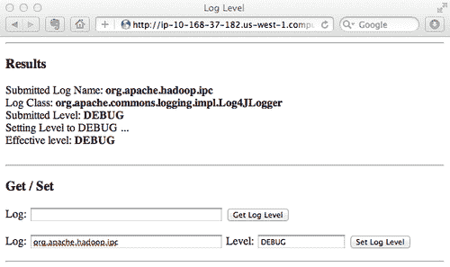

# 第六章设备维护和安全

在本章中，我们将重点介绍：

*   启用 HBase RPC 调试级日志记录
*   宽限节点停用
*   将节点添加到群集
*   滚动重启
*   用于管理 HBase 进程的简单脚本
*   简化部署的简单脚本
*   针对 Hadoop 和 HBase 的 Kerberos 身份验证
*   使用 Kerberos 配置 HDFS 安全性
*   HBase 安全配置

# 简介

群集交付运行后，在群集使用期间，维护将是一项必要的持续任务。 典型的维护任务包括查找和纠正故障、更改集群大小、更改配置等。

HBase 最重要的特性之一是它非常容易扩展。 随着您的服务和数据不断增长，您可能需要向群集添加节点。

正常的节点停用和滚动重启也是必要的。 最大限度地减少退役和重启过程中的离线时间是一项重要的任务。 重要的是保持数据分布与重启前相同，保持数据的局部性。

另一项维护任务是管理 HBase 部署。 有很多方法可以将您的 HBase 部署到集群。 最简单的方法是使用基于脚本的方法在整个集群中同步 HBase 安装和配置。

我们将在本章的前六个食谱中介绍这些主题。

本章还将介绍*安全性*。 随着 HBase 变得越来越流行，不同的用户和群体可能会在一个共享的 HBase 集群中存储更多的数据。 您可能不希望所有用户都拥有对每个 HBase 表的完全权限。 这会给您的数据带来风险；例如，安全风险或丢失的数据操作。 您可能希望验证用户的身份，并根据用户的身份拥有对 HBase 表的访问控制。

在 Hadoop 0.20.203 发布之前，Hadoop 中没有验证用户身份的机制。 Hadoop 使用用户的当前登录名作为其 Hadoop 用户名(即，相当于 `whoami)`)。 HDFS 本身不会验证此用户名是否真实以及是否属于实际操作员。

较新版本的 Hadoop(0.20.203 及更高版本)支持客户端的可选 Kerberos 身份验证。 通过此安全支持，它可以在共享 HDFS 群集上存储敏感数据(如财务数据)。

HBase 利用 HDFS 安全性为其客户端提供安全访问。 HBase 在其 0.92 版本中增加了安全支持。 只有经过身份验证的用户才能访问受保护的 HBase。 还可以在 HBase 中添加基于表或基于列族的访问控制。

在本章的最后三个步骤中，我们将安装 Kerberos，然后使用 Kerberos 设置 HDFS 安全性，最后设置安全的 HBase 客户端访问。

# 启用 HBase RPC 调试级日志记录

Hadoop 和 HBase 使用 log4j 库来写入它们的日志。 日志记录级别在 `log4j.properties`文件中设置。 在生产中，日志记录级别通常设置为 INFO 级别，这适用于许多情况。 但是，在某些情况下，您可能希望查看特定 Hadoop/HBase 守护进程的调试信息。

HBase 继承了 Hadoop 的在线日志级别更改功能。 可以从其 Web 用户界面更改 HBase 守护程序的日志记录级别，而无需重新启动该守护程序。

当您需要知道 HBase 守护进程的调试信息但无法重新启动它时，此功能非常有用。 一种典型的情况是对生产 HBase 群集进行故障排除。

在本指南中，我们将介绍如何启用 HBase RPC 调试级日志记录。

## 做好准备

启动 HBase 群集并从以下 URL 打开 HBase Web UI：

`http://<master_host>:60010/master.jsp`

## 怎么做……

无需重新启动 HBase 守护程序即可启用 HBase RPC 调试级日志记录的说明如下：

1.  通过单击 Region Server 链接，显示 HBase Web UI 中的 Region Server Web UI。
2.  单击区域服务器 Web 用户界面左上角的**Log Level**链接。
3.  获取特定包或类的当前日志记录级别。
4.  Enter a package name (for example, `org.apache.hadoop.ipc)` in the **Log** textbox and click on the **Get Log Level** button. You will get an output as shown in the following screenshot:

    

5.  输入程序包名和日志记录级别，然后单击**Set Log Level**按钮以设置程序包的日志记录级别(例如，DEBUG)。
6.  You will get an output page, as shown in the following screenshot, that shows **Effective level: DEBUG,** which means that the package's logging level has been changed to DEBUG:

    

7.  现在您应该能够检查区域服务器的日志文件中的调试日志，如下所示：

    ```scala
    2012-02-10 22:14:42,878 DEBUG org.apache.hadoop.ipc.HBaseClient: IPC Client (47) connection to ip-10-176-201-128.us-west- 1.compute.internal/10.176.201.128:60000 from hadoop sendi
    2012-02-10 22:14:42,879 DEBUG org.apache.hadoop.ipc.HBaseClient: IPC Client (47) connection to ip-10-176-201-128.us-west-1.compute.internal/10.176.201.128:60000 from hadoop got v
    2012-02-10 22:14:42,880 DEBUG org.apache.hadoop.ipc.RPCEngine: Call: regionServerReport 2

    ```

### 它是如何工作的.

Hadoop 有自己的在线日志更改工具。 可以从 Hadoop 守护程序的 Web 用户界面获取或设置其日志记录级别。 这对于调试不允许重新启动的生产群集很有用。

HBase 只是从 Hadoop 继承了这个功能。 要在特定区域服务器上启用特定 HBase 守护进程的调试级日志记录，我们需要找到该区域服务器的 Web UI，然后显示其日志级别页面。 在此页面上，我们可以获取或设置特定 Java 包的日志记录级别。

在我们的演示中，我们将 HBase IPC(org.apache.hadoop.ipc)包的日志记录级别设置为 DEBUG。 因此，HRegionServer 守护进程开始将其 IPC 调试信息写入其日志文件。

Hadoop/HBase 守护程序可能会在短时间内生成大量调试日志。 在获得足够的调试信息后，不要忘记将其设置回信息级别。

### 还有更多...

我们还可以使用 `hadoop daemonlog`命令获取/设置日志记录级别。 以下命令获取在 localhost 上运行的 HMaster 守护程序的 IPC 日志级别：

```scala
$ $HADOOP_HOME/bin/hadoop daemonlog -getlevel localhost:60010 org.apache.hadoop.ipc
Connecting to http://localhost:60010/logLevel?log=org.apache.hadoop.ipc
Submitted Log Name: org.apache.hadoop.ipc
Log Class: org.apache.commons.logging.impl.Log4JLogger
Effective level: INFO

```

不带参数执行 `hadoop daemonlog`将打印命令的用法。

```scala
$ $HADOOP_HOME/bin/hadoop daemonlog
USAGES:
java org.apache.hadoop.log.LogLevel -getlevel <host:port><name>
java org.apache.hadoop.log.LogLevel -setlevel <host:port><name><level>

```

# 平稳节点退役

在本食谱中，我们将介绍如何优雅地停止区域服务器。

只需调用以下命令即可停止区域服务器上的 RegionServer 守护程序：

```scala
hadoop@slave1$ $HBASE_HOME/bin/hbase-daemon.sh stop regionserver

```

但是，这种方法有一个缺点，即在停止过程中，部署在停止区域服务器上的区域将会脱机一段时间。 在生产中，特别是对于处理在线请求的集群，预计会优雅地停止区域服务器，以最大限度地减少区域的离线时间。

在本食谱中，我们将描述 HBase 如何支持其优雅的节点退役特性。

## 做好准备

启动您的 HBase 集群，并以启动集群的用户(在我们的演示中是 `hadoop`用户)的身份登录到主节点。

## 怎么做……

正常停用区域服务器的说明如下：

1.  通过调用以下命令优雅地停止区域服务器：

    ```scala
    hadoop@master1$ $HBASE_HOME/bin/graceful_stop.sh ip-10-160-226- 84.us-west-1.compute.internal
    Disabling balancer!
    HBase Shell; enter 'help<RETURN>' for list of supported commands.
    Type "exit<RETURN>" to leave the HBase Shell
    Version 0.92.0, r1231986, Tue Jan 17 02:30:24 UTC 2012
    balance_switch false
    true
    0 row(s) in 1.3370 seconds
    Unloading ip-10-160-226-84.us-west-1.compute.internal region(s)
    12/01/31 23:32:16 INFO region_mover: Moving 2 region(s) from ip- 10-160-226-84.us-west-1.compute.internal,60020,1328020203720 during this cycle
    12/01/31 23:32:16 INFO region_mover: Moving region 5740a39d9eaa59c4175487c14e0a272a (0 of 2) to server=ip-10-161-83- 13.us-west-1.compute.internal,60020,1328013827479
    12/01/31 23:32:17 INFO region_mover: Moving region f6a1084fc7534c15696f4baa4abf61ce (1 of 2) to server=ip-10-161-83- 13.us-west-1.compute.internal,60020,1328013827479
    12/01/31 23:32:18 INFO region_mover: Wrote list of moved regions to /tmp/ip-10-160-226-84.us-west-1.compute.internal
    Unloaded ip-10-160-226-84.us-west-1.compute.internal region(s)
    ip-10-160-226-84.us-west-1.compute.internal: stopping regionserver...

    ```

2.  由于 `graceful_stop.sh`脚本将在实际停止区域服务器守护进程之前关闭 HBase 的负载平衡，因此如果需要，请再次显式启用它：

    ```scala
    hadoop@master1$ echo 'balance_switch true' | $HBASE_HOME/bin/hbase shell
    HBase Shell; enter 'help<RETURN>' for list of supported commands.
    Type "exit<RETURN>" to leave the HBase Shell
    Version 0.92.0, r1231986, Tue Jan 17 02:30:24 UTC 2012
    balance_switch true
    false
    0 row(s) in 1.4450 seconds

    ```

## 它是如何工作的.

停止区域服务器是以区域服务器为中心的操作。 它关闭区域服务器上部署的区域，并自行停止。 主服务器只能通过删除 ZooKeeper 中的区域服务器的 Znode 来获知区域服务器的消失，区域服务器调用该 Z 节点是它退出的最后一件事。 在关闭期间以及在主服务器得知区域服务器被移除之前，会有一个很大的不可用窗口。 因此，为了最小化此窗口，我们使用了一种优雅的关闭方式。 它一次(优雅地)将区域从区域服务器上移出一个。

`graceful_stop.sh`脚本将区域移出区域服务器，然后停止它。 由于区域首先移动到其他区域服务器，避免了停止过程中的区域离线时间。

在移动部署在特定区域服务器上的区域之前，脚本将首先关闭集群的负载均衡器。 这一点很重要，因为平衡器可能会在 `graceful_stop.sh`脚本移动区域的同时平衡集群中的区域。 我们必须通过关掉平衡器来避免这种情况。

从步骤 1 的输出中可以看到，在关闭负载均衡器后，脚本将两个地域从指定的服务器移动到其他地域服务器，最后停止了地域服务器。

由于 `graceful_stop.sh`脚本关闭了负载均衡器，因此您可能需要在节点停用后再次打开它。 这就是我们在步骤 2 中所做的。

确保将 HBase web UI 上显示的准确主机名传递给 `graceful_stop.sh`，否则它实际上不会将区域优雅地移动到其他区域服务器。

`graceful_stop.sh`脚本的全部用法如下所示：

```scala
./graceful_stop.sh
Usage: graceful_stop.sh [--config <conf-dir>] [--restart] [-- reload] [--thrift] [--rest] <hostname>
thrift If we should stop/start thrift before/after the hbase stop/start
rest If we should stop/start rest before/after the hbase stop/start
restart If we should restart after graceful stop
reload Move offloaded regions back on to the stopped server
debug Display extra debug logging
hostname Hostname of server we are to stop

```

## 还有更多...

您可能已经注意到， `graceful_stop.sh`脚本有 `restart`和 `reload`选项。 这些选项用于滚动重启 HBase 集群。 稍后我们将在*滚动重启*配方中对其进行描述。

## 另请参阅

在本章中：

*   *滚动重新启动*

# 将节点添加到群集

HBase 最重要的特性之一是它具有极强的可伸缩性。 HBase 通过将节点添加到群集进行线性横向扩展。 您可以轻松地从一个小群集开始，并在您的服务和数据增长时向外扩展。 向 HBase 集群添加区域服务器将是管理员的一项重要维护任务。

一个 HBase 群集只能有一个活动的主节点。 但是，我们可以向集群添加一个备份主节点，以使 HBase 主节点**高度可用(HA)**。

在本食谱中，我们将介绍如何向 HBase 集群添加备份主节点。 之后，我们还将介绍如何将区域服务器添加到集群。

## 做好准备

首先在新的主服务器或区域服务器上下载并安装 HBase。 确保该节点上的 HBase 配置与群集中的其他节点同步。

地域服务器通常运行在 Hadoop 的同一 DataNode/TaskTracker 上。 您可能还想在该节点上安装 Hadoop 并启动 DataNode 和 TaskTracker。

我们假设您已经在该新节点上准备好了所有 Hadoop/HBase 目录、配置和操作系统/用户设置。 有关这些初始设置的详细信息，请参阅[第 1 章](01.html "Chapter 1. Setting Up HBase Cluster")，*设置 HBase 群集*。

## 怎么做……

将备份主节点添加到群集的说明如下：

1.  在备份主节点上启动 HBase 主守护进程：

    ```scala
    hadoop@master2$ $HBASE_HOME/bin/hbase-daemon.sh start master

    ```

    *   从主机日志中，您会发现新启动的主机正在等待成为下一个活动主机：

        ```scala
        org.apache.hadoop.hbase.master.ActiveMasterManager: Another master is the active master, ip-10-176-201-128.us-west- 1.compute.internal,60000,1328878644330; waiting to become the next active master

        ```

2.  将新区域服务器的主机名添加到 `$HBASE_HOME/conf`目录下的 `regionservers`文件中。 例如，要将`"slave4"`添加到集群，我们调用以下命令：

    ```scala
    hadoop@master1$ echo "slave4" >> $HBASE_HOME/conf/regionservers

    ```

3.  在群集中同步修改后的 `regionservers`文件。
4.  登录到新服务器并在那里启动区域服务器守护进程：

    ```scala
    hadoop@slave4$ $HBASE_HOME/bin/hbase-daemon.sh start regionserver

    ```

5.  也可以通过 HBase Shell 手动触发负载均衡，将部分地域迁移到新的地域服务器上。 您还可以等待平衡器的下一次运行，默认情况下，平衡器每五分钟运行一次。

    ```scala
    hbase> balance_switch true
    hbase> balancer

    ```

## 它是如何工作的.

在步骤 1 中，我们只需在备份主节点上启动 HBase 主守护进程。 HBase 使用动物园管理员来协调主人选举。 所有主节点都会竞争在 ZooKeeper 中创建 `/hbase/master`Z 节点。 赢得选举(成功创建 Znode)的节点将成为群集的活动主节点。 因为现在已经存在一个主节点，所以新的主节点进入空闲模式，并且如果当前的主节点关闭，则等待成为下一个活动的主节点。

要添加区域服务器，首先在步骤 2 中将其主机名添加到 `regionservers`文件中。下次启动群集时，区域服务器守护进程将在该节点上自动启动。

由于我们没有重启集群，因此我们在步骤 4 中手动启动了新节点上的地域服务器守护进程。地域服务器将查询 ZooKeeper 来查找并加入集群。

步骤 5 是可选的。 由于新区域服务器上部署的区域较少，因此我们可以显式触发负载均衡，将一些区域移到其中。 默认情况下，平衡器每五分钟运行一次，因此我们也可以等待平衡器的下一次运行。

## 还有更多...

我们还可以通过以下步骤在群集启动时启动备份主机：

1.  将备份主节点添加到 `conf/backup-masters`文件：

    ```scala
    hadoop@master1$ echo "master2" >> $HBASE_HOME/conf/backup-masters

    ```

2.  在群集中同步 `backup-masters`文件。
3.  正常启动 HBase，您会发现备份主节点上会启动一个备份 HBase 主节点：

    ```scala
    hadoop@master1$ $HBASE_HOME/bin/start-hbase.sh
    starting master, logging to /usr/local/hbase/logs/hbase-hadoop- master-master1.out
    slave2: starting regionserver, logging to /usr/local/hbase/logs/hbase-hadoop-regionserver-slave2.out
    slave1: starting regionserver, logging to /usr/local/hbase/logs/hbase-hadoop-regionserver-slave1.out
    slave3: starting regionserver, logging to /usr/local/hbase/logs/hbase-hadoop-regionserver-slave3.out
    master2: starting master, logging to /usr/local/hbase/logs/hbase- hadoop-master-master2.out

    ```

    *   备份主机上的主日志表明它是备份主机：

        ```scala
        hadoop@master2$ tail /usr/local/hbase/logs/hbase-hadoop-master-master2.log
        2012-02-10 23:12:07,016 INFO org.apache.hadoop.hbase.master.ActiveMasterManager: Another master is the active master, ip-10-176-201-128.us-west- 1.compute.internal,60000,1328883123244; waiting to become the next active master

        ```

# 滚动重启

当升级到新的 HBase 版本时，或者当您想要应用一些配置更改时，您可能想要调用滚动重启。 正如*优雅节点退役*配方中所述，滚动重启可以最大限度地减少停机时间，因为我们一次只离线一个区域，而不是整个集群。 滚动重新启动使区域分布与重新启动前相同。 这对于保持数据的局部性很重要。

### 备注

新的 HBase 版本并不总是向后兼容。 您可以调用滚动重启来升级次要版本(例如，从 0.92.1 升级到 0.92.2)，但不能跨主要版本升级(例如，从 0.92.x 升级到 0.94.x)，因为这些版本之间的协议已更改。 这将在 HBase 0.96 中发生变化，届时您将能够让旧客户端与新服务器对话，反之亦然。

有关从一个版本升级到另一个版本的详细信息，请查看以下链接：

[http：//hbase.apache.org/book.html#upgrading](http://hbase.apache.org/book.html#upgrading)

滚动重新启动包含重新启动主服务器、正常重新启动区域服务器以及在重新启动后检查数据一致性的步骤。 我们将在本食谱中描述这些步骤。

## 做好准备

启动您的 HBase 集群。 以启动群集的用户身份登录到主节点。

## 怎么做……

滚动重启 HBase 集群的说明如下：

1.  运行 `hbck`以确保群集一致：

    ```scala
    hadoop@master1$ $HBASE_HOME/bin/hbase hbck
    0 inconsistencies detected.
    Status: OK

    ```

2.  重新启动主后台进程：

    ```scala
    hadoop@master1$ $HBASE_HOME/bin/hbase-daemon.sh stop master
    hadoop@master1$ $HBASE_HOME/bin/hbase-daemon.sh start master

    ```

3.  禁用负载均衡器：

    ```scala
    hadoop@master1$ echo 'balance_switch false' | $HBASE_HOME/bin/hbase shell
    balance_switch false
    true
    0 row(s) in 1.1680 seconds

    ```

4.  创建 `rolling-restart-rs.sh`脚本，如下图所示：

    ```scala
    $ vi rolling-restart-rs.sh
    #!/bin/bash
    HBASE_HOME=/usr/local/hbase/current
    zparent=`$HBASE_HOME/bin/hbase org.apache.hadoop.hbase.util.HBaseConfTool zookeeper.znode.parent`
    if [ "$zparent" == "null" ]; then
    zparent="/hbase"
    fi
    online_regionservers=`$HBASE_HOME/bin/hbase zkcli ls $zparent/rs 2>&1 | tail -1 | sed "s/\[//" | sed "s/\]//"`
    for rs in $online_regionservers
    do
    rs_parts=(${rs//,/ })
    hostname=${rs_parts[0]}
    echo "Gracefully restarting: $hostname"
    $HBASE_HOME/bin/graceful_stop.sh --restart --reload --debug $hostname
    sleep 1
    done

    ```

5.  使脚本可执行，然后执行它以正常重新启动集群中的每个区域服务器守护进程。 您将获得以下输出：

    ```scala
    hadoop@master1$ chmod +x rolling-restart-rs.sh
    hadoop@master1$ ./rolling-restart-rs.sh
    Gracefully restarting: ip-10-160-41-210.us-west-1.compute.internal
    Disabling balancer!
    HBase Shell; enter 'help<RETURN>' for list of supported commands.
    Type "exit<RETURN>" to leave the HBase Shell
    Version 0.92.0, r1231986, Tue Jan 17 02:30:24 UTC 2012
    balance_switch false
    false
    0 row(s) in 1.2060 seconds
    Unloading ip-10-160-41-210.us-west-1.compute.internal region(s)
    Unloaded ip-10-160-41-210.us-west-1.compute.internal region(s)
    ip-10-160-41-210.us-west-1.compute.internal: stopping regionserver...
    ip-10-160-41-210.us-west-1.compute.internal: starting regionserver, logging to /usr/local/hbase/logs/hbase-hadoop- regionserver-slave1.out
    Reloading ip-10-160-41-210.us-west-1.compute.internal region(s)
    Reloaded ip-10-160-41-210.us-west-1.compute.internal region(s)
    Gracefully restarting: ip-10-166-109-91.us-west-1.compute.internal
    ...
    Gracefully restarting: ip-10-176-79-57.us-west-1.compute.internal
    ...
    Reloaded ip-10-176-79-57.us-west-1.compute.internal region(s)

    ```

6.  再次启用负载均衡器：

    ```scala
    hadoop@master1$ echo 'balance_switch true' | $HBASE_HOME/bin/hbase shell
    balance_switch true
    false
    0 row(s) in 1.1730 seconds

    ```

7.  再次运行 `hbck`以确保群集一致：

    ```scala
    hadoop@master1$ $HBASE_HOME/bin/hbase hbck

    ```

## 它是如何工作的.

在步骤 1 中，我们运行了 `hbck`命令，以确保集群在重启之前保持一致。 之后，我们在步骤 2 中重新启动了主守护进程。

在步骤 3 中，在重启地域服务器之前，我们关闭了均衡器，以避免在重启过程中出现均衡的情况。

我们在步骤 4 中创建的 `rolling-restart-rs.sh`脚本首先通过从 `hbase`命令调用 `org.apache.hadoop.hbase.util.HBaseConfTool`类来获取 zooKeeper(Zparent)中的根 Z 节点。 `HBaseConfTool`是用于获取运行时 HBase 配置的 Java 类。 向其传递 `zookeeper.znode.parent`将返回 `zparent`设置(如果已设置)。 如果未设置 `zparent`，则使用默认值 `/hbase`。

每个在线区域服务器在 ZooKeeper 的 `$zparent/rs`下都有自己的 Znode。 我们使用它通过调用 `hbase zkcli ls`命令来获取在线区域服务器的列表。 返回值是一个包含空格分隔的在线区域服务器的字符串，例如 `[region_server1,port,startcode region_server2,port,startcode region_server3,port,startcode]`。 我们没有从 `conf/regionservers`文件中获取区域服务器列表。 这是因为，在某些环境中，例如在 Amazon EC2 中使用自己的 DNS 服务的群集，文件中的主机名可能与 HBase 提供的主机名不同。 `graceful_stop.sh`脚本只接受 HBase 中使用的主机名，该主机名显示在 HBase web 用户界面上。

对于列表中的每个区域服务器，我们调用传递 `--restart --reload --debug`选项的 `graceful_stop.sh`命令和服务器的主机名，以正常地重新启动该节点上的区域服务器。

从步骤 5 的输出中可以看到，对于每个在线区域服务器， `rolling-restart-rs.sh`脚本一次将一个区域移出区域服务器，重新启动它们，然后将移动的区域重新加载回区域服务器。

在所有区域服务器正常重启之后，在步骤 6 中重新启动之前，我们再次将负载均衡器启用到其状态。

最后，在步骤 7 中，我们再次执行 `hbck`以确保集群一致运行。

## 还有更多...

请注意，在 `$HBASE_HOME/bin`目录中有一个 `rolling-restart.sh`脚本。 我们没有使用此脚本，因为我们希望优雅地重新启动我们的区域服务器，而脚本中没有实现这一点。

### 备注

有一个补丁可以使 `rolling-restart.sh`以与本食谱前面描述的方式相同的方式工作。 该修补程序计划用于 0.96 版。 您可以在[https://issues.apache.org/jira/browse/HBASE-5314](http://https://issues.apache.org/jira/browse/HBASE-5314)查看它以了解详细信息。

# 管理 HBase 进程的简单脚本

当集群中的节点不断增长时，您可能希望找到工具来显示和管理集群中运行的与 HBase 相关的进程。 由于 `hadoop`用户配置为无需密码即可从主节点 SSH 到集群中的每个从节点，因此我们很容易编写一个简单的脚本来完成此任务，只需对每个节点进行 SSH 登录，并显示/管理该节点上正在运行的 HBase 进程。

由于 Hadoop/HBase 进程在**Java 虚拟机(JVM)**中运行，我们的任务是管理集群中的这些 Java 进程。

在本食谱中，我们将创建一个简单的脚本来显示 HBase 集群中 `hadoop`用户拥有的所有正在运行的 Java 进程。

## 做好准备

启动您的 HBase 集群。 以启动群集的用户身份登录到主节点。

我们假设您以同一用户(这里的 `hadoop`用户)身份运行 HDFS 和 HBase。

## 怎么做……

创建管理 HBase 进程的简单脚本的说明如下：

1.  创建 `cluster-jps.sh`脚本，如下图所示：

    ```scala
    $ vi cluster-jps.sh
    #!/bin/bash
    # Show all running Java processes on region servers. Must run on master using HBase owner user.
    JAVA_HOME=/usr/local/jdk1.6
    HBASE_HOME=/usr/local/hbase/current
    IFS=$'\n'
    printf "+------------------------------+----------+--------------------+\n"
    printf "|%-30s|%-10s|%-20s|\n" " HOST" " PID" " PROCESS"
    printf "+------------------------------+----------+--------------------+\n"
    process_count=0
    rs_count=0
    for rs in `cat $HBASE_HOME/conf/regionservers`
    do
    i=1
    for process in `ssh $rs "$JAVA_HOME/bin/jps" | grep -v Jps`
    do
    process_parts=(${process/ /$'\n'})
    pid=${process_parts[0]}
    pname=${process_parts[1]}
    if [ $i -eq 1 ]; then
    host="$rs"
    else
    host=" "
    fi
    printf "|%-30s|%-10s|%-20s|\n" " $host" " $pid" " $pname"
    i=`expr $i + 1`
    process_count=`expr $process_count + 1`
    done
    rs_count=`expr $rs_count + 1`
    printf "+------------------------------+----------+--------------------+\n"
    done
    echo -e "$process_count running Java processes on $rs_count region servers.\n"

    ```

2.  以在主节点上启动 Hadoop/HBase 的用户身份运行脚本：

    ```scala
    hadoop@master1$ chmod +x cluster-jps.sh
    hadoop@master1$ ./cluster-jps.sh

    ```

3.  You will get an output as shown in the following screenshot:

    

4.  要显示主节点上的主进程，请调用以下命令：

    ```scala
    hadoop@master1$ $JAVA_HOME/bin/jps
    3005 Jps
    1680 QuorumPeerMain
    1781 HMaster
    1538 NameNode

    ```

## 它是如何工作的.

在此脚本中，我们将从 `conf/regionservers`文件中获取区域服务器列表。 然后，对于每个区域服务器，SSH 登录到该服务器并在其上运行 `jps`命令。 `Jps`是随 JDK 安装一起提供的命令，用于显示用户拥有的正在运行的 Java 进程。 我们需要的最基本信息，**进程 ID(PID)**和每个 Java 进程的名称都包含在 `jps`命令的输出中。

脚本的其余部分只收集每个节点的 `jps`命令输出，并以友好的格式显示结果。

正如我们在步骤 4 中所做的那样，我们还可以使用 `jps`命令来显示在主节点上运行的 Java 进程。 在此脚本中，我们跳过了显示主服务器的 Java 进程的逻辑。

如[第 5 章](05.html "Chapter 5. Monitoring and Diagnosis")，*监视和诊断*的*设置 Nagios 以监视 HBase 进程*配方中所述，您需要确保仔细监视这些 Java 进程。

# 简化部署的简单脚本

有很多方法可以将您的 HBase 部署到集群。 因为 Hadoop 和 HBase 都是用 Java 编写的，所以大多数部署都是通过简单地将所有文件复制到集群中的节点来完成的。

最简单的方法是使用基于脚本的方法在整个集群中同步 HBase 安装和配置。 与其他现代部署管理工具相比，它可能不那么酷，但对于小型甚至中型集群来说，它工作得很好。

在本食谱中，我们将创建一个简单的脚本来将 HBase 安装从其主节点同步到集群中的所有区域服务器。 此方法也可用于部署 Hadoop。

## 做好准备

以启动群集的用户身份登录到主节点。 我们假设您已经为用户设置了从主节点到区域服务器的非密码 SSH。

## 怎么做……

创建简单脚本以简化 HBase 部署的说明如下：

1.  创建 `cluster-deploy.sh`脚本，如下图所示：

    ```scala
    $ vi cluster-deploy.sh
    #!/bin/bash
    # Sync HBASE_HOME across the cluster. Must run on master using HBase owner user.
    HBASE_HOME=/usr/local/hbase/current
    for rs in `cat $HBASE_HOME/conf/regionservers`
    do
    echo "Deploying HBase to $rs:"
    rsync -avz --delete --exclude=logs $HBASE_HOME/ $rs:$HBASE_HOME/
    echo
    sleep 1
    done
    echo "Done"

    ```

2.  以在主节点上启动 Hadoop/HBase 的用户身份运行脚本：

    ```scala
    hadoop@master1$ chmod +x cluster-deploy.sh
    hadoop@master1$ ./cluster-deploy.sh
    Deploying HBase to slave1:
    sending incremental file list
    ./
    conf/
    conf/hbase-site.xml
    sent 40023 bytes received 259 bytes 80564.00 bytes/sec
    total size is 55576486 speedup is 1379.69
    Deploying HBase to slave2:
    ...
    Deploying HBase to slave3:
    ...
    Done

    ```

## 它是如何工作的.

该脚本使用的事实是， `conf/regionservers`文件中列出了所有区域服务器。 它从文件中读取每个区域服务器的主机名，然后调用 `rsync`命令将 HBase 安装目录从主节点同步到该区域服务器。 我们将 `--delete`选项添加到 `rsync`命令，因为我们希望从区域服务器中删除不必要的文件。

要使用此脚本，请在主节点上进行一些 HBase 配置更改，然后使用 HBase 所有者用户运行该脚本。

## 还有更多...

当群集变得更大时，您可能希望尽可能自动执行部署，例如新节点的操作系统和用户设置、获取和部署软件包以及从中心版本管理的配置中心设置文件。

对于这些类型的部署任务，您可能希望尝试使用 Pupppt 或 Chef。 互联网上有一些 HBase 的木偶和厨师配置示例，其 URL 如下：

*   木偶配方：[http://hstack.org/hstack-automated-deployment-using-puppet/](http://hstack.org/hstack-automated-deployment-using-puppet/)
*   厨师食谱：[https://github.com/ueshin/chef-cookbooks](http://https://github.com/ueshin/chef-cookbooks)

您可能想尝试的另一个工具是 Apache bigtop，它可以在以下位置找到：

[http：//incubator.apache.org/bigtop/](http://incubator.apache.org/bigtop/)

Bigtop 是一个开发 Hadoop 生态系统打包和测试的项目。 它还没有准备好进入黄金时间，但是对于轻松构建和部署 Hadoop 和 HBase 来说，它是一个很棒的工具。

# 针对 Hadoop 和 HBase 的 Kerberos 身份验证

最近发布的 Hadoop 1.0 和 HBase 0.92 增加了安全支持。 启用安全保护后，只有经过身份验证的用户才能访问 Hadoop 和 HBase 群集。 身份验证由受信任管理员管理的单独身份验证服务提供。 这使得 HBase 成为存储金融数据等敏感大数据的一个相当不错的选择。

Hadoop 依靠 Kerberos 身份验证服务提供安全支持。 安全的 HBase 必须在具有安全支持的 HDFS 上运行，因此 HBase 还依赖 Kerberos 为其提供安全支持。

以下是维基百科对 Kerberos 的描述：

> Kerberos 是一种计算机网络认证协议，它基于“票证”工作，以允许在非安全网络上通信的节点以安全的方式相互证明其身份。

使用最广泛的 Kerberos 实现是 MIT Kerberos。 在本食谱中，我们将介绍如何安装和设置 MIT Kerberos。 安装包括设置 Kerberos 管理服务器和**密钥分发中心(KDC)。**

## 做好准备

安装 MIT Kerberos 需要 Linux 服务器。 确保您在该服务器上具有 root 权限。 在这个配方中，我们假设服务器的主机名是 `master2`。

使用以下命令提前在服务器上创建 Kerberos 日志目录：

```scala
$ sudo mkdir /var/log/kerberos

```

## 怎么做……

安装 MIT Kerberos 的说明如下：

1.  Install the Kerberos admin server and KDC:

    ```scala
    hac@master2$ sudo apt-get install krb5-{admin-server,kdc}

    ```

    *   在安装过程中，系统将要求您输入默认域名。 Kerberos 领域的标准名称是您的大写域名。 当我们在本书中使用`hbase-admin-cookbook.com`作为我们的域时，我们将选择`HBASE-ADMIN-COOKBOOK.COM`作为域名，如以下屏幕截图所示：

    

    *   安装过程还会要求您输入 Kerberos 服务器和管理服务器。 在此处输入您的服务器的完全限定域名。 在我们的演示中，它是`master2.hbase-admin-cookbook.com.`
2.  Create a realm using the following command:

    ```scala
    hac@master2$ sudo krb5_newrealm

    ```

    ### 备注

    该命令将要求提供主密码。 输入您的密码，不要忘记。

3.  通过编辑 `krb5.conf`文件配置 Kerberos，如下图所示：

    ```scala
    hac@master2$ sudo vi /etc/krb5.conf
    [realms]
    HBASE-ADMIN-COOKBOOK.COM = {
    kdc = master2.hbase-admin-cookbook.com
    admin_server = master2.hbase-admin-cookbook.com
    default_domain = hbase-admin-cookbook.com
    }
    [domain_realm]
    .hbase-admin-cookbook.com = HBASE-ADMIN-COOKBOOK.COM
    hbase-admin-cookbook.com = HBASE-ADMIN-COOKBOOK.COM
    [logging]
    kdc = FILE:/var/log/kerberos/krb5kdc.log
    admin_server = FILE:/var/log/kerberos/kadmin.log
    default = FILE:/var/log/kerberos/krb5lib.log

    ```

4.  通过取消注释 `kadm5.acl`文件中的以下行，授予管理员用户完全权限：

    ```scala
    hac@master2$ sudo vi /etc/krb5kdc/kadm5.acl
    */admin *

    ```

5.  重新启动 Kerberos 管理服务器和 KDC 以应用更改：

    ```scala
    hac@master2$ sudo invoke-rc.d krb5-admin-server restart
    hac@master2$ sudo invoke-rc.d krb5-kdc restart

    ```

6.  在 `kadmin.local`控制台中测试安装和配置：

    ```scala
    hac@master2$ sudo kadmin.local
    Authenticating as principal root/admin@HBASE-ADMIN-COOKBOOK.COM with password.
    kadmin.local: listprincs
    K/M@HBASE-ADMIN-COOKBOOK.COM
    kadmin/admin@HBASE-ADMIN-COOKBOOK.COM
    kadmin/changepw@HBASE-ADMIN-COOKBOOK.COM
    kadmin/history@HBASE-ADMIN-COOKBOOK.COM
    kadmin/ip-10-174-14-251.us-west-1.compute.internal@HBASE-ADMIN- COOKBOOK.COM
    krbtgt/HBASE-ADMIN-COOKBOOK.COM@HBASE-ADMIN-COOKBOOK.COM

    ```

7.  创建具有管理权限的主体：

    ```scala
    kadmin.local: addprinc root/admin
    WARNING: no policy specified for root/admin@HBASE-ADMIN- COOKBOOK.COM; defaulting to no policy
    Enter password for principal "root/admin@HBASE-ADMIN- COOKBOOK.COM":
    Re-enter password for principal "root/admin@HBASE-ADMIN- COOKBOOK.COM":
    Principal "root/admin@HBASE-ADMIN-COOKBOOK.COM" created.

    ```

8.  将测试用户帐户(“主体”)添加到 Kerberos：

    ```scala
    kadmin.local: addprinc hac

    ```

9.  退出 `kadmin.local`控制台，并通过获取 Kerberos 票证测试测试用户的身份验证：

    ```scala
    kadmin.local: quit
    hac@master2$ klist -5
    klist: No credentials cache found (ticket cache FILE:/tmp/krb5cc_1002)
    hac@master2$ kinit
    Password for hac@HBASE-ADMIN-COOKBOOK.COM:
    hac@master2$ klist -5
    Ticket cache: FILE:/tmp/krb5cc_1002
    Default principal: hac@HBASE-ADMIN-COOKBOOK.COM
    Valid starting Expires Service principal
    02/05/12 11:48:49 02/05/12 21:48:49 krbtgt/HBASE-ADMIN- COOKBOOK.COM@HBASE-ADMIN-COOKBOOK.COM
    renew until 02/06/12 11:48:46

    ```

10.  使用以下命令终止缓存的票证：

    ```scala
    hac@master2$ kdestroy
    hac@master2$ klist -5
    klist: No credentials cache found (ticket cache FILE:/tmp/krb5cc_1002)

    ```

11.  使用以下命令删除测试用户帐户：

    ```scala
    hac@master2$ sudo kadmin.local
    kadmin.local: delprinc hac

    ```

## 它是如何工作的.

我们在同一台 `master2`服务器上安装了 Kerberos 管理服务器和 KDC。 在安装期间，我们将 `HBASE-ADMIN-COOKBOOK.COM`设置为默认领域。 该领域实际上是在步骤 2 中使用 `krb5_newrealm`命令创建的。

在步骤 3 中，我们在 `/etc/krb5.conf`文件中配置了 Kerberos 的域、域和日志设置。 在步骤 4 中，我们向管理员用户授予了完全权限。之后，我们重新启动 Kerberos 以应用更改。

为了测试安装和配置，我们在步骤 6 进入了 Kerberos 的 `kadmin.local`控制台。 `kadmin.local`是操作 Kerberos 的提示控制台。 只有 Kerberos 管理服务器上的 `root`用户可以进入 `kadmin.local`控制台并在那里执行 Kerberos 管理命令。

在步骤 6 中，我们还运行了 `listprincs`命令来显示 Kerberos 的初始主体。Kerberos 中的唯一标识(用户、主机等)称为**主体**。 主体的格式为 `primary/instance@REALM`。

在步骤 7 中，我们向 Kerberos 添加了一个管理员用户( `root`用户)。 通过输入 Kerberos 密码(而不是操作系统密码)，来自 Kerberos 客户端的 `root`用户将能够通过 `kadmin`控制台执行 Kerberos 的管理命令。 `kadmin`控制台类似于 `kadmin.local`，但是可以使用管理员用户从其他 Kerberos 客户端进入。 当您需要授予 admin 用户，但不希望他们拥有对 Kerberos 管理服务器的 root 访问权限时，它很有用。

我们还在步骤 8 中为 `hac`用户添加了一个测试主体，并从步骤 9 到步骤 11 测试了它的身份验证。

Kerberos 用户需要票证才能访问 Kerberos 经过身份验证的服务。 票证由 KDC 发行**票证授予票证(TGT)**。 要获得 TGT，用户需要提供他们的 Kerberos 密码来证明他们的身份。 Kerberos TGT 可以缓存，并将在配置的时间之后过期。

在步骤 9 中，我们使用 `klist`命令显示了 `hac`用户缓存的 TGT。 结果是空的，这是我们预期的。 然后，我们使用 `kinit`命令请求 TGT。 之后， `klist`命令显示缓存的 TGT 及其到期日期。 在步骤 10 中使用 `kdestroy`命令删除了缓存的 TGT。

## 还有更多...

在本食谱中，我们进行了基本的 Kerberos 设置。 我们将配置 HDFS 和 HBase 以使用此 Kerberos 安装来提供以下两种方法的安全支持。 Kerberos 的细节超出了本书的范围。 有关详细信息，请参阅以下 URL：

*   *kerberos：[http://web.mit.edu/Kerberos/](http://web.mit.edu/Kerberos/)的网络身份验证协议*

## 另请参阅

在本章中：

*   *使用 Kerberos 配置 HDFS 安全性*
*   *HBase 安全配置*

# 使用 Kerberos 配置 HDFS 安全性

较新版本的 Hadoop(0.20.203 及更高版本)支持可选的客户端 Kerberos 身份验证。 此安全支持包括安全 HDFS 和安全 MapReduce 配置。

Hadoop 安全的动机不是为了防御黑客，因为所有大型 Hadoop 集群都在防火墙后面，只允许员工访问它们。 其目的只是允许将敏感数据(如财务数据)存储在共享群集上。

Hadoop 的以前版本已经在 HDFS 中拥有文件所有权和权限；限制是它们没有验证用户身份的机制。 有了这种 Kerberos 安全支持，Kerberos 将验证用户身份，并且只允许经过身份验证的用户访问 HDFS 群集。

由于安全的 HBase 访问预计运行在安全的 HDFS 集群之上，因此设置 HDFS 安全是配置 HBase 安全的先决条件。 在本食谱中，我们将重点介绍如何使用 Kerberos 配置 HDFS 安全性。

## 做好准备

我们假设您有一个正在工作的**Kerberos 密钥分发中心(KDC)**，并设置了领域。 有关安装和配置 Kerberos 的更多信息，请参阅本章中的用于 Hadoop 和 HBase 的*Kerberos 身份验证食谱。*

我们假设每个节点上的 `root`用户在 Kerberos 中具有管理权限。 在此假设下，我们将使用 `kadmin`控制台执行 Kerberos 管理命令。 如果这一假设不成立，您将需要通过 Kerberos 管理服务器上的 `kadmin.local`控制台操作 Kerberos。

在群集的每个节点上，使用以下命令创建一个目录来存储 Kerberos 密钥表文件：

```scala
$sudo mkdir /etc/hadoop

```

在执行本食谱中讨论的步骤之前，请关闭您的集群。

## 怎么做……

要使用 Kerberos 配置 HDFS 安全，请在*群集的每个节点上执行以下步骤：*

1.  安装 Kerberos 客户端软件：

    ```scala
    $ sudo apt-get install krb5-{config,user} libpam-krb5

    ```

2.  使用以下命令进入 `kadmin`控制台：

    ```scala
    $ sudo kadmin

    ```

3.  将 `hadoop`用户主体添加到 Kerberos。 将主体的主机名部分(`ip-10-168-46-11.us-west-1.compute.internal`)替换为主机的**完全限定域名(FQDN)：**

    ```scala
    kadmin: addprinc -randkey hadoop/ip-10-168-46-11.us-west- 1.compute.internal

    ```

4.  将主机主体添加到 Kerberos。 将主体的主机名部分替换为主机的 FQDN：

    ```scala
    kadmin: addprinc -randkey host/ip-10-168-46-11.us-west- 1.compute.internal

    ```

5.  使用以下命令创建密钥表文件：

    ```scala
    kadmin: ktadd -k /etc/hadoop/hadoop.keytab -norandkey hadoop/ip- 10-168-46-11.us-west-1.compute.internal host/ip-10-168-46-11.us- west-1.compute.internal

    ```

6.  退出 `kadmin`控制台，确认密钥表文件是否创建正确：

    ```scala
    kadmin: quit
    $ klist -e -k -t /etc/hadoop/hadoop.keytab
    Keytab name: WRFILE:/etc/hadoop/hadoop.keytab
    KVNO Timestamp Principal
    ---- ----------------- ------------------------------------------- -------------
    5 02/05/12 16:03:34 hadoop/ip-10-168-46-11.us-west- 1.compute.internal@HBASE-ADMIN-COOKBOOK.COM (AES-256 CTS mode with 96-bit SHA-1 HMAC)
    5 02/05/12 16:03:34 hadoop/ip-10-168-46-11.us-west- 1.compute.internal@HBASE-ADMIN-COOKBOOK.COM (ArcFour with HMAC/md5)
    5 02/05/12 16:03:34 hadoop/ip-10-168-46-11.us-west- 1.compute.internal@HBASE-ADMIN-COOKBOOK.COM (Triple DES cbc mode with HMAC/sha1)
    5 02/05/12 16:03:34 hadoop/ip-10-168-46-11.us-west- 1.compute.internal@HBASE-ADMIN-COOKBOOK.COM (DES cbc mode with CRC-32)
    5 02/05/12 16:03:34 host/ip-10-168-46-11.us-west- 1.compute.internal@HBASE-ADMIN-COOKBOOK.COM (AES-256 CTS mode with 96-bit SHA-1 HMAC)
    5 02/05/12 16:03:34 host/ip-10-168-46-11.us-west- 1.compute.internal@HBASE-ADMIN-COOKBOOK.COM (ArcFour with HMAC/md5)
    5 02/05/12 16:03:34 host/ip-10-168-46-11.us-west- 1.compute.internal@HBASE-ADMIN-COOKBOOK.COM (Triple DES cbc mode with HMAC/sha1)
    5 02/05/12 16:03:34 host/ip-10-168-46-11.us-west- 1.compute.internal@HBASE-ADMIN-COOKBOOK.COM (DES cbc mode with CRC-32)

    ```

7.  确保密钥表文件仅可由 `hadoop`用户读取：

    ```scala
    $ sudo chown hadoop:hadoop /etc/hadoop/hadoop.keytab
    $ sudo chmod 400 /etc/hadoop/hadoop.keytab

    ```

8.  Download the "Java **Cryptography Extension (JCE)** Unlimited Strength Jurisdiction Policy Files 6" from the following URL:

    [http：//www.oracle.com/technetwork/java/javase/downloads/index.html](http://www.oracle.com/technetwork/java/javase/downloads/index.html)

    按照下载文件中的`README`文件安装。

9.  通过将以下配置添加到 `core-site.xml`文件来启用 Hadoop 安全性：

    ```scala
    $ vi $HADOOP_HOME/conf/core-site.xml
    <property>
    <name>hadoop.security.authentication</name>
    <value>kerberos</value>
    </property>
    <property>
    <name>hadoop.security.authorization</name>
    <value>true</value>
    </property>

    ```

10.  通过将以下配置添加到 `hdfs-site.xml`文件来启用 HDFS 安全性：

    ```scala
    $ vi $HADOOP_HOME/conf/hdfs-site.xml<property>
    <name>dfs.block.access.token.enable</name>
    <value>true</value>
    </property>

    ```

11.  将 NameNode 安全配置添加到 `hdfs-site.xml`文件：

    ```scala
    $ vi $HADOOP_HOME/conf/hdfs-site.xml
    <property>
    <name>dfs.https.address</name>
    <value>${your_namenode_host}:50470</value>
    </property>
    <property>
    <name>dfs.https.port</name>
    <value>50470</value>
    </property>
    <property>
    <name>dfs.namenode.keytab.file</name>
    <value>/etc/hadoop/hadoop.keytab</value>
    </property>
    <property>
    <name>dfs.namenode.kerberos.principal</name>
    <value>hadoop/_HOST@HBASE-ADMIN-COOKBOOK.COM</value>
    </property>
    <property>
    <name>dfs.namenode.kerberos.https.principal</name>
    <value>host/_HOST@HBASE-ADMIN-COOKBOOK.COM</value>
    </property>

    ```

12.  将 DataNode 安全配置添加到 `hdfs-site.xml`文件：

    ```scala
    $ vi $HADOOP_HOME/conf/hdfs-site.xml
    <property>
    <name>dfs.datanode.data.dir.perm</name>
    <value>700</value>
    </property>
    <!-- secure setup requires privileged ports -->
    <property>
    <name>dfs.datanode.address</name>
    <value>0.0.0.0:1004</value>
    </property>
    <property>
    <name>dfs.datanode.http.address</name>
    <value>0.0.0.0:1006</value>
    </property>
    <property>
    <name>dfs.datanode.keytab.file</name>
    <value>/etc/hadoop/hadoop.keytab</value>
    </property>
    <property>
    <name>dfs.datanode.kerberos.principal</name>
    <value>hadoop/_HOST@HBASE-ADMIN-COOKBOOK.COM</value>
    </property>
    <property>
    <name>dfs.datanode.kerberos.https.principal</name>
    <value>host/_HOST@HBASE-ADMIN-COOKBOOK.COM</value>
    </property>

    ```

13.  在主节点上启动 NameNode 守护进程：

    ```scala
    hadoop@master1$ $HADOOP_HOME/bin/hadoop-daemon.sh start namenode

    ```

    *   您将在 NameNode 日志文件中找到类似以下内容的日志：

        ```scala
        2012-02-05 20:26:48,642 INFO org.apache.hadoop.security.UserGroupInformation: Login successful for user hadoop/ip-10-168-46-11.us-west-1.compute.internal@HBASE-ADMIN-COOKBOOK.COM
        2012-02-05 20:37:19,397 INFO org.apache.hadoop.security.UserGroupInformation: Login successful for user host/ip-10-168-46-11.us-west-1.compute.internal@HBASE-ADMIN-COOKBOOK.COM
        2012-02-05 20:37:19,694 INFO org.apache.hadoop.http.HttpServer: Added global filtersafety (class=org.apache.hadoop.http.HttpServer$QuotingInputFilter)
        2012-02-05 20:37:19,705 INFO org.apache.hadoop.http.HttpServer: dfs.webhdfs.enabled = false
        2012-02-05 20:37:19,714 INFO org.apache.hadoop.http.HttpServer: Adding Kerberos filter to getDelegationToken
        2012-02-05 20:37:19,714 INFO org.apache.hadoop.http.HttpServer: Adding Kerberos filter to renewDelegationToken
        2012-02-05 20:37:19,716 INFO org.apache.hadoop.http.HttpServer: Adding Kerberos filter to cancelDelegationToken
        2012-02-05 20:37:19,717 INFO org.apache.hadoop.http.HttpServer: Adding Kerberos filter to fsck
        2012-02-05 20:37:19,718 INFO org.apache.hadoop.http.HttpServer: Adding Kerberos filter to getimage

        ```

    *   以下步骤仅适用于 DataNode 节点：
14.  将数据存储目录权限更改为仅由其所有者读取：

    ```scala
    $ chmod -R 700 /usr/local/hadoop/var/dfs/data

    ```

15.  将日志目录所有者更改为 `hadoop`用户：

    ```scala
    $ chown -R hadoop:hadoop $HADOOP_HOME/logs

    ```

16.  通过将以下命令添加到 `hadoop-env.sh`文件来配置 Hadoop 安全数据节点用户：

    ```scala
    $ vi conf/hadoop-env.sh
    HADOOP_SECURE_DN_USER=hadoop

    ```

17.  For 32-bit systems *only*, build `jsvc` from source, and then replace the `commons-daemon` JAR file in the Hadoop `lib` directory, as described in the following steps:

    I.从 Apache Commons Daemon 下载 URL([http://commons.apache.org/daemon/download_daemon.cgi](http://commons.apache.org/daemon/download_daemon.cgi))下载 `jsvc`源文件(`commons-daemon-1.x.y-native-src.tar.gz`)，然后按照 tarball 中的 `README`文件构建 `jsvc`。 然后，将构建的 `jsvc`二进制文件复制到 `$HADOOP_HOME/libexec/jsvc.i386`文件。

    二、。 另外，使用相同版本的 `jsvc`下载 Commons Daemon JAR 文件(`commons-daemon-1.x.y-bin.tar.gz`)。 将其解压缩并用下载的 JAR 文件替换 `$HADOOP_HOME/lib/commons-daemon-1.0.1.jar`。

18.  使用 `root`用户

    ```scala
    $ sudo $HADOOP_HOME/bin/hadoop-daemon.sh start datanode
    ```

    启动 DataNode
    *   如果一切配置良好，应该可以找到日志，如下图所示：

        ```scala
        2012-02-05 21:46:02,925 INFO org.apache.hadoop.security.UserGroupInformation: Login successful for user hadoop/ip-10-168-106-166.us-west-1.compute.internal@HBASE-ADMIN-COOKBOOK.COM using keytab file /etc/hadoop/hadoop.keytab

        ```

    *   启动群集中的所有 DataNode 后，使用以下说明测试我们的安全 HDFS：
19.  Test the secure HDFS from its admin web page. Click on the **Browse the filesystem** link; an error will show on the screen, as seen in the following screenshot:

    

20.  从您的客户端节点上的命令行测试安全 HDFS：

    ```scala
    hac@client1$ $HADOOP_HOME/bin/hadoop fs -ls /
    12/02/05 23:00:50 ERROR security.UserGroupInformation: PriviledgedActionException as:hac cause:javax.security.sasl.SaslException: GSS initiate failed [Caused by GSSException: No valid credentials provided (Mechanism level: Failed to find any Kerberos tgt)]
    12/02/05 23:00:50 WARN ipc.Client: Exception encountered while connecting to the server : javax.security.sasl.SaslException: GSS initiate failed [Caused by GSSException: No valid credentials provided (Mechanism level: Failed to find any Kerberos tgt)]
    12/02/05 23:00:50 ERROR security.UserGroupInformation: PriviledgedActionException as:hac cause:java.io.IOException: javax.security.sasl.SaslException: GSS initiate failed [Caused by GSSException: No valid credentials provided (Mechanism level: Failed to find any Kerberos tgt)]
    Bad connection to FS. command aborted. exception: Call to ip-10- 168-46-11.us-west-1.compute.internal/10.168.46.11:8020 failed on local exception: java.io.IOException: javax.security.sasl.SaslException: GSS initiate failed [Caused by GSSException: No valid credentials provided (Mechanism level: Failed to find any Kerberos tgt)]

    ```

21.  验证用户是否可以从 kadmin 控制台访问安全 HDFS：

    ```scala
     hac@client1$ sudo kadmin
    kadmin: addprinc hac/ip-10-160-34-143.us-west-1.compute.internal
    kadmin: quit

    ```

22.  使用以下命令获取用户的 Kerberos 票证：

    ```scala
    hac@client1$ kinit hac/ip-10-160-34-143.us-west-1.compute.internal
    Password for hac/ip-10-160-34-143.us-west- 1.compute.internal@HBASE-ADMIN-COOKBOOK.COM:

    ```

23.  从您的客户端节点上的命令行再次测试身份验证：

    ```scala
    hac@client1$ $HADOOP_HOME/bin/hadoop fs -ls /
    Found 6 items
    drwxr-xr-x - hadoop supergroup 0 2012-01-08 08:09 /backup
    drwxr-xr-x - hadoop supergroup 0 2012-02-04 21:29 /hbase
    drwxr-xr-x - hadoop supergroup 0 2011-11-24 17:13 /hbase-b
    drwxrwxrwx - hadoop supergroup 0 2012-01-08 22:47 /tmp
    drwxr-xr-x - hadoop supergroup 0 2012-01-03 22:12 /user
    drwxr-xr-x - hadoop supergroup 0 2012-01-25 11:08 /usr

    ```

## 它是如何工作的.

首先，我们在每个 HDFS 节点上安装了 Kerberos 客户端软件。 之后，我们进入 `kadmin`控制台，为该节点的 `hadoop`用户和节点本身添加 Kerberos 主体。 由于我们将只使用密钥表文件中的这些主体，因此我们将 `-randkey`选项添加到 `addprinc`命令中。

由于我们将在本配方中仅设置 HDFS 安全性，因此我们在这里使用的是 `hadoop`用户。 如果您还将启用安全 MapReduce，我们建议您对 HDFS 和 MapReduce 使用不同的用户，例如分别为 `hdfs`和 `mapreduce`用户。

这里的另一点是为每个节点上的 `hadoop`用户添加不同的主体。 尽管可以在 Kerberos 中为所有节点上的 `hadoop`用户添加单个主体，但不建议这样做。 因为在这种情况下，由于群集将向同一主体(`hadoop@YOUR_REALM.COM`)发送许多身份验证请求，因此 Kerberos 可能会将其视为攻击而无法进行身份验证。

在步骤 5 中，我们为前面步骤中添加的主体创建了密钥表文件(`/etc/hadoop/hadoop.keytab`)。 **密钥表**是一个包含 Kerberos 主体和加密密钥对的文件。 使用此文件，Hadoop 可以在不提示输入密码的情况下登录到 Kerberos。

在步骤 6 中确认密钥表文件之后，我们在步骤 7 中使其只对 `hadoop`用户可读。

默认情况下，票证使用 AES-256 加密进行加密。 这需要在所有 HDFS 节点和客户端上安装“Java**加密扩展(JCE)**无限强度管辖策略文件 6”。 这就是我们在步骤 8 中所做的。

在步骤 9 和 10 中启用 Hadoop 和 HDFS 安全后，我们在步骤 11 中在 NameNode 上配置了 Kerberos 安全。我们在此步骤中设置密钥表文件路径和主体。 在运行时， `_HOST`设置值将替换为节点的主机名。

在步骤 12 中添加了 DataNode 安全设置。对于 `dfs.datanode.address`和 `dfs.datanode.http.address`设置，请注意安全设置需要特权端口(低于 1024 的端口)。

正如您从步骤 13 的输出中看到的，如果一切配置良好， `hadoop`用户和主节点将在 NameNode 启动过程中由 Kerberos 进行身份验证。

对于 DataNode 节点，我们首先在步骤 14 中将数据存储目录更改为只对 `hadoop`用户可读。

安全数据节点必须由 `root`用户启动并由 `hadoop`用户运行。 这是在步骤 16 中通过将 `HADOOP_SECURE_DN_USER=hadoop`设置添加到 `hadoop-env.sh`文件来配置的。

步骤 17 仅对 32 位系统是必需的。 这很简单，因为当前 Hadoop 发行版的 tarball 中没有包含 32 位 `jsvc`二进制文件。

在集群中的所有 DataNode 都由 `root`用户启动后，我们现在可以从其 Web UI 和命令行界面测试受保护的 HDFS。

正如您在步骤 19 和 20 中看到的那样，未经身份验证的用户无法从 Web UI 或命令行访问受保护的 HDFS。 这是我们所期待的。 身份(包括 HDFS 本身的组件和客户端)必须由 Kerberos 进行身份验证，然后才能与领域中的其他身份通信。

在步骤 21 中，我们为 HDFS 客户机节点上的 `hac`用户添加了一个测试主体。 在步骤 22 中获得 Kerberos 票证(经过身份验证)后，用户能够成功访问受保护的 HDFS。

## 还有更多...

我们刚刚讨论了最基本的 HDFS 安全配置。 由于本书范围有限，我们在此省略了一些步骤，包括：

*   Second DaryNameNode 安全性
*   MapReduce 安全性
*   启用 WebHDFS 时的 WebHDFS 安全性
*   用户帐户和组
*   HDFS 和本地文件系统上的目录所有权
*   向客户端验证数据节点的身份(HDFS-1150)

# HBase 安全配置

随着 HBase 变得越来越流行，不同的用户和群体可能会在一个共享的 HBase 集群中存储更多的数据。 您可能不希望所有用户都拥有对每个 HBase 表的完全权限。 这会给您的数据增加风险，例如，安全风险或错过的数据操作。

较新的 HBase 版本(0.92 及更高版本)具有基于 Kerberos 的安全支持。 这样，Kerberos 将验证用户身份，并且只允许经过身份验证的用户访问安全的 HBase 集群中的数据。

在本食谱中，我们将介绍如何配置对 HBase 的安全客户端访问。

## 做好准备

确保您使用的是启用安全功能的 HBase 版本。 如果你从 HBase 官方网站下载，文件名应该类似于 `hbase-0.92.1-security.tar.gz`。

我们假设您有一个正在工作的**Kerberos 密钥分发中心(KDC)**，并设置了领域。 有关安装和配置 Kerberos 的更多信息，请参阅本章中的用于 Hadoop 和 HBase 的*Kerberos 身份验证食谱。*

由于安全的 HBase 访问预计将在受保护的 HDFS 集群上运行，因此您还需要提前设置 HDFS 安全性。 有关详细信息，请参阅本章中的*使用 Kerberos*配置 HDFS 安全性食谱。

因为我们在本书中使用了相同的用户( `hadoop`用户)来运行 HDFS 和 HBase，所以我们能够共享密钥表文件。 如果您对 HDFS 和 HBase 使用不同的用户，则生成 HBase 所有者自己的密钥表文件。

## 怎么做……

配置 HBase 安全性的说明如下：

1.  在集群中的每个节点上，将以下最基本的配置添加到 `hbase-site.xml`文件：

    ```scala
    $ vi $HBASE_HOME/conf/hbase-site.xml
    <property>
    <name>hbase.regionserver.kerberos.principal</name>
    <value>hadoop/_HOST@HBASE-ADMIN-COOKBOOK.COM</value>
    </property>
    <property>
    <name>hbase.regionserver.keytab.file</name>
    <value>/etc/hadoop/hadoop.keytab</value>
    </property>
    <property>
    <name>hbase.master.kerberos.principal</name>
    <value>hadoop/_HOST@HBASE-ADMIN-COOKBOOK.COM</value></property>
    <property>
    <name>hbase.master.keytab.file</name>
    <value>/etc/hadoop/hadoop.keytab</value>
    </property>

    ```

2.  在群集中的每个服务器节点上，将以下配置添加到 `hbase-site.xml`文件：

    ```scala
    $ vi $HBASE_HOME/conf/hbase-site.xml
    <property>
    <name>hbase.security.authentication</name>
    <value>kerberos</value>
    </property>
    <property>
    <name>hbase.security.authorization</name>
    <value>true</value>
    </property>
    <property>
    <name>hbase.rpc.engine</name>
    <value>org.apache.hadoop.hbase.ipc.SecureRpcEngine</value>
    </property>
    <property>
    <name>hbase.coprocessor.region.classes</name>
    <value>org.apache.hadoop.hbase.security.token.TokenProvider </value>
    </property>

    ```

3.  在每个 HBase 客户端节点上，将以下配置添加到 `hbase-site.xml`文件：

    ```scala
    $ vi $HBASE_HOME/conf/hbase-site.xml
    <property>
    <name>hbase.security.authentication</name>
    <value>kerberos</value>
    </property>
    <property>
    <name>hbase.rpc.engine</name>
    <value>org.apache.hadoop.hbase.ipc.SecureRpcEngine</value>
    </property>

    ```

4.  在主节点上启动主守护进程：

    ```scala
    hadoop@master1$ $HBASE_HOME/bin/hbase-daemon.sh start master

    ```

    ```scala
    2012-02-06 00:06:57,524 INFO org.apache.hadoop.security.UserGroupInformation: Login successful for user hadoop/ip-10-168-46-11.us-west-1.compute.internal@HBASE-ADMIN-COOKBOOK.COM

    ```

    *   如果一切配置正常，您将在主节点上的 HBase 日志文件中找到日志，如下所示：
5.  Start the region server daemon on every region server node:

    ```scala
    hadoop@master1$ $HBASE_HOME/bin/hbase-daemons.sh start regionserver

    ```

    您应该可以在主节点上的 HBase 日志文件中找到日志，如下所示：

    ```scala
    2012-02-06 00:13:10,206 INFO SecurityLogger.org.apache.hadoop.security.authorize.ServiceAuthorizationManager: Authorization successfull for hadoop/ip-10-168-62-63.us-west-1.compute.internal@HBASE-ADMIN-COOKBOOK.COM for protocol=interface org.apache.hadoop.hbase.ipc.HMasterRegionInterface

    ```

    并登录地域服务器，如下所示：

    ```scala
    2012-02-06 00:14:29,276 INFO SecurityLogger.org.apache.hadoop.security.authorize.ServiceAuthorizationManager: Authorization successfull for hadoop/ip-10-168-46-11.us-west-1.compute.internal@HBASE-ADMIN-COOKBOOK.COM for protocol=interface org.apache.hadoop.hbase.ipc.HMasterRegionInterface

    ```

6.  清除 Kerberos 缓存并测试客户端节点上的安全 HBase 配置。

    ```scala
    hac@client1$ kdestory
    hac@client1$ $HBASE_HOME/bin/hbase shell
    hbase> count 'hly_temp'
    12/02/06 00:21:37 ERROR security.UserGroupInformation: PriviledgedActionException as:hac cause:javax.security.sasl.SaslException: GSS initiate failed [Caused by GSSException: No valid credentials provided (Mechanism level: Failed to find any Kerberos tgt)]

    ```

7.  获取 Kerberos 票证并再次测试：

    ```scala
    hac@client1$ kinit hac/ip-10-160-34-143.us-west-1.compute.internal
    hac@client1$ $HBASE_HOME/bin/hbase shell
    hbase> count 'hly_temp'
    ...
    Current count: 94000, row: USW000948470714 Current count: 95000, row: USW000949080410 95630 row(s) in 22.1700 seconds

    ```

## 它是如何工作的.

在步骤 1 中，我们在 `hbase-site.xlm`文件中为 HBase 主服务器和区域服务器配置了 Kerberos 主体及其密钥表文件。 它是服务器节点和客户端节点的通用配置。 与 Hadoop 安全配置类似， `_HOST`设置值将在运行时替换为节点的主机名。

步骤 2 仅适用于服务器节点。 我们已经在配置中启用了 HBase 身份验证和授权。 我们已经将 HBase 设置为使用 Kerberos 身份验证和基于 HBase 协处理器的授权。 HBase 协处理器是 0.92 版本中的一个新特性，基于 Google 的 Bigtable 协处理器。 它是在区域服务器中的每个区域运行的任意代码。 HBase 协处理器的一个示例用法是实现对 HBase 表的访问控制。

在步骤 3 的客户端，我们只需要配置 Kerberos 的身份验证。

从步骤 4 和 5 的日志中可以看到，HBase 主服务器和区域服务器将在启动过程中由 Kerberos 进行身份验证。

如步骤 6 和 7 所示，未经身份验证的用户无法访问受保护的 HBase。 这是我们所期待的。 身份(包括服务器端组件和客户端)必须由 Kerberos 进行身份验证，然后才能与领域中的其他身份通信。

## 还有更多...

我们在本食谱中设置了对 HBase 的安全客户端访问。 除此之外，您可能还希望配置 HBase 表的访问控制。 使用前面的设置，实施以下配置以启用访问控制：

*   配置 ZooKeeper 安全性
*   启用 AccessController 协处理器
*   在 HBase Shell 中编辑用户权限

由于本书范围有限，我们省略了这些配置。 有关详细说明，请参阅以下 URL：

[https：//issues.apache.org/jira/browse/HBASE-4990](http://https://issues.apache.org/jira/browse/HBASE-4990)