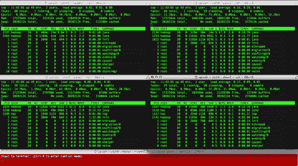
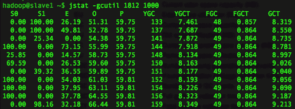
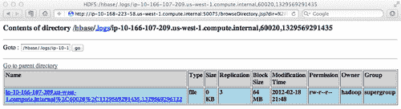
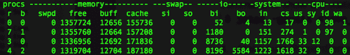

# 第 7 章：故障排除

在本章中，我们将介绍：

*   故障排除工具
*   处理 XceiverCount 错误
*   处理“打开的文件太多”错误
*   处理“无法创建新的本机线程”错误
*   处理“HBase 忽略 HDFS 客户端配置”问题
*   处理 ZooKeeper 客户端连接错误
*   处理 ZooKeeper 会话过期错误
*   处理 EC2 上的 HBase 启动错误

# 简介

每个人都希望自己的 HBase 集群能够平稳稳定地运行，但有时集群并不能像预期的那样工作，特别是在集群配置不好的情况下。 本章介绍对以意外状态运行的群集进行故障排除时可以执行的操作。

在开始对群集进行故障排除之前，最好熟悉帮助我们恢复群集的工具。 有用的工具与深入了解 HBase 和您正在操作的集群一样重要。 在第一个食谱中，我们将介绍几个推荐的工具及其示例用法。

问题通常发生在缺少基本设置的群集上。 如果您的集群遇到问题，您应该做的第一件事是分析主日志文件，因为主日志文件充当集群的协调器服务。 希望一旦在日志文件中找到警告或错误级别日志，您就能够确定错误的根本原因。 区域服务器日志文件是您需要检查的另一个来源。 区域服务器日志文件通常包含与加载相关的错误日志，因为区域服务器处理集群的实际数据存储和访问。

HBase 运行在 HDFS 之上，它依赖 ZooKeeper 作为其协调服务。 有时，还需要调查 HDFS、MapReduce 和 ZooKeeper 日志。 默认情况下，所有这些日志文件都存储在安装文件夹的 `logs`目录下。 当然，它可以在 `log4j`属性文件中配置。

如果发现错误消息，请搜索[http://search-hadoop.com/](http://search-hadoop.com/)上的在线资源；很可能以前已经报告和讨论过此问题。 有一个很棒的 HBase 社区，你可以随时寻求帮助。 不过，在提问之前，不要忘记先订阅-[http://hbase.apache.org/mail-lists.html](http://hbase.apache.org/mail-lists.html)。

在本章中，我们将回顾几个最棘手的问题。 我们将介绍这些问题的错误消息、发生原因以及如何使用故障排除工具修复这些问题。

# 故障排除工具

为了对 HBase 集群进行故障排除，除了扎实地了解您正在操作的集群之外，您使用的工具也很重要。 我们推荐以下故障排除工具：

*   `ps:`这可用于查找使用最多内存和 CPU 的顶级进程
*   **ClusterSSH 工具：**此工具用于同时控制多个 SSH 会话
*   `jps:`此工具显示当前用户的 Java 进程
*   `jmap:`此工具打印 Java 堆摘要
*   `jstat:`这是 Java 虚拟机统计监控工具
*   `hbase hbck:`此工具用于检查和修复区域一致性和表完整性
*   `hadoop fsck:`此工具用于检查 HDFS 一致性

在本食谱中，我们将描述这些工具的示例用法。

## 做好准备

启动您的 HBase 集群。

## 怎么做……

以下是我们将介绍的故障排除工具：

*   `ps:`此工具用于查找占用大量内存的顶级进程。 以下命令按内存使用情况降序对进程进行排序：

    ```scala
    $ ps auxk -rss | less
    USER PID %CPU %MEM VSZ RSS TTY STAT START TIME COMMAND
    hadoop 1346 1.2 6.6 1222680 115096 ? Sl 11:01 0:10 /usr/local/jdk1.6/bin/java -XX:OnOutOfMemoryError=kill -9 %p -Xmx1000m -ea -XX:+UseConcMarkSweepGC -XX:+CMSIncrementalMode -Dhbase.log.dir=/usr/local/hbase/logs
    ...
    org.apache.hadoop.hbase.regionserver.HRegionServer start

    ```

*   **ClusterSSH tool:** This tool is used to control multiple SSH sessions, simultaneously. In order to install ClusterSSH (cssh) on a Ubuntu desktop, run the following command:

    ```scala
    $ sudo apt-get install clusterssh

    ```

    还有一个针对 MacOSX 的 ClusterSSH 工具，名为`csshx`。 您可以从[http://code.google.com/p/csshx/](http://code.google.com/p/csshx/)下载 csshx。 启动 ClusterSSH 工具以监视小型 HBase 集群。 例如，在 Mac OS X 上，运行以下命令以在 HBase 群集的每个节点上启动多个 SSH 会话：

    ```scala
    $ csshX --login hac master1 slave1 slave2 slave3

    ```

    还将创建一个主窗口(以下屏幕截图中的第二个)。 在红色主窗口中，键入以下命令以在每个节点上运行`top`命令：

    ```scala
    $ top

    ```

    您将看到与以下屏幕截图类似的屏幕：

    

*   `jps:`此工具显示当前用户的 Java 进程。 要显示 `hadoop`用户的从节点上的 Java 进程，请运行以下命令：

    ```scala
    hadoop@slave1$ $JAVA_HOME/bin/jps
    1254 DataNode
    2445 Child
    1970 TaskTracker
    2481 Jps
    1812 HRegionServer

    ```

*   `jmap:`此工具打印 Java 堆摘要。 要打印前面提到的 HRegionServer 进程的 Java 堆摘要，请使用以下命令：

    ```scala
    hadoop@slave1$ $JAVA_HOME/bin/jmap -heap 1812
    Attaching to process ID 1812, please wait...
    Debugger attached successfully.
    Client compiler detected.
    JVM version is 20.4-b02
    using thread-local object allocation.
    Concurrent Mark-Sweep GC
    Heap Configuration:
    MinHeapFreeRatio = 40
    MaxHeapFreeRatio = 70
    MaxHeapSize = 1048576000 (1000.0MB)
    NewSize = 16777216 (16.0MB)
    MaxNewSize = 16777216 (16.0MB)
    OldSize = 50331648 (48.0MB)
    NewRatio = 7
    SurvivorRatio = 8
    PermSize = 12582912 (12.0MB)
    MaxPermSize = 67108864 (64.0MB)
    Heap Usage:
    New Generation (Eden + 1 Survivor Space):
    capacity = 15138816 (14.4375MB)
    used = 6533712 (6.2310333251953125MB)
    free = 8605104 (8.206466674804688MB)
    43.1586723823052% used
    Eden Space:
    capacity = 13500416 (12.875MB)
    used = 6514736 (6.2129364013671875MB)
    free = 6985680 (6.6620635986328125MB)
    48.25581670964806% used
    From Space:
    capacity = 1638400 (1.5625MB)
    used = 18976 (0.018096923828125MB)
    free = 1619424 (1.544403076171875MB)
    1.158203125% used
    To Space:
    capacity = 1638400 (1.5625MB)
    used = 0 (0.0MB)
    free = 1638400 (1.5625MB)
    0.0% used
    concurrent mark-sweep generation:
    capacity = 274624512 (261.90234375MB)
    used = 68805464 (65.61800384521484MB)
    free = 205819048 (196.28433990478516MB)
    25.05437824865393% used
    Perm Generation:
    capacity = 26222592 (25.0078125MB)
    used = 15656912 (14.931594848632812MB)
    free = 10565680 (10.076217651367188MB)
    59.70772073180256% used

    ```

*   `jstat:` This is the Java Virtual Machine statistics monitoring tool. Run the following command to show the summary of the garbage collection statistics of a HRegionServer process:

    ```scala
    hadoop@slave1$ jstat -gcutil 1812 1000

    ```

    输出如以下屏幕截图所示：

    

## 它是如何工作的.

`ps`命令有一个 `k`选项，我们可以使用它来指定排序顺序。 我们将 `-rss`格式说明符传递给此选项。 这会导致 `ps`命令按照进程的驻留集大小按降序对进程进行排序。 我们使用此方法查找使用内存最多的顶级进程。

群集 SSH 工具便于管理小型群集。 您可以使用它在多个服务器上同时调用相同的命令。 与前面一样，我们打开一个到集群中的主节点和每个从节点的会话。 然后，我们通过主窗口在每台服务器上调用 `top`命令。 它充当群集的简单监控系统。

`jps`是用于管理 Java 进程的小型动手工具。 它显示了当前用户的 Java 进程。

步骤 4 显示了在运行 DataNode、RegionServer 和 TaskTracker 守护进程的从节点上执行 `jps`命令的输出。 Hadoop 和 HBase 都是用 Java 编写的；这使得 `jps`对我们来说是一个有用的工具。

`jmap`是打印 Java 堆摘要的工具。 如步骤 5 所示，我们使用 `jmap -heap <PID>`命令显示 HRegionServer 守护进程的堆摘要。 `jmap`将打印 HRegionServer 守护进程的堆配置和使用情况。

`jstat`是一个显示**Java 虚拟机(JVM)**统计监控数据的工具。 在本例中， `jstat`连接到 HRegionServer(PID 1812)的 JVM，每隔 1000 毫秒采集样本，并显示由 `-gcutil`选项指定的输出。 输出显示年轻一代收集不断发生。 例如，在第 4 和第 5 个样本之间，收集花费了 0.216 秒(**YGCT**列中的**8.134**到**7.918**)，并将对象从伊甸园空间(**E**)提升到旧空间(**O**)，导致旧空间利用率从**55.99%**增加到**58.73%**。 在收集之前，幸存者空间(**S0**)被**100%**利用，但在此收集之后仅被**25.85%**利用。

## 另请参阅

*   *HBase hbck-检查 HBase 群集*配方的一致性，在[第 3 章](03.html "Chapter 3. Using Administration Tools")，*中使用管理工具*
*   *在[第 5 章](05.html "Chapter 5. Monitoring and Diagnosis")，*监控和诊断*中，报告群集*配方状态的简单脚本

# 处理 XceiverCount 错误

在本食谱中，我们将介绍如何对 DataNode 日志中显示的以下 XceiverCount 错误进行故障排除：

```scala
2012-02-18 17:08:10,695 ERROR org.apache.hadoop.hdfs.server.datanode.DataNode: DatanodeRegistration(10.166.111.191:50010, storageID=DS-2072496811-10.168.130.82-50010-1321345166369, infoPort=50075, ipcPort=50020):DataXceiver
java.io.IOException: xceiverCount 257 exceeds the limit of concurrent xcievers 256
at org.apache.hadoop.hdfs.server.datanode.DataXceiver.run (DataXceiver.java:92)
at java.lang.Thread.run(Thread.java:662)

```

## 做好准备

登录到您的主节点。

## 怎么做……

以下是修复 XceiverCount 错误的步骤：

1.  将以下代码片段添加到 HDFS 设置文件(`hdfs-site.xml`)：

    ```scala
    hadoop@master1$ vi $HADOOP_HOME/conf/hdfs-site.xml
    <property>
    <name>dfs.datanode.max.xcievers</name>
    <value>4096</value>
    </property>

    ```

2.  在群集中同步 `hdfs-site.xml`文件：

    ```scala
    hadoop@master1$ for slave in `cat $HADOOP_HOME/conf/slaves`
    do
    rsync -avz $HADOOP_HOME/conf/ $slave:$HADOOP_HOME/conf/
    done

    ```

3.  从主节点重新启动 HDFS 和 HBase：

    ```scala
    hadoop@master1$ $HBASE_HOME/bin/stop-hbase.sh
    hadoop@master1$ $HADOOP_HOME/bin/stop-dfs.sh
    hadoop@master1$ $HADOOP_HOME/bin/start-dfs.sh
    hadoop@master1$ $HBASE_HOME/bin/start-hbase.sh

    ```

## 它是如何工作的.

`dfs.datanode.max.xcievers`(是的，这是拼写错误)设置定义了 HDFS DataNode 在任何给定时间将服务的文件数的上限。 其默认值为 `256`，太小，无法在 HDFS 上运行 HBase。 如果您的 DataNode 达到此上限，您将在 DataNode 日志中看到一个错误日志，通知您已超过 Xciever 计数。

我们建议在现代机器上将其设置为更高的值，例如 4096。 更改此设置后，您需要在整个群集中同步修改后的 `hdfs-site.xml`文件，然后重新启动 HDFS 以应用更改。

# 处理“打开的文件太多”错误

在本食谱中，我们将介绍如何对以下 DataNode 日志中显示的错误进行故障排除：

```scala
2012-02-18 17:43:18,009 ERROR org.apache.hadoop.hdfs.server.datanode.DataNode: DatanodeRegistration(10.166.111.191:50010, storageID=DS-2072496811-10.168.130.82-50010-1321345166369, infoPort=50075, ipcPort=50020):DataXceiver
java.io.FileNotFoundException: /usr/local/hadoop/var/dfs/data/current/subdir6/blk_-8839555124496884481 (Too many open files)
at java.io.RandomAccessFile.open(Native Method)
at java.io.RandomAccessFile.<init>(RandomAccessFile.java:216)
at org.apache.hadoop.hdfs.server.datanode.FSDataset.getBlockInputStream(FSDataset.java:1068)

```

## 做好准备

要解决此问题，您需要在群集的每个节点上拥有 root 权限。 我们假设您使用 `hadoop`用户启动 HDFS 集群。

## 怎么做……

要修复“打开的文件太多”错误，请在群集的每个节点上执行以下步骤：

1.  通过向 `/etc/security/limits.conf`文件添加以下属性来增加 `hadoop`用户的打开文件号：

    ```scala
    $ vi /etc/security/limits.conf
    hadoop soft nofile 65535
    hadoop hard nofile 65535

    ```

2.  将以下行添加到 `/etc/pam.d/login`文件：

    ```scala
    $ vi /etc/pam.d/login
    session required pam_limits.so

    ```

3.  注销，然后以 `hadoop`用户身份重新登录。
4.  通过运行以下命令确认已提高打开文件限制：

    ```scala
    $ ulimit -n
    65535

    ```

5.  从主节点重新启动 HDFS 和 HBase：

    ```scala
    hadoop@master1$ $HBASE_HOME/bin/stop-hbase.sh
    hadoop@master1$ $HADOOP_HOME/bin/stop-dfs.sh
    hadoop@master1$ $HADOOP_HOME/bin/start-dfs.sh
    hadoop@master1$ $HBASE_HOME/bin/start-hbase.sh

    ```

## 它是如何工作的.

HBase 是一个运行在 Hadoop 上的数据库，就像其他数据库一样，它可以同时打开许多文件。 另一方面，Linux 限制了进程可以打开的文件描述符的数量。 默认限制为 1024，对于 HBase 来说太小了。 如果 `hadoop`用户的打开文件数超过这个上限，您将在 DataNode 日志中看到一个错误，指示打开的文件太多。

要平稳运行 HBase，您需要为运行 HDFS 和 HBase 的用户增加打开文件描述符的最大数量；在我们的示例中，即 `hadoop`用户。

在步骤 1 中，我们在 `/etc/security/limits.conf`文件中设置了 `hadoop`用户的打开文件限制，然后在步骤 2 中修改了 `/etc/pam.d/login`文件，以便更改在用户下次登录系统时生效。 软限制(软 `nofile)`)是操作系统内核对打开的文件描述符的数量强制执行的值。 硬限制(HARD `nofile)`)用作软限制的上限。 `ulimit`是一个为当前用户设置和显示系统范围内资源使用限制的程序。 正如您在步骤 4 中看到的， `ulimit -n`命令显示了 `hadoop`用户的打开文件限制。

不要忘记重新启动 HDFS 群集以应用更改。

## 还有更多...

您可能还想知道 `hadoop`用户当前打开的文件号。 要获取此信息，请使用 `lsof`命令：

```scala
$ lsof -uhadoop | wc -l

```

## 另请参阅

*   *更改内核设置*配方，在[第 1 章](01.html "Chapter 1. Setting Up HBase Cluster")，*设置 HBase 群集*
*   *在本章中，处理“无法创建新的本机线程”错误*

# 处理“无法创建新的本机线程”错误

在本指南中，我们将介绍如何对以下 RegionServer 日志中显示的错误进行故障排除：

```scala
2012-02-18 18:46:04,907 WARN org.apache.hadoop.hdfs.DFSClient: DataStreamer Exception: java.lang.OutOfMemoryError: unable to create new native thread
at java.lang.Thread.start0(Native Method)
at java.lang.Thread.start(Thread.java:640)
at org.apache.hadoop.hdfs.DFSClient$DFSOutputStream$DataStreamer.run(DFSClient.java:2830)

```

## 做好准备

要修复此错误，您将需要群集的每个节点上的 root 权限。 我们假设您使用 `hadoop`用户启动 HDFS 和 HBase 集群。

## 怎么做……

要修复“无法创建新的本机线程”错误，请在群集的每个节点上执行以下步骤：

1.  通过向 `/etc/security/limits.conf`文件添加以下属性来增加 `hadoop`用户的最大进程数：

    ```scala
    $ vi /etc/security/limits.conf
    hadoop soft nproc 32000
    hadoop hard nproc 32000

    ```

2.  将以下行添加到 `/etc/pam.d/login`文件：

    ```scala
    $ vi /etc/pam.d/login
    session required pam_limits.so

    ```

3.  注销，然后以 `hadoop`用户身份重新登录。
4.  通过运行以下命令，确保已增加打开进程限制：

    ```scala
    $ ulimit -u
    32000

    ```

5.  从主节点重新启动 HDFS 和 HBase：

    ```scala
    hadoop@master1$ $HBASE_HOME/bin/stop-hbase.sh
    hadoop@master1$ $HADOOP_HOME/bin/stop-dfs.sh
    hadoop@master1$ $HADOOP_HOME/bin/start-dfs.sh
    hadoop@master1$ $HBASE_HOME/bin/start-hbase.sh

    ```

## 它是如何工作的.

Linux 限制了用户可以同时执行的进程数量。 在高负载 HBase 集群中，较低的 `nproc`设置可能表现为 `OutOfMemoryError`异常，如前面所示。 如果 `hadoop`用户的运行进程数超过了 `nproc`限制，您将在 RegionServer 日志中看到“无法创建新的本机线程”的错误。

为了顺利运行 HBase，您需要提高运行 HDFS 和 HBase 的用户的 `nproc`限制。

我们在步骤 1 中在 `/etc/security/limits.conf`文件中设置了 `hadoop`用户的 `nproc`限制，然后在步骤 2 中修改了 `/etc/pam.d/login`文件，以便更改在用户下次登录系统时生效。 软限制(软 `nproc)`是操作系统内核对进程数强制执行的值。 硬限制(HARD `nproc)`)用作软限制的上限。

注销后，我们再次登录并运行 `ulimit -u`程序，以显示当前用户的进程数限制。

最后，我们重新启动 HDFS 和 HBase 以应用更改。

## 还有更多...

要查看 `hadoop`用户的当前线程数，请键入以下命令：

```scala
$ ps -o pid,comm,user,thcount -u hadoop
PID COMMAND USER THCNT
1349 su hadoop 1
1350 bash hadoop 1
1429 java hadoop 32
1580 java hadoop 14
1690 java hadoop 48
1819 ps hadoop 1

```

输出的 `THCNT`列是 `hadoop`用户的每个进程的线程号。

## 另请参阅

*   *更改内核设置*，[第 1 章](01.html "Chapter 1. Setting Up HBase Cluster")，*设置 HBase 群集*
*   *在本章中，处理“打开的文件太多”错误*

# 处理“HBase 忽略 HDFS 客户端配置”问题

您可能已经注意到，HBase 会忽略您的 HDFS 客户端配置，例如 `dfs.replication`设置。 在以下示例中，我们为 HDFS 客户端设置了复制因子 `2`：

```scala
$ grep -A 1 "dfs.replication" $HADOOP_HOME/conf/hdfs-site.xml
<name>dfs.replication</name>
<value>2</value>

```

但是，HDFS 上的 HBase 文件显示的因子为 `3`，这是 HDFS 的默认复制因子：



这与我们预期的不同-复制因子预期为 2，但实际值为 3。

在本食谱中，我们将描述为什么会发生这种情况，以及如何修复它。

## 做好准备

以启动 HDFS 和 HBase 的用户身份登录到您的主节点。 我们假设您使用的是 HDFS 和 HBase 的 `hadoop`用户。

## 怎么做……

以下是将 HDFS 客户端配置应用到 HBase 的步骤：

1.  在 HBase 配置目录下添加 HDFS 设置文件(hdfs-site.xml)的符号链接：

    ```scala
    $ hadoop@master1$ ln -s $HADOOP_HOME/conf/hdfs-site.xml $HBASE_HOME/conf/hdfs-site.xml

    ```

2.  在群集中同步此更改：

    ```scala
    hadoop@master1$ for slave in `cat $HBASE_HOME/conf/regionservers`
    do
    rsync -avz $HBASE_HOME/conf/ $slave:$HBASE_HOME/conf/
    done

    ```

3.  重新启动 HBase。 现在，新创建的 HBase 文件将具有 HDFS 客户端配置。 实际复制系数值将为 2，正如我们预期的那样：

    ```scala
    hadoop@master1$ $HBASE_HOME/bin/stop-hbase.sh
    hadoop@master1$ $HBASE_HOME/bin/start-hbase.sh

    ```

## 它是如何工作的.

HDFS 客户端配置在 `hdfs-site.xml`文件中设置。 要将 HDFS 客户端配置应用到 HBase，我们需要添加此文件中的设置，并将 `hdfs-site.xml`文件添加到 HBase 的类路径中。 要做到这一点，最简单的方法是在 HBase 配置目录下创建 `hdfs-site.xml`文件的符号链接，然后在整个集群中同步它。

重新启动 HBase 后，您将注意到将应用 HDFS 客户端配置。

# 处理 ZooKeeper 客户端连接错误

在本食谱中，我们将介绍如何对以下 RegionServer 日志中显示的 ZooKeeper 客户端连接错误进行故障排除：

```scala
2012-02-19 15:17:06,199 WARN org.apache.zookeeper.ClientCnxn: Session 0x0 for server ip-10-168-47-220.us-west-1.compute.internal /10.168.47.220:2181, unexpected error, closing socket connection and attempting reconnect
java.io.IOException: Connection reset by peer at sun.nio.ch.FileDispatcher.read0(Native Method) at sun.nio.ch.SocketDispatcher.read(SocketDispatcher.java:21) at sun.nio.ch.IOUtil.readIntoNativeBuffer(IOUtil.java:198) at sun.nio.ch.IOUtil.read(IOUtil.java:166) at sun.nio.ch.SocketChannelImpl.read(SocketChannelImpl.java:243) at org.apache.zookeeper.ClientCnxnSocketNIO.doIO(ClientCnxnSocketNIO.java:66)

```

## 做好准备

登录到您的动物园管理员仲裁节点。

## 怎么做……

以下是修复 ZooKeeper 客户端连接错误的步骤：

1.  将以下内容添加到每个 ZooKeeper 仲裁节点上的 ZooKeeper 配置文件(`zoo.cfg`)中：

    ```scala
    $ vi $ZOOKEEPER_HOME/conf/zoo.cfg
    maxClientCnxns=60

    ```

2.  重新启动 ZooKeeper 以应用更改：

    ```scala
    $ $ZOOKEEPER_HOME/bin/zkServer.sh stop
    $ $ZOOKEEPER_HOME/bin/zkServer.sh start

    ```

## 它是如何工作的.

在 HBase 群集上运行 MapReduce 作业时，通常会出现此错误。 ZooKeeper 有一个 `maxClientCnxns`设置，用于限制单个客户端可以与 ZooKeeper 集合中的单个成员建立的并发连接的数量。 每个区域服务器都是 ZooKeeper 客户端；如果区域服务器的并发连接数超过此最大客户端连接限制，它将无法创建到 ZooKeeper 集合的新连接。 这就是发生上述错误的原因。

要修复此错误，我们需要为 `maxClientCnxns`设置设置一个更高的值，并重新启动 ZooKeeper 以应用更改。

## 还有更多...

从 ZooKeeper 3.4.0 开始， `maxClientCnxns`的默认值已更改为 60。 它应该可以很好地适用于许多应用程序。

要查看从客户端到特定 ZooKeeper 仲裁节点的当前连接数，请运行以下命令：

```scala
$ echo "cons" | nc localhost 2181 | grep "your.client.ip.address" | wc l

```

将 `localhost`替换为 ZooKeeper 仲裁节点的主机名，并将`"your.client.ip.address"`替换为客户端的 IP 地址。

# 处理 ZooKeeper 会话过期错误

在本食谱中，我们将介绍如何对 RegionServer 日志中显示的以下 ZooKeeper 会话过期错误进行故障排除：

```scala
2012-02-19 16:49:15,405 WARN org.apache.hadoop.hbase.regionserver.HRegionServer: Failed deleting my ephemeral node
org.apache.zookeeper.KeeperException$SessionExpiredException: KeeperErrorCode = Session expired for /hbase/rs/ip-10-168-37-91.us-west-1.compute.internal,60020,1329635463251 at org.apache.zookeeper.KeeperException.create(KeeperException.java:127) at org.apache.zookeeper.KeeperException.create(KeeperException.java:51) at org.apache.zookeeper.ZooKeeper.delete(ZooKeeper.java:868) at org.apache.hadoop.hbase.zookeeper.RecoverableZooKeeper.delete(RecoverableZooKeeper.java:107)

```

这个问题非常重要，因为如果主服务器或区域服务器与 ZooKeeper 仲裁断开连接，它们将自动关闭。

## 做好准备

登录到发生此错误的服务器。

## 怎么做……

以下是修复 ZooKeeper 会话过期问题的步骤：

1.  检查 `hbase-env.sh`；确保为 HBase 守护进程提供足够的 RAM。 对于繁重的群集，默认的 1 GB 是不够的：

    ```scala
    $ vi $HBASE_HOME/conf/hbase-env.sh
    export HBASE_HEAPSIZE=8000

    ```

2.  Run the `vmstat` command to show the virtual memory statistics:

    ```scala
    $ vmstat 1

    ```

    

    *   检查名为**si**(换入)和**so**(换出)的**交换**列，并确保不交换。
3.  Use the `jstat` command to show the Java Garbage Collection (GC) statistics:

    ```scala
    $ jstat -gcutil <java_process_pid> 1000

    ```

    

    *   检查**FGCT**列，确保 RegionServer 不会遇到长时间的 GC 暂停。
4.  使用 `top`命令显示 CPU 统计信息。 确保 RegionServer 线程有足够的 CPU 资源。 MapReduce 可能会使用大量 CPU 资源，导致 RegionServer 饥饿并陷入长时间的 GC 暂停。
5.  如果 MapReduce 占用太多 CPU 资源，请考虑减少区域服务器上的 MAP/Reduce 插槽数量。 调整下列值：

    ```scala
    $ vi $HADOOP_HOME/conf/mapred-site.xml
    <property>
    <name>mapred.tasktracker.map.tasks.maximum</name>
    <value>2</value>
    </property>
    <property>
    <name>mapred.tasktracker.reduce.tasks.maximum</name>
    <value>1</value>
    </property>

    ```

6.  考虑通过编辑 `hbase-site.xml`文件

    ```scala
    $ vi $HBASE_HOME/conf/hbase-site.xml
    <property>
    <name>zookeeper.session.timeout</name>
    <value>120000</value>
    </property>

    ```

    来增加 ZooKeeper 会话超时
7.  增加每个 ZooKeeper 仲裁节点上的 ZooKeeper 最大会话超时。 修改 `zoo.cfg`文件以增加 `maxSessionTimeout`值：

    ```scala
    $ vi $ZOOKEEPER_HOME/conf/zoo.cfg
    maxSessionTimeout= 120000

    ```

8.  如果您更改了 `zoo.cfg`文件

    ```scala
    $ $ZOOKEEPER_HOME/bin/zkServer.sh stop
    $ $ZOOKEEPER_HOME/bin/zkServer.sh start

    ```

    ，请在每个 ZooKeeper 仲裁节点上重新启动 ZooKeeper
9.  跨群集中同步您修改的文件，然后重新启动 Hadoop/HBase 群集。

## 它是如何工作的.

此错误通常发生在过载的 HBase 群集上。 HBase Master 和 RegionServer 守护进程充当 ZooKeeper 客户端；如果客户端无法在配置的时间内与 ZooKeeper 仲裁进行通信，则连接将超时，并会出现此错误。

ZooKeeper 连接超时的两个最可能原因如下：

*   长时间的 JVM GC 暂停
*   配置的超时时间太短

从第 1 步到第 5 步，我们尝试找出是不是长 GC 导致了错误。 HBase 需要足够的 RAM 才能平稳运行。 对于繁重的群集，1 GB 的默认大小是不够的。 因此，将 `hbase-env.sh`文件中的 `HBASE_HEAPSIZE`值更改为更高的值(例如，8 GB)，但小于 16 GB。 我们建议将 HBase 堆大小设置为小于 16 GB 的原因是，如果我们在这里使用非常大的堆大小，GC 将需要非常长的时间才能完成，这是我们必须避免的。

确保您的 RegionServer 不交换。 `vmstat`命令可用于查看是否发生了交换。 在步骤 2 中，我们使用 `vmstat`命令以 1 秒为间隔显示虚拟内存统计信息。 您应该更改 `vm.swappiness`内核设置，以避免交换。 我们将在[第 8 章](08.html "Chapter 8. Basic Performance Tuning")，*基本性能调优中的*将 vm.swappness 设置为 0 以避免交换*配方中进行描述。*

`jstat`是一款 Java 虚拟机统计监控工具。 我们在步骤 3 中使用 `-gcutil`选项，以 1 秒为间隔显示特定 Java 进程的 Java GC 统计数据。 输出的**FGCT**列是总的完整 GC 时间；检查该列以查看是否发生了长时间的 GC 暂停。

GC 暂停时间长的另一个原因是 RegionServer 进程可能没有足够的 CPU 资源。 在 HBase 群集上运行繁重的 MapReduce 作业时尤其如此。 在这种情况下，如果您正在运行繁重的 MapReduce 作业，请使用 MapReduce 配置 `mapred.tasktracker.map.tasks.maximum`和 `mapred.tasktracker.reduce.tasks.maximum`来控制在 TaskTracker 上同时生成的贴图/缩减的数量。

如果希望增加 ZooKeeper 会话超时，请在 `hbase-site.xml`文件中设置 `zookeeper.session.timeout`，在 ZooKeeper 配置文件(`zoo.cfg`)中设置 `maxSessionTimeout`。 `maxSessionTimeout`选项是 ZooKeeper 服务器端配置。 它是客户端会话超时的上限，因此它的值必须大于 HBase `zookeeper.session.timeout`值。

### 备注

请注意，设置更高的超时意味着群集将至少花费同样多的时间来故障转移出现故障的 RegionServer。 您需要考虑您的系统是否可以接受。

## 另请参阅

*   *故障排除工具*，在本章中
*   *将 vm.swappity 设置为 0 以避免交换*配方，请参见[第 8 章](08.html "Chapter 8. Basic Performance Tuning")，*基本性能调整*

# 处理 EC2 上的 HBase 启动错误

在本食谱中，我们将介绍如何对以下主日志中显示的 HBase 启动错误进行故障排除：

```scala
2011-12-10 14:04:57,422 ERROR org.apache.hadoop.hbase.HServerAddress: Could not resolve the DNS name of ip-10-166-219-206.us-west-1.compute.internal
2011-12-10 14:04:57,423 FATAL org.apache.hadoop.hbase.master.HMaster: Unhandled exception. Starting shutdown.
java.lang.IllegalArgumentException: hostname can't be null
at java.net.InetSocketAddress.<init>(InetSocketAddress.java:121)
at org.apache.hadoop.hbase.HServerAddress.getResolvedAddress(HServerAddress.java:108)
at org.apache.hadoop.hbase.HServerAddress.<init>(HServerAddress.java:64)

```

此错误通常发生在停止并重新启动 EC2 实例之后。 原因是 HBase 将区域位置存储在它的“系统”-根-和 META 表中。 位置信息中包含内部 EC2 DNS 名称。 停止 EC2 实例将更改此 DNS 名称。 由于 DNS 名称更改，HBase 将无法将其系统表中的旧 DNS 名称解析为新名称，从而导致上述错误消息。

在本指南中，我们将介绍如何解决此问题，以便您可以随意停止/启动用于 HBase 的 EC2 实例(如果您的 HDFS 将数据保存在 EC2 实例存储上，则在重新启动 EC2 实例之前，您需要将数据保存在其他存储上，如 Amazon S3)。

## 做好准备

确保您已经为 HBase 设置了 Amazon EC2 环境。 如果您还没有准备好，请参考[第 1 章](01.html "Chapter 1. Setting Up HBase Cluster")，*设置 HBase 集群*中的*在 Amazon EC2 上做好准备*食谱，了解如何在 EC2 上做好准备以便在 EC2 上运行 HBase。

您需要在群集的每个节点上拥有 root 权限的帐户，才能运行我们稍后创建的脚本。

## 怎么做……

以下是修复 EC2 上的 HBase 启动错误的步骤：

1.  创建一个 `ec2-running-hosts.sh`脚本，如以下代码片段所示：

    ```scala
    $ vi ec2-running-hosts.sh
    #!/bin/bash
    ec2-describe-instances > /tmp/all-instances
    ip_type=$1
    if [ "$ip_type" == "private" ]; then
    addresses=`grep ^INSTANCE /tmp/all-instances | cut -f18`
    elif [ "$ip_type" == "public" ]; then
    addresses=`grep ^INSTANCE /tmp/all-instances | cut -f17`
    else
    echo "Usage: `basename $0` private|public"
    exit -1
    fi
    for address in $addresses
    do
    instance_id=`grep $address /tmp/all-instances | cut -f2`
    dns=`grep $address /tmp/all-instances | cut -f5`
    host=`grep ^TAG /tmp/all-instances | grep $instance_id | cut -f5`
    echo -e "${address}\t${dns}\t${host}"
    done

    ```

2.  创建一个 `update-ec2-hosts.sh`脚本，如以下代码片断所示。 将脚本中的 `YOUR_PASSWORD`替换为您用来运行脚本的帐户的密码：

    ```scala
    $ vi update-ec2-hosts.sh
    #!/bin/bash
    if [ $# -lt 2 ]; then
    echo "Usage: `basename $0` host-file target-host"
    exit 1
    fi
    host_file=$1
    target_host=$2
    bin=`dirname $0`
    bin=`cd $bin;pwd`
    echo "updating hosts file on $target_host using $host_file"
    # backup
    ssh -f $target_host "cp /etc/hosts /tmp/hosts.org"
    cp $bin/hosts.template /tmp/hosts.update
    cat $host_file >> /tmp/hosts.update
    scp /tmp/hosts.update $target_host:/tmp
    # chmod 700 this file as we write password here
    ssh -f -t -t -t $target_host "sudo -S cp /tmp/hosts.update /etc/hosts <<EOF
    YOUR_PASSWORD
    EOF
    "
    echo "[done] update hosts file on $target_host"

    ```

3.  确保 `update-ec2-hosts.sh`脚本只对您可读：

    ```scala
    $ chmod 700 update-ec2-hosts.sh

    ```

4.  将 `/etc/hosts`文件从 EC2 实例复制到与 `update-ec2-hosts.sh`脚本相同的目录中，并将其重命名为 `hosts.template:`

    ```scala
    $ cp /etc/hosts hosts.template

    ```

5.  创建包含以下内容的 `update-ec2-private-hosts.sh`脚本。 将 `NS_HOSTNAME`的值替换为您的名称服务器的主机名：

    ```scala
    $ vi update-ec2-private-hosts.sh
    #!/bin/bash
    bin=`dirname $0`
    bin=`cd $bin;pwd`
    NS_HOSTNAME="ns1"
    $bin/ec2-running-hosts.sh private | tee /tmp/ec2-running-host
    cp $bin/hosts.template /tmp/hosts.update
    cat /tmp/ec2-running-host >> /tmp/hosts.update
    while read line
    do
    host=`echo "$line" | cut -f3`
    if [ "$host" == "$NS_HOSTNAME" ]; then
    # do not update name server
    continue
    fi
    echo
    echo "Updating $host"
    bash $bin/update-ec2-hosts.sh "/tmp/ec2-running-host" "$host"
    sleep 1
    done < /tmp/ec2-running-host

    ```

6.  创建一个 `update-ec2-hmaster-hosts.sh`脚本，如以下代码片断所示。 将 `HMASTER_HOSTNAME`和 `RS_HOSTNAMES`的值分别替换为 Master 和 RegionServer 节点的主机名：

    ```scala
    $ vi update-ec2-hmaster-hosts.sh
    #!/bin/bash
    bin=`dirname $0`
    bin=`cd $bin;pwd`
    IFS_BAK=$IFS
    IFS="
    "
    HMASTER_HOSTNAME="master1"
    RS_HOSTNAMES="slave[123]"
    scp $HMASTER_HOSTNAME:/tmp/hosts.org /tmp
    scp $HMASTER_HOSTNAME:/etc/hosts /tmp
    rm -f /tmp/hosts.done
    while read line
    do
    echo "$line" | egrep -q "$RS_HOSTNAMES"
    if [ $? -ne 0 ]; then
    echo -e "${line}" >> /tmp/hosts.done
    else
    slave=`echo "$line" | cut -f3`
    original_private_dns=`grep "$slave" /tmp/hosts.org | cut -f2`
    echo -e "${line}\t${original_private_dns}" >> /tmp/hosts.done
    fi
    done < /tmp/hosts
    bash $bin/update-ec2-hosts.sh "/tmp/hosts.done" "$HMASTER_HOSTNAME"

    ```

7.  将前面步骤中创建的脚本带到 EC2 上的名称服务器，并从那里运行 `update-ec2-private-hosts.sh`文件：

    ```scala
    hac@ns1$ ./update-ec2-private-hosts.sh
    10.176.202.34 ip-10-176-202-34.us-west-1.compute.internal master1
    10.160.49.250 ip-10-160-49-250.us-west-1.compute.internal ns1
    10.160.47.194 ip-10-160-47-194.us-west-1.compute.internal slave1
    10.176.23.117 ip-10-176-23-117.us-west-1.compute.internal client1
    10.160.39.197 ip-10-160-39-197.us-west-1.compute.internal slave2
    10.168.41.175 ip-10-168-41-175.us-west-1.compute.internal slave3
    Updating master1
    updating hosts file on master1 using /tmp/ec2-running-host
    hosts.update 100% 657 0.6KB/s 00:00
    [done] update hosts file on master1
    [sudo] password for hac:
    Updating slave1
    ...

    ```

    *   脚本使用 EC2API 更新了每个节点上的`/etc/hosts`文件。
8.  如果 `update-ec2-private-hosts.sh`已成功完成，则运行 `update-ec2-hmaster-hosts.sh`：

    ```scala
    hac@ns1$ ./update-ec2-hmaster-hosts.sh
    hosts.org 100% 1457 1.4KB/s 00:00
    hosts 100% 657 0.6KB/s 00:00
    updating hosts file on master1 using /tmp/hosts.done
    hosts.update 100% 1058 1.0KB/s 00:00
    [done] update hosts file on master1

    ```

    *   每个从节点的旧 DNS 条目将被附加到主节点上的/etc/hosts 文件中。
9.  运行以下命令检查主机文件：

    ```scala
    hac@master1$ grep "slave" /etc/hosts

    ```

以下屏幕截图显示了该命令的输出：


以 `hadoop`用户身份登录到您的主节点，并在此节点上启动 HBase：

```scala
hadoop@master1$ $HADOOP_HOME/bin/start-dfs.sh
starting namenode, logging to /usr/local/hadoop/logs/hadoop-hadoop-namenode-master1.out
slave1: Warning: Permanently added the RSA host key for IP address '10.160.47.194' to the list of known hosts.
slave2: Warning: Permanently added the RSA host key for IP address '10.160.39.197' to the list of known hosts.
slave3: Warning: Permanently added the RSA host key for IP address '10.168.41.175' to the list of known hosts.
slave1: starting datanode, logging to /usr/local/hadoop/logs/hadoop-hadoop-datanode-slave1.out
slave3: starting datanode, logging to /usr/local/hadoop/logs/hadoop-hadoop-datanode-slave3.out
slave2: starting datanode, logging to /usr/local/hadoop/logs/hadoop-hadoop-datanode-slave2.out
hadoop@master1$ $ZOOKEEPER_HOME/bin/zkServer.sh start
JMX enabled by default
Using config: /usr/local/zookeeper/current/bin/../conf/zoo.cfg
Starting zookeeper ... STARTED
hadoop@master1$ $HBASE_HOME/bin/start-hbase.sh
starting master, logging to /usr/local/hbase/logs/hbase-hadoop-master-master1.out
slave3: starting regionserver, logging to /usr/local/hbase/logs/hbase-hadoop-regionserver-slave3.out
slave1: starting regionserver, logging to /usr/local/hbase/logs/hbase-hadoop-regionserver-slave1.out
slave2: starting regionserver, logging to /usr/local/hbase/logs/hbase-hadoop-regionserver-slave2.out

```

## 它是如何工作的.

作为一个简单的解决方案，每次在启动 HBase 之前停止和重新启动实例时，我们都会更新集群中每个节点上的 `/etc/hosts`文件，然后将每个从节点的旧 DNS 条目附加到主节点的 `/etc/hosts`文件中。 这样，HBase Master 就能够将其系统表中的旧 DNS 条目解析为更新后的新 IP 地址，并使用系统表中的新 DNS 条目对其进行更新。

为了实现这个想法，我们在步骤 1 中创建了 `ec2-running-hosts.sh`脚本，并调用 `ec2-describe-instances`EC2API，以获取有关所有正在运行的 EC2 实例的信息，并对每个正在运行的实例的 IP 地址、DNS 名称和用户数据(主机名)进行 grep。 这些是我们需要更新到每个节点的 `/etc/hosts`文件的新 DNS 条目。

我们在步骤 2 中创建的 `update-ec2-hosts.sh`脚本是一个实用程序脚本，用于通过 SSH 连接到特定服务器并覆盖该服务器中的 `/etc/hosts`文件，而无需人工交互。 该脚本还会在覆盖原始 `/etc/hosts`文件之前对其进行备份。 我们在脚本中写入帐户密码，这样就不需要在每个节点上输入密码。 这就是为什么在步骤 3 中注意到脚本应该只对您自己可读的原因。

在步骤 5 中创建的 `update-ec2-private-hosts.sh`脚本使我们在前面步骤中创建的两个脚本协同工作以获得新的 DNS 条目，将它们附加到 `hosts.template`文件，然后使用 `hosts.template`文件覆盖除 DNS 名称服务器之外的每个运行的 EC2 实例上的 `/etc/hosts`文件。

在步骤 6 中创建的 `update-ec2-hmaster-hosts.sh`脚本执行简单的工作，即将每个从节点的旧 DNS 名称映射到新的 `/etc/hosts`文件，将新的 IP 地址附加到*，以便 HBase Master 可以将存储在其系统表中的旧 DNS 条目解析为新的 IP 地址。 之后，脚本调用 `update-ec2-hosts.sh`，使用新附加的文件覆盖主节点上的 `/etc/hosts`文件。*

在按顺序执行 `update-ec2-private-hosts.sh`和 `update-ec2-hmaster-hosts.sh`脚本之后，我们现在就可以正常启动 HDFS 和 HBase 了。

如您所见，如果您只想在需要在 HBase 上运行 HBase 时启动 HBase EC2 实例，那么这些脚本是简单但有用的。

## 还有更多...

您可能还希望将 EC2 实例的公共 DNS 名称更新为本地 PC 上的 `/etc/hosts`文件，以便您可以从 Web 浏览器访问 HBase Web UI。 以下是执行此操作的步骤：

1.  创建一个 `update-ec2-public-hosts.sh`脚本，如以下代码片断所示，并将其放在与我们在上一节中创建的脚本相同的目录下：

    ```scala
    $ vi update-ec2-public-hosts.sh
    #!/bin/bash
    bin=`dirname $0`
    bin=`cd $bin;pwd`
    $bin/ec2-running-hosts.sh public | tee /tmp/ec2-running-host
    # backup
    cp /etc/hosts /tmp/hosts.org
    # update
    cp $bin/hosts.local /tmp/hosts.update
    cat /tmp/ec2-running-host >> /tmp/hosts.update
    sudo cp /tmp/hosts.update /etc/hosts
    echo "[done] update EC2 public hostname in hosts file"

    ```

2.  将您的 `/etc/hosts`文件复制到与 `update-ec2-public-hosts.sh`脚本相同的目录，并将其重命名为 `hosts.local:`

    ```scala
    $ cp /etc/hosts hosts.local

    ```

3.  在本地 PC 上运行 `update-ec2-public-hosts.sh`脚本。 脚本将要求您输入帐户密码，因为它需要 root 权限才能更新 `/etc/hosts`文件：

    ```scala
    184.72.22.179 ip-10-176-202-34.us-west-1.compute.internal master1
    ...
    184.169.243.211 ip-10-168-41-175.us-west-1.compute.internal slave3
    Password:
    [done] update EC2 public hostname in hosts file

    ```

4.  现在，打开您的 Web 浏览器并输入 URL `http://master1:60010/master.jsp`。 您将获得 HBase Web 用户界面。 将 `master1`替换为您的主节点的主机名。

### 备注

请注意，您需要一台 MacOSX 或 Linux PC 才能使用此脚本。

## 另请参阅

*   *为 Amazon EC2 做好准备*，在[第 1 章](01.html "Chapter 1. Setting Up HBase Cluster")，*设置 HBase 群集*