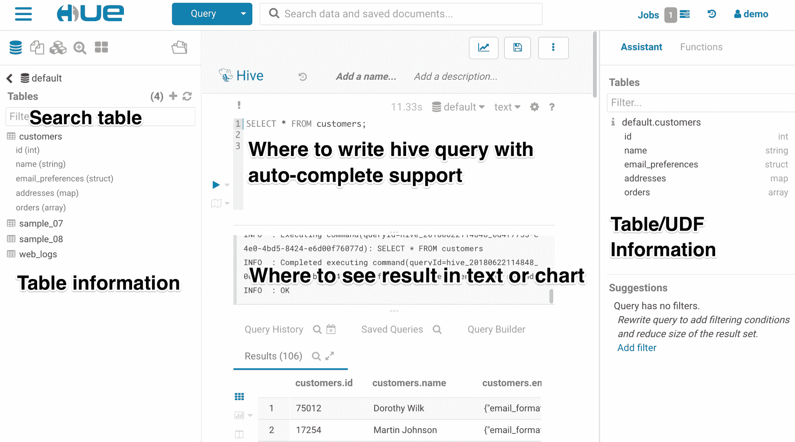

# 使用其他工具

作为最早也是最流行的 SQL-over-Hadoop 工具之一，Have 在与其他工具配合提供端到端大数据解决方案时有很多用例。 在本章中，我们将讨论配置单元如何与大数据生态系统中的其他工具在以下方面协同工作：

*   JDBC/ODBC 连接器
*   NoSQL 数据库
*   Hue/Ambari 蜂窝视图
*   HCatalog
*   奥兹
*   斯巴克 （人名）
*   Hivemall

# JDBC/ODBC 连接器

JDBC/ODBC 是配置单元与其他工具配合使用的最常见方式之一。 Hadoop 供应商，如 Cloudera 和 Hortonworks，提供免费的配置单元 jdbc/odbc 驱动程序，以便配置单元可以通过这些驱动程序连接，这些驱动程序可以在[https://www.cloudera.com/downloads/connectors/hive/jdbc.html](https://www.cloudera.com/downloads/connectors/hive/jdbc.html)和[https://hortonworks.com/downloads/#addons](https://hortonworks.com/downloads/#addons)中找到。

我们可以使用这些 JDBC/ODBC 连接器通过以下工具连接配置单元：

*   在[第 2 章](02.html)*，设置配置单元环境*中提到的命令行实用程序，如 BELINE
*   集成开发环境，如 Oracle SQL Developer，也在[第 2 章](02.html)和*设置配置单元环境*中提到
*   数据提取、转换、加载和集成工具，如 Talend Open Studio([https://www.talend.com/products/talend-open-studio/](https://www.talend.com/products/talend-open-studio/))和 Pentaho([https://www.hitachivantara.com/go/pentaho.html](https://www.hitachivantara.com/go/pentaho.html))
*   商业智能、报告和可视化工具，如 QlikView([https://www.qlik.com](https://www.qlik.com))和 Tableau([https://www.tableau.com](https://www.tableau.com))
*   数据分析工具，例如带有 Power Query 加载项的 Microsoft Excel

由于连接器的设置非常简单，请参考特定工具的网站以获取更详细的连接到蜂窝的说明。

# NoSQL

HIVE 不仅提供数据查询连接，还可以将其外部表映射到 NoSQL 数据库，如`HBase`或 MongoDB，并具有各种存储处理程序。

要映射`HBase`中的现有表，配置单元在表创建语句中使用`HBaseStorageHandler`类。 创建到现有配置单元`HBase`的配置单元外部表格映射的示例如下：

```sql
> CREATE TABLE hbase_table_sample(
> id int,
> value1 string,
> value2 string,
> map_value map<string, string>
> )
> STORED BY 'org.apache.hadoop.hive.hbase.HBaseStorageHandler'
> WITH SERDEPROPERTIES ("hbase.columns.mapping" = ":key,cf1:val,cf2:val,cf3")
> TBLPROPERTIES ("hbase.table.name" = "table_name_in_hbase");
```

在这个特殊的`CREATE TABLE`语句中，`HBaseStorageHandler`类使用`HiveHBaseTableInputFormat`和`HiveHBaseTableOutputFormat`委托与`HBase`表的交互。 需要`hbase.columns.mapping`属性才能按顺序将语句中定义的每个表列映射到`HBase`个表列。 例如，ID 按顺序映射到`HBase`表的行键为`:key`。 有时，如果没有可用作`HBase`表的行键的现有列，我们可能需要使用配置单元 UDF 生成适当的行键列。`value1`映射到`HBase`表的`cf1`列族中的`val`列。 配置单元`MAP`数据类型可用于访问整个列族。 每行可以有一组不同的列，其中列名对应于映射键，列值对应于映射值，例如`map_value`列。 `hbase.table.name`属性是可选的，它指定`HBase`已知的表名。 如果未提供，则配置单元和`HBase`表格将具有相同的名称，如`hbase_table_sample`。

通过将`HBase`表映射到配置单元，配置单元用户可以将数据插入到`HBase`表中，将配置单元表与`HBase`表连接，并直接从`HBase`查询数据。有关配置单元-`HBase`集成正在进行的配置和功能的更多信息，请参阅配置单元维基：https://cwiki.apache.org/confluence/display/Hive/HBaseIntegration。

使用相同的机制，配置单元可以将其外部表映射到 MongoDB([NoSQL](https://www.mongodb.com))中的集合，MongoDB 是一种流行的文档 https://www.mongodb.com 数据库。 要进行设置，我们需要从[https://github.com/mongodb/mongo-hadoop](https://github.com/mongodb/mongo-hadoop)或[https://mvnrepository.com/artifact/org.mongodb.mongo-hadoop/mongo-hadoop-core/2.0.2](https://mvnrepository.com/artifact/org.mongodb.mongo-hadoop/mongo-hadoop-core/2.0.2)下载 MongoDB 存储处理程序`JAR`。 然后在 HQL 中创建表，如下所示，以将其映射到 MongoDB 中的`default`数据库中的 n`mongo_sample`集合。 请确保在此操作之前启动了 MongoDB：

```sql
> ADD JAR mongo-hadoop-core-2.0.2.jar;
> CREATE TABLE mongodb_table_sample(
> id int,
> value1 string,
> value2 string
> )
> STORED BY 'com.mongodb.hadoop.hive.MongoStorageHandler'
> WITH SERDEPROPERTIES (
> 'mongo.columns.mapping'='{"id":"_id","value1":"value1","value2":"value2"}')
> TBLPROPERTIES(
> 'mongo.uri'='mongodb://localhost:27017/default.mongo_sample'
> );
```

之后，我们可以像在`HBase`映射表中那样插入或查询数据。 从 Hiev2.3.0 开始，提供了一个更通用的 JDBC 驱动程序存储处理程序，使配置单元表映射到大多数 JDBC 兼容数据库中的表。 有关详细信息，请参阅 HIVE-1555([https://issues.apache.org/jira/browse/HIVE-1555](https://issues.apache.org/jira/browse/HIVE-1555))。

# Hue/Ambari 蜂窝视图

Hue([hadoop](http://gethue.com/))是 http://gethue.com/用户体验的缩写。 它是一个使 Hadoop 生态系统更易于使用的 Web 界面。 对于配置单元用户，它提供了统一的 Web 界面，以便在交互环境中轻松访问 HDFS 和配置单元。 Hue 默认安装在 CDH 中，也可以安装在其他 Hadoop 发行版中。 此外，Hue 还为配置单元添加了更多编程友好的功能，例如：

*   突出显示 HQL 关键字
*   自动完成 HQL 查询
*   提供配置单元和 MapReduce 作业的实时进度和日志
*   稍后提交多个查询并检查进度
*   通过 Web 用户界面浏览配置单元表中的数据
*   在元数据中导航
*   通过 Web 用户界面注册 UDF 并添加文件/归档
*   保存、导出和共享查询结果
*   根据查询结果创建各种图表

以下是以色调显示的配置单元编辑器界面的屏幕截图：



Hue Hive editor user interface

另一方面，开源 Hadoop 集群管理工具 Ambari 提供了另一个配置单元图形 Web 用户界面，配置单元视图(最新版本 2)。 在浏览器中执行以下功能时，它可为分析师和 DBA 提供更好的用户体验：

*   浏览数据库和表
*   以全屏模式编写查询或浏览查询结果
*   管理查询执行作业和历史记录
*   查看现有数据库、表及其统计信息
*   创建表并将表 DDL 导出到源代码管理
*   查看可视化解释计划

以下是安巴里蜂窝视图版本 2 的屏幕截图：


Ambari Hive view 2

# HCatalog

HCatalog(参见[Hadoop](https://cwiki.apache.org/confluence/display/Hive/HCatalog))是一个针对 https://cwiki.apache.org/confluence/display/Hive/HCatalog 数据的元数据管理系统。 它为 Hadoop 生态系统工具(如 Pig、Have 和 MapReduce)存储一致的架构信息。 默认情况下，HCatalog 支持`RCFile`、`CSV`、`JSON`、`SequenceFile`、`ORC`文件格式的数据，如果实现了`InputFormat`、`OutputFormat`和`SerDe`，则支持自定义格式。 通过使用 HCatalog，用户能够直接创建、编辑和公开(通过其 rest API)元数据，这在共享相同元数据的所有工具中立即生效。 起初，HCatalog 是一个独立于配置单元的 Apache 项目。 最终，HCatalog 在 2013 年成为蜂巢项目的一部分，从蜂巢 v0.11.0 开始。 HCatalog 构建在`Hive metastore`之上，并结合了对 HQL DDL 的支持。 它提供读写接口以及`HCatLoader`和`HCatStorer`*。* 对于 Pig，它实现了 Pig 的 Load 和 Store 接口。 HCatalog 还通过使用与其他定制格式非常相似的`HCatInputFormat`和`HCatOutputFormat`，通过实现 Hadoop 的`InputFormat`和`OutputFormat`，为 MapReduce 程序提供了一个接口。

此外，HCatalog 还从一个名为 WebHCat 的组件提供了 REST API，以便可以从其他应用程序发出 HTTP 请求，以通过 HCatalog 访问 Hadoop MapReduce/Yarn、Pig 和 Have 的元数据。 由于 HCatalog 使用配置单元的`metastore`，因此没有特定于配置单元的 REST 接口。 因此，HCatalog 可以直接通过其 CLI 定义配置单元的元数据。 HCatalog CLI 支持 HQL`SHOW`/`DESCRIBE`*语句和大多数配置单元 DDL，以下语句除外，这些语句需要触发 MapReduce 作业：*

 **   `CREATE TABLE ... AS SELECT`
*   `ALTER INDEX ... REBUILD`
*   `ALTER TABLE ... CONCATENATE`
*   `ALTER TABLE ARCHIVE/UNARCHIVE PARTITION`
*   `ANALYZE TABLE ... COMPUTE STATISTICS`
*   `IMPORT/EXPORT`

# 奥兹

Oozie([http://oozie.apache.org/](http://oozie.apache.org/))是一个开源的工作流协调和调度服务，用于管理数据处理作业。 Oozie 工作流作业在**有向循环图**(**DAG**)中的一系列节点中定义。 在这里，无循环意味着图中没有循环，图中的所有节点都向一个方向流动，而不会返回。 Oozie 工作流包含控制流节点或操作节点：

*   **控制流节点**：它定义工作流中的开始、结束和失败节点，或者控制工作流执行路径，如决策、分叉和联接节点
*   **Action node**：这定义了核心数据处理操作作业，比如 MapReduce、Hadoop 文件系统、蜂窝、Pig、Spark、Java、Shell、Email 和 Oozie 子工作流。 自定义扩展模块还支持其他类型的操作

Oozie 是一个可伸缩、可靠和可扩展的系统。 它可以针对工作流提交进行参数化，并安排为自动运行。 因此，Oozie 非常适合于轻量级数据集成或维护工作。 核心 Oozie 作业需要一个工作流定义 XML 文件和一个属性文件。 以下是使用`hive2`操作提交查询的工作流 XML 文件示例。 工作流 XML 文件应上载到 HDFS 才能提交作业：

```sql
<!-- This is Oozie workflow definition -->
<workflow-app  name="hive2-wf">
    <start to="hive2-node"/>

    <action name="hive2-node">
         <hive2 >
             <job-tracker>${jobTracker}</job-tracker>
             <name-node>${nameNode}</name-node>
             <configuration>
                 <property>
                     <name>mapred.job.queue.name</name>
                     <value>${queueName}</value>
                 </property>
             </configuration>
             <!-- the hiveserver2 jdbc uri from property file -->
             <jdbc-url>${jdbcURL}</jdbc-url>
             <!-- the hdfs path for the hql -->
             <script>/tmp/hql_script.hql</script>
             <!-- pass parameters to the hql -->
             <param>database=${database}</param>
         </hive2>
         <ok to="end"/>
         <error to="fail"/>
     </action>

     <kill name="fail">
         <message>Failed for [${wf:errorMessage(wf:lastErrorNode())}]
         </message>
     </kill>
     <end name="end"/>
</workflow-app>
```

以下是工作流的作业属性文件。 属性文件应保存在本地：

```sql
$ cat job.properties
nameNode=hdfs://localhost:8020
jobTracker=localhost:8032
queueName=default
examplesRoot=examples
jdbcURL=jdbc:hive2://localhost:10000/default
database=default
oozie.use.system.libpath=true
oozie.wf.application.path=${nameNode}/user/${user.name}/${examplesRoot}/apps/hive2
```

我们可以将`workflow.xml`文件上传到在`oozie.wf.application.path`属性中定义的 HDFS 位置。 然后，运行以下命令提交作业并获取作业 ID 以进行作业管理或监视：

```sql
$ export OOZIE_URL=http://localhost:11000/oozie
$ oozie job -run -config job.properties
job: 0000001-161213015814745-oozie-oozi-W
```

# 斯巴克 （人名）

作为一个通用的数据引擎，Apache Spark 可以与蜂窝紧密结合。 Spark SQL 支持 HQL 的一个子集，可以利用`Hive metastore`在配置单元中写入或查询数据。 这种方法也称为蜂巢上的火花。 要配置 Spark，请使用配置单元`metastore`，您只需将`hive-site.xml`复制到`${SPARK_HOME}/conf`目录。 之后，运行 Spark`spark-sql`命令将进入 Spark SQL 交互环境，在该环境中可以编写 SQL 来查询配置单元表。

另一方面，Spark 之上的蜂巢是一种类似的方法，但它允许蜂巢使用 Spark 作为替代引擎。 在这种情况下，用户仍然留在配置单元中并编写 HQL，但会透明地运行 Spark 引擎。 星火之上的蜂巢需要纱线`FairScheduler`和`set hive.execution.engine=spark`。 有关更多详细信息，请参阅[https://cwiki.apache.org/confluence/display/Hive/Hive+on+Spark%3A+Getting+Started](https://cwiki.apache.org/confluence/display/Hive/Hive+on+Spark%3A+Getting+Started)。

# Hivemall

Apache Hivemall([https://hivemall.incubator.apache.org/](https://hivemall.incubator.apache.org/))是一组用于机器学习的配置单元 UDF。 它包含许多跨分类、回归、推荐、损失函数和特征工程的 ML 算法实现，所有这些都是 UDF。 这允许最终用户使用 SQL，并且只允许 SQL 将机器学习算法应用于大量的训练数据。 执行以下步骤进行设置：

1.  从[https://hivemall.incubator.apache.org/download.html](https://hivemall.incubator.apache.org/download.html)下载 Hivemall，放入 hdfs：

```sql
 $ hdfs fs -mkdir -p /apps/hivemall
 $ hdfs fs -put hivemall-all-xxx.jar /apps/hivemall
```

2.  在此处([https://github.com/apache/incubator-hivemall/blob/master/resources/ddl/define-all-as-permanent.hive](https://github.com/apache/incubator-hivemall/blob/master/resources/ddl/define-all-as-permanent.hive))使用脚本创建永久函数：

```sql
 > CREATE DATABASE IF NOT EXISTS hivemall; -- create a db for the 
      udfs
 > USE hivemall;
 > SET hivevar:hivemall_jar=
      > hdfs:///apps/hivemall/hivemall-all-xxx.jar;
 > SOURCE define-all-as-permanent.hive; 
```

3.  验证是否已创建函数：

```sql
 > SHOW functions "hivemall.*";
 hivemall.adadelta
 hivemall.adagrad
 ...
```

# 简略的 / 概括的 / 简易判罪的 / 简易的

在这最后一章中，我们从配置单元 JDBC 和 ODBC 连接器开始。 然后，我们介绍了其他常用的大数据工具和库，比如 NoSQL(HBase、MongoDB)、Web 用户界面(Hue、Ambari Have View)、HCatalog、Oozie、Spark 和 Hivemall。 阅读完本章后，您现在应该了解如何将其他大数据工具与蜂窝配合使用，以提供端到端的数据智能解决方案。*