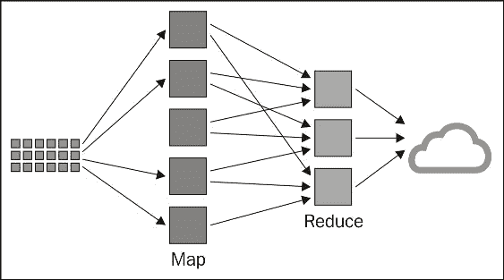
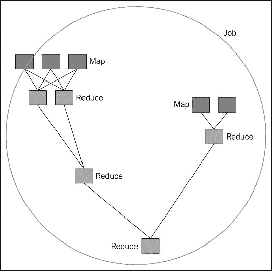

# 第三章数据处理-MapReduce 及以后

在 Hadoop1 中，平台有两个明确的组件：用于数据存储的 HDFS 和用于数据处理的 MapReduce。 上一章描述了 Hadoop2 中 HDFS 的发展，本章我们将讨论数据处理。

与存储相比，Hadoop 2 中的处理情况发生了更大的变化，现在 Hadoop 作为一等公民支持多种处理模式。 在本章中，我们将探索 Hadoop2 中的 MapReduce 和其他计算模型。 我们将特别介绍以下内容：

*   什么是 MapReduce 以及为其编写应用程序所需的 Java API
*   MapReduce 是如何在实践中实现的
*   Hadoop 如何将数据读入和读出其处理作业
*   Yar，Hadoop2 组件，允许在平台上进行 MapReduce 以外的处理
*   几种在纱线上实现的计算模型介绍

# MapReduce

MapReduce是 Hadoop1 中支持的主要处理模型。它遵循谷歌在 2006 年发表的一篇论文([http://research.google.com/archive/mapreduce.html](http://research.google.com/archive/mapreduce.html))提出的处理数据的分而治之模型，并且在函数式编程和数据库研究方面都有基础。 名称本身指的是应用于所有输入数据的两个截然不同的步骤，一个是`map`函数，另一个是`reduce`函数。

每个 MapReduce 应用程序都是构建在这个非常简单的模型之上的一系列作业。 有时，整个应用程序可能需要多个作业，其中一个`reduce`阶段的输出是另一个`map`阶段的输入，有时可能有多个`map`或`reduce`函数，但核心概念保持不变。

我们将通过查看`map`和`reduce`函数的性质来介绍 MapReduce 模型，然后描述构建函数实现所需的 Java API。 在展示了一些示例之后，我们将演练 MapReduce 执行，以更深入地了解实际的 MapReduce 框架如何在运行时执行代码。

学习MapReduce 模型可能有点违反直觉；通常很难理解非常简单的函数组合在一起时如何能够在巨大的数据集上提供非常丰富的处理。 但它确实起作用了，相信我们！

当我们探索`map`和`reduce`函数的性质时，可以将它们视为应用于从源数据集中检索的记录流。 我们稍后将描述这是如何发生的；现在，假设源数据被分成更小的块，每个块都被提供给 map 函数的一个专用实例。 每条记录都应用了映射功能，生成一组中间数据。 从该临时数据集中检索记录，并通过`reduce`函数将所有相关记录一起馈送。 所有记录集的`reduce`函数的最终输出是整个作业的总体结果。

从功能的角度来看，MapReduce 将数据结构从一个(键、值)对列表转换为另一个。 在*映射*阶段，数据从 HDFS 加载，函数并行应用于每个输入(键、值)，新的(键、值)对列表为输出：

```scala
map(k1,v1) -> list(k2,v2)
```

然后，该框架从所有列表中收集具有相同密钥的所有对，并将它们分组在一起，为每个密钥创建一个组。 对每个组并行应用*Reduce*函数，进而生成一个值列表：

```scala
reduce(k2, list (v2)) → k3,list(v3)
```

然后，输出以以下方式写回 HDFS：



映射和减少阶段

# 到 MapReduce 的 Java API

MapReduce的 Java API 由`org.apache.hadoop.mapreduce`包公开。 编写 MapReduce 程序的核心是对 Hadoop 提供的`Mapper`和`Reducer`基类进行子类化，并用我们自己的实现覆盖`map()`和`reduce()`方法。

## Mapper 类

对于我们的自己的`Mapper`实现，我们将子类化为`Mapper`基类并覆盖`map()`方法，如下所示：

```scala
   class Mapper<K1, V1, K2, V2>
   {
         void map(K1 key, V1 value Mapper.Context context)
               throws IOException, InterruptedException
         ...
   }
```

根据键/值输入和输出类型定义类，然后`map` 方法将输入键/值对作为其参数。 另一个参数是`Context`类的实例，它提供了与 Hadoop 框架通信的各种机制，其中之一是输出`map`或`reduce`方法的结果。

请注意，map 方法仅引用 K1 和 V1 键/值对的单个实例。 这是 MapReduce 范例的一个关键方面，在 MapReduce 范例中，您可以编写处理单个记录的类，框架负责将庞大的数据集转换为键/值对流所需的所有工作。 您永远不需要编写映射或缩减类来尝试处理整个数据集。 Hadoop 还通过其`InputFormat`和`OutputFormat` 类提供了机制，这些机制提供了通用文件格式的实现，并且同样消除了必须为除自定义文件类型之外的任何文件类型编写文件解析器的需要。

有时可能需要覆盖另外三种方法：

```scala
   protected void setup( Mapper.Context context)
         throws IOException, InterruptedException
```

在将任何键/值对呈现给 map 方法之前，将调用此方法一次。 默认实现不执行任何操作：

```scala
   protected void cleanup( Mapper.Context context)
         throws IOException, InterruptedException
```

在将所有键/值对呈现给 map 方法之后，将调用此方法一次。 默认实现不执行任何操作：

```scala
   protected void run( Mapper.Context context)
         throws IOException, InterruptedException
```

此方法控制 JVM 中任务处理的整体流程。 默认实现先调用 Setup 方法一次，然后为拆分中的每个键/值对重复调用 map 方法，然后最后调用 Cleanup 方法。

## Reducer 类

`Reducer`基类的工作方式与`Mapper`类非常相似，通常只需要子类覆盖单个`reduce()`方法。 下面是精简的类定义：

```scala
   public class Reducer<K2, V2, K3, V3>
   {
      void reduce(K2 key, Iterable<V2> values,
         Reducer.Context context)
           throws IOException, InterruptedException
      ...
   }
```

同样，请注意在更广泛的数据流方面的类定义(`reduce`方法接受`K2`/`V2`作为输入，并提供`K3`/`V3`作为输出)，而实际的`reduce`方法只接受一个键及其关联的值列表。 上下文对象也是输出方法结果的机制。

此类还具有与`Mapper`类类似的默认实现的 Setup、Run 和 Cleanup 方法，可以选择覆盖这些方法：

```scala
protected void setup(Reducer.Context context)
throws IOException, InterruptedException
```

在将任何键/值列表呈现给`reduce`方法之前，会调用一次`setup()`方法。 默认实现不执行任何操作：

```scala
protected void cleanup(Reducer.Context context)
throws IOException, InterruptedException
```

在将所有键/值列表呈现给`reduce`方法之后，调用一次`cleanup()`方法。 默认实现不执行任何操作：

```scala
protected void run(Reducer.Context context)
throws IOException, InterruptedException
```

`run()`方法控制 JVM 中处理任务的总体流程。 对于提供给`Reducer`类的尽可能多的键/值对，默认实现在重复且可能并发地调用`reduce`方法之前调用 setUp 方法，然后最后调用 Cleanup 方法。

## 驱动程序类

驱动程序类与 Hadoop 框架通信，并指定运行 MapReduce 作业所需的配置元素。 这涉及到一些方面，比如告诉 Hadoop 使用哪个`Mapper`和`Reducer`类、在哪里查找输入数据以及以什么格式查找输入数据、在哪里放置输出数据以及如何格式化输出数据。

驱动程序逻辑通常存在于为封装 MapReduce 作业而编写的类的 Main 方法中。 子类没有默认的父驱动程序类：

```scala
public class ExampleDriver extends Configured implements Tool
   {
   ...
   public static void run(String[] args) throws Exception
   {
      // Create a Configuration object that is used to set other options
      Configuration conf = getConf();

      // Get command line arguments
      args = new GenericOptionsParser(conf, args)
      .getRemainingArgs();

      // Create the object representing the job
      Job job = new Job(conf, "ExampleJob");

      // Set the name of the main class in the job jarfile
      job.setJarByClass(ExampleDriver.class);
      // Set the mapper class
      job.setMapperClass(ExampleMapper.class);

      // Set the reducer class
      job.setReducerClass(ExampleReducer.class);

      // Set the types for the final output key and value
      job.setOutputKeyClass(Text.class);
      job.setOutputValueClass(IntWritable.class);

      // Set input and output file paths
      FileInputFormat.addInputPath(job, new Path(args[0]));
      FileOutputFormat.setOutputPath(job, new Path(args[1]));

      // Execute the job and wait for it to complete
      System.exit(job.waitForCompletion(true) ? 0 : 1);
   }

   public static void main(String[] args) throws Exception
   {
      int exitCode = ToolRunner.run(new ExampleDriver(), args);
      System.exit(exitCode);
    }
}
```

在前面的行代码中，`org.apache.hadoop.util.Tool`是用于处理命令行选项的界面。 实际的处理被委托给`ToolRunner.run`，它使用给定的 `Configuration` 运行`Tool`，用于获取和设置作业的配置选项。 通过子类化`org.apache.hadoop.conf.Configured`，我们可以通过 `GenericOptionsParser`从命令行选项直接设置`Configuration`对象。

考虑到我们之前关于作业的讨论，许多设置都涉及作业对象上的操作也就不足为奇了。 这包括设置作业名称和指定要用于映射器和减少器实现的类。

设置特定的输入/输出配置，最后，传递给 main 方法的参数用于指定作业的输入和输出位置。 这是你会经常看到的一种非常常见的模式。

配置选项有个默认值，我们在前面的类中隐式使用了其中一些。 最值得注意的是，我们没有提到输入文件的格式或如何编写输出文件。 这些是通过前面提到的`InputFormat`和`OutputFormat`类定义的；我们稍后将详细探讨它们。 默认的输入和输出格式是适合我们示例的文本文件。 除了特别优化的二进制格式之外，还有多种在文本文件中表示格式的方式。

对于不太复杂的 MapReduce 作业，一种常见的模型是将`Mapper`和`Reducer`类作为驱动程序中的内部类。 这允许将所有内容保存在单个文件中，从而简化了代码分发。

## 组合

Hadoop允许使用组合器类在还原器检索输出之前对`map`方法的输出执行一些早期排序。

Hadoop 的大部分设计都是基于减少通常等同于磁盘和网络 I/O 的作业的昂贵部分。映射器的输出通常很大；看到它是原始输入大小的许多倍的情况并不少见。 Hadoop 确实允许配置选项来帮助降低减速器通过网络传输如此大的数据块的影响。 组合器采用了一种不同的方法，可以提前执行聚合，从而首先需要传输更少的数据。

组合器没有自己的接口；组合器必须具有与 Reducer 相同的签名，因此还可以从`org.apache.hadoop.mapreduce`包中派生 Reduce 类。 这样做的效果基本上是对指定给每个减少器的输出的映射器执行一个小型缩减。

Hadoop 不保证合并器是否会被执行。 有时，它可能根本不执行，而在其他时间，它可能会被使用一次、两次或多次，具体取决于映射器为每个减速器生成的输出文件的大小和数量。

## 分区

Reduce 接口的隐式保证之一是，单个 Reducer 将被赋予与给定键相关联的所有值。 在集群中运行多个 Reduce 任务的情况下，必须将每个映射器输出划分为发往每个 Reducer 的单独输出。 这些分区文件存储在本地节点文件系统上。

整个集群中的 Reduce 任务的数量不像映射器的数量那样动态，实际上，我们可以将该值指定为作业提交的一部分。 因此，Hadoop 知道完成这项工作需要多少减速器，并由此知道映射器输出应该拆分成多少个分区。

### 可选分区函数

在中，`org.apache.hadoop.mapreduce`包是`Partitioner`类，这是一个具有以下签名的抽象类：

```scala
public abstract class Partitioner<Key, Value>
{
  public abstract int getPartition(Key key, Value value, int numPartitions);
}
```

默认情况下，Hadoop 将使用散列输出键的策略来执行分区。 此功能由`org.apache.hadoop.mapreduce.lib.partition`包中的`HashPartitioner`类提供，但在某些情况下需要为`Partitioner`的自定义子类提供特定于应用程序的分区逻辑。 请注意，`getPartition`函数将键、值和分区数量作为参数，自定义分区逻辑可以使用这些参数。

例如，如果在应用标准散列函数时数据提供了非常不均匀的分布，则自定义分区策略将特别必要。 不均匀分区可能会导致某些任务必须执行比其他任务多得多的工作，从而导致整体作业执行时间更长。

## Hadoop 提供的映射器和减少器实现

我们并不总是必须从头开始编写我们自己的 Mapper 和 Reducer 类。 Hadoop 提供了几个常见的 Mapper 和 Reducer 实现，可以在我们的工作中使用。 如果我们不覆盖 Mapper 和 Reducer 类中的任何方法，则默认实现是 Identity Mapper 和 Reducer 类，它们只是输出不变的输入。

映射器位于`org.apache.hadoop.mapreduce.lib.mapper`处的，包括以下内容：

*   `InverseMapper`：返回(value，key)作为输出，即输入键作为值输出，输入值作为键输出
*   `TokenCounterMapper`：统计每行输入中的离散令牌数
*   `IdentityMapper`：实现标识功能，将输入直接映射到输出

减速器位于`org.apache.hadoop.mapreduce.lib.reduce`，目前包括以下内容：

*   `IntSumReducer`：输出每个键的整数值列表的总和
*   `LongSumReducer`：输出每个键的长值列表的总和
*   `IdentityReducer`：实现标识功能，将输入直接映射到输出

## 共享参考数据

有时，我们可能希望跨任务共享数据。 对于实例，如果我们需要在 ID 到字符串转换表上执行查找操作，我们可能希望这样的数据源可以由映射器或缩减器访问。 一种简单的方法是将我们想要访问的数据存储在 HDFS 上，并使用文件系统 API 将其作为 Map 或 Reduce 步骤的一部分进行查询。

Hadoop 为我们提供了另一种机制来实现在作业中的所有任务之间共享引用数据的目标，即由`org.apache.hadoop.mapreduce.filecache.DistributedCache`类定义的分布式缓存。 这可用于有效地使`map`或`reduce`任务使用的公共只读文件对所有节点可用。

文件可以是本例中的文本数据，但也可以是其他 JAR、二进制数据或归档；任何事情都是可能的。 要分发的文件放在 HDFS 上，并添加到作业驱动程序中的 DistributedCache。 Hadoop 在作业执行之前将文件复制到每个节点的本地文件系统，这意味着每个任务都可以本地访问这些文件。

另一种选择是，将需要的文件捆绑到提交给 Hadoop 的作业 JAR 中。 这确实将数据绑定到作业 JAR，使得跨作业共享变得更加困难，并且需要在数据更改时重新构建 JAR。

# 编写 MapReduce 程序

在本章中，我们将关注批处理工作负载；给定一组历史数据，我们将查看该数据集的属性。 在[第 4 章](04.html "Chapter 4. Real-time Computation with Samza")、*使用 Samza*和[第](05.html "Chapter 5. Iterative Computation with Spark")章*使用 Spark*迭代计算中，我们将展示如何对实时收集的文本流执行类似类型的分析。

## 入门

在下面的示例中，我们将假设使用`stream.py`脚本收集 1,000 条 tweet 生成的数据集，如[第 1 章](01.html "Chapter 1. Introduction")，*简介*中所示：

```scala
$ python stream.py –t –n 1000 > tweets.txt

```

然后，我们可以使用以下命令将数据集拷贝到 HDFS：

```scala
$ hdfs dfs -put tweets.txt <destination>

```

### 提示

请注意，到目前为止，我们只处理 tweet 的文本。 在本书的其余部分中，我们将扩展`stream.py`以 JSON 格式输出额外的 tweet 元数据。 在使用`stream.py`转储 TB 级的消息之前，请记住这一点。

我们的第一个 MapReduce程序将是规范的单词计数示例。 本程序的一个变体将用于确定热门话题。 然后，我们将分析与主题相关的文本，以确定它表达的是“积极”情绪还是“负面”情绪。 最后，我们将使用 MapReduce 模式-ChainMapper-将所有内容组合在一起，并提供一个数据管道来清理和准备我们将提供给趋势主题和情绪分析模型的文本数据。

## 运行示例

本部分中描述的示例的完整源代码可以在[https://github.com/learninghadoop2/book-examples/tree/master/ch3](https://github.com/learninghadoop2/book-examples/tree/master/ch3)中找到。

在 Hadoop 中运行作业之前，我们必须编译代码并将所需的类文件收集到单个 JAR 文件中，然后提交给系统。 使用 Gradle，您可以使用以下命令构建所需的 JAR 文件：

```scala
$ ./gradlew jar

```

### 本地群集

使用 Hadoop 命令行实用程序的 jar 选项在 Hadoop 上执行作业。 要使用它，我们指定 JAR 文件的名称、其中的主类以及将传递给主类的任何参数，如以下命令所示：

```scala
$ hadoop jar <job jarfile> <main class> <argument 1> … <argument 2>

```

### 弹性 MapReduce

回想一下[第 1 章](01.html "Chapter 1. Introduction")，*简介*，Elastic MapReduce 期望作业 JAR 文件及其输入数据位于 S3 存储桶中，反之则将其输出转储回 S3。

### 备注

小心：这会花钱的！ 在本例中，我们将使用 EMR 可用的最小群集配置，即单节点群集

首先，我们将使用`aws`命令行实用程序将 tweet 数据集以及正面和负面单词列表复制到 S3：

```scala
$ aws s3 put tweets.txt s3://<bucket>/input
$ aws s3 put job.jar s3://<bucket>

```

通过将 JAR 文件上传到`s3://<bucket>`并使用 AWS CLI 添加`CUSTOM_JAR`步骤，我们可以使用 EMR 命令行工具执行作业，如下所示：

```scala
$ aws emr add-steps --cluster-id <cluster-id> --steps \
Type=CUSTOM_JAR,\
Name=CustomJAR,\
Jar=s3://<bucket>/job.jar,\
MainClass=<class name>,\
Args=arg1,arg2,…argN

```

这里，`cluster-id`是正在运行的 EMR 集群的 ID，`<class name>`是主类的完全限定名，`arg1,arg2,…,argN`是作业参数。

## 字数，MapReduce 的 Hello World

Wordcount统计数据集中出现的单词。 此示例的源代码可以在[https://github.com/learninghadoop2/book-examples/blob/master/ch3/src/main/java/com/learninghadoop2/mapreduce/WordCount.java](https://github.com/learninghadoop2/book-examples/blob/master/ch3/src/main/java/com/learninghadoop2/mapreduce/WordCount.java)中找到。 以下面的代码块为例：

```scala
public class WordCount extends Configured implements Tool
{
    public static class WordCountMapper
            extends Mapper<Object, Text, Text, IntWritable>
    {
        private final static IntWritable one = new IntWritable(1);
        private Text word = new Text();
        public void map(Object key, Text value, Context context
        ) throws IOException, InterruptedException {
            String[] words = value.toString().split(" ") ;
            for (String str: words)
            {
                word.set(str);
                context.write(word, one);
            }
        }
    }
    public static class WordCountReducer
            extends Reducer<Text,IntWritable,Text,IntWritable> {
        public void reduce(Text key, Iterable<IntWritable> values,
                           Context context
        ) throws IOException, InterruptedException {
            int total = 0;
            for (IntWritable val : values) {
                total++ ;
            }
            context.write(key, new IntWritable(total));
        }
    }

    public int run(String[] args) throws Exception {
        Configuration conf = getConf();

        args = new GenericOptionsParser(conf, args)
        .getRemainingArgs();

        Job job = Job.getInstance(conf);

        job.setJarByClass(WordCount.class);
        job.setMapperClass(WordCountMapper.class);
        job.setReducerClass(WordCountReducer.class);
        job.setOutputKeyClass(Text.class);
        job.setOutputValueClass(IntWritable.class);

        FileInputFormat.addInputPath(job, new Path(args[0]));
        FileOutputFormat.setOutputPath(job, new Path(args[1]));

        return (job.waitForCompletion(true) ? 0 : 1);
    }

    public static void main(String[] args) throws Exception {
        int exitCode = ToolRunner.run(new WordCount(), args);
        System.exit(exitCode);
    }
}
```

这是我们的第一个个完整的 MapReduce 作业。 看看结构，您应该能认出我们前面讨论过的元素：整个`Job`类，在其 Main 方法中包含驱动程序配置，以及定义为静态嵌套类的 Mapper 和 Reducer 实现。

在下一节中，我们将更详细地演练 MapReduce 的机制，但现在，让我们看一下前面的代码，并考虑它是如何实现我们前面讨论的键/值转换的。

Mapper 类的输入可以说是最难理解的，因为实际上并没有使用键。 作业指定`TextInputFormat`作为输入数据的格式，默认情况下，这将向映射器传递数据，其中键是文件中的字节偏移量，值是该行的文本。 实际上，您可能从未真正看到过使用字节偏移键的映射器，但它是提供的。

映射器对输入源中的每一行文本执行一次，每次它获取该行并将其拆分成单词。 然后，它使用上下文对象输出(通常称为发出)表单的每个新键/值(word，1)。 这些是我们的`K2`/`V2`值。

我们在前面说过，减法器的输入是一个键和相应的值列表，在`map`和`reduce`方法之间发生了一些魔术，可以收集每个键的值来帮助实现这一点-称为无序阶段，我们现在不会对其进行描述。 Hadoop 为每个键执行一次 Reducer，前面的 Reducer 实现只是对 Iterable 对象中的数字进行计数，并以(word，count)的形式给出每个单词的输出。 这些是我们的 K3/V3 值。

看看我们的映射器和减法器类的签名：`WordCountMapper`类接受`IntWritable`和 text 作为输入，并提供 text 和`IntWritable`作为输出。 `WordCountReducer`类接受文本和`IntWritable`作为输入和输出。 这也是一种非常常见的模式，map 方法对键和值执行反转，而是发出一系列数据对，Reducer 对这些数据对执行聚合。

驱动程序在这里更有意义，因为我们有实际的参数值。 我们使用传递给类的参数来指定输入和输出位置。

使用以下命令运行作业：

```scala
$ hadoop jar build/libs/mapreduce-example.jar com.learninghadoop2.mapreduce.WordCount \
 twitter.txt output

```

使用下面的命令检查输出；实际的文件名可能不同，因此只需查看 HDFS 主目录中名为 output 的目录：

```scala
$ hdfs dfs -cat output/part-r-00000

```

## 单词共现

同时出现的单词可能是短语，而常见(频繁出现)的短语可能是重要的。 在自然语言处理中，共现术语列表称为 N-Gram。 N-gram 是文本分析的几种统计方法的基础。 我们将给出一个由两个术语(二元语法)组成的 N-Gram(分析应用程序中经常遇到的度量)的特殊情况的示例。

MapReduce 中一个天真的实现是 wordcount 的扩展，它发出一个由两个制表符分隔的单词组成的多字段键。

```scala
public class BiGramCount extends Configured implements Tool
{
   public static class BiGramMapper
           extends Mapper<Object, Text, Text, IntWritable> {
       private final static IntWritable one = new IntWritable(1);
       private Text word = new Text();

       public void map(Object key, Text value, Context context
       ) throws IOException, InterruptedException {
           String[] words = value.toString().split(" ");

           Text bigram = new Text();
           String prev = null;

           for (String s : words) {
               if (prev != null) {
                   bigram.set(prev + "\t+\t" + s);
                   context.write(bigram, one);
               }

               prev = s;
           }
       }
   }

    @Override
    public int run(String[] args) throws Exception {
         Configuration conf = getConf();

         args = new GenericOptionsParser(conf, args).getRemainingArgs();
         Job job = Job.getInstance(conf);
         job.setJarByClass(BiGramCount.class);
         job.setMapperClass(BiGramMapper.class);
         job.setReducerClass(IntSumReducer.class);
         job.setOutputKeyClass(Text.class);
         job.setOutputValueClass(IntWritable.class);
         FileInputFormat.addInputPath(job, new Path(args[0]));
         FileOutputFormat.setOutputPath(job, new Path(args[1]));
         return (job.waitForCompletion(true) ? 0 : 1);
    }

    public static void main(String[] args) throws Exception {
        int exitCode = ToolRunner.run(new BiGramCount(), args);
        System.exit(exitCode);
    }
}
```

在此作业中，我们用实现相同逻辑的`org.apache.hadoop.mapreduce.lib.reduce.IntSumReducer`替换`WordCountReducer`。 此示例的源代码可以在[https://github.com/learninghadoop2/book-examples/blob/master/ch3/src/main/java/com/learninghadoop2/mapreduce/BiGramCount.java](https://github.com/learninghadoop2/book-examples/blob/master/ch3/src/main/java/com/learninghadoop2/mapreduce/BiGramCount.java)中找到。

## 热门话题

`#`符号称为标签，用于标记推文中的关键字或主题。 它是由 Twitter 用户有机创建的，作为对邮件进行分类的一种方式。 推特搜索(可在[https://twitter.com/search-home](https://twitter.com/search-home)找到)普及了使用标签作为连接和查找与特定主题相关的内容以及谈论这些主题的人的方法。 通过计算在给定时间段内标签被提及的频率，我们可以确定哪些话题在社交网络中流行。

```scala
public class HashTagCount extends Configured implements Tool
{
    public static class HashTagCountMapper
            extends Mapper<Object, Text, Text, IntWritable>
    {
        private final static IntWritable one = new IntWritable(1);
        private Text word = new Text();

        private String hashtagRegExp =
"(?:\\s|\\A|^)[##]+([A-Za-z0-9-_]+)";

        public void map(Object key, Text value, Context context)
                throws IOException, InterruptedException {
            String[] words = value.toString().split(" ") ;

            for (String str: words)
            {
                if (str.matches(hashtagRegExp)) {
                    word.set(str);
                    context.write(word, one);
                }
            }
        }
    }

    public int run(String[] args) throws Exception {
        Configuration conf = getConf();

        args = new GenericOptionsParser(conf, args)
        .getRemainingArgs();

        Job job = Job.getInstance(conf);

        job.setJarByClass(HashTagCount.class);
        job.setMapperClass(HashTagCountMapper.class);
        job.setCombinerClass(IntSumReducer.class);
        job.setReducerClass(IntSumReducer.class);
        job.setOutputKeyClass(Text.class);
        job.setOutputValueClass(IntWritable.class);

        FileInputFormat.addInputPath(job, new Path(args[0]));
        FileOutputFormat.setOutputPath(job, new Path(args[1]));

        return (job.waitForCompletion(true) ? 0 : 1);
    }

    public static void main(String[] args) throws Exception {
        int exitCode = ToolRunner.run(new HashTagCount(), args);
        System.exit(exitCode);
    }
}
```

与wordcount 示例一样，我们将映射器中的文本标记化。 我们使用正则表达式-`hashtagRegExp`-来检测 Twitter 文本中是否存在 hashtag，并在找到 hashtag 时发出 hashtag 和数字 1。 在 Reducer 步骤中，然后使用 `IntSumReducer`计算发出的 hashtag 出现的总数。

此示例的完整源代码可以在[https://github.com/learninghadoop2/book-examples/blob/master/ch3/src/main/java/com/learninghadoop2/mapreduce/HashTagCount.java](https://github.com/learninghadoop2/book-examples/blob/master/ch3/src/main/java/com/learninghadoop2/mapreduce/HashTagCount.java)中找到。

编译后的类将位于我们之前使用 Gradle 构建的 JAR 文件中，因此现在我们使用以下命令执行 HashTagCount：

```scala
$ hadoop jar build/libs/mapreduce-example.jar \
com.learninghadoop2.mapreduce.HashTagCount twitter.txt output

```

让我们像前面一样检查输出：

```scala
$ hdfs dfs -cat output/part-r-00000

```

您应该会看到类似以下内容的输出：

```scala
#whey         1
#willpower    1
#win          2
#winterblues  1
#winterstorm  1
#wipolitics   1
#women        6
#woodgrain    1

```

每一行都由一个标签和它在 twets 数据集中出现的次数组成。 如您所见，MapReduce 作业按键对结果进行排序。 如果我们想要找到提到最多的主题，我们需要对结果集进行排序。 天真的方法是对聚合值进行总排序，并选择前 10 名。

如果输出数据集很小，我们可以将其通过管道传输到标准输出，并使用`sort`实用程序对其进行排序：

```scala
$ hdfs dfs -cat output/part-r-00000 | sort -k2 -n -r | head -n 10

```

另一个解决方案是编写另一个 MapReduce 作业来遍历整个结果集并按值排序。 当数据变得很大时，这种类型的全局排序可能会变得相当昂贵。 在下一节中，我们将演示一种对聚合数据进行排序的高效设计模式

### 前 N 个模式

在Top N 模式中，我们将数据排序在本地数据结构中。 每个映射器计算其拆分中前 N 条记录的列表，并将其列表发送到缩减器。 单个 Reducer 任务查找前 N 个全局记录。

我们将应用此设计模式来实现`TopTenHashTag`作业，该作业在我们的数据集中查找前十个主题。 该作业接受`HashTagCount`生成的输出数据作为输入，并返回十个最常提到的标签的列表。

在`TopTenMapper`中，我们使用`TreeMap`来保持标签的排序列表(按升序排列)。 该映射的关键是出现的次数；该值是由个标签及其在`map()`中的频率`.`组成的制表符分隔的字符串，对于每个值，我们更新`topN`映射。 当 topN 有十个以上的项目时，我们删除最小的：

```scala
public static class TopTenMapper extends Mapper<Object, Text, 
  NullWritable, Text> {

  private TreeMap<Integer, Text> topN = new TreeMap<Integer, Text>();
  private final static IntWritable one = new IntWritable(1);
  private Text word = new Text();
  public void map(Object key, Text value, Context context) throws 
    IOException, InterruptedException {

  String[] words = value.toString().split("\t") ;
  if (words.length < 2) {
    return;
  }
  topN.put(Integer.parseInt(words[1]), new Text(value));
  if (topN.size() > 10) {
    topN.remove(topN.firstKey());
  }
}

       @Override
       protected void cleanup(Context context) throws IOException, InterruptedException {
            for (Text t : topN.values()) {
                context.write(NullWritable.get(), t);
            }
        }
    }
```

我们不会在 map 函数中发出任何键/值。 我们实现了一个`cleanup()`方法，一旦映射器使用了它的所有输入，就会发出`topN`中的(hashtag，count)值。 我们使用`NullWritable`键，因为我们希望所有值都与同一键相关联，这样我们就可以在所有映射器的前 n 个列表上执行全局排序。 这意味着我们的工作将只执行一个减速器。

减法器实现的逻辑与我们在`map()`中的逻辑类似。 我们实例化`TreeMap`并使用它来保存前 10 个值的有序列表：

```scala
    public static class TopTenReducer extends
            Reducer<NullWritable, Text, NullWritable, Text> {

        private TreeMap<Integer, Text> topN = new TreeMap<Integer, Text>();

        @Override
        public void reduce(NullWritable key, Iterable<Text> values, Context context) throws IOException, InterruptedException {
            for (Text value : values) {
                String[] words = value.toString().split("\t") ;

                topN.put(Integer.parseInt(words[1]),
                    new Text(value));

                if (topN.size() > 10) {
                    topN.remove(topN.firstKey());
                }
            }

            for (Text word : topN.descendingMap().values()) {
                context.write(NullWritable.get(), word);
            }
        }
    }
```

最后，我们按降序遍历`topN`以生成趋势主题列表。

### 备注

请注意，在此实现中，当调用`topN.put()`时，我们覆盖了在`TreeMap`中已经存在频率值的 hashtag。 根据用例的不同，建议使用不同的数据结构--比如Guava 库([https://code.google.com/p/guava-libraries/](https://code.google.com/p/guava-libraries/))提供的数据结构--或者调整更新策略。

在驱动程序中，我们通过设置`job.setNumReduceTasks(1)`来强制执行单个减速器：

```scala
$ hadoop jar build/libs/mapreduce-example.jar \
com.learninghadoop2.mapreduce.TopTenHashTag \
output/part-r-00000 \
top-ten

```

我们可以查看前十名，列出热门话题：

```scala
$ hdfs dfs -cat top-ten/part-r-00000
#Stalker48      150
#gameinsight    55
#12M    52
#KCA    46
#LORDJASONJEROME        29
#Valencia       19
#LesAnges6      16
#VoteLuan       15
#hadoop2    12
#Gameinsight    11

```

本例的源代码可以在[https://github.com/learninghadoop2/book-examples/blob/master/ch3/src/main/java/com/learninghadoop2/mapreduce/TopTenHashTag.java](https://github.com/learninghadoop2/book-examples/blob/master/ch3/src/main/java/com/learninghadoop2/mapreduce/TopTenHashTag.java)中找到。

## 标签的情感

识别数据源中的主观信息的过程通常被称为情感分析。 在前面的示例中，我们展示了如何检测社交网络中的热门话题；现在我们将分析围绕这些话题分享的文本，以确定它们表达的是积极情绪还是负面情绪。

在[http://www.cs.uic.edu/~liub/FBS/opinion-lexicon-English.rar](http://www.cs.uic.edu/~liub/FBS/opinion-lexicon-English.rar)上可以找到英语的正面和负面单词列表--一个所谓的意见词典。

### 备注

这些资源--以及更多的资源--已经由伊利诺伊大学芝加哥分校的刘兵教授的团队收集，并在*刘兵、胡敏青和郑俊生等人身上使用。 “意见观察家：分析和比较网络上的意见。” 第 14 届国际万维网会议论文集(WWW-2005)，2005 年 5 月 10-14 日，日本千叶市*。

在本例中，我们将介绍一种词袋方法，尽管该方法本质上过于简单，但可以用作挖掘文本中观点的基线。 对于每条 tweet 和每个 hashtag，我们将计算正面或负面单词出现的次数，并根据文本长度对此计数进行归一化。

### 备注

词袋模型是自然语言处理和信息检索中用来表示文本文档的一种方法。 在该模型中，文本被表示为其单词的集合或包-具有多样性，而不考虑语法和形态属性，甚至不考虑词序。

使用以下命令行解压缩归档文件并将单词列表放入 HDFS 中：

```scala
$ hdfs dfs –put positive-words.txt <destination>
$ hdfs dfs –put negative-words.txt <destination>

```

在 Mapper 类中，我们将包含单词列表的两个对象定义为`Set<String>`：`positiveWords`和`negativeWords`：

```scala
private Set<String> positiveWords =  null;
private Set<String> negativeWords = null;
```

我们覆盖映射器的默认`setup()`方法，以便使用我们在上一章中讨论的文件系统 API 从 HDFS 读取正面和负面单词的列表-由两个配置属性`job.positivewords.path`和`job.negativewords.path`指定。 我们还可以使用 DistributedCache 在集群之间共享此数据。 Helper 方法`parseWordsList`读取单词列表、剥离注释并将单词加载到`HashSet<String>`中：

```scala
private HashSet<String> parseWordsList(FileSystem fs, Path wordsListPath)
{
    HashSet<String> words = new HashSet<String>();
    try {

        if (fs.exists(wordsListPath)) {
            FSDataInputStream fi = fs.open(wordsListPath);

            BufferedReader br =
new BufferedReader(new InputStreamReader(fi));
            String line = null;
            while ((line = br.readLine()) != null) {
                if (line.length() > 0 && !line.startsWith(BEGIN_COMMENT)) {
                    words.add(line);
                }
            }

            fi.close();
        }
    }
    catch (IOException e) {
        e.printStackTrace();
    }

    return words;
}  
```

在 Mapper 步骤中，我们为 tweet 中的每个标签发出 tweet 的总体感觉(简单地说，正向字数减去负向字数)和 tweet 的长度。

我们将在减法器中使用这些参数来计算按推文长度加权的总体情绪比率，以估计标签上的推文所表达的情绪，如下所示：

```scala
        public void map(Object key, Text value, Context context)
 throws IOException, InterruptedException {
            String[] words = value.toString().split(" ") ;
            Integer positiveCount = new Integer(0);
            Integer negativeCount = new Integer(0);

            Integer wordsCount = new Integer(0);

            for (String str: words)
            {
                if (str.matches(HASHTAG_PATTERN)) {
                    hashtags.add(str);
                }

                if (positiveWords.contains(str)) {
                    positiveCount += 1;
                } else if (negativeWords.contains(str)) {
                    negativeCount += 1;
                }

                wordsCount += 1;
            }

            Integer sentimentDifference = 0;
            if (wordsCount > 0) {
              sentimentDifference = positiveCount - negativeCount;
            }

            String stats ;
            for (String hashtag : hashtags) {
                word.set(hashtag);
                stats = String.format("%d %d", sentimentDifference, wordsCount);
                context.write(word, new Text(stats));
            }
        }
    }
```

在 Reducer 步骤中，我们将给予每个标签实例的情绪得分相加，并除以出现该标签的所有推文的总大小：

```scala
public static class HashTagSentimentReducer
            extends Reducer<Text,Text,Text,DoubleWritable> {
        public void reduce(Text key, Iterable<Text> values,
                           Context context
        ) throws IOException, InterruptedException {
            double totalDifference = 0;
            double totalWords = 0;
            for (Text val : values) {
                String[] parts = val.toString().split(" ") ;
                totalDifference += Double.parseDouble(parts[0]) ;
                totalWords += Double.parseDouble(parts[1]) ;
            }
            context.write(key,
new DoubleWritable(totalDifference/totalWords));
        }
    }
```

此示例的完整源代码可以在[https://github.com/learninghadoop2/book-examples/blob/master/ch3/src/main/java/com/learninghadoop2/mapreduce/HashTagSentiment.java](https://github.com/learninghadoop2/book-examples/blob/master/ch3/src/main/java/com/learninghadoop2/mapreduce/HashTagSentiment.java)中找到。

运行上述代码后，使用以下命令执行`HashTagSentiment`：

```scala
$ hadoop jar build/libs/mapreduce-example.jar com.learninghadoop2.mapreduce.HashTagSentiment twitter.txt output-sentiment <positive words> <negative words>

```

您可以使用以下命令检查输出：

```scala
$ hdfs dfs -cat output-sentiment/part-r-00
000

```

您应该会看到类似于以下内容的输出：

```scala
#1068   0.011861271213042056
#10YearsOfLove  0.012285135487494233
#11     0.011941109121333999
#12     0.011938693593171155
#12F    0.012339242266249566
#12M    0.011864286953783268
#12MCalleEnPazYaTeVasNicolas

```

在前面的输出中，每行都由一个标签和与之相关的情感极性组成。 这个数字是启发式的，它告诉我们标签主要与正面(极性>0)还是负面(极性<0)情绪相关，以及这种情绪的程度-数字越高或越低，情绪越强烈。

## 使用链映射器清除文本

在到目前为止提供的示例中，我们忽略了几乎每个围绕文本处理构建的应用程序的一个关键步骤，即输入数据的规范化和清理。 此标准化步骤的三个常见组件为：

*   将字母大小写更改为小写或大写
*   拆除停工字眼
*   茎 / 干 / 船首 / 血统

在本节中，我们将展示`ChainMapper`类(位于`org.apache.hadoop.mapreduce.lib.chain.ChainMapper`)如何允许我们顺序组合一系列映射器，以作为数据清理管道的第一步放在一起。 使用以下选项将映射器添加到配置的作业：

```scala
ChainMapper.addMapper(
JobConf job,
Class<? extends Mapper<K1,V1,K2,V2>> klass,
Class<? extends K1> inputKeyClass,
Class<? extends V1> inputValueClass,
Class<? extends K2> outputKeyClass,
Class<? extends V2> outputValueClass, JobConf mapperConf)
```

静态方法`addMapper`需要传递以下参数：

*   `job`：添加 Mapper 类的 JobConf
*   `class`：要添加的映射器类
*   `inputKeyClass`：映射器输入键类
*   `inputValueClass`：映射器输入值类
*   `outputKeyClass`：映射器输出键类
*   `outputValueClass`：映射器输出值类
*   `mapperConf`：具有 Mapper 类配置的JobConf

在这个示例中，我们将处理上面列出的第一项：在计算每条 tweet 的情感之前，我们将其文本中出现的每个单词转换为小写。 这将允许我们通过忽略不同推文的大小写差异来更准确地确定标签的情绪。

首先，我们定义了一个新的映射器-`LowerCaseMapper`-它的`map()`函数在其输入值上调用 Java String 的`toLowerCase()` 方法，并发出大小写的文本：

```scala
public class LowerCaseMapper extends Mapper<LongWritable, Text, IntWritable, Text> {
    private Text lowercased = new Text();
    public void map(LongWritable key, Text value, Context context)
throws IOException, InterruptedException {
        lowercased.set(value.toString().toLowerCase());
        context.write(new IntWritable(1), lowercased);
    }
}
```

在`HashTagSentimentChain`驱动程序中，我们配置 Job 对象，以便将两个映射器链接在一起并执行：

```scala
public class HashTagSentimentChain
extends Configured implements Tool
{

    public int run(String[] args) throws Exception {
        Configuration conf = getConf();
        args = new GenericOptionsParser(conf,args).getRemainingArgs();

        // location (on hdfs) of the positive words list
        conf.set("job.positivewords.path", args[2]);
        conf.set("job.negativewords.path", args[3]);

        Job job = Job.getInstance(conf);
        job.setJarByClass(HashTagSentimentChain.class);

        Configuration lowerCaseMapperConf = new Configuration(false);
        ChainMapper.addMapper(job,
                LowerCaseMapper.class,
                LongWritable.class, Text.class,
                IntWritable.class, Text.class,
                lowerCaseMapperConf);

        Configuration hashTagSentimentConf = new Configuration(false);
        ChainMapper.addMapper(job,
                HashTagSentiment.HashTagSentimentMapper.class,
                IntWritable.class,
                Text.class, Text.class,
                Text.class,
                hashTagSentimentConf);
        job.setReducerClass(HashTagSentiment.HashTagSentimentReducer.class);

        job.setInputFormatClass(TextInputFormat.class);
        FileInputFormat.addInputPath(job, new Path(args[0]));

        job.setOutputFormatClass(TextOutputFormat.class);
        FileOutputFormat.setOutputPath(job, new Path(args[1]));

        return (job.waitForCompletion(true) ? 0 : 1);
    }

    public static void main (String[] args) throws Exception {
        int exitCode = ToolRunner.run(
new HashTagSentimentChain(), args);
        System.exit(exitCode);
    }
}
```

在管道中调用`LowerCaseMapper`和`HashTagSentimentMapper`类，其中第一个类的输出成为第二个类的输入。 最后一个映射器的输出将写入任务的输出。 此设计的直接好处是减少了磁盘 I/O 操作。 映射器不需要知道它们已被链接。 因此，可以重用可以在单个任务中组合的专用映射器。 请注意，此模式假设所有映射器和 Reduce 都使用匹配的输出和输入(键、值)对。 ChainMapper 本身不执行强制转换或转换。

最后，请注意，链中最后一个映射器的`addMapper`调用指定了在用作组合时适用于整个映射器管道的输出键/值类。

此示例的完整源代码可以在[https://github.com/learninghadoop2/book-examples/blob/master/ch3/src/main/java/com/learninghadoop2/mapreduce/HashTagSentimentChain.java](https://github.com/learninghadoop2/book-examples/blob/master/ch3/src/main/java/com/learninghadoop2/mapreduce/HashTagSentimentChain.java)中找到。

使用以下命令执行`HashTagSentimentChain`：

```scala
$ hadoop jar build/libs/mapreduce-example.jar com.learninghadoop2.mapreduce.HashTagSentimentChain twitter.txt output <positive words> <negative words>

```

您应该会看到类似于上一个示例的输出。 请注意，这一次，每行的标签都是小写的。

# 浏览 MapReduce 作业的运行

为了更详细地探索映射器和 Reducer 之间的关系，并公开 Hadoop 的一些内部工作原理，我们现在将了解 MapReduce 作业是如何执行的。 这同样适用于 Hadoop1 中的 MapReduce 和 Hadoop2 中的 MapReduce，尽管后者是使用纱线实现的，这一点我们将在本章后面讨论。 有关本节中描述的服务的其他信息，以及对 MapReduce 应用程序故障排除的建议，可以在[第 10 章](10.html "Chapter 10. Running a Hadoop Cluster")，*运行 Hadoop 集群*中找到。

## 启动

该驱动程序是在我们的本地机器上运行的唯一一段代码，调用`Job.waitForCompletion()`将启动与 JobTracker 的通信，JobTracker 是 MapReduce 系统中的主节点。 JobTracker 负责作业调度和执行的所有方面，因此在执行任何与作业管理相关的任务时，它成为我们的主要界面。

为了共享集群上的资源，JobTracker 可以使用几种调度方法中的一种来处理传入的作业。 一般模型是具有多个队列，作业可以提交到这些队列，同时还有跨队列分配资源的策略。 这些策略最常用的实现是容量和公平调度程序。

JobTracker 代表我们与 NameNode 通信，并管理与存储在 HDFS 上的数据相关的所有交互。

## 拆分输入

这些交互中的第一个发生在 JobTracker 查看输入数据并确定如何将其分配给映射任务时。 回想一下，HDFS 文件通常被分割成至少 64MB 的块，JobTracker 会将每个块分配给一个映射任务。 当然，我们的字数统计示例使用了很少的数据量，这些数据完全在单个块内。 假设有一个更大的输入文件(以 TB 为单位)，那么拆分模型就更有意义了。 文件的每个段(在 MapReduce 术语中称为拆分)都由一个映射任务唯一地处理。 一旦计算出拆分，JobTracker 就会将拆分和包含 Mapper 和 Reducer 类的 JAR 文件放入 HDFS 上特定于作业的目录中，该目录的路径将在任务启动时传递给每个任务。

## 任务分配

TaskTracker 服务负责分配资源、执行和跟踪节点上运行的 map 和 Reduce 任务的状态。 一旦JobTracker 确定需要多少映射任务，它就会查看群集中的主机数量、有多少 TaskTracker 在工作，以及每个任务可以同时执行多少映射任务(用户可定义的配置变量)。 JobTracker 还会查看各个输入数据块在群集中的位置，并尝试定义一个执行计划，以最大化 TaskTracker 处理位于同一物理主机上的拆分/数据块的情况，或者，如果失败，它将处理同一硬件机架中的至少一个拆分/数据块。 这种数据局部性优化是 Hadoop 能够高效处理如此大型数据集的一个重要原因。 还请记住，默认情况下，每个数据块跨三个不同的主机进行复制，因此生成任务/主机计划以查看大多数数据块在本地处理的可能性比最初看起来要高。

## 任务启动

然后，每个TaskTracker 启动一个单独的 Java 虚拟机来执行任务。 这确实增加了启动时间损失，但它将 TaskTracker 与行为不当的`map`或`reduce`任务引起的问题隔离开来，并且可以将其配置为在后续执行的任务之间共享。

如果集群有足够的容量一次执行所有映射任务，那么它们都将被启动，并被赋予要处理的拆分和作业 JAR 文件的引用。 如果任务数量超过集群容量，JobTracker 将保留挂起任务队列，并在节点完成初始分配的 MAP 任务时将其分配给节点。

现在我们可以查看 MAP 任务的执行数据了。 如果所有这些听起来像是大量的工作，那么它解释了为什么在运行任何 MapReduce 作业时，系统启动和执行所有这些步骤总是要花费大量的时间。

## 持续的 JobTracker 监控

JobTracker现在不仅仅是停止工作，等待TaskTracker 执行所有的映射器和减法器。 它不断地与 TaskTracker 交换心跳和状态信息，寻找进展或问题的证据。 它还从整个作业执行过程中的任务收集指标，其中一些指标由 Hadoop 提供，另一些指标由`map`和`reduce`任务的开发人员指定，尽管我们在本例中没有使用任何指标。

## 发帖主题：Re：Колибри0.7.0

驱动程序类使用`TextInputFormat`指定输入文件的格式和结构，由此，Hadoop 知道将其作为文本处理，字节偏移量作为键，行内容作为值。 假设我们的数据集包含以下文本：

```scala
This is a test
Yes it is
```

因此，映射器的两次调用将得到以下输出：

```scala
1 This is a test
2 Yes it is
```

## 映射器执行

由于作业的配置方式，映射器接收到的键/值对分别是行和行内容文件中的偏移量。 我们在`WordCountMapper`中实现的 map 方法丢弃了键，因为我们不关心每行在文件中出现的位置，并使用标准 Java String 类上的 Split 方法将提供的值拆分成单词。 请注意使用正则表达式或`StringTokenizer`类可以提供更好的标记化，但是对于我们的目的来说，这个简单的方法就足够了。 然后，对于每个单独的单词，映射器都会发出一个由实际单词本身和值 1 组成的键。

## 映射器输出和减速器输入

映射器的输出是一系列形式为(word，1)的对；在我们的示例中，这些对将是：

```scala
(This,1), (is, 1), (a, 1), (test, 1), (Yes, 1), (it, 1), (is, 1)
```

来自映射器的这些输出对不会直接传递到减速器。 映射和还原之间是混洗阶段，MapReduce 的大部分魔力都发生在这里。

## 减速器输入

Reducer TaskTracker 从 JobTracker接收更新，这些更新告诉它集群中的哪些节点拥有需要由其本地`reduce`任务处理的`map`个输出分区。 然后，它从各个节点检索这些内容，并将它们合并到单个文件中，该文件将提供给`reduce`任务。

## 减速器执行

我们的`WordCountReducer`类非常简单；对于每个单词，它只计算数组中元素的数量，并为每个单词发出最终的(word，count)输出。 对于我们对样例输入调用 wordcount，除了一个单词之外，所有单词在值列表中只有一个值；*是*有两个值。

## 减速机输出

因此，我们示例的组减速器输出为：

```scala
(This, 1), (is, 2), (a, 1), (test, 1), (Yes, 1), (it, 1)
```

此数据将输出到驱动程序中指定的输出目录中的分区文件，该目录将使用指定的 OutputFormat 实现进行格式化。 每个`reduce`任务写入一个文件名为`part-r-nnnnn`的文件，其中`nnnnn`从`00000`开始并递增。

## 停机

一旦所有任务都成功完成，JobTracker 就会向客户端输出作业的最终状态，以及它在此过程中聚合的一些更重要的计数器的最终聚合。 完整的作业和任务历史记录可以在每个节点的日志目录中找到，或者更方便地通过 JobTracker web UI 获得；将浏览器指向 JobTracker 节点上的端口 50030。

## 输入/输出

我们已经讨论了关于文件作为作业启动的一部分被拆分以及拆分中的数据被发送到映射器实现的问题。 但是，这忽略了两个方面：如何将数据存储在文件中，以及如何将各个键和值传递给映射器结构。

## InputFormat 和 RecordReader

Hadoop 有InputFormat 的概念作为这些职责中的第一个。 `org.apache.hadoop.mapreduce`包中的 InputFormat 抽象类提供了两个方法，如以下代码所示：

```scala
public abstract class InputFormat<K, V>
{
    public abstract List<InputSplit> getSplits( JobContext context);
    RecordReader<K, V> createRecordReader(InputSplit split,
        TaskAttemptContext context) ;
}
```

这些方法显示 InputFormat 类的两个职责：

*   提供有关如何将输入文件拆分为地图处理所需的拆分的详细信息
*   创建将从拆分生成一系列键/值对的 RecordReader

RecordReader 类也是`org.apache.hadoop.mapreduce`包中的抽象类：

```scala
public abstract class RecordReader<Key, Value> implements Closeable
{
  public abstract void initialize(InputSplit split,
    TaskAttemptContext  context);
  public abstract boolean nextKeyValue()
    throws IOException, InterruptedException;
  public abstract Key getCurrentKey()
    throws IOException, InterruptedException;
  public abstract Value getCurrentValue()
    throws IOException, InterruptedException;
  public abstract float getProgress()
    throws IOException, InterruptedException;
  public abstract close() throws IOException;
}
```

为每个拆分创建一个`RecordReader`实例，并调用`getNextKeyValue`返回一个布尔值，指示是否有另一个键/值对可用，如果有，则使用`getKey`和`getValue`方法分别访问键和值。

因此，`InputFormat`和`RecordReader`类的组合就是在任何类型的输入数据和 MapReduce 所需的键/值对之间桥接所需的全部内容。

## Hadoop 提供的 InputFormat

在`org.apache.hadoop.mapreduce.lib.input`包中有一些Hadoop 提供的InputFormat 实现：

*   `FileInputFormat`：是一个抽象基类，它可以是任何基于文件的输入的父类。
*   `SequenceFileInputFormat`：是一种高效的二进制文件格式，将在下一节中讨论。
*   `TextInputFormat`：用于纯文本文件。
*   `KeyValueTextInputFormat`：用于纯文本文件。 每行由一个分隔符字节分为键部分和值部分。

请注意，输入格式不限于从文件读取；FileInputFormat 本身就是 InputFormat 的子类。 Hadoop 可以使用不基于文件的数据作为 MapReduce 作业的输入；常见的源是关系数据库或面向列的数据库，如 Amazon DynamoDB 或 HBase。

## Hadoop 提供的 RecordReader

Hadoop提供了一些常见的`RecordReader`实现，也存在于`org.apache.hadoop.mapreduce.lib.input`包中：

*   `LineRecordReader`：实现是文本文件的默认`RecordReader`类，它将文件中的字节偏移量表示为键，将行内容表示为值
*   `SequenceFileRecordReader`：实现从二进制`SequenceFile`容器读取键/值

## OutputFormat 和 RecordWriter

有一个类似的模式，用于编写由来自`org.apache.hadoop.mapreduce`包的`OutputFormat`和`RecordWriter`的子类协调的作业输出。 我们在这里不会详细讨论这些内容，但是一般的方法是相似的，尽管 OutputFormat 确实有一个更复杂的 API，因为它有用于验证输出规范等任务的方法。

如果指定的输出目录已经存在，则此步骤会导致作业失败。 如果您想要不同的行为，则需要`OutputFormat`的子类来覆盖此方法。

## Hadoop 提供的 OutputFormat

`org.apache.hadoop.mapreduce.output`包中提供了以下输出格式：

*   `FileOutputFormat`：是所有基于文件的 OutputFormats 的基类
*   `NullOutputFormat`：是一个虚拟实现，它丢弃输出，不向文件写入任何内容
*   `SequenceFileOutputFormat`：写入二进制序列文件格式
*   `TextOutputFormat`：写入纯文本文件

请注意，这些类将其所需的`RecordWriter`实现定义为静态嵌套类，因此没有单独提供`RecordWriter`实现。

## 序列文件

`org.apache.hadoop.io`包中的`SequenceFile`类提供了一种高效的二进制文件格式，该格式通常用作 MapReduce 作业的输出。 如果作业的输出被处理为另一个作业的输入，情况尤其如此。 序列文件有几个优点，如下所示：

*   作为二进制文件，它们本质上比文本文件更紧凑
*   此外，它们还支持可选压缩，也可以应用于不同级别，即压缩每条记录或整个拆分
*   它们可以拆分并并行处理

最后一个特征很重要，因为大多数二进制格式(特别是那些压缩或加密的格式)不能拆分，必须作为单个线性数据流读取。 使用此类文件作为 MapReduce 作业的输入意味着将使用单个映射器来处理整个文件，这可能会导致较大的性能影响。 在这种情况下，最好使用可拆分格式，如 SequenceFile，或者，如果您无法避免接收其他格式的文件，请执行预处理步骤，将其转换为可拆分格式。 这将是一种权衡，因为转换将需要时间，但在许多情况下(特别是对于复杂的映射任务)，通过增加并行性节省的时间将超过这一点。

# 纱线

Yar 开始时是 MapReduce v2(MRv2)计划的一部分，但现在是 Hadoop 中的一个独立子项目(也就是说，它与 MapReduce 处于同一级别)。 它源于一种认识，即 Hadoop1 中的 MapReduce 将两个相关但不同的职责合并在一起：资源管理和应用程序执行。

尽管 MapReduce 模型在庞大的数据集上实现了以前无法想象的处理，但概念级别的 MapReduce 模型对性能和可伸缩性有影响。 MapReduce 模型中隐含的含义是，任何应用程序都只能由一系列基本上线性的 MapReduce 作业组成，每个作业都遵循一个或多个地图的模型，后面跟着一个或多个 Reduce。 该模型非常适合某些应用程序，但不是所有应用程序。 特别是，它不适合需要非常低延迟响应时间的工作负载；MapReduce 的启动时间以及有时冗长的作业链往往大大超出了面向用户的进程的容忍度。 人们还发现，对于更自然地被表示为任务的有向无环图(DAG)的作业来说，该模型的效率非常低，其中图上的节点是处理步骤，而边是数据流。 如果将应用程序作为 DAG 进行分析和执行，则应用程序可能在一个步骤中以跨处理步骤的高度并行性执行，但是当通过 MapReduce 镜头查看时，结果通常是一系列相互依赖的 MapReduce 作业效率低下。

许多项目都在 MapReduce 之上构建了不同类型的处理，虽然很多项目都非常成功(Apache Have 和 Pig 就是两个突出的例子)，但 MapReduce 作为处理范例与 Hadoop1 中的作业调度机制的紧密结合使得任何新项目都很难针对其特定需求定制这些领域中的任何一个。

结果是**又一个资源协商器**(**纱线**)，它在 Hadoop 中提供了一个功能强大的作业调度机制，并为要在其中实现的不同处理模型提供了定义良好的接口。

## 纱线架构

要理解纱线是如何工作的，重要的是不要再去想 MapReduce 以及它是如何处理数据的。 Year 本身并没有说明在其上运行的应用程序的性质，而是专注于为这些作业的调度和执行提供机制。 正如我们将看到的那样，Year 能够承载长时间运行的流处理或低延迟的面向用户的工作负载，就像它能够承载批处理工作负载一样，比如 MapReduce。

### 纱线的成分

YAYN由两个主要组件组成，**ResourceManager**(**RM**)和**NodeManager**(**NM**)，**ResourceManager**(**RM**)管理整个集群中的资源，在每台主机上运行并管理单个机器上的资源。 ResourceManager 和 NodeManager 处理容器的调度和管理，容器是专用于运行特定应用程序代码的内存、CPU 和 I/O 的抽象概念。 以 MapReduce 为例，当在纱线上运行时，JobTracker 和每个 TaskTracker 都在各自的专用容器中运行。 但是请注意，在 YAR 中，每个 MapReduce 作业都有自己专用的 JobTracker；没有一个实例可以管理所有作业，就像在 Hadoop1 中一样。

YAY 本身只负责整个集群的任务调度；所有关于应用程序级进度、监控和容错的概念都在应用程序代码中处理。 这是一个非常明确的设计决策；通过使纱线尽可能独立，它有一组非常明确的职责，并且不会人为地限制可以在纱线上实现的应用类型。

作为所有集群资源的仲裁者，YAR 有能力将集群作为一个整体进行高效管理，而不会关注应用层的资源需求。 它有一个可插拔的调度策略，所提供的实现类似于现有的 Hadoop 容量和公平调度器。 Year 还将所有应用程序代码视为本质上不受信任的代码，所有应用程序管理和控制任务都在用户空间中执行。

### 纱线应用的解剖

提交的纱线应用程序有两个组件：**ApplicationMaster**(**AM**)，它协调整个应用程序流，以及将在工作节点上运行的代码的规范。 对于 MapReduce TOP YAR，JobTracker 实现 ApplicationMaster 功能，而 TaskTracker 是部署在 Worker 节点上的应用程序定制代码。

如上所述，应用管理、进度监控和容错的职责在纱线中被推到了应用层面。 执行这些任务的是 ApplicationMaster；例如，Year 本身没有说明 ApplicationMaster 和 Worker 容器中运行的代码之间的通信机制。

这种通用性允许纱线应用程序不被绑定到 Java 类。 ApplicationManager 可以改为请求 NodeManager 执行 shell 脚本、本机应用程序或在每个节点上可用的任何其他类型的处理。

## 纱线应用的生命周期

与 Hadoop1 中的 MapReduce 作业一样，客户端将纱线应用程序提交到集群。 启动纱线应用程序时，客户端首先调用 ResourceManager(更具体地说，是 ResourceManager 的 ApplicationManager 部分)，并请求在其中执行 ApplicationMaster 的初始容器。 在大多数情况下，ApplicationMaster 将从集群中的托管容器运行，就像应用程序代码的其余部分一样。 ApplicationManager 与 ResourceManager 的另一个主要组件(调度器本身)通信，调度器本身负责管理整个集群中的所有资源。

ApplicationMaster 在提供的容器中启动，向 ResourceManager 注册自身，并开始协商其所需资源的过程。 ApplicationMaster 与 ResourceManager 通信，并请求它所需的容器。 所请求的容器的规格还可以包括附加信息，例如期望的群集内的位置和具体的资源要求，例如特定数量的内存或 CPU。

ResourceManager 向 ApplicationMaster 提供已分配给它的容器的详细信息，然后 ApplicationMaster 与 NodeManagers 通信，为每个容器启动特定于应用程序的任务。 这是通过向 NodeManager 提供要执行的应用程序的规范来实现的，如前所述，该规范可以是 JAR 文件、脚本、本地可执行文件的路径或 NodeManager 可以调用的任何其他内容。 每个 NodeManager 实例化应用程序代码的容器，并根据提供的规范启动应用程序。

### 容错和监控

从开始，行为在很大程度上是特定于应用程序的。 YAY 不会管理应用程序进度，但会执行一些正在进行的任务。 ResourceManager 中的 AMLivelinessMonitor 接收来自所有 ApplicationMaster 的心跳信号，如果它确定 ApplicationMaster 失败或停止工作，它将注销失败的 ApplicationMaster 并释放其分配的所有容器。 然后，ResourceManager 将重新调度应用程序可配置的次数。

除了这个过程之外，ResourceManager 内的 NMLivelinessMonitor 还接收来自 NodeManager 的心跳，并跟踪集群中每个 NodeManager 的运行状况。 与 ApplicationMaster 的健康监控类似，NodeManager 在默认时间(10 分钟)内未收到心跳信号后将被标记为已死，在此之后，所有已分配的容器都将被标记为已死，并且该节点将被排除在未来的资源分配之外。

同时，NodeManager 将主动监控每个已分配容器的资源利用率，并且对于那些不受硬限制限制的资源，将杀死超出其资源分配的容器。

在更高的级别，纱线调度器总是希望在所采用的共享策略的约束内最大化集群利用率。 与 Hadoop 1 一样，如果争用较少，这将允许低优先级应用程序使用更多集群资源，但如果提交较高优先级的应用程序，调度程序将抢占这些额外的容器(即，请求终止它们)。

应用程序级容错和进度监控的其余职责必须在应用程序代码中实现。 例如，对于在纱线上的 MapReduce，所有任务调度和重试的管理都是在应用程序级别提供的，而不是由纱线以任何方式提供的。

## 分层思考

这些最后的陈述可能表明，编写在纱线上运行的应用程序是一项大量的工作，这是真的。 纱线 API相当低级，对于大多数只想在数据上运行一些处理任务的开发人员来说，它可能会让人望而生畏。 如果我们所拥有的全部都是纱线，而每个新的 Hadoop 应用程序都必须实现自己的 ApplicationMaster，那么纱线看起来就不会像现在这样有趣了。

使情况更好的是，通常情况下，要求不是实现每一个纱线上的应用程序，而是将其用于数量较少的处理框架，这些框架提供了要实现的更友好的接口。 第一个是 MapReduce；由于它驻留在纱线上，开发人员编写通常的`map`和`reduce`接口，并且基本上不了解纱线机制。

但是在同一个集群上，另一个开发人员可能正在运行一个作业，该作业使用具有显著不同处理特征的不同框架，而 Swing 将同时管理这两个作业。

我们将更详细地介绍目前可用的几种纱线处理模型，但它们涵盖了从批处理到低延迟查询、流和图形处理等各个方面。

然而，随着纱线体验的增长，有许多举措可以使这些处理框架的开发变得更容易。 一方面，有更高级别的接口，如，如Cloudera Kitten([https://github.com/cloudera/kitten](https://github.com/cloudera/kitten))或Apache Twill([http://twill.incubator.apache.org/](http://twill.incubator.apache.org/))，在纱线 API 之上提供了更友好的抽象。 不过，也许更重要的开发模型是框架的出现，这些框架提供了更丰富的工具，可以更轻松地构建具有通用通用性能特征的应用程序。

## 执行模型

我们提到了不同的纱线应用，它们具有不同的加工特性，但一个新兴的模式通常认为它们的执行模式是一个差异化的来源。 通过这种方式，我们参考了纱线应用程序生命周期的管理方式，并确定了三种主要类型：按作业应用程序、按会话应用程序和始终在线应用程序。

批处理，例如在纱线上的 MapReduce，可以看到 MapReduce 框架的生命周期与提交的应用程序的生命周期绑定在一起。 如果我们提交 MapReduce 作业，则执行该作业的 JobTracker 和 TaskTracker 是专门为该作业创建的，并在作业完成时终止。 这对于 Batch 来说很有效，但是如果我们希望提供一个交互性更强的模型，那么如果发出的每个命令都遭受这种惩罚，那么建立纱线应用程序的启动开销及其所有资源分配都将严重影响用户体验。 在一个更具交互性(或基于会话)的生命周期中，将会看到纱线应用程序启动，然后可以为许多提交的请求/命令提供服务。 只有在退出会话时，纱线应用程序才会终止。

最后，我们提出了长期运行的应用程序的概念，该应用程序独立于任何交互式输入来处理连续数据流。 因此，启动并持续处理通过某种外部机制检索的数据对于纱线应用程序来说是最有意义的。 只有在显式关闭或出现异常情况时，应用程序才会退出。

# 现实世界中的纱线-MapReduce 之外的计算

前面的讨论有点抽象，因此在本节中，我们将探索几个现有的纱线应用程序，看看它们是如何使用框架的，以及它们是如何提供广泛的处理能力的。 特别令人感兴趣的是，纱线框架如何采用截然不同的方法来进行资源管理、I/O 流水线和容错。

## MapReduce 的问题

到目前为止，我们已经从 API 的角度研究了 MapReduce。 Hadoop 中的 MapReduce 不止于此；在 Hadoop2 之前，它是许多工具的默认执行引擎，其中包括配置单元和 Pig，我们将在本书后面更详细地讨论这些工具。 我们已经看到 MapReduce 应用程序实际上是一个作业链。 这正是框架最大的痛点和制约因素之一。 MapReduce 检查点数据到 HDFS 以进行进程内通信：


MapReduce 作业链

在每个`reduce`阶段结束时，输出被写入磁盘，以便可以由下一个作业的映射器加载，并将用作其输入。 这种 I/O 开销会带来延迟，特别是当我们的应用程序需要多次通过数据集(因此需要多次写入)时。 不幸的是，这种类型的迭代计算是许多分析应用程序的核心。

Apache Tez 和 Apache Spark 是通过推广 MapReduce 范例来解决此问题的两个框架。 在本节的其余部分中，我们将在 Apache Samza 之后简要讨论它们，Apache Samza 是一个采用完全不同的实时处理方法的框架。

## ==同步，由 Elderman 更正==@ELDER_MAN

TEZ([API](http://tez.apache.org))是一个低级 http://tez.apache.org和 Execution引擎，专注于提供低延迟处理，并被用作Hive、Pig 和其他几个实现标准联接、过滤、合并和分组操作的框架的最新发展的基础。 TEZ 是微软在 2009 年的 Dryad 论文([http://research.microsoft.com/en-us/projects/dryad/](http://research.microsoft.com/en-us/projects/dryad/))中提出的编程模型的实现和发展。 TEZ 是 MapReduce 作为数据流的概括，它致力于通过在队列上流水线 I/O 操作来实现快速、交互的计算，以实现进程内通信。 这避免了影响 MapReduce 的昂贵磁盘写入。 API 提供将作业之间的依赖关系表示为 DAG 的原语。 然后将完整的 DAG 提交给可以优化执行流的规划者。 上图中描述的相同应用程序将在 TEZ 中作为单个作业执行，将 I/O 从减速器流水线传输到减速器，而无需 HDFS 写入和映射器随后的读取。 在下图中可以看到一个例子：



TEZ DAG 是 MapReduce 的推广

可以在[https://github.com/apache/incubator-tez/blob/master/tez-mapreduce-examples/src/main/java/org/apache/tez/mapreduce/examples/WordCount.java](https://github.com/apache/incubator-tez/blob/master/tez-mapreduce-examples/src/main/java/org/apache/tez/mapreduce/examples/WordCount.java)中找到规范字数计算示例。

```scala
DAG dag = new DAG("WordCount");
dag.addVertex(tokenizerVertex)
.addVertex(summerVertex)
.addEdge(new Edge(tokenizerVertex, summerVertex,
edgeConf.createDefaultEdgeProperty()));
```

尽管图形拓扑`dag` 可以用几行代码来表示，但是执行作业所需的样板是相当多的。 此代码处理许多低级调度和执行职责，包括容错。 当 tez 检测到失败的任务时，它会返回处理图，以找到重新执行失败任务的起点。

### _

HIVE 0.13 是第一个使用 TEZ 作为其执行引擎的备受瞩目的项目。 我们将在[第 7 章](07.html "Chapter 7. Hadoop and SQL")、*Hadoop 和 SQL*中更详细地讨论 hive，但现在我们只会触及它是如何在纱线上实现的。

HIVE([SQL](http://hive.apache.org))是一个引擎，用于通过标准 http://hive.apache.org 语法查询存储在 HDFS 上的数据。 它已经取得了巨大的成功，因为这种类型的功能极大地降低了在 Hadoop 中开始数据分析探索的障碍。

在 Hadoop1 中，配置单元别无选择，只能将其 SQL 语句实现为一系列 MapReduce 作业。 当 SQL 提交给配置单元时，它会在后台生成所需的 MapReduce 作业，并在群集上执行这些作业。 这种方法有两个主要缺点：每次启动都要付出相当大的代价，而受约束的 MapReduce 模型意味着看似简单的 SQL 语句通常会被转换成一系列冗长的多个依赖的 MapReduce 作业。 这是一个更自然地概念化为任务 DAG 的处理类型的示例，如本章前面所述。

虽然在 MapReduce 中执行配置单元会带来一些好处，但在 YAR 中，当使用 TEZ 完全重新实现项目时，主要的好处在配置单元 0.13 中。 通过利用专注于提供低延迟处理的 tez API，配置单元在使其代码库变得更简单的同时获得了更高的性能。

由于 TEZ 将其工作负载视为 DAG，从而为转换后的 SQL 查询提供了更好的匹配，因此 TEZ 上的配置单元可以将任何 SQL 语句作为单个作业来执行，最大限度地提高并行度。

TEZ 通过提供始终运行的服务来帮助配置单元支持交互式查询，而不是要求在每次提交 SQL 时从头开始实例化应用程序。 这一点很重要，因为尽管处理海量数据的查询只需要一些时间，但我们的目标是让配置单元不再是一个批处理工具，而是尽可能多地成为一个交互式工具。

## ==___ _

Spark([.apache.org](http://spark.apache.org))是一个处理框架，擅长迭代和接近实时的处理。 它由加州大学伯克利分校创建，已作为阿帕奇项目捐赠。 Spark 提供了一种抽象，允许将 Hadoop 中的数据视为可对其执行一系列操作的分布式数据结构。 该框架基于从(Dryad)获得灵感的相同概念，但在允许在内存中保存和处理数据的作业方面表现出色，而且它可以非常高效地在整个集群中调度内存中数据集的处理。 Spark 自动控制整个群集的数据复制，确保分布式数据集的每个元素都保存在至少两台机器的内存中，并提供类似于 HDFS 的基于复制的容错功能。

Spark 最初是一个独立的系统，但从 0.8 版开始，它被移植到也可以在纱线上运行。 Spark 特别有趣，因为虽然它的经典处理模型是面向批处理的，但是通过 Spark shell，它提供了一个交互前端，而 Spark Streaming 子项目也提供了近乎实时的数据流处理。 Spark 对于不同的人来说是不同的；它既是一个高级 API，也是一个执行引擎。 在写这篇文章的时候，蜂巢和猪到星火的港口正在进行中。

## == _ Apache Samza

Samza([LinkedIn](http://samza.apache.org))是一个流处理框架，由 http://samza.apache.org 开发并捐赠给 Apache Software Foundation。 Samza 处理概念上无限的数据流，应用程序将其视为一系列消息。

Samza 目前与Apache Kafka([http://kafka.apache.org](http://kafka.apache.org))集成最紧密，尽管它确实有一个可插拔的架构。 Kafka 本身是一个消息传递系统，它擅长大数据量，并提供基于主题的抽象，类似于大多数其他消息传递平台，如 RabbitMQ。 发布者向主题发送消息，感兴趣的客户端在消息到达时使用来自主题的消息。 Kafka 有多个方面使其有别于其他消息平台，但对于这次讨论，最有趣的一点是 Kafka 将消息存储了一段时间，这允许主题中的消息可以回放。 主题跨多个主机进行分区，并且可以跨主机复制分区以防止节点故障。

Samza 基于流的概念构建其处理流，在使用 Kafka 时，流直接映射到 Kafka 分区。 典型的 Samza 作业可能会侦听传入消息的一个主题，执行一些转换，然后将输出写入另一个主题。 然后可以组合多个 Samza 作业以提供更复杂的处理结构。

作为一个纱线应用程序，Samza ApplicationMaster 监视所有正在运行的 Samza 任务的运行状况。 如果任务失败，则在新容器中实例化替换任务。 Samza 通过让每个任务将其进度写入新的流(同样建模为 Kafka 主题)来实现容错，因此任何替换任务只需要从该检查点主题读取最新的任务状态，然后从最后处理的位置重放主消息主题。 Samza 还提供了对本地任务状态的支持，这对于连接和聚合类型的工作负载非常有用。 此本地状态再次建立在流抽象之上，因此本质上对主机故障具有弹性。

### 与纱线无关的框架

一个有趣的点是，前面的两个项目(Samza 和 Spark)在纱线上运行，但并不特定于纱线。 Spark 最初是一个独立的服务，已经实现了其他调度器，比如 Apache Mesos 或在 AmazonEC2 上运行。 虽然 Samza 现在只在纱线上运行，但它的架构显然不是特定于纱线的，而且还有关于在其他平台上提供实现的讨论。

如果将尽可能多的应用程序推入应用程序的纱线模型通过实现复杂性有其缺点，那么这种解耦就是它的主要好处之一。 为使用 YAR 编写的应用程序不需要绑定到它；根据定义，实际应用程序逻辑和管理的所有功能都封装在应用程序代码中，并且独立于 YAR 或其他框架。 当然，这并不是说设计一个与调度器无关的应用程序是一项微不足道的任务，但现在它是一项容易处理的任务；情况绝对不是这样。

## 今日及以后的纱线

虽然纱已经用于生产(在 Yahoo！ 特别值得一提的是)有一段时间，最终的 GA 版本直到 2012 年底才发布。 纱线的界面在开发周期的很晚之前也是相当流畅的。 因此，在 Hadoop2.2 中，完全向前兼容的纱线仍然是相对较新的。

纱线今天功能齐全，未来的发展方向将是其现有能力的延伸。 其中最值得注意的可能是在更多维度上指定和控制容器资源的能力。 目前，只有位置、内存和 CPU 规格是可能的，这将扩展到存储和网络 I/O 等领域。

此外，ApplicationMaster 目前对集装箱是否放在同一位置的管理几乎没有控制权。 这里的细粒度控制将允许 ApplicationMaster 指定容器何时可以在同一节点上调度或何时不可以调度的策略。 此外，当前的资源分配模型是非常静态的，允许应用程序动态更改分配给正在运行的容器的资源将非常有用。

# 摘要

本章探讨了如何处理我们在上一章中讨论过的大量数据。 我们特别介绍了以下内容：

*   MapReduce 如何成为 Hadoop1 及其概念模型中唯一可用的处理模型
*   MapReduce 的 Java API，以及如何使用它构建一些示例，从 Twitter 标签的字数统计到情感分析
*   详细介绍了 MapReduce 是如何在实践中实现的，并介绍了 MapReduce 作业的执行过程
*   Hadoop 如何存储数据以及表示输入和输出格式以及记录读取器和写入器所涉及的类
*   MapReduce 的局限性导致了纱线的开发，为 Hadoop 平台上的多种计算模型打开了大门
*   纱线架构以及如何在其上构建应用程序

在接下来的两章中，我们将不再严格地进行批处理，而是使用本章介绍的两个纱线托管框架，即 Samza 和 Spark，深入接近实时和迭代处理的领域。