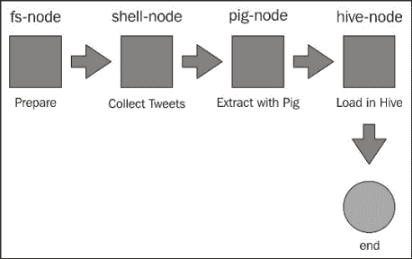
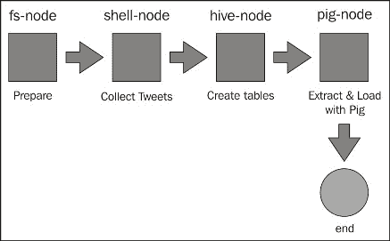
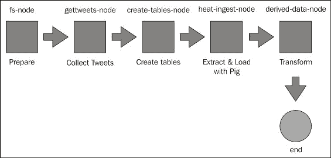
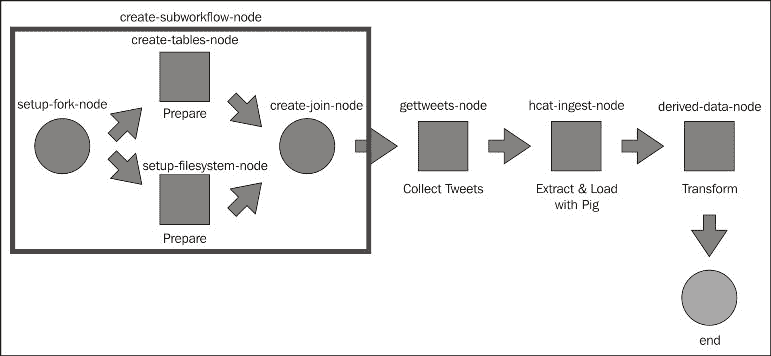

# 八、数据生命周期管理

我们前面的章节非常关注技术，描述了特定的工具或技术以及如何使用它们。 在本章和下一章中，我们将采取更自上而下的方法，描述您可能遇到的问题空间，然后探索如何解决它。 我们将特别介绍以下主题：

*   我们所说的术语数据生命周期管理的含义是什么
*   为什么需要考虑数据生命周期管理
*   可用于解决问题的工具类别
*   如何使用这些工具构建 Twitter 情绪分析管道的前半部分

# 什么是数据生命周期管理

数据不只存在于某个时间点。 特别是对于长期运行的生产工作流，您可能会在 Hadoop 集群中获取大量数据。 需求很少会长时间保持不变，因此除了新逻辑之外，您可能还会看到该数据的格式发生了变化，或者需要使用多个数据源来提供在应用中处理的数据集。 我们使用术语**数据生命周期管理**来描述一种处理数据收集、存储和转换的方法，该方法可确保数据处于需要的位置，采用其需要的格式，并允许数据和系统随时间演变。

## 数据生命周期管理的重要性

如果构建数据处理应用，则根据定义，您依赖于处理的数据。 正如我们考虑应用和系统的可靠性一样，有必要确保数据也是生产就绪的。

在某些情况下，需要将数据吸收到 Hadoop 中。 它是企业的一部分，通常与外部系统有多个集成点。 如果来自这些系统的数据获取不可靠，则对处理该数据的作业的影响通常与重大系统故障一样具有破坏性。 数据接收成为本身的一个关键组件。 当我们说摄取需要可靠时，我们不仅仅是指数据正在到达；它还必须以一种可用的格式到达，并通过一种能够处理随时间演变的机制。

其中许多问题的问题在于，除非流量很大，系统很关键，而且任何问题的业务影响都不是微不足道的，否则它们不会以显著的方式出现。 对于不太关键的数据流有效的临时方法通常不会进行扩展，但在活动系统上进行替换会非常痛苦。

## 帮助工具

但是不要惊慌！ 有许多类别的工具可以帮助解决数据生命周期管理问题。 在本章中，我们将提供以下三大类别的示例：

*   **编排服务**：构建接收管道通常有多个独立的阶段，我们将使用编排工具来描述、执行和管理这些阶段
*   **连接器**：鉴于与外部系统集成的重要性，我们将了解如何使用连接器来简化 Hadoop 存储提供的抽象
*   **文件格式**：我们存储数据的方式会影响我们管理格式随时间演变的方式，有几种丰富的存储格式可以支持这一点

# 构建推文分析能力

在前面的章节中，我们使用了 Twitter 数据分析的各种实现来描述几个概念。 我们将把这一能力推向更深层次，并将其作为一个主要案例进行研究。

在本章中，我们将构建一条数据接收管道，构建一个在设计时考虑到可靠性和未来发展的生产就绪数据流。

我们将在本章中逐步构建管道。 在每个阶段，我们将强调哪些内容发生了变化，但不能在没有将章的大小增加两倍的情况下包含每个阶段的完整清单。 然而，本章的源代码包含了每一次迭代的全部内容。

## 获取推文数据

我们需要做的第一件事是获取实际的 tweet 数据。 与前面的示例一样，我们可以将`-j`和`-n`参数传递给`stream.py`，以将 JSON tweet 转储到 stdout：

```scala
$ stream.py -j -n 10000 > tweets.json

```

因为我们有这个工具可以按需创建一批示例 tweet，所以我们可以通过定期运行此作业来开始我们的接收管道。 但如何做到呢？

## 介绍 Oozie

当然，我们可以将块放在一起，并使用类似 cron 的东西来进行简单的作业调度，但请记住，我们需要一个考虑到可靠性的接收管道。 因此，我们非常需要一种可以用来检测故障并以其他方式响应异常情况的调度工具。

我们将在这里使用的工具是 Oozie([Hadoop](http://oozie.apache.org))，这是一个关注 http://oozie.apache.org 生态系统的工作流引擎和调度器。

Oozie 提供了一种将工作流定义为一系列节点的方法，这些节点具有可配置的参数和从一个节点到下一个节点的受控转换。 它是作为 Cloudera QuickStart VM 的一部分安装的，主命令行客户机名为`oozie`，这并不奇怪。

### 备注

我们已经针对 Cloudera QuickStart VM 的 5.0 版本测试了本章中的工作流，在撰写 Oozie 的最新版本 5.1 时，它存在一些问题。 然而，我们的工作流中没有特定于版本的东西，因此它们应该与任何正确工作的 Ooziev4 实现兼容。

虽然 Oozie 功能强大且灵活，但它可能需要一点时间才能适应，所以我们将举几个例子，并描述我们在此过程中正在做些什么。

Oozie 工作流中最常见的节点是操作。 在动作节点中实际执行工作流的步骤；其他节点类型在决策、并行性和故障检测方面处理工作流的管理。 Oozie 可以执行多种类型的操作。 其中之一是 shell 操作，它可用于在系统上执行任何命令，例如本机二进制文件、shell 脚本或任何其他命令行实用程序。 让我们创建一个脚本来生成 tweet 文件，并将其复制到 HDFS：

```scala
set -e
source twitter.keys
python stream.py -j -n 500 > /tmp/tweets.out
hdfs dfs -put /tmp/tweets.out /tmp/tweets/tweets.out
rm -f /tmp/tweets.out
```

请注意，如果包含的任何命令失败，第一行将导致整个脚本失败。 我们使用环境文件为`twitter.keys`中的脚本提供 Twitter 密钥，其格式如下：

```scala
export TWITTER_CONSUMER_KEY=<value>
export TWITTER_CONSUMER_SECRET=<value>
export TWITTER_ACCESS_KEY=<value> 
export TWITTER_ACCESS_SECRET=<value>
```

Oozie 使用 XML 描述其工作流，通常存储在名为`workflow.xml`的文件中。 让我们来看看调用 shell 命令的 Oozie 工作流的定义。

Oozie 工作流的模式称为**Workflow-app**，我们可以为该工作流指定一个特定的名称。 在 CLI 或 Oozie Web 用户界面中查看作业历史记录时，这很有用。 在本书的示例中，我们将使用递增的版本号，以便更容易地分离源库中的迭代。 下面是我们为工作流应用指定特定名称的方式：

```scala
<workflow-app  name="v1">
```

Oozie 工作流由一系列相连的节点组成，每个节点代表流程中的一个步骤，并由工作流定义中的 XML 节点表示。 Oozie 有许多节点处理工作流从一个步骤到下一个步骤的过渡。 其中第一个节点是 Start 节点，它只说明要作为工作流一部分执行的第一个节点的名称，如下所示：

```scala
    <start to="fs-node"/>
```

然后，我们就有了命名开始节点的定义。 在本例中，它是一个动作节点，它是实际执行某些处理的大多数 Oozie 节点的泛型节点类型，如下所示：

```scala
    <action name="fs-node">
```

Action 是一个广泛的节点类别，然后我们通常会对它进行专门化，并针对此给定节点进行特定处理。 在本例中，我们使用 fs 节点类型，它允许我们执行文件系统操作：

```scala
    <fs>
```

我们希望确保要将 tweet 数据文件复制到的 HDFS 上的目录存在、为空，并且具有适当的权限。 为此，我们尝试删除目录(如果存在)，然后创建它，最后应用所需的权限，如下所示：

```scala
    <delete path="${nameNode}/tmp/tweets"/>
    <mkdir path="${nameNode}/tmp/tweets"/>
    <chmod path="${nameNode}/tmp/tweets" permissions="777"/>
    </fs>
```

稍后我们将看到另一种设置目录的方法。 执行完节点的功能后，Oozie 需要知道如何继续工作流。 在大多数情况下，如果此节点成功，这将包括移动到另一个操作节点，否则将中止工作流。 这是由下面的元素指定的。 Ok 节点给出执行成功时要转换到的节点的名称；错误节点为失败情况命名目标节点。 下面是 OK 和 FAIL 节点的使用方式：

```scala
    <ok to="shell-node"/>
    <error to="fail"/>
    </action>
    <action name="shell-node">
```

第二个操作节点再次使用其特定的处理类型进行专门化；在本例中，我们有一个 shell 节点：

```scala
<shell >
```

然后，shell 操作将指定 Hadoop JobTracker 和 NameNode 位置。 请注意，实际值是由变量给出的；我们稍后将解释它们的来源。 JobTracker 和 NameNode 指定如下：

```scala
            <job-tracker>${jobTracker}</job-tracker>
            <name-node>${nameNode}</name-node>
```

正如在[第 3 章](03.html "Chapter 3. Processing – MapReduce and Beyond")，*Processing-MapReduce 和 Beyond*中提到的，MapReduce 使用多个队列为不同的资源调度方法提供支持。 下一个元素指定工作流应该提交到的 MapReduce 队列：

```scala
             <configuration>
                <property>
                    <name>mapred.job.queue.name</name>
                    <value>${queueName}</value>
                </property>
             </configuration>
```

现在 shell 节点已完全配置，我们可以再次通过变量指定要调用的命令，如下所示：

```scala
              <exec>${EXEC}</exec>
```

Oozie 工作流的各个步骤作为 MapReduce 作业执行。 因此，此 shell 操作将作为特定 TaskTracker 上的特定任务实例执行。 因此，在执行操作之前，我们需要指定需要将哪些文件复制到 TaskTracker 计算机上的本地工作目录。 在本例中，我们需要复制主 shell 脚本、Python tweet 生成器和 Twitter 配置文件，如下所示：

```scala
<file>${workflowRoot}/${EXEC}</file>
<file>${workflowRoot}/twitter.keys</file>
<file>${workflowRoot}/stream.py</file>
```

关闭 shell 元素后，根据操作是否成功完成，我们再次指定要执行的操作。 由于 MapReduce 用于作业执行，因此根据定义，大多数节点类型都有内置的重试和恢复逻辑，尽管 shell 节点并非如此：

```scala
       </shell>
      <ok to="end"/>
      <error to="fail"/>
</action>
```

如果工作流失败，我们就在这种情况下终止它。 `kill`节点类型就是这样做的-终止工作流，使其无法继续执行任何进一步的步骤，通常会在此过程中记录错误消息。 下面是`kill`节点类型的使用方法：

```scala
<kill name="fail">
   <message>Shell action failed, error message[${wf:errorMessage(wf:lastErrorNode())}]</message>
</kill>
```

另一方面，`end`节点只是暂停工作流，并将其记录为在 Oozie 中成功完成：

```scala
   <end name="end"/>
</workflow-app>
```

显而易见的问题是，前面的变量代表什么，它们从哪里获得具体的值。 前面的变量是通常称为 EL 的 Oozie 表达式语言的示例。

除了描述流中步骤的工作流定义文件(`workflow.xml`)之外，我们还需要创建一个配置文件，该文件为给定的工作流执行提供特定值。 这种功能和配置的分离使我们可以编写可在不同集群、不同文件位置或不同变量值上使用的工作流，而不必重新创建工作流本身。 按照惯例，此文件通常命名为`job.properties`。 对于前面的工作流，这里有一个示例`job.properties`文件。

首先，我们指定要向其提交工作流的 JobTracker、NameNode 和 MapReduce 队列的位置。 以下操作应该可以在 Cloudera 5.0 QuickStart VM 上运行，尽管在 5.1 版中，主机名已更改为`quickstart.cloudera`。 重要的是，指定的 NameNode 和 JobTracker 地址需要在 Oozie 白名单中-VM 上的本地服务是自动添加的：

```scala
jobTracker=localhost.localdomain:8032
nameNode=hdfs://localhost.localdomain:8020
queueName=default
```

接下来，我们为工作流定义和相关文件在 HDFS 文件系统上的位置设置一些值。 请注意，使用了表示运行作业的用户名的变量。 这允许将单个工作流应用于不同的路径，具体取决于提交用户，如下所示：

```scala
tasksRoot=book
workflowRoot=${nameNode}/user/${user.name}/${tasksRoot}/v1
oozie.wf.application.path=${nameNode}/user/${user.name}/${tasksRoot}/v1
```

接下来，我们将工作流中要执行的命令命名为`${EXEC}`：

```scala
EXEC=gettweets.sh
```

更复杂的工作流将需要`job.properties`文件中的其他条目；前面的工作流非常简单。

`oozie`命令行工具需要知道 Oozie 服务器在哪里运行。 这可以作为参数添加到每个 Oozie shell 命令中，但很快就会变得很笨拙。 相反，您可以设置 shell 环境变量，如下所示：

```scala
$ export OOZIE_URL='http://localhost:11000/oozie'

```

完成所有这些工作之后，我们现在可以实际运行 Oozie 工作流了。 按照`job.properties`文件中的值中指定的方式在 HDFS 上创建一个目录。 在前面的命令中，我们将在 HDFS 上的主目录下将其创建为`book/v1`。 将`stream.py`、`gettweets.sh`和`twitter.properties`文件复制到该目录；这些文件是执行 shell 命令实际执行所需的文件。 然后，将`workflow.xml`文件添加到同一目录。

然后，要运行工作流，我们需要执行以下操作：

```scala
$ oozie job -run -config <path-to-job.properties>

```

如果提交成功，Oozie 会将作业名称打印到屏幕上。 您可以使用以下命令查看此工作流的当前状态：

```scala
$ oozie job -info <job-id>

```

您还可以检查作业的日志：

```scala
$ oozie job -log <job-id> 

```

此外，可以使用以下命令查看所有当前和最近的职务：

```scala
$ oozie jobs 

```

### 关于 HDFS 文件权限的说明

Shell 命令中有一个微妙的方面，可以捕捉粗心大意的人。 作为拥有`fs`节点的替代方案，我们可以在 shell 节点中包含一个准备元素，以便在文件系统上创建所需的目录。 它将如下所示：

```scala
<prepare>
     <mkdir path="${nameNode}/tmp/tweets"/>
</prepare>
```

准备阶段由提交工作流的用户执行，但由于实际脚本执行是在 Yarn 上执行的，因此通常以 Yarn 用户的身份执行。 您可能会遇到这样的问题：脚本生成 tweet，在 HDFS 上创建`/tmp/tweets`目录，但脚本随后无法拥有写入该目录的权限。 您可以通过更精确地分配权限来解决这个问题，或者，如前所述，您可以添加一个文件系统节点来封装所需的操作。 在本章中，我们将混合使用这两种技术；对于非 shell 节点，我们将使用 Prepare 元素，特别是当所需的目录仅由该节点操作时。 对于涉及 shell 节点的情况，或者创建的目录将跨多个节点使用的情况，我们将安全地使用更显式的`fs`节点。

### 让开发变得更容易

在开发期间管理 Oozie 作业的文件和资源有时会变得很笨拙。 有些文件需要在 HDFS 上，而有些文件需要在本地，对某些文件的更改需要对其他文件进行更改。 最简单的方法通常是开发或更改本地文件系统上的工作流目录的完整克隆，并将更改从那里推送到 HDFS 中名称相似的目录，当然，不要忘记要确保所有更改都在修订控制之下！ 对于工作流的操作执行，`job.properties`文件是唯一需要位于本地文件系统上的文件，反之，所有其他文件都需要位于 HDFS 上。 请始终记住这一点：对工作流的本地副本进行更改、忘记将更改推送到 HDFS、然后弄不清工作流为什么没有反映这些更改太容易了。

### 提取数据并摄取到 Hive 中

有了个 HDFS 上的数据，我们现在可以为条 tweet 和用户提取单独的数据集，并像前几章一样放置数据。 我们可以重用`extract_for_hive.pig`将原始 tweet JSON 解析成单独的文件，再次将它们存储在 HDFS 上，然后执行一个配置单元步骤，该步骤将这些新文件摄取到配置单元表中，以获取 tweet、用户和地点。

要在 Oozie 中做到这一点，我们需要在工作流中添加两个新节点，第一步的 Pig 操作和第二步的 Have 操作。

对于我们的配置单元操作，我们只创建三个指向 Pig 生成的文件的外部表。 然后，这将允许我们遵循前面描述的摄取临时表或外部表的模型，并使用 HiveQL`INSERT`语句从临时表或外部表中插入可操作的(通常是分区的)表。 此`create.hql`脚本可以在[https://github.com/learninghadoop2/book-examples/blob/master/ch8/v2/hive/create.hql](https://github.com/learninghadoop2/book-examples/blob/master/ch8/v2/hive/create.hql)中找到，但其形式如下所示：

```scala
CREATE DATABASE IF NOT EXISTS twttr ;
USE twttr;
DROP TABLE IF EXISTS tweets;
CREATE EXTERNAL TABLE tweets (
...
) ROW FORMAT DELIMITED
FIELDS TERMINATED BY '\u0001'
STORED AS TEXTFILE
LOCATION '${ingestDir}/tweets';

DROP TABLE IF EXISTS user;
CREATE EXTERNAL TABLE user (
...
) ROW FORMAT DELIMITED
FIELDS TERMINATED BY '\u0001'
STORED AS TEXTFILE
LOCATION '${ingestDir}/users';

DROP TABLE IF EXISTS place;
CREATE EXTERNAL TABLE place (
...
) ROW FORMAT DELIMITED
FIELDS TERMINATED BY '\u0001'
STORED AS TEXTFILE
LOCATION '${ingestDir}/places';
```

请注意，每个表上的文件分隔符也被显式设置为与我们从 Pig 输出的内容相匹配。 除了之外，两个脚本中的位置都由变量指定，我们将在`job.properties`文件中为这些变量提供具体的值。

使用前面的语句，我们可以为在源代码中找到的工作流创建 Pig 节点，作为管道的 v2。 节点定义的大部分看起来与前面使用的 shell 节点类似，因为我们设置了相同的配置元素；还要注意我们使用`prepare`元素创建所需的输出目录。 我们可以为工作流创建 Pig 节点，如以下`action`所示：

```scala
<action name="pig-node">
   <pig>
       <job-tracker>${jobTracker}</job-tracker>
       <name-node>${nameNode}</name-node>
       <prepare>
           <delete path="${nameNode}/${outputDir}"/>
           <mkdir path="${nameNode}/${outputDir}"/>
       </prepare>
       <configuration>
           <property>
               <name>mapred.job.queue.name</name>
               <value>${queueName}</value>
           </property>
       </configuration>
```

与 shell 命令类似，我们需要告诉 Pig 操作实际 Pig 脚本的位置。 这在以下`script`元素中指定：

```scala
          <script>${workflowRoot}/pig/extract_for_hive.pig</script>
```

我们还需要修改用于调用 Pig 脚本的命令行，以添加个参数。 以下元素执行此操作；请注意构造模式，其中一个元素添加实际参数名称，下一个元素添加其值(我们将在下一节中看到另一种传递参数的机制)：

```scala
       <argument>-param</argument>
       <argument>inputDir=${inputDir}</argument>
       <argument>-param</argument>
       <argument>outputDir=${outputDir}</argument>
  </pig>
```

由于我们要从此步骤移至配置单元节点，因此需要适当设置以下元素：

```scala
       <ok to="hive-node"/>
       <error to="fail"/>
   </action>
```

配置单元操作本身与前面的节点略有不同；尽管它以类似的方式启动，但它指定了特定于配置单元操作的命名空间，如下所示：

```scala
<action name="hive-node">
       <hive >
        <job-tracker>${jobTracker}</job-tracker>
        <name-node>${nameNode}</name-node>
```

配置单元操作需要配置单元本身使用的许多配置元素，并且在大多数情况下，我们将`hive-site.xml`文件复制到工作流目录并指定其位置，如以下 XML 所示；请注意，此机制不是配置单元特定的，也可用于自定义操作：

```scala
        <job-xml>${workflowRoot}/hive-site.xml</job-xml>
```

此外，我们可能需要覆盖某些 MapReduce 默认配置属性，如以下 XML 所示，其中我们指定作业应使用中间压缩：

```scala
        <configuration>
             <property>
                 <name>mapred.compress.map.output</name>
                 <value>true</value>
             </property>
        </configuration>
```

配置配置单元环境后，我们现在指定配置单元脚本的位置：

```scala
        <script>${workflowRoot}/hive/create.hql</script>
```

我们还让到提供将参数传递给配置单元脚本的机制。 但是，我们不是一次构建一个组件的命令行，而是添加将`job.properties`文件中的配置元素名称映射到配置单元脚本中指定的变量的`param`元素；Pig 操作也支持此机制：

```scala
        <param>dbName=${dbName}</param>
        <param>ingestDir=${ingestDir}</param>
   </hive>
```

然后，Hive 节点与其他节点一样关闭，如下所示：

```scala
     <ok to="end"/>
     <error to="fail"/>
</action>
```

我们现在需要将所有这些放在一起，以便在 Oozie 中运行多阶段工作流。 完整的`workflow.xml`文件可在[https://github.com/learninghadoop2/book-examples/tree/master/ch8/v2](https://github.com/learninghadoop2/book-examples/tree/master/ch8/v2)中找到，工作流程如下图所示：



数据接收工作流 v2

此工作流执行前面讨论的所有步骤；它生成 tweet 数据，通过 Pig 提取数据子集，然后将这些数据摄取到配置单元中。

### 关于工作流目录结构的说明

我们现在的工作流目录中有相当多的文件，最好采用一些结构和命名约定。 对于当前工作流，我们在 HDFS 上的目录如下所示：

```scala
/hive/
/hive/create.hql
/lib/
/pig/
/pig/extract_for_hive.pig
/scripts/
/scripts/gettweets.sh
/scripts/stream-json-batch.py
/scripts/twitter-keys
/hive-site.xml
/job.properties
/workflow.xml
```

我们遵循的模型是将配置文件保存在顶级目录中，但将与给定操作类型相关的文件保存在专用子目录中。 请注意，拥有一个`lib`目录是很有用的，即使它是空的，因为有些节点类型会查找它。

使用前面的结构，我们组合作业的`job.properties`文件现在如下所示：

```scala
jobTracker=localhost.localdomain:8032
nameNode=hdfs://localhost.localdomain:8020
queueName=default
tasksRoot=book

workflowRoot=${nameNode}/user/${user.name}/${tasksRoot}/v2
oozie.wf.application.path=${nameNode}/user/${user.name}/${tasksRoot}/v2
oozie.use.system.libpath=true
EXEC=gettweets.sh
inputDir=/tmp/tweets
outputDir=/tmp/tweetdata
ingestDir=/tmp/tweetdata
dbName=twttr
```

在前面的代码中，我们已经完全更新了`workflow.xml`定义，以包含到目前为止描述的所有步骤-包括创建所需目录的初始`fs`节点，而无需担心用户权限。

### HCatalog 简介

如果我们看看我们当前的工作流程，我们如何使用 HDFS 作为 Pig 和 Have 之间的接口是低效的。 我们需要将 Pig 脚本的结果输出到 HDFS 上，然后配置单元脚本可以将其用作一些新表的位置。 这突出表明，将数据存储在配置单元中通常非常有用，但这是有限的，因为很少有工具(主要是配置单元)可以访问配置单元元存储，从而读取和写入此类数据。 仔细想想，Hive 有两个主要层：用于访问和操作其数据的工具，以及对该数据运行查询的执行框架。

Hive 的 HCatalog 子项目有效地提供了这些层中第一层的独立实现-访问和操作 Hive 转储中的数据的方法。 HCatalog 为其他工具(如 Pig 和 MapReduce)提供了本机读写存储在 HDFS 上的表结构数据的机制。

当然，请记住，数据以一种或另一种格式存储在 HDFS 上。 配置单元元存储提供了将这些文件抽象到配置单元熟悉的关系表结构中的模型。 因此，当我们说我们在 HCatalog 中存储数据时，我们真正的意思是我们在 HDFS 上存储数据，这样这些数据就可以通过配置单元元存储中指定的表结构公开。 相反，当我们提到配置单元数据时，我们真正指的是其元数据存储在配置单元元数据中，并且可以由任何元数据感知工具(如 HCatalog)访问的数据。

#### 使用 HCatalog

HCatalog 命令行工具称为**HCAT**，它将预装在 Cloudera QuickStart VM 上-实际上，它与任何 0.11 以后的配置单元版本一起安装。

`hcat`实用程序没有交互模式，因此通常将其与显式命令行参数一起使用，或者将其指向命令文件，如下所示：

```scala
$ hcat –e "use default; show tables"
$ hcat –f commands.hql

```

尽管 HCAT 工具很有用并且可以合并到脚本中，但是对于我们这里的目的来说，HCatalog 更有趣的元素是它与 Pig 的集成。 HCatalog 定义了一个名为`HCatLoader`的新 Pig 加载器和一个名为`HCatStorer`的存储器。 顾名思义，它们允许 Pig 脚本直接读取或写入配置单元表。 我们可以使用此机制将 Oozie 工作流中以前的 Pig 和 Have 操作替换为一个基于 HCatalog 的 Pig 操作，该操作将 Pig 作业的输出直接写入到 Have 中的表中。

为清楚起见，我们将创建名为`tweets_hcat`、`places_hcat`和`users_hcat`的新表，并将此数据插入其中；请注意，这些表不再是外部表：

```scala
CREATE TABLE tweets_hcat… 
CREATE TABLE places_hcat …
CREATE TABLE users_hcat …
```

请注意，如果脚本文件中包含这些命令，则可以使用 HCAT CLI 工具执行它们，如下所示：

```scala
$ hcat –f create.hql

```

然而，HCAT CLI 工具没有提供类似于配置单元 CLI 的交互式 shell。 我们现在可以使用前面的 Pig 脚本，只需要更改存储命令，用`HCatStorer`替换`PigStorage`。 因此，我们更新的 Pig 脚本`extract_to_hcat.pig`包括如下`store`命令：

```scala
store tweets_tsv into 'twttr.tweets_hcat' using org.apache.hive.hcatalog.pig.HCatStorer();
```

注意，`HCatStorer`类的包名有`org.apache.hive.hcatalog`前缀；当 HCatalog 在 Apache 孵化器中时，它使用`org.apache.hcatalog`作为它的包前缀。 这个旧的表单现在已经过时了，应该使用显式地将 HCatalog 显示为配置单元的子项目的新表单。

有了这个新的 Pig 脚本，我们现在可以使用 HCatalog 将以前的 Pig 和 Have 操作替换为更新后的 Pig 操作。 这还需要首次使用 oozie sharelib，我们将在下一节讨论这一点。 在我们的工作流定义中，此操作的`pig`元素的定义如以下 XML 所示，并且可以在源包中找到作为管道的 v3；在 v3 中，我们还添加了一个实用工具配置单元节点，以在 Pig 节点之前运行，以确保在执行需要它们的 Pig 脚本之前，所有必需的表都已存在。

```scala
<pig>
   <job-tracker>${jobTracker}</job-tracker>
   <name-node>${nameNode}</name-node>
   <job-xml>${workflowRoot}/hive-site.xml</job-xml>
    <configuration>
          <property>
              <name>mapred.job.queue.name</name>
              <value>${queueName}</value>
          </property>
          <property>
             <name>oozie.action.sharelib.for.pig</name>
             <value>pig,hcatalog</value>
          </property>
    </configuration>
    <script>${workflowRoot}/pig/extract_to_hcat.pig
    </script>
    <argument>-param</argument>
    <argument>inputDir=${inputDir}</argument>
</pig>
```

值得注意的两个更改是添加了对`hive-site.xml`文件的显式引用；这是 HCatalog 所必需的，以及新的配置元素，它告诉 Oozie 包含所需的`HCatalog`jar。

### Oozie Sharelib

上一次添加的涉及到我们到目前为止还没有提到的 Oozie 的一个重要方面：Oozie`sharelib`。 当 Oozie 运行其所有不同的操作类型时，它需要多个 JAR 来访问 Hadoop 并调用各种工具，如 Have 和 Pig。 作为 Oozie 安装的一部分，已经在 HDFS 上放置了大量依赖 JAR，供 Oozie 及其各种操作类型使用：这就是 Oozie`sharelib`。

对于 Oozie 的大多数用法，只要知道`sharelib`存在就足够了，通常在`/user/oozie/share/lib on HDFS`下，当需要添加一些显式配置值时(如前面的示例所示)。 当使用 Pig 操作时，Pig Jars 将被自动拾取，但是当 Pig 脚本使用诸如 HCatalog 之类的东西时，Oozie 将不会显式知道此依赖项。

Oozie CLI 允许操作`sharelib`，尽管需要这样做的场景超出了本书的范围。 不过，要查看 oozie`sharelib`中包含哪些组件，以下命令可能很有用：

```scala
$ oozie admin -shareliblist

```

以下命令可用于查看包含`sharelib`中特定组件的各个 JAR，在本例中为 HCatalog：

```scala
$ oozie admin -shareliblist hcat

```

这些命令可用于验证是否包含了所需的 JAR，以及查看正在使用的特定版本。

### HCatalog 和分区表

如果您第二次重新运行上一个工作流，它将失败；深入查看日志，您将看到 HCatalog 抱怨它无法写入已包含数据的表。 这是 HCatalog 的当前限制；默认情况下，它将表和表中的分区视为不可变的。 另一方面，HIVE 将向表或分区添加新数据；它的默认表视图是可变的。

对配置单元和 HCatalog 即将进行的更改将看到一个新表属性的支持，该属性将在这两个工具中控制此行为；例如，添加到表定义中的以下内容将允许像现在的配置单元中支持的那样追加表格：

```scala
TBLPROPERTIES("immutable"="false")
```

不过，目前在配置单元和 HCatalog 的发货版本中不可用。 对于向表中添加越来越多数据的工作流来说，我们因此需要为每次新运行的工作流创建一个新分区。 我们在管道的 v4 中进行了这些更改，首先使用整数分区键重新创建表，如下所示：

```scala
CREATE  TABLE tweets_hcat (
…)
PARTITIONED BY (partition_key int)
ROW FORMAT DELIMITED
  FIELDS TERMINATED BY '\u0001'
STORED AS SEQUENCEFILE;

CREATE  TABLE `places_hcat`(
… )
partitioned by(partition_key int)
ROW FORMAT DELIMITED
  FIELDS TERMINATED BY '\u0001'
STORED AS SEQUENCEFILE
TBLPROPERTIES("immutable"="false") ;

CREATE  TABLE `users_hcat`(
…)
partitioned by(partition_key int)
ROW FORMAT DELIMITED
  FIELDS TERMINATED BY '\u0001'
STORED AS SEQUENCEFILE
TBLPROPERTIES("immutable"="false") ;
```

Pig`HCatStorer`采用可选的分区定义，我们相应地修改了 Pig 脚本中的`store`语句；例如：

```scala
store tweets_tsv into 'twttr.tweets_hcat' 
using org.apache.hive.hcatalog.pig.HCatStorer(
'partition_key=$partitionKey');
```

然后，我们修改`workflow.xml`文件中的 Pig 操作，以包括此附加参数：

```scala
<script>${workflowRoot}/pig/extract_to_hcat.pig</script>
          <param>inputDir=${inputDir}</param>
          <param>partitionKey=${partitionKey}</param>
```

那么问题就是我们如何将此分区键传递给工作流。 我们可以在`job.properties`文件中指定它，但这样做会遇到在下一次重新运行时尝试写入现有分区的相同问题。



摄取工作流 v4

目前，我们将把它作为显式参数传递给 Oozie CLI 的调用，稍后再探索更好的方法：

```scala
$ oozie job –run –config v4/job.properties –DpartitionKey=12345

```

### 备注

请注意，此行为的后果是使用相同参数重新运行 HCAT 工作流将失败。 在测试工作流或使用本书中的示例代码时，请注意这一点。

## 生成派生数据

既然我们已经建立了主数据管道，那么在添加每个新的个附加数据集之后，我们很可能希望采取一系列操作。 作为一个简单的例子，请注意，使用我们前面的机制将每组用户数据添加到单独的分区，`users_hcat`表将多次包含用户。 让我们为唯一用户创建一个新表，并在每次添加新用户数据时重新生成该表。

请注意，考虑到前面提到的 HCatalog 的限制，我们将使用一个配置单元操作来实现此目的，因为我们需要替换表中的数据。

首先，我们将为唯一用户信息创建一个新表，如下所示：

```scala
CREATE TABLE IF NOT EXISTS `unique_users`(
  `user_id` string ,
  `name` string ,
  `description` string ,
  `screen_name` string )
ROW FORMAT DELIMITED
  FIELDS TERMINATED BY '\t'
STORED AS sequencefile ;
```

在该表中，我们将只存储从不更改(ID)或很少更改(屏幕名称等)的用户属性。 然后，我们可以编写一条简单的配置单元语句，从完整的`users_hcat`表填充此表：

```scala
USE twttr;
INSERT OVERWRITE TABLE unique_users
SELECT DISTINCT user_id, name, description, screen_name
FROM users_hcat;
```

然后，我们可以在工作流中的上一个 Pig 节点之后添加一个附加的配置单元操作节点。 在执行此操作时，我们发现简单地给节点命名(如 hive-node)的模式不是一个好主意，因为我们现在有两个基于配置单元的节点。 在工作流的 v5 中，我们添加了此新节点，并将节点更改为更具描述性的名称：



摄取工作流 v5

### 并行执行多个动作

我们的工作流有两种类型的活动：初始化文件系统和配置单元表的节点的初始设置，以及执行实际处理的功能节点。 如果我们看一下我们一直在使用的两个设置节点，很明显它们是完全不同的，并且不是相互依赖的。 因此，我们可以利用称为`fork`和`join`节点的 Oozie 特性来并行执行这些操作。 现在，我们的`workflow.xml`文件的开头变为：

```scala
 <start to="setup-fork-node"/>
```

Oozie`fork`节点包含许多`path`元素，每个元素指定一个起始节点。 其中每一项都将并行推出：

```scala
<fork name="setup-fork-node">
   <path start="setup-filesystem-node" />
   <path start="create-tables-node" />
</fork>
```

指定的每个操作节点与我们以前使用的任何操作节点都没有什么不同。 动作节点可以链接到一系列其他节点；唯一的要求是每个并行的动作系列必须转换到与`fork`节点关联的`join`节点，如下所示：

```scala
    <action name="setup-filesystem-node">
…
        <ok to="setup-join-node"/>
        <error to="fail"/>
    </action>
    <action name="create-tables-node">
…
        <ok to="setup-join-node"/>
        <error to="fail"/>
    </action>
```

`join`节点本身充当协调点；任何已完成的工作流都将等待，直到`fork`节点中指定的所有路径都到达该点。 此时，工作流在`join`节点内指定的节点处继续。 下面是`join`节点的使用方法：

```scala
<join name="create-join-node" to="gettweets-node"/>
```

在前面的代码中，出于空间目的我们省略了操作定义，但完整的工作流定义在 V6 中：


摄取工作流 v6

### 调用子工作流

尽管`fork/join`机制使并行操作的过程更加高效，但如果我们在主`workflow.xml`定义中包含它，它仍然会增加大量的冗长。 从概念上讲，我们有一系列操作来执行工作流所需的相关任务，但不一定是工作流的一部分。 对于这种情况和类似情况，Oozie 提供了调用子工作流的能力。 父工作流将执行子工作流并等待其完成，并能够将配置元素从一个工作流传递到另一个工作流。

子工作流本身将是一个完整的工作流，通常存储在 HDFS 上的一个目录中，该目录具有我们期望的工作流、主`workflow.xml`文件以及任何所需的配置单元、PIG 或类似文件的所有常见结构。

我们可以在 HDFS 上创建一个名为 Setup-Workflow 的新目录，并在其中创建文件系统和配置单元创建操作所需的文件。 子工作流配置文件如下所示：

```scala
<workflow-app  name="create-workflow">
    <start to="setup-fork-node"/>
    <fork name="setup-fork-node">
          <path start="setup-filesystem-node" />
      <path start="create-tables-node" />
    </fork>
    <action name="setup-filesystem-node">
    …
    </action>
    <action name="create-tables-node">
    …
    </action>
    <join name="create-join-node" to="end"/>
    <kill name="fail">
        <message>Action failed, error message[${wf:errorMessage(wf:lastErrorNode())}]</message>
    </kill>
    <end name="end"/>
</workflow-app>
```

定义了此子工作流后，我们将修改主工作流的第一个节点以使用子工作流节点，如下所示：

```scala
    <start to="create-subworkflow-node"/>
    <action name="create-subworkflow-node">
        <sub-workflow>
            <app-path>${subWorkflowRoot}</app-path>
            <propagate-configuration/>
        </sub-workflow>
        <ok to="gettweets-node"/>
        <error to="fail"/>
    </action>
```

我们将在父工作流的`job.properties`中指定`subWorkflowPath`，`propagate-configuration`元素将父工作流的配置传递给子工作流。

### 添加全局设置

通过将实用程序节点提取到子工作流中，我们可以显著减少主工作流定义中的混乱和复杂性。 在我们的接收管道的 v7 中，我们将进行一个额外的简化，并添加一个全局配置部分，如下所示：

```scala
<workflow-app  name="v7">
    <global>
            <job-tracker>${jobTracker}</job-tracker>
            <name-node>${nameNode}</name-node>
            <job-xml>${workflowRoot}/hive-site.xml</job-xml>
            <configuration>
                <property>
                    <name>mapred.job.queue.name</name>
                    <value>${queueName}</value>
                </property>
            </configuration>
</global>
<start to="create-subworkflow-node"/>
```

通过添加此全局配置节，我们无需在剩余工作流中的配置单元和 PIG 节点中指定任何这些值(请注意，当前外壳节点不支持全局配置机制)。 这可以极大地简化我们的一些节点；例如，我们的 Pig 节点现在如下所示：

```scala
<action name="hcat-ingest-node">
   <pig>
     <configuration>
       <property>
         <name>oozie.action.sharelib.for.pig</name>
         <value>pig,hcatalog</value>
         </property>
       </configuration>
       <script>${workflowRoot}/pig/extract_to_hcat.pig</script>
          <param>inputDir=${inputDir}</param>
          <param>dbName=${dbName}</param>
          <param>partitionKey=${partitionKey}</param>
   </pig>
   <ok to="derived-data-node"/>
   <error to="fail"/>
</action>
```

可以看到，我们可以添加额外的配置元素，或者实际上覆盖全局部分中指定的配置元素，从而产生更加清晰的操作定义，只关注特定于相关操作的信息。 我们的 Workflow v7 既添加了全局部分，又添加子工作流，这显著提高了工作流的可读性：



摄取工作流 v7

# 外部数据的挑战

当我们依赖外部数据来驱动我们的应用时，我们隐含地依赖于该数据的质量和稳定性。 当然，对于任何数据都是如此，但是当数据是由我们无法控制的外部源生成时，风险很可能更高。 无论如何，当我们在这些数据馈送的基础上构建我们期望的可靠应用时，特别是当我们的数据量增长时，我们需要考虑如何降低这些风险。

## 数据验证

我们使用通用术语数据验证来指代确保传入数据符合我们的期望的行为，并潜在地应用标准化来相应地修改它，甚至删除格式错误或损坏的输入。 这实际上涉及的将是非常特定的应用。 在某些情况下，重要的是确保系统只接收符合给定的准确或干净定义的数据。 对于我们的 tweet 数据，我们不关心每一条记录，可以很容易地采用一种策略，比如删除在我们关心的特定字段中没有值的记录。 但是，对于其他应用，必须捕获每条输入记录，这可能会驱动逻辑的实现，以重新格式化每条记录，以确保其符合要求。 在其他情况下，只有正确的记录会被摄取，但其余的记录可能不会被丢弃，而是会存储在其他地方供以后分析。

底线是，试图定义一种通用的数据验证方法远远超出了本章的范围。

但是，我们可以提供一些想法，说明在管道中的什么位置合并各种类型的验证逻辑。

### 验证操作

执行任何必要的验证或清理的逻辑可以直接合并到其他操作中。 运行脚本以收集数据的外壳节点可以添加命令，以不同的方式处理格式错误的记录。 将数据加载到表中的 PIG 和 HIVE 操作可以对摄取执行筛选(在 Pig 中更容易完成)，或者在将数据从摄取表复制到操作存储区时添加警告。

但是，有一种观点认为应该在工作流中添加一个验证节点，即使它最初并不执行实际的逻辑。 例如，这可能是一个 Pig 操作，它读取数据，应用验证，并将验证后的数据写入新位置以供后续节点读取。 这样做的好处是，我们可以在以后更新验证逻辑，而无需更改其他操作，这应该会降低意外破坏管道其余部分的风险，并使节点在职责方面的定义更加清晰。 这一思路的自然延伸是，新的验证子工作流很可能也是一个很好的模型，因为它不仅提供职责分离，而且使验证逻辑更易于测试和更新。

这种方法的明显缺点是，它增加了额外的处理和另一个读取数据并重新写入数据的周期。 当然，这直接违背了我们在考虑使用来自 Pig 的 HCatalog 时强调的优势之一。

最后，这将归结为在性能与工作流复杂性和可维护性之间的权衡。 在考虑如何执行验证以及这对您的工作流意味着什么时，请在决定实现之前考虑所有这些要素。

## 处理格式更改

我们不能仅仅因为我们有数据流入我们的系统并确信数据得到了充分的验证就宣布的胜利。 特别是当数据来自外部来源时，我们必须考虑数据的结构可能会随着时间的推移而发生变化。

请记住，像配置单元这样的系统仅在读取数据时才应用表架构。 这对于实现灵活的数据存储和获取是一个巨大的好处，但当获取的数据与针对其执行的查询不再匹配时，可能会导致面向用户的查询或工作负载突然失败。 在写入时应用模式的关系数据库甚至不允许将此类数据摄取到系统中。

处理对数据格式所做更改的明显方法是将现有数据重新处理为新格式。 虽然这在较小的数据集上是容易处理的，但在大型 Hadoop 集群中看到的那种卷上，它很快就变得不可行了。

## 使用 avro 处理模式演变

Avro 在与 Hive 的集成方面有一些功能，可以帮助我们解决这个问题。 如果我们将表作为 tweet 数据，我们可以用以下 avro 模式表示 tweet 记录的结构：

```scala
{
 "namespace": "com.learninghadoop2.avrotables",
 "type":"record",
 "name":"tweets_avro",
 "fields":[
   {"name": "created_at", "type": ["null" ,"string"]},
   {"name": "tweet_id_str", "type": ["null","string"]},
   {"name": "text","type":["null","string"]},
   {"name": "in_reply_to", "type": ["null","string"]},
   {"name": "is_retweeted", "type": ["null","string"]},
   {"name": "user_id", "type": ["null","string"]},
  {"name": "place_id", "type": ["null","string"]}
  ]
}
```

在名为`tweets_avro.avsc`的文件中创建前面的模式-这是 Avro 模式的标准文件扩展名。 然后，将其放在 HDFS 上；我们希望有一个公共位置来存放模式文件，比如`/schema/avro`。

有了这个定义，我们现在可以创建一个配置单元表格，该表格使用此模式作为其表格规范，如下所示：

```scala
CREATE TABLE tweets_avro
PARTITIONED BY ( `partition_key` int)
ROW FORMAT SERDE
  'org.apache.hadoop.hive.serde2.avro.AvroSerDe'
WITH SERDEPROPERTIES (
'avro.schema.url'='hdfs://localhost.localdomain:8020/schema/avro/tweets_avro.avsc'
)
STORED AS INPUTFORMAT
  'org.apache.hadoop.hive.ql.io.avro.AvroContainerInputFormat'
OUTPUTFORMAT
  'org.apache.hadoop.hive.ql.io.avro.AvroContainerOutputFormat';
```

然后，从配置单元(或也支持此类定义的 HCatalog)中查看表定义：

```scala
describe tweets_avro
OK
created_at              string                  from deserializer
tweet_id_str            string                  from deserializer
text                    string                  from deserializer
in_reply_to             string                  from deserializer
is_retweeted            string                  from deserializer
user_id                 string                  from deserializer
place_id                string                  from deserializer
partition_key           int                   None
```

我们还可以像使用其他表一样使用该表，例如，将分区 3 中的数据从非 avro 表复制到 avro 表，如下所示：

```scala
SET hive.exec.dynamic.partition.mode=nonstrict
INSERT INTO TABLE tweets_avro
PARTITION (partition_key)
SELECT  FROM tweets_hcat
```

### 备注

与前面的示例一样，如果类路径中不存在 avro 依赖项，我们需要将 avro MapReduce JAR 添加到我们的环境中，然后才能从表中进行选择。

我们现在有了一个由 avro 模式指定的新 twets 表；到目前为止，它看起来和其他表一样。 但是，对于我们在本章中的目的而言，真正的好处在于我们可以如何使用 Avro 机制来处理模式演变。 让我们向表架构添加一个新字段，如下所示：

```scala
{
 "namespace": "com.learninghadoop2.avrotables",
 "type":"record",
 "name":"tweets_avro",
 "fields":[
   {"name": "created_at", "type": ["null" ,"string"]},
   {"name": "tweet_id_str", "type": ["null","string"]},
   {"name": "text","type":["null","string"]},
   {"name": "in_reply_to", "type": ["null","string"]},
   {"name": "is_retweeted", "type": ["null","string"]},
   {"name": "user_id", "type": ["null","string"]},
  {"name": "place_id", "type": ["null","string"]},
  {"name": "new_feature", "type": "string", "default": "wow!"}
  ]
}
```

有了这个新的模式，我们就可以验证表定义是否也已更新，如下所示：

```scala
describe tweets_avro;
OK
created_at              string                  from deserializer
tweet_id_str            string                  from deserializer
text                    string                  from deserializer
in_reply_to             string                  from deserializer
is_retweeted            string                  from deserializer
user_id                 string                  from deserializer
place_id                string                  from deserializer
new_feature             string                  from deserializer
partition_key           int                     None
```

在不添加任何新数据的情况下，我们可以在将返回现有数据默认值的新字段上运行查询，如下所示：

```scala
SELECT new_feature FROM tweets_avro LIMIT 5;
...
OK
wow!
wow!
wow!
wow!
wow!
```

更令人印象深刻的是，新列不需要添加到末尾；它可以在记录中的任何位置。 使用此机制，我们现在可以更新 Avro 模式以表示新的数据结构，并看到这些更改自动反映在配置单元表定义中。 任何引用新列的查询都将检索不存在该字段的所有现有数据的默认值。

请注意，我们在这里使用的默认机制是 Avro 的核心，并不特定于配置单元。 Avro 是一种非常强大和灵活的格式，在许多领域都有应用，绝对值得我们在这里进行更深入的研究。

从技术上讲，这为我们提供了向前兼容性。 我们可以对表模式进行更改，并使所有现有数据自动保持与新结构的兼容。但是，我们不能继续将旧格式的数据吸收到更新表中，因为该机制不提供向后兼容性：

```scala
INSERT INTO TABLE tweets_avro 
PARTITION (partition_key)
SELECT * FROM tweets_hcat;
FAILED: SemanticException [Error 10044]: Line 1:18 Cannot insert into target table because column number/types are different 'tweets_avro': Table insclause-0 has 8 columns, but query has 7 columns.
```

通过 Avro 支持模式演变，可以将数据更改作为正常业务的一部分来处理，而不是经常变成消防紧急情况。 但很明显，这不是免费的；仍然需要在管道中做出改变，并将这些改变投入生产。 但是，拥有提供前向兼容性的配置单元表确实允许以更易于管理的步骤执行该过程；否则，您将需要在管道的每个阶段同步更改。 如果更改是从接收到插入到 Avro 支持的配置单元表中，那么这些表的所有用户都可以保持不变(只要他们不做像`select *`这样的事情，这无论如何都是一个糟糕的主意)，并继续对新数据运行现有查询。 然后，可以根据摄取机制的不同时间表更改这些应用。 在摄取管道的 V8 中，我们展示了如何充分使用 avro 表来实现所有现有功能。

### 备注

请注意，撰写本文时尚未发布的配置单元 0.14 可能会包含更多对 Avro 的内置支持，这可能会进一步简化模式演变的过程。 如果阅读本文时配置单元 0.14 可用，请务必查看最终实现。

### 关于使用 Avro 模式进化的最后思考

通过对 Avro 的讨论，我们已经触及了更广泛主题的某些方面，特别是更大范围的数据管理以及围绕数据版本控制和保留的策略。 这一领域的大部分内容都变得非常特定于一个组织，但这里有一些我们认为更广泛适用的临别想法。

#### 仅进行附加更改

我们在前面的示例中讨论了添加列。 有时(尽管更少见)，源数据会删除列，或者您发现不再需要新列。 Avro 并没有真正提供工具来帮助实现这一点，我们觉得这通常是不受欢迎的。 我们倾向于维护旧数据，而不是删除旧列，而不是在所有新数据中使用空列。 如果您控制数据格式，这将更容易管理；如果您正在接收外部源，则要遵循此方法，您将需要重新处理数据以删除旧列，或者更改接收机制以为所有新数据添加默认值。

#### 显式管理架构版本

在前面的示例中，我们有一个模式文件，我们直接对其进行了更改。 这可能是一个非常糟糕的想法，因为它使我们无法跟踪随时间推移的模式更改。 除了将模式视为受版本控制的构件(您的模式也在 Git 中，不是吗？)。 使用显式版本标记每个模式通常很有用。 当传入数据也显式版本化时，这特别有用。 然后，您可以添加新文件并使用`ALTER TABLE`语句将配置单元表定义指向新架构，而不是覆盖现有架构文件。 当然，我们在这里假设您不能选择对具有不同格式的旧数据使用不同的查询。 尽管配置单元没有选择模式的自动机制，但在某些情况下，您可能可以手动进行控制，从而避开进化问题。

#### 考虑模式分发

当使用模式文件时，请考虑如何将其分发给客户端。 如果像前面的示例一样，文件位于 HDFS 上，那么给它一个较高的复制因子可能是有意义的。 该文件将由查询表的每个 MapReduce 作业中的每个映射器检索。

还可以将 avro URL 指定为本地文件系统位置(`file://`)，这对开发很有用，也可以作为 Web 资源(`http://`)。 尽管后者非常有用，因为它是一种将模式分发到非 Hadoop 客户端的便捷机制，但请记住，Web 服务器上的负载可能很高。 使用现代硬件和高效的 Web 服务器，这很可能不是一个大问题，但如果您有一个由数千台机器组成的集群，运行许多并行作业，其中每个映射器都需要访问 Web 服务器，那么请小心。

# 收集其他数据

许多数据处理系统没有单一的数据接收来源；通常，一个主要来源由其他次要来源丰富。 现在，我们将了解如何将此类参考数据的检索合并到我们的数据仓库中。

从高层次上讲，这个问题与我们检索原始 tweet 数据没有太大区别，因为我们希望从外部来源提取数据，可能对其进行一些处理，并将其存储在以后可以使用的地方。 但这确实突出了我们需要考虑的一个方面：我们真的想在每次接收新 tweet 时检索这些数据吗？ 答案当然是否定的。 参考数据很少更改，我们可以轻松地获取它，而不是像新的 tweet 数据那样频繁。 这提出了一个我们到目前为止一直回避的问题：我们如何安排 Oozie 工作流？

## 安排工作流

到目前为止，我们已经从 CLI 按需运行所有 Oozie 工作流。 Oozie 还有一个调度程序，它可以定时启动作业，也可以在满足外部标准(如 HDFS 中出现的数据)时启动作业。 我们的工作流程很适合让我们的主推文管道运行，比如说，每 10 分钟运行一次，但参考数据每天只刷新一次。

### 提示

无论何时检索数据，都要仔细考虑如何处理执行删除/替换操作的数据集。 特别是，在检索和验证新数据之前不要执行删除操作；否则，在下一次检索成功之前，任何需要引用数据的作业都将失败。 将破坏性操作包括在仅在成功完成检索步骤后才触发的子工作流中可能是一个很好的选择。

Oozie 实际上定义了它可以运行的两种类型的应用：我们到目前为止已经使用的工作流和协调器，它们根据各种标准调度要执行的工作流。 协调器作业在概念上类似于我们的其他工作流；我们将 XML 配置文件推送到 HDFS 上，并在运行时使用参数化的属性文件对其进行配置。 此外，协调器作业具有从触发其执行的事件接收附加参数化的功能。

用一个例子来描述这可能是最好的。 比方说，我们希望像前面提到的那样创建一个协调器，该协调器每 10 分钟执行我们摄取工作流的 v7。 下面是`coordinator.xml`文件(协调器 XML 定义的标准名称)：

```scala
<coordinator-app name="tweets-10min-coordinator"  frequency="${freq}" start="${startTime}" end="${endTime}"  timezone="UTC" >
```

协调器中的主要操作节点是工作流，我们需要为其指定其在 HDFS 上的根位置和所有必需的属性，如下所示：

```scala
    <action>
        <workflow>
           <app-path>${workflowPath}</app-path>
                <configuration>
                     <property>
                        <name>workflowRoot</name>
                        <value>${workflowRoot}</value>
                    </property>
…
```

我们还需要包括工作流中的任何操作或其触发的任何子工作流所需的任何属性；实际上，这意味着需要在此处包括要触发的任何工作流中存在的任何用户定义变量，如下所示：

```scala
                    <property>
                        <name>dbName</name>
                        <value>${dbName}</value>
                   </property>
                   <property>
                        <name>partitionKey</name><value>${coord:formatTime(coord:nominalTime(), 'yyyyMMddhhmm')}
                        </value>
                   </property>
                   <property>
                        <name>exec</name>
                        <value>gettweets.sh</value>
                   </property>
                   <property>
                        <name>inputDir</name>
                        <value>/tmp/tweets</value>
                   </property>
                   <property>
                        <name>subWorkflowRoot</name>
                        <value>${subWorkflowRoot}</value>
                   </property>
             </configuration>
          </workflow>
      </action>
</coordinator-app>
```

我们在前面的 XML 中使用了一些特定于协调器的特性。 请注意协调器开始和结束时间的详细说明以及频率(以分钟为单位)。 我们在这里使用最简单的形式；Oozie 也有一组函数来允许相当丰富的频率规格。

我们在定义`partitionKey`变量时使用了协调器 EL 函数。 早些时候，在从 CLI 运行工作流时，我们明确指定了这些，但提到了还有一种更好的方法-就是这样。 以下表达式生成包含年、月、日、小时和分钟的格式化输出：

```scala
${coord:formatTime(coord:nominalTime(), 'yyyyMMddhhmm')}
```

如果我们随后使用它作为分区键的值，我们可以确保每次工作流调用都能在我们的`HCatalog`表中正确地创建一个唯一的分区。

协调器作业的相应`job.properties`看起来与我们前面的配置文件非常相似，其中包含 NameNode 和类似变量的常用条目，以及特定于应用的变量的值，如`dbName`。 此外，我们还需要指定 HDFS 上协调器位置的根目录，如下所示：

```scala
oozie.coord.application.path=${nameNode}/user/${user.name}/${tasksRoot}/tweets_10min
```

请注意`oozie.coord`名称空间前缀，而不是之前使用的`oozie.wf`。 有了 HDFS 上的协调器定义，我们就可以将文件提交给 Oozie，就像之前的作业一样。 但在本例中，作业将仅在给定的时间段内运行。 具体地说，当系统时钟在`startTime`和`endTime`之间时，它将每五分钟运行一次(频率是可变的)。

我们已经在本章的源代码中包含了`tweets_10min`目录中的完整配置。

## 其他 Oozie 触发器

前面的协调器有一个非常简单的触发器；它在指定的时间范围内定期启动。 Oozie 还有一个称为 DataSets 的附加功能，它可以由新数据的可用性触发。

这并不是非常适合我们到目前为止定义我们的管道的方式，但是想象一下，我们的工作流不是将收集 tweet 作为第一步，而是一个外部系统在不断地将新的 tweet 文件推送到 HDFS 上。 可以将 Oozie 配置为根据目录模式查找新数据的存在，或者专门在 HDFS 上出现就绪文件时触发。 后一种配置提供了一种非常方便的机制来集成 MapReduce 作业的输出，默认情况下，MapReduce 作业会将`_SUCCESS`文件写入其输出目录。

Oozie 数据集可以说是整个系统中最强大的部分之一，由于空间原因，我们在这里不能公正地对待它们。 但我们强烈建议您参考 Oozie 主页以获取更多信息。

# 齐心协力

让我们回顾一下我们到目前为止已经讨论过的内容，以及我们如何使用 Oozie 构建一系列复杂的工作流，这些工作流通过组合所有讨论的技术来实现数据生命周期管理的方法。

首先，重要的是定义明确的职责，并使用良好的设计和关注点分离原则实现系统的各个部分。 通过应用这一点，我们最终得到了几个不同的工作流：

*   确保环境(主要是 HDFS 和配置单元元数据)正确配置的子工作流
*   用于执行数据验证的子工作流
*   触发前两个子工作流，然后通过多步骤接收管道提取新数据的主工作流
*   每 10 分钟执行上述工作流的协调员
*   第二协调器，其摄取将对应用流水线有用的参考数据

我们还使用 Avro 模式定义所有表，并在任何可能的情况下使用它们来帮助管理模式演变和随时间变化的数据格式。

在本章的源代码中，我们将在工作流的最终版本中提供这些组件的完整源代码。

## 提供帮助的其他工具

尽管 Oozie 是一个非常强大的工具，但有时要正确编写工作流定义文件可能有些困难。 随着管道变得越来越庞大，管理复杂性成为一项挑战，即使将其良好的功能划分为多个工作流也是如此。 在更简单的层面上，XML 对于人类来说从来就不是一件有趣的事情！ 有一些工具可以提供帮助。 自称为 Hadoop UI([http://gethue.com/](http://gethue.com/))的工具 Hue 提供了一些图形工具来帮助编写、执行和管理 Oozie 工作流。 虽然功能强大，但 Hue 不是一个初学者工具；我们将在[第 11 章](11.html "Chapter 11. Where to Go Next")，*下一步去哪里*中更多地提到它。

一个名为 Falcon([http://falcon.incubator.apache.org](http://falcon.incubator.apache.org))的新 apache 项目可能也会令人感兴趣。 Falcon 使用 Oozie 构建一系列更高级别的数据流和操作。 例如，Falcon 提供了实现和确保跨多个 Hadoop 集群进行跨站点复制的配方。 猎鹰团队正在开发更好的界面来构建他们的工作流程，所以这个项目可能很值得一看。

# 摘要

希望本章将数据生命周期管理的主题作为一个枯燥的抽象概念进行介绍。 我们讲了很多内容，特别是：

*   数据生命周期管理的定义，以及它如何涵盖通常在大数据量中变得重要的许多问题和技术
*   按照良好的数据生命周期管理原则构建数据接收管道的概念，然后可供更高级别的分析工具使用
*   Oozie 作为一个专注于 Hadoop 的工作流管理器，以及我们如何使用它将一系列操作组合到一个统一的工作流中
*   各种 Oozie 工具，如子工作流、并行操作执行和全局变量，使我们能够将真正的设计原则应用到我们的工作流中
*   HCatalog 以及它如何为配置单元以外的工具提供读写表结构数据的方法；我们展示了它的巨大前景以及与 Pig 等工具的集成，但也强调了当前的一些弱点
*   Avro 是我们选择的处理模式随时间演变的工具
*   使用 Oozie 协调器基于时间间隔或数据可用性构建计划的工作流，以推动多个摄取管道的执行
*   其他一些工具可以使这些任务变得更容易，即色调和猎鹰

在下一章中，我们将介绍几种高级分析工具和框架，它们可以在接收管道中收集的数据基础上构建复杂的应用逻辑。