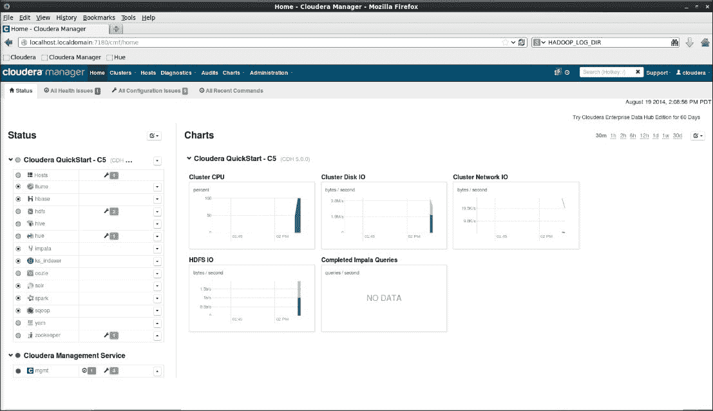
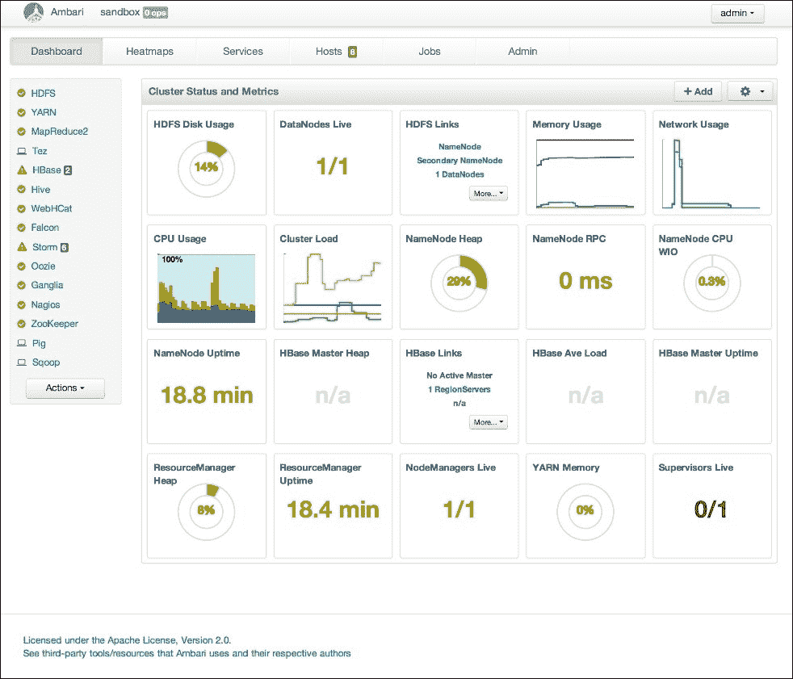
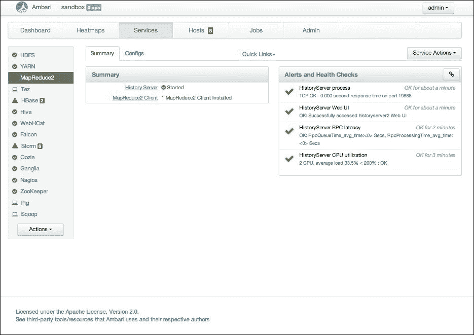
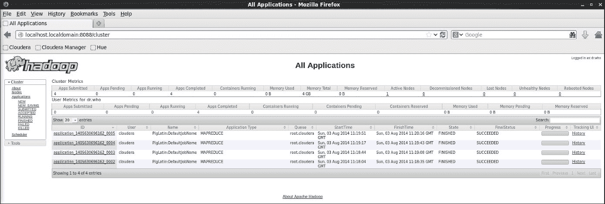
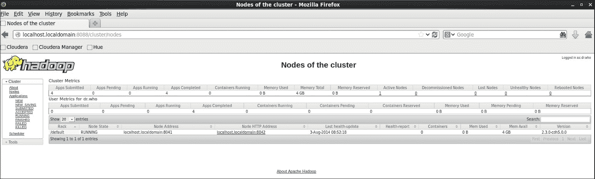
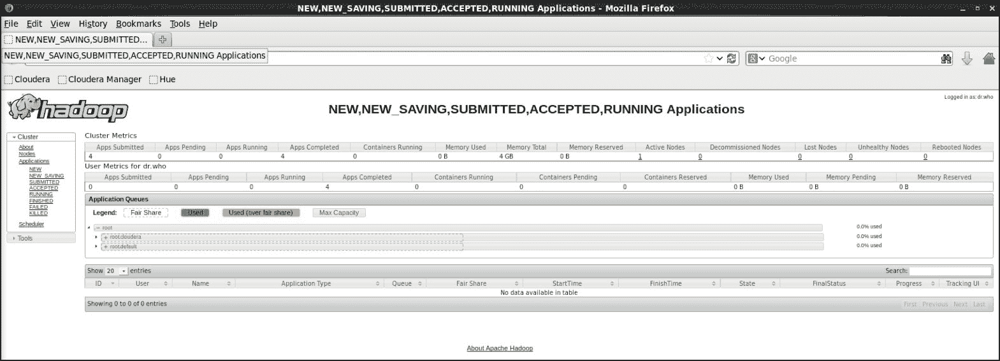
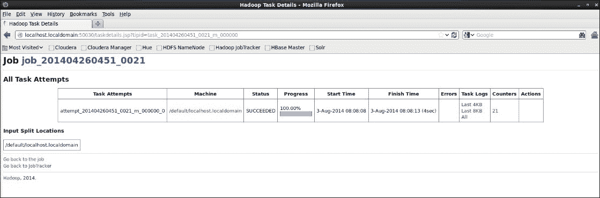
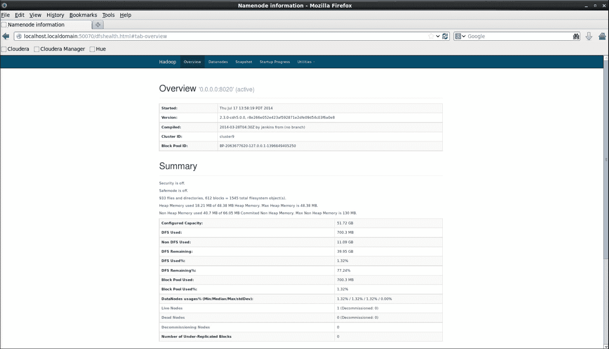

# 第 10 章运行 Hadoop 群集

在本章中，我们将稍微改变我们的关注点，看看在运行可操作的 Hadoop 集群时您将面临的一些注意事项。 我们将特别介绍以下主题：

*   为什么开发人员应该关心操作，为什么 Hadoop 操作不同
*   有关 Cloudera Manager 及其功能和限制的更多详细信息
*   设计既可在物理硬件上使用又可在 EMR 上使用的群集
*   保护 Hadoop 群集的安全
*   Hadoop 监控
*   对在 Hadoop 上运行的应用程序问题进行故障排除

# 我是一名开发人员-我不关心操作！

在进一步讨论之前，我们需要解释一下为什么我们要在一本直接面向开发人员的书中加入一个关于系统操作的章节。 对于任何为更传统的平台(例如，Web 应用程序、数据库编程等)进行开发的人来说，规范很可能是在开发和运营之间进行非常清晰的划分。 第一组构建代码并将其打包，第二组控制和操作代码运行的环境。

近年来，DevOps 运动获得了发展势头，他们相信，如果这些孤岛被移除，团队之间的合作更加紧密，对每个人都是最好的。 当涉及到运行基于 Hadoop 的系统和服务时，我们相信这是绝对必要的。

## Hadoop 和 DevOps 实践

尽管开发人员可以从概念上构建一个随时可以被遗忘的应用程序，但实际情况往往更加微妙。 在运行时分配给应用程序的资源数量很可能是开发人员希望影响的。 一旦应用程序开始运行，操作人员在尝试优化集群时可能需要深入了解应用程序。 这确实不像传统企业 IT 中看到的那样明确划分职责。 这可能是一件非常好的事情。

换句话说，开发人员需要更多地了解操作方面，操作人员也需要更多地了解开发人员在做什么。 因此，请将本章视为我们帮助您与运营人员进行这些讨论的贡献。 我们不打算在本章结束时让您成为 Hadoop 专家管理员；这本身就是一个专门的角色和技能集。 取而代之的是，我们将对您确实需要了解的问题进行一站式巡视，一旦您的应用程序在实时集群上运行，这将使您的工作变得更轻松。

根据这篇报道的性质，我们将涉及很多主题，而且只会略微深入；如果有更深层次的兴趣，我们会提供进一步调查的链接。 只要确保你的操作人员参与进来就行了！

# Cloudera 管理器

在本书中，我们使用了**Cloudera Hadoop Distribution**(**CDH**)作为最常用的平台，它具有便捷的 QuickStart 虚拟机和强大的 Cloudera Manager 应用程序。 使用基于 Cloudera 的集群，Cloudera Manager 将成为(至少最初)您进入系统的主要界面，用于管理和监视集群，所以让我们来探索一下。

请注意，Cloudera Manager 拥有大量高质量的在线文档。 我们不会在这里重复此文档；相反，我们将尝试强调 Cloudera Manager 在您的开发和运营工作流中的位置，以及您可能想要接受它还是不想接受它。 Cloudera Manager 的最新版本和以前版本的文档可以通过主Cloudera 文档页面[http://www.cloudera.com/content/support/en/documentation.html](http://www.cloudera.com/content/support/en/documentation.html)访问。

## 付款或不付款

在对 Cloudera Manager 感到兴奋之前，有一点很重要，那就是查阅当前的文档，了解免费版本中有哪些功能可用，哪些功能需要订阅付费 Cloudera 产品。 如果你绝对想要付费版本提供的一些功能，但又不能或不想为订阅服务付费，那么 Cloudera Manager，甚至整个 Cloudera 发行版，可能都不太适合你。 我们将在[第 11 章](11.html "Chapter 11. Where to Go Next")、*、*中回到这个主题。

## 使用 Cloudera Manager 进行群集管理

使用QuickStart VM 不会很明显，但Cloudera Manager 是用于管理集群中所有服务的主要工具。 如果您想启用一项新服务，您将使用 Cloudera Manager。 要更改配置，您需要 Cloudera Manager。 要升级到最新版本，您将再次需要 Cloudera Manager。

即使集群的主要管理是由操作人员处理的，作为开发人员，您可能仍然希望熟悉 Cloudera Manager 界面，以便查看集群到底是如何配置的。 如果您的作业运行缓慢，那么查看 Cloudera Manager 以了解当前的配置情况很可能是您的第一步。 Cloudera Manager Web 界面的默认端口为`7180`，因此主页通常通过 URL(如`http://<hostname>:7180/cmf/home`)连接，如以下屏幕截图所示：



Cloudera Manager 主页

查看界面是值得的；但是，如果您要连接具有管理员权限的用户帐户，请小心！

单击**Clusters**链接，这将展开，给出当前由 Cloudera Manager 实例管理的集群的列表。 这应该告诉您单个 Cloudera Manager 实例可以管理多个集群。 这非常有用，特别是在开发和生产中有许多集群的情况下。

对于每个扩展的群集，将有当前在群集上运行的服务的列表。 单击一项服务，然后您将看到其他选项列表。 选择**配置**，您可以开始浏览该特定服务的详细配置。 单击**Actions**，您将获得一些特定于服务的选项；这通常包括停止、启动、重新启动和管理服务。

单击**Hosts**选项而不是**Clusters**，您可以开始深入查看 Cloudera Manager 管理的服务器，并从那里查看在每个服务器上部署了哪些服务组件。

### Cloudera 管理器和其他管理工具

最后一条评论可能会提出一个问题：Cloudera Manager 如何与其他系统管理工具集成？ 鉴于我们早先关于 DevOps 理念的重要性的评论，它与 DevOps 环境中受欢迎的工具的集成情况如何？

诚实的回答是：并不总是很好。 尽管主 Cloudera Manager 服务器本身可以由自动化工具(如 Pupet 或 Chef)管理，但有一个明确的假设是，Cloudera Manager 将控制 Cloudera Manager 在其群集中包含的所有主机上安装和配置 Cloudera Manager 所需的所有软件。 对于一些管理员来说，这使得 Cloudera Manager 背后的硬件看起来像一个大的黑匣子；他们可能控制基本操作系统的安装，但未来配置基线的管理完全由 Cloudera Manager 管理。 这里没有什么可做的；它就是这样-为了获得 Cloudera Manager 的好处，它会将自身作为一个新的管理系统添加到您的基础架构中，而这与您更广泛的环境的契合度将视具体情况而定。

## 使用 Cloudera Manager 进行监控

在系统监控方面也可以提出类似的观点，因为 Cloudera Manager 在概念上也是一个复制点。 但是开始在界面上单击，很快就会发现 Cloudera Manager 提供了一套极其丰富的工具来评估托管群集的运行状况和性能。

从绘制 Impala 查询的相对性能图，到显示纱线应用程序的作业状态，再到提供存储在 HDFS 上的块的低级数据，所有这些都可以在一个界面中完成。 我们将在本章后面讨论 Hadoop 上的故障排除是如何具有挑战性的，但 Cloudera Manager 提供的单点可见性是评估集群运行状况或性能的一个很好的工具。 我们将在本章后面更详细地讨论监控。

### 查找配置文件

当运行由 Cloudera Manager 管理的集群时，首先面临的困惑之一就是试图查找该集群使用的配置文件。 在产品的普通 Apache 发行版中，比如核心 Hadoop，通常会有文件存储在`/etc/hadoop`中，类似地，`/etc/hive`存储在 hive 中，`/etc/oozie`存储在 oozie 中，依此类推。

然而，在 Cloudera Manager 管理的集群中，每次重新启动服务时都会重新生成配置文件，并且配置文件不是位于文件系统的`/etc`位置，而是位于`/var/run/cloudera-scm-agent-process/<pid>-<task name>/`，其中最后一个目录的名称可能是`7007-yarn-NODEMANAGER`。 对于任何习惯于使用早期 Hadoop 集群或其他不做此类操作的发行版的人来说，这可能看起来很奇怪。 但在 Cloudera Manager 控制的集群中，使用 Web 界面浏览配置通常比查找底层配置文件更容易。 哪种方法最好？ 这有点哲理，每个团队都需要决定哪一个最适合他们。

## Cloudera Manager API

我们只给出了 Cloudera Manager 的最高级别概述，在这样做的过程中，完全忽略了一个可能对某些组织非常有用的领域：Cloudera Manager 提供了一个允许将其功能集成到其他系统和工具中的 API。 如果您可能对此感兴趣，请参考文档。

## Cloudera Manager 锁定

这就把我们带到了围绕 Cloudera Manager 的整个讨论中隐含的观点：它确实在一定程度上锁定了 Cloudera 及其发行版。 这种锁定可能只以某些方式存在；例如，代码应该可以跨集群移植，模数是关于不同底层版本的常见警告-但是集群本身可能不容易重新配置为使用不同的发行版。 假设切换发行版将是一个完全的删除/重新格式化/重新安装活动。

我们并不是说不要使用它，而是您需要注意 Cloudera Manager 的使用带来的锁定。 对于几乎没有专门的运营支持或现有基础设施的小型团队来说，Cloudera Manager 为您提供的重要功能可能会盖过这种锁定的影响。

对于较大的团队或在与现有工具和流程集成更重要的环境中工作的团队来说，决策可能不那么明确。 查看 Cloudera Manager，与您的运营人员讨论，确定最适合您的产品。

请注意，可以手动下载并安装 Cloudera 发行版的各种组件，而无需使用 Cloudera Manager 来管理集群及其主机。 对于一些用户来说，这可能是一个有吸引力的中间选择，因为可以使用 Cloudera 软件，但部署和管理可以内置到现有的部署和管理工具中。 这也可能是避免前面提到的付费 Cloudera 支持级别的额外费用的一种方式。

# Ambari-开源替代方案

Ambari 是一个 Apache项目([http://ambari.apache.org](http://ambari.apache.org))，从理论上讲，它提供了 Cloudera Manager 的开源替代方案。 它是 Hortonworks 发行版的管理控制台。 在撰写本文时，Hortonworks 的员工也是项目的绝大多数贡献者。

考虑到 Ambari 的开源特性，人们可以预料到，它依赖于其他开源产品，如 Pupet 和 Nagios，来提供对其托管集群的管理和监控。 它还具有类似于 Cloudera Manager 的高级功能，即安装、配置、管理和监视 Hadoop 集群以及其中的组件服务。

了解 Ambari 项目是件好事，因为选择不仅仅是完全锁定 Cloudera 和 Cloudera Manager，还是手动管理集群。 Ambari 提供了一个图形化的工具，随着它的成熟，它可能值得考虑，甚至可以参与进来。 在 HDP 群集上，可通过`http://<hostname>:8080/#/main/dashboard`访问与前面所示的 Cloudera Manager 主页相当的 Ambari UI，其屏幕截图如下所示：



安巴里

# Hadoop 2 世界中的操作

正如在[第 2 章](02.html "Chapter 2. Storage")，*Storage*中提到的，Hadoop2中对 HDFS 所做的一些最重要的更改涉及其容错性和与外部系统的更好集成。 这不仅仅是出于好奇，尤其是 NameNode 的高可用性特性，从 Hadoop 1 开始就对集群的管理产生了巨大的影响。在 2012 年左右糟糕的过去，Hadoop 集群的运营准备的很大一部分都是围绕 NameNode 故障的缓解和恢复过程来构建的。 如果在 Hadoop1 中 NameNode 死了，并且您没有 HDFS`fsimage`元数据文件的备份，那么您基本上就失去了对所有数据的访问权限。 如果元数据永久丢失，那么数据也会永久丢失。

Hadoop2 增加了内置的 NameNode HA 和使其工作的机制。 此外，还有一些组件，如进入 HDFS 的 NFS 网关，这使得它成为一个更加灵活的系统。 但这种额外的能力确实是以牺牲更多的活动部件为代价的。 要启用 NameNode HA，JournalManager 和 FailoverController 中还有其他组件，并且 NFS 网关需要特定于 Hadoop 的 portmap 和 nfsd 服务实现。

Hadoop2 现在还拥有个与外部服务的广泛的其他集成点，以及在其上运行的更广泛的应用程序和服务选择。 因此，从操作的角度看 Hadoop2 可能会很有用，因为它牺牲了 Hadoop1 的简单性，换取了额外的复杂性，从而提供了更强大的平台。

# 资源共享

在 Hadoop1 中，人们必须考虑资源共享的唯一时刻是考虑将哪个调度器用于 MapReduce JobTracker。 由于所有作业最终都被转换为 MapReduce 代码，因此在 MapReduce 级别拥有资源共享策略通常足以管理大量集群工作负载。

Hadoop 2 和纱线改变了这一局面。 除了运行许多 MapReduce 作业之外，一个集群还可能在其他 YAR ApplicationMaster 之上运行许多其他应用程序。 TEZ 和 Spark 本身就是框架，它们在其提供的接口上运行额外的应用程序。

如果所有东西都在纱线上运行，那么它提供了配置分配给应用程序的每个容器消耗的最大资源分配(在 CPU、内存和即将到来的 I/O 方面)的方法。 这里的主要目标是确保分配足够的资源以保持硬件的充分利用，而不会有未使用的容量或使其过载。

当非纱线应用程序(如 Impala)在集群上运行并希望获取分配的容量片段(尤其是在 Impala 中的内存)时，事情会变得更加有趣。 比方说，如果您在相同的主机上以非纱线模式运行 Spark，或者实际上任何其他分布式应用程序可能受益于 Hadoop 机器上的托管，也可能会发生这种情况。

基本上，在 Hadoop2 中，您需要更多地将集群看作一个多租户环境，需要更多地关注向各个租户分配资源。

这里确实没有什么灵丹妙药的建议；正确的配置将完全取决于托管的服务及其运行的工作负载。 这是另一个示例，您希望与运营团队密切合作，使用阈值执行一系列负载测试，以确定各种客户端的资源要求是什么，以及哪种方法可以提供最高的利用率和性能。 Cloudera 工程师的以下博客文章很好地概述了他们如何让 Impala 和 MapReduce 有效共存来解决这个问题：[http://blog.cloudera.com/blog/2013/06/configuring-impala-and-mapreduce-for-multi-tenant-performance/](http://blog.cloudera.com/blog/2013/06/configuring-impala-and-mapreduce-for-multi-tenant-performance/)。

# 构建物理集群

在考虑硬件资源分配之前，有一个较小的要求：定义和选择用于集群的硬件。 在本节中，我们将讨论物理集群，并在下一节中继续讨论 Amazon EMR。

任何特定的硬件建议一经撰写就会过期。 我们建议仔细阅读各个 Hadoop 发行版供应商的网站，因为他们经常就当前推荐的配置撰写新文章。

我们不会告诉您需要多少内核或 GB 内存，而是从稍微高一点的级别来看硬件选择。 首先要意识到的是，运行 Hadoop 集群的主机很可能与企业的其他主机看起来非常不同。 Hadoop 针对低(ER)成本的硬件进行了优化，因此不会看到少量非常大的服务器，而应该看到更多具有更少企业可靠性功能的机器。 但不要认为 Hadoop 会在你身边的任何垃圾上运行得很好。 有可能，但最近典型 Hadoop 服务器的配置已经远离了低端市场，相反，最适合的似乎是中端服务器，在那里可以以较低的价格实现最大的核心/磁盘/内存。

与存储数据和执行应用程序逻辑的工作节点不同，对于运行 HDFS NameNode 或 Yar ResourceManager 等服务的主机，您还应该有不同的资源需求。 对于前者，通常对大量存储的需求要小得多，但通常需要更大的内存和可能更快的磁盘。

对于 Hadoop 工作节点，核心、内存和 I/O 这三个主要硬件类别之间的比率通常是最重要的。 这将直接为您做出有关工作负荷和资源分配的决策提供信息。

例如，许多工作负载往往会受到 I/O 限制，在主机上分配的容器数量是物理磁盘数量的许多倍，实际上可能会因为争用旋转磁盘而导致整体速度减慢。 在撰写本文时，当前的建议是纱线容器的数量不超过磁盘数量的 1.8 倍。 如果您的工作负载是 I/O 受限的，那么您很可能会通过向集群添加更多主机来获得更好的性能，而不是尝试在当前主机上运行更多容器、更快的处理器或更多内存。

相反，如果您希望运行大量并发的 Impala、Spark 和其他需要大量内存的作业，那么内存可能很快就会成为压力最大的资源。 这就是为什么即使您可以从发行商那里获得通用集群的最新硬件建议，您仍然需要针对您的预期工作负载进行验证并进行相应的定制。 在小型测试群集上或在 EMR 上进行基准测试确实是不可替代的，它可以成为探索多个应用程序的资源需求的一个很好的平台，这些应用程序可以为硬件采购决策提供信息。 也许 EMR 可能是您的主要环境；如果是这样，我们将在后面的部分讨论这一点。

## 物理布局

如果您确实使用物理集群，您将需要考虑一些在 EMR 上基本上是透明的事情。

### 机架感知

对于群集来说，这些方面的第一个方面是构建机架感知，这些群集足够大，可以占用一个以上的数据中心空间。 如[第 2 章](02.html "Chapter 2. Storage")、*存储*中所述，当 HDFS 放置新文件的副本时，它会尝试将第二个副本放置在与第一个副本不同的主机上，并将第三个副本放置在多机架系统中不同的设备机架中。 此启发式方法旨在最大限度地提高恢复能力；即使整个设备机架发生故障，也至少有一个副本可用。 MapReduce 使用类似的逻辑来尝试获得更均衡的任务分布。

如果您不执行任何操作，则每台主机都将被指定为位于单个默认机架中。 但是，如果群集增长超过这一点，您将需要更新机架名称。

在幕后，Hadoop 通过执行用户提供的将节点主机名映射到机架名称的脚本来发现节点的机架。 Cloudera Manager 允许在给定主机上设置机架名称，然后在 Hadoop 调用其机架识别脚本时检索该名称。 要为主机设置机架，请单击**Hosts-><hostname>->Assign Rack**，然后从 Cloudera Manager 主页分配机架。

### 发文：2013 年 2 月 10 日星期日晚上 11：00

如前所述，您的集群中可能有两种类型的硬件：运行工作器的机器和运行服务器的机器。 在部署物理集群时，您需要确定哪些服务以及这些服务的哪些子组件在哪些物理机上运行。

对于工作者来说，这通常非常简单；大多数(尽管不是全部)服务在所有工作者主机上都有一个工作者代理模型。 但是，对于主/服务器组件，需要稍微考虑一下。 如果您有三个主节点，那么如何扩展您的主 NameNode 和备用 NameNode：纱线资源管理器、可能的色调、几个配置单元服务器和一个 Oozie 管理器？ 其中一些功能高度可用，而另一些则不是。 随着您向集群中添加越来越多的服务，您还将看到这个主服务列表大幅增长。

在理想情况下，每个服务主机可能有一台主机，但这只适用于非常大的集群；在较小的安装中，它的成本高得令人望而却步。 另外，它可能总是有点浪费。 这里也没有一成不变的规则，但一定要查看可用的硬件，并尝试将服务尽可能地分布在节点上。 例如，不要让两个 NameNode 有两个节点，然后将其他所有内容放在第三个节点上。 考虑单个主机故障的影响，并管理布局以将其降至最低。 随着群集跨多个设备机架扩展，还需要考虑如何在单机架故障中幸存下来。 Hadoop 本身对此很有帮助，因为 HDFS 将尝试确保每个数据块在至少两个机架上都有副本。 但是，例如，如果所有主节点都驻留在单个机架中，则会削弱这种类型的弹性。

### 升级服务

升级 Hadoop 历来是一项耗时且有一定风险的任务。 在手动部署的集群(即不受 Cloudera Manager 等工具管理的集群)上仍然是这种情况。

如果您使用的是 Cloudera Manager，那么它会将耗时的部分从活动中去掉，但不一定会带来风险。 任何升级都应始终被视为发生意外问题的可能性很高的活动，您应该安排足够的群集停机时间来应对这种意外的兴奋。 在测试集群上进行测试升级确实是无可替代的，这强调了将 Hadoop 视为环境的一个组件的重要性，该组件需要像其他组件一样被视为部署生命周期。

有时升级需要修改 HDFS 元数据，或者可能会影响文件系统。 当然，这才是真正的风险所在。 除了运行测试升级外，还要注意将 HDFS 设置为升级模式的功能，这将有效地创建升级前文件系统状态的快照，并将一直保留到升级完成。 此非常有用，因为即使是出现严重错误并损坏数据的升级也有可能完全回滚。

# 在电子病历上构建集群

Elastic MapReduce 是一种灵活的解决方案，根据需求和工作负载，可以与物理 Hadoop 群集相邻，也可以替换物理 Hadoop 群集。 正如我们到目前为止已经看到的，EMR 提供了预加载和配置了配置单元、流和 Pig 的集群，以及允许执行 MapReduce 应用程序的自定义 JAR 集群。

第二个要区分的是短暂生命周期和长期生命周期。 按需生成临时 EMR 集群；将数据加载到 S3 或 HDFS 中，执行一些处理工作流，存储输出结果，然后自动关闭集群。 工作流终止后，长期运行的群集将保持活动状态，并且群集仍可用于复制新数据和执行新工作流。 长时间运行的集群通常非常适合数据仓库或处理足够大的数据集，因此与临时实例相比，加载和处理数据的效率会很低。

在一份面向潜在用户的必读白皮书(可在[https://media.amazonwebservices.com/AWS_Amazon_EMR_Best_Practices.pdf](https://media.amazonwebservices.com/AWS_Amazon_EMR_Best_Practices.pdf)找到)中，亚马逊提供了一个启发式方法来估计哪种集群类型更适合使用，如下所示：

*如果每天的作业数*(设置群集的时间包括 Amazon S3 数据加载时间，如果使用 Amazon S3+数据处理时间)<24 小时，请考虑临时 Amazon EMR 群集或物理实例。 通过将-live 参数传递给 ElasticMapduce 命令来实例化长时间运行的实例，该命令启用了 Keep Alive 选项并禁用了自动终止。*

请注意，临时群集和长期运行的群集共享相同的属性和限制；尤其是，一旦群集关闭，HDFS 上的数据就不会持久化。

## 关于文件系统的注意事项

到目前为止，在我们的示例中，我们假设数据在 S3 中可用。 在本例中，存储桶作为`s3n`文件系统挂载在 EMR 中，并用作输入源和临时文件系统来存储计算中的中间数据。 在 S3 中，我们引入了潜在的 I/O 开销，读写等操作会触发`GET`和`PUT HTTP`请求。

### 备注

请注意，EMR 不支持 S3 数据块存储。 S3 URI 映射到 S3n。

另一种选择是将数据加载到集群 HDFS 中，并从那里运行处理。 在这种情况下，我们确实有更快的 I/O 和数据局部性，但我们会失去持久性。 当集群关闭时，我们的数据就会消失。 根据经验，如果您正在运行临时集群，那么使用 S3 作为后端是有意义的。 在实践中，人们应该根据工作流特性进行监控和决策。 迭代的多遍 MapReduce 作业将极大地受益于 HDFS；有人可能会争辩说，对于这些类型的工作流，像 TEZ 或 Spark 这样的执行引擎会更合适。

## 将数据导入电子病历

将数据从HDFS 复制到 S3 时，建议使用s3Distcp([http://docs.aws.amazon.com/ElasticMapReduce/latest/DeveloperGuide/UsingEMR_s3distcp.html](http://docs.aws.amazon.com/ElasticMapReduce/latest/DeveloperGuide/UsingEMR_s3distcp.html))，而不是 Apache Distcp 或 Hadoop Distcp。 此方法也适用于在 EMR 内以及从 S3 到 HDFS 传输数据。 要将大量数据从本地磁盘移动到 S3，Amazon 建议使用 Jets3t 或 GNU 并行来并行化工作负载。 通常，重要的是要知道，对 S3 的 PUT 请求的上限是每个文件 5 GB。 要上传较大的文件，需要依赖分块上传([API](https://aws.amazon.com/about-aws/whats-new/2010/11/10/Amazon-S3-Introducing-Multipart-Upload/))，这是一种允许将大文件拆分成较小部分并在上传时重新组装的 https://aws.amazon.com/about-aws/whats-new/2010/11/10/Amazon-S3-Introducing-Multipart-Upload/。 也可以使用 AWS CLI 或流行的 S3CMD 实用程序等工具复制文件，但这些工具没有 AS s3Distcp 的并行优势。

## EC2 实例和调整

EMR 集群的大小取决于数据集大小、文件和块的数量(确定拆分数量)和工作负载类型(尽量避免在任务内存耗尽时溢出到磁盘)。 根据经验，好的大小应该最大限度地提高并行度。 每个实例的映射器和减少器的数量以及每个 JVM 守护进程的堆大小通常由 EMR 在可用资源发生变化的情况下提供和调优集群时配置。

# ←T0 抯群集调整

除了前面针对在 EMR 上运行的集群的注释之外，在任何类型的集群上运行工作负载时，还需要记住一些一般想法。 当然，当在 EMR 之外运行时，这将更加明确，因为它通常抽象出一些细节。

## JVM 注意事项

您应该运行64 位版本的 JVM 并使用服务器模式。 这个可能需要更长的时间来生成优化的代码，但它也使用了更积极的策略，并将随着时间的推移重新优化代码。 这使得它更适合长期运行的服务，比如 Hadoop 进程。

确保为 JVM 分配足够的内存，以防止过度频繁的**垃圾收集**(**GC**)暂停。 并发标记和清除收集器是目前针对 Hadoop 测试和推荐最多的收集器。 自从 JDK7 引入以来，**垃圾优先**(**G1**)收集器已经成为许多其他工作负载的 GC 选项，因此值得关注推荐的最佳实践的发展。 这些选项可以在 Cloudera Manager 的每个服务的配置部分中配置为自定义 Java 参数。

### 小文件问题

在考虑服务协同定位时，您将考虑将堆分配给工作节点上的个 Java 进程。 但是关于 NameNode 有一个特殊的情况，您应该知道：小文件问题。

Hadoop 针对具有大块大小的超大型文件进行了优化。 但有时特定的工作负载或数据源会将许多小文件推送到 HDFS 上。 这很可能是次优的，因为它表明每次处理一个块的每个任务在完成之前只会读取少量数据，从而导致效率低下。

拥有许多小文件也会消耗更多的 NameNode 内存；它在内存中保存从文件到块的映射，因此保存每个文件和块的元数据。 如果文件数量和数据块数量快速增加，那么 NameNode 内存使用量也会增加。 这可能只影响系统的一个子集，因为在撰写本文时，1 GB 内存可以支持 200 万个文件或块，但是使用 2 或 4 GB 的默认堆大小，很容易达到这个限制。 如果 NameNode 需要开始非常积极地运行垃圾收集，或者最终耗尽内存，那么您的集群将非常不健康。 缓解方法是将更多堆分配给 JVM；较长期的方法是将许多小文件合并为数量较少的较大文件。 理想情况下，使用可拆分的压缩编解码器进行压缩。

## 映射和减少优化

映射器和减法器都提供了优化性能的区域；这里有几点需要考虑：

*   映射器的数量取决于分割的数量。 当文件小于默认块大小或使用不可拆分格式压缩时，映射器的数量将等于文件的数量。 否则，映射器的数量由每个文件的总大小除以块大小得出。
*   压缩映射器输出以减少对磁盘的写入并增加 I/O。LZO 是执行此任务的好格式。
*   避免溢出到磁盘：映射器应该有足够的内存来保留尽可能多的数据。
*   减速器数量：建议您使用的减速器数量少于减速器总容量(这样可以避免执行等待)。

# 安全性

一旦你构建了一个集群，你首先想到的就是如何保护它，对吗？ 别担心，大多数人都不担心。但是，随着 Hadoop 从研究部门的内部分析转变为直接驱动关键系统，它不能被忽视太久。

保护 Hadoop 不是心血来潮或没有经过重大测试就能完成的事情。 我们不能就这一问题给出详细的建议，也不能强烈强调认真对待和妥善处理这一问题的必要性。 这可能会耗费时间，可能会花费金钱，但要权衡一下集群受损的成本。

安全性也是一个比 Hadoop 集群大得多的话题。 我们将探索 Hadoop 中提供的一些安全特性，但是您确实需要一个连贯的安全策略，这些离散的组件都适合这些安全策略。

## Hadoop 安全模型的演变

在 Hadoop1 中，实际上没有安全保护，因为提供的安全模型有明显的攻击向量。 您用来连接到群集的 Unix 用户 ID 被认为是有效的，并且您拥有该用户的所有权限。 显然，这意味着在可以访问集群的主机上拥有管理访问权限的任何人都可以有效地模拟任何其他用户。

这导致了所谓的“头节点”访问模型的发展，根据该模型，Hadoop 群集与除头节点之外的所有主机隔离，所有对群集的访问都通过这个集中控制的节点进行中介。 对于缺乏真正的安全模型来说，这是一种有效的缓解措施，即使在使用更丰富的安全方案的情况下，这仍然是有用的。

## 超越基本授权

核心 Hadoop 增加了额外的安全功能，解决了之前的问题。 具体而言，它们涉及以下内容：

*   群集可能要求用户通过 Kerberos 进行身份验证，并证明他们是他们所说的那个人。
*   在安全模式下，群集还可以使用 Kerberos 进行所有节点到节点的通信，从而确保所有通信节点都经过身份验证，并防止恶意节点尝试加入群集。
*   为了简化管理，可以将用户收集到组中，可以针对这些组定义数据访问权限。 这称为**基于角色的访问控制**(**RBAC**)，它是拥有多个用户的安全集群的先决条件。 可以从公司系统(如 LDAP 或 Active Directory)检索用户-组映射。
*   HDFS 可以应用 ACL 来取代当前受 Unix 启发的所有者/组/世界模型。

这些功能为Hadoop 提供了比过去更强大的安全态势，但是社区正在快速发展，并且出现了更多专门的 Apache 项目来解决特定的安全领域。

ApacheSentry[Hadoop](https://sentry.incubator.apache.org)是一个为 https://sentry.incubator.apache.org 数据和服务提供更细粒度授权的系统。 其他服务构建哨兵映射，例如，这不仅允许对特定的 HDFS 目录施加特定限制，而且还允许对实体(如配置单元表)施加特定限制。

Sentry 专注于为 Hadoop 安全性的内部细粒度方面提供更丰富的工具，而 Apache Knox([http://knox.apache.org](http://knox.apache.org))提供了到 Hadoop 的安全网关，该网关与外部身份管理系统集成，并提供访问控制机制来允许或禁止访问特定的 Hadoop 服务和操作。 它通过向 Hadoop 提供一个仅支持 REST 的接口并保护对此 API 的所有调用来实现这一点。

## Hadoop 安全的未来

在 Hadoop 世界中还有许多其他的发展。 核心 Hadoop2.5 向 HDFS 添加了扩展的文件属性，可用作附加访问控制机制的基础。 未来的版本将包含更好地支持传输中和静态数据加密的功能，由英特尔([https://github.com/intel-hadoop/project-rhino/](https://github.com/intel-hadoop/project-rhino/))领导的犀牛计划(Project Rhino)正在构建对文件系统加密模块、安全文件系统以及在某种程度上更全面的密钥管理基础设施的更丰富支持。

Hadoop 发行版供应商正在迅速采取行动，将这些功能添加到他们的发行版中，因此，如果您关心安全性(您关心的，不是吗！)，那么请参考文档以了解您的发行版的最新版本。 新的安全功能正在添加，甚至是即时更新，而且在重大升级之前不会推迟。

## 使用安全群集的后果

在用现在可用的和即将到来的所有安全好处来取笑你之后，给你一些警告才是公平的。 安全性通常很难正确实现，错误地使用缺陷部署带来的安全感通常比知道自己没有安全性更糟糕。

然而，即使您操作正确，运行安全集群也会产生后果。 这无疑增加了管理员(通常也是用户)的工作难度，因此肯定会有开销。 特定的 Hadoop 工具和服务的工作方式也会有所不同，具体取决于群集上采用的安全性。

我们在[章](08.html "Chapter 8. Data Lifecycle Management")，*数据生命周期管理*中讨论了 Oozie，它在幕后使用自己的委派令牌。 这允许 Oozie 用户提交作业，然后代表最初提交的用户执行这些作业。 在只使用基本授权机制的集群中，这很容易配置，但在安全集群中使用 Oozie 需要向工作流定义和常规 Oozie 配置添加额外的逻辑。 对于 Hadoop 或 Oozie 来说，这不是问题；然而，与 Hadoop2 中 HDFS 更好的 HA 特性带来的额外复杂性类似，更好的安全机制只会带来您需要考虑的成本和后果。

# 监控

在本章的早些时候，我们讨论了 Cloudera Manager 作为可视化的监控工具，并暗示它也可以通过编程方式与其他监控系统集成。 但是，在将 Hadoop 插入任何监控框架之前，有必要考虑一下对 Hadoop 集群进行操作监控意味着什么。

## Hadoop-故障无关紧要

传统的系统监控往往是一个相当二进制的工具；一般来说，要么某些东西在工作，要么不工作。主机是活的还是死的，Web 服务器是否响应。但在 Hadoop 世界里，事情有点不同；重要的是服务的可用性，即使特定的硬件或软件发生故障，这仍然可以被视为实时的。 如果单个工作节点出现故障，任何 Hadoop 群集都不会出现问题。 从 Hadoop2 开始，如果配置了 HA，甚至服务器进程(如 NameNode)的故障也不应该成为问题。 因此，对 Hadoop 的任何监视都需要考虑服务运行状况，而不是特定主机的运行状况，这一点应该不重要。 全天候寻呼机的操作人员不会高兴在凌晨 3 点被寻呼时发现 10,000 个群集中的一个工作节点出现故障。 的确，一旦集群的规模超过了某一点，单个硬件出现故障几乎是家常便饭。

## 监控集成

您将不会构建自己的监控工具；相反，您可能希望与现有工具和框架集成。 对于流行的开源监控工具，如 Nagios 和 Zabbix，有多个示例模板可以集成 Hadoop 的服务范围和特定于节点的指标。

这可以实现前面所暗示的那种分离；纱线资源管理器的故障将是一个高危急事件，很可能会导致向操作人员发送警报，但应该只捕获特定主机上的高负载，而不会导致警报被触发。？ 这就提供了在发生不好的事情时触发警报的双重功能，此外，它还可以捕获和提供随时间推移深入研究系统数据以进行趋势分析所需的信息。

Cloudera Manager 提供了 REST 接口，这是另一个集成点，Nagios 等工具可以根据该接口集成和提取 Cloudera Manager 定义的服务级别指标，而不必定义自己的指标。

对于构建在 IBM Tivoli 或 HP OpenView 等框架之上的重量级企业监控基础设施，Cloudera Manager 还可以通过这些系统收集的 SNMP 陷阱传递事件。

## 应用程序级指标

有时，您可能还希望您的应用程序收集可以在系统内集中捕获的指标。 不同的计算模型实现这一点的机制会有所不同，但最著名的是 MapReduce 中可用的应用程序计数器。

当 MapReduce 作业完成时，它会输出许多计数器，这些计数器由系统在整个作业执行过程中收集，这些计数器处理映射任务的数量、写入的字节数、失败的任务等指标。 您还可以编写特定于应用程序的指标，这些指标将与系统计数器一起使用，并在整个 map/Reduce 执行过程中自动聚合。 首先定义一个 Java 枚举，并在其中命名您需要的指标，如下所示：

```scala
public enum AppMetrics{
  MAX_SEEN,
  MIN_SEEN,
  BAD_RECORDS 
};
```

然后，在 Map 或 Reduce 实现的Map、Reduce、Setup 和 Cleanup 方法中，您可以执行类似以下操作来将计数器递增 1：

```scala
Context.getCounter(AppMetrics.BAD_RECORDS).increment(1);
```

有关该机制的更多详细信息，请参考`org.apache.hadoop.mapreduce.Counter`接口的 JavaDoc。

# 故障排除

监视和记录计数器或附加信息固然不错，但知道如何在排除应用程序故障时真正找到所需的信息可能会让人望而生畏。 在本节中，我们将了解 Hadoop 如何存储日志和系统信息。 我们可以区分三种类型的原木，如下所示：

*   纱线应用程序，包括 MapReduce 作业
*   守护程序日志(NameNode 和 ResourceManager)
*   记录非分布式工作负载的服务，例如，HiveServer2 记录到`/var/log`

除了这些日志类型之外，Hadoop 还在文件系统(存储可用性、复制系数和块数量)和系统级别公开了许多指标。 如前所述，Apache Ambari 和 Cloudera Manager 作为前端都做得很好，它们集中了对调试信息的访问。 但是，在幕后，每个服务要么记录到 HDFS，要么记录到单节点文件系统。 此外，YAR、MapReduce 和 HDFS 通过 Web 接口和编程 API 公开它们的日志文件和指标。

## 日志记录级别

默认情况下，Hadoop 将消息记录到 Log4j。 Log4j是通过类路径中的`log4j.properties`配置的。 此文件定义记录的内容和使用的布局：

```scala
log4j.rootLogger=${root.logger}
root.logger=INFO,console
log4j.appender.console=org.apache.log4j.ConsoleAppender
log4j.appender.console.target=System.err
log4j.appender.console.layout=org.apache.log4j.PatternLayout
log4j.appender.console.layout.ConversionPattern=%d{yy/MM/dd HH:mm:ss} %p %c{2}: %m%n
```

缺省的根记录器是`INFO,console`，它将级别为`INFO`及以上的所有消息记录到控制台的`stderr`。 部署在 Hadoop 上的单个应用程序可以发布它们自己的`log4j.properties`，并根据需要设置它们发出的日志的级别和其他属性。

Hadoop 守护进程有一个网页可以获取和设置任何 Log4j 属性的日志级别。 此接口由每个服务 Web UI 中的`/LogLevel`端点公开。 要启用`ResourceManager`类的调试日志记录，我们将访问`http://resourcemanagerhost:8088/LogLevel`，屏幕截图如下所示：


获取并设置 ResourceManager 上的日志级别

或者，纱线`daemonlog <host:port>`命令与`service /LogLevel`端点连接。 我们可以使用`–getlevel <property>`参数检查`ResourceManager`类的与`mapreduce.map.log.level`相关联的级别，如下所示：

```scala
$ hadoop daemonlog -getlevel localhost.localdomain:8088  mapreduce.map.log.level 
Connecting to http://localhost.localdomain:8088/logLevel?log=mapreduce.map.log.level Submitted Log Name: mapreduce.map.log.level Log Class: org.apache.commons.logging.impl.Log4JLogger Effective level: INFO 

```

可以使用`-setlevel <property> <level>`选项修改有效级别：

```scala
$ hadoop daemonlog -setlevel localhost.localdomain:8088  mapreduce.map.log.level  DEBUG
Connecting to http://localhost.localdomain:8088/logLevel?log=mapreduce.map.log.level&level=DEBUG
Submitted Log Name: mapreduce.map.log.level
Log Class: org.apache.commons.logging.impl.Log4JLogger
Submitted Level: DEBUG
Setting Level to DEBUG ...
Effective level: DEBUG

```

请注意，此设置将影响`ResourceManager`类生成的所有日志。 这包括系统生成的条目以及在纱线上运行的应用程序生成的条目。

## 访问日志文件

根据分布情况，日志文件位置和命名约定可能会有所不同。 Apache Ambari 和 Cloudera Manager 集中访问服务和单个应用程序的日志文件。 在 Cloudera 的 QuickStart VM 上，可以在`http://localhost.localdomain:7180/cmf/hardware/hosts/1/processes`处找到当前运行的进程及其日志文件的链接、`stderr`和`stdout`通道的概览，屏幕截图如下所示：


访问 Cloudera Manager 中的日志资源

Ambari 通过 HDP 沙盒上`http://127.0.0.1:8080/#/main/services`处的**Services**仪表板提供了类似的概览，屏幕截图如下所示：



访问 Apache Ambari 上的日志资源

非分布式日志通常位于每个集群节点的`/var/log/<service>`下。 纱线容器和 MRv2 原木的位置也取决于分布。 在 CDH5 上，这些资源在 HDFS 中的`/tmp/logs/<user>`下可用。

访问分布式日志的标准方式是通过命令行工具或使用服务 Web UI。

例如，该命令如下所示：

```scala
$ yarn application -list -appStates ALL 

```

前面的命令将列出所有正在运行和重试的纱线应用程序。 任务列中的 URL 指向显示任务日志的 Web 界面，如下所示：

```scala
14/08/03 14:44:38 INFO client.RMProxy: Connecting to ResourceManager at localhost.localdomain/127.0.0.1:8032 Total number of applications (application-types: [] and states: [NEW, NEW_SAVING, SUBMITTED, ACCEPTED, RUNNING, FINISHED, FAILED, KILLED]):4                 Application-Id      Application-Name      Application-Type        User       Queue               State         Final-State         Progress                         Tracking-URL application_1405630696162_0002  PigLatin:DefaultJobName             MAPREDUCE    cloudera  root.cloudera            FINISHED           SUCCEEDED             100%  http://localhost.localdomain:19888/jobhistory/job/job_1405630696162_0002 application_1405630696162_0004  PigLatin:DefaultJobName             MAPREDUCE    cloudera  root.cloudera            FINISHED           SUCCEEDED             100%  http://localhost.localdomain:19888/jobhistory/job/job_1405630696162_0004 application_1405630696162_0003  PigLatin:DefaultJobName             MAPREDUCE    cloudera  root.cloudera            FINISHED           SUCCEEDED             100%  http://localhost.localdomain:19888/jobhistory/job/job_1405630696162_0003 application_1405630696162_0005  PigLatin:DefaultJobName             MAPREDUCE    cloudera  root.cloudera            FINISHED           SUCCEEDED             100%  http://localhost.localdomain:19888/jobhistory/job/job_1405630696162_0005 

```

例如，指向属于用户 Cloudera 的任务的链接`http://localhost.localdomain:19888/jobhistory/job/job_1405630696162_0002`是存储在`hdfs:///tmp/logs/cloudera/logs/application_1405630696162_0002/`下的内容的前端。

在以下部分中，我们将概述可用于不同服务的 UI。

### 备注

使用`–log-uri s3://<bucket>`选项配置 EMR 群集将确保 Hadoop 日志复制到`s3://<bucket>`位置。

## ResourceManager、NodeManager 和 Application Manager

在 YAINE 上，ResourceManager web UI 提供 Hadoop 集群的信息和常规作业统计数据、正在运行/完成/失败的作业，以及作业历史日志文件。 默认情况下，UI 显示在`http://<resourcemanagerhost>:8088/`，可以在下面的屏幕截图中看到：



资源管理器

### 应用程序

在左侧栏上，可以查看感兴趣的应用程序状态：`NEW`、`SUBMITTED`、`ACCEPTED`、`RUNNING`、`FINISHING`、`FINISHED`、`FAILED`或`KILLED`。 根据应用程序状态，以下信息可用：

*   应用程序 ID
*   提交用户
*   应用程序名称
*   应用程序所在的调度程序队列
*   开始/结束时间和状态
*   链接到应用程序历史记录的跟踪 UI

此外，`Cluster Metrics`视图还提供以下信息：

*   整体应用程序状态
*   运行中的集装箱数量
*   内存使用情况
*   节点状态

### 个节点

`Nodes`视图是 NodeManager 服务菜单的前端，它显示有关节点正在运行的应用程序的运行状况和位置信息，如下所示：



节点状态

群集的每个单独节点通过其自己的 UI 在主机级别公开更多信息和统计信息。 这些信息包括节点上运行的 Hadoop 版本、节点上有多少可用内存、节点状态以及正在运行的应用程序和容器列表，如以下屏幕截图所示：


单节点信息

### 调度器

以下屏幕截图显示了Scheduler 窗口：



计划安排者 / 调度机 / 调度程序 / 制表人

### MapReduce

虽然 MapReducev1 和 MapReducev2 中提供了相同的信息和日志记录详细信息，但访问方式略有不同。

### MapReduce v1

以下屏幕截图显示了 MapReduce JobTracker UI：


作业跟踪器 UI

作业跟踪器 UI 默认在`http://<jobtracker>:50070`中提供，它显示有关当前正在运行的所有作业以及停用的 MapReduce 作业的信息、群集资源和运行状况的摘要以及调度信息和完成百分比，如以下屏幕截图所示：


作业详细信息

对于每个正在运行和停用的作业，都有详细信息可用，包括其 ID、所有者、优先级、任务分配和映射器的任务启动。 单击`jobid`链接将进入作业详细信息页面-与`mapred job –list`命令显示的 URL 相同。 此资源提供有关 map 和 Reduce 任务的详细信息，以及作业、文件系统和 MapReduce 级别的常规计数器统计信息；其中包括使用的内存、读/写操作数以及读写字节数。

对于每个映射和减少操作，JobTracker 会显示总任务、挂起任务、正在运行任务、已完成任务和失败任务，如以下屏幕截图所示：


作业任务概述

单击工单表格中的链接将进入任务和任务尝试级别的进一步概述，如以下屏幕截图所示：



任务尝试次数

从最后一页开始，我们可以访问每个任务尝试的日志，包括每个单独 TaskTracker 主机上成功任务和失败/终止任务的日志。 此日志包含有关 MapReduce 作业状态的最精细信息，包括 Log4j 附加器的输出以及通过管道传输到`stdout`和`stderr`通道以及`syslog`的输出，如以下屏幕截图所示：


TaskTracker 日志

### MapReduce v2(纱线)

正如我们在[第 3 章](03.html "Chapter 3. Processing – MapReduce and Beyond")，*Processing-MapReduce 以及之后的*中看到的，对于 YAIN，MapReduce 只是众多可以部署的处理框架之一。 回想一下前面的章节，JobTracker 和 TaskTracker 服务分别被 ResourceManager 和 NodeManager 取代。 因此，来自 YAR 的服务 UI 和日志文件都比 MapReducev1 更通用。

资源管理器中显示的`application_1405630696162_0002`名称对应于具有`job_1405630696162_0002`ID 的 MapReduce 作业。该应用程序 ID 属于在容器内运行的任务，单击它将显示 MapReduce 作业的概览，并允许从任一阶段向下钻取各个任务，直至到达单任务日志，如以下屏幕截图所示：


包含 MapReduce 作业的纱线应用程序

### 作业历史服务器

Year 附带了一个 JobHistoryREST 服务，该服务公开有关已完成应用程序的详细信息。 目前，它只支持 MapReduce，并提供有关已完成作业的信息。 这包括提交作业的作业最终状态`SUCCESSFUL`或`FAILED`、MAP 和 Reduce 任务总数以及时间信息。

在`http://<jobhistoryhost>:19888/jobhistory`提供了一个 UI，如以下截图所示：


作业历史记录界面

单击每个作业 ID 将转到纱线应用程序屏幕截图中显示的 MapReduce 作业 UI。

## NameNode 和 DataNode

**Hadoop 分布式文件系统**(**HDFS**)的 Web 界面通常显示有关 NameNode 本身以及文件系统的信息。

默认情况下位于`http://<namenodehost>:50070/`，如下图所示：



NameNode UI

**概述**菜单显示有关 DFS 容量和使用情况以及数据块池状态的NameNode 信息，并提供 DataNode 运行状况和可用性状态的摘要。 此页中包含的信息在很大程度上等同于命令行提示符中显示的信息：

```scala
$ hdfs dfsadmin –report

```

DataNodes 菜单提供有关每个节点状态的更详细信息，并提供单个主机级别的深入查看，包括可用节点和已停用的节点，如以下屏幕截图所示：


数据节点 UI

# 摘要

这是围绕运行可操作 Hadoop 集群的考虑因素进行的短暂停留。 我们并没有试图将开发人员转变为管理员，但希望更广阔的视角能帮助您帮助您的运营人员。 我们特别讨论了以下主题：

*   Hadoop 如何天然地适合 DevOps 方法，因为它的多层复杂性意味着开发人员和运营人员之间不可能也不希望有实质性的知识差距
*   Cloudera Manager，以及它如何成为一款出色的管理和监控工具；不过，如果您有其他企业工具，并且存在供应商锁定风险，那么它可能会导致集成问题
*   Ambari，Cloudera Manager 的 Apache 开源替代品，以及如何在 Hortonworks 发行版中使用它
*   如何考虑为物理 Hadoop 集群选择硬件，以及这如何自然地符合 Hadoop 2 世界中可能的多个工作负载如何在共享资源上和平共处的考虑因素
*   启动和使用 EMR 群集的不同注意事项，以及这如何既是物理群集的附件，又是物理群集的替代方案
*   Hadoop 安全生态系统，它是一个发展非常迅速的领域，今天可用的功能比几年前要好得多，而且仍然有很多东西即将出现
*   监控 Hadoop 群集，考虑在拥抱故障的 Hadoop 模型中哪些事件很重要，以及如何将这些警报和指标集成到其他企业监控框架中
*   如何对 Hadoop 群集的问题进行故障排除，包括可能发生的情况以及如何找到信息为您的分析提供信息
*   快速浏览 Hadoop 提供的各种 Web 用户界面，这些界面可以很好地概述系统中各个组件内发生的情况

这就是我们对 Hadoop 的深入讨论。 在最后一章中，我们将对更广泛的 Hadoop 生态系统表达一些想法，为书中没有机会介绍的有用和有趣的工具和产品提供一些指导，并建议如何参与社区。