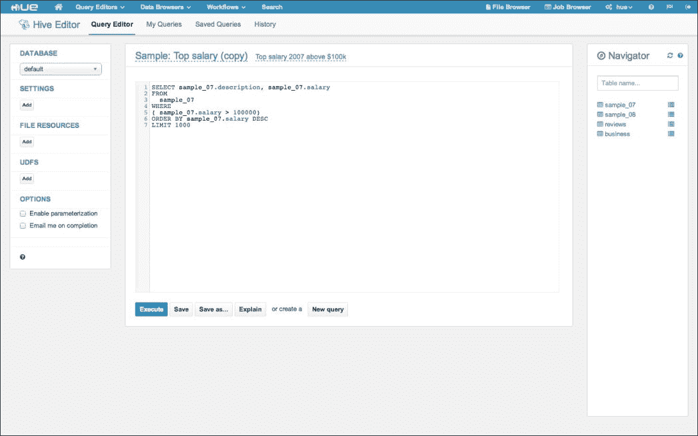

# 十一、下一步要去哪里

在前面的章节中，我们研究了 Hadoop2 的许多部分以及它周围的生态系统。 然而，我们必然会受到页数的限制；有些方面我们没有尽可能深入，有些方面我们只是顺便提到，或者根本没有提到。

Hadoop 生态系统，包括发行版、Apache 和非 Apache 项目，现在是一个令人难以置信的充满活力和健康的地方。 在本章中，如果您愿意的话，我们希望用旅游指南来补充前面讨论的更详细的材料，以了解其他有趣的目的地。 在本章中，我们将讨论以下主题：

*   Hadoop 发行版
*   其他重要的 Apache 和非 Apache 项目
*   信息和帮助的来源

当然，请注意，任何关于生态系统的概述都会受到我们的兴趣和偏好的影响，而且从它写出来的那一刻起就已经过时了。 换句话说，千万不要认为这就是所有可用的东西，而应该把它看作是一种刺激食欲的行为。

# 备选分配

在本书中，我们通常使用 Hadoop 的 Cloudera 发行版，但试图尽可能保持覆盖率发行版的独立性。 我们在本书中也提到了**Hortonworks Data Platform**(**HDP**)，但这些当然不是您可用的唯一分发选择。

在环顾四周之前，让我们考虑一下您是否需要分发。 完全可以访问 Apache 网站，下载您感兴趣的项目的源代码 tarball，然后一起构建它们。 但是，考虑到版本依赖关系，这可能会消耗比您预期更多的时间。 潜在的，更是如此。 此外，最终产品在操作部署和管理的工具或脚本方面可能会缺少一些改进。 对于大多数用户来说，这些方面就是采用现有 Hadoop 发行版是自然而然的选择的原因。

关于免费和商业扩展的说明--作为一个拥有相当自由许可的开源项目，发行版创建者也可以自由地使用专有扩展来增强 Hadoop，这些扩展可以是免费的开源产品，也可以是商业产品。

这可能是一个有争议的问题，因为一些开源倡导者不喜欢任何成功的开源项目的商业化；对他们来说，商业实体似乎是在免费享用开源社区的成果，而不必为自己构建它。 其他人认为这是灵活的 Apache 许可的一个健康方面；基础产品永远是免费的，个人和公司可以选择是否使用商业扩展。 我们不会给出任何一种判断，但请注意，这是你几乎肯定会遇到的另一个争议。

因此，您需要决定是否需要发行版，如果需要发行版，原因是什么，与滚动自己的发行版相比，哪些特定方面会给您带来最大的好处？ 您是想要一个完全开源的产品，还是愿意为商业扩展付费？ 考虑到这些问题，让我们来看看几个主要的发行版。

## 适用于 Hadoop 的 Cloudera 发行版

您将会熟悉 Cloudera 发行版([http://www.cloudera.com](http://www.cloudera.com))，因为它在本书中一直在使用。 CDH 是第一个广泛可用的替代发行版，其可用软件的广度、经过验证的质量水平以及其免费成本使其成为非常受欢迎的选择。

最近，Cloudera 一直在积极地将其添加到发行版中的产品扩展到核心 Hadoop 项目之外。 除了 Cloudera Manager 和 Impala(都是 Cloudera 开发的产品)之外，它还添加了其他工具，如 Cloudera search(基于 Apache Solr)和 Cloudera Navigator(一种数据治理解决方案)。 CDH 5 之前的版本更侧重于发行版的集成优势，而版本 5(可能还会更高)正在基础 Apache Hadoop 项目上添加越来越多的功能。

除了培训和咨询服务外，Cloudera 还为其产品提供商业支持。 详情可在公司网页上找到。

## Hortonworks 数据平台

2011 年，雅虎！ 负责 Hadoop 如此多开发的部门被剥离出来，成立了一家名为 Hortonworks 的新公司。 他们还制作了自己的预集成 Hadoop 发行版，名为**Hortonworks data Platform**(**HDP**)，可在[http://hortonworks.com/products/hortonworksdataplatform/](http://hortonworks.com/products/hortonworksdataplatform/)上获得。

HDP 在概念上与 CDH 相似，但这两种产品在侧重点上有所不同。 Hortonworks 强调 HDP 是完全开源的，包括我们在[第 10 章](10.html "Chapter 10. Running a Hadoop Cluster")，*运行 Hadoop 集群*中简要讨论的管理工具 Ambari。 他们还通过 HDP 对 Talend Open Studio 等工具的支持，将 HDP 定位为关键的集成平台。 Hortonworks 不提供专有软件；相反，它的商业模式侧重于为该平台提供专业服务和支持。

Cloudera 和 Hortonworks 都是风投支持的公司，拥有重要的工程专业知识；这两家公司都雇佣了 Hadoop 最多产的贡献者。 然而，底层技术由相同的 Apache 项目组成；不同的因素是它们的打包方式、使用的版本以及这些公司提供的额外增值产品。

## MAPR

MapR Technologies 提供了一种不同的分发类型，尽管该公司和分发通常简称为 MapR。 [Hadoop](http://www.mapr.com)提供的发行版基于 http://www.mapr.com，但添加了许多更改和增强。

MapR 发行版的重点是性能和可用性。 例如，它是第一个为 Hadoop NameNode 和 JobTracker 提供高可用性解决方案的发行版，您会记得在[第 2 章](02.html "Chapter 2. Storage")，*Storage*中，它是核心 Hadoop 1 中的一个重大弱点。它还提供了早在 Hadoop 2 之前就与 NFS 文件系统的本地集成，这使得处理现有数据变得容易得多。 为了实现这些功能，MapR 用完全兼容 POSIX 的文件系统取代了 HDFS，该文件系统也没有 NameNode 功能，从而实现了一个没有主节点的真正分布式系统，并且声称硬件利用率比 Apache HDFS 高得多。

MapR 提供了其发行版的社区版和企业版；并不是所有的扩展都在免费产品中提供。 除了培训和咨询，该公司还提供支持服务，作为企业产品订阅的一部分。

## 和 REST…

Hadoop 发行版不只是年轻初创公司的领地，也不是一个静态的市场。 英特尔在 2014 年初之前一直有自己的发行版，当时它决定将自己的更改合并到 CDH 中。 IBM 有自己的发行版，名为 IBM Infsphere Big Insights，有免费版和商业版两种。 也有许多大企业推出自己的发行版的各种故事，其中一些是公开提供的，而另一些则不是。 有这么多高质量的发行版可供选择，您将不会缺少选择。

## 选择分配

这提出了一个问题：如何选择分发？ 可以看到，可用的发行版(我们没有涵盖所有发行版)的范围从完全开源产品的方便打包和集成到它们上面的整个定制集成和分析层。 不存在总体最佳分布；请仔细考虑您的需求并考虑替代方案。 因为所有这些都提供至少一个基本版本的免费下载，所以简单地自己玩和体验这些选项是很好的。

# 其他计算框架

我们经常讨论，Yarn 给 Hadoop 平台带来的各种可能性。 我们详细介绍了两款新车型，Samza 和 Spark。 此外，其他更成熟的框架，如 Pig，也正在移植到该框架中。

为了更全面地了解本节中的情况，我们将通过提供一组计算模型来说明使用 Yarn 进行加工的可能性，这些计算模型目前正移植到 Yarn 之上的 Hadoop。

## Apache 风暴

Storm([http://storm.apache.org](http://storm.apache.org))是一个(主要)用 Clojure 编程语言编写的分布式计算框架。 它使用定制的喷嘴和螺栓来定义信息源和操作，以允许对流数据进行分布式处理。 Storm 应用被设计为创建转换流的接口拓扑。 它提供与 MapReduce 作业类似的功能，不同之处在于拓扑理论上将无限期运行，直到手动终止。

虽然最初与 Hadoop 截然不同，但 Yahoo！正在开发 Yarn 端口。 可以在[https://github.com/yahoo/storm-yarn](https://github.com/yahoo/storm-yarn)找到。

## == 060 _ Apache 吉拉夫

Giraph 起源于 Google 的 Pregel 文件(可以在[http://kowshik.github.io/JPregel/pregel_paper.pdf](http://kowshik.github.io/JPregel/pregel_paper.pdf)找到)的开源实现。 Gigraph 和 Pregel 都受到了 Valiant 在 1990 年提出的分布式计算的**批量同步并行**(**BSP**)模型的启发。 Giraph 增加了几个特性，包括主计算、分片聚合器、面向边缘的输入和内核外计算。 Yarn 端口可在[https://issues.apache.org/jira/browse/GIRAPH-13](https://issues.apache.org/jira/browse/GIRAPH-13)找到。

## Apache Hama

HAMA 是一个顶级的 Apache 项目，与我们到目前为止遇到的其他方法一样，它的目标是解决 MapReduce 在迭代编程方面的弱点。 与前面提到的 Giraph 类似，HAMA 实现了 BSP 技术，并且受到了 Pregel 论文的很大启发。 Yarn 端口可以在[https://issues.apache.org/jira/browse/HAMA-431](https://issues.apache.org/jira/browse/HAMA-431)处找到。

# 其他有趣的项目

无论您是使用捆绑的发行版还是坚持使用基础 Apache Hadoop 下载，您都会遇到许多对其他相关项目的引用。 我们在本书中已经介绍了其中的几个，如 Hive、Samza 和 Crunch；现在我们将重点介绍其他一些。

请注意，这篇报道试图指出亮点(从作者的角度)，并让人品尝到可用的项目类型的广度。 正如前面提到的，保持警惕，因为将会有新的不断推出。

## HBase

也许我们在这本书中没有介绍的最受欢迎的 Apache Hadoop 相关项目是 HBase([http://hbase.apache.org](http://hbase.apache.org))。 基于 Google 在一篇学术论文中公布的 Bigtable 数据存储模型(听起来熟悉吗？)，HBase 是一个位于 HDFS 之上的非关系型数据存储。

MapReduce 和 Have 都专注于类似批处理的数据访问模式，而 HBase 则寻求提供非常低延迟的数据访问。 因此，与上述技术不同，HBase 可以直接支持面向用户的服务。

HBase 数据模型不是在配置单元和所有其他 RDBMS 中使用的关系方法，它也没有提供关系存储认为理所当然的完整 ACID 保证。 相反，它是一个无键值模式的解决方案，采用面向列的数据视图；列可以在运行时添加，并取决于插入到 HBase 中的值。 因此，每个查找操作都非常快，因为它实际上是从行键到所需列的键值映射。 HBase 还将时间戳视为数据的另一个维度，因此可以直接从某个时间点检索数据。

数据模型非常强大，但并不适合所有用例，就像关系模型并不普遍适用一样。 但是，如果您需要存储在 Hadoop 中的大规模数据的结构化低延迟视图，那么 HBase 绝对是您应该考虑的。

## Sqoop

在[第 7 章](07.html "Chapter 7. Hadoop and SQL")、*Hadoop 和 SQL*中，我们研究了用于向 HDFS 上存储的数据提供类似关系的界面的工具。 通常，这类数据要么需要从现有的关系数据库中检索，要么需要将其处理的输出存储回去。

Apache Sqoop([Hadoop](http://sqoop.apache.org))提供了一种机制，用于声明性地指定关系数据库和 http://sqoop.apache.org 之间的数据移动。 它接受一个任务定义，并由此生成 MapReduce 作业来执行所需的数据检索或存储。 它还将生成代码来帮助操作带有自定义 Java 类的关系记录。 此外，它还可以与 HBase 和 HCATALOG/HIVE 集成，并提供了非常丰富的集成可能性。

在撰写本文时，Sqoop 略有变化。 它的原始版本 Sqoop1 是一个纯客户端应用。 与最初的配置单元命令行工具非常相似，Sqoop1 没有服务器，在客户机上生成所有代码。 不幸的是，这意味着每个客户端需要了解有关物理数据源的大量详细信息，包括确切的主机名以及身份验证凭据。

Sqoop 2 提供了一个集中的 Sqoop 服务器，该服务器封装了所有这些细节，并向连接的客户端提供各种配置的数据源。 这是一个优秀的模型，但在撰写本文时，社区的普遍建议是坚持使用 Sqoop1，直到新版本进一步发展。 如果您对此类型的工具感兴趣，请检查当前状态。

## 旋转

当希望使用 Amazon AWS 等云服务进行 Hadoop 部署时，与在 EC2 上设置您自己的集群相比，使用更高级别的服务(如 Elastic MapReduce)通常要容易得多。 尽管有脚本可以提供帮助，但事实是在云基础设施上基于 Hadoop 的部署可能会带来开销。 这就是 Apache whir([https://whirr.apache.org/](https://whirr.apache.org/))的用武之地。

Whir 并不关注 Hadoop；它关注的是独立于供应商的云服务实例化，Hadoop 就是其中的一个例子。 WHIR 的目标是提供一种程序化的方式来指定和创建云基础设施上基于 Hadoop 的部署，这种方式可以为您处理所有底层服务方面。 它以独立于提供者的方式完成这项工作，这样一旦您在 EC2 上启动，您就可以使用相同的代码在另一个提供者(如 Rightscale 或 Eucalyptus)上创建相同的设置。 这使得供应商锁定(通常是云部署中的一个问题)不那么成问题。

惠尔还没有完全做到这一点。 今天，它可以创建的服务和支持的提供商有限，然而，如果您对轻松部署云感兴趣，那么值得关注它的进展。

### 备注

如果您在 Amazon Web Services 上构建完整的基础设施，那么您可能会发现，云形成在很大程度上提供了定义应用需求的相同能力，尽管显然是以特定于 AWS 的方式。

## Mahout

Apache Mahout([Hadoop](http://mahout.apache.org/))是用于在 http://mahout.apache.org/之上执行高级分析的分布式算法、Java 类和工具的集合。 与[第 5 章](05.html "Chapter 5. Iterative Computation with Spark")*使用 Spark*迭代计算中简要提到的 Spark 的 MLLib 类似，Mahout 附带了许多用于常见用例的算法：推荐、集群、回归和功能工程。 虽然该系统专注于自然语言处理和文本挖掘任务，但其构建块(线性代数运算)适合应用于许多领域。 从 0.9 版开始，项目与 MapReduce 框架分离，转而采用更丰富的编程模型，如 Spark。 社区的最终目标是获得一个基于 Scala DSL 的平台无关库。

## ♫T0H♫色调

Hue([Cloudera](http://gethue.com/))最初由 Cloudera 开发，并以“Hadoop 用户界面”的名称销售，它是一组应用，捆绑在一个通用的 Web 界面下，充当 Hadoop 生态系统的核心服务和许多组件的客户端：Hue([http://gethue.com/](http://gethue.com/))是一组应用，它们捆绑在一个公共 Web 界面下，充当 Hadoop 生态系统的核心服务和许多组件的客户端：

配置单元的色调查询编辑器

色调利用了我们在前几章中讨论的许多工具，并提供了一个用于分析和可视化数据的集成界面。 有两个组件非常有趣。 一方面，有一个查询编辑器，允许用户创建和保存配置单元(或黑斑羚)查询，以 CSV 或 Microsoft Office Excel 格式导出结果集，以及在浏览器中绘制结果集。 该编辑器具有共享 HiveQL 和结果集的功能，从而促进了组织内的协作。 另一方面，有一个 Oozie 工作流和协调器编辑器，允许用户手动创建和部署 Oozie 作业，自动生成 XML 配置和样板。

Cloudera 和 Hortonworks 发行版都附带了 Hue，通常包括以下内容：

*   HDFS 的文件管理器
*   Yarn 作业浏览器(MapReduce)
*   Apache HBase 浏览器
*   Hive 矿藏探险家
*   配置单元和黑斑羚的查询编辑器
*   “小 PIG”的脚本编辑器
*   MapReduce 和 Spark 的作业编辑器
*   Sqoop 2 作业的编辑器
*   Oozie 工作流编辑器和仪表板
*   Apache ZooKeeper 浏览器

最重要的是，Hue 是一个带有 SDK 的框架，其中包含许多用于开发与 Hadoop 交互的第三方应用的 Web 资产、API 和模式。

# 其他编程抽象

Hadoop 不仅仅是通过附加功能进行了扩展，还有一些工具可以提供完全不同的范例来编写用于在 Hadoop 中处理数据的代码。

## 级联

Cascading([Hadoop](http://www.cascading.org/))由并发开发，并在 Apache 许可下开源，是一个流行的框架，它抽象了 http://www.cascading.org/的复杂性，并允许我们在 Hadoop 之上创建复杂的工作流。 级联作业可以编译为 MapReduce、TEZ 和 Spark，并在其上执行。 在概念上，该框架类似于 Apache Crunch，在[第 9 章](09.html "Chapter 9. Making Development Easier")，*让开发更容易*中涉及到，尽管实际上在数据抽象和最终目标方面有所不同。 级联采用元组数据模型(类似于 Pig)，而不是任意对象，并鼓励用户依赖更高级别的 DSL、强大的内置类型和工具来操作数据。

简单地说，级联对于 Pig 拉丁语和 HiveQL 就像 Crunch 对于用户定义的函数一样。

与我们在[第 9 章](09.html "Chapter 9. Making Development Easier")，*使开发更容易*中看到的 Morphline 一样，级联数据模型遵循源-管道-接收器方法，从源捕获数据，通过多个处理步骤输送数据，然后将其输出交付到接收器，准备由另一个应用拾取。

级联鼓励开发人员用多种 JVM 语言编写代码。 该框架的端口支持 Python(PyCascading)、JRuby(Cascading.jruby)、Clojure(Cascalog)和 Scala(烫伤)。 尤其是卡斯卡洛格和烫伤，已经获得了很大的吸引力，并从它们自己的生态系统中繁殖出来。

级联擅长的一个领域是文档。 该项目提供了全面的 API javadoc、广泛的教程([http://www.cascading.org/documentation/tutorials/](http://www.cascading.org/documentation/tutorials/))和基于练习的交互式学习环境([https://github.com/Cascading/Impatient](https://github.com/Cascading/Impatient))。

级联的另一个强大卖点是它与第三方环境的集成。 Amazon EMR 支持级联作为一流的处理框架，并允许我们使用命令行和 Web 界面([http://docs.aws.amazon.com/ElasticMapReduce/latest/DeveloperGuide/CreateCascading.html](http://docs.aws.amazon.com/ElasticMapReduce/latest/DeveloperGuide/CreateCascading.html))启动级联集群。 IntelliJ IDEA 和 Eclipse 集成开发环境都有 SDK 插件。 该框架的顶级项目之一是级联模式(Cascading Pattern)，这是一组机器学习算法，它提供了一个实用程序，用于将**预测模型标记语言**(**PMML**)文档转换为 Apache Hadoop 上的应用，从而促进与流行的统计环境和科学工具(如 R([http://cran.r-project.org/web/packages/pmml/index.html](http://cran.r-project.org/web/packages/pmml/index.html))的互操作性。

# AWS 资源

许多 Hadoop 技术可以作为自我管理集群的一部分部署在 AWS 上。 然而，正如 Amazon 提供对 Elastic MapReduce 的支持一样，Elastic MapReduce 将 Hadoop 作为托管服务处理，还有一些其他服务值得一提。

## SimpleDB 和 DynamoDB

一段时间以来，AWS 一直提供 SimpleDB 作为托管服务，提供类 HBase 的数据模型。

然而，它在很大程度上已经被位于[http://aws.amazon.com/dynamodb](http://aws.amazon.com/dynamodb)的 AWS 的较新服务 DynamoDB 所取代。 虽然它的数据模型与 SimpleDB 和 HBase 非常相似，但它针对的是一种非常不同类型的应用。 SimpleDB 有相当丰富的搜索 API，但在大小方面非常有限，DynamoDB 提供了一个更受限制但不断发展的 API，但具有几乎无限可伸缩性的服务保证。

DynamoDB 定价模型特别有趣；不是为托管服务的特定数量的服务器付费，而是为读写操作分配一定的容量，DynamoDB 管理满足该配置容量所需的资源。 这是一个有趣的发展，因为它是一个更纯粹的服务模型，其中交付所需性能的机制对服务用户是完全不透明的。 请看一下 DynamoDB，但如果您需要比 SimpleDB 能够提供的数据存储规模大得多的数据存储；但是，一定要仔细考虑定价模型，因为调配过多的容量很快就会变得非常昂贵。 亚马逊在以下网址为 DynamoDB 提供了一些良好的最佳实践，这些实践说明最小化服务成本可能会导致额外的应用层复杂性：[http://docs.aws.amazon.com/amazondynamodb/latest/developerguide/BestPractices.html](http://docs.aws.amazon.com/amazondynamodb/latest/developerguide/BestPractices.html)。

### 备注

当然，对 DynamoDB 和 SimpleDB 的讨论假设了一个非关系数据模型；云服务中的关系数据库有**Amazon Relational Database Service**(**Amazon RDS**)。

## 运动

就像 EMR 是由 Hadoop 托管的，DynamoDB 与托管的 HBase 有相似之处，看到 AWS 在 2013 年宣布推出 Kinesis(一种托管的流媒体数据服务)也就不足为奇了。 这可以在[http://aws.amazon.com/kinesis](http://aws.amazon.com/kinesis)找到，它的概念构建块与 Kafka 上的 Samza 堆栈非常相似。 Kinesis 将消息的分区视图作为数据流提供，并提供了一个 API，以便在消息到达时执行回调。 与大多数 AWS 服务一样，它与其他服务紧密集成，可以轻松地将数据传入和传出 S3 等位置。

## ♪嘿，♪

我们将提到的最后一个 AWS 服务是数据管道，它可以在[http://aws.amazon.com/datapipeline](http://aws.amazon.com/datapipeline)找到。 顾名思义，它是一个用于构建涉及多个步骤、数据移动和转换的数据处理作业的框架。 它在概念上与 Oozie 有相当大的重叠，但有一些曲折。 首先，Data Pipeline 与许多其他 AWS 服务进行了预期的深度集成，可以轻松定义包含不同存储库(如 RDS、S3 和 DynamoDB)的数据工作流。 此外，Data Pipeline 确实能够集成安装在本地基础设施上的代理，为构建跨越 AWS 和内部部署环境的工作流提供了一条有趣的途径。

# 信息来源

你不仅仅需要新的技术和工具--即使它们很酷。 有时，来自更有经验的人的一点帮助就能把你从困境中拉出来。 在这方面，您已经做了很好的介绍，因为 Hadoop 社区在许多领域都非常强大。

## 源代码

有时很容易忽略，但 Hadoop 和所有其他 Apache 项目毕竟是完全开源的。 实际的源代码是有关系统如何工作的信息的最终来源(恕我直言，使用双关语)。 熟悉源代码并通过某些功能进行跟踪可能会提供大量信息。 更不用说当你遇到意想不到的行为时会有帮助。

## 邮件列表和论坛

本章列出的几乎所有个项目和服务都有个自己的邮件列表和/或论坛；请查看主页中的特定链接。 大多数发行版也有自己的论坛和其他机制来分享知识和从社区获得(非商业性)帮助。 此外，如果使用亚马逊，请务必访问[https://forums.aws.amazon.com](https://forums.aws.amazon.com)上的亚马逊开发者论坛。

永远记住仔细阅读发帖指南，了解期望的礼仪。 这些都是大量的信息来源；列表和论坛经常被特定项目的开发人员访问。 期待在 Hadoop 列表上看到核心 Hadoop 开发人员，在 Have 列表上看到 Have 开发人员，在 EMR 论坛上看到 EMR 开发人员，等等。

## LinkedIn 群

在职业社交网络 LinkedIn 上有个个 Hadoop 和相关群组。 搜索您感兴趣的特定领域，但最好从[http://www.linkedin.com/groups/Hadoop-Users-988957](http://www.linkedin.com/groups/Hadoop-Users-988957)上的一般 Hadoop 用户组开始。

## 拥抱

如果您想要更多面对面的互动，请在您所在地区寻找**Hadoop 用户组**(**拥抱**)，的大部分将在[http://wiki.apache.org/hadoop/HadoopUserGroups](http://wiki.apache.org/hadoop/HadoopUserGroups)列出。 这些公司倾向于安排半定期的聚会，包括高质量的演示、与志同道合的人讨论技术的能力，以及经常是披萨和饮料。

你住的地方附近没有拥抱吗？ 考虑开一家吧。

## 会议

虽然有些行业需要几十年时间才能建立一个会议线路，但 Hadoop 已经有了一些涉及开源、学术和商业世界的重要会议活动。 像 Hadoop 峰会和 Strata 这样的活动是相当大的；这些和其他一些活动是从[http://wiki.apache.org/hadoop/Conferences](http://wiki.apache.org/hadoop/Conferences)链接到的。

# 摘要

在本章中，我们简要介绍了更广泛的 Hadoop 生态系统，介绍了以下主题：

*   为什么会存在其他 Hadoop 发行版以及一些比较流行的发行版
*   其他提供功能、扩展或 Hadoop 支持工具的项目
*   编写或创建 Hadoop 作业的其他方式
*   信息来源以及如何与其他爱好者联系

现在，去享受乐趣，建造一些令人惊叹的东西吧！