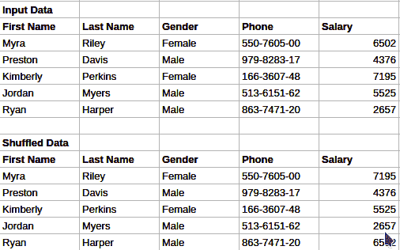
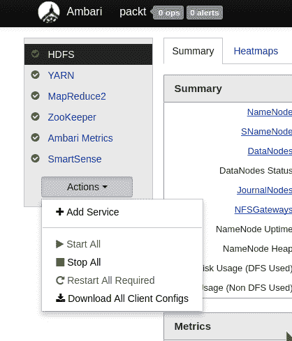
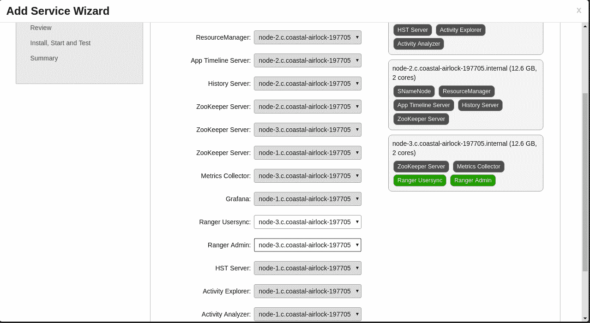
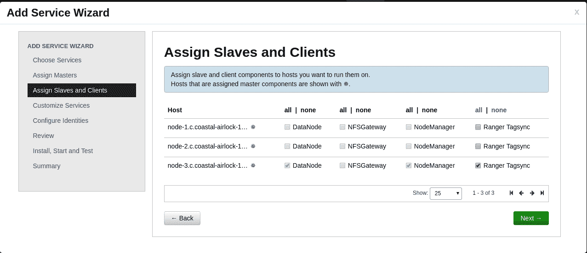
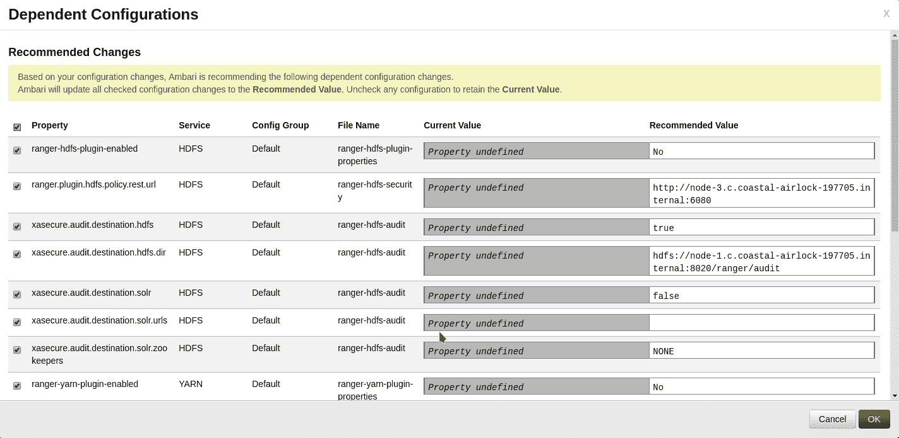
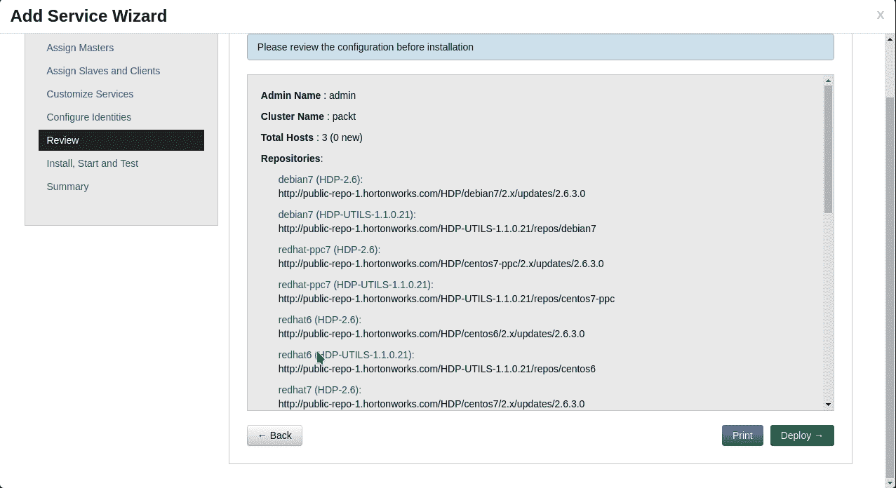
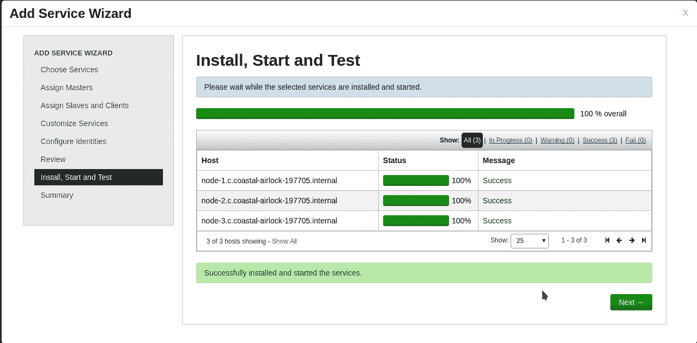
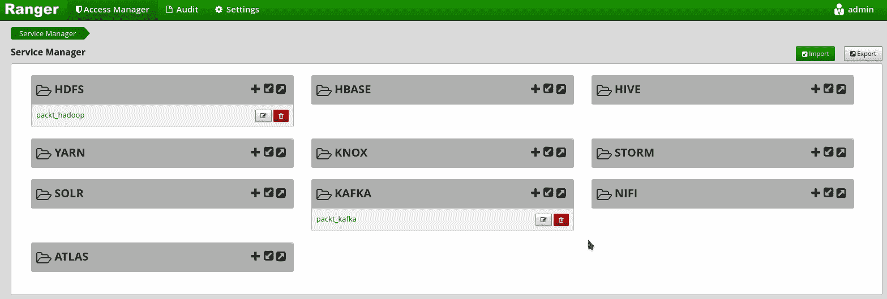
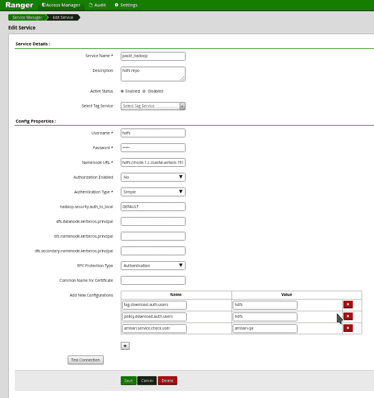

# Hadoop 生命周期管理

在本章中，我们将了解以下主题:

*   数据争论
*   数据屏蔽
*   数据安全

# 数据争论

如果你有处理某种数据的经验，你会记得大多数时候数据需要被预处理，这样我们就可以进一步把它作为更大分析的一部分。这个过程叫做**数据角力**。

让我们看看这个过程中的典型流程是什么样的:

*   数据采集
*   数据结构分析
*   信息提取
*   不需要的数据删除
*   数据转换
*   数据标准化

让我们试着详细了解这些。

# 数据采集

尽管不是数据争论的一部分，这个阶段处理从某处获取数据的过程。通常，所有数据都是在一个中心位置生成和存储的，或者在位于某些共享存储上的文件中可用。

了解这一步有助于我们构建接口或使用现有的库从获取的数据源位置提取数据。

# 数据结构分析

一旦获得数据，我们就必须了解数据的结构。请记住，我们获得的数据可以是以下任何形式:

*   文本数据:
    *   结构数据
    *   非结构化数据
*   二进制数据

这就是我们需要某些工具来帮助我们理解数据结构的地方。

一旦我们彻底理解了我们正在处理的数据，下一个任务就是理解我们需要从这个结构中提取的点点滴滴。有时，根据我们处理的数据的复杂性和大小，我们可能需要时间来真正找到并提取我们正在寻找的信息。

一旦我们知道我们在寻找什么，并且对数据的结构有了坚实的理解，我们就更容易想出简单的算法来从输入数据中提取所需的信息。

# 信息提取

在这个阶段，我们感兴趣的是从输入数据中提取必要的细节。在前一阶段，我们已经确定了我们感兴趣的必要部分。在这里，我们可以采用以下技术来提取信息:

*   识别并定位文本所在的位置
    *   分析并提出信息提取的最佳方法:
    *   标记和提取信息
    *   转到偏移并提取信息
    *   基于正则表达式的信息抽取
    *   基于复杂算法的信息提取

根据数据的复杂性，我们可能必须采用一种或多种上述技术来从目标数据中提取信息。

# 不需要的数据删除

该阶段可以发生在信息提取步骤之前或之后。这取决于哪一个更容易(缩短文本或提取信息)。这是分析师可以做出的设计选择。

在这一阶段，我们将从信息或输入数据中删除不需要的数据，以便进一步提取数据，并可以轻松地用于我们的业务需求。

# 数据转换

这也是一个非常重要的阶段，在这个阶段，我们执行企业定义的标准来定义最终的数据输出。例如，一个组织可以建议所有国家/地区代码都采用 ISO 3166-1 alpha-2 格式。为了遵守这一标准，我们可能必须转换输入数据，其中可能包含具有全名的国家。因此，必须进行映射和转换。

可以对输入数据执行许多其他转换，以使组织中的任何人都可以按照组织的标准以定义良好的形式使用最终数据。

这一步也为拥有一个企业级标准来改进协作提供了一些重要性。

# 数据标准化

一旦信息提取完成，任何必要的清理完成，我们需要决定如何保存这个过程的结果。通常，我们可以对该数据使用简单的 **CSV** ( **逗号分隔值**)格式。如果是处理复杂的输出格式，可以选择 **XML** ( **可扩展标记语言**)或者 **JSON** ( **javascript 对象标注**)格式。

这些格式是非常标准的，我们今天所拥有的几乎所有技术都非常容易理解这些格式。但是为了一开始简单起见，最好从 CSV 格式开始。

# 数据屏蔽

处理客户数据的企业必须确保这些客户的 **PII** ( **个人身份信息**)不会在整个数据管道中自由移动。该标准不仅适用于客户数据，还适用于根据 GDPR 法案、SOX 法案等标准被视为机密的任何其他类型的数据。为了确保我们保护客户、员工、承包商和供应商的隐私，我们需要采取必要的预防措施，以确保当数据通过几个管道时，数据用户只能看到匿名数据。我们的匿名化程度取决于公司遵守的标准以及国家标准。

因此，数据屏蔽可以称为在不丢失意义或上下文的情况下，用其他数据隐藏/转换部分原始数据的过程。

在本节中，我们将了解实现这一目标的各种技术:

*   替代:
    *   静态
    *   动态:
        *   加密
        *   散列法
*   隐藏
*   清除
*   截断
*   差异
*   洗牌

# 代替

替换是用计算数据替换部分数据的过程。数学上可以定义为:


其中 *x* 为源， *y* 为该功能的输出。

为了选择正确的替代机制，我们需要了解如何使用这些数据、目标受众以及数据流环境。让我们看看各种可用的替代机制。

# 静态

在这个方法中，我们有一个查找表；它由给定输入集的所有可能替换组成。该查找表可以这样可视化:

| **源文本(y)** | **替代文本(y)** |
| 史蒂夫·乔布斯 | AAPL-1 |
| 猫 | One hundred and twenty-three million four hundred and fifty-six thousand seven hundred and eighty-nine |
| 网球 | 板球 |

此表说明了如何构建查找表来用不同的文本替换源文本。当有预定义数量的替换可用时，这种方法可以很好地扩展。

这种基于查找表的替换的另一个例子是当我们遵循国家代码的命名标准时，例如，ISO-8661:

| **源文本(x)** | **替代文本(y)** |
| 埃及 | 邪恶的笑（Evil Grin 的缩写） |
| 印度 | 在…里 |
| 圣文森特和格林纳丁斯 | 越南 |
| 联合王国 | 千兆字节 |
| 美利坚合众国 | 美国 |

# 动态的

当存在大量可能性，并且我们希望使用一些算法来更改数据时，这些替代技术非常有用。这些方法可以分为两种。

# 加密

这是通过使用某种形式的秘密将给定文本更改为其他形式的过程。这些是数学定义的函数:


如您所见，这些函数接受一个输入和一个秘密，并生成可以使用相同的秘密和输出解密的数据:


如果我们仔细观察，它是在这里发挥重要作用的秘密。在密码学中，有两种基于这个秘密的算法。这些的使用取决于情况和秘密运输的挑战。

在不深入研究密码学的情况下，让我们试着了解一下这些方法是什么:

*   对称密钥加密
*   非对称密钥加密

两者之间的基本区别是，在第一种情况下，我们对加密和解密使用相同的秘密。但是在后者中，我们使用两种不同的密钥进行加密和解密。

让我们看几个对称密钥加密的例子:

| **算法** | **输入数据** | **输出数据** | **方法** |
| ROT13 | `hello` | `uryyb` | 加密 |
|  | `uryyb` | `hello` | [通信]解密 |
| 是吗 | `hello` | `yOYffF4rl8lxCQ4HS2fpMg==` | 加密(秘密是`hello`) |
|  | `yOYffF4rl8lxCQ4HS2fpMg==` | `hello` | 解密(秘密是`hello`) |
| RIJNDAEL-256 | `hello` | `v8QbYPszQX/TFeYKbSfPL/`
`rNJDywBIQKtxzOzWhBm16/`
`VSNN4EtlgZi3/`
`iPqJZpCiXXzDu0sKmKSl6IxbBKhYw==` | 加密(秘密是`hello`) |
|  | `v8QbYPszQX/TFeYKbSfPL/`
`rNJDywBIQKtxzOzWhBm16/`
`VSNN4EtlgZi3/`
`iPqJZpCiXXzDu0sKmKSl6IxbBKhYw==` | `hello` | 加密(秘密是`hello`) |

如您所见，根据我们使用的加密算法，生成的数据在复杂性和长度上都有所不同。它还取决于用于加密的密钥。

加密带来了更多计算需求和存储空间的挑战。如果我们想在屏蔽过程中使用加密作为方法之一，我们需要相应地规划我们的系统。

# 散列法

这也是一种基于密码学的技术，原始数据被转换成不可逆的形式。让我们看看这个的数学形式:


这里，与加密的情况不同，我们不能使用输出来发现输入是什么。

让我们看几个例子来更好地理解这一点:

| **输入** | **输出** | **方法** |
| `10-point` | `7d862a9dc7b743737e39dd0ea3522e9f` | 讯息摘要 5 |
| `10th` | `8d9407b7f819b7f25b9cfab0fe20d5b3` | 讯息摘要 5 |
| `10-point` | `c10154e1bdb6ea88e5c424ee63185d2c1541efe1bc3d4656a4c3c99122ba9256` | SHA256 |
| `10th` | `5b6e8e1fcd052d6a73f3f0f99ced4bd54b5b22fd4f13892eaa3013ca65f4e2b5` | SHA256 |

我们可以看到，根据我们使用的加密算法，输出大小会有所不同。另一件需要注意的事情是，给定的散列函数产生相同的输出大小，而与输入大小无关。

# 隐藏

在这种方法中，数据被认为过于敏感，甚至不能透露给原始所有者。因此，为了保护数据的机密性，文本的某些部分用一个预定义的字符屏蔽，比如 X(或任何东西)，这样只有对这些部分有完全了解的人才能提取必要的信息。

**示例**:信用卡信息被认为是高度机密，绝不应该透露给任何人。如果你有一些在亚马逊等网站上在线购买的经验，你会看到你的完整信用卡信息没有显示出来；仅显示最后四位数字。由于我是这种信用卡的真正所有者，我可以轻松识别它并继续交易。

同样，当分析师需要查看部分数据时，重要的是要屏蔽掉其中的重要部分，这样最终用户就不会了解全部情况，而是同时使用这些数据进行他们正在进行的任何分析。

让我们看几个例子来更好地理解这一点:

| **数据类型** | **输入** | **输出** | **网络** |
| 信用卡呢 | 4485 **4769 3682** 9843 | 4485 **XXXX XXXX** 9843 | 签证 |
| 信用卡呢 | 5402 **1324 5087** 3314 | 5402 **XXXX XXXX** 3314 | 万事达信用卡 |
| 信用卡呢 | 3772 **951960** 72673 | 3772 **XXXXXX** 72673 | 美国运通 |

在前面的示例中，这些数字遵循预定义的算法和大小。因此，在固定位置屏蔽数字的简单技术可以更好地工作。

让我们再举一个隐藏部分电子邮件地址的例子，这些地址的大小和复杂性各不相同。在这种情况下，我们必须遵循不同的技术来隐藏角色，以免泄露完整的信息:

| **数据类型** | **输入** | **输出** | **方法** |
| 电子邮件 | `hello@world.com` | `h.l.o@w.r.d.com` | 甚至隐藏 |
|  | `simple@book.com` | `.i.p.e@.o.k.c.m` | 奇怪的隐藏 |
|  | `something@something.com` | `s...th.ng@..me...com` | 复杂隐藏 |

这些技术可以简单到:

*   **偶数隐藏**:在这个技巧中，我们隐藏了每个处于偶数位置的角色
*   **奇数隐藏**:我们隐藏输入数据中的每个奇数字符
*   **复杂隐藏**:在这项技术中，我们理解我们正在使用 NLP 处理的数据，然后尝试应用一种算法，这种算法不会泄露太多信息，不会让任何聪明人解码

# 清除

顾名思义，当应用于输入数据时，这会导致数据丢失。根据我们处理的数据的重要性，我们需要应用这种技术。这种技术的典型例子是为一列中的所有记录设置一个`NULL`值。因为这种空数据不能用来推断任何有意义的东西，所以这种技术有助于确保机密数据不会被发送到数据处理的其他阶段。

让我们举几个擦除的例子:

| **输入数据** | **输出数据** | **什么被抹掉了** |
| 空每月收入 1000 印度卢比 | 拉维每月收入为空 | 工资和姓名 |
| 空手机号码为 0123456789 | 拉维的手机号码为空 | 手机号码和姓名 |

从这些例子中，你可能会想:为什么我们要否定这些价值观？当我们对 PII 不感兴趣，但对我们的数据库/输入中有多少工资记录或手机号码记录感兴趣时，这种技术很有用。

这个概念也可以扩展到其他用例。

# 截断

擦除的另一种变体是截断，即我们使所有输入数据的大小一致。当我们非常确定信息丢失在管道的进一步处理中被接受时，这是有用的。

这也可以是一种智能截断，我们知道我们正在处理的数据。让我们看看这个电子邮件地址的例子:

| **输入** | **输出** | **什么被截断了** |
| `alice@localhost.com` | `alice` | `@localhost.com` |
| `bob@localhost.com` | `bob` | `@localhost.com` |
| `rob@localhost.com` | `rob` | `@localhost.com` |

从前面的例子中，我们可以看到电子邮件中的所有域部分都被截断了，因为它们都属于同一个域。这项技术节省了存储空间。

# 差异

这种技术对于本质上是数字的数据类型非常有用。它也可以应用于日期/时间值。

这遵循一种统计方法，即我们尝试通过算法将输入数据改变+/-X %的因子。X 的价值纯粹取决于我们正在进行的分析，不应该对理解业务数字产生总体影响。

让我们看几个例子:

| **输入数据** | **输出数据** | **方法** | **解释** |
| One hundred | One hundred and ten | 固定方差 | 增加 10% |
| -100 | Ninety | 固定方差 | 减少 10% |
| 2000 年 1 月 1 日 | 2000 年 2 月 1 日 | 固定方差 | 添加 1 个月 |
| 2000 年 8 月 1 日 | 2000 年 7 月 1 日 | 固定方差 | 减少 1 个月 |
| One hundred | One hundred and one | 动态方差 | 增加或减少 1%至 5% |
| One hundred | One hundred and five | 动态的 | 增加或减少 1%至 5% |

# 洗牌

这也被认为是实现数据匿名的标准技术之一。这个过程更适用于我们有多个属性(数据库术语中的列)的数据记录的情况。在这种技术中，记录中的数据在一列中被打乱，以确保记录级别的信息被改变。但从统计数据来看，该列中的数据值保持不变。

**例**:在对一个组织的薪资范围做分析的时候，我们其实可以对整个薪资列做一个洗牌，所有员工的薪资从来都不符合现实。但是我们可以利用这些数据对范围进行分析。

在这种情况下，也可以使用复杂的方法，我们可以根据资历、地理位置等其他领域进行洗牌。这种技术的最终目标是保留数据的意义，同时使发现这些属性的原始所有者成为不可能。

让我们用一些示例数据来看看这一点:



有五个样本员工记录及其工资信息。上表有原始的工资明细，下表有打乱的工资记录。仔细看数据就明白了。请记住，在洗牌时，可以应用随机算法来增加发现真相的复杂性。

# 数据安全

当企业做出非常关键的决策时，数据已经成为非常重要的资产。由于生成和使用这些数据的基础设施的复杂性，对这些数据的访问模式进行一些控制是非常重要的。在 Hadoop 生态系统中，我们有 Apache Ranger，这是另一个帮助管理大数据安全性的开源项目。

# 什么是Apache游侠？

Apache Ranger 是一个应用程序，它使数据架构师能够在大数据生态系统中实施安全策略。该项目的目标是为所有 Hadoop 应用程序提供一种统一的方式来遵守定义的安全准则。

以下是Apache游侠的一些特性:

*   集中管理
*   细粒度授权
*   标准化授权
*   多种授权方式
*   集中审计

# 使用 Ambari 的 Apache Ranger 安装

在本节中，我们将使用 Apache Ambari 安装 Ranger。本节假设已经有一个正在运行的 Ambari 实例。

# 安巴里管理员用户界面

打开主节点上运行的 Ambari web 界面；然后点击添加服务，如截图所示:



这将打开一个模态窗口，添加服务向导，它将带我们完成 Apache Ambari 的完整安装的几个步骤。

# adservice

模态窗口出现后，从列表中选择 Apache Ranger 服务，然后单击屏幕上的下一步。

这显示在下面的截图中:


# 服务安排

一旦选择了服务，我们将看到用户界面中的下一步，我们需要选择安装和运行该服务的服务器。

我已经为 Ranger 选择了节点-3(参见绿色标签):



Screenshot showing how to choose servers on which this services is going to be installed and run

之后，选择页面底部的下一步。

# 服务客户安置

在这一步中，我们可以选择安装该服务客户端的位置。使用复选框标记您的首选项。

它们看起来像这样:



做出选择后，单击下一步。

# 在母版上创建数据库

我们已经在主节点上安装了 MySQL 数据库服务器。在继续执行 Ambari 向导的下一步之前，我们必须创建一个新的数据库并分配一些权限:


我们还必须使用`ambari-server setup`命令注册 JDBC 驱动程序:

```sh
bash-$ sudo ambari-server setup --jdbc-db=mysql --jdbc-driver=/usr/share/java/mysql-connector-java.jar
Using python /usr/bin/python
Setup ambari-server
Copying /usr/share/java/mysql-connector-java.jar to /var/lib/ambari-server/resources
If you are updating existing jdbc driver jar for mysql with mysql-connector-java.jar. Please remove the old driver jar, from all hosts. Restarting services that need the driver, will automatically copy the new jar to the hosts.
JDBC driver was successfully initialized.
Ambari Server 'setup' completed successfully.
```

完成这一步后，我们可以回到安巴里向导。

# Ranger 数据库配置

在向导中，系统会提示我们输入数据库名称、用户名和密码。请根据我们在上一步中所做的选择填写它们:


添加设置后，请单击测试连接。这样以后会节省很多时间。

如有错误，请返回上一步；查看是否有拼写错误，然后重新运行。

完成更改后，单击下一步。

# 配置更改

因为我们正在向 Ranger 添加一个服务，所以 Ambari 显示了 Ranger 正常工作所需的配置更改列表。大部分都是默认的。

这些更改看起来像下面的截图。一旦更改看起来不错，单击确定继续:



# 配置审查

在这一步中，我们将看到向导中到目前为止所做的更改列表，并看到打印更改摘要和部署游侠的选项。

只有当我们点击部署时，游侠软件才会被安装。在此之前，它都保存在浏览器缓存中。

屏幕如下所示:



# 部署进度

一旦游侠的安装开始，它应该看起来像截图中的样子。应该不会有任何故障，因为我们已经正确设置了所有配置。如果有任何故障，请检查日志并通过单击“上一步”按钮查看配置:



# 应用程序重启

部署完成后，我们需要重启所有受影响的 Hadoop 组件，如下图所示:


一旦所有组件都重新启动，安巴里仪表板看起来相当健康，我们已经完成了 Apache Ranger 的安装。

在下一步中，我们将看到如何使用 Apache Ranger 来处理我们的数据安全。

# Apache 游侠用户指南

一旦 Apache Ranger 的部署完成，我们就可以使用 Apache Ranger 提供的网络界面来管理我们整个 Hadoop 基础架构的安全性。

# 登录到用户界面

如果您没有更改默认设置，Ranger 默认在非 SSL 模式下运行在端口`6080`上。在安装在端口`6080` ( `http://<server-ip>:6080`)的服务器上打开一个网络浏览器，会出现如下屏幕提示:


使用默认用户名`admin`和密码`admin`登录(出于安全考虑，请在首次登录后更改密码)。

登录成功后，我们将进入*访问管理器*部分。

# 存取管理程序

访问管理器允许我们定义基于服务和标签的策略。此屏幕截图显示了服务的默认列表和配置的策略:



如您所见，已经为 HDFS 服务和 KAFKA 服务定义了策略，因为它们已经安装在 Ambari 设置中。

当我们想要定义一个新的服务时，我们可以点击+图标并定义服务细节。

# 服务详情

在我们开始定义服务的授权规则之前，我们需要定义一个服务，然后向该服务添加授权策略。这些是从用户界面定义服务所需的强制属性:

| **界面元素名称** | **描述** |
| 服务名称 | 代理配置中定义的服务名称 |
| 用户名 | 服务用户的名称 |
| 密码 | 服务用户的密码 |
| URL 名称代码 | 名称节点的网址 |

单击应用程序下方的+图标可以定义新服务(例如，`HDFS`、`Kafka`等)

之后，服务定义屏幕如下所示:



Screenshot of the service definition screen after defining new services

我们需要为我们的服务定义填写所有必要的值，然后点击保存。稍后，我们需要向该服务添加策略来执行访问和审核。

# HDFS 的政策定义和审计

对于 Ranger 中的每个服务，我们可以将不同的策略与服务中的资源相关联。在 HDFS 的情况下，资源将是文件/目录路径。

在本节中，我们将为三个用户定义一个名为“项目”的 HDFS 路径新策略:`hdfs-alice`、`hdfs-bob`和`hdfs-tom`。其中只允许`hdfs-alice`所有权限，其余用户只有读取权限。

我们将看到一旦策略到位，Ranger 如何实施访问限制。

让我们看看创建策略的屏幕:


Screenshot showing how Ranger enforces access restrictions

一旦我们点击添加按钮，这个策略就被注册并添加到当前服务中。

现在，让我们回到 Unix 终端，看看 Ranger 是如何执行策略的。

该屏幕显示如何允许`hdfs`和`hdfs-alice`用户创建目录`/projects`和`/projects/1`，但如何拒绝`hdfs-tom`:


Apache Ranger 在 web 界面中也有一个审计部分，在这里我们可以看到这些访问模式。

该屏幕显示策略拒绝`hdfs-tom`并授予`hdfs-alice`访问权限:


Screenshot showing access denied to hdfs-tom and access granted to hdfs-alice by the policy

像这样，我们可以定义自己的策略，并自定义`hdfs`应该如何允许/拒绝对多个资源的访问。

游侠的强大和灵活来自于它的可配置性。不需要任何配置文件和应用程序的重启，访问控制就能发挥重要作用。

# 摘要

在本章中，我们了解了不同的数据生命周期阶段，包括创建、共享、维护、归档、保留和删除数据的时间。

本章让您详细了解了大数据是如何管理的，考虑到它是非结构化或半结构化的，并且到达率快、容量大。

随着业务组织中生成和使用数据的基础架构的复杂性急剧增加，正确保护您的数据变得势在必行。本章进一步介绍了数据安全工具，如 Apache Ranger，以及帮助我们学习如何控制数据访问模式的模式。

在下一章中，我们将了解 Hadoop 安装、其体系结构和关键组件。