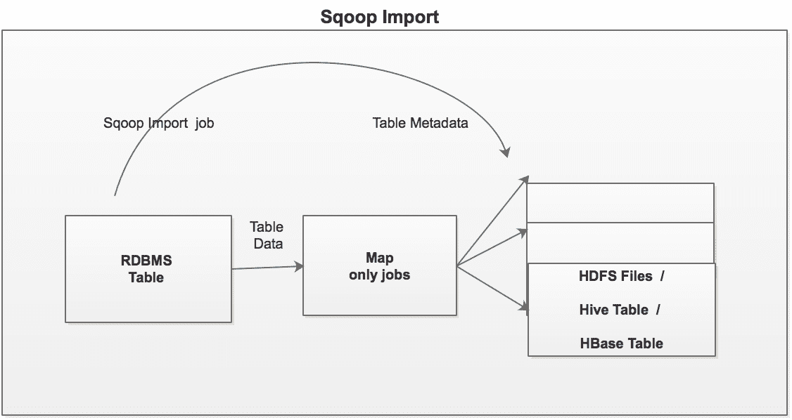
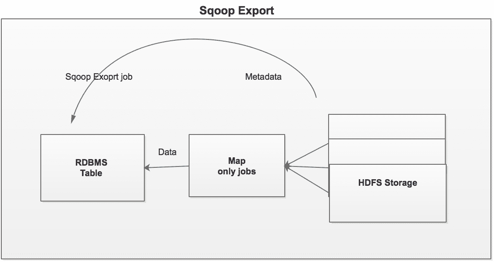
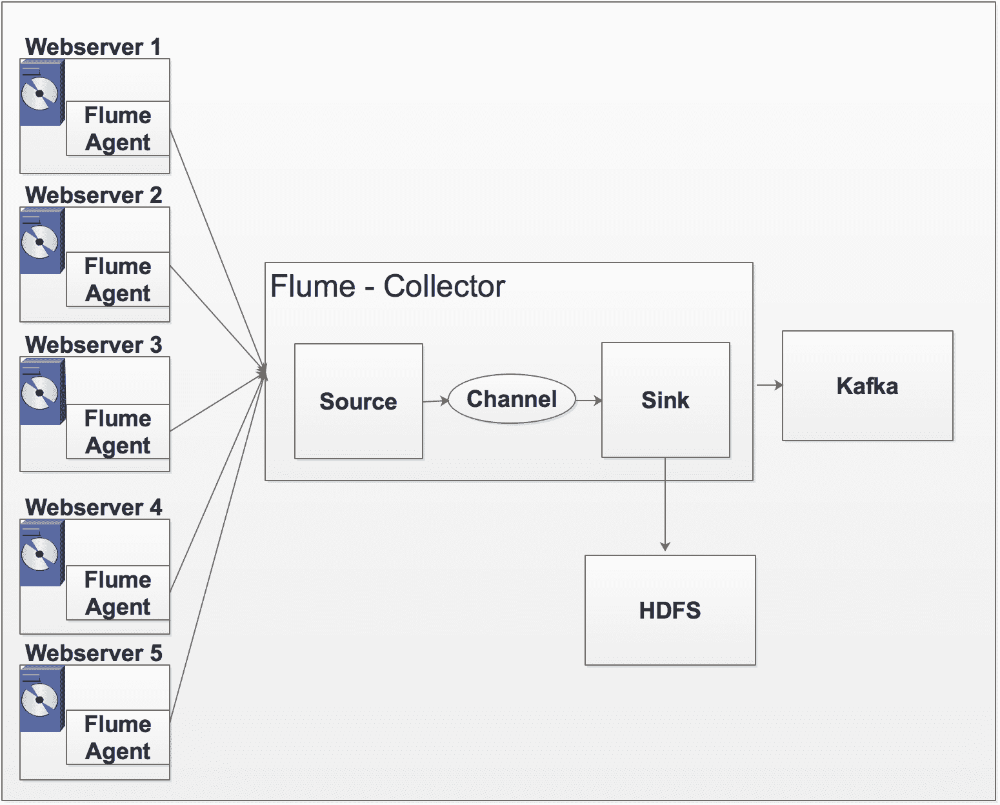
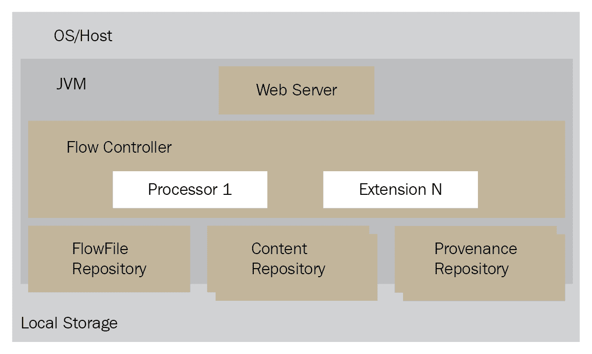
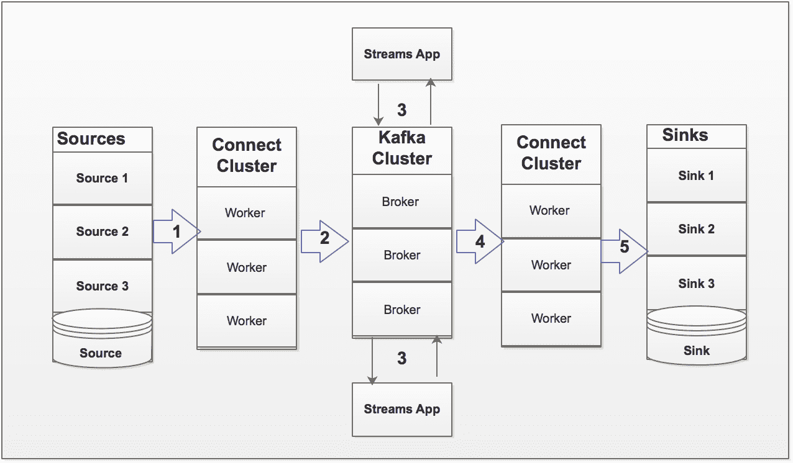
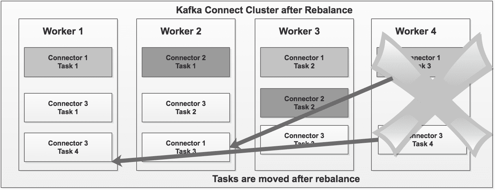

# 四、数据移动技术

在最后一章中，我们学习了如何创建和配置 Hadoop 集群、HDFS 体系结构、各种文件格式以及 Hadoop 集群的最佳实践。我们还学习了 Hadoop 高可用性技术。

因为我们现在知道如何创建和配置 Hadoop 集群，所以在本章中，我们将了解将数据摄入 Hadoop 集群的各种技术。我们知道 Hadoop 的优势，但是现在，我们需要 Hadoop 集群中的数据来利用它的真正力量。

数据摄取被认为是 Hadoop 数据生命周期的第一步。数据可以以批处理或(实时)记录流的形式被吸收到 Hadoop 中。Hadoop 是一个完整的生态系统，MapReduce 是 Hadoop 的批处理生态系统。

下图显示了各种数据摄取工具:


在接下来的几节中，我们将详细了解每种工具。

在本章中，我们将介绍以下在 Hadoop 集群之间传输数据的方法:

*   Apache Sqoop
*   ApacheFlume
*   Apache 尼菲
*   Apache 卡夫卡连接

# 批处理与实时处理

在我们深入研究不同的数据摄取技术之前，让我们讨论一下批处理和实时(流)处理之间的区别。下面解释这两种生态系统的区别。

# 成批处理

以下各点描述了批处理系统:

*   在处理大量数据时非常高效。
*   所有数据处理步骤(即数据收集、数据接收、数据处理和结果呈现)都作为一个单独的批处理作业来完成。
*   吞吐量比延迟更重要。延迟总是超过一分钟。
*   吞吐量直接取决于数据的大小和可用的计算系统资源。
*   可用的工具包括 Apache Sqoop、MapReduce 作业、Spark 作业、Hadoop DistCp 实用程序等。

# 实时处理

以下几点描述了实时处理与批处理的区别:

*   延迟非常重要，例如，不到一秒钟
*   计算相对简单
*   数据作为一个独立的单元进行处理
*   可用的工具包括 Apache Storm、Spark Streaming、Apache Fink、Apache Kafka 等

# Apache Sqoop

Apache Sqoop 是一种工具，旨在高效地在 Hadoop 集群和结构化数据存储(如关系数据库)之间传输大量数据。在典型的用例中，例如数据湖，总是需要将数据从基于关系数据库管理系统的数据仓库存储导入到 Hadoop 集群中。在数据导入和数据聚合之后，需要将数据导出回 RDBMS。Sqoop 允许从结构化数据存储(如关系数据库管理系统、企业数据仓库和 NoSQL 系统)轻松导入和导出数据。在 Sqoop 的帮助下，数据可以从外部系统调配到 Hadoop 集群中，并填充 Hive 和 HBase 中的表。Sqoop 使用基于连接器的架构，该架构支持插件来提供与外部系统的连接。在内部，Sqoop 使用 MapReduce 算法来导入和导出数据。默认情况下，所有 Sqoop 作业运行四个地图作业。在接下来的几节中，我们将详细了解 Sqoop 的导入和导出功能。

# Sqoop 导入

下图显示了将数据从关系数据库管理系统表导入到 Hadoop 集群的 **Sqoop 导入**功能:



# 进口到 HDFS

以下是将数据导入 HDFS 的示例命令:

```sh
$sqoop import -connect jdbc:mysql://localhost/dbname -table <table_name>   --username <username> --password >password> -m 4
```

导入分两步完成，如下所示。

1.  Sqoop 扫描数据库并收集要导入的表元数据
2.  Sqoop 提交一个仅映射作业，并使用必要的元数据传输实际数据

导入的数据保存在 HDFS 文件夹中。用户可以指定替代文件夹。导入的数据根据导入的表保存在 HDFS 的一个目录中。与 Sqoop 操作的大多数方面一样，用户可以指定任何替代目录来填充文件。通过显式指定字段分隔符和记录终止符，可以轻松覆盖数据复制的格式。用户可以使用不同的格式，如 Avro、ORC、Parquet、序列文件、文本文件等，将文件存储到 HDFS，例如，将 MySQL 表导入 HDFS。下面是一个将 MySQL 表导入 HDFS 的示例:

```sh
$ mysql>  create database  sales;
$ mysql>  use sales;
$  mysql>   create table customer 
 (cust_num int not null,cust_fname  varchar(30),cust_lname varchar     (30),cust_address  varchar (30),cust_city varchar (20),cust_state      varchar (3), cust_zip  varchar (6),primary key (cust_num));
$ ctrl-C   -- to exit from MySQL
```

在命令提示符下，运行以下`sqoop`命令导入 MySQL 销售数据库表`customer`:

```sh
$  sqoop import --connect jdbc:mysql://127.0.0.1:3306/sales --username root --password hadoop --table customer  --fields-terminated-by ","  --driver com.mysql.jdbc.Driver --target-dir /user/data/customer
```

验证 HDFS 的`customer`文件夹，如下所示:

```sh
$ hadoop fs -ls /user/data/customerFound 5 items-rw-r--r--   1 root hdfs          0 2017-04-28 23:35 /user/data/customer/_SUCCESS-rw-r--r--   1 root hdfs        154 2017-04-28 23:35 /user/data/customer/part-m-00000-rw-r--r--   1 root hdfs         95 2017-04-28 23:35 /user/data/customer/part-m-00001-rw-r--r--   1 root hdfs         96 2017-04-28 23:35 /user/data/customer/part-m-00002-rw-r--r--   1 root hdfs        161 2017-04-28 23:35 /user/data/customer/part-m-00003
```

让我们创建一个外部 Hive 表来验证记录，如下面的代码片段所示:

```sh
$ hive$hive > CREATE EXTERNAL TABLE customer_H 
(cust_num int,cust_fname  string,cust_lname  string,cust_address string,  cust_city  string,cust_state  string,cust_zip   string) 
ROW FORMAT DELIMITED FIELDS TERMINATED BY ','LINES TERMINATED BY 'n'LOCATION '/user/data/customer';
$hive> select * from customer_H; 
```

| 卡斯特姆 | 成本 Fname | cust lname | **客户地址** | **城市** | **状态** | zip |
| one | 詹姆斯 | 屁股 | 北蓝胶街 6649 号 | 新奥尔良 | 在那里 | Seventy thousand one hundred and sixteen |
| Two | 艺术 | Venere 8 | W Cerritos 鸟#54 | 布里奇波特 | 新泽西州 | Eight thousand and fourteen |
| three | 莉娜？莉娜 | 爸爸的外套 | 主街 639 号 | 安克雷奇 | 阿拉斯加 | Ninety-nine thousand five hundred and one |
| four | 唐娜蒂 | folder(文件夹) | 中心街 34 号 | 哈密尔顿 | 俄亥俄州 | Forty-five thousand and eleven |
| five | 新美乐股份公司 | 莫拉斯卡 | 3 Mcauley 博士 | 亚什兰 | 俄亥俄州 | Forty-four thousand eight hundred and five |
| six | 御津... | 托尔纳 | 7 Eads St | 芝加哥 | 伊利诺伊 | Sixty thousand six hundred and thirty-two |
| seven | 利奥塔 | -比利 | 杰克逊大道西 7 号 | 圣何塞 | 加拿大 | Ninety-five thousand one hundred and eleven |
| eight | 明智的 | 维什尔 | 波士顿大道 5 号 88 | 苏福尔斯 | 南达科他州 | Fifty-seven thousand one hundred and five |
| nine | 克里斯 | 结婚的人 | 228 Runamuck Pl 编号 2808 | 巴尔的摩 | 医学博士 | Twenty-one thousand two hundred and twenty-four |
| Ten | 米娜 | 哥们儿 | 杰罗德大街 2371 号 | 煤炭村 | 和 | Nineteen thousand four hundred and forty-three |

以下是将 MySQL 表导入到 Hive 的示例:

```sh
$ sqoop import --connect jdbc:mysql://127.0.0.1:3306/sales --username root --password hadoop --table customer  --driver com.mysql.jdbc.Driver --m 1 --hive-import  --hive-table customor_H
```

验证表格配置单元:

```sh
$hive$use default;
$ show tables;
```

您将看到`customer_H`表是在默认数据库下创建的。如果要在不同的数据库下创建`customer_H`表，例如销售数据库，必须提前创建销售数据库。另外，您必须将`-hive-table`参数更改为`--hive-table`销售`cutomer_H`增量负载(仅插入)。典型的数据加载要求是只加载源表中发生的增量更改。假设一个新客户`11`被插入到源`customer` MySQL 表中:

```sh
insert into customer values (11,'Abel','Maclead','25 E 75th St #69','Los Angeles','CA','90034');
```

为了只容纳新记录(即客户 11)，我们必须在原始的`sqoop`命令中添加一些额外的参数。新的`sqoop`命令如下:

```sh
sqoop import --connect jdbc:mysql://127.0.0.1:3306/sales --username root --password hadoop --table customer  --driver com.mysql.jdbc.Driver --incremental append --check-column cust_num 
      --last-value 10 
    --m 1 --split-by cust_state --target-dir /user/data/customer
```

运行此命令后，Sqoop 将只拾取新行(即`cust_num`，也就是`11`):

```sh
$hive> select * from  customer_H;
```

| 卡斯特姆 | 成本 Fname | cust lname | **客户地址** | **城市** | **状态** | zip |
| one | 詹姆斯 | 屁股 | 北蓝胶街 6649 号 | 新奥尔良 | 在那里 | Seventy thousand one hundred and sixteen |
| Two | 艺术 | Venere 8 | W Cerritos 鸟#54 | 布里奇波特 | 新泽西州 | Eight thousand and fourteen |
| three | 莉娜？莉娜 | 爸爸的外套 | 主街 639 号 | 安克雷奇 | 阿拉斯加 | Ninety-nine thousand five hundred and one |
| four | 唐娜蒂 | folder(文件夹) | 中心街 34 号 | 哈密尔顿 | 俄亥俄州 | Forty-five thousand and eleven |
| five | 新美乐股份公司 | 莫拉斯卡 | 3 Mcauley 博士 | 亚什兰 | 俄亥俄州 | Forty-four thousand eight hundred and five |
| six | 御津... | 托尔纳 | 7 Eads St | 芝加哥 | 伊利诺伊 | Sixty thousand six hundred and thirty-two |
| seven | 利奥塔 | -比利 | 杰克逊大道西 7 号 | 圣何塞 | 加拿大 | Ninety-five thousand one hundred and eleven |
| eight | 明智的 | 维什尔 | 波士顿大道 5 号 88 | 苏福尔斯 | 南达科他州 | Fifty-seven thousand one hundred and five |
| nine | 克里斯 | 结婚的人 | 228 Runamuck Pl 编号 2808 | 巴尔的摩 | 医学博士 | Twenty-one thousand two hundred and twenty-four |
| Ten | 米娜 | 哥们儿 | 杰罗德大街 2371 号 | 煤炭村 | 和 | Nineteen thousand four hundred and forty-three |
| Eleven | 亚伯 | 麦克劳德 | 东 75 街 25 号 69 号 | 洛杉矶 | 加拿大 | Ninety thousand and thirty-four |

对于增量负载，我们不能直接使用 Sqoop 导入来更新数据。

请按照给定链接中的步骤进行行级更新: [](http://hortonworks.com/blog/four-step-strategy-incremental-updates-hive/) 现在，我们来看一个将 MySQL 表的子集导入 Hive 的例子。下面的命令展示了如何将 MySQL 中的`customer`表的一个子集导入到 Hive 中。例如，我们有`State = "OH"`的仅导入客户数据:

```sh
$ sqoop import --connect jdbc:mysql://127.0.0.1:3306/sales --username root --password hadoop --table sales.customer  --driver com.mysql.jdbc.Driver --m 1 --where "city = 'OH' --hive-import  --hive-table customer_H_1$ hive> select * from customer_H_1;
```

| 卡斯特姆 | 成本 Fname | cust lname | **客户地址** | **城市** | **状态** | zip |
| four | 唐娜蒂 | folder(文件夹) | 中心街 34 号 | 哈密尔顿 | 俄亥俄州 | Forty-five thousand and eleven |
| five | 新美乐股份公司 | 莫拉斯卡 | 3 Mcauley 博士 | 亚什兰 | 俄亥俄州 | Forty-four thousand eight hundred and five |

# 将 MySQL 表导入到 HBase 表中

以下是将数据导入到 HBase 表的示例命令:

```sh
$sqoop import -connect jdbc:mysql://localhost/dbname -table <table_name>  --username <username> --password >password>  --hive-import -m 4                                    --hbase-create-table --hbase-table <table_name>--column-family <col family name>
```

Sqoop 将数据导入 HBase 表列族。数据被转换并以 UTF 8 字节格式插入。

# Sqoop 导出

下图显示了从 Hadoop 集群中导出数据的 **Sqoop 导出**功能:



额外的业务功能可能需要在类似数据湖的用例中处理的数据。Sqoop 可用于将数据从 HDFS 或从 Hive 表中导出回 RDBMS。在将数据导出回 RDBMS 表的情况下，目标表必须存在于 MySQL 数据库中。HDFS 文件中的行或配置单元表中的记录作为`sqoop`命令的输入，被称为目标表中的行。这些记录被读取并解析成一组记录，并用用户指定的分隔符进行分隔。

以下是将数据从 HDFS 导出到 MySQL 表的命令。让我们在 MySQL 中创建一个表来存储从 HDFS 导出的数据:

```sh
$ mysql>  use sales;$  mysql>   create table customer_export (      cust_num int not null,      cust_fname  varchar(30),      cust_lname varchar (30),      cust_address  varchar (30),      cust_city varchar (20),      cust_state  varchar (3),      cust_zip  varchar (6),      primary key (cust_num));

$  sqoop export --connect jdbc:mysql://127.0.0.1:3306/sales --driver com.mysql.jdbc.Driver --username root --password hadoop --table customer_exported  --export-dir /user/data/customer
```

`--table`参数指定将要填充的表格。Sqoop 分割数据，并使用单独的地图任务将分割结果推送到数据库中。每个地图任务都执行实际的数据传输。`--export-dir <directory h>`是导出数据的目录:

```sh
$ mysql>  use sales;$ mysql>  select * from customer_exported;
```

| 卡斯特姆 | 成本 Fname | cust lname | **客户地址** | **城市** | **状态** | zip |
| one | 詹姆斯 | 屁股 | 北蓝胶街 6649 号 | 新奥尔良 | 在那里 | Seventy thousand one hundred and sixteen |
| Two | 艺术 | Venere 8 | W Cerritos 鸟#54 | 布里奇波特 | 新泽西州 | Eight thousand and fourteen |
| three | 莉娜？莉娜 | 爸爸的外套 | 主街 639 号 | 安克雷奇 | 阿拉斯加 | Ninety-nine thousand five hundred and one |
| four | 唐娜蒂 | folder(文件夹) | 中心街 34 号 | 哈密尔顿 | 俄亥俄州 | Forty-five thousand and eleven |
| five | 新美乐股份公司 | 莫拉斯卡 | 3 Mcauley 博士 | 亚什兰 | 俄亥俄州 | Forty-four thousand eight hundred and five |
| six | 御津... | 托尔纳 | 7 Eads St | 芝加哥 | 伊利诺伊 | Sixty thousand six hundred and thirty-two |
| seven | 利奥塔 | -比利 | 杰克逊大道西 7 号 | 圣何塞 | 加拿大 | Ninety-five thousand one hundred and eleven |
| eight | 明智的 | 维什尔 | 波士顿大道 5 号 88 | 苏福尔斯 | 南达科他州 | Fifty-seven thousand one hundred and five |
| nine | 克里斯 | 结婚的人 | 228 Runamuck Pl 编号 2808 | 巴尔的摩 | 医学博士 | Twenty-one thousand two hundred and twenty-four |
| Ten | 米娜 | 哥们儿 | 杰罗德大街 2371 号 | 煤炭村 | 和 | Nineteen thousand four hundred and forty-three |

# 水道

Flume 是一种可靠、可用且分布式的服务，可高效地收集、聚合和传输大量日志数据。它具有基于流式数据流的灵活简单的体系结构。Apache Flume 的当前版本是 1.7.0，于 2016 年 10 月发布。

# ApacheFlume 建筑

下图描述了 ApacheFlume 的结构:


让我们仔细看看 ApacheFlume 架构的组件:

*   **事件**:事件是带有可选字符串头的字节有效载荷。它表示 Flume 可以从其源传送到目的地的数据单位。
*   **流**:事件从源到目的地的传输被认为是数据流，或者只是流。
*   **代理**:托管 Flume 组件的独立过程，如源、通道和 Flume。因此，它能够接收、存储事件并将事件转发到下一跳目的地。
*   **源码**:源码是一个接口实现。它能够在特定机制的帮助下消费交付给它的事件。
*   **渠道**:是一个商店，事件通过在代理内运行的来源传递到渠道。放置在通道中的事件会一直保留在通道中，直到接收器将其取出进行进一步传输。渠道在确保这一点上发挥着重要作用。
*   **Sink** :是接口实现，和源码一样。它可以从通道中移除事件，并将它们传输到流中的下一个代理，或者传输到其最终目的地。
*   **拦截器**:它们帮助改变一个正在进行的事件。可以根据选择的标准删除或修改事件。拦截器是实现`org.apache.flume.interceptor.Interceptor`接口的类。

# 使用 Flume 的数据流

整个 Flume 代理在一个 JVM 进程中运行，该进程包括所有组件(源、通道和接收器)。Flume 源从外部源接收事件，如网络服务器、外部文件等。信源将事件推送到信道，信道存储事件，直到被信宿接收。通道将有效负载(消息流)存储在本地文件系统或内存中，具体取决于源的类型。例如，如果源是文件，则有效负载存储在本地。接收器从信道获取有效负载，并将其推送到外部数据存储。代理内的源和接收器异步运行。有时，Flume 可能会将有效载荷推送到另一个 Flume 代理。我们将在下一节讨论这个场景。

# Flume 复杂数据流架构

在下面的体系结构中，有三个源(服务器)。为了从存储在这些服务器上的日志文件中提取数据，我们必须在每台服务器上安装 Flume 软件。安装后，文件名需要添加到`flume.conf`文件中。Flume 从文件中收集所有数据，并通过通道将其推送到相应的接收器。上述架构中有多个接收器；Hive HDFS，和另一个 Flume，它连接到另一个服务器上安装的另一个 Flume 代理。它将数据从接收器推送到源，并将数据写入卡森德拉数据存储。

请注意，这不是一个好的架构，但我提到它是为了解释 FlumeFlume 和 Flume 源如何连接。

下图显示了涉及多个代理的复杂数据流:


# Flume 设置

Flume 代理配置存储在本地文本文件中。请参考本书代码库中的示例 Flume 代理配置文件。Flume 1.7.0 支持各种源和汇。广泛使用的 Flume 来源(总结)如下:

| **来源** | **描述** |
| 我有消息来源 | 侦听 Avro 端口并从外部 Avro 客户端流接收事件 |
| 执行源 | 运行一个给定的 Unix 命令，并期望该过程能够持续地以标准输出方式产生数据 |
| 假脱机目录源 | 从磁盘上的文件中获取数据 |
| Taildir 源 | 在文件中检测到新行后，几乎实时跟踪文件 |
| 卡夫卡来源 | 阅读卡夫卡主题的信息 |
| 系统日志源 | 读取系统日志数据(支持系统日志-TCP 和系统日志-UDP) |
| HTTP 源 | 通过 HTTP `POST`和`GET`接受 Flume 事件 |

广泛使用的 Flume 可总结如下:

| **Flume** | **描述** |
| 阿夫罗锌 | 事件被转换为 Avro 事件，并发送到配置的主机名/端口对 |
| HDFS Flume | 将事件写入 HDFS |
| HiveFlume | 将文本或 JSON 数据写入 Hive 表 |
| 氢碱锌 | 将数据写入 HBase |
| 吗啡太阳沉 | 几乎实时地将其加载到 Apache Solr 服务器中 |
| Elasticsearch sink | 将数据写入弹性搜索集群 |
| 卡夫卡 Flume | 将数据写入卡夫卡的主题 |

广泛使用的 Flume 渠道(总结)如下:

| **通道** | **描述** |
| JDBC 海峡 | 事件存储在数据库支持的存储中 |
| 卡夫卡频道 | 事件存储在卡夫卡集群中 |
| 文件通道 | 事件存储在文件中 |
| 可溢出存储通道 | 事件存储在内存中；如果内存已满，则存储在磁盘上 |

广泛使用的 Flume 拦截器可总结如下:

| **拦截器** | **描述** |
| 时间戳拦截器 | 将事件的处理时间添加到事件标题中 |
| 主机拦截器 | 添加代理的主机名 |
| 搜索并替换拦截器 | 支持 Java 正则表达式 |
| Regex 过滤拦截器 | 根据正则表达式过滤事件 |
| Regex 提取拦截器 | 提取并追加匹配的正则表达式组作为事件的头 |

# 日志聚合用例

在日常业务场景中，我们总是发现需要获取日志文件并从中获取意义。例如，我们总是发现需要从不同的应用和服务器获取日志，并将它们合并在一起以发现趋势和模式。让我进一步扩展这个例子。让我们假设我们有五个 web 服务器部署在五个不同的服务器上。我们希望获得所有五个网络服务器日志，并将它们合并/聚合在一起，通过将一个副本存储在 HDFS，另一个副本将被发送到卡夫卡主题进行实时分析来进一步分析它们。问题是我们如何设计基于 Flume 的日志聚合架构。以下是我们的网络服务器日志聚合场景的 Flume 体系结构:



让我们详细介绍一下架构:总共有五个 web 服务器。每个 web 服务器生成一个日志文件，并将其存储在本地。Flume 代理安装在每个网络服务器上。Flume 代理只不过是一个(JVM)进程，它承载着事件从外部源流向下一个目的地(跳)的组件。每个 Flume 代理基于`flume.conf`的本地配置访问日志文件。每个 Flume 代理读取日志文件并将数据推送到 Flume 收集器。日志文件的每一行都被视为一条消息(有效负载)。Flume 收集器从所有 web 服务器获取消息，对所有消息进行筛选和聚合，并将这些消息推送到数据存储。以下是 Flume 剂和收集器剂`flume.conf`的样品`flume.conf`:

```sh
## Sample Flume Agent Configuration  
## This conf file should deploy on each webserver 
##   

a1.sources = apache 
a1.sources.apache.type = exec 
a1.sources.apache.command = gtail -F /var/log/httpd/access_log 
a1.sources.apache.batchSize = 1 
a1.sources.apache.channels = memoryChannel 

a1.channels = memoryChannel 
a1.channels.memoryChannel.type = memory 
a1.channels.memoryChannel.capacity = 100 

## Collector Details 

a1.sinks = AvroSink 
a1.sinks.AvroSink.type = avro 
a1.sinks.AvroSink.channel = memoryChannel 
a1.sinks.AvroSink.hostname = 10.0.0.10 
a1.sinks.AvroSink.port = 6565 
```

收集器`flume.conf`文件如下:

```sh

## Collector get data from all agents 

collector.sources = AvroIn 
collector.sources.AvroIn.type = avro 
collector.sources.AvroIn.bind = 0.0.0.0 
collector.sources.AvroIn.port = 4545 
collector.sources.AvroIn.channels = mc1 mc2 

collector.channels = mc1 mc2 
collector.channels.mc1.type = memory 
collector.channels.mc1.capacity = 100 

collector.channels.mc2.type = memory 
collector.channels.mc2.capacity = 100 

## Write copy to Local Filesystem (Debugging) 
# http://flume.apache.org/FlumeUserGuide.html#file-roll-sink 
collector.sinks.LocalOut.type = file_roll 
collector.sinks.LocalOut.sink.directory = /var/log/flume 
collector.sinks.LocalOut.sink.rollInterval = 0 
collector.sinks.LocalOut.channel = mc1 

## Write to HDFS 
collector.sinks.HadoopOut.type = hdfs 
collector.sinks.HadoopOut.channel = mc2 
collector.sinks.HadoopOut.hdfs.path = /flume/events/%{log_type}/%{host}/%y-%m-%d 
collector.sinks.HadoopOut.hdfs.fileType = DataStream 
collector.sinks.HadoopOut.hdfs.writeFormat = Text 
collector.sinks.HadoopOut.hdfs.rollSize = 0 
collector.sinks.HadoopOut.hdfs.rollCount = 10000 
collector.sinks.HadoopOut.hdfs.rollInterval = 600 
```

# Apache 尼菲

什么是 Apache NiFi？在任何组织中，我们都知道有各种各样的系统。一些系统生成数据，而其他系统使用这些数据。Apache NiFi 是为了自动化从一个系统到另一个系统的数据流而构建的。Apache NiFi 是一个数据流管理系统，附带一个 web UI，帮助实时构建数据流。它支持基于流的编程。图形编程包括一系列数据移动通过的节点和边。在 NiFi 中，这些节点被转换成处理器，边缘被转换成连接器。数据存储在一个名为**流文件**的信息包中。该流文件包括内容、属性和边缘。作为用户，您使用连接器将处理器连接在一起，以定义应该如何处理数据。

# Apache NiFi 的主要概念

下表描述了 Apache NiFi 的主要组件:

| **组件名称** | **描述** |
| 流文件 | 在系统中运行的数据包 |
| 流文件处理器 | 执行数据路由、转换和数据移动的实际工作 |
| connection-连线 | 处理器之间的实际数据链接 |
| 流量控制器 | 促进处理器之间的流文件交换 |
| 流程组 | 数据输入和数据输出处理器的特定组 |

# Apache NiFi 体系结构

下图显示了 Apache NiFi 架构的组件(来源:[https://nifi.apache.org/docs.html](https://nifi.apache.org/docs.html)):



这些组件如下:

*   **网络服务器**:这里托管了 NiFi 基于 HTTP 的 UI
*   **文件控制器**:提供线程，管理扩展运行的时间表
*   **扩展**:扩展在 JVM 中运行和执行
*   **文件流存储库**:这将跟踪它所知道的当前在流中活动的给定流文件的状态
*   **内容存储库**:这是给定流文件的实际内容字节所在的地方
*   **起源存储库**:这里存储了所有的起源事件数据

# 主要特征

以下是 Apache NiFi 的主要特性:

*   **保证交付**:在 NiFi 中出现数据量增加、电源故障以及网络和系统故障的情况下，有必要对数据进行可靠的保证交付。在数据流系统中，NiFi 确保了 NiFi 和数据之间的事务性通信，数据到达数据被传递到的点。
*   **带背压和压力释放的数据缓冲**:在任何数据流中，可能涉及的系统存在一些问题；有些可能会停机，有些可能会变慢。在这种情况下，数据缓冲对于处理进出数据流的数据变得非常重要。

NiFi 支持在所有队列达到特定的数据限制和年限时，使用背压对其进行缓冲。NiFi 以最大可能的吞吐率做到这一点，同时保持良好的响应时间。

*   **优先排队**:一般情况下，数据队列保持自然顺序或插入顺序。但是，很多时候，当数据插入速度快于带宽时，您必须优先从队列中检索数据。默认值是最早的数据优先。但是 NiFi 支持根据大小、时间等对队列进行优先级排序，即先最大后最新。
*   **流量特定的服务质量(QoS)** :有些情况下，我们必须在特定的时间段内处理数据，比如一秒钟之内等等，否则数据就失去了价值。这些关注点的特定配置的细粒度流是由 Apache NiFi 实现的。
*   **数据起源**:当对象流过系统时，NiFi 自动记录、索引并提供可用的起源数据——甚至跨扇入、扇出、转换等等。这些信息对于支持法规遵从性、故障排除、优化和其他场景变得极其重要。
*   **可视化指挥控制** : Apache NiFi 允许用户对数据流进行交互管理。它为数据流的每一个变化提供即时反馈。因此，用户理解并立即纠正数据流中的任何问题、错误或问题。基于数据流的分析结果，用户可以对其数据流进行更改，对队列进行优先级排序，添加更多数据流，等等。
*   **流程模板**:可以开发、设计和共享数据流。模板允许主题专家构建和发布他们的流程设计，并让其他人从中受益和协作。
*   **扩展** : NiFi 允许我们扩展它的关键组件。
*   **扩展点:**处理器、控制器服务、报告任务、优先级排序器和客户用户界面。
*   **多角色安全**:可以对每个组件应用多粒度、多角色的安全，让管理员用户拥有细粒度的访问控制。
*   **聚类** : NiFi 旨在通过将多个节点聚集在一起的方式进行横向扩展。这样，它可以通过向集群添加更多节点来处理更多数据。

关于 Apache NiFi 的入门，请使用以下链接:[https://NiFi . Apache . org/docs/NiFi-docs/html/入门. html](https://nifi.apache.org/docs/nifi-docs/html/getting-started.html) 。

让我们想象一个场景。我有一个运行日志文件。它是动态更新的。我想根据文件的内容捕获并监控其中的每一行。我想发给我的卡夫卡经纪人。我还想把我所有的错误记录送到 HDFS 存档和进一步分析。不同的线路类型会发给不同的卡夫卡经纪人。例如，错误、信息和成功类型将被发送到三个不同的卡夫卡主题，即错误、信息和成功。为此，我开发了以下 NiFi 工作流。下表给出了每个处理器的详细说明:

| **处理器** | **目的** | **属性** | **值** |
| TailFile | 跟踪日志文件 | 文件到尾部 | `/var/log/apache.log` |
| 拆分文本 | 要将日志条目拆分为行 | 行分割计数 | `1` |
| 路由内容 | 做出路由决定 |  |  |
| PutHDFS | 向 HDFS 发送错误 |  | HDFS 详情 |
| 出版卡夫卡 | 向卡夫卡主题传递数据 | 经纪人和主题名称 | 主机名:端口，主题窗格 |

# 实时日志捕获数据流

以下示例工作流显示了如何将日志文件数据推送到 HDFS，然后再移动到卡夫卡经纪人那里:


# 卡夫卡连接

卡夫卡连接是 Apache 卡夫卡的一部分。它是一个使用连接器将数据从一个系统摄取到另一个系统的框架。连接器有两种类型:源连接器和接收器连接器。接收器连接器从源系统导入数据，并写入卡夫卡主题。接收器连接器从卡夫卡主题中读取数据，并将其导出到目标系统。Kafka Connect 提供开箱即用的各种信号源和接收器连接器。

# 卡夫卡连接——简史

Kafka Connect 主要于 2015 年 11 月在 Kafka 0.9.x 中推出，除了 Kafka 0.9.x 的各种功能外，Connect APIs 还是一个全新的功能。随后，2016 年 5 月，新版卡夫卡 0.10.0 发布。在那个版本中，卡夫卡流应用编程接口是一个新的和令人兴奋的功能。但是，在 2017 年 3 月，正是卡夫卡版本 0.10.2，卡夫卡连接获得了真正的动力。作为 Kafka 0.10.2 的一部分，发布了改进的简化连接 API 和单消息转换 API。

# 为什么是卡夫卡连接？

卡夫卡连接有助于简化进出卡夫卡的数据。它提供了很多现成的连接器。在我看来，这是对像我这样的开发人员最好的激励，因为我不必开发单独的代码来开发自己的连接器来导入和导出数据；为此，我总是可以重用现成的连接器。另外，如果我愿意，我总是可以使用 Kafka Connect APIs 开发自己独特的连接器。此外，所有连接器都是基于配置的。常见的来源和目标是数据库、搜索引擎、NoSQL 数据存储以及像 SAP、GoldenGate、Salesforce、HDFS、Elasticsearch 等应用。有关所有可用来源和连接器的详细列表，请参考[https://www.confluent.io/product/connectors/](https://www.confluent.io/product/connectors/)。

# 卡夫卡连接功能

以下是卡夫卡连接的一些特征:

*   **可扩展**:这是一个在 Apache Kafka 和其他系统之间实现可扩展和可靠的流数据的框架
*   **简单**:这使得定义将大量数据移入和移出卡夫卡的连接器变得简单
*   **偏移管理**:框架完成了正确记录连接器偏移的大部分工作
*   **简单操作**:这个服务有一个 RESTful API，用于管理和部署连接器
*   **分布式**:框架可以集群化，会自动在集群间分配连接器，保证连接器始终运行
*   **开箱即用连接器**:关于所有可用来源和连接器的详细列表，请参考[https://www.confluent.io/product/connectors/](https://www.confluent.io/product/connectors/)

# 卡夫卡连接建筑

下图展示了卡夫卡连接架构:



卡夫卡集群由卡夫卡经纪人组成:三个经纪人，如图所示。来源可以是任何类型，例如，数据库、NoSQL、推特等等。在源和卡夫卡集群之间，有一个由工人组成的卡夫卡连接集群。卡夫卡连接的工作包括以下步骤:

1.  工作人员根据配置从源中提取数据
2.  获取数据后，连接器将数据推送到 Kafka 集群
3.  如果需要使用流应用(如 Spark、Storm 等)对数据进行转换、过滤、连接或聚合，那么流 API 将在 Kafka 内外更改数据
4.  根据配置，连接器将从 Kafka 中拉出数据并将其写入接收器

一些卡夫卡连接的概念如下:

*   源连接器从公共数据源获取数据。
*   接收器连接器将数据发布到公共数据源。
*   卡夫卡连接使快速可靠地将数据输入卡夫卡变得容易。
*   它是 ETL 管道的一部分。
*   从小型管道扩展到全公司管道非常容易。
*   代码是可重用的。
*   卡夫卡连接集群有多个加载的连接器。每个连接器都是一段可重用的代码`(Java JARs)`。有很多可以利用的开源连接器。
*   每个连接器任务都是连接器类和配置的组合。任务链接到连接器配置。一项工作创造可能创造多项任务。因此，如果您有一个连接器和一个配置，那么可以创建两个或多个任务。
*   卡夫卡连接工人和服务器执行任务。一个工作进程就是一个 java 进程。工作者可以是独立的，也可以是分布式的。

# 卡夫卡连接工人模式

卡夫卡连接工人有两种模式:

*   独立模式
*   分布式模式

# 独立模式

独立模式是运行所有连接器和任务的单个进程(工作进程)。配置捆绑在一个流程中。它不容错也不可扩展，而且很难监控。由于它易于设置，所以主要用于开发和测试期间。

# 分布式模式

在分布式模式下，多个工作人员(进程)运行您的连接器和任务。使用 REST 应用编程接口提交配置。它是可扩展的和容错的。如果有任何工作人员死亡，它会自动重新平衡集群上的所有任务。由于它具有可伸缩性和容错性，因此主要用于生产环境。

# Kafka Connect 集群分布式架构

以下是 Kafka Connect 集群分布式体系结构细节的表示:


在上图中，我们可以看到以下细节:

*   我们有源**连接器 1** ，有三个任务:**任务 1** 、**任务 2** 、**任务 3** 。这三项任务分布在四名工人中:**工人 1** 、**工人 3** 、**工人 4** 。
*   我们还有源**连接器 2** ，有两个任务:**任务 1** 和**任务 2** 。这两项任务由两个工人分担:**工人 2** 和**工人 3** 。
*   我们还有下沉**连接器 3** 有四个任务:**任务 1** 、**任务 2** 、**任务 3** 和**任务 4** 。这四项任务分布在四名工人中:**工人 1** 、**工人 2** 、**工人 3** 、**工人 4** 。
*   现在，发生了一些事情**工人 4** 死亡，我们完全失去了那个工人。
*   作为容错的一部分，重新平衡活动开始了。**连接器 1** 和**任务 3** 从**工人 4** 移动到**工人 2** 。同样的，**连接器 3****任务 4** 从**连接器 4** 移动到**连接器 1** 。

下图显示了重新平衡后的卡夫卡连接集群:



# 例 1

在独立模式下，来自源文件`Demo-Source.txt`的流数据被移动到目标文件`Demo-Sink.txt`，如下图所示:


为了在独立模式下将数据从源文件`Demo-Source.txt`流式传输到目标文件`Demo-Sink.txt`，我们需要执行以下步骤:

1.  开始卡夫卡:

```sh
$ /bin/kafka-server-start.sh config/server.properties 
```

2.  创建主题:

```sh
$ .bin/kafka-topics --create --topic demo-1-standalone --partitions 3 --replication-factor 1 --zookeeper 127.0.0.1:2181 
```

3.  配置`source-file-stream-standalone.properties`文件:

```sh
name=source-file-stream-standalone 
connector.class=org.apache.kafka.connect.file.FileStreamSourceConnector 
tasks.max=1 
file=demo-source.txt 
topic=file-source-topic 
```

4.  配置`file-stream-standalone.properties`文件:

```sh
name=sinkfile-stream-standalone 
connector.class=org.apache.kafka.file.FileStreamSourceConnector 
tasks.max=1 
file=demo-sink.txt 
topics=file-source-topic 
```

5.  配置`file-worker.properties`文件:

```sh
bootstrap.servers=127.0.0.1:9092 
key.converter=org.apache.kafka.connect.json.JsonConverter 
key.converter.schemas.enable=false 
value.converter=org.apache.kafka.connect.json.JsonConverter 
value.converter.schemas.enable=false 
# we always leave the internal key to JsonConverter 
internal.key.converter=org.apache.kafka.connect.json.JsonConverter 
internal.key.converter.schemas.enable=false 
internal.value.converter=org.apache.kafka.connect.json.JsonConverter 
internal.value.converter.schemas.enable=false 
rest.port=8086 
rest.host.name=127.0.0.1 
# this config is only for standalone workers 
offset.storage.file.filename=standalone.offsets 
offset.flush.interval.ms=10000 
```

6.  启动卡夫卡连接。打开另一个终端并运行以下命令:

```sh
$ .bin/connect-standalone config/file-worker.properties config/source-file-stream-standalone.properties config/ sink-file-stream-standalone.properties 
```

7.  将数据添加到`demo-source.txt`文件。打开另一个终端并运行以下命令:

```sh
$ touch demo-source.txt 

$ echo "Test Line 1 " >>  demo-source.txt 

$ echo "Test Line 2 " >>  demo-source.txt 

$ echo "Test Line 2 " >>  demo-source.txt 
```

8.  阅读`demo-sink.txt`文件:

```sh
$ cat demo-sink.file 
```

# 例 2

在分布式模式下，来自源文件`Demo-Source.txt`的流数据被移动到目标文件`Demo-Sink.txt`。如果您想使用分布式模式运行前面的示例，您必须在*步骤 3* 和 *4* 中向`source-file-stream`和`sink-file-stream`添加以下参数:

```sh
key.converter=org.apache.kafka.connect.json.JsonConverter 
key.converter.schemas.enable=true 
value.converter=org.apache.kafka.connect.json.JsonConverter 
value.converter.schemas.enable=true 
```

# 摘要

在本章中，我们学习了生产环境中使用的所有流行的数据摄取工具。Sqoop 主要用于将数据导入和导出 RDBMS 数据存储。Apache Flume 在实时系统中用于导入数据，主要来自文件源。它支持各种各样的源和汇。Apache NiFi 是一个相当新的工具，最近变得非常流行。它还支持基于图形用户界面的 ETL 开发。自 HDP 2.4 版本发布以来，Hortonworks 已经开始支持该工具。Apache Kafka Connect 是市场上另一个流行的工具。它也是融合数据平台的一部分。Kafka Connect 可以将整个数据库或从所有应用服务器收集的指标摄取到 Kafka 主题中，使数据可用于低延迟的流处理。

由于到目前为止我们已经知道如何构建 Hadoop 集群以及如何在其中摄取数据，我们将在下一章学习数据建模技术。