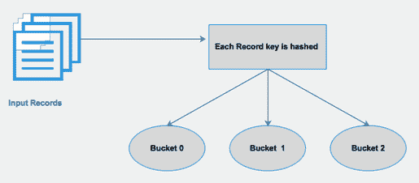
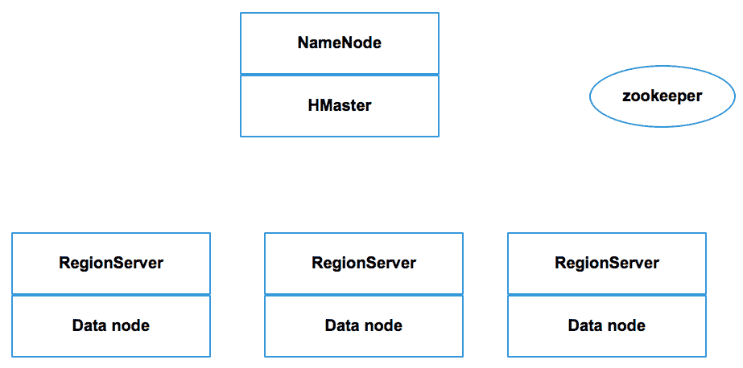

# Hadoop 中的数据建模

到目前为止，我们已经学习了如何创建 Hadoop 集群以及如何将数据加载到其中。在前一章中，我们学习了各种数据摄取工具和技术。正如我们现在所知，市场上有各种各样的开源工具，但是有一个单一的银弹工具可以承担我们所有的用例。每个数据摄取工具都有某些独特的功能；在典型的用例中，它们可以被证明是非常有效和有用的。例如，当用于从关系数据库管理系统导入和导出 Hadoop 数据时，Sqoop 更有用。

在本章中，我们将学习如何在 Hadoop 集群中存储和建模数据。像数据摄取工具一样，也有各种可用的数据存储。这些数据存储支持不同的数据模型——即列数据存储、键值对等；而且它们支持各种文件格式，比如 ORC、Parquet 和 AVRO 等等。有非常受欢迎的数据存储，这些天在生产中被广泛使用，例如，Hive、HBase、Cassandra 等等。我们将进一步了解以下两种数据存储和数据建模技术:

*   Apache 蜂巢
*   阿帕契巴塞

首先，我们将从基本概念开始，然后我们将学习如何应用现代数据建模技术来加快数据访问。简而言之，我们将在本章中讨论以下主题:

*   Apache Hive 和 RDBMS
*   支持的数据类型
*   蜂巢架构及其工作原理

# Apache 蜂巢

Hive 是 Hadoop 中的一个数据处理工具。正如我们在上一章中了解到的，数据摄取工具在 Hadoop 中加载数据并生成 HDFS 文件；我们需要根据我们的业务需求来查询这些数据。我们可以使用 MapReduce 编程访问数据。但是使用 MapReduce 进行数据访问非常慢。要访问几行 HDFS 文件，我们必须编写单独的映射器、减速器和驱动程序代码。所以，为了避免这种复杂性，Apache 引入了 Hive。Hive 支持一个类似于 SQL 的接口，该接口有助于使用 SQL 命令访问相同行的 HDFS 文件。蜂巢最初由脸书开发，但后来被阿帕奇公司接管。

# Apache Hive 和 RDBMS

我提到 Hive 提供了一个类似 SQL 的接口。考虑到这一点，出现的问题是:*Hive 和 Hadoop 上的 RDBMS 一样吗？*答案是*没有*。Hive 不是数据库。Hive 不存储任何数据。Hive 将表信息存储为元数据的一部分，称为模式，并指向 HDFS 的文件。Hive 使用名为 **HiveQL** ( **HQL** )的类似 SQL 的接口访问存储在 HDFS 文件中的数据。Hive 支持在 HDFS 访问和修改数据的 SQL 命令。Hive 不是 OLTP 的工具。它不提供任何行级插入、更新或删除。Hive 的当前版本(0.14 版本)确实支持使用完整的 ACID 属性进行插入、更新和删除，但是该功能效率不高。此外，此功能不支持所有文件格式。例如，更新仅支持 ORC 文件格式。基本上，Hive 是为批处理而设计的，不像 RDBMS 那样支持事务处理。因此，Hive 更适合数据仓库应用程序，用于提供数据汇总、查询和分析。在内部，Hive SQL 查询由其编译器转换为 MapReduce。用户无需担心编写任何复杂的映射器和缩减器代码。Hive 仅支持查询结构化数据。使用 Hive SQL 访问非结构化数据非常复杂。您可能需要为此编写自己的自定义函数。Hive 支持各种文件格式，如文本文件、序列文件、ORC 和 Parquet，它们提供了显著的数据压缩。

# 支持的数据类型

Hive 版本 0.14 支持以下数据类型:

| **数据类型组** | **数据类型** | **格式** |
| 线 | `STRING` | `column_name STRING` |
| `VARCHAR` | `column_name VARCHAR(max_length)` |
| `CHAR` | `column_name CHAR(length)` |
| 数字的 | `TINYINT` | `column_name TINYINT` |
| `SMALLINT` | `column_name SMALLINT` |
| `INT` | `column_name INT` |
| `BIGINT` | `column_name BIGINT` |
| `FLOAT` | `column_name FLOAT` |
| `DOUBLE` | `column_name DOUBLE` |
| `DECIMAL` | `column_name DECIMAL[(precision[,scale])]` |
| 日期/时间类型 | `TIMESTAMP` | `column_name TIMESTAMP` |
| `DATE` | `column_name DATE` |
| `INTERVAL` | `column_name INTERVAL year to month` |
| 杂项类型 | `BOOLEAN` | `column_name BOOLEAN` |
| `BINARY` | `column_name BINARY` |
| 复数型 | `ARRAY` | `column_name ARRAY < type >` |
| `MAPS` | `column_name MAP < primitive_type, type >` |
| `STRUCT` | `column_name STRUCT < name : type [COMMENT 'comment_string'] >` |
| `UNION` | `column_name UNIONTYPE <int, double, array, string>` |

# 蜂巢是如何工作的

Hive 数据库由由分区组成的表组成。可以通过简单的查询语言访问数据，Hive 支持覆盖或追加数据。在特定的数据库中，表中的数据是序列化的，每个表都有一个对应的 HDFS 目录。每个表都可以细分为多个分区，这些分区决定了数据在表目录的子目录中的分布方式。分区内的数据可以进一步分解成桶。

# 蜂巢建筑

以下是 Hive 架构的表示:


上图显示 Hive 架构分为三个部分——即客户端、服务和元存储。配置单元 SQL 的执行如下:

*   **Hive SQL 查询**:可以使用以下方式之一向 Hive 服务器提交 Hive 查询:WebUI、JDBC/ODBC 应用程序和 Hive CLI。对于基于节俭的应用程序，它将提供一个节俭客户端进行通信。
*   **查询执行**:Hive 服务器一旦接收到查询，就会进行编译，转换成性能更好的优化查询计划，并转换成 MapReduce 作业。在这个过程中，配置单元服务器与元存储交互以获取查询元数据。
*   **作业执行**:MapReduce 作业在 Hadoop 集群上执行。

# 蜂巢数据模型管理

Hive 以以下四种方式处理数据:

*   蜂巢表
*   蜂巢表分区
*   蜂巢分区
*   蜂巢视图

我们将在接下来的章节中详细介绍它们。

# 蜂巢表

配置单元表非常类似于任何关系数据库管理系统表。表格分为行和列。每个列(字段)都用正确的名称和数据类型定义。我们已经在*支持的数据类型*部分看到了 Hive 中所有可用的数据类型。配置单元表分为两种类型:

*   托管表
*   外部表格

我们将在下面的章节中了解这两种类型。

# 托管表

以下是定义 Hive 托管表的示例命令:

```sh
Create Table < managed_table_name>  
   Column1 <data type>, 
   Column2 <data type>, 
   Column3 <data type> 
Row format delimited Fields Terminated by "t"; 
```

当执行前面的查询时，Hive 会创建该表，元数据也会相应地在 metastore 中更新。但是桌子是空的。因此，可以通过执行以下命令将数据加载到该表中:

```sh
Load data inpath <hdfs_folder_name> into table <managed_table_name>; 
```

执行前一个命令后，数据从`<hdfs_folder_name>`移动到 Hive 表的默认位置`/user/hive/warehouse/<managed_table_name`。该默认文件夹`/user/hive/warehouse`在`hive-site.xml`中定义，可以更改为任何文件夹。现在，如果我们决定删除该表，我们可以通过发出以下命令来完成:

```sh
Drop table <managed_table_name>; 
```

`/user/hive/warehouse/<managed_table_name`文件夹将被删除，存储在元存储中的元数据将被删除。

# 外部表格

以下是定义 Hive 外部表的示例命令:

```sh
Create Table < external_table_name>  
   Column1 <data type>, 
   Column2 <data type>, 
   Column3 <data type> 
Row format delimited Fields Terminated by "t" 
Location <hdfs_folder_name>; 
```

当执行前面的查询时，Hive 会创建该表，元数据也会相应地在 metastore 中更新。但是，同样，桌子是空的。因此，可以通过执行以下命令将数据加载到该表中:

```sh
Load data inpath <hdfs_folder_name> into table <external_table_name>; 
```

该命令不会将任何文件移动到任何文件夹，而是创建一个指向文件夹位置的指针，并在 metastore 的元数据中进行更新。文件保持在查询的相同位置(`<hdfs_folder_name>`)。现在，如果我们决定删除该表，我们可以通过发出以下命令来完成:

```sh
Drop table <managed_table_name>;  
```

文件夹`/user/hive/warehouse/<managed_table_name`不会被删除，只会删除元存储中存储的元数据。文件保留在同一个位置— `<hdfs_folder_name>`。

# 蜂巢表分区

对表进行分区意味着根据分区键的值将表分成不同的部分。分区键可以是任何列，例如日期、部门、国家等。由于数据以部分形式存储，查询响应时间变得更快。分区不是扫描整个表，而是在主表文件夹中创建子文件夹。Hive 将根据查询的`WHERE`子句只扫描表的特定部分。配置单元表分区类似于任何 RDBMS 表分区。目的也是一样的。随着我们不断向表中插入数据，表的数据大小会变大。假设我们创建了一个`ORDERS`表，如下所示:

```sh
hive> create database if not exists ORDERS; 
OK 
Time taken: 0.036 seconds 

hive> use orders; 
OK 
Time taken: 0.262 seconds 

hive> CREATE TABLE if not exists ORDEERS_DATA 
    > (Ord_id INT, 
    > Ord_month INT, 
    > Ord_customer_id INT, 
    > Ord_city  STRING, 
    > Ord_zip   STRING, 
    > ORD_amt   FLOAT 
    > ) 
    > ROW FORMAT DELIMITED 
    > FIELDS TERMINATED BY  ',' 
    > ; 
OK 
Time taken: 0.426 seconds 
hive> 
```

我们将加载如下示例文件`ORDERS_DATA`表，如下所示:

```sh
101,1,100,'Los Angeles','90001',1200 
102,2,200,'Los Angeles','90002',1800 
103,3,300,'Austin','78701',6500 
104,4,400,'Phoenix','85001',7800 
105,5,500,'Beverly Hills','90209',7822 
106,6,600,'Gaylord','49734',8900 
107,7,700,'Los Angeles','90001',7002 
108,8,800,'Los Angeles','90002',8088 
109,9,900,'Reno','89501',6700 
110,10,1000,'Los Angeles','90001',8500 
111,10,1000,'Logan','84321',2300 
112,10,1000,'Fremont','94539',9500 
113,10,1000,'Omaha','96245',7500 
114,11,2000,'New York','10001',6700 
115,12,3000,'Los Angeles','90003',1000 
```

然后我们将`orders.txt`加载到`/tmp` HDFS 文件夹:

```sh
[root@sandbox order_data]# hadoop fs -put /root/order_data/orders.txt /tmp 

[root@sandbox order_data]# hadoop fs -ls /tmp 
Found 3 items 
-rw-r--r--   1 root      hdfs        530 2017-09-02 18:06 /tmp/orders.txt 
```

如下所示加载`ORDERS_DATA`表:

```sh
hive> load data inpath '/tmp/orders.txt' into table ORDERS_DATA; 
Loading data to table orders.orders_data 
Table orders.orders_data stats: [numFiles=1, numRows=0, totalSize=530, rawDataSize=0] 
OK 
Time taken: 0.913 seconds 

hive> select * from ORDERS_DATA; 
OK 
101      1     100   'Los Angeles'     '90001'     1200.0 
102      2     200   'Los Angeles'     '90002'     1800.0 
103      3     300   'Austin'    '78701'     6500.0 
104      4     400   'Phoenix'   '85001'     7800.0 
105      5     500   'Beverly Hills'   '90209'     7822.0 
106      6     600   'Gaylord'   '49734'     8900.0 
107      7     700   'Los Angeles'     '90001'     7002.0 
108      8     800   'Los Angeles'     '90002'     8088.0 
109      9     900   'Reno'      '89501'     6700.0 
110      10    1000  'Los Angeles'     '90001'     8500.0 
111      10    1000  'Logan'     '84321'     2300.0 
112      10    1000  'Fremont'   '94539'     9500.0 
113      10    1000  'Omaha'     '96245'     7500.0 
114      11    2000  'New York'  '10001'     6700.0 
115      12    3000  'Los Angeles'     '90003'     1000.0 
Time taken: 0.331 seconds, Fetched: 15 row(s) 
```

假设我们想在`ORDERS_DATA`表中插入城市数据。每个城市的订单数据大小为 1 TB。所以`ORDERS_DATA`表的总数据量为 15 TB(表中有 15 个城市)。现在，如果我们编写以下查询来获取在`Los Angeles`预订的所有订单:

```sh
hive>  select * from ORDERS where Ord_city = 'Los Angeles' ; 

```

查询将运行得非常慢，因为它必须扫描整个表。显而易见的想法是，我们可以为每个城市创建 10 个不同的`orders`表，并将`orders`数据存储在`ORDERS_DATA`表的相应城市中。但除此之外，我们可以对`ORDERS_PART`表进行如下划分:

```sh
hive> use orders; 

hive> CREATE TABLE orders_part 
    > (Ord_id INT, 
    > Ord_month INT, 
    > Ord_customer_id INT, 
    > Ord_zip   STRING, 
    > ORD_amt   FLOAT 
    > ) 
    > PARTITIONED BY  (Ord_city INT) 
    > ROW FORMAT DELIMITED 
    > FIELDS TERMINATED BY  ',' 
    > ; 
OK 
Time taken: 0.305 seconds 
hive> 
```

现在，Hive 将表组织成分区，以便根据列或分区键将相似类型的数据分组在一起。假设每个城市有 10 个`orders`档案，也就是`Orders1.txt`到`Orders10.txt`。以下示例显示了如何将每个月的文件加载到每个对应的分区:

```sh
load data inpath '/tmp/orders.txt' into table orders_part partition(Ord_city='Los Angeles'); 
load data inpath '/tmp/orders.txt' into table orders_part partition(Ord_city='Austin'); 
load data inpath '/tmp/orders.txt' into table orders_part partition(Ord_city='Phoenix'); 
load data inpath '/tmp/orders.txt' into table orders_part partition(Ord_city='Beverly Hills'); 
load data inpath '/tmp/orders.txt' into table orders_part partition(Ord_city='Gaylord'); 
load data inpath '/tmp/orders.txt' into table orders_part partition(Ord_city=Reno'); 
load data inpath '/tmp/orders.txt' into table orders_part partition(Ord_city='Fremont'); 
load data inpath '/tmp/orders.txt' into table orders_part partition(Ord_city='Omaha'); 
load data inpath '/tmp/orders.txt' into table orders_part partition(Ord_city='New York'); 
load data inpath '/tmp/orders.txt' into table orders_part partition(Ord_city='Logan'); 

[root@sandbox order_data]# hadoop fs -ls /apps/hive/warehouse/orders.db/orders_part 
Found 10 items 
drwxrwxrwx   - root hdfs          0 2017-09-02 18:32 /apps/hive/warehouse/orders.db/orders_part/ord_city=Austin 
drwxrwxrwx   - root hdfs          0 2017-09-02 18:32 /apps/hive/warehouse/orders.db/orders_part/ord_city=Beverly Hills 
drwxrwxrwx   - root hdfs          0 2017-09-02 18:32 /apps/hive/warehouse/orders.db/orders_part/ord_city=Fremont 
drwxrwxrwx   - root hdfs          0 2017-09-02 18:32 /apps/hive/warehouse/orders.db/orders_part/ord_city=Gaylord 
drwxrwxrwx   - root hdfs          0 2017-09-02 18:33 /apps/hive/warehouse/orders.db/orders_part/ord_city=Logan 
drwxrwxrwx   - root hdfs          0 2017-09-02 18:32 /apps/hive/warehouse/orders.db/orders_part/ord_city=Los Angeles 
drwxrwxrwx   - root hdfs          0 2017-09-02 18:32 /apps/hive/warehouse/orders.db/orders_part/ord_city=New York 
drwxrwxrwx   - root hdfs          0 2017-09-02 18:32 /apps/hive/warehouse/orders.db/orders_part/ord_city=Omaha 
drwxrwxrwx   - root hdfs          0 2017-09-02 18:32 /apps/hive/warehouse/orders.db/orders_part/ord_city=Phoenix 
drwxrwxrwx   - root hdfs          0 2017-09-02 18:33 /apps/hive/warehouse/orders.db/orders_part/ord_city=Reno 
[root@sandbox order_data]  
```

对数据进行分区可以极大地提高查询的性能，因为数据已经根据列值被分离到文件中，这可以减少映射器的数量，并极大地减少生成的 MapReduce 作业中数据的洗牌和排序量。

# 配置静态分区和动态分区

如果您想在 Hive 中使用静态分区，应该按如下方式设置属性:

```sh
set hive.mapred.mode = strict;  
```

在前面的例子中，我们已经看到，我们必须将每个月度订单文件分别插入到每个静态分区中。与动态分区相比，静态分区节省了加载数据的时间。我们必须单独向表中添加一个分区，并将文件移动到表的分区中。如果我们有很多分区，编写一个查询来加载每个分区中的数据可能会变得很麻烦。我们可以通过动态分区来克服这个问题。在动态分区中，我们可以用一条 SQL 语句将数据插入分区表，但仍然在每个分区中加载数据。与静态分区相比，动态分区加载数据的时间更长。当表中存储了大量数据时，动态分区是合适的。如果您想对多个列进行分区，但不知道它们有多少列，那么动态分区也是合适的。以下是您应该允许的配置单元动态分区属性:

```sh
SET hive.exec.dynamic.partition = true;
SET hive.exec.dynamic.partition.mode = nonstrict;  
```

下面是一个动态分区的例子。假设我们要将数据从`ORDERS_PART`表加载到名为`ORDERS_NEW`的新表中:

```sh
hive> use orders; 
OK 
Time taken: 1.595 seconds 
hive> drop table orders_New; 
OK 
Time taken: 0.05 seconds 
hive> CREATE TABLE orders_New 
    > (Ord_id INT, 
    > Ord_month INT, 
    > Ord_customer_id INT, 
    > Ord_city  STRING, 
    > Ord_zip   STRING, 
    > ORD_amt   FLOAT 
    > ) 
    > ) 
    > PARTITIONED BY  (Ord_city STRING) 
    > ROW FORMAT DELIMITED 
    > FIELDS TERMINATED BY  ',' 
    > ; 
OK 
Time taken: 0.458 seconds 
hive> 
```

将数据从`ORDERS_PART`表载入`ORDER_NEW`表。这里，Hive 将动态加载`ORDERS_NEW`表的所有分区:

```sh
hive> SET hive.exec.dynamic.partition = true; 
hive> SET hive.exec.dynamic.partition.mode = nonstrict; 
hive>  
    > insert into table orders_new  partition(Ord_city) select * from orders_part; 
Query ID = root_20170902184354_2d409a56-7bfc-416e-913a-2323ea3b339a 
Total jobs = 1 
Launching Job 1 out of 1 
Status: Running (Executing on YARN cluster with App id application_1504299625945_0013) 

-------------------------------------------------------------------------------- 
        VERTICES      STATUS  TOTAL  COMPLETED  RUNNING  PENDING  FAILED  KILLED 
-------------------------------------------------------------------------------- 
Map 1 ..........   SUCCEEDED      1          1        0        0       0       0 
-------------------------------------------------------------------------------- 
VERTICES: 01/01  [==========================>>] 100%  ELAPSED TIME: 3.66 s      
-------------------------------------------------------------------------------- 
Loading data to table orders.orders_new partition (ord_city=null) 
    Time taken to load dynamic partitions: 2.69 seconds 
   Loading partition {ord_city=Logan} 
   Loading partition {ord_city=Los Angeles} 
   Loading partition {ord_city=Beverly Hills} 
   Loading partition {ord_city=Reno} 
   Loading partition {ord_city=Fremont} 
   Loading partition {ord_city=Gaylord} 
   Loading partition {ord_city=Omaha} 
   Loading partition {ord_city=Austin} 
   Loading partition {ord_city=New York} 
   Loading partition {ord_city=Phoenix} 
    Time taken for adding to write entity : 3 
Partition orders.orders_new{ord_city=Austin} stats: [numFiles=1, numRows=1, totalSize=13, rawDataSize=12] 
Partition orders.orders_new{ord_city=Beverly Hills} stats: [numFiles=1, numRows=1, totalSize=13, rawDataSize=12] 
Partition orders.orders_new{ord_city=Fremont} stats: [numFiles=1, numRows=1, totalSize=15, rawDataSize=14] 
Partition orders.orders_new{ord_city=Gaylord} stats: [numFiles=1, numRows=1, totalSize=13, rawDataSize=12] 
Partition orders.orders_new{ord_city=Logan} stats: [numFiles=1, numRows=1, totalSize=15, rawDataSize=14] 
Partition orders.orders_new{ord_city=Los Angeles} stats: [numFiles=1, numRows=6, totalSize=82, rawDataSize=76] 
Partition orders.orders_new{ord_city=New York} stats: [numFiles=1, numRows=1, totalSize=15, rawDataSize=14] 
Partition orders.orders_new{ord_city=Omaha} stats: [numFiles=1, numRows=1, totalSize=15, rawDataSize=14] 
Partition orders.orders_new{ord_city=Phoenix} stats: [numFiles=1, numRows=1, totalSize=13, rawDataSize=12] 
Partition orders.orders_new{ord_city=Reno} stats: [numFiles=1, numRows=1, totalSize=13, rawDataSize=12] 
OK 
Time taken: 10.493 seconds 
hive>  
```

让我们看看`ORDERS_NEW`中创建了多少分区:

```sh
hive> show partitions ORDERS_NEW; 
OK 
ord_city=Austin 
ord_city=Beverly Hills 
ord_city=Fremont 
ord_city=Gaylord 
ord_city=Logan 
ord_city=Los Angeles 
ord_city=New York 
ord_city=Omaha 
ord_city=Phoenix 
ord_city=Reno 
Time taken: 0.59 seconds, Fetched: 10 row(s) 
hive>  
```

现在很清楚何时使用静态和动态分区。在将数据加载到配置单元表中之前，如果事先知道分区列值，则可以使用静态分区。在动态分区的情况下，分区列值只有在将数据加载到配置单元表中时才知道。

# 蜂巢分区

分时段是一种将大型数据集分解成更易于管理的组的技术。分时段是基于散列函数的。当一个表被分时段时，所有具有相同列值的表记录将进入同一个时段。物理上，每个存储桶就像一个分区一样，是表文件夹中的一个文件。在分区表中，Hive 可以将数据分组到多个文件夹中。但是，当分区数量有限，并且数据在所有分区中平均分布时，分区证明是有效的。如果有大量的分区，那么它们的使用效率就会降低。所以在这种情况下，我们可以使用 bucketing。我们可以在创建表的过程中显式地创建多个桶。

# 蜂巢桶是如何工作的

下图详细显示了 Hive bucketing 的工作原理:



如果我们决定在一个表中为一列创建三个桶，在我们的示例中为(`Ord_city`)，那么 Hive 将创建三个桶，编号为 0-2 ( *n-1* )。在记录插入期间，Hive 将对每条记录的`Ord_city`列应用哈希函数来决定哈希键。然后 Hive 将对每个哈希值应用一个模运算符。我们也可以在非分区表中使用 bucketing。但是，当分块特性用于分区表时，我们将获得最佳性能。倒挂有两个主要好处:

*   **提高查询性能**:在同一个桶列的连接过程中，我们可以显式指定桶的数量。由于每个桶的数据大小相同，映射端连接在桶表中的性能优于非桶表。在地图端连接中，左侧表桶将确切知道右侧桶中的数据集，以便高效地执行表连接。
*   **改进采样**:因为数据已经被分割成更小的块了。

让我们考虑一下我们的`ORDERS_DATA`表示例。在`CITY`列中进行分区。可能并非所有城市的订单分配都是平等的。有些城市的订单可能比其他城市多。在这种情况下，我们将有不平衡的分区。这将影响查询性能。对订单多的城市的查询将比订单少的城市慢。我们可以通过打破僵局来解决这个问题。表中的桶由表 DDL 中的`CLUSTER`子句定义。以下示例详细解释了 bucketing 功能。

# 在非分区表中创建桶

首先，我们将创建一个`ORDERS_BUCK_non_partition`表:

```sh
SET hive.exec.dynamic.partition = true; 
SET hive.exec.dynamic.partition.mode = nonstrict; 
SET hive.exec.mx_dynamic.partition=20000; 
SET hive.exec.mx_dynamic.partition.pernode=20000; 
SET hive.enforce.bucketing = true; 

hive> use orders; 
OK 
Time taken: 0.221 seconds 
hive>  
    > CREATE TABLE ORDERS_BUCKT_non_partition 
    > (Ord_id INT, 
    > Ord_month INT, 
    > Ord_customer_id INT, 
    > Ord_city  STRING, 
    > Ord_zip   STRING, 
    > ORD_amt   FLOAT 
    > ) 
    > CLUSTERED BY (Ord_city) into 4 buckets stored as textfile; 
OK 
Time taken: 0.269 seconds 
hive>  

```

To refer to all Hive `SET` configuration parameters, please use this URL:
[https://cwiki.apache.org/confluence/display/Hive/Configuration+Properties](https://cwiki.apache.org/confluence/display/Hive/Configuration+Properties).

加载新创建的非分区桶表:

```sh
hive> insert into ORDERS_BUCKT_non_partition select * from orders_data; 
Query ID = root_20170902190615_1f557644-48d6-4fa1-891d-2deb7729fa2a 
Total jobs = 1 
Launching Job 1 out of 1 
Tez session was closed. Reopening... 
Session re-established. 
Status: Running (Executing on YARN cluster with App id application_1504299625945_0014) 

-------------------------------------------------------------------------------- 
        VERTICES      STATUS  TOTAL  COMPLETED  RUNNING  PENDING  FAILED  KILLED 
-------------------------------------------------------------------------------- 
Map 1 ..........   SUCCEEDED      1          1        0        0       0       0 
Reducer 2 ......   SUCCEEDED      4          4        0        0       0       0 
-------------------------------------------------------------------------------- 
VERTICES: 02/02  [==========================>>] 100%  ELAPSED TIME: 9.58 s      
-------------------------------------------------------------------------------- 
Loading data to table orders.orders_buckt_non_partition 
Table orders.orders_buckt_non_partition stats: [numFiles=4, numRows=15, totalSize=560, rawDataSize=545] 
OK 
Time taken: 15.55 seconds 
hive> 

```

以下命令显示 Hive 已经在表中创建了四个存储桶(文件夹)`00000[0-3]_0`:

```sh

[root@sandbox order_data]# hadoop fs -ls /apps/hive/warehouse/orders.db/orders_buckt_non_partition 
Found 4 items 
-rwxrwxrwx   1 root hdfs         32 2017-09-02 19:06 /apps/hive/warehouse/orders.db/orders_buckt_non_partition/000000_0 
-rwxrwxrwx   1 root hdfs        110 2017-09-02 19:06 /apps/hive/warehouse/orders.db/orders_buckt_non_partition/000001_0 
-rwxrwxrwx   1 root hdfs        104 2017-09-02 19:06 /apps/hive/warehouse/orders.db/orders_buckt_non_partition/000002_0 
-rwxrwxrwx   1 root hdfs        314 2017-09-02 19:06 /apps/hive/warehouse/orders.db/orders_buckt_non_partition/000003_0 
[root@sandbox order_data]# 
```

# 在分区表中创建桶

首先，我们将创建一个桶形分区表。这里，表在`Ord_city`列上被划分为四个桶，但又被细分为`Ord_zip`列:

```sh
SET hive.exec.dynamic.partition = true; 
SET hive.exec.dynamic.partition.mode = nonstrict; 
SET hive.exec.mx_dynamic.partition=20000; 
SET hive.exec.mx_dynamic.partition.pernode=20000; 
SET hive.enforce.bucketing = true; 

hive> CREATE TABLE ORDERS_BUCKT_partition 
    > (Ord_id INT, 
    > Ord_month INT, 
    > Ord_customer_id INT, 
    > Ord_zip   STRING, 
    > ORD_amt   FLOAT 
    > ) 
    > PARTITIONED BY  (Ord_city STRING) 
    > CLUSTERED BY (Ord_zip) into 4 buckets stored as textfile; 
OK 
Time taken: 0.379 seconds 
```

用具有动态分区的另一个分区表(`ORDERS_PART`)加载分桶分区表:

```sh
hive> SET hive.exec.dynamic.partition = true; 
hive> SET hive.exec.dynamic.partition.mode = nonstrict; 
hive> SET hive.exec.mx_dynamic.partition=20000; 
Query returned non-zero code: 1, cause: hive configuration hive.exec.mx_dynamic.partition does not exists. 
hive> SET hive.exec.mx_dynamic.partition.pernode=20000; 
Query returned non-zero code: 1, cause: hive configuration hive.exec.mx_dynamic.partition.pernode does not exists. 
hive> SET hive.enforce.bucketing = true; 
hive> insert into ORDERS_BUCKT_partition partition(Ord_city) select * from orders_part; 
Query ID = root_20170902194343_dd6a2938-6aa1-49f8-a31e-54dafbe8d62b 
Total jobs = 1 
Launching Job 1 out of 1 
Status: Running (Executing on YARN cluster with App id application_1504299625945_0017) 

-------------------------------------------------------------------------------- 
        VERTICES      STATUS  TOTAL  COMPLETED  RUNNING  PENDING  FAILED  KILLED 
-------------------------------------------------------------------------------- 
Map 1 ..........   SUCCEEDED      1          1        0        0       0       0 
Reducer 2 ......   SUCCEEDED      4          4        0        0       0       0 
-------------------------------------------------------------------------------- 
VERTICES: 02/02  [==========================>>] 100%  ELAPSED TIME: 7.13 s      
-------------------------------------------------------------------------------- 
Loading data to table orders.orders_buckt_partition partition (ord_city=null) 
    Time taken to load dynamic partitions: 2.568 seconds 
   Loading partition {ord_city=Phoenix} 
   Loading partition {ord_city=Logan} 
   Loading partition {ord_city=Austin} 
   Loading partition {ord_city=Fremont} 
   Loading partition {ord_city=Beverly Hills} 
   Loading partition {ord_city=Los Angeles} 
   Loading partition {ord_city=New York} 
   Loading partition {ord_city=Omaha} 
   Loading partition {ord_city=Reno} 
   Loading partition {ord_city=Gaylord} 
    Time taken for adding to write entity : 3 
Partition orders.orders_buckt_partition{ord_city=Austin} stats: [numFiles=1, numRows=1, totalSize=22, rawDataSize=21] 
Partition orders.orders_buckt_partition{ord_city=Beverly Hills} stats: [numFiles=1, numRows=1, totalSize=29, rawDataSize=28] 
Partition orders.orders_buckt_partition{ord_city=Fremont} stats: [numFiles=1, numRows=1, totalSize=23, rawDataSize=22] 
Partition orders.orders_buckt_partition{ord_city=Gaylord} stats: [numFiles=1, numRows=1, totalSize=23, rawDataSize=22] 
Partition orders.orders_buckt_partition{ord_city=Logan} stats: [numFiles=1, numRows=1, totalSize=26, rawDataSize=25] 
Partition orders.orders_buckt_partition{ord_city=Los Angeles} stats: [numFiles=1, numRows=6, totalSize=166, rawDataSize=160] 
Partition orders.orders_buckt_partition{ord_city=New York} stats: [numFiles=1, numRows=1, totalSize=23, rawDataSize=22] 
Partition orders.orders_buckt_partition{ord_city=Omaha} stats: [numFiles=1, numRows=1, totalSize=25, rawDataSize=24] 
Partition orders.orders_buckt_partition{ord_city=Phoenix} stats: [numFiles=1, numRows=1, totalSize=23, rawDataSize=22] 
Partition orders.orders_buckt_partition{ord_city=Reno} stats: [numFiles=1, numRows=1, totalSize=20, rawDataSize=19] 
OK 
Time taken: 13.672 seconds 
hive>  
```

# 蜂巢视图

配置单元视图是一个逻辑表。它就像任何 RDBMS 视图一样。概念是一样的。创建视图时，Hive 不会在其中存储任何数据。创建视图时，Hive 会冻结元数据。Hive 不支持任何 RDBMS 的物化视图概念。视图的基本目的是隐藏查询的复杂性。有时，HQL 包含复杂的连接、子查询或筛选器。在视图的帮助下，整个查询可以在虚拟表中展平。

当在基础表上创建视图时，对该表的任何更改，甚至添加或删除该表，都会在视图中失效。此外，创建视图时，它只更改元数据。但是当查询访问该视图时，它会触发 MapReduce 作业。视图是没有关联存储的纯逻辑对象(Hive 中目前不支持物化视图)。当查询引用视图时，将对视图的定义进行评估，以便生成一组行供查询进一步处理。(这是概念性的描述。事实上，作为查询优化的一部分，Hive 可能会将视图的定义与查询相结合，例如，将过滤器从查询下推到视图中。)

创建视图时，视图的架构被冻结；对基础表的后续更改(例如，添加一列)不会反映在视图的架构中。如果基础表以不兼容的方式被删除或更改，后续查询无效视图的尝试将会失败。视图是只读的，不能作为`LOAD` / `INSERT` / `ALTER`更改元数据的目标。视图可能包含`ORDER BY`和`LIMIT`条款。如果引用查询也包含这些子句，查询级子句将在 view 子句之后(以及查询中的任何其他操作之后)进行计算。例如，如果一个视图指定了`LIMIT 5`，一个引用查询作为(`select * from v LIMIT 10`)执行，那么最多将返回五行。

# 视图的语法

让我们看几个观点的例子:

```sh
CREATE VIEW [IF NOT EXISTS] [db_name.]view_name [(column_name [COMMENT column_comment], ...) ] 
  [COMMENT view_comment] 
  [TBLPROPERTIES (property_name = property_value, ...)] 
  AS SELECT ...;
```

我将使用以下几个例子来演示视图的优势。假设我们有两个表，`Table_X`和`Table_Y`，模式如下:`Table_XXCol_1`弦、`XCol_2`弦、`XCol_3`弦、`Table_YYCol_1`弦、`YCol_2`弦、`YCol_3`弦和`YCol_4`弦。要创建与基表完全相同的视图，请使用以下代码:

```sh
Create view table_x_view as select * from Table_X; 
```

要在基表的选定列上创建视图，请使用以下命令:

```sh
Create view table_x_view as select xcol_1,xcol_3  from Table_X; 
```

要创建一个视图来过滤基表列的值，我们可以使用:

```sh
Create view table_x_view as select * from Table_X where XCol_3 > 40 and  XCol_2 is not null; 
```

要创建隐藏查询复杂性的视图:

```sh
create view table_union_view  as select XCol_1, XCol_2, XCol_3,Null from Table_X 
   where XCol_2  = "AAA" 
   union all 
   select YCol_1, YCol_2, YCol_3, YCol_4 from Table_Y 
   where YCol_3 = "BBB"; 

   create view table_join_view as select * from Table_X 
   join Table_Y on Table_X. XCol_1 = Table_Y. YCol_1; 
```

# 蜂巢索引

索引的主要目的是轻松搜索记录并加快查询速度。Hive 索引的目标是提高对表中某些列的查询查找速度。如果没有索引，带有像`WHERE tab1.col1 = 10`这样的谓词的查询将加载整个表或分区，并处理所有的行。但是如果`col1`有索引，那么只需要加载和处理文件的一部分。索引能够提供的查询速度的提高是以创建索引的额外处理和存储索引的磁盘空间为代价的。有两种类型的索引:

*   紧凑索引
*   位图索引

主要区别在于将行的映射值存储在不同的块中。

# 紧凑索引

在 HDFS，数据以块的形式存储。但是扫描哪个数据存储在哪个块中是很耗时的。紧凑索引存储索引列的值及其`blockId`。所以查询不会转到表中。相反，查询将直接转到紧凑索引，其中存储了列值和`blockId`。不需要扫描所有的块来寻找数据！因此，在执行查询时，它将首先检查索引，然后直接进入该块。

# 位图索引

位图索引将索引列值和行列表的组合存储为位图。位图索引通常用于具有不同值的列。我们来回顾几个例子:基表、`Table_XXCol_1`整数、`XCol_2`字符串、`XCol_3`整数、`XCol_4`字符串。创建索引:

```sh
CREATE INDEX table_x_idx_1 ON TABLE table_x (xcol_1) AS 'COMPACT';  
SHOW INDEX ON table_x_idx;  
DROP INDEX table_x_idx ON table_x; 

CREATE INDEX table_x_idx_2 ON TABLE table_x (xcol_1) AS 'COMPACT' WITH DEFERRED REBUILD;  
ALTER INDEX table_x_idx_2 ON table_x REBUILD;  
SHOW FORMATTED INDEX ON table_x; 
```

前面的索引是空的，因为它是用`DEFERRED REBUILD`子句创建的，不管表中是否包含任何数据。创建该索引后，需要使用`REBUILD`命令来构建索引结构。创建索引后，如果基础表中的数据发生变化，必须使用`REBUILD`命令更新索引。创建索引并将其存储在文本文件中:

```sh
CREATE INDEX table_x_idx_3 ON TABLE table_x (table_x) AS 'COMPACT' ROW FORMAT DELIMITED  
FIELDS TERMINATED BY 't'  
STORED AS TEXTFILE; 
```

创建位图索引:

```sh
CREATE INDEX table_x_bitmap_idx_4 ON TABLE table_x (table_x) AS 'BITMAP' WITH DEFERRED REBUILD;  
ALTER INDEX table_x_bitmap_idx_4 ON table03 REBUILD;  
SHOW FORMATTED INDEX ON table_x; 
DROP INDEX table_x_bitmap_idx_4 ON table_x; 
```

# 使用 Hive 的 JSON 文档

JSON，是一种结构化数据的最小可读格式。它主要用于在服务器和 web 应用程序之间传输数据，作为 XML 的替代。JSON 建立在两种结构上:

*   名称/值对的集合。在各种语言中，这被实现为对象、记录、结构、字典、哈希表、键控列表或关联数组。
*   有序的值列表。在大多数语言中，这是通过数组、向量、列表或序列来实现的。

请点击以下网址阅读更多关于 JSON 的内容:[http://www.json.org/](http://www.json.org/)。 [](http://www.json.org/) 

# 示例 1–使用 Hive (Hive 0.14 和更高版本)访问简单的 JSON 文档

在这个例子中，我们将看到如何使用 HiveQL 查询简单的 JSON 文档。假设我们想要访问`HiveSample-Json-simple.json`中的以下`Sample-Json-simple.json`文件:

```sh
{"username":"abc","tweet":"Sun shine is bright.","time1": "1366150681" } 
{"username":"xyz","tweet":"Moon light is mild .","time1": "1366154481" } 
```

查看`Sample-Json-simple.json`文件:

```sh
[root@sandbox ~]# cat Sample-Json-simple.json 
{"username":"abc","tweet":"Sun shine is bright.","timestamp": 1366150681 } 
{"username":"xyz","tweet":"Moon light is mild .","timestamp": 1366154481 } 
[root@sandbox ~]#  
```

将`Sample-Json-simple.json`载入 HDFS:

```sh
[root@sandbox ~]# hadoop fs -mkdir  /user/hive-simple-data/ 
[root@sandbox ~]# hadoop fs -put Sample-Json-simple.json /user/hive-simple-data/ 
```

创建外部配置单元表，`simple_json_table`:

```sh
hive> use orders; 
OK 
Time taken: 1.147 seconds 
hive>  
CREATE EXTERNAL TABLE simple_json_table ( 
username string, 
tweet string, 
time1 string) 
ROW FORMAT SERDE 'org.apache.hive.hcatalog.data.JsonSerDe' 
LOCATION '/user/hive-simple-data/'; 
OK 
Time taken: 0.433 seconds 
hive>  
```

现在验证记录:

```sh
hive> select * from simple_json_table ; 
OK 
abc      Sun shine is bright.    1366150681 
xyz      Moon light is mild .    1366154481 
Time taken: 0.146 seconds, Fetched: 2 row(s) 
hive>  
```

# 示例 2–使用 Hive 访问嵌套的 JSON 文档(Hive 0.14 和更高版本)

我们将看到如何使用 HiveQL 查询嵌套 JSON 文档。假设我们想要访问`HiveSample-Json-complex.json`中的以下`Sample-Json-complex.json`文件:

```sh
{"DocId":"Doc1","User1":{"Id":9192,"Username":"u2452","ShippingAddress":{"Address1":"6373 Sun Street","Address2":"apt 12","City":"Foster City","State":"CA"},"Orders":[{"ItemId":5343,"OrderDate":"12/23/2017"},{"ItemId":7362,"OrderDate":"12/24/2017"}]}} 
```

将`Sample-Json-simple.json`载入 HDFS:

```sh
[root@sandbox ~]# hadoop fs -mkdir  /user/hive-complex-data/ 
[root@sandbox ~]# hadoop fs -put Sample-Json-complex.json /user/hive-complex-data/ 
```

创建外部配置单元表，`json_nested_table`:

```sh
hive>  
CREATE EXTERNAL TABLE json_nested_table( 
DocId string, 
user1 struct<Id: int, username: string, shippingaddress:struct<address1:string,address2:string,city:string,state:string>, orders:array<struct<ItemId:int,orderdate:string>>> 
) 
ROW FORMAT SERDE 
'org.apache.hive.hcatalog.data.JsonSerDe' 
LOCATION 
'/user/hive-complex-data/'; 
OK 
Time taken: 0.535 seconds 
hive>  
```

核实记录:

```sh
hive> select DocId,user1.username,user1.orders FROM json_nested_table; 
OK 
Doc1     u2452   [{"itemid":5343,"orderdate":"12/23/2017"},{"itemid":7362,"orderdate":"12/24/2017"}] 
Time taken: 0.598 seconds, Fetched: 1 row(s) 
hive>  
```

# 示例 3–使用 Hive 和 Avro 的模式演化(Hive 0.14 和更高版本)

在生产中，我们必须改变表结构来满足新的业务需求。必须更改表架构才能添加/删除/重命名表列。任何这些变化都会对下游的 ETL 作业产生负面影响。为了避免这些，我们必须对 ETL 作业和目标表进行相应的更改。

模式演化允许您更新用于写入新数据的模式，同时保持与旧数据模式的向后兼容性。然后，您可以一起阅读它，就好像所有的数据都有一个模式一样。请在以下网址阅读更多关于 Avro 序列化的内容:[https://avro.apache.org/](https://avro.apache.org/)。在下面的例子中，我将演示 Avro 和 Hive 表如何在没有 ETL 作业失败的情况下吸收源表的模式变化。我们将在 MySQL 数据库中创建一个客户表，并使用 Avro 文件将其加载到目标 Hive 外部表中。然后，我们将向源表中再添加一列，以查看 Hive 表是如何在没有任何错误的情况下吸收该更改的。连接到 MySQL 创建源表(`customer`):

```sh
mysql -u root -p 

GRANT ALL PRIVILEGES ON *.* TO 'sales'@'localhost' IDENTIFIED BY 'xxx';  

mysql -u sales  -p 

mysql> create database orders; 

mysql> use orders; 

CREATE TABLE customer( 
cust_id INT , 
cust_name  VARCHAR(20) NOT NULL, 
cust_city VARCHAR(20) NOT NULL, 
PRIMARY KEY ( cust_id ) 
); 
```

将记录插入`customer`表:

```sh
INSERT into customer (cust_id,cust_name,cust_city) values (1,'Sam James','Austin'); 
INSERT into customer (cust_id,cust_name,cust_city) values (2,'Peter Carter','Denver'); 
INSERT into customer (cust_id,cust_name,cust_city) values (3,'Doug Smith','Sunnyvale'); 
INSERT into customer (cust_id,cust_name,cust_city) values (4,'Harry Warner','Palo Alto'); 

```

在 Hadoop 上，运行以下`sqoop`命令将`customer`表和 Avro 文件中的数据导入 HDFS:

```sh

hadoop fs -rmr /user/sqoop_data/avro 
sqoop import -Dmapreduce.job.user.classpath.first=true  
--connect jdbc:mysql://localhost:3306/orders   
--driver com.mysql.jdbc.Driver  
--username sales --password xxx  
--target-dir /user/sqoop_data/avro  
--table customer  
--as-avrodatafile  

```

验证目标 HDFS 文件夹:

```sh
[root@sandbox ~]# hadoop fs -ls /user/sqoop_data/avro 
Found 7 items 
-rw-r--r--   1 root hdfs          0 2017-09-09 08:57 /user/sqoop_data/avro/_SUCCESS 
-rw-r--r--   1 root hdfs        472 2017-09-09 08:57 /user/sqoop_data/avro/part-m-00000.avro 
-rw-r--r--   1 root hdfs        475 2017-09-09 08:57 /user/sqoop_data/avro/part-m-00001.avro 
-rw-r--r--   1 root hdfs        476 2017-09-09 08:57 /user/sqoop_data/avro/part-m-00002.avro 
-rw-r--r--   1 root hdfs        478 2017-09-09 08:57 /user/sqoop_data/avro/part-m-00003.avro 
```

创建一个 Hive 外部表来访问 Avro 文件:

```sh
use orders; 
drop table customer ; 
CREATE EXTERNAL TABLE customer  
( 
cust_id INT , 
cust_name  STRING , 
cust_city STRING   
) 
STORED AS AVRO 
location '/user/sqoop_data/avro/'; 
```

验证蜂巢`customer`表:

```sh
hive> select * from customer; 
OK 
1  Sam James   Austin 
2  Peter Carter      Denver 
3  Doug Smith  Sunnyvale 
4  Harry Warner      Palo Alto 
Time taken: 0.143 seconds, Fetched: 4 row(s) 
hive>  

```

完美！我们没有错误。我们使用 Avro 序列化成功地将源`customer`表导入到目标 Hive 表中。现在，我们向源表中添加一列，并再次导入它，以验证我们可以在没有任何模式更改的情况下访问目标 Hive 表。连接到 MySQL 并再添加一列:

```sh
mysql -u sales  -p 

mysql>  
ALTER TABLE customer 
ADD COLUMN cust_state VARCHAR(15) NOT NULL; 

mysql> desc customer; 
+------------+-------------+------+-----+---------+-------+ 
| Field      | Type        | Null | Key | Default | Extra | 
+------------+-------------+------+-----+---------+-------+ 
| cust_id    | int(11)     | NO   | PRI | 0       |       | 
| cust_name  | varchar(20) | NO   |     | NULL    |       | 
| cust_city  | varchar(20) | NO   |     | NULL    |       | 
| CUST_STATE | varchar(15) | YES  |     | NULL    |       | 
+------------+-------------+------+-----+---------+-------+ 
4 rows in set (0.01 sec) 

mysql>  
```

现在插入行:

```sh
INSERT into customer (cust_id,cust_name,cust_city,cust_state) values (5,'Mark Slogan','Huston','TX'); 
INSERT into customer (cust_id,cust_name,cust_city,cust_state) values (6,'Jane Miller','Foster City','CA'); 
```

在 Hadoop 上，运行以下`sqoop`命令导入`customer`表，以追加新的地址列和数据。我使用了`append`和`where "cust_id > 4"`参数只导入新行:

```sh
sqoop import -Dmapreduce.job.user.classpath.first=true  
--connect jdbc:mysql://localhost:3306/orders   
--driver com.mysql.jdbc.Driver  
--username sales --password xxx  
--table customer  
--append  
--target-dir /user/sqoop_data/avro  
--as-avrodatafile  
--where "cust_id > 4"  
```

验证 HDFS 文件夹:

```sh
[root@sandbox ~]# hadoop fs -ls /user/sqoop_data/avro 
Found 7 items 
-rw-r--r--   1 root hdfs          0 2017-09-09 08:57 /user/sqoop_data/avro/_SUCCESS 
-rw-r--r--   1 root hdfs        472 2017-09-09 08:57 /user/sqoop_data/avro/part-m-00000.avro 
-rw-r--r--   1 root hdfs        475 2017-09-09 08:57 /user/sqoop_data/avro/part-m-00001.avro 
-rw-r--r--   1 root hdfs        476 2017-09-09 08:57 /user/sqoop_data/avro/part-m-00002.avro 
-rw-r--r--   1 root hdfs        478 2017-09-09 08:57 /user/sqoop_data/avro/part-m-00003.avro 
-rw-r--r--   1 root hdfs        581 2017-09-09 09:00 /user/sqoop_data/avro/part-m-00004.avro 
-rw-r--r--   1 root hdfs        586 2017-09-09 09:00 /user/sqoop_data/avro/part-m-00005.avro 
```

现在，让我们验证我们的目标 Hive 表仍然能够访问旧的和新的 Avro 文件:

```sh
hive> select * from customer; 
OK 
1  Sam James   Austin 
2  Peter Carter      Denver 
3  Doug Smith  Sunnyvale 
4  Harry Warner      Palo Alto 
Time taken: 0.143 seconds, Fetched: 4 row(s 
```

太好了。没有错误。尽管如此，一切如常；现在，我们将向 Hive 表中添加一个新列，以查看新添加的 Avro 文件:

```sh

hive> use orders; 
hive> ALTER TABLE customer ADD COLUMNS (cust_state STRING); 
hive> desc customer; 
OK 
cust_id              int                                          
cust_name            string                                       
cust_city            string                                       
cust_state           string                                       
Time taken: 0.488 seconds, Fetched: 4 row(s 
```

验证配置单元表中的新数据:

```sh
hive> select * from customer; 
OK 
1  Sam James   Austin      NULL 
2  Peter Carter      Denver      NULL 
3  Doug Smith  Sunnyvale   NULL 
4  Harry Warner      Palo Alto   NULL 
5  Mark Slogan Huston      TX 
6  Jane Miller Foster City CA 
Time taken: 0.144 seconds, Fetched: 6 row(s) 
hive>  
```

太棒了。看看客户号`5`和`6`。我们可以看到新添加的带有值的列(`cust_state`)。您可以使用相同的技术尝试删除列和替换列功能。现在，我们对如何使用 Apache Hive 访问数据有了一个相当好的想法。在下一节中，我们将了解如何使用 NoSQL 数据存储区 HBase 访问数据。

# 阿帕契巴塞

我们刚刚了解了 Hive，这是一个用户可以使用 SQL 命令访问数据的数据库。但是在某些数据库中，用户不能使用 SQL 命令。这些数据库被称为 **NoSQL 数据存储**。糖化血红蛋白酶是一个 NoSQL 数据库。那么，NoSQL 到底是什么意思呢？NoSQL 的意思不仅仅是 SQL。在像 HBase 这样的 NoSQL 数据存储中，RDBMS 的主要功能，如验证和一致性，都有所放松。此外，关系数据库管理系统或 SQL 数据库与 NoSQL 数据库之间的另一个重要区别是写模式与读模式。在写入时模式中，数据在写入表时被验证，而读取时模式支持在读取时验证数据。这样，由于在写入数据时放松了基本数据验证，NoSQL 数据存储支持存储巨大的数据速度。目前市场上大约有 150 家 NoSQL 数据存储。这些 NoSQL 数据存储中的每一个都有一些独特的功能。一些受欢迎的 NoSQL 数据存储是 HBase、Cassandra、MongoDB、Druid、Apache Kudu 和 Coculuo 等等。

You can get a detailed list of all types of NoSQL databases at [http://nosql-database.org/](http://nosql-database.org/).

HBase 是一个流行的 NoSQL 数据库，被许多大公司使用，如脸书、谷歌等。

# HDFS 与糖化血红蛋白酶的区别

下面解释了 HDFS 和糖化血红蛋白之间的主要区别。Hadoop 建立在 HDFS 之上，它支持存储大容量(千兆字节)的数据集。这些数据集使用批处理作业，通过使用 MapReduce 算法来访问。为了在如此庞大的数据集中找到一个数据元素，需要对整个数据集进行扫描。另一方面，HBase 建立在 HDFS 之上，为大型表提供快速的记录查找(和更新)。HBase 会在内部将您的数据放入 HDFS 上的索引存储文件中，以便进行高速查找。

# 蜂巢和糖化血红蛋白酶的区别

HBase 是一个数据库管理系统；它支持事务处理和分析处理。Hive 是一个数据仓库系统，只能用于分析处理。HBase 支持低延迟和随机数据访问操作。Hive 只支持批处理，这导致了高延迟。HBase 不支持任何与表数据交互的 SQL 接口。您可能需要编写 Java 代码来读写 HBase 表中的数据。有时，处理涉及多个数据集连接的数据集时，Java 代码变得非常复杂。但是 Hive 支持用 SQL 进行非常简单的访问，这使得向其表中读写数据变得非常容易。在 HBase 中，数据建模涉及到灵活的数据模型和面向列的数据存储，必须支持数据反规格化。在向表中写入数据时，将决定 HBase 表的列。在 Hive 中，数据模型包括具有固定模式的表，如关系数据库管理系统数据模型。

# 糖化血红蛋白酶的主要特性

以下是糖化血红蛋白酶的几个关键特性:

*   **排序的行键**:在 HBase 中，数据处理通过三个基本操作/API 关闭:获取、放置和扫描。所有这三个 API 都使用 rowkeys 访问数据，以确保数据访问的顺畅。由于扫描是在一系列行上完成的，因此 HBase 会根据行键按字典顺序对行进行排序。使用这些排序的行键，可以简单地从开始和停止行键定义扫描。这对于在一次数据库调用中获取所有相关数据来说是非常强大的。应用程序开发人员可以设计一个系统，通过基于时间戳查询最近的行来访问最近的数据集，因为所有行都是基于最新的时间戳以排序顺序存储在表中的。
*   **控制数据分片** : HBase Table rowkey 强烈影响数据分片。表数据按行键、列族和列键按升序排序。可靠的 rowkey 设计对于确保数据在 Hadoop 集群中均匀分布非常重要。由于行键决定了表的行的排序顺序，表中的每个区域最终负责一部分行键空间的物理存储。
*   **强一致性**:相比可用性，HBase 更倾向于一致性。它还支持基于每行的 ACID 级语义。当然，这会影响写入性能，而写入性能往往会更慢。总的来说，这种权衡对应用程序开发人员有利，他们将保证数据存储始终具有正确的数据价值。
*   **低延迟处理** : HBase 支持对存储的所有数据进行快速、随机的读写。
*   **灵活性** : HBase 支持任何类型——结构化、半结构化、非结构化。
*   **可靠性**:多次复制 HBase 表数据块，确保数据不丢失。HBase 还支持容错。即使在任何区域服务器出现故障的情况下，表数据也始终可供处理。

# 糖化血红蛋白数据模型

这些是糖化血红蛋白数据模型的关键组成部分:

*   **表**:在 HBase 中，数据存储在一个名为**表**的逻辑对象中，该对象有多行。
*   **行**:HBase 中的一行由一个行键和一列或多列组成。row 键对行进行排序。目标是以相关行彼此靠近的方式存储数据。行键可以是一列或多列的组合。行键类似于表的主键，必须是唯一的。HBase 使用行键来查找列中的数据。例如，`customer_id`可以是`customer`表的行键。
*   **列**:HBase 中的一列由一个列族和一个列限定符组成。
*   **列限定符**:是表的列名。
*   **单元格**:这是行、列族和列限定符的组合，包含一个值和一个代表该值版本的时间戳。
*   **列族**:它是位于同一位置并存储在一起的列的集合，通常是出于性能原因。每个列族都有一组存储属性，如缓存、压缩和数据编码。

# 关系数据库管理系统表和面向列的数据存储之间的区别

我们都知道数据是如何存储在任何 RDBMS 表中的。看起来是这样的:

| **ID** | `Column_1` | `Column_2` | `Column_3` | `Column_4` |
| one | A | Eleven | P | xx |
| Two | B | Twelve | Q | YY |
| three | C | Thirteen | 稀有 | 锯齿形 |
| four | D | Fourteen | S | XX1 |

列标识用作表的唯一/主键，用于访问表中其他列的数据。但是在像 HBase 这样的面向列的数据存储中，同一个表被分为键和值，存储方式如下:

| **键** | **值** |
| **行** | **栏** | **列值** |
| one | `Column_1` | `A` |
| one | `Column_2` | `11` |
| one | `Column_3` | `P` |
| one | `Column_4` | `XX` |
| Two | `Column_1` | `B` |
| Two | `Column_2` | `12` |
| Two | `Column_3` | `Q` |
| Two | `Column_4` | `YY` |
| three | `Column_1` | `C` |
| three | `Column_2` | `13` |
| three | `Column_3` | `R` |
| three | `Column_4` | `ZZ` |

在 HBase 中，每个表都是一种排序的映射格式，其中每个键都按升序排序。在内部，每个键和值都被序列化，并以字节数组格式存储在磁盘上。每个列值都由其对应的键访问。因此，在上表中，我们定义了一个键，它是两列的组合，*行+列*。例如，为了访问第 1 行的`Column_1`数据元素，我们必须使用一个键，第 1 行+ `column_1`。这就是为什么行键设计在 HBase 中非常关键。在创建 HBase 表之前，我们必须为每一列确定一个列族。列族是列的集合，它们位于同一位置并存储在一起，通常是出于性能原因。每个列族都有一组存储属性，如缓存、压缩和数据编码。例如，在典型的`CUSTOMER`表中，我们可以定义两个列族，即`cust_profile`和`cust_address`。与客户地址相关的所有列都被分配到列族`cust_address`；所有其他列，即`cust_id`、`cust_name`和`cust_age`，都被分配给列族`cust_profile`。分配完列族后，我们的示例表如下所示:

| **键** | **值** |
| **行** | **栏** | **柱族** | **值** | **时间戳** |
| one | `Column_1` | `cf_1` | `A` | `1407755430` |
| one | `Column_2` | `cf_1` | `11` | `1407755430` |
| one | `Column_3` | `cf_1` | `P` | `1407755430` |
| one | `Column_4` | `cf_2` | `XX` | `1407755432` |
| Two | `Column_1` | `cf_1` | `B` | `1407755430` |
| Two | `Column_2` | `cf_1` | `12` | `1407755430` |
| Two | `Column_3` | `cf_1` | `Q` | `1407755430` |
| Two | `Column_4` | `cf_2` | `YY` | `1407755432` |
| three | `Column_1` | `cf_1` | `C` | `1407755430` |
| three | `Column_2` | `cf_1` | `13` | `1407755430` |
| three | `Column_3` | `cf_1` | `R` | `1407755430` |
| three | `Column_4` | `cf_2` | `ZZ` | `1407755432` |

向表中插入数据时，HBase 会自动为单元格的每个版本添加时间戳。

# HBase 体系结构

如果我们想从一个糖化血红蛋白表中读取数据，我们必须给出一个合适的行标识，糖化血红蛋白将根据给定的行标识执行查找。HBase 使用以下排序的嵌套映射来返回行 ID 的列值:行 ID、列族、时间戳处的列和值。HBase 始终部署在 Hadoop 上。以下是典型安装:



它是 HBase 群集的主服务器，负责区域服务器的管理、监视和管理，例如将区域分配给区域服务器、区域拆分等。在分布式集群中，主机通常运行在 Hadoop 命名节点上。

ZooKeeper 是 HBase 集群的协调者。HBase 使用 ZooKeeper 作为分布式协调服务来维护集群中的服务器状态。ZooKeeper 维护哪些服务器是活动的和可用的，并提供服务器故障通知。区域服务器负责管理区域。区域服务器部署在数据节点上。它为读取和写入提供数据。区域服务器由以下附加组件组成:

*   区域:HBase 表按行键范围水平划分为区域。区域包含表格中区域开始键和结束键之间的所有行。**预写日志** ( **WAL** )用于存储尚未存储在磁盘上的新数据。
*   MemStore 是一个写缓存。它存储尚未写入磁盘的新数据。在写入磁盘之前会对其进行排序。每个区域每个列族都有一个 MemStore。Hfile 将行存储为磁盘/HDFS 上的排序关键字/值:


# 简而言之，HBase 架构

*   HBase 群集由一个活动主服务器和一个或多个备份主服务器组成
*   群集有多个区域服务器
*   HBase 表总是很大，行被分成称为**区域**的分区/碎片
*   每个区域服务器托管一个或多个区域
*   HBase 目录被称为 META 表，它存储表区域的位置
*   ZooKeeper 存储元表的位置
*   在写入过程中，客户端向 HRegionServer 发送放入请求
*   数据被写入沃尔
*   然后，数据被推入 MemStore，并向客户端发送确认
*   一旦 MemStore 中积累了足够的数据，它就会将数据刷新到 HDFS 的 Hfile 中
*   HBase 压缩过程定期激活，将多个 Hfile 合并为一个 Hfile(称为**压缩**)

# HBase rowkey 设计

Rowkey 设计是 HBase 表格设计中非常关键的一部分。在按键设计过程中，必须小心避免过热。如果密钥设计不当，所有数据将被摄入到几个节点中，从而导致集群不平衡。然后，所有读取都必须指向这几个节点，导致数据读取速度变慢。我们必须设计一个密钥，帮助将数据平等地加载到集群的所有节点。可以通过以下技术避免热灌注:

*   **键加盐**:就是在键的开头加一个任意值，确保行在所有表区域中平均分布。例子有`aa-customer_id`、`bb-customer_id`等等。
*   **密钥散列**:密钥可以被散列，散列值可以用作行密钥，例如`HASH(customer_id)`。
*   **带有反向时间戳的密钥**:在这种技术中，您必须定义一个常规密钥，然后给它附加一个反向时间戳。必须通过从任意最大值中减去时间戳来反转时间戳，然后将其附加到密钥上。比如`customer_id`是你的行 ID，新的键会是`customer_id` +反向时间戳。

以下是设计 HBase 表时的指导原则:

*   每个表定义不超过两个列族
*   保持列族名称尽可能小
*   保持列名尽可能小
*   保持行键长度尽可能小
*   不要将行版本设置在较高的级别
*   该表不应超过 100 个区域

# 示例 4–将数据从 MySQL 表加载到 HBase 表

我们将使用之前创建的相同的`customer`表:

```sh
mysql -u sales -p
mysql> use orders;
mysql> select * from customer;
+---------+--------------+--------------+------------+
| cust_id | cust_name | cust_city | InsUpd_on |
+---------+--------------+--------------+------------+
| 1 | Sam James | Austin | 1505095030 |
| 2 | Peter Carter | Denver | 1505095030 |
| 3 | Doug Smith | Sunnyvale | 1505095030 |
| 4 | Harry Warner | Palo Alto | 1505095032 |
| 5 | Jen Turner | Cupertino | 1505095036 |
| 6 | Emily Stone | Walnut Creek | 1505095038 |
| 7 | Bill Carter | Greenville | 1505095040 |
| 8 | Jeff Holder | Dallas | 1505095042 |
| 10 | Mark Fisher | Mil Valley | 1505095044 |
| 11 | Mark Fisher | Mil Valley | 1505095044 |
+---------+--------------+--------------+------------+
10 rows in set (0.00 sec)
```

启动 HBase，并在 HBase 中创建一个`customer`表:

```sh
hbase shell
create 'customer','cf1'
```

使用 Sqoop 在 HBase 中加载 MySQL `customer`表数据:

```sh
hbase
sqoop import --connect jdbc:mysql://localhost:3306/orders --driver com.mysql.jdbc.Driver --username sales --password sales1 --table customer --hbase-table customer --column-family cf1 --hbase-row-key cust_id
```

验证 HBase 表:

```sh
hbase shell
scan 'customer'
```

您必须看到 HBase 表中的所有 11 行。

# 示例 5–将数据从 MySQL 表增量加载到 HBase 表

```sh
mysql -u sales -p
mysql> use orders;
```

插入新客户并更新现有客户:

```sh
mysql> Update customer set cust_city = 'Dublin', InsUpd_on = '1505095065' where cust_id = 4;
Query OK, 1 row affected (0.00 sec)
Rows matched: 1 Changed: 1 Warnings: 0

mysql> INSERT into customer (cust_id,cust_name,cust_city,InsUpd_on) values (12,'Jane Turner','Glen Park',1505095075);
Query OK, 1 row affected (0.00 sec)

mysql> commit;
Query OK, 0 rows affected (0.00 sec)

mysql> select * from customer;
+---------+--------------+--------------+------------+
| cust_id | cust_name | cust_city | InsUpd_on |
+---------+--------------+--------------+------------+
| 1 | Sam James | Austin | 1505095030 |
| 2 | Peter Carter | Denver | 1505095030 |
| 3 | Doug Smith | Sunnyvale | 1505095030 |
| 4 | Harry Warner | Dublin | 1505095065 |
| 5 | Jen Turner | Cupertino | 1505095036 |
| 6 | Emily Stone | Walnut Creek | 1505095038 |
| 7 | Bill Carter | Greenville | 1505095040 |
| 8 | Jeff Holder | Dallas | 1505095042 |
| 10 | Mark Fisher | Mil Valley | 1505095044 |
| 11 | Mark Fisher | Mil Valley | 1505095044 |
| 12 | Jane Turner | Glen Park | 1505095075 | +---------+--------------+--------------+------------+
11 rows in set (0.00 sec)
mysql>
```

# 示例 6–将 MySQL 客户更改的数据加载到 HBase 表中

这里，我们使用`InsUpd_on`列作为我们的 ETL 日期:

```sh
sqoop import --connect jdbc:mysql://localhost:3306/orders --driver com.mysql.jdbc.Driver --username sales --password sales1 --table customer --hbase-table customer --column-family cf1 --hbase-row-key cust_id --append -- -m 1 --where "InsUpd_on > 1505095060"

hbase shell
hbase(main):010:0> get 'customer', '4'
COLUMN          CELL
cf1:InsUpd_on   timestamp=1511509774123, value=1505095065
cf1:cust_city   timestamp=1511509774123, value=Dublin cf1:cust_name   timestamp=1511509774123, value=Harry Warner
3 row(s) in 0.0200 seconds

hbase(main):011:0> get 'customer', '12'
COLUMN           CELL
cf1:InsUpd_on    timestamp=1511509776158, value=1505095075
cf1:cust_city    timestamp=1511509776158, value=Glen Park
cf1:cust_name    timestamp=1511509776158, value=Jane Turner
3 row(s) in 0.0050 seconds

hbase(main):012:0>
```

# 示例 7–蜂窝基站集成

现在，我们将使用 Hive 外部表访问 HBase `customer`表:

```sh
create external table customer_hbase(cust_id string, cust_name string, cust_city string, InsUpd_on string)
STORED BY 'org.apache.hadoop.hive.hbase.HBaseStorageHandler'with serdeproperties ("hbase.columns.mapping"=":key,cf1:cust_name,cf1:cust_city,cf1:InsUpd_on")tblproperties("hbase.table.name"="customer");

hive> select * from customer_hbase;
OK
1 Sam James Austin 1505095030
10 Mark Fisher Mil Valley 1505095044
11 Mark Fisher Mil Valley 1505095044
12 Jane Turner Glen Park 1505095075
2 Peter Carter Denver 1505095030
3 Doug Smith Sunnyvale 1505095030
4 Harry Warner Dublin 1505095065
5 Jen Turner Cupertino 1505095036
6 Emily Stone Walnut Creek 1505095038
7 Bill Carter Greenville 1505095040
8 Jeff Holder Dallas 1505095042
Time taken: 0.159 seconds, Fetched: 11 row(s)
hive>
```

# 摘要

在本章中，我们看到了如何使用一个名为 Hive 的 Hadoop SQL 接口来存储和访问数据。我们研究了 Hive 中的各种分区和索引策略。工作示例帮助我们理解了使用 Hive 中的 Avro 进行 JSON 数据访问和模式演化。在本章的第二部分，我们研究了一个名为 HBase 的 NoSQL 数据存储及其与关系数据库管理系统的区别。HBase 表的行设计对于平衡读写以避免区域热点至关重要。我们必须牢记本章中讨论的 HBase 表设计最佳实践。该工作示例显示了将数据摄取到 HBase 表中的更简单的路径及其与 Hive 的集成。

在下一章中，我们将了解设计实时数据分析的工具和技术。