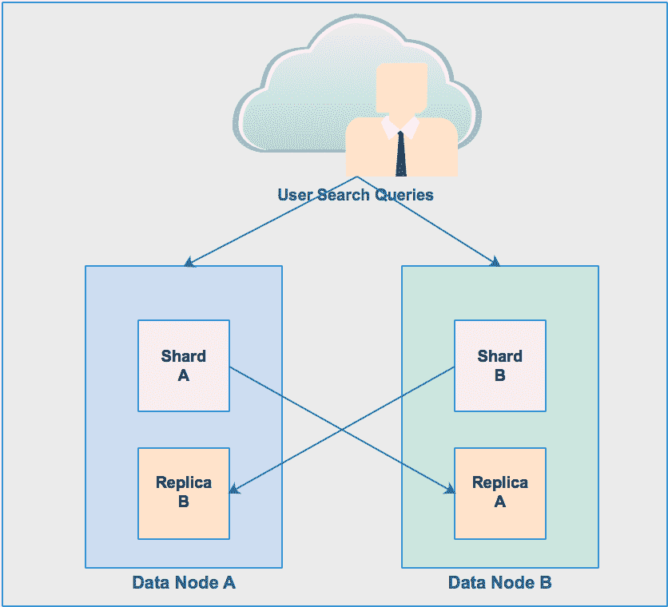

# 构建企业搜索平台

在学习了数据摄取和数据持久化方法之后，让我们学习一下搜索数据。在本章中，我们将了解以下重要事项:

*   数据搜索技术
*   构建实时搜索引擎。
*   搜索实时全文数据
*   数据索引技术
*   构建实时数据搜索管道

# 数据搜索概念

在我们的日常生活中，我们总是不断地寻找一些东西。早上，我们搜索牙刷、报纸，搜索股票价格、公交时刻表、办公包等等。这份名单越列越多。当我们一天结束睡觉时，搜索活动就停止了。我们使用很多工具和技术来搜索这些东西，以最大限度地减少实际搜索时间。我们用谷歌搜索大多数东西，比如新闻、股票价格、公共汽车时刻表，以及我们需要的任何东西。为了搜索一本书的特定页面，我们使用该书的索引。所以，重点是搜索是我们生活中非常重要的活动。有两个重要的概念可以浮出水面，那就是搜索工具和搜索时间。只要想一个你想知道某个公司的某个特定股票价格的情况，加载这个页面需要几分钟的时间。你肯定会很恼火。因为这种情况下的搜索时间是你不能接受的。那么接下来的问题就是，*如何减少这个搜索时间？*我们将在本章中了解这一点。

# 对企业搜索引擎的需求

就像我们都需要一个工具来搜索自己的东西一样，每个公司也需要一个搜索引擎来构建，这样内部和外部实体就可以找到他们想要的东西。

例如，员工必须搜索他/她的 PTO 余额、特定月份的工资单，等等。人力资源部可能会搜索财务组的员工。在电子商务公司中，产品目录是最容易搜索的对象。这是一个非常敏感的对象，因为它直接影响公司的收入。如果顾客想买一双鞋，他/她能做的第一件事就是搜索公司产品目录。如果搜索时间超过几秒钟，客户可能会对产品失去兴趣。也有可能是同一客户去另一个网站买一双鞋，导致收入损失。

看来，即使有世界上所有的技术和数据，没有两个关键的组成部分，我们也做不了什么:

*   数据搜索
*   数据索引

谷歌、亚马逊和苹果等公司改变了世界对搜索的期望。我们都希望他们可以随时随地使用任何工具搜索任何内容，例如网站、手机和语音激活工具，如谷歌回声、Alexa 和 HomePad。我们期待这些工具能回答我们所有的问题，从*今天天气怎么样？*给我一个我附近加油站的名单。

随着这些预期的增长，索引越来越多数据的需求也在增长。

# 构建企业搜索引擎的工具

以下是一些流行的工具/产品/技术:

*   Apache Lucene
*   弹性搜索
*   阿帕奇人索尔
*   定制(内部)搜索引擎

In this chapter, I will focus on Elasticsearch in detail. I will discuss Apache Solr on a conceptual level only.

# 弹性搜索

Elasticsearch 是一个开源搜索引擎。它基于 Apache Lucene。它是分布式的，支持多租户功能。它使用无模式的 JSON 文档，并有一个内置的基于 HTTP 的网络接口。它还支持分析性 RESTful 查询工作负载。它是一个基于 Java 的数据库服务器。它的主要协议是 HTTP/JSON。

# 为什么选择弹性搜索？

Elasticsearch 是目前最流行的数据索引工具。这是因为它具有以下特点:

*   是**快**。数据以实时速度编制索引。
*   它是**可伸缩的**。它水平缩放。
*   是**灵活**。它支持任何数据格式，结构化、半结构化或非结构化。
*   是**分布式**。如果一个节点出现故障，集群仍可用于业务。
*   它支持任何语言的数据搜索查询:Java、Python Ruby、C#等等。
*   它有一个 **Hadoop 连接器，**，这有助于弹性搜索和 Hadoop 之间的顺畅通信。
*   它支持在庞大的数据集上进行稳健的数据**聚合**，以发现趋势和模式。
*   **弹性堆栈** (Beats、Logstash、Elasticsearch 和 Kibana)和 X-Pack 为数据摄取、数据索引、数据可视化、数据安全和监控提供了现成的支持。

# 弹性搜索组件

在我们深入探讨之前，让我们了解弹性搜索的几个重要组成部分。

# 索引

Elasticsearch 索引是 JSON 文档的集合。Elasticsearch 是一个可能包含多个索引的数据存储。每个索引可以分为一种或多种类型。类型是一组相似的文档。一个类型可能包含多个文档。就数据库类比而言，索引是一个数据库，它的每种类型都是一个表。每个 JSON 文档都是该表中的一行。

Indices created in Elasticsearch 6.0.0 or later may only contain a single mapping type.

在 Elasticsearch 7.0.0 中将完全删除映射类型。

# 文件

弹性搜索中的文档是指 JSON 文档。它是存储在索引中的基本数据单元。一个索引包含多个文档。在关系数据库管理系统世界中，文档只不过是表格中的一行。例如，客户文档可能如下所示:

```sh
{
"name": "Sam Taylor",
"birthdate": "1995-08-11",
"address":
{
"street": "155 rabbit Street",
"city": "San Francisco",
"state": "ca",
"postalCode": "94107"
},
"contactPhone":
[
{
"type": "home",
"number": "510-415-8929"
},
{
"type": "cell",
"number": "408-171-8187"
}
]
}
```

# 绘图

映射是索引的模式定义。就像数据库一样，我们必须定义一个表的数据结构。我们必须创建一个表、它的列和列数据类型。在弹性搜索中，我们已经定义了索引创建过程中的结构。我们可能需要定义哪些字段可以被索引、搜索和存储。

好消息是，Elasticsearch 支持**动态映射**。这意味着在索引创建时映射不是强制性的。无需映射即可创建索引。当文档发送到弹性搜索进行索引时，弹性搜索会自动定义每个字段的数据结构，并使每个字段成为可搜索字段。

# 串

Elasticsearch 是节点(服务器)的集合。每个节点可以将部分数据存储在索引中，并提供跨所有节点的联合索引和搜索功能。默认情况下，每个集群都有一个唯一的名称`elasticsearch`。集群分为多种类型的节点，即主节点和数据节点。但是，弹性搜索集群可以只使用一个节点来创建，该节点在同一个节点上同时安装了主节点和数据节点:

*   **主节点**:控制整个集群。一个集群中可以有多个主节点(建议有三个)。它的主要功能是索引创建或删除以及将碎片(分区)分配给数据节点。
*   **数据节点**:这将实际索引数据存储在碎片中。它们支持所有与数据相关的操作，如聚合、索引搜索等。

# 类型

文档分为各种逻辑类型，例如订单文档、产品文档、客户文档等。不是创建三个单独的订单、产品和客户索引，而是可以将单个索引逻辑上分为订单、产品和客户类型。在关系数据库管理系统的类比中，一个类型只不过是数据库中的一个表。因此，类型是索引的逻辑分区。

Type is deprecated in Elasticsearch version 6.0.

# 如何在 Elasticsearch 中索引文档？

让我们通过索引这三个示例文档来了解弹性搜索实际上是如何工作的。在学习这一点的同时，我们将触及弹性搜索的一些重要功能/概念。

以下是要索引的三个示例 JSON 文档:

```sh
{
"name": "Angela Martin",
"birthdate": "1997-11-02",
"street": "63542 Times Square",
"city": "New York",
"state": "NY",
"zip": "10036",
"homePhone": "212-415-8929",
"cellPhone": "212-171-8187"
} ,
{
"name": "Sam Taylor",
"birthdate": "1995-08-11",
"street": "155 rabbit Street",
"city": "San Francisco",
"state": "ca",
"zip": "94107",
"homePhone": "510-415-8929",
"cellPhone": "408-171-8187"
} ,
{
"name": "Dan Lee",
"birthdate": "1970-01-25",
"street": "76336 1st Street",
"city": "Los Angeles",
"state": "ca",
"zip": "90010",
"homePhone": "323-892-5363",
"cellPhone": "213-978-1320"
}
```

# 弹性搜索安装

首先是第一件事。让我们安装弹性搜索。

请执行以下步骤在您的服务器上安装弹性搜索。假设您正在服务器上使用 CentOS 7 安装弹性搜索。

最低硬件要求是什么？

*   **RAM** : 4 GB
*   **CPU** : 2

哪个 JDK 需要安装？我们需要 JDK 8 号。如果您的服务器上没有安装 JDK 8，请执行以下步骤安装 JDK 8:

1.  更改到个人文件夹:

```sh
 $ cd ~
```

2.  下载 JDK 转速:

```sh
$ wget --no-cookies --no-check-certificate --header "Cookie: gpw_e24=http%3A%2F%2Fwww.oracle.com%2F; oraclelicense=accept-securebackup-cookie" http://download.oracle.com/otn-pub/java/jdk/8u73-b02/jdk-8u73-linux-x64.rpm
```

3.  使用 YUM 安装 RMP(假设你有`sudo`权限):

```sh
$ sudo yum -y localinstall jdk-8u73-linux-x64.rpm
```

既然我们已经成功地在我们的服务器上安装了 JDK 8，让我们开始安装弹性搜索。

# 弹性搜索的安装

有关详细的安装步骤，请参考以下网址:

[**https://www . elastic . co/guide/en/elastic search/reference/current/rpm . html**](https://www.elastic.co/guide/en/elasticsearch/reference/current/rpm.html)

1.  Elasticsearch v6.2.3 的 RPM 可从网站下载并按如下方式安装:

```sh
$ wget https://artifacts.elastic.co/downloads/elasticsearch/elasticsearch-6.1.2.rpm
$ sudo rpm --install elasticsearch-6.1.2.rpm
```

2.  要将弹性搜索配置为在系统启动时自动启动，请运行以下命令。

```sh
sudo /bin/systemctl daemon-reload
sudo /bin/systemctl enable elasticsearch.service
```

3.  弹性搜索可以按如下方式启动和停止:

```sh
sudo systemctl start elasticsearch.service
sudo systemctl stop elasticsearch.service
```

主配置文件位于名为`elasticsearch.yml`的配置文件夹中。

让我们在`elasticsearch.yml`中进行以下初始配置更改。查找并替换以下参数:

```sh
cluster.name: my-elaticsearch
path.data: /opt/data
path.logs: /opt/logs
network.host: 0.0.0.0
http.port: 9200
```

现在开始弹性搜索:

```sh
sudo systemctl start elasticsearch.service
```

使用以下网址检查弹性搜索是否正在运行:

```sh
http://localhost:9200
```

我们将得到以下回应:

```sh
// 20180320161034
// http://localhost:9200/
{
 "name": "o7NVnfX",
"cluster_name": "my-elasticsearch",
"cluster_uuid": "jmB-_FEuTb6N_OFokwxF1A",
"version": {
"number": "6.1.2",
"build_hash": "5b1fea5",
"build_date": "2017-01-10T02:35:59.208Z",
"build_snapshot": false,
"lucene_version": "7.1.0",
"minimum_wire_compatibility_version": "5.6.0",
"minimum_index_compatibility_version": "5.0.0"
},
"tagline": "You Know, for Search"
}
```

现在，我们的弹性研究进展顺利。让我们创建一个索引来存储我们的文档。

# 创建索引

我们将使用下面的`curl`命令来创建第一个名为`my_index`的索引:

```sh
curl -XPUT 'localhost:9200/my_index?pretty' -H 'Content-Type: application/json' -d'
{
"settings" : {
"index" : {
"number_of_shards" : 2,
"number_of_replicas" : 1
}
}
}
'
```

我们会得到这样的回应:

```sh
{
"acknowledged" : true,
"shards_acknowledged" : true,
"index" : "my_index"
}
```

在索引创建 URL 中，我们使用了设置、碎片和副本。让我们理解什么是碎片和复制品。

# 主碎片

我们已经用三个碎片创建了索引。这意味着 Elasticsearch 会将索引分成三个分区。每个分区称为一个**碎片**。每个碎片都是一个完整的、独立的 Lucene 索引。基本思想是弹性搜索将每个碎片存储在一个单独的数据节点上，以提高可扩展性。我们必须提到在创建索引时我们想要多少碎片。然后，弹性搜索会自动处理它。在文档搜索过程中，Elasticsearch 将聚合所有可用碎片中的所有文档，以合并结果，从而满足用户的搜索请求。它对用户是完全透明的。因此，概念是索引可以分成多个碎片，每个碎片可以托管在每个数据节点上。碎片的放置将由 Elasticsearch 本身负责。如果我们没有在索引创建网址中指定碎片的数量，默认情况下，弹性搜索将为每个索引创建五个碎片。

# 副本碎片

我们已经用一个副本创建了索引。这意味着 Elasticsearch 将为每个分片创建一个副本(复本)，并将每个复本放置在不同的数据节点上，而不是复制它的分片上。因此，现在有两个碎片，主碎片(原始碎片)和副本碎片(主碎片的副本)。在大量搜索活动中，弹性搜索可以从主碎片或放置在不同数据节点上的副本碎片中提供查询结果。这就是 Elasticsearch 提高查询吞吐量的方式，因为每个搜索查询可能会到达不同的数据节点。

总之，主碎片和副本碎片都提供了水平可扩展性和吞吐量。它可以扩展您的搜索量/吞吐量，因为搜索可以在所有副本上并行执行。

Elasticsearch 是一个分布式数据存储。这意味着数据可以分为多个数据节点。例如，假设我们只有一个数据节点，并且我们在同一数据节点上继续接收和索引文档，那么在达到该节点的硬件容量后，我们可能无法接收文档。因此，为了容纳更多的文档，我们必须向现有的弹性搜索集群添加另一个数据节点。如果我们添加另一个数据节点，弹性搜索会将碎片重新平衡到新创建的数据节点。所以现在，用户搜索查询可以适应两个数据节点。如果我们创建了一个副本碎片，那么每个碎片将创建两个副本，并放置在这两个数据节点上。现在，如果其中一个数据节点发生故障，那么用户搜索查询将只使用一个数据节点来执行。

此图显示了如何从两个数据节点执行用户搜索查询:



下图显示，即使数据节点 **A** 关闭，用户查询仍然从数据节点 **B** 执行:


让我们验证新创建的索引:

```sh
curl -XGET 'localhost:9200/_cat/indices?v&amp;amp;amp;pretty'
```

我们将得到以下回应:

```sh
health status index uuid pri rep docs.count docs.deleted store.size pri.store.size
yellow open my_index 2MXqDHedSUqoV8Zyo0l-Lw 5 1 1 0 6.9kb 6.9kb
```

让我们了解一下回应:

*   **健康:**这表示集群整体健康状态为黄色。有三种状态:绿色、黄色和红色。状态`Green`表示集群功能齐全，一切正常。状态“黄色”表示群集完全可用，但某些副本尚未分配。在我们的示例中，由于我们只使用一个节点和 5 个碎片，每个碎片有一个副本，因此 Elasticsearch 不会将所有碎片的所有副本分配给一个数据节点。集群状态“红色”表示集群部分可用，某些数据集不可用。原因可能是数据节点关闭或其他原因。
*   **状态** : `Open`。这意味着集群对企业开放。
*   **指数**:指数名称。在我们的例子中，索引名是`my_index`。
*   **Uuid** :这是唯一的索引 id。
*   **优先级**:主碎片数。
*   **代表**:副本碎片的数量。
*   **文档数**:一个索引中的文档总数。
*   **docs.deleted** :从一个索引中删除的文档总数。
*   **存储大小**:主碎片和副本碎片占用的存储大小。
*   **pri.store.size** :仅由主碎片获取的存储大小。

# 将文档纳入索引

以下`curl`命令可用于摄取`my_index`索引中的单个文档:

```sh
curl -X PUT 'localhost:9200/my_index/customer/1' -H 'Content-Type: application/json' -d '
{
"name": "Angela Martin",
"birthdate": "1997-11-02",
"street": "63542 Times Square",
"city": "New York",
"state": "NY",
"zip": "10036",
"homePhone": "212-415-8929",
"cellPhone": "212-171-8187"
}'
```

在前面的命令中，我们使用了一个名为`customer`的类型，它是一个索引的逻辑分区。在关系数据库管理系统的类比中，一个类型就像弹性搜索中的一个表。

另外，我们在客户类型后使用了数字`1`。这是一个顾客的身份证。如果我们忽略它，那么弹性搜索将为文档生成一个任意的标识。

我们有多个文档要插入`my_index`索引。在命令行中逐个插入文档是非常繁琐和耗时的。因此，我们可以将所有文档包含在一个文件中，并批量插入`my_index`。

创建一个`sample.json`文件，包括所有三个文档:

```sh
{"index":{"_id":"1"}}

{"name": "Sam Taylor","birthdate": "1995-08-11","address":{"street": "155 rabbit Street","city": "San Francisco","state": "CA","zip": "94107"},"contactPhone":[{"type": "home","number": "510-415-8929"},{"type": "cell","number": "408-171-8187"}]}

{"index":{"_id":"2"}}
{"name": "Dan Lee","birthdate": "1970-01-25","address":{"street": "76336 1st Street","city": "Los Angeles","state": "CA","zip": "90010"},"contactPhone":[{"type": "home","number": "323-892-5363"},{"type": "cell","number": "213-978-1320"}]}

{"index":{"_id":"3"}}

{"name": "Angela Martin","birthdate": "1997-11-02","address":{"street": "63542 Times Square","city": "New York","state": "NY","zip": "10036"},"contactPhone":[{"type": "home","number": "212-415-8929"},{"type": "cell","number": "212-171-8187"}]}
```

# 批量插入

让我们使用以下命令一次性摄取文件`sample.json`中的所有文档:

```sh
curl -H 'Content-Type: application/json' -XPUT 'localhost:9200/my_index/customer/_bulk?pretty&amp;amp;amp;refresh' --data-binary "@sample.json"
```

让我们使用我们最喜欢的浏览器来验证所有记录。它将显示所有三条记录:

```sh
http://localhost:9200/my_index/_search
```

# 文档搜索

由于我们的`my_index`索引中有文档，我们可以搜索这些文档:

找出`city = " Los Angeles?`所在的文档，查询如下:

```sh
curl -XGET 'http://localhost:9200/my_index2/_search?pretty' -H 'Content-Type: application/json' -d' {
"query": {
"match": {
"city": "Los Angeles" }
}
}'
```

回应:

```sh
{
"took" : 3,
"timed_out" : false,
"_shards" : {
"total" : 3,"successful" : 3,
"skipped" : 0,
"failed" : 0
},
"hits" : {
"total" : 1,
"max_score" : 1.3862944,
"hits" : [
{
"_index" : "my_index",
"_type" : "customer",
"_id" : "3",
"_score" : 1.3862944,
"_source" : {
"name" : "Dan Lee",
"birthdate" : "1970-01-25",
"street" : "76336 1st Street",
"city" : "Los Angeles", "state" : "ca",
"postalCode" : "90010",
"homePhone" : "323-892-5363",
"cellPhone" : "213-978-1320"
}
}
]
}
}
```

如果我们分析响应，我们可以看到源部分返回了我们正在寻找的文档。文件在索引`my_index`、`"_type" : "customer"`、`"_id" : "3"`中。Elasticsearch 成功搜索所有`three _shards`。

在`hits`部分下，有一个名为`_score`的字段。Elasticsearch 计算文档中每个字段的相关频率，并将其存储在索引中。它被称为文档的重量。该权重是基于四个重要因素计算的:术语频率、反向频率、文档频率和字段长度频率。这就引出了另一个问题，【Elasticsearch 如何对文档进行索引？

例如，我们在 Elasticsearch 中有以下四个要索引的文档:

*   我爱 Elasticsearch
*   弹性搜索是一个文档存储
*   糖化血红蛋白是关键值数据存储
*   我爱巴舍

| **期限** | **频率** | **文件编号** |
| a | Two | Two |
| 指数 | one | Two |
| 弹性搜索 | Two | 1,2 |
| 巴什 | Two | one |
| 我 | Two | 1,4 |
| 是 | Two | 2,3 |
| 钥匙 | one | three |
| 爱 | Two | 1,4 |
| 商店 | Two | 2,3 |
| 价值 | one | three |

当我们在 Elasticsearch 中摄取三个文档时，会创建一个倒排索引，如下所示。

现在，如果我们想要查询术语 Elasticsearch，那么只需要搜索两个文档:1 和 2。如果我们运行另一个查询来查找 *love Elasticsearch* ，那么在只发送第一个文档的结果之前，需要搜索三个文档(文档 1、2 和 4)。

此外，还有一个更重要的概念我们需要理解。

# 元字段

当我们将一个文档摄取到索引中时，Elasticsearch 会为每个索引文档添加一些元字段。以下是参照我们的示例`my_index`的元字段列表:

*   `_index`:索引的名称。`my_index`。
*   `_type`:映射类型。“客户”(在 6.0 版中已弃用)。
*   `_uid`:`_type + _id`(6.0 版本中已弃用)。
*   `_id` : `document_id` (1)。
*   `_all`:这将一个索引的所有字段连接成一个可搜索的字符串(在 6.0 版本中不推荐使用)。
*   `_ttl`:在文档可以被自动删除之前，将其保存。
*   `_timestamp`:为文档提供时间戳。
*   `_source`:这是一个实际的文档，默认自动索引。

# 绘图

在关系数据库管理系统的类比中，映射意味着定义一个表模式。我们总是定义一个表结构，也就是列数据类型。在 Elasticsearch 中，我们还需要为每个字段定义数据类型。但随之而来的是另一个问题。为什么我们之前把三篇文献摄入`my_index`索引的时候没有定义？答案很简单。弹性搜索不在乎。据称*弹性搜索是一个无模式的数据模型*。

如果我们没有定义映射，Elasticsearch 会通过将所有字段定义为文本来为我们动态创建映射。Elasticsearch 足够智能，可以找出日期字段并将`date`数据类型分配给它们。

让我们找到现有的索引`my_index`的动态映射:

```sh
curl -XGET 'localhost:9200/my_index2/_mapping/?pretty'
```

回应:

```sh
{
"my_index" : {
"mappings" : {
customer" : {
"properties" : {
"birthdate" : {
"type" : "date"
},
"cellPhone" : {
"type" : "text",
"fields" : {
"keyword" : {
"type" : "keyword",
"ignore_above" : 256
}
}
},
"city" : {
"type" : "text",
"fields" : {
"keyword" : {
"type" : "keyword",
"ignore_above" : 256
}
}
},
"homePhone" : {
"type" : "text",
"fields" : {
"keyword" : {
"type" : "keyword",
"ignore_above" : 256
}
}
},
"name" : {
"type" : "text",
"fields" : {
"keyword" : {
type" : "keyword",
"ignore_above" : 256
}
}
},
"postalCode" : {
"type" : "text",
"fields" : {
"keyword" : {
"type" : "keyword",
"ignore_above" : 256
}
}
},
"state" : {
"type" : "text",
"fields" : {
"keyword" : {
"type" : "keyword",
"ignore_above" : 256
}
}
},
"street" : {
"type" : "text",
"fields" : {
"keyword" : {
"type" : "keyword",
"ignore_above" : 256
}
}
}
}
}
}
}
}
```

Elasticsearch 支持以下两种映射类型:

*   静态映射
*   动态映射

# 静态映射

在静态映射中，我们总是知道我们的数据，并为每个字段定义适当的数据类型。静态映射必须在创建索引时定义。

# 动态映射

在我们的示例中，我们已经对文档使用了动态映射。基本上，我们没有为任何字段定义任何数据类型。但是当我们使用`_Bulk`加载摄取文档时，弹性搜索透明地为每个字段定义了合适的`text`和`date`数据类型。Elasticsearch 智能地将我们的`Birthdate`作为日期字段，并为其分配了`date`数据类型。

# 支持弹性搜索的数据类型

以下电子表格总结了弹性搜索中可用的数据类型:

| **常用** | **综合体** | **Geo** | **专业化** |
| 线 | 排列 | 地理点 | `ip` |
| 关键字 | 对象(单个 Json) | 地理形状 | `completion` |
| 日期 | 嵌套(Json 数组) |  | `token_count` |
| 长的 |  |  | `join` |
| 短的 |  |  | `percolator` |
| 字节 |  |  | `murmur3` |
| 两倍 |  |  |  |
| 浮动 |  |  |  |
| 布尔代数学体系的 |  |  |  |
| 二进制的 |  |  |  |
| 整数范围 |  |  |  |
| 浮动范围 |  |  |  |
| 远程 |  |  |  |
| 双范围 |  |  |  |
| 日期范围 |  |  |  |

大多数数据类型不需要解释。但是以下是对特定数据类型的一些解释:

*   **地理点** : 可以在这里定义经纬度点
*   **地理形状** : 这是用来定义形状的
*   **完成** : 该数据类型用于定义单词的自动完成。
*   **连接**:定义父子关系
*   **渗滤器** : 这是查询-dsl
*   **mur 3**:**在索引时间内，用于计算哈希值并将其存储到索引中**

 **# 映射示例

让我们重新创建另一个索引`second_index`，它类似于我们的静态映射的`first_index`，在这里我们将分别定义每个字段的数据类型:

```sh
curl -XPUT localhost:9200/second_index -d '{
"mappings": {
"customer": {
"_source": {
"enabled": false
},
"properties": {
"name": {"type": "string", "store": true},
"birthdate": {"type": "string"},
"street": {"type": "string"},
"city": {"type": "date"},
"state": {"type": "string", "index": "no", "store": true}
"zip": {"type": "string", "index": "no", "store": true}}
}
}
}
```

让我们理解前面的映射。我们禁用客户类型的`_source`字段。这意味着，我们摆脱了默认行为，默认情况下，弹性搜索存储和索引文档。现在，由于我们已经禁用了它，我们将分别处理每个字段，以决定该字段是应该索引存储还是两者都存储。

因此，在前面的示例中，我们只想存储三个字段:`name`、`state`和`zip`。此外，我们不想索引`state`和`zip`字段。这意味着`state`和`zip`字段不可搜索。

# 分析者

我们已经了解了倒排索引。我们知道 Elasticsearch 将文档存储到一个倒排索引中。这种转变被称为分析。这是成功响应索引搜索查询所必需的。

同样，很多时候，我们需要在将文档发送到 Elasticsearch 索引之前使用某种转换。我们可能需要将文档更改为小写，从文档中剥离 HTML 标记(如果有)，删除两个单词之间的空白，根据分隔符标记字段，等等。

Elasticsearch 提供以下内置分析器:

*   **标准分析仪** : 是默认分析仪。这使用标准标记器来划分文本。它规范了令牌，降低了令牌的级别，还删除了不需要的令牌。
*   **简单分析器** : 这个分析器由小写的 tokenizer 组成。
*   **空白分析器**:这使用空白标记器在空格处划分文本。
*   **语言分析器** : Elasticsearch 提供了很多特定语言的分析器，比如英语等等。
*   **指纹分析仪** : 指纹分析仪是一款专业级分析仪。它创建了一个指纹，可用于重复检测。
*   **模式分析器** : 模式分析器使用正则表达式将文本拆分为术语。
*   **停止分析器** : 这使用字母标记器来划分文本。它从令牌流中移除停止字。例如，像 a、an、the、is 等所有停止字。
*   **关键词分析器** : 该分析器将整个流标记为单个标记。它可以用于邮政编码。
*   **字符过滤器**:在字符串被标记之前准备一个字符串。示例:移除 html 标记。
*   **标记器**:必须有一个标记器。它用于将字符串分解成单独的术语或标记。
*   **令牌过滤器**:更改、添加或删除令牌。斯特梅尔是一个令牌过滤器，它用来获取单词的基数，例如:学会了，学习= >学会了

标准分析仪示例:

```sh
curl -XPOST 'localhost:9200/_analyze?pretty' -H 'Content-Type: application/json' -d'
{
"analyzer": "standard",
"text": " 1\. Today it's a Sunny-day, very Bright."
}'
```

回应:

```sh
[today, it's , a, sunny, day, very, bright ]
```

简单分析仪示例:

```sh
curl -XPOST 'localhost:9200/_analyze?pretty' -H 'Content-Type: application/json' -d'
{
"analyzer": "simple",
"text": " 1\. Today it's a Sunny-day, very Bright."
}'
```

回应:

```sh
[today, it's , a, sunny, day, very, bright ]
```

# Elasticsearch 堆栈组件

弹性搜索堆栈包括以下内容

*   搜索
*   logstash(日志记录)
*   弹性搜索
*   姆纳人

让我们简单地研究一下。

# 搜索

请参考以下网址了解更多节拍:[https://www.elastic.co/products/beats](https://www.elastic.co/products/beats)。

Beats 是轻量级数据托运人。Beats 作为代理安装到服务器上。他们的主要功能是收集数据并将其发送到 Logstash 或 Elasticsearch。我们还可以配置 beats 向卡夫卡主题发送数据。

有多个节拍。每个节拍都是为了收集特定的数据集和指标。以下是各种类型的节拍:

*   **文件节拍** : 用于收集日志文件。它们将常见日志格式的收集、解析和可视化简化为一个命令。Filebeat 自带内部模块(auditd、Apache、nginx、system 和 MySQL)。
*   **Metricbeat** : 用于收集指标。他们从任何系统和服务收集指标，例如内存、COU 和磁盘。Metricbeat 是一种发送系统和服务统计数据的轻量级方法。
*   **Packetbeat** :这是为了收集网络数据。Packetbeat 是一个轻量级的网络数据包分析器，它将数据发送到 Logstash 或 Elasticsearch。
*   **Winlogbeat** : 用于采集 Windows 事件数据。Winlogbeat 实时流窗口事件日志到弹性搜索和日志存储。
*   **Auditbeat** : 用于采集审计数据。Auditbeat 收集审核框架数据。
*   **心跳** : 用于采集正常运行时间监测数据。心跳将这些信息和响应时间发送给弹性搜索。

文件节拍的安装:

```sh
$wget https://artifacts.elastic.co/downloads/beats/filebeat/filebeat-6.1.2-x86_64.rpm
$ sudo rpm --install filebeat-6.1.2-x86_64.rpm
sudo /bin/systemctl daemon-reload
sudo /bin/systemctl enable filebeat.service
```

# logstash(日志记录)

Logstash 是一个轻量级的开源数据处理管道。它允许从各种各样的来源收集数据，动态转换数据，并将其发送到任何想要的目的地。

它最常被用作流行的分析和搜索引擎 Elasticsearch 的数据管道。Logstash 是将数据加载到 Elasticsearch 的流行选择，因为它紧密集成，强大的日志处理功能，以及 200 多个预构建的开源插件，可以帮助您按照自己想要的方式对数据进行索引。

以下是`Logstash.conf`的结构:

```sh
input {
...
}
filter {
...
}
output {
..
}
```

Logstash 的安装:

```sh
$ wget https://artifacts.elastic.co/downloads/logstash/logstash-6.1.2.rpm
$ sudo rpm --install logstash-6.1.2.rpm
$ sudo /bin/systemctl daemon-reload
$ sudo systemctl start logstash.service
```

# 姆纳人

Kibana 是一个开源的数据可视化和探索工具，用于日志和时间序列分析、应用程序监控和运营智能用例。Kibana 与流行的分析和搜索引擎 Elasticsearch 紧密集成，这使得 Kibana 成为可视化存储在 Elasticsearch 中的数据的默认选择。Kibana 也因其强大且易于使用的功能而广受欢迎，例如直方图、折线图、饼图、热图以及内置的地理空间支持**。**

基巴纳的安装:

```sh
$wget https://artifacts.elastic.co/downloads/kibana/kibana-6.1.2-x86_64.rpm
$ sudo rpm --install kibana-6.1.2-x86_64.rpm
sudo /bin/systemctl daemon-reload
sudo /bin/systemctl enable kibana.service
```

# 用例

让我们假设在应用服务器上部署了一个应用程序。该应用程序正在登录访问日志。那么我们如何使用仪表板来分析这个访问日志呢？我们希望创建以下信息的实时可视化:

*   各种响应代码的数量
*   响应总数
*   综合方案清单

建议的技术堆栈:

*   **Filebeat** :读取访问日志，写入卡夫卡主题
*   **卡夫卡:**消息队列和 o 缓冲区消息
*   **Logstash:** 从 Kafka 提取消息并写入 Elasticsearch 索引
*   **弹性搜索**:用于索引消息
*   **基巴纳**:仪表盘可视化

为了解决这个问题，我们在 Appserver 上安装了 filebeat。Filebeat 将从访问日志中读取每一行，并实时写入 kafka 主题。信息将在卡夫卡缓冲。Logstash 将从卡夫卡主题中提取消息，并写入 Elasticsearch。

Kibana 将通过读取 Elasticsearch 索引中的消息来创建实时流式仪表板。下面是我们用例的架构:

****

下面是一步一步的代码示例，`Acccss.log`:

```sh
127.0.0.1 - - [21/Mar/2017:13:52:29 -0400] "GET /web-portal/performance/js/common-functions.js HTTP/1.1" 200 3558
127.0.0.1 - - [21/Mar/2017:13:52:30 -0400] "GET /web-portal/performance/js/sitespeed-functions.js HTTP/1.1" 200 13068
127.0.0.1 - - [21/Mar/2017:13:52:34 -0400] "GET /web-portal/img/app2-icon-dark.png HTTP/1.1" 200 4939
127.0.0.1 - - [21/Mar/2017:13:52:43 -0400] "GET /web-search-service/service/performanceTest/release/list HTTP/1.1" 200 186
127.0.0.1 - - [21/Mar/2017:13:52:44 -0400] "GET /web-portal/performance/fonts/opan-sans/OpenSans-Light-webfont.woff HTTP/1.1" 200 22248
127.0.0.1 - - [21/Mar/2017:13:52:44 -0400] "GET /web-portal/performance/img/icon/tile-actions.png HTTP/1.1" 200 100
127.0.0.1 - - [21/Mar/2017:13:52:44 -0400] "GET /web-portal/performance/fonts/fontawesome/fontawesome-webfont.woff?v=4.0.3 HTTP/1.1" 200 44432
```

以下是完整的`Filebeat.ymal`:

在卡夫卡输出部分，我们已经提到了卡夫卡经纪人的细节。`output.kafka`:

```sh
# initial brokers for reading cluster metadata
hosts: ["localhost:6667"]
```

以下是完整的`Filebeat.ymal`:

```sh
###################### Filebeat Configuration Example #########################
# This file is an example configuration file highlighting only the most common
# options. The filebeat.reference.yml file from the same directory contains all the
# supported options with more comments. You can use it as a reference.
#
# You can find the full configuration reference here:
# https://www.elastic.co/guide/en/beats/filebeat/index.html
# For more available modules and options, please see the filebeat.reference.yml sample
# configuration file.
#======================== Filebeat prospectors========================
filebeat.prospectors:
# Each - is a prospector. Most options can be set at the prospector level, so
# you can use different prospectors for various configurations.
# Below are the prospector specific configurations.
- type: log
# Change to true to enable this prospector configuration.
enabled: true
# Paths that should be crawled and fetched. Glob based paths.
paths:
- /var/log/myapp/*.log
#- c:programdataelasticsearchlogs*
#json.keys_under_root: true
#json.add_error_key: true
# Exclude lines. A list of regular expressions to match. It drops the lines that are
# matching any regular expression from the list.
#exclude_lines: ['^DBG']
# Include lines. A list of regular expressions to match. It exports the lines that are
# matching any regular expression from the list.
#include_lines: ['^ERR', '^WARN']
# Exclude files. A list of regular expressions to match. Filebeat drops the files that
# are matching any regular expression from the list. By default, no files are dropped.
#exclude_files: ['.gz$']
# Optional additional fields. These fields can be freely picked
# to add additional information to the crawled log files for filtering
#fields:
# level: debug
# review: 1
fields:
app: myapp
env: dev
dc: gce
### Multiline options
# Mutiline can be used for log messages spanning multiple lines. This is common
# for Java Stack Traces or C-Line Continuation
# The regexp Pattern that has to be matched. The example pattern matches all lines starting with [#multiline.pattern: ^[
# Defines if the pattern set under pattern should be negated or not. Default is false.
#multiline.negate: false
# Match can be set to "after" or "before". It is used to define if lines should be append to a pattern
# that was (not) matched before or after or as long as a pattern is not matched based on negate.
# Note: After is the equivalent to previous and before is the equivalent to to next in Logstash
#multiline.match: after
#============================= Filebeat modules ===============================
filebeat.config.modules:
# Glob pattern for configuration loading
path: ${path.config}/modules.d/*.yml
# Set to true to enable config reloading
reload.enabled: false
# Period on which files under path should be checked for changes
#reload.period: 10s
#==================== Elasticsearch template setting ==========================
setup.template.settings:
index.number_of_shards: 3
#index.codec: best_compression
#_source.enabled: false
#================================ General =====================================
# The name of the shipper that publishes the network data. It can be used to group
# all the transactions sent by a single shipper in the web interface.
#name:
# The tags of the shipper are included in their own field with each
# transaction published.
#tags: ["service-X", "web-tier"]
# Optional fields that you can specify to add additional information to the
# output.
#fields:
# env: staging
#============================== Dashboards =====================================
# These settings control loading the sample dashboards to the Kibana index. Loading
# the dashboards is disabled by default and can be enabled either by setting the
# options here, or by using the `-setup` CLI flag or the `setup` command.
#setup.dashboards.enabled: false
# The URL from where to download the dashboards archive. By default this URL
# has a value which is computed based on the Beat name and version. For released
# versions, this URL points to the dashboard archive on the artifacts.elastic.co
# website.
#setup.dashboards.url:
#============================== Kibana =====================================
# Starting with Beats version 6.0.0, the dashboards are loaded via the Kibana API.
# This requires a Kibana endpoint configuration.
setup.kibana:
# Kibana Host
# Scheme and port can be left out and will be set to the default (http and 5601)
# In case you specify and additional path, the scheme is required: http://localhost:5601/path
# IPv6 addresses should always be defined as: https://[2001:db8::1]:5601
#host: "localhost:5601"
#============================= Elastic Cloud ==================================
# These settings simplify using filebeat with the Elastic Cloud (https://cloud.elastic.co/).
# The cloud.id setting overwrites the `output.elasticsearch.hosts` and
# `setup.kibana.host` options.
# You can find the `cloud.id` in the Elastic Cloud web UI.
#cloud.id:
# The cloud.auth setting overwrites the `output.elasticsearch.username` and
# `output.elasticsearch.password` settings. The format is `<user>:<pass>`.
#cloud.auth:
#================================ Outputs =====================================
# Configure what output to use when sending the data collected by the beat.
#-----------------------------------Kafka Output-------------------------------
output.kafka: # initial brokers for reading cluster metadata hosts: ["localhost:6667"] # message topic selection + partitioning
topic: logs-topic
partition.round_robin:
reachable_only: false
required_acks: 1
compression: gzip
max_message_bytes: 1000000
#-------------------------- Elasticsearch output ------------------------------
#output.elasticsearch:
# Array of hosts to connect to.
#hosts: ["localhost:9200"]
# Optional protocol and basic auth credentials.
#protocol: "https"
#username: "elastic"
#password: "changeme"
#----------------------------- Logstash output --------------------------------#output.logstash:
# The Logstash hosts
#hosts: ["localhost:5044"]
# Optional SSL. By default is off.
# List of root certificates for HTTPS server verifications
#ssl.certificate_authorities: ["/etc/pki/root/ca.pem"]
# Certificate for SSL client authentication
#ssl.certificate: "/etc/pki/client/cert.pem"
# Client Certificate Key
#ssl.key: "/etc/pki/client/cert.key"
#================================ Logging =====================================
# Sets log level. The default log level is info.
# Available log levels are: error, warning, info, debug
logging.level: debug
# At debug level, you can selectively enable logging only for some components.
# To enable all selectors use ["*"]. Examples of other selectors are "beat",
# "publish", "service".
#logging.selectors: ["*"]
#============================== Xpack Monitoring ===============================
# filebeat can export internal metrics to a central Elasticsearch monitoring
# cluster. This requires xpack monitoring to be enabled in Elasticsearch. The
# reporting is disabled by default.
# Set to true to enable the monitoring reporter.
#xpack.monitoring.enabled: false
# Uncomment to send the metrics to Elasticsearch. Most settings from the
# Elasticsearch output are accepted here as well. Any setting that is not set is
# automatically inherited from the Elasticsearch output configuration, so if you
# have the Elasticsearch output configured, you can simply uncomment the
# the following line.
#xpack.monitoring.elasticsearch:
```

我们必须在卡夫卡中创造一个`logs-topic`主题，然后才能开始在其中吸收信息。假设我们已经在服务器上安装了卡夫卡。更多关于卡夫卡的内容，请参考[第二章](02.html)、 *Hadoop 生命周期管理*。

创建日志-主题:

```sh
bin/kafka-topics.sh --create --zookeeper localhost:2181 --replication-factor 1 --partitions 1 --topic logs-topic
```

以下是`Logstash.conf`(阅读卡夫卡的留言，并推至 Elasticseach):

```sh
input
{
kafka
{
bootstrap_servers => "127.0.0.1:6667"
group_id => "logstash_logs"
topics => ["logs-topic"]
consumer_threads => 1
type => "kafka_logs"
}
}
filter {
if [type] == "kafka_logs"
{
json {
source => "message"
}
grok {
match => { "message" => "%{IP:ip} - - [%{GREEDYDATA:log_timestamp}] %{GREEDYDATA:middle} %{NUMBER:status} %{NUMBER:bytes}" }
}
mutate {
add_field => {
"App" => "%{[fields][app]}"
}
}
}
}
output {
if [App] == "myapp"
{
elasticsearch
{
action => "index"
codec => "plain"
hosts => ["http://127.0.0.1:9200"]
index => "log_index-%{+YYYY-MM-dd}"
}
}
}
```

在卡夫卡部分，我们提到了以下事情:

```sh
Kafka bootstrap_servers => "127.0.0.1:6667"
Kafka topics => ["logs-topic"]
```

在过滤器部分**、**我们将每条消息转换为 JSON 格式。之后，我们解析每条消息，并将其分成多个字段，如`ip`、`timestamp`和`status`。此外，我们将应用程序名称`myapp`字段添加到每个消息中。

在输出部分，我们将每条消息写入弹性搜索。索引名为`log_index-YYYY-MM-dd`。

# 摘要

在本章中，您了解了弹性搜索集群的基本概念和组件。

之后，我们讨论了 Elasticsearch 如何使用倒排索引对文档进行索引。我们还讨论了映射和分析技术。我们学习了如何在加入弹性搜索之前对事件进行反规格化。我们讨论了弹性搜索如何使用水平可伸缩性和吞吐量。在了解了诸如 Beats、Logstash 和 Kibana 等 Elasticstack 组件之后，我们处理了一个真实的用例，在这个用例中，我们演示了如何使用 Filebeat 将访问日志事件摄入 Kafka。我们开发了一个代码来从卡夫卡那里提取消息，并使用 Logstash 将其摄入弹性搜索。最后，我们使用 Kibana 学习了数据可视化。

在下一章中，我们将了解如何构建分析来设计推动业务决策的数据可视化解决方案。**