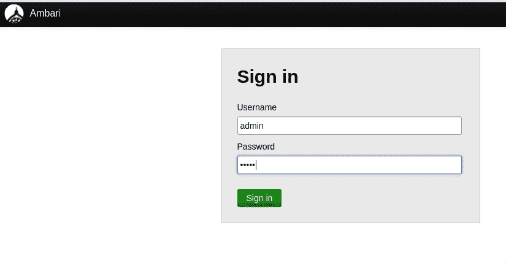
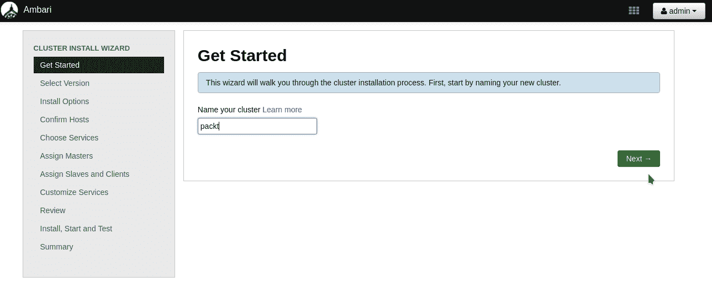
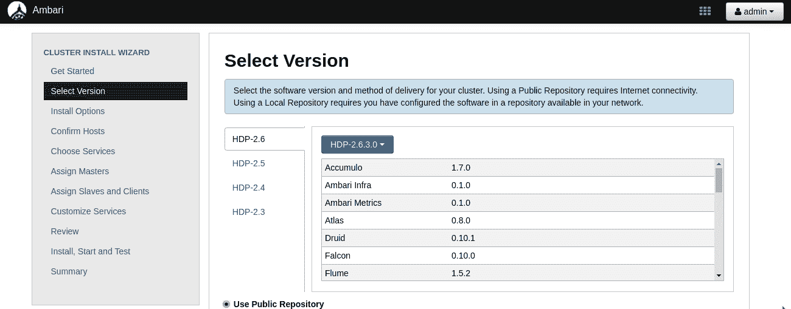
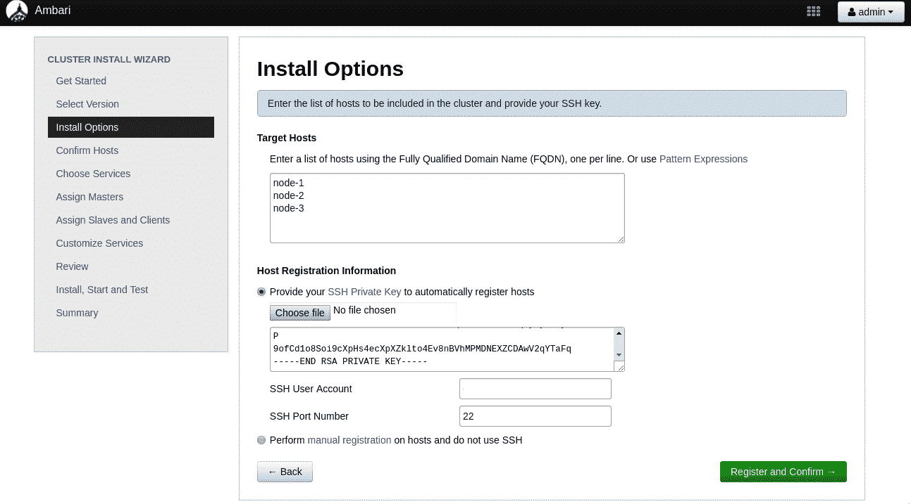
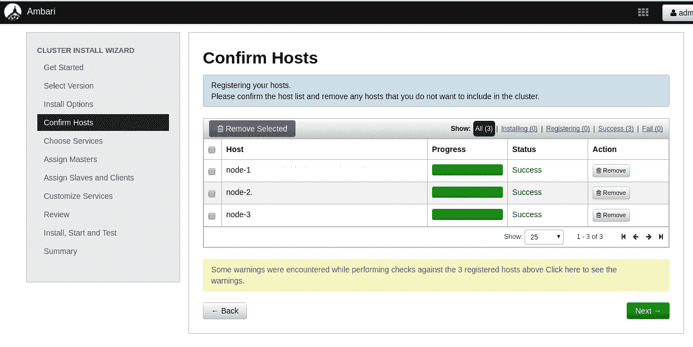
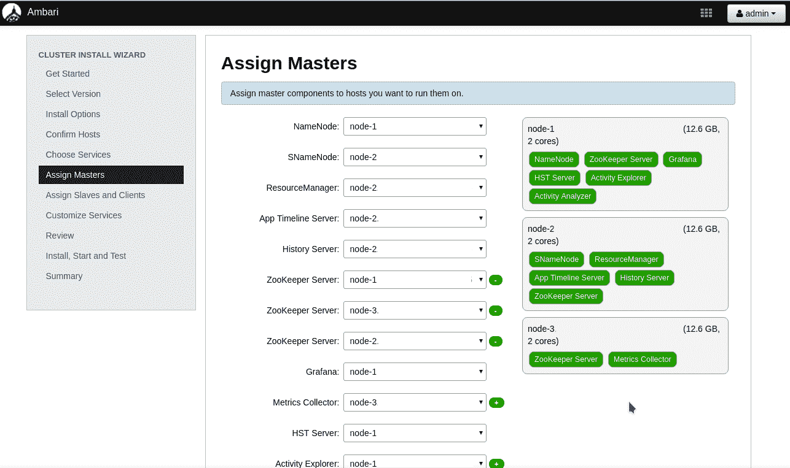
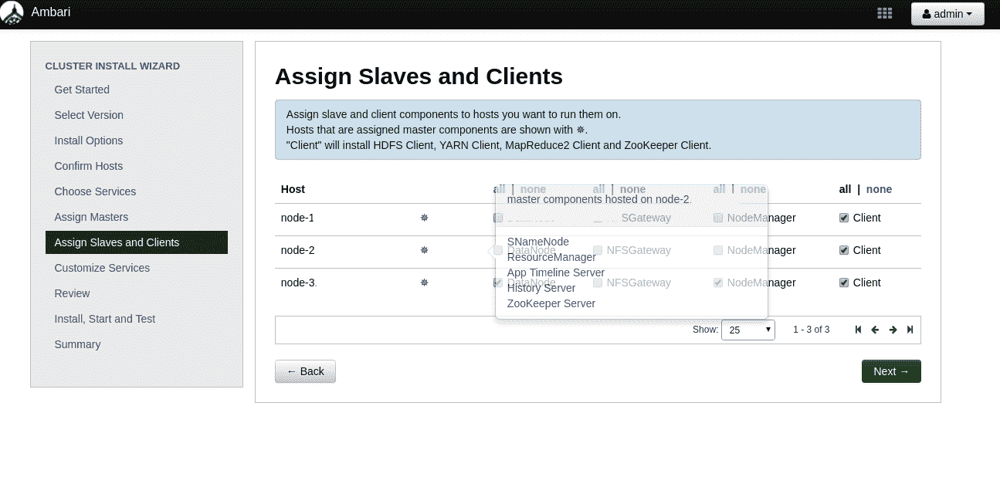
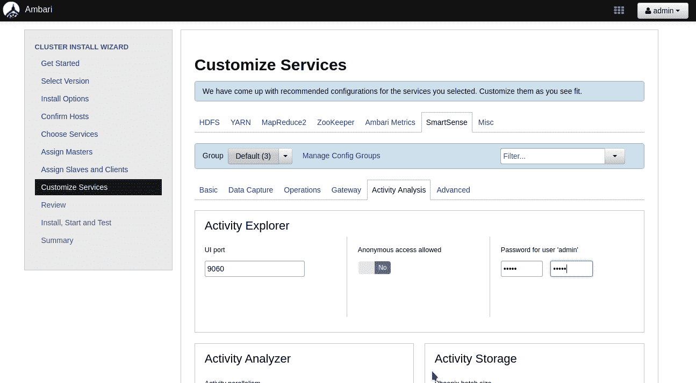
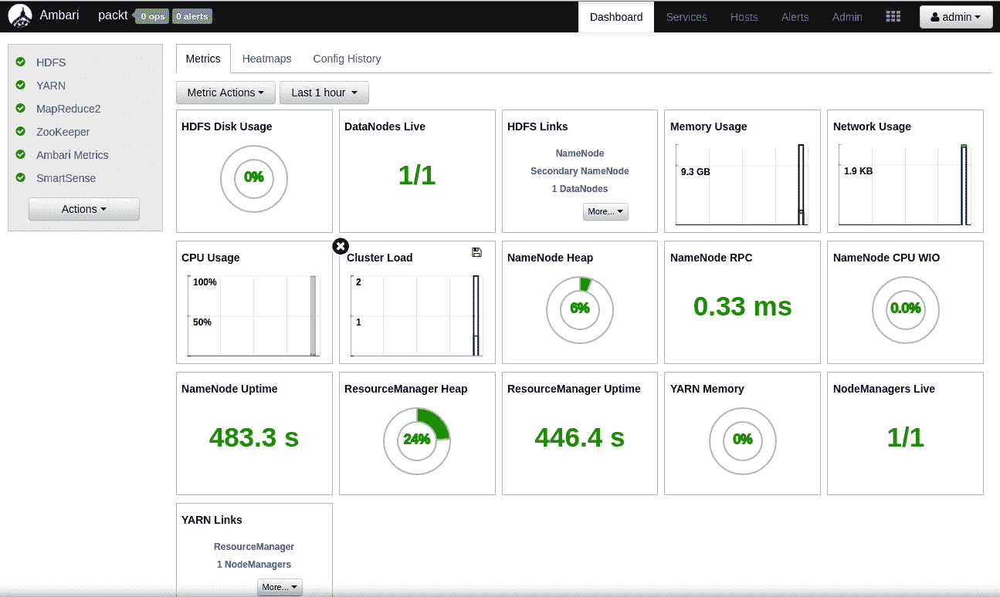
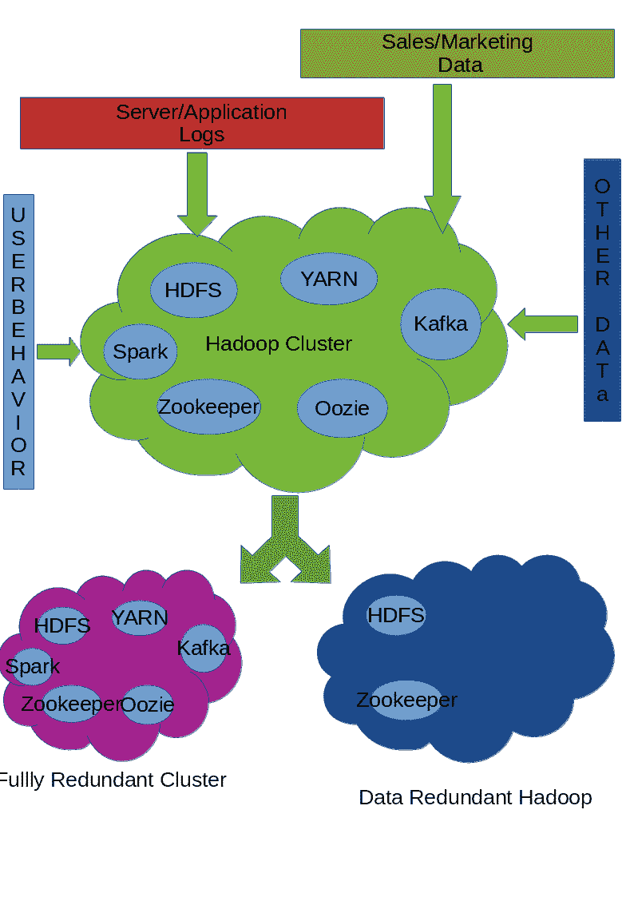

# 十一、生产环境的 Hadoop 集群部署

Hadoop 本身以强大的核心和文件系统开始，旨在应对大数据挑战。后来，在此基础上开发了许多应用，创建了一个相互配合的大型应用生态系统。随着应用数量开始增加，创建和管理 Hadoop 环境的挑战也随之增加。

在本章中，我们将了解以下内容:

*   Apache人 Ambari
*   一个带有 Ambari 的 Hadoop 集群

# Apache Ambari 架构

Apache Ambari 遵循主/从架构，其中主节点指示从节点执行某些操作，并报告每个操作的状态。主节点负责跟踪基础设施的状态。为此，主节点使用数据库服务器，该服务器可以在设置期间进行配置。

为了更好地理解安巴里是如何工作的，让我们来看看安巴里的高层架构，如下图所示:


核心是，我们有以下应用:

*   Ambari 服务器
*   安巴里特工
*   安巴里网络用户界面
*   数据库ˌ资料库

# 安巴里服务器

Ambari 服务器(`ambari-server`)是一个 shell 脚本，它是主服务器上所有管理活动的入口点。这个脚本在内部使用 Python 代码`ambari-server.py,`，并将所有请求路由到它。

安巴里服务器具有以下入口点，当向`ambari-server`程序传递不同参数时，这些入口点可用:

*   守护进程管理
*   软件升级
*   软件设置
*   LDAP/PAM/Kerberos 管理
*   Ambari 备份和恢复
*   其他选项

# 守护进程管理

当从命令行用`start`、`stop`、`reset`、`restart`参数调用脚本时，守护程序管理模式被激活。

例如，如果我们想要启动 Ambari 后台服务器，我们可以运行以下命令:

```sh
Example: ambari-server start
```

# 软件升级

一旦安装了 Ambari，我们就可以使用这种模式来升级 Ambari 服务器本身。当我们用`upgrade`标志调用`ambari-server`程序时，就会触发这一点。如果我们想升级整个安巴里堆栈，我们可以传递`upgradestack`标志:

```sh
Example: ambari-server upgrade
```

# 软件设置

一旦安巴里从互联网上下载(或通过 YUM 和 APT 安装)，我们需要做一个软件的初步设置。当我们将`setup`标志传递给程序时，可以触发该模式。这个模式会问我们几个需要回答的问题。除非我们完成这一步，否则 Ambari 不能用于任何类型的服务器管理:

```sh
Example: ambari-server setup
```

# LDAP/PAM/Kerberos 管理

**T** he **轻量级目录访问协议** ( **LDAP** )用于企业中的身份管理。为了使用基于 LDAP 的身份验证，我们需要使用以下标志:`setup-ldap`(用于使用`ambari`设置`ldap`属性)和`sync-ldap`(执行来自`ldap`服务器的数据同步):

```sh
Example: ambari-server setup-ldap
Example: ambari-server sync-ldap
```

**可插拔身份验证模块** ( **PAM** )是任何 UNIX 或 Linux 操作系统中身份验证和授权的核心。如果我们想为安巴里利用基于 PAM 的访问，那么我们需要使用`setup-pam`选项来运行它。如果我们想从 LDAP 转向基于 PAM 的身份验证，我们需要使用`migrate-ldap-pam`运行它:

```sh
Example: ambari-server setup-pam
Example: ambari-server migrate-ldap-pam
```

**Kerberos** 是另一种先进的身份验证和授权机制，在网络环境中非常有用。这简化了大型服务器上的**真实性、授权和审核** ( **AAA** )。如果我们想对 Ambari 使用 Kerberos，我们可以使用`setup-kerberos`标志:

```sh
Example: ambari-server setup-kerberos
```

# Ambari 备份和恢复

如果我们想拍摄当前安装的 Ambari 的快照(不包括数据库)，我们可以进入这个模式。这支持通过`backup`和`restore`标志调用的备份和恢复方法:

```sh
Example: ambari-server backup
Example: ambari-server restore
```

# 其他选项

除了这些选项之外，安巴里服务器程序还提供了其他选项，您可以使用`-h`(帮助)标志来调用这些选项。

# 安巴里特工

安巴里代理是一个程序，它运行在我们希望由安巴里管理的所有节点上。该程序定期向主节点发送心跳信号。使用该代理，`ambari-server`执行服务器上的许多任务。

# Ambari 网络界面

这是 Ambari 应用的强大功能之一。该 web 应用由运行在主主机上的 Ambari 服务器程序公开；我们可以在端口`8080`上访问这个应用，它受到身份验证的保护。

一旦我们登录到这个门户网站，我们就可以控制和查看 Hadoop 集群的所有方面。

# 数据库ˌ资料库

Ambari 支持多个关系数据库管理系统来跟踪整个 Hadoop 基础设施的状态。在第一次安装 Ambari 服务器的过程中，我们可以选择我们想要使用的数据库。

在撰写本文时，安巴里支持以下数据库:

*   一种数据库系统
*   神谕
*   MySQL 或 MariaDB
*   嵌入式 PostgreSQL
*   微软 SQL 服务器
*   SQL Anywhere
*   伯克利数据库

# 使用 Ambari 设置 Hadoop 集群

在本节中，我们将学习如何使用 Ambari 从头开始设置一个全新的 Hadoop 集群。为了做到这一点，我们需要四个服务器——一个服务器用于运行 Ambari 服务器，另外三个节点用于运行 Hadoop 组件。

# 服务器配置

下表显示了我们在本练习中使用的服务器配置:

| **服务器类型** | **名称** | **CPU** | ram | **磁盘** |
| Ambari 服务器节点 | 掌握 | one | 3.7 GB | 100 GB |
| Hadoop 节点 1 | 节点 1 | Two | 13 GB | 250 GB |
| Hadoop 节点 2 | 节点 2 | Two | 13 GB | 250 GB |
| Hadoop 节点 3 | 节点 3 | Two | 13 GB | 250 GB |

由于这是一个示例设置，我们对这种配置很满意。对于现实场景，请根据您的需求选择配置。

# 准备服务器

本部分和所有其他部分都假设您在所有服务器上都有一个工作正常的互联网连接，并且安全地用防火墙来防止任何入侵。

所有服务器都运行 CentOS 7 操作系统，因为它是一个使用 RPM/YUM 进行包管理的系统。当您在以下部分看到`yum`时，不要感到困惑。

在我们开始使用服务器之前，我们需要运行基本的实用程序来帮助我们解决服务器的各种问题。它们是作为下一个命令的一部分安装的。如果你不确定它们是什么，不要担心。除了`mysql-connector-java`和`wget`以外，所有其他公用设施都不是强制性的:

```sh
sudo yum install mysql-connector-java wget iftop iotop smartctl -y
```

# 安装 Ambari 服务器

创建 Hadoop 集群的第一步是启动和运行我们的 Ambari 服务器应用。因此，使用 SSH 登录到主节点，并按顺序执行以下步骤:

1.  使用以下命令下载 CentOS 7 的 Ambari YUM 存储库:

```sh
[user@master ~]$ wget http://public-repo-1.hortonworks.com/ambari/centos7/2.x/updates/2.6.1.5/ambari.repo

```

2.  在这一步之后，我们需要使用以下命令将`ambari.repo`文件移动到`/etc/yum.repos.d`目录:

```sh
[user@master ~]$ sudo mv ambari.repo /etc/yum.repos.d
```

3.  下一步是借助这个命令安装`ambari-server`包:

```sh
[user@master ~]$ sudo yum install ambari-server -y
```

4.  我们将使用 MySQL 服务器作为我们的 Ambari 服务器。因此，让我们也安装所需的软件包:

```sh
[user@master ~]$ sudo yum install mariadb-server -y
```

5.  让我们先配置 MySQL 服务器(或 MariaDB)，然后再接触 Ambari 设置过程。这是通过以下命令完成的:

```sh
[user@master ~]$ sudo service mariadb start
Redirecting to /bin/systemctl start mariadb.service
```

6.  然后，用密码`ambari,`创建一个名为`ambari`的数据库和一个名为`ambari`的用户，这样安巴里服务器的配置就很容易在下面的步骤中设置了。这可以通过以下 SQL 查询来完成:

```sh
CREATE DATABASE ambari;
GRANT ALL PRIVILEGES ON ambari.* to ambari@localhost identified by 'ambari';
GRANT ALL PRIVILEGES ON ambari.* to ambari@'%' identified by 'ambari';
FLUSH PRIVILEGES;
```

7.  将这四行存储到名为`ambari.sql`的文本文件中，并使用以下命令执行:

```sh
[user@master ~] mysql -uroot < ambari.sql
```

8.  这将创建一个数据库，并给予用户必要的特权。

Please use a strong password for production setup, otherwise your system will be vulnerable to any attacks.

现在我们已经完成了基础工作，让我们运行安巴里服务器设置。请注意，我们需要回答以下几个突出显示的问题:

```sh
[user@master ~]$ sudo ambari-server setup
Using python /usr/bin/python
Setup ambari-server
Checking SELinux...
SELinux status is 'enabled'
SELinux mode is 'enforcing'
Temporarily disabling SELinux
WARNING: SELinux is set to 'permissive' mode and temporarily disabled.
OK to continue [y/n] (y)? <ENTER>
Customize user account for ambari-server daemon [y/n] (n)? <ENTER>
Adjusting ambari-server permissions and ownership...
Checking firewall status...
WARNING: iptables is running. Confirm the necessary Ambari ports are accessible. Refer to the Ambari documentation for more details on ports.
OK to continue [y/n] (y)? <ENTER>
Checking JDK...
[1] Oracle JDK 1.8 + Java Cryptography Extension (JCE) Policy Files 8
[2] Oracle JDK 1.7 + Java Cryptography Extension (JCE) Policy Files 7
[3] Custom JDK
==============================================================================
Enter choice (1): <ENTER>
To download the Oracle JDK and the Java Cryptography Extension (JCE) Policy Files you must accept the license terms found at http://www.oracle.com/technetwork/java/javase/terms/license/index.html and not accepting will cancel the Ambari Server setup and you must install the JDK and JCE files manually.
Do you accept the Oracle Binary Code License Agreement [y/n] (y)? <ENTER>
Downloading JDK from http://public-repo-1.hortonworks.com/ARTIFACTS/jdk-8u112-linux-x64.tar.gz to /var/lib/ambari-server/resources/jdk-8u112-linux-x64.tar.gz
jdk-8u112-linux-x64.tar.gz... 100% (174.7 MB of 174.7 MB)
Successfully downloaded JDK distribution to /var/lib/ambari-server/resources/jdk-8u112-linux-x64.tar.gz
Installing JDK to /usr/jdk64/
Successfully installed JDK to /usr/jdk64/
Downloading JCE Policy archive from http://public-repo-1.hortonworks.com/ARTIFACTS/jce_policy-8.zip to /var/lib/ambari-server/resources/jce_policy-8.zip

Successfully downloaded JCE Policy archive to /var/lib/ambari-server/resources/jce_policy-8.zip
Installing JCE policy...
Checking GPL software agreement...
GPL License for LZO: https://www.gnu.org/licenses/old-licenses/gpl-2.0.en.html
Enable Ambari Server to download and install GPL Licensed LZO packages [y/n] (n)? y <ENTER>
Completing setup...
Configuring database...
Enter advanced database configuration [y/n] (n)? y <ENTER>
Configuring database...
==============================================================================
Choose one of the following options:
[1] - PostgreSQL (Embedded)
[2] - Oracle
[3] - MySQL / MariaDB
[4] - PostgreSQL
[5] - Microsoft SQL Server (Tech Preview)
[6] - SQL Anywhere
[7] - BDB
==============================================================================
Enter choice (1): 3 <ENTER>
Hostname (localhost): 
Port (3306): 
Database name (ambari): 
Username (ambari): 
Enter Database Password (bigdata): ambari <ENTER>
Re-enter password: ambari <ENTER>
Configuring ambari database...
Configuring remote database connection properties...
WARNING: Before starting Ambari Server, you must run the following DDL against the database to create the schema: /var/lib/ambari-server/resources/Ambari-DDL-MySQL-CREATE.sql
Proceed with configuring remote database connection properties [y/n] (y)? <ENTER>
Extracting system views...
ambari-admin-2.6.1.5.3.jar
...........
Adjusting ambari-server permissions and ownership...
Ambari Server 'setup' completed successfully.
```

9.  安装完成后，我们需要使用安装过程中生成的前一个文件在 Ambari 数据库中创建表。这可以通过以下命令完成:

```sh
[user@master ~] mysql -u ambari -pambari ambari < /var/lib/ambari-server/resources/Ambari-DDL-MySQL-CREATE.sql
```

10.  下一步是我们启动`ambari-server`守护进程。这将启动 web 界面，我们将在以下步骤中使用该界面来创建 Hadoop 集群:

```sh
[user@master ~]$ sudo ambari-server start
Using python /usr/bin/python
Starting ambari-server
Ambari Server running with administrator privileges.
Organizing resource files at /var/lib/ambari-server/resources...
Ambari database consistency check started...
Server PID at: /var/run/ambari-server/ambari-server.pid
Server out at: /var/log/ambari-server/ambari-server.out
Server log at: /var/log/ambari-server/ambari-server.log
Waiting for server start...............................
Server started listening on 8080
DB configs consistency check: no errors and warnings were found.
Ambari Server 'start' completed successfully.
```

11.  服务器设置完成后，配置 JDBC 驱动程序(这对所有其他节点也很有帮助):

```sh
[user@master ~] sudo ambari-server setup --jdbc-db=mysql --jdbc-driver=/usr/share/java/mysql-connector-java.jar
```

# 准备 Hadoop 集群

在创建 Hadoop 集群之前，我们还需要做几个步骤。

由于我们已经启动并运行了 Ambari 服务器，因此让我们生成一个 RSA 密钥对，用于 Ambari 服务器和 Ambari 代理节点之间的通信。

该密钥对允许 Ambari 服务器节点登录到所有 Hadoop 节点，并以自动方式执行安装。

如果您已经在采购服务器和基础架构的过程中这样做了，则此步骤是可选的:

```sh
[user@master ~]$ ssh-keygen -t rsa
Generating public/private rsa key pair.
Enter file in which to save the key (/home/user/.ssh/id_rsa): 
Enter passphrase (empty for no passphrase): <ENTER>
Enter same passphrase again: <ENTER>
Your identification has been saved in /home/user/.ssh/id_rsa.
Your public key has been saved in /home/user/.ssh/id_rsa.pub.
The key fingerprint is:
SHA256:JWBbGdAnRHM0JFj35iSAcQk+rC0MhyHlrFawr+d2cZ0 user@master
The key's randomart image is:
+---[RSA 2048]----+
|.oo   *@@**    |
| +oo +o==*.o     |
| .=.. = .oo +    |
| .o+ o . o =     |
|.. .+ . S . .    |
|. .  o . E      |
| . .  o    |
|  o. .           |
|  ...            |
+----[SHA256]-----+
```

这将在`/home/user/.ssh`目录中生成两个文件:

*   `~/.ssh/id_rsa`:这是需要保密的私钥文件
*   `~/.ssh/id_rsa.pub`:这是允许任何 SSH 登录使用私钥文件的公钥文件

这个`id_rsa.pub`文件的内容应该放在所有 Hadoop 节点上的`~/.ssh/authorized_keys`中。在这种情况下，它们是节点服务器(1–3)。

This step of propagating all the public SSH keys can be done during the server provisioning itself, so a manual step is avoided every time we acquire new servers.

现在，我们将只使用安巴里网络界面完成所有工作。

# 创建 Hadoop 集群

在本节中，我们将使用 Ambari 网络界面构建一个 Hadoop 集群。本节假设以下情况:

*   节点(1–3)可通过 SSH 从主服务器访问
*   管理员可以使用主服务器的`id-rsa`私钥登录到节点(1–3)
*   UNIX 用户可以运行`sudo`并在节点(1–3)服务器上执行所有管理操作
*   安巴里服务器安装完成
*   浏览器可以访问安巴里网络界面，没有任何防火墙限制

# Ambari 网络界面

让我们打开一个网页浏览器，使用`http://<server-ip>:8080`连接到安巴里服务器网页界面。我们会看到这样的登录屏幕。请输入`admin`作为用户名，`admin`作为密码继续:



登录成功后，我们将进入主页。

# 安巴里主页

这是主页面，用户界面上有多个选项。由于这是全新的安装，目前还没有可用的集群数据。

让我们看看主页的截图:


从这个地方，我们可以开展以下活动:

# 创建集群

正如您可能已经猜到的，本节用于启动一个向导，该向导将帮助我们从浏览器创建一个 Hadoop 集群。

# 管理用户和组

本节有助于管理可以使用和管理 Ambari web 应用的用户和组。

# 部署视图

该界面有助于为不同类型的用户创建视图，以及他们可以通过 Ambari 网络界面执行哪些操作。

由于我们的目标是创建一个新的 Hadoop 集群，我们将单击启动安装向导按钮并开始创建 Hadoop 集群的过程。

# 群集安装向导

Hadoop 集群创建分为多个步骤。我们将在下面的部分中完成所有这些步骤。首先，我们会看到一个屏幕，我们需要在其中命名我们的 Hadoop 集群。

# 命名您的集群

我选择了`packt`作为 Hadoop 集群名称。当在屏幕中输入 Hadoop 名称时，单击下一步。屏幕如下所示:



# 选择 Hadoop 版本

一旦我们命名了 Hadoop 集群，我们会看到一个屏幕来选择我们想要运行的 Hadoop 版本。

在撰写本文时，Ambari 支持以下 Hadoop 版本:

*   Hadoop 2.3
*   Hadoop 2.4
*   Hadoop 2.5
*   Hadoop 2.6(最高 2.6.3.0)

您可以选择安装的任何版本。我选择了默认选项 2.6.3.0 版本，可以在这个截图中看到:



单击屏幕底部的下一步继续下一步。

# 选择服务器

下一个逻辑步骤是选择我们将在其上安装 Hadoop-2.6.3.0 版本的服务器列表。如果您还记得原始表，我们将节点服务器命名为(1–3)。我们将在用户界面中输入这些。

由于安装将完全自动化，我们还需要提供我们在用户界面上一节中生成的 RSA 私钥。这将确保主节点可以通过 SSH 登录到服务器，而无需任何密码。

此外，我们需要提供一个已经在所有节点(1–3)服务器上创建的 UNIX 用户名，这些服务器也可以接受 RSA 密钥进行身份验证。

Add `id_rsa.pub` to `~/.ssh/authorized_keys` on the node (1–3) servers.

请记住，这些主机名应该在**域名系统** ( **域名系统**)服务器中有正确的条目，否则安装将无法从这一步继续。

我给出的名字可以在下面的截图中看到:



输入数据后，点击注册并确认。

# 设置节点

在此步骤中，如果详细信息准确，Ambari 代理会自动安装在给定的节点上。成功确认如下所示:



如果我们想删除任何节点，这是我们可以在其中进行操作的屏幕。当我们准备好进入下一步时，请单击“下一步”。

# 选择服务

现在，我们需要选择要安装在我们选择的三台服务器上的应用/服务列表。

在撰写本报告时，安巴里支持以下服务:

| **应用/服务** | **应用描述** |
| HDFS | Hadoop 分布式文件系统 |
| Yarn+地图还原 2 | 下一代地图简化框架 |
| Tez | Hadoop 查询处理框架建立在 YARN 之上 |
| 储备 | 用于特定查询的数据仓库系统 |
| 巴什 | 非关系分布式数据库 |
| PIG | 用于分析 HDFS 数据集的脚本平台 |
| Sqoop | 在 Hadoop 和 RDBMS 之间传输数据的工具 |
| 驭象者 | 使用网络用户界面协调 Hadoop 作业的工作流 |
| 动物园管理员 | 分布式系统协调提供服务 |
| 猎鹰 | 数据处理和管理平台 |
| 暴风雨 | 流处理框架 |
| 水道 | 分布式系统，用于收集、聚合流式数据并将其移动到 HDFS |
| 累积性 | 分布式密钥/值存储 |
| 下面两个例子 | Amari 组件使用的共享服务 |
| 安巴里度量 | 基于 Grafana 的公制收集和存储系统 |
| 阿特拉斯 | 元数据和治理平台 |
| 卡夫卡 | 分布式流媒体平台 |
| 诺克斯 | 所有 Hadoop 组件的单点身份验证提供程序 |
| 日志搜索 | Ambari 管理的服务日志聚合器和查看器 |
| 看守人 | Hadoop 数据安全应用 |
| 游骑兵 KMS | 密钥管理服务器 |
| SmartSense | Hortonworks 智能感知工具，用于诊断应用 |
| Spark | 大规模数据处理框架 |
| 齐柏林笔记本 | 用于数据分析的网络笔记本 |
| 德鲁伊特 | 面向列的数据存储 |
| 象夫 | 机器学习算法 |
| 滑块 | 监控Yarn上应用的框架 |
| 超集 | 基于浏览器的关系数据库管理系统和德鲁伊数据探索平台 |

作为当前步骤的一部分，我们只选择了 HDFS 及其附属地区。屏幕显示如下:


做出选择后，单击用户界面底部的“下一步”按钮。

# 节点上的服务放置

在这一步中，我们将看到在我们选择安装的三个节点上自动选择服务。如果我们想定制服务在节点上的位置，我们可以这样做。位置如下所示:



当更改看起来不错时，单击下一步。

# 选择从节点和客户端节点

一些应用支持从属和客户端实用程序。在此屏幕中，我们需要选择要在其上安装这些应用的节点。如果您不确定，请单击“下一步”。屏幕如下所示:



# 定制服务

尽管 Ambari 会自动选择应用之间的大多数属性和链接，但它为我们提供了一些灵活性来选择某些功能的值，例如:

*   数据库
*   用户名
*   密码

和其他有助于应用平稳运行的属性。这些在当前屏幕中以红色突出显示。

为了自定义这些，我们需要转到突出显示属性的选项卡，并根据我们的需要选择值。屏幕如下所示:



所有服务属性配置正确后，我们在 UI 中看不到任何红色内容，可以点击页面底部的“下一步”按钮。

# 审查服务

在这一步中，我们将看到到目前为止所做更改的摘要。我们可以选择打印更改，这样我们就不会忘记它们(别担心，所有这些都可以在以后的用户界面上找到)。现在，我们可以单击部署。此时将对节点进行实际更改。

如果我们取消此过程，将不会对服务器进行任何更改。向导的当前状态如下所示:


# 在节点上安装服务

在上一步中单击“部署”后，安巴里服务器将生成一个部署计划，应用将使用运行在所有节点上的安巴里代理并行部署在所有节点上。

在这一步中，我们可以看到实时部署的进度。

安装完所有组件后，它们将自动启动，我们可以在此屏幕中看到成功完成:


一切完成后，单击下一步。在任何失败的情况下，我们会看到失败的地方，并且会给我们一个重试安装的选项。如果有任何失败，我们需要挖掘错误并修复潜在的问题。

如果你已经按照本节开始时给出的说明去做了，你应该可以让一切顺利进行。

# 安装摘要

在这一步中，我们将看到已安装内容的摘要。屏幕如下所示:


单击“完成”按钮，这标志着 Hadoop 集群设置的结束。接下来，我们将进入集群仪表板。

# 集群仪表板

这是我们刚刚创建的 Hadoop 集群的主页，在这里我们可以看到已经安装的所有服务和健康传感器的列表。

我们可以在这个界面中管理 Hadoop 集群的所有方面。请随意探索该界面并使用它来了解更多信息:



这标志着使用 Ambari 创建 Hadoop 集群的结束。

# Hadoop 集群

到目前为止，我们已经看到了如何使用 Ambari 创建单个 Hadoop 集群。但是，有没有对多个 Hadoop 集群的需求？

答案取决于业务需求。单个 Hadoop 集群和多个 Hadoop 集群各有利弊。

在我们讨论这两者的优缺点之前，让我们看看在什么场景下我们可以使用其中的任何一个。

# 面向整个企业的单一集群

这是最直接的方法，至少每个企业都从一个集群开始。随着业务多样性的增加，组织倾向于为每个部门或业务单位选择一个集群。

以下是一些优点:

*   **易操作性**:由于只有一个 Hadoop 集群，管理起来非常容易，管理的时候团队规模也会是最优的。
*   **一站式商店**:由于所有的公司数据都在一个地方，所以很容易想出创新的方法来使用数据并在数据之上生成分析。
*   **集成成本**:企业内部的团队和部门可以非常轻松地与这个单一的系统进行集成。他们在管理应用时需要处理的配置不太复杂。
*   **服务成本**:企业可以更好地了解其整个大数据使用情况，还可以以不那么严格的方式规划其系统的扩展。

采用这种方法的一些缺点如下:

*   **规模成为挑战**:即使 Hadoop 可以在成百上千的服务器上运行，管理如此大的集群也成为一个挑战，尤其是在升级和其他变化期间。
*   **单点故障** : Hadoop 内部在 HDFS 文件系统中内置了复制功能。当更多节点出现故障时，很可能会出现数据丢失，并且很难从中恢复。
*   **治理是一项挑战**:随着数据、应用和用户规模的增加，如果没有适当的规划和实施，跟踪数据是一项挑战。
    *   **安全和机密数据管理**:企业处理的数据种类繁多，从高度敏感的数据到短暂的数据都有。当各种数据被放入大数据解决方案中时，我们必须采用非常强大的身份验证和授权规则，以便数据只对正确的受众可见。

带着这些想法，让我们看看企业中拥有 Hadoop 集群的另一种可能性。

# 多个 Hadoop 集群

即使在一个组织中拥有单个 Hadoop 集群更容易维护，但有时拥有多个 Hadoop 集群以保持业务平稳运行并减少对单点故障系统的依赖也很重要。

这些多个 Hadoop 集群的使用有几个原因:

*   裁员
*   冷备份
*   高可用性
*   业务连续性
*   应用环境

# 裁员

当我们想到冗余的 Hadoop 集群时，我们应该考虑我们可以保留多少冗余。我们已经知道， **Hadoop 分布式文件系统** ( **HDFS** )内置了内部数据冗余。

考虑到 Hadoop 集群有许多围绕它构建的生态系统(服务，如Yarn、卡夫卡等)，我们应该仔细考虑和计划是让整个生态系统冗余，还是通过将数据保留在不同的集群中来仅使数据冗余。

由于有工具可以将数据从一个 HDFS 复制到另一个 HDFS，因此更容易使 Hadoop 的 HDFS 部分冗余。

让我们通过这张图来看看实现这一点的可能方法:



正如我们在这里看到的，主 Hadoop 集群运行其所有应用的完整堆栈，数据通过多个来源提供给它。

我们定义了两种类型的冗余集群:

# 完全冗余的 Hadoop 集群

该集群运行与主集群完全相同的一组应用，数据定期从主 Hadoop 集群中复制。由于这是从主群集到第二个群集的单向拷贝，因此当我们对此完全冗余的群集进行任何更改时，我们可以 100%确定主群集不会受到影响。

需要理解的一件重要的事情是，我们正在这个集群中运行应用的所有其他实例。由于每个应用都在自己的预定义位置维护其状态，因此应用状态不会从主 Hadoop 集群复制到该集群，这意味着在主 Hadoop 集群中创建的作业在该集群中不可见。这同样适用于卡夫卡的主题，动物园管理员节点，以及更多。

这种类型的集群有助于运行不同的环境，如质量保证、转移等。

# 数据冗余 Hadoop 集群

在这种类型的集群设置中，我们创建一个新的 Hadoop 集群，并从主集群复制数据，就像前面的例子一样；但是在这里，我们并不担心在这个集群中运行的其他应用。

这种类型的设置适用于:

*   在不同的地理位置为 Hadoop 进行数据备份
*   与其他企业/组织共享大数据

# 冷备份

随着数据的老化，冷备份对企业来说非常重要。尽管 Hadoop 旨在存储无限量的数据，但并不总是需要保持所有数据可供处理。

出于审计目的和历史原因，有时需要保存数据。在这种情况下，我们可以创建一个只有 HDFS(文件系统)组件的专用 Hadoop 集群，并定期将所有数据同步到该集群中。

该系统的设计类似于数据冗余 Hadoop 集群。

# 高可用性

尽管 Hadoop 在体系结构中有多个组件，但由于内部设计，并非所有组件都高度可用。

Hadoop 的核心组件是分布式、容错的文件系统 HDFS。HDS 有多个组件，其中之一是名称节点，它是文件在 HDFS 的位置的注册表。在早期版本的 HDS 中，名称节点是单点故障，在最新版本中，添加了辅助名称节点，以帮助满足 Hadoop 集群的高可用性要求。

为了使 Hadoop 生态系统的每个组件都成为一个高可用性系统，我们需要添加多个冗余节点(它们都有自己的成本)，作为一个集群一起工作。

还有一点需要注意的是，Hadoop 的高可用性在单个地理区域内是可能的，因为应用的数据位置是 Hadoop 的关键因素之一。当我们有多个数据中心时，我们需要交替考虑，以实现数据中心的高可用性。

# 业务连续性

这是**业务连续性规划** ( **BCP** )的一部分，如果规划不正确，自然灾害可能会终结 Hadoop 系统。

这里的策略是使用多个地理区域作为提供商来运行大数据系统。当我们谈论多个数据中心时，明显的挑战是网络和管理这两个系统的相关成本。最大的挑战之一是如何保持多个区域同步。

一个可能的解决方案是在其他地理区域构建一个完全冗余的 Hadoop 集群，并定期保持数据同步。在一个地区发生任何灾难/故障的情况下，我们的业务不会停止，因为我们可以顺利运营。

# 应用环境

许多企业内部采用不同的方式将软件发布到生产环境中。作为其中的一部分，他们遵循几种连续集成方法，以便更好地控制 Hadoop 环境的稳定性。用主生产环境中 X%的数据构建多个较小的 Hadoop 集群并在此运行所有应用是很好的。

应用可以在这些专用环境(质量保证、试运行等)上构建它们的集成测试，并且一旦一切正常，就可以将其软件发布到生产环境中。

我遇到的一个实践是，组织倾向于直接将代码运送到生产中，并最终因为未经测试的工作流或错误而面临应用的中断。拥有专用的 Hadoop 应用环境来彻底测试软件并实现更高的正常运行时间和更快乐的客户是一个很好的做法。

# Hadoop 数据拷贝

我们在前面的章节中已经看到，拥有高度可用的数据对于企业取得成功并跟上竞争对手的步伐非常重要。

在本节中，我们将探讨实现高可用性数据设置的可能方法。

# HDFS 数据拷贝

Hadoop 以 HDFS 为核心存储文件。HDFS 具有机架感知能力，并且足够智能，当应用在数据节点上运行时，可以减少网络数据传输。

在 HDFS 环境中，数据复制的首选方式之一是使用 DistCp。这方面的官方文件可在以下网址获得[http://hadoop.apache.org/docs/r1.2.1/distcp.html](http://hadoop.apache.org/docs/r1.2.1/distcp.html)。

我们将看到几个将数据从一个 Hadoop 集群复制到另一个 Hadoop 集群的例子。但在此之前，让我们看看数据是如何布局的:


为了将数据从生产 Hadoop 集群复制到备份 Hadoop 集群，我们可以使用`distcp`。让我们看看怎么做:

```sh
hadoop distcp hdfs://NameNode1:8020/projects hdfs://NameNode2:8020/projects
hadoop distcp hdfs://NameNode1:8020/users hdfs://NameNode2:8020/users
hadoop distcp hdfs://NameNode1:8020/streams hdfs://NameNode2:8020/streams
hadoop distcp hdfs://NameNode1:8020/marketing hdfs://NameNode2:8020/marketing
hadoop distcp hdfs://NameNode1:8020/sales hdfs://NameNode2:8020/sales
```

当我们运行`distcp`命令时，会创建一个 MapReduce 作业来自动找出文件列表，然后将它们复制到目的地。

完整的命令语法如下所示:

```sh
Distcp [OPTIONS] <source path …> <destination path>
```

*   `OPTIONS`:这些是命令用来控制执行行为的多个选项。
*   `source path`:源路径可以是 Hadoop 支持的任何有效的 URI 文件系统。DistCp 支持一次获取多个源路径。
*   `destination path`:这是单个路径，需要复制所有的源路径。

让我们仔细看看几个重要的选项:

| 标志/选项 | **描述** |
| `append` | 如果目标文件已经存在，则将数据增量写入目标文件(仅执行`append`，不执行数据块级检查来进行增量复制)。 |
| `async` | 以非阻塞方式执行复制。 |
| `atomic` | 执行所有文件复制或中止，即使一个失败。 |
| `Tmp <path>` | 用于原子提交的路径。 |
| `delete` | 如果文件不在源树中，则从目标中删除文件。 |
| `Bandwidth <arg>` | 限制复制过程中要使用的网络带宽。 |
| `f <file-path>` | 文件名由需要复制的所有路径的列表组成。 |
| `i` | 忽略文件复制过程中的任何错误。 |
| `Log <file-path>` | 保存执行日志的位置。 |
| `M <number>` | 用于复制的最大并发映射数。 |
| `overwrite` | 覆盖文件，即使它们存在于目标上。 |
| `update` | 仅复制丢失的文件和目录。 |
| `skipcrccheck` | 如果通过，传输过程中将跳过循环冗余校验。 |

# 摘要

在这一章中，我们了解了 Apache Ambari，并详细研究了它的体系结构。然后，我们了解了如何使用 Ambari 准备和创建我们自己的 Hadoop 集群。为了做到这一点，我们还研究了在准备集群之前按照要求配置 Ambari 服务器。我们还了解了单个和多个 Hadoop 集群，以及如何根据业务需求使用它们。