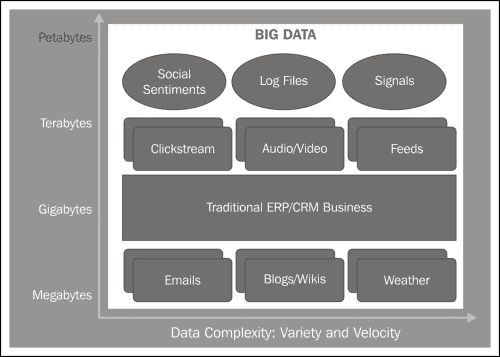
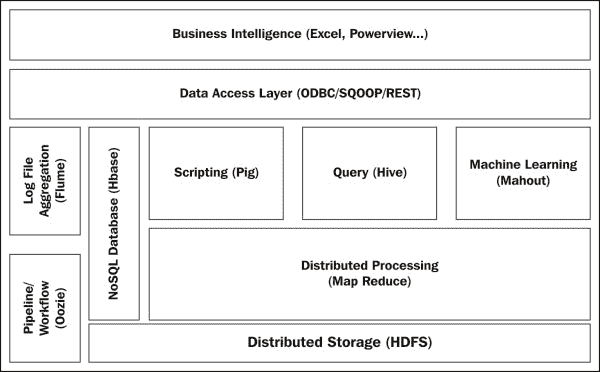

# 第一章大数据和 Hadoop 简介

突然之间，大数据成了镇上的热门话题。 从企业级到小规模初创公司，每家公司都有资金用于大数据。 存储和硬件成本在过去几年大幅降低，使企业能够存储和分析数据，而这些数据早些时候由于存储和处理挑战而被丢弃。 关于数据世界，从来没有比这更令人兴奋的时刻了。 我们看到了正在从根本上改变行业的重大趋势的汇聚，以及社交、移动、高级分析和机器学习等领域的技术创新的新纪元。 我们看到了数据的爆炸式增长，我们试图从中获得洞察力的数据有了全新的规模和范围。 在本章中，我们将深入了解什么是大数据，以及在实施大数据解决方案时 Apache Hadoop 框架是如何出现的。 通读本章后，您将能够理解：

*   什么是大数据？为什么是现在
*   大数据的业务需求
*   Apache Hadoop 框架

# 大数据-有什么大不了的？

有很多关于大数据的讨论-据估计，世界上的数字信息总量每五年增长十倍，其中 85%的数据来自新的数据类型，例如传感器、RFID、网络日志等。 这为利用这些新数据来识别新的创新机会和领域的企业提供了一个巨大的机遇。

然而，拥有一个支持数据趋势的平台只是当今挑战的一部分；您还需要让人们更容易访问它，以便他们能够获得洞察力并做出更好的决策。 如果你考虑一下用户体验，我们可以在网络上做的一切，我们通过社交媒体网站的体验，我们如何以新的方式发现、分享和协作，用户对其业务的期望，以及生产力应用也在发生变化。

我们首先要回答的问题之一是一个简单的定义：大数据与传统的大数据仓库有什么不同？ 国际数据公司(International Data Corporation)拥有被最广泛接受的大数据分类理论，即将大数据归类为三个 V：

*   **卷**：数据量呈爆炸式增长。 在过去的几十年里，计算和存储容量呈指数级增长，将硬件和存储成本压低到接近零的水平，并使其成为一种商品。 当前的数据处理需求在不断发展，要求使用行业标准硬件在几分钟(如果不是几秒钟)内分析 PB 和 ZB 级的数据。
*   **品种**：数据种类越来越多。 所有数据都在存储中，近 85%的新数据是非结构化数据。 数据可以是 tweet、具有可变属性的 JSON 以及用户可能想要处理的选择性元素的形式。
*   **速度**：数据的速度加快了业务的步伐。 得益于新的客户交互点和技术，数据捕获几乎可以瞬间完成。 实时分析比以往任何时候都更加重要。 数据汇款比率继续远远高于数据消费率；应对数据速度仍然是一个挑战。 想一想一款软件，它可以让你以与你思考的速度一样快的速度发送信息或打字。

如今，每个组织都发现很难在自己内部管理和跟踪正确的数据集，当他们需要寻找系统外部的数据时，挑战就更大了。 典型的分析师花费太多时间从数千个来源搜索正确的数据，这会对工作效率产生不利影响。 我们将从搜索的世界过渡到发现的世界，在这个世界里，信息是根据你是谁，以及你在做什么而带给用户的。 从来没有像今天这样有如此丰富的外部可获得和有用的信息。 挑战在于，您如何发现可用的内容，以及如何与其连接？

要回答当今类型的问题，您需要新的方法来发现和探索数据。 我们这里的意思是，可能驻留在许多不同域中的数据，例如：

*   **个人数据**：这是由我或我的同事创建的数据，但与手头的任务相关。
*   **组织数据**：这是在整个组织中维护和管理的数据。
*   **社区数据**：这是外部数据，例如共享到公共域中的经过管理的第三方数据集。 例如 Data.gov、Twitter、Facebook、等等。
*   **World Data**：这是全球舞台上可用的所有其他数据，例如，来自传感器或日志文件的数据，针对这些数据，出现了技术，如Hadoop for Big Data(适用于大数据的Hadoop)。

通过组合您需要的跨个人、公司、社区和世界数据的数据，您可以获得更深入的业务洞察力和趋势。 您可以连接和组合来自数百个可信数据提供商的数据-数据包括人口统计数据、环境数据、金融数据、零售和体育数据、社交数据(如 Twitter 和 Facebook AS)以及数据清理服务。 您可以通过自助式工具(例如 PowerPivot)将此数据与您的个人数据相结合，您可以使用参考数据通过 SQL Server 2012 清理您的公司数据，也可以在您的自定义应用中使用它。

现有的 RDBMS 解决方案(如 SQL Server)在管理具有挑战性的数据量方面做得很好，但当数据是非结构化或具有可变属性(如前面讨论的属性)的半结构化数据时，它就不够用了。 当前的世界似乎几乎沉迷于社交媒体情绪、推文、设备等等；如果没有合适的工具，你的公司将漂浮在数据的海洋中。 您需要能够释放大数据带来的新价值浪潮。 无论类型或结构如何，您都应该能够轻松地监控和管理所有数据。 这就是为什么组织倾向于为几乎所有数据构建端到端数据平台和易于使用的分析工具。 无论数据类型、位置(本地或云中)或大小如何，您都可以使用熟悉的工具和高性能技术来满足您的业务需求，从数据存储、处理一直到可视化。 大数据的优势不仅限于**商业智能**(**BI**)专家或数据科学家。 您组织中的几乎每个人都可以使用正确的工具进行分析并做出更明智的决策。

在传统业务环境中，支持报告机制的数据通常来自数据库中的表。 然而，越来越有必要用从组织外部获得的数据来补充这一点。 这可能是商业上可用的数据集，如 Windows Data Market 和其他地方提供的数据集，也可能是来自不太结构化的来源(如提要、电子邮件、日志文件等)的数据。 在大多数情况下，在将数据加载到现有数据库之前，您需要对其进行清理、验证和转换。 **提取、转换和加载**(**ETL**)操作可以使用大数据解决方案对非结构化或半结构化数据执行模式匹配、数据分类、重复数据删除和汇总操作，以生成可以导入到数据库表中的熟悉行和列格式的数据。 下图将让您对大数据有一个概念性的了解：

大数据需要一定程度的机器学习或复杂的统计处理才能产生洞察力。 如果您必须使用非标准技术来处理和托管它，那么很可能是大数据。

大数据实现中的数据存储通常被称为`NoSQL`存储，尽管这在技术上并不准确，因为某些实现确实支持类似 SQL 的查询语言。 `NoSQL`存储通常比关系存储便宜得多，并且通常支持只允许追加数据的一次写入功能。 要更新这些存储区中的数据，您必须删除并重新创建相关文件。 此限制可最大限度地提高性能；大数据存储实施通常以吞吐量而不是容量来衡量，因为这通常是存储和查询效率的最重要因素。 此方法还提供更好的性能，并维护数据更改的历史记录。

### 备注

但是，非常重要的一点是，除了支持所有类型的数据外，将数据移入和移出非关系型存储(如 Hadoop)和关系型数据仓库(如 SQL Server)是大数据客户的主要使用模式之一。 在整本书中，我们将探索如何集成 Hadoop 和 SQL Server，并使用 SQL Server BI 套件实现对任何数据的强大可视化。

# Apache Hadoop 框架

Hadoop 是一个开源软件框架，支持通过 Apache 开源社区提供的数据密集型分布式应用。 它由分布式文件系统**HDFS**、**Hadoop 分布式文件系统**和一种称为 MapReduce 的分布式分析处理方法组成。 它是用 Java 编写的，基于 Linux/Unix 平台。

它现在被广泛用于处理远远超过最大企业数据集大小的数据流。 无论是传感器、点击流、社交媒体、基于位置的数据，还是在大型 gob 中生成和收集的其他数据，Hadoop 经常在现场处理和分析这些数据。 Hadoop 的真正魔力在于，它能够将处理或计算逻辑移动到数据所在的位置，而不是传统系统，后者专注于扩展的单个服务器，将数据移动到中央处理器，并在那里处理数据。 这种模式不适用于当今业界希望挖掘以获取商业智能的数据量、速度和种类。 因此，Hadoop 凭借其强大的容错和可靠的文件系统以及高度优化的分布式计算模型，是大数据世界的领导者之一。

Hadoop 的核心是其存储系统和分布式计算模型：

## HDFS

Hadoop 分布式文件系统是在主机操作系统文件系统之上的程序级抽象。 它负责在集群上存储数据。 数据被拆分成数据块，并跨群集中的多个节点分布。

## MapReduce

MapReduce 是一种编程模型，用于在计算机集群上使用分布式计算处理大型数据集。 MapReduce由两个阶段组成：将数据划分到大量独立的处理单元(称为 Map)，然后将这些单独进程产生的结果组合成一个统一的结果集(称为 Reduce)。 在 Map 和 Reduce 之间，会发生混洗和排序。 在系统上成功配置 Hadoop 群集后，它具有以下基本组件：

### NameNode

这也称为群集的头节点/主节点。 首先，它在处理跨节点分布的数据期间保存 HDFS的元数据；它跟踪节点中的每个 HDFS 数据块。

### 备注

NameNode 是 Hadoop 集群中的单点故障。

### 二级 NameNode

这是一个可选的节点，在 NameNode 关闭时，您可以在群集中使用它来备份 NameNode。 如果配置了辅助 NameNode，它会定期保存 NameNode 配置的快照，以便在需要时充当备份。 但是，没有自动故障转移到辅助 NameNode 的方法；如果主要 NameNode 出现故障，则需要手动干预。 这实质上意味着，如果 NameNode 出现故障，集群中将出现明显的停机时间。

### 数据节点

这些是存储实际 HDFS 数据块的个集群中的个系统。 数据块在多个节点上复制，以提供容错和高可用性解决方案。

### JobTracker

这是在 NameNode 上运行的服务，它管理 MapReduce 作业并分发各个任务。

### TaskTracker

这是一个在 DataNodes 上运行的服务，它实例化并监视个提交的 Map 和 Reduce 任务。

下图显示了 Apache Hadoop 框架的核心组件：

此外，还有多个 Hadoop 支持项目，每个项目都有其独特的用途，例如，将输入数据提供给 Hadoop 系统、在 Hadoop 之上进行特殊查询的数据仓库系统等等。 以下是一些值得一提的是：

## ==同步，由 Elderman 更正==@ELDER_MAN

HIVE 是 Apache Hadoop 主项目的支持项目，是 MapReduce 之上的抽象，允许用户在不开发 MapReduce 应用的情况下查询数据。 它为用户提供了一种类似 SQL 的查询语言，称为**配置单元查询语言**(**HQL**)，用于从配置单元存储获取数据。 这使得具有 SQL 技能的人更容易快速适应 Hadoop 环境。

## PIG

PIG 是 MapReduce 的另一种抽象，MapReduce 使用称为 Pig 拉丁语的数据流脚本语言。 这受到已经具备脚本编写技能的程序员的青睐。 您可以在名为 Grunt 的命令行 Pig shell中交互运行 Pig 拉丁语语句。 您还可以将一系列 Pig 拉丁语句组合到一个脚本中，然后可以将其作为一个单元执行。 这些 Pig 拉丁语句由 Pig 解释器用于生成 MapReduce 作业，并在 HDFS 数据上执行。

## Flume

Flume 是 Hadoop 之上的另一个开源实现，它提供了一种在生成数据时将数据摄取到 HDFS 中的机制。

## Sqoop

Sqoop 提供了一种在关系数据库表(例如，SQL Server)和 HDFS 之间导入和导出数据的方法。

## Oozie

Oozie 允许创建MapReduce 作业的工作流。 这对于开发过基于工作流和通信基础的解决方案的开发人员来说是很熟悉的。

## HBase

HBase 是 Hadoop 数据库，是`NoSQL`数据库。 它是 Hadoop 之上的另一个抽象，它为 HDFS 数据提供了近乎实时的查询机制。

## Mahout

Mahout 是一个机器学习库，包含聚类和分类算法。 机器学习研究的一个主要焦点是自动学习识别复杂模式，并基于数据做出智能决策。

下图为您提供了 1000 英尺的 Apache Hadoop 和各种支持项目的视图，这些项目构成了这个令人惊叹的生态系统：

我们将在本书的后续章节中探讨其中一些组件，但要获得完整的参考，请访问 apache 网站[http://hadoop.apache.org/](http://hadoop.apache.org/)。

建立这个生态系统以及所需的支持项目可能真的不是一件容易的事。 事实上，此实现的唯一缺点是设置和管理 Hadoop 集群所需的工作量。 这基本上就是许多供应商提出自己的 Hadoop 发行版(捆绑和分发)作为数据处理平台的原因。 使用这些发行版，企业将能够通过简化且用户友好的群集部署向导在几分钟内设置 Hadoop 群集，还可以使用各种仪表板进行监控和检测。 目前的一些发行版包括 Cloudera 的*CH4、*Hortonworks Data Platform*和*Microsoft HDInsight*，它们正在迅速流行起来。 这些发行版超出了本书的范围，不会涉及；有关这些发行版的详细信息，请访问各自的网站。*

# 摘要

在本章中，我们介绍了什么是大数据，以及为什么大数据是该行业的迫切需求之一。 需要处理的数据的多样性将信息技术推向了前所未有的高度。 能够利用大数据分析所有数据的组织将能够更有效地实现差异化，并为业务带来新的价值，无论是收入增长、成本节约，还是创建全新的业务模式。 例如，金融公司使用机器学习来构建更好的欺诈检测算法，超越了涉及收费频率和地点的简单业务规则，还包括个人定制的购买模式，最终带来更好的客户体验。

在大数据实施方面，这些新要求挑战了传统的数据管理技术，需要一种新的方法来使组织能够有效地管理、丰富和洞察任何数据。 Apache Hadoop 无疑是大数据行业的领导者之一。 整个生态系统及其支持项目为用户提供了一个高度可靠的容错框架，可用于非结构化和半结构化数据的大规模并行分布式处理。

在下一章中，您将看到如何使用 Sqoop 连接器将 Hadoop 数据移动到 SQL Server 2012，反之亦然。 Sqoop 是另一个开源项目，旨在将 Hadoop 中的数据双向导入/导出到任何关系数据库管理系统；我们将看到它的使用是 Hadoop 和 SQL Server 2012 之间数据集成的第一步。