# 三、使用配置单元 ODBC 驱动

HIVE 是一个基于核心 Hadoop 的框架。 它充当 HDFS 之上的数据仓库系统，并提供对底层 HDFS 数据的简单查询机制。 编写 MapReduce 作业可能会很繁琐，而且会有自己的开发、测试和维护投资。 配置单元查询，称为配置单元查询语言(HQL)，在幕后分解为 MapReduce 作业，对用户来说仍然是一个完整的抽象，并为 Hadoop 数据提供基于查询的访问机制。 配置单元查询的简单性和“SQL”特性使其成为用户的流行和首选，尤其是熟悉传统 SQL 技能的人喜欢它，因为启动时间要短得多。 下图概述了配置单元架构：

实际上，配置单元使您能够在 MapReduce 上创建一个接口层，其使用方式与传统关系数据库类似；使业务用户能够使用熟悉的工具(如 Excel 和 SQL Server Reporting Services)来使用 Hadoop 中的数据，其方式与通过 ODBC 连接远程使用 SQL Server 等数据库系统中的数据的方式相似。 本章的其余部分将引导您完成不同的配置单元操作，并使用配置单元 ODBC 驱动来使用数据。

学完本章后，您将能够：

*   下载并安装配置单元 ODBC 驱动
*   配置驱动以连接到在 Linux 上的 Hadoop 群集上运行的配置单元
*   使用**SQL Server Integration Services**(**SSIS**)将数据从配置单元导入到 SQL Server

# 配置单元 ODBC 驱动

配置单元的主要优势之一是，它提供了类似于关系数据库的查询体验，而关系数据库是许多业务用户熟悉的技术。 从本质上讲，它允许所有兼容 ODBC 的客户端通过熟悉的**ODBC 数据源**(**DSN**)使用 HDFS 数据，从而将 Hadoop 暴露给广泛多样的客户端应用。

目前市场上有几个 ODBC 驱动，它们工作在各自的 Hadoop 发行版之上。 在本书中，我们将重点介绍 Microsoft ODBC Driver for Have 及其丰富的商业智能和可视化工具，该驱动可以弥合 Hadoop 和 SQL Server 之间的差距。 可以从[http://www.microsoft.com/en-us/download/details.aspx?id=37134](http://www.microsoft.com/en-us/download/details.aspx?id=37134)下载驱动。

该驱动有两种版本，64 位和 32 位，因此请确保根据客户端应用的位配置下载并安装适当的驱动。 在我的例子中，因为我将使用来自 32 位应用的驱动作为 Visual Studio，所以我使用了 32 位风格的驱动。 驱动安装完成后，您可以通过检查 ODBC 数据管理器的驱动列表中是否存在配置单元 ODBC 驱动来确认安装状态，如以下屏幕截图所示：

### 备注

如果您使用的是 64 位 Windows，并且使用的是 32 位 ODBC 驱动，则必须从`C:\Windows\SysWow64\odbcad32.exe`启动 ODBC 数据源管理器。

驱动安装成功后，请执行以下步骤以确保您可以成功地连接到配置单元：

1.  First, create a **System DSN**. In **ODBC Data Sources Administrator**, go to the **System DSN** tab and click on the **Add** Button as shown in the following screenshot:

    

2.  Choose, the **HIVE** driver in the next screen of the **Create New Data Source wizard** as shown in the following screenshot:

    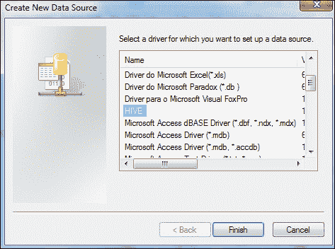

3.  On clicking **Finish**, you are presented with the final **ODBC Hive Setup** screen. Enter the Hadoop cluster details as well as the credentials used to connect to the cluster. In this sample, I am using my Hadoop cluster deployed in Linux, `RH2754741` is my NameNode:

    

4.  Once created, a new **System DSN** should appear in the list as in the following screenshot. In this case, I have named my DSN as **HadoopOnLinux**.

    

5.  Now, we need to test the connection to Hive using the DSN **HadoopOnLinux**. The quickest way to test this out is to test from an `.udl` (**Universal Data Link**) file. To do this, create an empty `.txt` file and change the file extension to `.udl`. Then, double-click and open the `.udl` file, by default it should open with Microsoft OLE DB Core components and should look like the following screenshot:

    

6.  选择**Microsoft OLE DB Provider for ODBC Drivers**，然后单击**Next**。
7.  Choose the DSN **HadoopOnLinux** created in the previous steps. Provide the **User name** and **Password** for your Hadoop cluster and click on the **Test Connection** button. A successful test connection will confirm that the Hive ODBC driver is correctly set up as in the following screenshot and we are ready to go!

    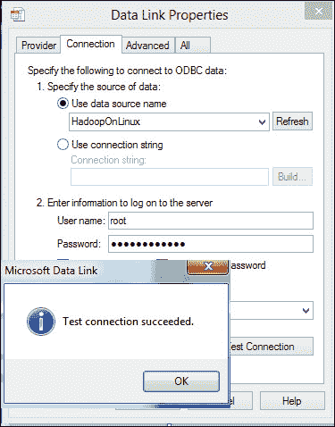

# SQL Server Integration Services(SSIS)

Microsoft SQL Server 是一套完整的工具，其中包括 RDBMS 系统、多维 OLAP 和表格数据库引擎以及其他服务，例如代理服务、计划服务(SQL 代理)等。 正如在[第 1 章](1.html "Chapter 1. Introduction to Big Data and Hadoop")，*大数据和 Hadoop 简介*中所讨论的，如今在不同来源之间集成数据变得极其重要。 SQL Server 还提供了强大的商业智能堆栈，该堆栈为数据挖掘和交互式报告提供了丰富的功能。 其中一个 BI 组件是称为**SQL Server Integration Services**(**SSIS**)的提取、转换和加载(ETL)工具。 SSIS 通过将配置单元数据导入 SQL Server 并对集成数据应用强大的分析来提供合并结构化和非结构化数据的能力。 在本章的其余部分中，我们将对 SSIS 的工作原理有一个基本的了解，并创建一个简单的 SSIS 包来将数据从配置单元导入到 SQL Server。

## 作为 ETL 提取、转换和加载工具的 SSIS

ETL 工具的主要目标是能够在异构数据源之间导入和导出数据。 这包括连接到外部系统的能力，以及在外部系统和数据库之间移动数据时转换或清除数据的能力。 SSI 可用于向 SQL Server 导入数据或从 SQL Server 导入数据。 它甚至可以用于在外部非 SQL 系统之间移动数据，而不需要 SQL Server 作为源或目标。 例如，SSIS 可用于将数据从 FTP 服务器移动到本地平面文件。

SSIS 还提供了一个工作流引擎，用于自动执行不同的任务(例如，数据流、任务执行等)。 在 ETL 作业中执行的。 SSIS 包执行本身可以是 SQL 代理作业的一部分，并且 SQL 代理可以独立运行多个作业。

SSIS 解决方案由一个或多个包组成，每个包都包含执行一系列任务的控制流。 控制流中的任务可以包括对 Web 服务的调用、FTP 操作、文件系统任务、命令行命令的自动化等。 具体地说，控制流通常包括一个或多个数据流任务，这些任务封装了从源到目的地的内存中的、基于缓冲区的数据流水线，并在数据流经流水线时对其应用转换。 一个 SSIS 包有一个控制流，需要多少数据流就有多少数据流。 数据流的执行由控制流的内容决定。

有关 SSIS 及其组件的详细讨论超出了本书的范围，并且假定您熟悉使用 Business Intelligence Development Studio(SQL Server 2005/2008/2008 R2)或 SQL Server Data Tools(SQL Server 2012)进行的基本 SSIS 包开发。 如果您是 SSIS 的初学者，强烈建议您阅读大量 SSIS 书籍作为前提条件。 在本章的其余部分，我们将重点介绍如何使用配置单元 ODBC 驱动使用 SSIS 中的配置单元数据。

开发本章中显示的软件包的先决条件是 SQL Server 数据工具(作为 SQL Server 2012 客户端工具和组件的一部分)和安装的 32 位配置单元 ODBC 驱动。 您还需要在 Hadoop 集群上运行配置单元。

# 开发包

**SQL Server Data Tools**(**SSDT**)是 Microsoft 提供的用于设计、部署和开发 SSIS 包的集成开发环境。 当您选择从 SQL Server 安装介质安装 SQL Server 客户端工具和工作站组件时，将安装 SSDT。 SSDT 支持创建 Integration Services、Analysis Services 和 Reporting Services 项目。 在这里，我们将重点介绍 Integration Services 项目类型。

## 创建项目

执行以下步骤以创建新项目。

1.  Launch **SQL Server Data Tools** from **SQL Server 2012** program folders as shown in the following screenshot:

    

2.  Create a new Project and choose **Integration Services Project** in the **New Project** dialog as shown in the following screenshot:

    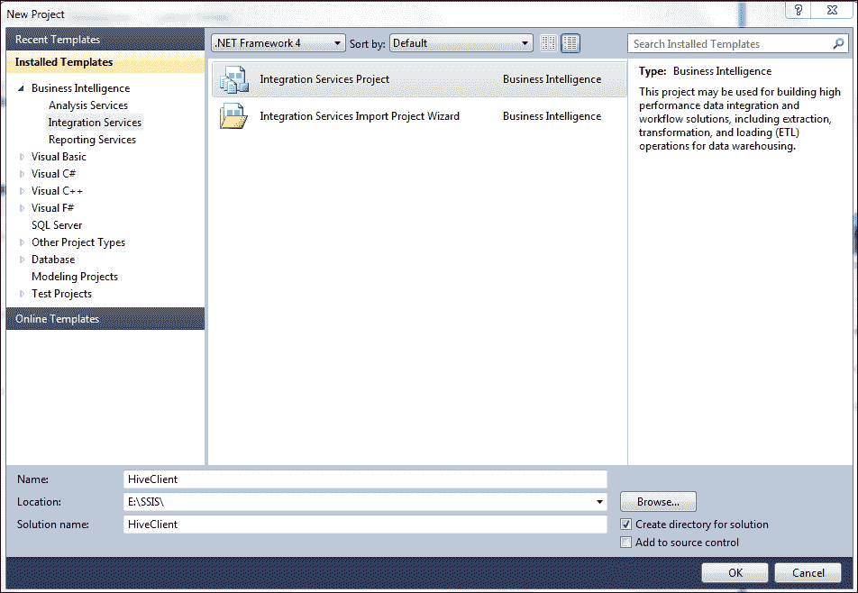

3.  这将创建 SSIS 项目，其中空白`Package.dtsx`在项目的**解决方案资源管理器**窗口中可见，如以下屏幕截图所示：

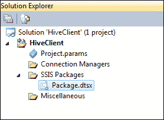

## 创建数据流

数据流是一个 SSIS 包组件，它由提取和加载数据的源和目标、修改和扩展数据的转换以及链接源、转换和目标的路径组成。 在将数据流添加到包之前，包控制流必须包括数据流任务。 数据流任务是 SSIS 包中的可执行文件，用于创建、排序和运行数据流。 将为包中的每个数据流任务打开数据流引擎的单独实例。 要创建数据流任务，请执行以下步骤：

1.  Double-click (or drag-and-drop) on a **Data Flow Task** from the toolbox on the left. This should place a **Data Flow Task** in the **Control Flow** canvas of the package as in the following screenshot:

    

2.  Double-click on the **Data Flow Task** or click on the **Data Flow** tab in SSDT to edit the task and design the source and destination components as in the following screenshot:

    

## 创建源配置单元连接

我们需要做的第一件事是创建一个连接管理器，该管理器将连接到 Hadoop 集群中托管的配置单元数据表。 我们将使用 ADO.NET 连接，该连接将使用我们先前创建的 DSN**HadoopOnLinux**连接到配置单元。 要创建连接，请执行以下步骤：

1.  Right-click on the **Connection Managers** section in the project and click on **New ADO.Net Connection...** as shown in the following screenshot:

    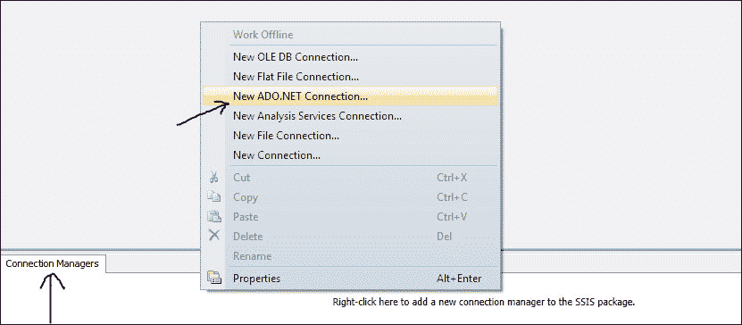

2.  From the list of providers, navigate to **.Net Providers** | **ODBC Data Provider** and click on **OK** in the **Connection Manager** window as shown in the following screenshot:

    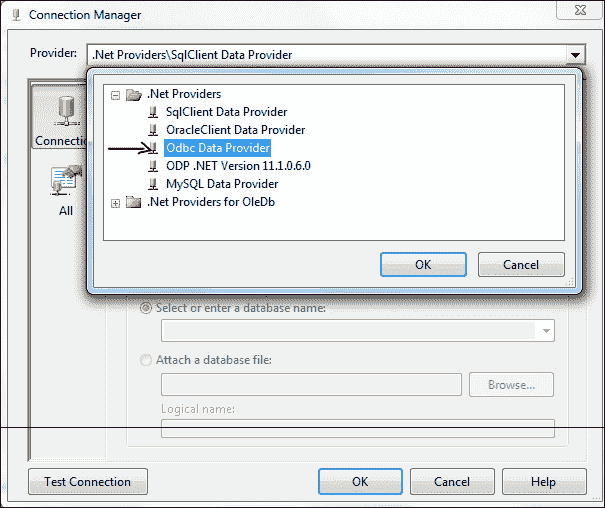

3.  Select the **HadoopOnLinux** DSN from the Data Sources list. Provide the Hadoop cluster credentials and test connection should succeed as shown in the following screenshot:

    

## 创建目标 SQL 连接

我们需要配置连接以指向 SQL Server 实例和数据库表，我们将在其中从配置单元导入数据。 为此，我们需要创建到目标 SQL 的连接管理器，就像我们对源配置单元所做的那样：

1.  Right-click on the **Connection Manager** section of the project again, and this time, choose **New OLE DB Connection...** as shown in the following screenshot:

    

2.  From the list of providers, choose **Native OLE DB** | **SQL Server Native Client 11.0**. Key in the target SQL Server name and select the database where the target table resides. Test connection should succeed confirming the validity of the connection manager for the destination as shown in the following screenshot:

    

    ### 备注

    在本例中，我选择了 OLE DB 来连接到 SQL。 您也可以选择使用 ADO.NET 或 ODBC 连接来执行相同的操作。

## 创建配置单元源组件

接下来，我们需要配置源组件，该组件将连接到配置单元并获取数据。 成功创建连接后，双击以将**ADO Net Source**放置在数据流画布上，如以下屏幕截图所示：

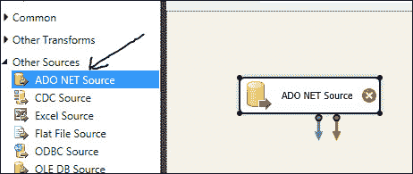

### 备注

在 SSIS 2012 中，ODBC 源和 ODBC 目标是产品中包含的一对数据流组件。 尽管 ODBC Source 组件支持许多与 ODBC 兼容的数据源，但在撰写本文时，该组件还不支持配置单元 ODBC 驱动。 如今，从 SSIS 使用配置单元 ODBC 驱动的唯一选择是通过 ADO.NET 组件。

右键单击**ADO Net Source**，然后单击**Edit**，将源配置为使用刚创建的连接连接到配置单元表格。 选择连接管理器(我将其命名为**配置单元连接**)和配置单元表(在我的示例中，它是`facebookinsights`表)。 您可以预览数据，以确保源可以毫无问题地提取数据。 此外，请确保导航到**Columns**选项卡，并确认您可以看到表中的所有列。 点击**确定**完成配置，如下图所示：

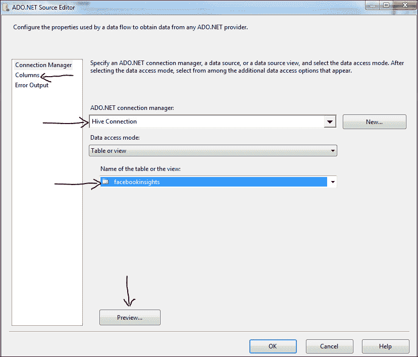

### 提示

您还可以通过单击**ADO.NET 连接管理器**旁边的**New**按钮，在配置源组件的同时动态创建连接管理器。

## 创建 SQL 目标组件

配置源后，我们需要配置要导入配置单元数据的目标。 在本例中，我将使用 SQL Server 作为目的地。 为此，请双击并将**OLE DB Destination**组件放置在数据流画布中。 确保通过在源和目标之间拖动箭头来连接**ADO Net Source**和**OLE DB Destination**组件。 这是 SSIS 根据源架构结构自动生成目标的元数据和列映射所必需的。 该软件包应该类似于以下屏幕截图：

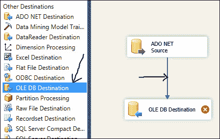

### 备注

在本例中，我使用 OLE DB 目标组件绑定到目标 SQL Server 表。 但是，您也可以将 ADO.NET 目标组件或 SQL Server 目标组件用于相同的目的。

仅当包在 SQL Server 驻留的同一系统上本地运行时，SQL Server 目标才起作用。

现在，可以将**OLE DB 目标**配置为指向正确的 SQL 连接和数据库表。 为此，请右键单击**OLE DB Destination**组件，然后单击**Edit**。 选择我们刚刚创建的**OLE DB 连接管理器**到 SQL 和目标表。 在本例中，我将连接命名为**SQL Connection**，并且已经在 SQL 数据库中创建了一个名为`facebookinsights`的预定义表。 如果您没有预先创建表格，您可以通过单击表格的**名称或视图**下拉列表旁边的**New**按钮来选择动态创建目标表。 以下屏幕截图显示了这一点：

### 备注

您还可以在配置目标组件的同时动态地创建连接管理器和数据库表，方法是单击相应的**New**按钮，如前面的屏幕截图所示。

## 映射列

完成此操作后，请确保导航到**Mappings**选项卡，以确保源和目标之间的列映射正确，如下面的屏幕截图所示。 单击**确定**完成配置。

### 备注

如果您选择自己创建目标表，并指定与源不同的列名，则必须手动映射这些源列和目标列中的每一列。 SSIS 的内置列映射智能基于相同的列名，因此如果它们不同，请确保正确设置列映射。

源和目标之间的数据流以及连接管理器应该类似于以下屏幕截图：

## 运行包

瞧！！ 我们都准备好出发了。 从菜单栏导航到**Debug**|**Start Debug**或按*F5*或单击工具栏中的 Play(播放)按钮来执行包，如以下屏幕截图所示：

包应该成功运行，将记录从配置单元表传输到 SQL Server 表，并显示导入的记录总数，如以下屏幕截图所示：

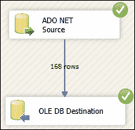

如果您在 64 位 Windows 操作系统中运行此程序包，则需要将**Run64BitRuntime**属性从**项目**属性|**配置**属性|**调试**选项卡更改为**False**，以执行使用 32 位配置单元 ODBC 驱动的程序包，如以下屏幕截图所示：

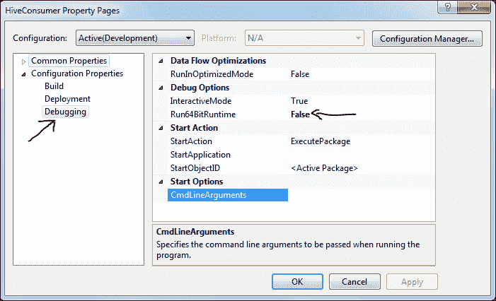

现在，您可以将此包计划为 SQL Server 作业，并定期运行数据加载。 您可能还希望在数据加载到目标 SQL 仓库之前对其应用一些转换，以清理数据，或者使用内置的 SSIS 数据流转换组件应用必要的业务逻辑。

# 摘要

在本章中，我们深入了解了 Hadoop 的支持项目 Hive。 HIVE 充当 HDFS 之上的数据仓库，提供称为 HQL 的简单、熟悉的类似 SQL 的查询结构来获取底层数据。 HQL 在内部被分解成 MapReduce 代码，从而使最终用户不必编写复杂的 MapReduce 代码。 我们还了解了在客户端使用者和 Hadoop 之间充当接口的 Have ODBC 驱动；如何安装该驱动以及如何测试该驱动是否能够成功连接到 Have。 在本章中，我们还简要介绍了 SQL Server 及其商业智能组件。 我们开发了一个示例包，它使用配置单元 ODBC 驱动连接到配置单元，并将数据从配置单元表`facebookinsights`导入到 SQL Server。 一旦数据存储到 SQL Server 中，我们就可以利用仓库解决方案，如**SQL Server Analysis Services**(**SSAS**)来分割数据，并利用**SQL Server Reporting Services**(**SSRS**)对数据进行强大的报告。 这还使我们能够集成要与传统 RDBMS 数据合并的非关系数据，并将其作为一个整体提取信息。 在下一章中，您将看到如何使用配置单元 ODBC 驱动在 SQL 中创建链接服务器。 您还将学习如何使用链接服务器查询从配置单元导入数据，并在 SSAS 中创建多维模型以供进一步处理。