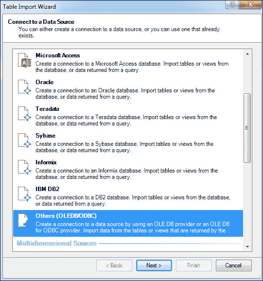
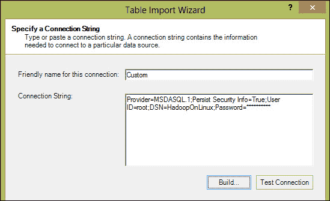
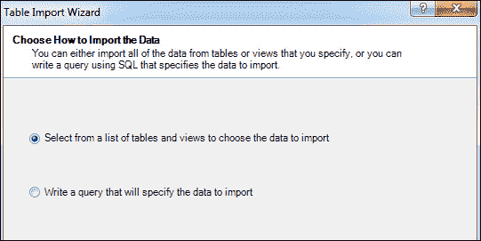
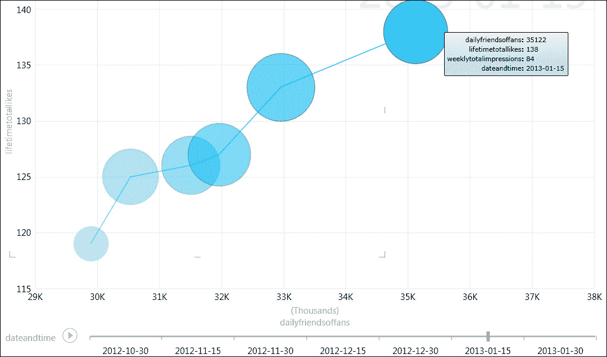

# 五、使用微软的自助式商业智能工具

商业智能的重点是为商业用户提供比他们从运营系统中获得的更准确、更可靠、更好的信息。 传统的 BI 解决方案一直依赖于集中式的、经过清理和转换的数据存储区，用户可以通过标准化报告访问该数据存储区，偶尔还可以通过临时查询工具进行访问。 报告由 Bi 专家开发，最低要求是聘请一组专业人员来运行和维护基础设施和解决方案。

在部署这样的系统之后，对满足特定需求的数据源或新数据源的请求可能需要几天时间才能提供服务，因为它必须通过定义的变更管理请求。 由于只有几个资源经过了足够好的培训来处理这些请求，因此这些更改甚至可能需要数周时间才能实施。

许多高管已经意识到，在动态的业务环境中，当前的 BI 方法无法跟上数据流入的步伐。 数据现在无处不在，而且呈指数级增长。 在任何事情上过于依赖大预算的 BI 团队都是不能接受的。 这导致了一种名为自助式 BI 的新技术的诞生。 自助式商务智能是目前镇上的热门话题。 它允许您快速高效地执行专业级别的数据分析，而无需雇佣一套昂贵的 BI 基础设施或一组熟练的人员。 Microsoft 提供了一套丰富的自助式 BI 工具，可以连接到包括 SQL Server 2012 和 Hadoop 在内的各种数据源，并快速提供有关数据的见解。 它与强大的报告工具相结合，在底层数据上产生无缝的交互式可视化。 这通常位于管理金字塔的顶端，业务主管审阅这些报告，并做出改善业务和更有效地利用资源的决策。 在本章中，您将了解以下内容：

*   Microsoft 自助式 BI 工具
*   使用 PowerPivot 生成数据模型
*   使用 Power View 在数据模型上创建交互式报告

# PowerPivot 增强功能

SQL Server 2012 为 Excel插件形式的 PowerPivot 客户端以及 SharePoint 中的 PowerPivot 服务器端组件引入了增强的数据分析功能。 这使得 Microsoft Office 用户只需点击几下即可拥有自助式商业智能功能，这是以前从未有过的。 用户现在可以更轻松地集成来自不同来源的数据，并使用熟悉的工具(如 Excel 和 SharePoint)提供强大的数据可视化，从而使企业能够做出正确的决策。

PowerPivot 作为 Excel 2010 的外接程序提供，允许从任何源和联合集成数据，包括**Open Data Protocol**(**ODATA**)提要、RDBMS 源、Hadoop 等。 使用 PowerPivot，您可以从前面提到的任何不同的数据源创建自己的数据模型，并将大量数据直接导入 Excel。 如果需要将这些数据模型作为共享存储库，则可以在 SharePoint 服务器中发布它们，并非常容易地在整个企业中共享它们。 PowerPivot 模型还可以作为市场上可用的其他商业智能工具的数据源，包括 Power View(本章稍后讨论)，以生成直观、交互的报告，以进行趋势分析、预测分析等。

以下部分说明如何基于先前使用配置单元 ODBC 驱动创建的`facebookinsights`配置单元表生成 PowerPivot 数据模型。 我们在演示中使用了 Excel 2013。 确保打开 Excel 所需的加载项，如以下屏幕截图所示，以构建本章中使用的示例：

1.  Navigate to **File** | **Options** | **Add-ins**. In the **Manage** drop-down list, choose **COM Add-ins** and click on **Go**, and enable the following add-ins:

    

    ### 备注

    Excel 2010 也支持 PowerPivot。 Power View 和数据资源管理器仅在 Excel 2013 中可用。

2.  To create a PowerPivot model, open Excel, navigate to the **PowerPivot** ribbon and click on **Manage** as shown in the following screenshot:

    

    这将打开 PowerPivot for Excel 窗口，我们需要在其中配置到配置单元的连接。

3.  Click on **Get External Data** and choose **From other Sources** as shown in the following screenshot:

    

4.  Since we would be using the Hive ODBC provider, choose **Others (OLEDB/ODBC)** and click on **Next** on the **Table Import Wizard** as shown in the following screenshot:

    

5.  The next screen in the wizard accepts the connection string for our data source. It is easier to build the connection string instead of writing it manually. So, click on the **Build** button to bring up the **Data Link** window where you can select the **HadooponLinux** DSN we created earlier, and provide the correct credentials to access the Hadoop cluster. Make sure to check **Allow saving password** so that the password is retained in the underlying PowerPivot **Table Import Wizard**. Also, verify that test connection succeeds as shown in the following screenshot:

    

6.  The **Table Import Wizard** dialogue should now be populated with the appropriate **Connection String** as shown below in the following screenshot:

    

7.  Next, we are going to choose the Hive table directly, but we can also write a query (`HiveQL`) to fetch the data as shown in the following screenshot:

    

8.  Select the `facebookinsights` table and click on **Finish** to complete the configuration as in the following screenshot:

    

9.  The Hive table with all the rows should get successfully loaded in the PowerPivot model as shown in the following screenshot:

    

10.  关闭**表格导入向导**。

数据已添加到模型中，因此我们还可以继续并关闭 PowerPivot 窗口。 这将把我们带回 Excel 工作表，它现在内存中有数据模型。 在下一节中，我们将了解如何使用 Power View 使用 PowerPivot数据模型并快速创建智能交互式报表。

# Excel 的 Power View

Microsoft Excel 2013 推出了一款全新的自助式 BI 工具，名为 Power View。 这也是用于 Microsoft SharePoint Server 2013 企业版的 SQL Server 2012 Reporting Services Service Pack 1 外接程序附带的 Microsoft SharePoint 2013 的一部分。 Power View 的客户端(Excel)和服务器端(SharePoint)实现都提供了一种交互式方式来浏览和可视化您的数据，以及在底层数据之上生成交互式报告。

本章的其余部分显示基于`facebookinsights`表数据的 Power View 报告示例，让您快速了解表面级别的强大报告功能。 有关“如何设计 Power View 报告”以及 Power View 与 SharePoint 集成的详细信息不在本书讨论范围之内，也不会深入讨论。

### 备注

仅 Excel 2013 支持 Power View。 您需要安装 Excel 的 Power View 加载项。

要基于先前创建的 PowerPivot 数据模型创建 Power View 报告，请在 Excel 中单击**Insert**功能区，然后单击**Power View**，如以下屏幕截图所示：

这将启动一个新的 Power View 窗口，其中的 PowerPivot 模型已可用，如以下屏幕截图所示：

我们可以选择需要的字段并将其显示在我们的报告中。 您可以在不同类型的图表、表格和矩阵报告之间进行选择。 例如，我创建了一个报告，显示一段时间内我的 Facebook 页面的点赞和粉丝数量，如以下截图所示：

Power View 设计器为您提供了不同类型的图表、轴和时间线布局，这使得生成简单的可视化效果变得非常容易。 但是，不应将这些自助服务工具视为我们现有 BI 解决方案的替代品。 它不是标准参数化报告的替代品，而是一种增强功能，使关键职能部门和领导者能够利用自己的分析，而不会给稀缺的 IT 资源带来压力。

# 摘要

在本章中，我们学习了如何将 Microsoft 自助式 BI 工具与 Hadoop 和 Have 集成，以使用数据并生成强大的数据可视化效果。 随着技术范式的转变，该行业正走向一个信息技术将成为消费产品的时代。 个人应该能够通过 Power View 这样的客户端插件在一定程度上可视化他所需要的洞察力。 这些自助式 BI 工具提供了与各种数据源无缝连接和对话的能力，并创建了内存中的数据模型，将来自这些不同来源的数据组合在一起，以实现强大的报告功能。