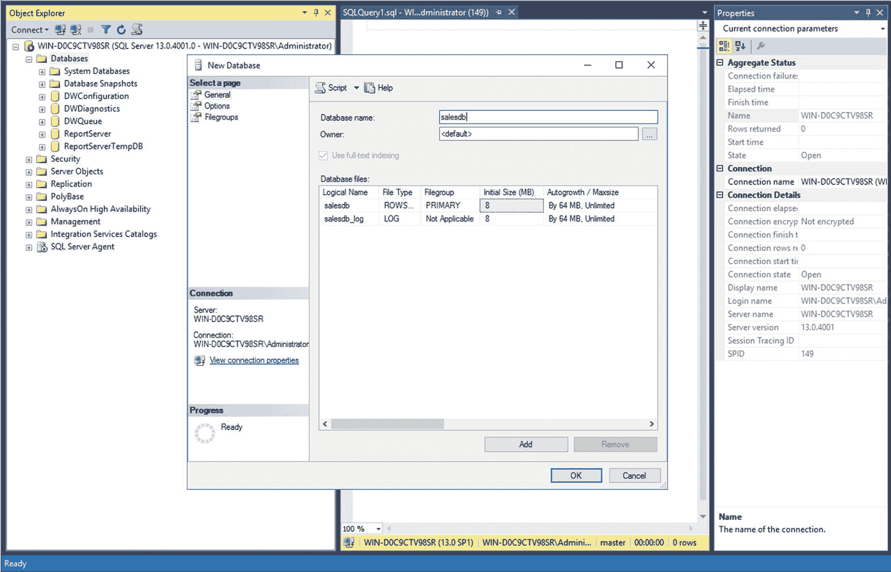
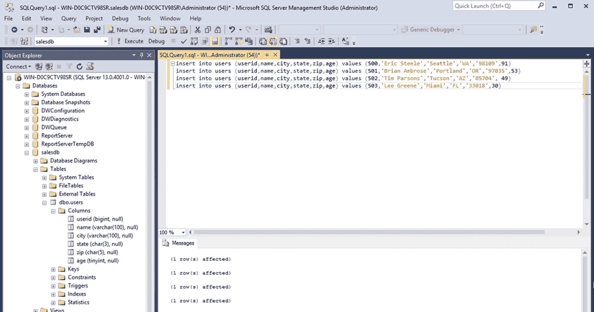
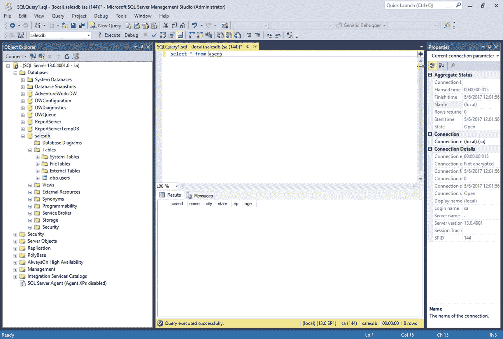
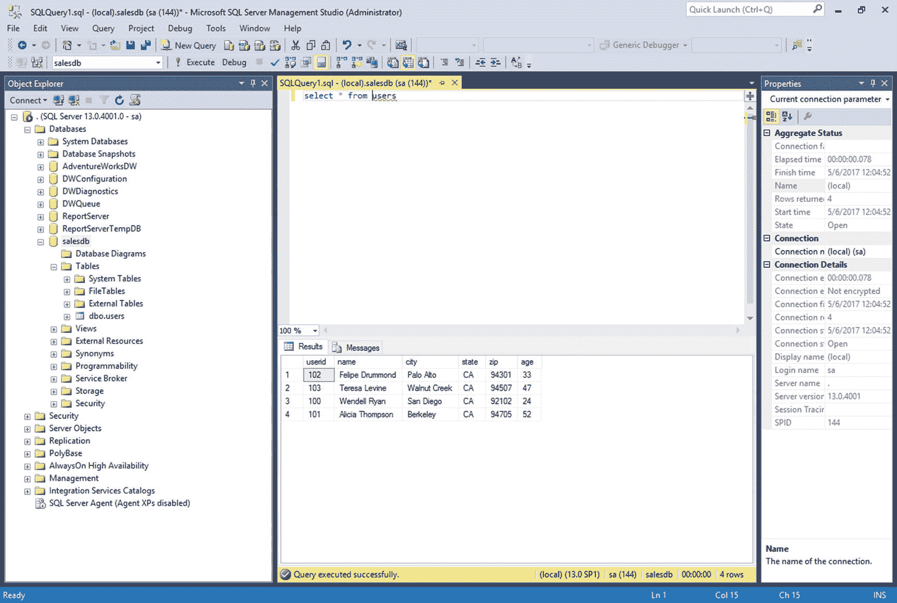
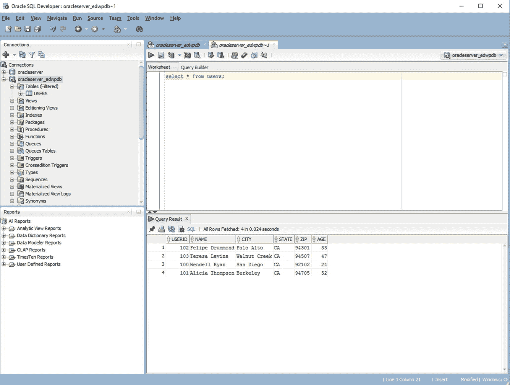
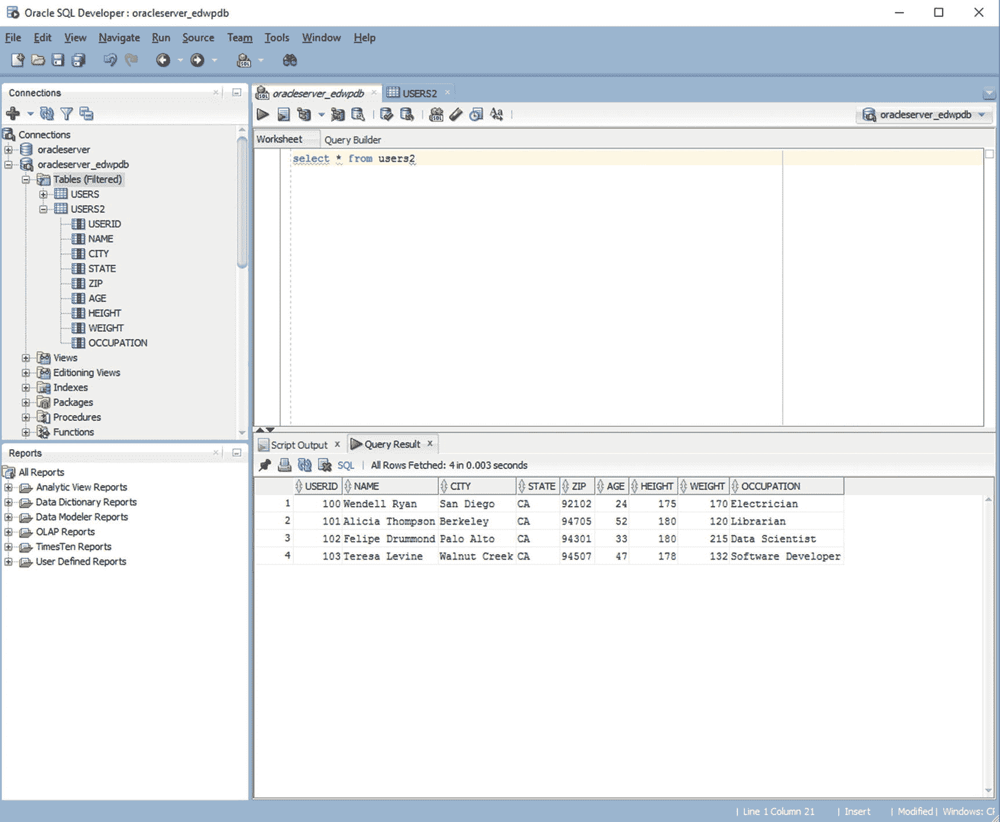

# 六、使用 Spark 和 Kudu 的高性能数据处理

Kudu 只是一个存储引擎。你需要一种方法将数据输入输出。作为 Cloudera 默认的大数据处理框架，Spark 是 Kudu 理想的数据处理和摄取工具。Spark 不仅提供了出色的可伸缩性和性能，Spark SQL 和 DataFrame API 使得与 Kudu 的交互变得很容易。

如果您来自数据仓库背景，或者熟悉 Oracle 和 SQL Server 等关系数据库，那么您可以考虑 Spark，它是 SQL(如 PL/SQL 和 T-SQL)的过程扩展的更强大、更通用的等价物。

## Spark 和酷都

您可以使用数据源 API 将 Spark 与 Kudu 结合使用。您可以使用 spark-shell 或 spark-submit 中的 packages 选项来包含 kudu-spark 依赖项。您也可以从 central.maven.org 手动下载 jar 文件，并将其包含在—jars 选项中。有关如何使用 sbt 和 Maven 作为项目构建工具的更多细节，请参考 Apache Spark 在线文档。

### Spark 1.6.x

如果您在 Scala 2.10 中使用 spark，请使用 kudu-spark_2.10 工件。例如:

```scala
spark-shell -packages org.apache.kudu:kudu-spark_2.10:1.1.0
spark-shell -jars kudu-spark_2.10-1.1.0.jar

```

### Spark 2.x

如果您在 Scala 2.11 中使用 spark2，请使用 kudu-spark2_2.11 工件。例如:

```scala
spark-shell –-packages org.apache.kudu:kudu-spark2_2.11:1.1.0
spark-shell -jars kudu-spark2_2.11-1.1.0.jar

```

## 酷都语境

您使用 Kudu 上下文来对 Kudu 表执行 DML 语句。 [<sup>i</sup>](#Sec32) 你要指定 Kudu 主服务器和端口。在下面的例子中，我们只有一个 Kudu 上下文。一个生产环境中通常有多个 Kudu masters 在这种情况下，您必须指定一个逗号分隔的列表，列出所有 Kudu 主机的主机名。我给出了如何使用 Spark 和 Kudu 的例子。我还展示了如何使用 Spark 将 Kudu 与其他数据源集成的例子。

```scala
import org.apache.kudu.spark.kudu._
val kuduContext = new KuduContext("kudumaster01:7051")

```

在开始之前，我们需要创建我们的表。

```scala
impala-shell

CREATE TABLE customers
(
 id BIGINT PRIMARY KEY,
 name STRING,
 age SMALLINT
)
PARTITION BY HASH PARTITIONS 4
STORED AS KUDU;

```

创建一个 case 类，为我们的示例数据提供一个模式。

```scala
case class CustomerData(id: Long, name: String, age: Short)

```

### 插入数据

创建一些示例数据。

```scala
val data = Array(CustomerData(101,"Lisa Kim",60), CustomerData(102,"Casey Fernandez",45))

val insertRDD = sc.parallelize(data)
val insertDF = sqlContext.createDataFrame(insertRDD)

insertDF.show

+----------+---------------+---+
|customerid|           name|age|
+----------+---------------+---+
|       101|       Lisa Kim| 60|
|       102|Casey Fernandez| 45|
+----------+---------------+---+

```

插入数据帧。记下表的名称。如果表是在 Impala 中创建的，就需要这种格式。在本例中，default 是数据库的名称，customers 是表的名称。采用这种约定是为了防止在 Impala 中创建的表和使用 Kudu API 或 Spark 本地创建的表之间的表名冲突。

```scala
kuduContext.insertRows(insertDF, "impala::default.customers")

```

确认数据已成功插入。

```scala
val df = sqlContext.read.options(Map("kudu.master" -> "kudumaster01:7051","kudu.table" -> "impala::default.customers")).kudu
df.select("id","name","age").show()

+---+---------------+---+
| id|           name|age|
+---+---------------+---+
|102|Casey Fernandez| 45|
|101|       Lisa Kim| 60|
+---+---------------+---+

```

### 更新 Kudu 表

创建更新的数据集。请注意，我们修改了姓氏和年龄。

```scala
val data = Array(CustomerData(101,"Lisa Kim",120), CustomerData(102,"Casey Jones",90))

val updateRDD = sc.parallelize(data)
val updateDF = sqlContext.createDataFrame(updateRDD)

updateDF.show

+--+------+---------+
| id|       name|age|
+--+------+---------+
|101|   Lisa Kim|120|
|102|Casey Jones| 90|
+--+------+---------+

```

更新表格。

```scala
kuduContext.updateRows(updateDF, "impala::default.customers");

```

确认该表已成功更新。

```scala
val df = sqlContext.read.options(Map("kudu.master" -> "kudumaster01:7051","kudu.table" -> "impala::default.customers")).kudu

df.select("id","name","age").show()

+--+------+---------+
| id|       name|age|
+--+------+---------+
|102|Casey Jones| 90|
|101|   Lisa Kim|120|
+--+------+---------+

```

### 令人不安的数据

创建一些示例数据。

```scala
val data = Array(CustomerData(101,"Lisa Kim",240), CustomerData(102,"Casey Cullen",90),CustomerData(103,"Byron Miller",25))

val upsertRDD = sc.parallelize(data)
val upsertDF = sqlContext.createDataFrame(upsertRDD)

upsertDF.show

+--+------+----------+
| id|        name|age|
+--+------+----------+
|101|    Lisa Kim|240|
|102|Casey Cullen| 90|
|103|Byron Miller| 25|
+--+------+----------+

```

up sert data–如果主键存在，则更新所有列，如果主键不存在，则插入行。

```scala
kuduContext.upsertRows(upsertDF, "impala::default.customers")

```

确认数据是否成功更新。

```scala
val df = sqlContext.read.options(Map("kudu.master" -> "kudumaster01:7051","kudu.table" -> "impala::default.customers")).kudu

df.select("id","name","age").show()

+--+------+----------+
| id|        name|age|
+--+------+----------+
|102|Casey Cullen| 90|
|103|Byron Miller| 25|
|101|    Lisa Kim|240|
+--+------+----------+

```

### 删除数据

检查表中的数据。

```scala
val df = sqlContext.read.options(Map("kudu.master" -> "kudumaster01:7051","kudu.table" -> "impala::default.customers")).kudu

df.select("id","name","age").show()

+--+------+----------+
| id|        name|age|
+--+------+----------+
|102|Casey Cullen| 90|
|103|Byron Miller| 25|
|101|    Lisa Kim|240|
+--+------+----------+

```

注册该表，以便我们可以在 SQL 查询中使用该表。

```scala
df.registerTempTable("customers")

```

根据我们的查询删除数据。

```scala
kuduContext.deleteRows(sqlContext.sql("select id from customers where name like 'Casey%'"), "impala::default.customers")

```

确认数据已成功删除。

```scala
val df = sqlContext.read.options(Map("kudu.master" -> "kudumaster01:7051","kudu.table" -> "impala::default.customers")).kudu

df.select("id","name","age").show()

+--+------+----------+
| id|        name|age|
+--+------+----------+
|103|Byron Miller| 25|
|101|    Lisa Kim|240|
+--+------+----------+

```

### 选择数据

选择表格中的数据。

```scala
val df = sqlContext.read.options(Map("kudu.master" -> "kudumaster01:7051","kudu.table" -> "impala::default.customers")).kudu

df.select("id","name","age").show()

+--+------+----------+
| id|        name|age|
+--+------+----------+
|103|Byron Miller| 25|
|101|    Lisa Kim|240|
+--+------+----------+

```

还可以通过注册该表并在 SQL 查询中使用它来运行查询。注意，如果使用 Spark 2.x，应该使用 createOrReplaceTempView。

```scala
df.registerTempTable("customers")

val df2 = sqlContext.sql("select * from customers where age=240")
df2.show

+--+----+--------+
| id|    name|age|
+--+----+--------+
|101|Lisa Kim|240|
+--+----+--------+

```

### 创建 Kudu 表

Impala 看不到这个表，因为这个表是在 Spark 中创建的。你必须在 Impala 中创建一个外部表，并引用这个表。

```scala
Import org.apache.kudu.client.CreateTableOptions;

kuduContext.createTable("customer2", df.schema, Seq("customerid"), new CreateTableOptions().setRangePartitionColumns(List("customerid").asJava).setNumReplicas(1))

```

### 将 CSV 插入 Kudu

让我们从 CSV 文件中插入多行。

```scala
val dataRDD = sc.textFile("/sparkdata/customerdata.csv")

val parsedRDD = dataRDD.map{_.split(",")}

case class CustomerData(customerid: Long, name: String, age: Short)

val dataDF = parsedRDD.map{a => CustomerData (a(0).toLong, a(1), a(2).toShort) }.toDF

kuduContext.insertRows(dataDF, "customer2");

```

因为我们通过 Spark 创建了 customer2 表，所以我们只需要指定表名(customer2)而不是 impala::default.customer2。

### 使用 spark-csv 包将 CSV 插入 Kudu

我们还可以使用 spark-csv 包来处理样本 csv 数据。下面的命令将自动下载 spark-csv 依赖项，因此请确保您的集群节点中有 Internet 连接。请注意使用逗号分隔软件包列表。

```scala
spark-shell -packages com.databricks:spark-csv_2.10:1.5.0,org.apache.kudu:kudu-spark_2.10:1.1.0

val dataDF = sqlContext.read.format("csv")
  .option("header", "true")
  .option("inferSchema", "true")
  .load(“/sparkdata/customerdata.csv ")

kuduContext.insertRows(dataDF, "customer2");

```

因为我们通过 Spark 创建了 customer2 表，所以我们只需要指定表名(customer2)而不是 impala::default.customer2。

### 通过以编程方式指定模式，将 CSV 插入 Kudu

您可以使用 StructType 为您的数据集定义一个架构。当无法提前确定模式时，以编程方式指定模式很有帮助。

阅读来自 HDFS 的 CSV 文件。

```scala
val myCSV = sc.textFile("/tmp/mydata/customers.csv")

```

将 CSV 数据映射到 RDD

```scala
import org.apache.spark.sql.Row

val myRDD = myCSV.map(_.split(',')).map(e ⇒ Row(r(0).trim.toInt, r(1), r(2).trim.toInt, r(3)))

```

创建一个模式。

```scala
import org.apache.spark.sql.types.{StructType, StructField, StringType, IntegerType};

val mySchema = StructType(Array(
StructField("customerid",IntegerType,false),
StructField("customername",StringType,false),
StructField("age",IntegerType,false),
StructField("city",StringType,false)))

val myDF = sqlContext.createDataFrame(myRDD, mySchema)

```

将数据帧插入 Kudu。

```scala
kuduContext.insertRows(myDF, "impala::default.customers")

```

还记得我们通过 Impala 创建了 customers 表。因此，在引用 customers 表时，我们需要使用格式 impala::database.table。

### 使用 spark-xml 包将 XML 插入 Kudu

我们将创建一个 XML 文件作为这个例子的样本数据。我们需要把文件复制到 HDFS。

```scala
cat users.xml

<userid>100</userid><name>Wendell Ryan</name><city>San Diego</city><state>CA</state><zip>92102</zip>
<userid>101</userid><name>Alicia Thompson</name><city>Berkeley</city><state>CA</state><zip>94705</zip>
<userid>102</userid><name>Felipe Drummond</name><city>Palo Alto</city><state>CA</state><zip>94301</zip>
<userid>103</userid><name>Teresa Levine</name><city>Walnut Creek</city><state>CA</state><zip>94507</zip>

hadoop fs -mkdir /xmldata
hadoop fs -put users.xml /xmldata

```

我们将使用 spark-xml 包来处理样本 xml 数据。这个包的工作方式类似于 spark-csv 包。下面的命令将自动下载 spark-xml 包，因此请确保您的集群节点中有 Internet 连接。包括 kudu-spark 依赖性。

```scala
spark-shell -packages  com.databricks:spark-xml:2.10:0.4.1,org.apache.kudu:kudu-spark_2.10:1.1.0

```

使用 Spark XML 创建一个数据帧。在本例中，我们指定了行标记和 XML 文件所在的 HDFS 路径。

```scala
val xmlDF = sqlContext.read.format("com.databricks.spark.xml").option("rowTag", "user").load("/xmldata/");

xmlDF: org.apache.spark.sql.DataFrame = [city: string, name: string, state: string, userid: bigint, zip: bigint]

```

我们也来看看数据。

```scala
xmlDF.show

+------------+---------------+-----+------+-----+
|        city|           name|state|userid|  zip|
+------------+---------------+-----+------+-----+
|   San Diego|   Wendell Ryan|   CA|   100|92102|
|    Berkeley|Alicia Thompson|   CA|   101|94705|
|   Palo Alto|Felipe Drummond|   CA|   102|94301|
|Walnut Creek|  Teresa Levine|   CA|   103|94507|
+------------+---------------+-----+------+-----+

```

让我们检查一下模式。

```scala
xmlDF.printSchema

root
 |- age: long (nullable = true)
 |- city: string (nullable = true)
 |- name: string (nullable = true)
 |- state: string (nullable = true)
 |- userid: long (nullable = true)
 |- zip: long (nullable = true)

```

现在让我们回到 impala-shell，将模式与 users 表的结构进行比较。如您所见，用户表中年龄和邮政编码列的数据类型不同于数据帧中的相应列。如果我们试图将这个数据帧插入到 Kudu 表中，我们会得到一个错误消息。

```scala
describe users;
+--------+---------+---------+-------------+
| name   | type    | comment | primary_key |
+--------+---------+---------+-------------+
| userid | bigint  |         | true        |
| name   | string  |         | false       |
| city   | string  |         | false       |
| state  | string  |         | false       |
| zip    | string  |         | false       |
| age    | tinyint |         | false       |
+--------+---------+---------+-------------+

```

在将数据帧插入 Kudu 表之前，我们需要转换数据类型。我们在这里介绍使用 selectExpr 方法来转换数据类型，但是另一种选择是使用 StructType 以编程方式指定模式。

```scala
val convertedDF = xmlDF.selectExpr("userid","name","city","state","cast(zip as string) zip","cast(age as tinyint) age");

convertedDF: org.apache.spark.sql.DataFrame = [usersid: bigint, name: string, city: string, state: string, zip: string, age: tinyint]

```

创建 kudu 上下文并将数据帧插入目标表。

```scala
import org.apache.kudu.spark.kudu._

val kuduContext = new KuduContext("kudumaster01:7051")

kuduContext.insertRows(convertedDF, "impala::default.users")

```

看起来 DataFrame 已经成功地插入到 Kudu 表中。使用 impala-shell，检查表格中的数据进行确认。

```scala
select * from users;
+--------+-----------------+--------------+-------+-------+-----+
| userid | name            | city         | state | zip   | age |
+--------+-----------------+--------------+-------+-------+-----+
| 102    | Felipe Drummond | Palo Alto    | CA    | 94301 | 33  |
| 103    | Teresa Levine   | Walnut Creek | CA    | 94507 | 47  |
| 100    | Wendell Ryan    | San Diego    | CA    | 92102 | 24  |
| 101    | Alicia Thompson | Berkeley     | CA    | 94705 | 52  |
+--------+-----------------+--------------+-------+-------+-----+

```

### 将 JSON 插入 Kudu

我们将创建一个 JSON 文件作为这个例子的样本数据。确保该文件位于 HDFS 名为/jsondata 的文件夹中。

```scala
cat users.json

{"userid": 200, "name": "Jonathan West", "city":"Frisco", "state":"TX", "zip": "75034", "age":35}
{"userid": 201, "name": "Andrea Foreman", "city":"Dallas", "state":"TX", "zip": "75001", "age":28}
{"userid": 202, "name": "Kirsten Jung", "city":"Plano", "state":"TX", "zip": "75025", "age":69}
{"userid": 203, "name": "Jessica Nguyen", "city":"Allen", "state":"TX", "zip": "75002", "age":52}

```

从 JSON 文件创建一个数据帧。

```scala
val jsonDF = sqlContext.read.json("/jsondata")

jsonDF: org.apache.spark.sql.DataFrame = [age: bigint, city: string, name: string, state: string, userid: bigint, zip: string]

```

检查日期

```scala
jsonDF.show

+---+------+--------------+-----+------+-----+
|age|  city|          name|state|userid|  zip|
+---+------+--------------+-----+------+-----+
| 35|Frisco| Jonathan West|   TX|   200|75034|
| 28|Dallas|Andrea Foreman|   TX|   201|75001|
| 69| Plano|  Kirsten Jung|   TX|   202|75025|
| 52| Allen|Jessica Nguyen|   TX|   203|75002|
+---+------+--------------+-----+------+-----+

```

请检查架构。

```scala
jsonDF.printSchema

root
 |- age: long (nullable = true)
 |- city: string (nullable = true)
 |- name: string (nullable = true)
 |- state: string (nullable = true)
 |- userid: long (nullable = true)
 |- zip: string (nullable = true)

```

将 age 列的数据类型转换为 tinyint，以匹配表的数据类型。

```scala
val convertedDF = jsonDF.selectExpr("userid","name","city","state","zip","cast(age as tinyint) age");

convertedDF: org.apache.spark.sql.DataFrame = [userid: bigint, name: string, city: string, state: string, zip: string, age: tinyint]

```

创建 kudu 上下文并将数据帧插入目标表。

```scala
import org.apache.kudu.spark.kudu._

val kuduContext = new KuduContext("kudumaster01:7051")

kuduContext.insertRows(convertedDF, "impala::default.users")

```

使用 impala-shell，检查行是否成功插入。

```scala
select * from users order by userid;

+--------+-----------------+--------------+-------+-------+-----+
| userid | name            | city         | state | zip   | age |
+--------+-----------------+--------------+-------+-------+-----+
| 100    | Wendell Ryan    | San Diego    | CA    | 92102 | 24  |
| 101    | Alicia Thompson | Berkeley     | CA    | 94705 | 52  |
| 102    | Felipe Drummond | Palo Alto    | CA    | 94301 | 33  |
| 103    | Teresa Levine   | Walnut Creek | CA    | 94507 | 47  |
| 200    | Jonathan West   | Frisco       | TX    | 75034 | 35  |
| 201    | Andrea Foreman  | Dallas       | TX    | 75001 | 28  |
| 202    | Kirsten Jung    | Plano        | TX    | 75025 | 69  |
| 203    | Jessica Nguyen  | Allen        | TX    | 75002 | 52  |
+--------+-----------------+--------------+-------+-------+-----+

```

### 从 MySQL 插入到 Kudu

让我们用一些测试数据填充 MySQL 中的 users 表。确保 salesdb 数据库中存在 users 表。我们将把这些数据插入到 Kudu 中的一个表中。

```scala
mysql -u root –p mypassword

use salesdb;

describe users;

+--------+--------------+------+-----+---------+-------+
| Field  | Type         | Null | Key | Default | Extra |
+--------+--------------+------+-----+---------+-------+
| userid | bigint(20)   | YES  |     | NULL    |       |
| name   | varchar(100) | YES  |     | NULL    |       |
| city   | varchar(100) | YES  |     | NULL    |       |
| state  | char(3)      | YES  |     | NULL    |       |
| zip    | char(5)      | YES  |     | NULL    |       |
| age    | tinyint(4)   | YES  |     | NULL    |       |
+--------+--------------+------+-----+---------+-------+

select * from users;
Empty set (0.00 sec)

insert into users values (300,'Fred Stevens','Torrance','CA',90503,23);

insert into users values (301,'Nancy Gibbs','Valencia','CA',91354,49);

insert into users values (302,'Randy Park','Manhattan Beach','CA',90267,21);

insert into users values (303,'Victoria Loma','Rolling Hills','CA',90274,75);

 select * from users;

+--------+---------------+-----------------+-------+-------+------+
| userid | name          | city            | state | zip   | age  |
+--------+---------------+-----------------+-------+-------+------+
|    300 | Fred Stevens  | Torrance        | CA    | 90503 |   23 |
|    301 | Nancy Gibbs   | Valencia        | CA    | 91354 |   49 |
|    302 | Randy Park    | Manhattan Beach | CA    | 90267 |   21 |
|    303 | Victoria Loma | Rolling Hills   | CA    | 90274 |   75 |
+--------+---------------+-----------------+-------+-------+------+

```

Note

在某些版本的 Spark -jars 中，没有在驱动程序的类路径中添加 JAR。 [<sup>ii</sup>](#Sec32) 建议您将 JDBC 驱动程序包含在您的-jars 和 Spark 类路径中。 [<sup>iii</sup>](#Sec32)

启动 Spark 壳。请注意，我必须将 MySQL 驱动程序作为参数包含在–driver-class-path 和–jar 中。

```scala
spark-shell -packages org.apache.kudu:kudu-spark_2.10:1.1.0 -driver-class-path mysql-connector-java-5.1.40-bin.jar -jars mysql-connector-java-5.1.40-bin.jar

```

让我们设置 jdbc url 和连接属性。

```scala
val jdbcURL = s"jdbc:mysql://10.0.1.101:3306/salesdb?user=root&password=cloudera"

val connectionProperties = new java.util.Properties()

```

我们可以从整个表中创建一个数据帧。

```scala
val mysqlDF = sqlContext.read.jdbc(jdbcURL, "users", connectionProperties)

mysqlDF.show
+------+-------------+---------------+-----+-----+---+
|userid|         name|           city|state|  zip|age|
+------+-------------+---------------+-----+-----+---+
|   300| Fred Stevens|       Torrance|   CA|90503| 23|
|   301|  Nancy Gibbs|       Valencia|   CA|91354| 49|
|   302|   Randy Park|Manhattan Beach|   CA|90267| 21|
|   303|Victoria Loma|  Rolling Hills|   CA|90274| 75|
+------+-------------+---------------+-----+-----+---+

```

让我们利用下推优化，在数据库中运行查询，只返回所需的结果。

```scala
val mysqlDF = sqlContext.read.jdbc(jdbcURL, "users", connectionProperties).select("userid", "city", "state","age").where("age < 25")

 mysqlDF.show
+------+---------------+-----+---+
|userid|           city|state|age|
+------+---------------+-----+---+
|   300|       Torrance|   CA| 23|
|   302|Manhattan Beach|   CA| 21|
+------+---------------+-----+---+

```

让我们指定一个完整的查询。这是一种更方便、更灵活的方法。此外，与前面的方法不同，如果在 WHERE 子句中指定了列，则不需要在选择列表中指定列。

```scala
val query = "(SELECT userid,name FROM users WHERE city IN ('Torrance','Rolling Hills')) as users"  

val mysqlDF = sqlContext.read.jdbc(jdbcURL, query, connectionProperties)

 mysqlDF.show
+------+-------------+
|userid|         name|
+------+-------------+
|   300| Fred Stevens|
|   303|Victoria Loma|
+------+-------------+

```

我们刚刚尝试了从 MySQL 表中选择数据的不同方法。

让我们直接将整个表插入到 Kudu 中。

```scala
val mysqlDF = sqlContext.read.jdbc(jdbcURL, "users", connectionProperties)

mysqlDF: org.apache.spark.sql.DataFrame = [userid: bigint, name: string, city: string, state: string, zip: string, age: int]

mysqlDF.show
+------+-------------+---------------+-----+-----+---+
|userid|         name|           city|state|  zip|age|
+------+-------------+---------------+-----+-----+---+
|   300| Fred Stevens|       Torrance|   CA|90503| 23|
|   301|  Nancy Gibbs|       Valencia|   CA|91354| 49|
|   302|   Randy Park|Manhattan Beach|   CA|90267| 21|
|   303|Victoria Loma|  Rolling Hills|   CA|90274| 75|
+------+-------------+---------------+-----+-----+---+

```

请验证架构。

```scala
mysqlDF.printSchema

root
 |- userid: long (nullable = true)
 |- name: string (nullable = true)
 |- city: string (nullable = true)
 |- state: string (nullable = true)
 |- zip: string (nullable = true)
 |- age: integer (nullable = true)

```

但是首先让我们把年龄从整数转换成 TINYINT。否则，您将无法将此数据帧插入 Kudu。同样，我们可以使用 StructType 定义一个模式。

```scala
val convertedDF = mysqlDF.selectExpr("userid","name","city","state","zip","cast(age as tinyint) age");

convertedDF: org.apache.spark.sql.DataFrame = [userid: bigint, name: string, city: string, state: string, zip: string, age: tinyint]

```

如您所见，age 列的数据类型现在是 TINYINT。让我们继续将数据插入到 Kudu 中。

```scala
import org.apache.kudu.spark.kudu._

val kuduContext = new KuduContext("kudumaster01:7051")

kuduContext.insertRows(convertedDF, "impala::default.users")

```

现在转到 impala-shell，检查数据是否成功插入。

```scala
select * from users order by userid

+--------+-----------------+-----------------+-------+-------+-----+
| userid | name            | city            | state | zip   | age |
+--------+-----------------+-----------------+-------+-------+-----+
| 100    | Wendell Ryan    | San Diego       | CA    | 92102 | 24  |
| 101    | Alicia Thompson | Berkeley        | CA    | 94705 | 52  |
| 102    | Felipe Drummond | Palo Alto       | CA    | 94301 | 33  |
| 103    | Teresa Levine   | Walnut Creek    | CA    | 94507 | 47  |
| 200    | Jonathan West   | Frisco          | TX    | 75034 | 35  |
| 201    | Andrea Foreman  | Dallas          | TX    | 75001 | 28  |
| 202    | Kirsten Jung    | Plano           | TX    | 75025 | 69  |
| 203    | Jessica Nguyen  | Allen           | TX    | 75002 | 52  |
| 300    | Fred Stevens    | Torrance        | CA    | 90503 | 23  |
| 301    | Nancy Gibbs     | Valencia        | CA    | 91354 | 49  |
| 302    | Randy Park      | Manhattan Beach | CA    | 90267 | 21  |
| 303    | Victoria Loma   | Rolling Hills   | CA    | 90274 | 75  |
+--------+-----------------+-----------------+-------+-------+-----+

```

或者，您也可以使用 Spark 进行检查。

```scala
import org.apache.kudu.spark.kudu._

val kuduDF = sqlContext.read.options(Map("kudu.master" -> "kudumaster01:7051","kudu.table" -> "impala::default.users")).kudu

kuduDF.select("userid","name","city","state","zip","age").sort($"userid".asc).show()

+------+---------------+---------------+-----+-----+---+
|userid|           name|           city|state|  zip|age|
+------+---------------+---------------+-----+-----+---+
|   100|   Wendell Ryan|      San Diego|   CA|92102| 24|
|   101|Alicia Thompson|       Berkeley|   CA|94705| 52|
|   102|Felipe Drummond|      Palo Alto|   CA|94301| 33|
|   103|  Teresa Levine|   Walnut Creek|   CA|94507| 47|
|   200|  Jonathan West|         Frisco|   TX|75034| 35|
|   201| Andrea Foreman|         Dallas|   TX|75001| 28|
|   202|   Kirsten Jung|          Plano|   TX|75025| 69|
|   203| Jessica Nguyen|          Allen|   TX|75002| 52|
|   300|   Fred Stevens|       Torrance|   CA|90503| 23|
|   301|    Nancy Gibbs|       Valencia|   CA|91354| 49|
|   302|     Randy Park|Manhattan Beach|   CA|90267| 21|
|   303|  Victoria Loma|  Rolling Hills|   CA|90274| 75|
+------+---------------+---------------+-----+-----+---+

```

### 从 SQL Server 插入到 Kudu

您需要做的第一件事是下载用于 SQL Server 的微软 JDBC 驱动程序。你可以在这里下载 JDBC 驱动: [`https://docs.microsoft.com/en-us/sql/connect/jdbc/microsoft-jdbc-driver-for-sql-server`](https://docs.microsoft.com/en-us/sql/connect/jdbc/microsoft-jdbc-driver-for-sql-server) 。

您应该会看到类似于图 [6-1](#Fig1) 中的页面。单击“下载 JDBC 驱动程序”链接。


图 6-1

Microsoft JDBC Driver for SQL Server

选择语言并点击“下载”

解开并拉开 Tarball。根据 JRE 的版本选择驱动程序。

```scala
tar zxvf sqljdbc_6.0.8112.100_enu.tar.gz

sqljdbc_6.0/enu/auth/x64/sqljdbc_auth.dll
sqljdbc_6.0/enu/auth/x86/sqljdbc_auth.dll
sqljdbc_6.0/enu/install.txt
sqljdbc_6.0/enu/jre7/sqljdbc41.jar
sqljdbc_6.0/enu/jre8/sqljdbc42.jar
sqljdbc_6.0/enu/license.txt
sqljdbc_6.0/enu/release.txt
sqljdbc_6.0/enu/samples/adaptive/executeStoredProcedure.java
sqljdbc_6.0/enu/samples/adaptive/readLargeData.java
sqljdbc_6.0/enu/samples/adaptive/updateLargeData.java
sqljdbc_6.0/enu/samples/alwaysencrypted/AlwaysEncrypted.java
sqljdbc_6.0/enu/samples/connections/connectDS.java
sqljdbc_6.0/enu/samples/connections/connectURL.java
sqljdbc_6.0/enu/samples/datatypes/basicDT.java
sqljdbc_6.0/enu/samples/datatypes/sqlxmlExample.java
sqljdbc_6.0/enu/samples/resultsets/cacheRS.java
sqljdbc_6.0/enu/samples/resultsets/retrieveRS.java
sqljdbc_6.0/enu/samples/resultsets/updateRS.java
sqljdbc_6.0/enu/samples/sparse/SparseColumns.java
sqljdbc_6.0/enu/xa/x64/sqljdbc_xa.dll
sqljdbc_6.0/enu/xa/x86/sqljdbc_xa.dll
sqljdbc_6.0/enu/xa/xa_install.sql

```

我将在本书中通篇使用 SQL Server 2016。您还需要单独安装 SQL Server Management Studio(图 [6-2](#Fig2) )。


图 6-2

SQL Server Management Studio

我们将创建 salesdb 数据库和 users 表。在对象资源管理器中，右键单击数据库节点，然后单击“新建数据库”(图 [6-3](#Fig3) )。将显示一个窗口，您可以在其中指定数据库名称和其他数据库配置选项。输入数据库名称“salesdb ”,然后单击确定。出于测试目的，我们将其他选项保留默认值。



图 6-3

Create new database

展开 salesdb 节点。右键单击“表格”，单击“新建”，然后单击“表格”填写列名和数据类型。为了便于您理解书中的示例，请确保列名和数据类型与 MySQL 和 Kudu 表相同。点击窗口右上角附近的“保存”图标，然后输入表名“用户”(图 [6-4](#Fig4) )。


图 6-4

Create new table

让我们将一些测试数据插入到刚刚创建的 users 表中。点击标准工具栏上的“新建查询”按钮，打开一个新的编辑器窗口(图 [6-5](#Fig5) )。



图 6-5

Insert test data

我们将把这四行从 SQL Server 复制到 Kudu。

启动 Spark 壳。不要忘记在-driver-class-path 和-jar 中将 SQL Server 驱动程序作为参数传递。

```scala
spark-shell -packages org.apache.kudu:kudu-spark_2.10:1.1.0 -driver-class-path sqljdbc41.jar -jars sqljdbc41.jar

```

让我们设置 jdbc url 和连接属性。

```scala
val jdbcURL = "jdbc:sqlserver://192.168.56.102;databaseName=salesdb;user=salesuser;password=salespassword"
val connectionProperties = new java.util.Properties()

```

我们可以从整个表中创建一个数据帧。

```scala
val sqlDF = sqlContext.read.jdbc(jdbcURL, "users", connectionProperties)

sqlDF.show
+------+-------------+--------+-----+-----+---+
|userid|         name|    city|state|  zip|age|
+------+-------------+--------+-----+-----+---+
|   500|  Eric Steele| Seattle|  WA |98109| 91|
|   501|Brian Ambrose|Portland|  OR |97035| 53|
|   502|  Tim Parsons|  Tucson|  AZ |85704| 49|
|   503|   Lee Greene|   Miami|  FL |33018| 30|
+------+-------------+--------+-----+-----+---+

```

让我们利用下推优化在数据库中运行查询，并且只返回结果。

```scala
val sqlDF = sqlContext.read.jdbc(jdbcURL, "users", connectionProperties).select("userid", "city", "state","age").where("age < 50")

sqlDF.show
+------+------+-----+---+
|userid|  city|state|age|
+------+------+-----+---+
|   502|Tucson|  AZ | 49|
|   503| Miami|  FL | 30|
+------+------+-----+---+

```

我们可以指定整个查询。

```scala
val query = "(SELECT userid,name FROM users WHERE city IN ('Seattle','Portland')) as users"  

val sqlDF = sqlContext.read.jdbc(jdbcURL, query, connectionProperties)

sqlDF.show
+------+-------------+
|userid|         name|
+------+-------------+
|   500|  Eric Steele|
|   501|Brian Ambrose|
+------+-------------+

```

让我们直接将整个表插入到 Kudu 中。

```scala
val sqlDF = sqlContext.read.jdbc(jdbcURL, "users", connectionProperties)

sqlDF.show
+------+-------------+--------+-----+-----+---+
|userid|         name|    city|state|  zip|age|
+------+-------------+--------+-----+-----+---+
|   500|  Eric Steele| Seattle|  WA |98109| 91|
|   501|Brian Ambrose|Portland|  OR |97035| 53|
|   502|  Tim Parsons|  Tucson|  AZ |85704| 49|
|   503|   Lee Greene|   Miami|  FL |33018| 30|
+------+-------------+--------+-----+-----+---+

```

检查模式，看起来年龄被转换为整数。

```scala
sqlDF.printSchema
root
 |- userid: long (nullable = true)
 |- name: string (nullable = true)
 |- city: string (nullable = true)
 |- state: string (nullable = true)
 |- zip: string (nullable = true)
 |- age: integer (nullable = true)

```

我们需要将年龄从整数转换为整数。否则，您将无法将此数据帧插入 kudu。

```scala
val convertedDF = sqlDF.selectExpr("userid","name","city","state","zip","cast(age as tinyint) age");

convertedDF: org.apache.spark.sql.DataFrame = [userid: bigint, name: string, city: string, state: string, zip: string, age: tinyint]

```

如您所见，age 列的数据类型现在是 TINYINT。让我们将数据帧插入到 Kudu 中。

```scala
import org.apache.kudu.spark.kudu._

val kuduContext = new KuduContext("kudumaster01:7051")

kuduContext.insertRows(convertedDF, "impala::default.users")

```

现在让我们转到 impala-shell 并确认数据是否被成功插入。

```scala
select * from users order by userid

+--------+-------------------+-----------------+-------+-------+-----+
| userid | name              | city            | state | zip   | age |
+--------+-------------------+-----------------+-------+-------+-----+
| 100    | Wendell Ryan      | San Diego       | CA    | 92102 | 24  |
| 101    | Alicia Thompson   | Berkeley        | CA    | 94705 | 52  |
| 102    | Felipe Drummond   | Palo Alto       | CA    | 94301 | 33  |
| 103    | Teresa Levine     | Walnut Creek    | CA    | 94507 | 47  |
| 200    | Jonathan West     | Frisco          | TX    | 75034 | 35  |
| 201    | Andrea Foreman    | Dallas          | TX    | 75001 | 28  |
| 202    | Kirsten Jung      | Plano           | TX    | 75025 | 69  |
| 203    | Jessica Nguyen    | Allen           | TX    | 75002 | 52  |
| 300    | Fred Stevens      | Torrance        | CA    | 90503 | 23  |
| 301    | Nancy Gibbs       | Valencia        | CA    | 91354 | 49  |
| 302    | Randy Park        | Manhattan Beach | CA    | 90267 | 21  |
| 303    | Victoria Loma     | Rolling Hills   | CA    | 90274 | 75  |
| 400    | Patrick Montalban | Los Angeles     | CA    | 90010 | 71  |
| 401    | Jillian Collins   | Santa Monica    | CA    | 90402 | 45  |
| 402    | Robert Sarkisian  | Glendale        | CA    | 91204 | 29  |
| 403    | Warren Porcaro    | Burbank         | CA    | 91523 | 62  |
| 500    | Eric Steele       | Seattle         | WA    | 98109 | 91  |
| 501    | Brian Ambrose     | Portland        | OR    | 97035 | 53  |
| 502    | Tim Parsons       | Tucson          | AZ    | 85704 | 49  |
| 503    | Lee Greene        | Miami           | FL    | 33018 | 30  |
+--------+-------------------+-----------------+-------+-------+-----+

```

或者，您也可以使用 Spark 进行检查。

```scala
import org.apache.kudu.spark.kudu._

val kuduDF = sqlContext.read.options(Map("kudu.master" -> "kudumaster01:7051","kudu.table" -> "impala::default.users")).kudu

kuduDF.select("userid","name","city","state","zip","age").sort($"userid".asc).show()

+------+-----------------+---------------+-----+-----+---+
|userid|             name|           city|state|  zip|age|
+------+-----------------+---------------+-----+-----+---+
|   100|     Wendell Ryan|      San Diego|   CA|92102| 24|
|   101|  Alicia Thompson|       Berkeley|   CA|94705| 52|
|   102|  Felipe Drummond|      Palo Alto|   CA|94301| 33|
|   103|    Teresa Levine|   Walnut Creek|   CA|94507| 47|
|   200|    Jonathan West|         Frisco|   TX|75034| 35|
|   201|   Andrea Foreman|         Dallas|   TX|75001| 28|
|   202|     Kirsten Jung|          Plano|   TX|75025| 69|
|   203|   Jessica Nguyen|          Allen|   TX|75002| 52|
|   300|     Fred Stevens|       Torrance|   CA|90503| 23|
|   301|      Nancy Gibbs|       Valencia|   CA|91354| 49|
|   302|       Randy Park|Manhattan Beach|   CA|90267| 21|
|   303|    Victoria Loma|  Rolling Hills|   CA|90274| 75|
|   400|Patrick Montalban|    Los Angeles|   CA|90010| 71|
|   401|  Jillian Collins|   Santa Monica|   CA|90402| 45|
|   402| Robert Sarkisian|       Glendale|   CA|91204| 29|
|   403|   Warren Porcaro|        Burbank|   CA|91523| 62|
|   500|      Eric Steele|        Seattle|  WA |98109| 91|
|   501|    Brian Ambrose|       Portland|  OR |97035| 53|
|   502|      Tim Parsons|         Tucson|  AZ |85704| 49|
|   503|       Lee Greene|          Miami|  FL |33018| 30|

+------+-----------------+---------------+-----+-----+---+

```

### 从 HBase 插入 Kudu

有几种方法可以将数据从 HBase 传输到 Kudu。我们可以使用 HBase 客户端 API。有 Hortonworks 开发的 Spark-HBase 连接器。 [<sup>iv</sup>](#Sec32) Astro，由虎娃微开发，使用 Spark SQL 提供 SQL 层 HBase。来自 Cloudera 的 SparkOnHBase 项目最近被集成到 HBase 中，但在它成为 HBase 的一个版本之前，可能还需要一段时间。 [<sup>vi</sup>](#Sec32)

我们将使用最简单的方法，通过 JDBC。这可能不是将数据从 HBase 移动到 Kudu 的最快方式，但对于大多数任务来说应该足够了。我们将在 HBase 表的顶部创建一个 Hive 表，然后我们将通过 Impala 使用 JDBC 创建一个 Spark 数据帧。一旦我们有了数据帧，我们可以很容易地将其插入到 Kudu 中。

我们需要做的第一件事是下载黑斑羚 JDBC 驱动程序。将浏览器指向 [`https://www.cloudera.com/downloads.html`](https://www.cloudera.com/downloads.html) (图 [6-6](#Fig6) )。


图 6-6

Cloudera Enterprise download page

点击页面右下角附近的黑斑羚 JDBC 驱动程序下载链接，您将进入黑斑羚 JDBC 驱动程序最新版本的下载页面。下载并解压缩文件。

```scala
ls -l

-rw-r-r- 1 hadoop hadoop  693530 Mar  9 10:04 Cloudera-JDBC-Driver-for-Impala-Install-Guide.pdf
-rw-r-r- 1 hadoop hadoop   43600 Mar  8 11:11 Cloudera-JDBC-Driver-for-Impala-Release-Notes.pdf
-rw-r-r- 1 hadoop hadoop   46725 Mar  4 13:12 commons-codec-1.3.jar
-rw-r-r- 1 hadoop hadoop   60686 Mar  4 13:12 commons-logging-1.1.1.jar
-rw-r-r- 1 hadoop hadoop 7670596 Mar  4 13:16 hive_metastore.jar
-rw-r-r- 1 hadoop hadoop  596600 Mar  4 13:16 hive_service.jar
-rw-r-r- 1 hadoop hadoop  352585 Mar  4 13:12 httpclient-4.1.3.jar
-rw-r-r- 1 hadoop hadoop  181201 Mar  4 13:12 httpcore-4.1.3.jar
-rw-r-r- 1 hadoop hadoop 1562600 Mar  4 13:19 ImpalaJDBC41.jar
-rw-r-r- 1 hadoop hadoop  275186 Mar  4 13:12 libfb303-0.9.0.jar
-rw-r-r- 1 hadoop hadoop  347531 Mar  4 13:12 libthrift-0.9.0.jar
-rw-r-r- 1 hadoop hadoop  367444 Mar  4 13:12 log4j-1.2.14.jar
-rw-r-r- 1 hadoop hadoop  294796 Mar  4 13:16 ql.jar
-rw-r-r- 1 hadoop hadoop   23671 Mar  4 13:12 slf4j-api-1.5.11.jar
-rw-r-r- 1 hadoop hadoop    9693 Mar  4 13:12 slf4j-log4j12-1.5.11.jar
-rw-r-r- 1 hadoop hadoop 1307923 Mar  4 13:16 TCLIServiceClient.jar
-rw-r-r- 1 hadoop hadoop  792964 Mar  4 13:12 zookeeper-3.4.6.jar

```

我们需要做的第一件事是启动“hbase shell”并创建 hbase 表。我们还需要将测试数据添加到 HBase 表中。如果您不熟悉 HBase 命令，请在线查阅 Apache HBase 参考指南。

```scala
hbase shell

create 'hbase_users', 'cf1'

put 'hbase_users','400','cf1:name', 'Patrick Montalban'
put 'hbase_users','400','cf1:city', 'Los Angeles'
put 'hbase_users','400','cf1:state', 'CA'
put 'hbase_users','400','cf1:zip', '90010'
put 'hbase_users','400','cf1:age', '71'

put 'hbase_users','401','cf1:name', 'Jillian Collins'
put 'hbase_users','401','cf1:city', 'Santa Monica'
put 'hbase_users','401','cf1:state', 'CA'
put 'hbase_users','401','cf1:zip', '90402'
put 'hbase_users','401','cf1:age', '45'

put 'hbase_users','402','cf1:name', 'Robert Sarkisian'
put 'hbase_users','402','cf1:city', 'Glendale'
put 'hbase_users','402','cf1:state', 'CA'
put 'hbase_users','402','cf1:zip', '91204'
put 'hbase_users','402','cf1:age', '29'

put 'hbase_users','403','cf1:name', 'Warren Porcaro'
put 'hbase_users','403','cf1:city', 'Burbank'
put 'hbase_users','403','cf1:state', 'CA'
put 'hbase_users','403','cf1:zip', '91523'
put 'hbase_users','403','cf1:age', '62'

```

在 HBase 表的顶部创建配置单元外部表。

```scala
create external table hbase_users
(userid bigint,
name string,
city string,
state string,
zip string,
age tinyint)
stored by
'org.apache.hadoop.hive.hbase.HBaseStorageHandler'
with
SERDEPROPERTIES ('hbase.columns.mapping'=':key, cf1:name, cf1:city, cf1:state, cf1:zip, cf1:age')
TBLPROPERTIES ('hbase.table.name'='hbase_users');

```

使用 impala-shell，验证您可以看到 Hive 外部表。

```scala
show tables;

+-----------+
| name      |
+-----------+
| customers |
| sample_07 |
| sample_08 |
| users     |
| web_logs  |
+-----------+

```

它没有出现。我们需要使元数据无效来刷新 Impala 的内存。

```scala
invalidate metadata;

show tables;

+-------------+
| name        |
+-------------+
| customers   |
| hbase_users |
| sample_07   |
| sample_08   |
| users       |
| web_logs    |
+-------------+

select * from hbase_users;

+--------+-----+--------------+-------------------+-------+-------+
| userid | age | city         | name              | state | zip   |
+--------+-----+--------------+-------------------+-------+-------+
| 400    | 71  | Los Angeles  | Patrick Montalban | CA    | 90010 |
| 401    | 45  | Santa Monica | Jillian Collins   | CA    | 90402 |
| 402    | 29  | Glendale     | Robert Sarkisian  | CA    | 91204 |
| 403    | 62  | Burbank      | Warren Porcaro    | CA    | 91523 |
+--------+-----+--------------+-------------------+-------+-------+

```

启动 Spark 壳。

```scala
spark-shell -driver-class-path ImpalaJDBC41.jar -jars ImpalaJDBC41.jar -packages org.apache.kudu:kudu-spark_2.10:1.1.0

```

从 HBase 表创建一个数据帧

```scala
val jdbcURL = s"jdbc:impala://10.0.1.101:21050;AuthMech=0"

val connectionProperties = new java.util.Properties()

val hbaseDF = sqlContext.read.jdbc(jdbcURL, "hbase_users", connectionProperties)

hbaseDF: org.apache.spark.sql.DataFrame = [userid: bigint, age: int, city: string, name: string, state: string, zip: string]

hbaseDF.show

+------+---+------------+-----------------+-----+-----+
|userid|age|        city|             name|state|  zip|
+------+---+------------+-----------------+-----+-----+
|   400| 71| Los Angeles|Patrick Montalban|   CA|90010|
|   401| 45|Santa Monica|  Jillian Collins|   CA|90402|
|   402| 29|    Glendale| Robert Sarkisian|   CA|91204|
|   403| 62|     Burbank|   Warren Porcaro|   CA|91523|
+------+---+------------+-----------------+-----+-----+

```

在将数据插入 Kudu users 表之前，我们仍然需要将 age 转换为 TINYINT。使用 StructType 定义模式是这里的一个选项。

```scala
val convertedDF = hbaseDF.selectExpr("userid","name","city","state","zip","cast(age as tinyint) age");

convertedDF: org.apache.spark.sql.DataFrame = [userid: bigint, name: string, city: string, state: string, zip: string, age: tinyint]

```

我们现在可以将数据插入到 Kudu 中。

```scala
import org.apache.kudu.spark.kudu._

val kuduContext = new KuduContext("kudumaster01:7051")

kuduContext.insertRows(convertedDF, "impala::default.users")

```

确认数据是否成功插入。

```scala
val kuduDF = sqlContext.read.options(Map("kudu.master" -> "kudumaster01:7051","kudu.table" -> "impala::default.users")).kudu

kuduDF.select("userid","name","city","state","zip","age").sort($"userid".asc).show()
+------+-----------------+---------------+-----+-----+---+
|userid|             name|           city|state|  zip|age|
+------+-----------------+---------------+-----+-----+---+
|   100|     Wendell Ryan|      San Diego|   CA|92102| 24|
|   101|  Alicia Thompson|       Berkeley|   CA|94705| 52|
|   102|  Felipe Drummond|      Palo Alto|   CA|94301| 33|
|   103|    Teresa Levine|   Walnut Creek|   CA|94507| 47|
|   200|    Jonathan West|         Frisco|   TX|75034| 35|
|   201|   Andrea Foreman|         Dallas|   TX|75001| 28|
|   202|     Kirsten Jung|          Plano|   TX|75025| 69|
|   203|   Jessica Nguyen|          Allen|   TX|75002| 52|
|   300|     Fred Stevens|       Torrance|   CA|90503| 23|
|   301|      Nancy Gibbs|       Valencia|   CA|91354| 49|
|   302|       Randy Park|Manhattan Beach|   CA|90267| 21|
|   303|    Victoria Loma|  Rolling Hills|   CA|90274| 75|
|   400|Patrick Montalban|    Los Angeles|   CA|90010| 71|
|   401|  Jillian Collins|   Santa Monica|   CA|90402| 45|
|   402| Robert Sarkisian|       Glendale|   CA|91204| 29|
|   403|   Warren Porcaro|        Burbank|   CA|91523| 62|
+------+-----------------+---------------+-----+-----+---+

```

行已成功插入。

### 从 Solr 插入 Kudu

正如第 [5](05.html) 章所讨论的，你可以使用 SolrJ 从 Spark 访问 Solr。[T3】VIIT5】](#Sec32)

```scala
import java.net.MalformedURLException;
import org.apache.solr.client.solrj.SolrServerException;
import org.apache.solr.client.solrj.impl.HttpSolrServer;
import org.apache.solr.client.solrj.SolrQuery;
import org.apache.solr.client.solrj.response.QueryResponse;
import org.apache.solr.common.SolrDocumentList;

val solr = new HttpSolrServer("http://master02:8983/solr/mycollection");

val query = new SolrQuery();

query.setQuery("*:*");
query.addFilterQuery("userid:3");
query.setFields("userid","name","age","city");
query.setStart(0);    
query.set("defType", "edismax");

val response = solr.query(query);
val results = response.getResults();

println(results);

```

从 Spark 访问 Solr 集合的一个更好的方法是使用 spark-solr 包。Lucidworks 启动了 spark-solr 项目来提供 Spark-Solr 集成。与 solrJ 相比，使用 spark-solr 要简单和强大得多，它允许你从 Solr 集合中创建数据帧，并使用 SparkSQL 与它们进行交互。您可以从 Lucidworks 的网站下载 jar 文件。

首先从 spark-shell 导入 jar 文件。

```scala
spark-shell -jars spark-solr-3.0.1-shaded.jar

```

指定集合和连接信息。

```scala
val myOptions = Map("collection" -> "mycollection","zkhost" -> "{master02:8983/solr}")

```

创建一个数据帧。

```scala
val solrDF = spark.read.format("solr")
  .options(myOptions)
  .load

```

将数据插入 Kudu。

```scala
kuduContext.insertRows(solrDF, "impala::default.users")

```

### 从亚马逊 S3 插入到 Kudu

亚马逊 S3 是一个流行的对象存储，经常被用作临时集群的数据存储。它还是备份和冷数据的经济高效的存储方式。从 S3 读取数据就像从 HDFS 或任何其他文件系统读取数据一样。

阅读来自亚马逊 S3 的 CSV 文件。请确保您已经配置了 S3 凭据。

```scala
val myCSV = sc.textFile("s3a://mydata/customers.csv")

```

将 CSV 数据映射到 RDD。

```scala
import org.apache.spark.sql.Row
val myRDD = myCSV.map(_.split(‘,’)).map(e ⇒ Row(r(0).trim.toInt, r(1), r(2).trim.toInt, r(3)))

```

创建一个模式。

```scala
import org.apache.spark.sql.types.{StructType, StructField, StringType, IntegerType};

val mySchema = StructType(Array(
StructField("customerid",IntegerType,false),
StructField("customername",StringType,false),
StructField("age",IntegerType,false),
StructField("city",StringType,false)))

val myDF = sqlContext.createDataFrame(myRDD, mySchema)

```

将数据帧插入 Kudu。

```scala
kuduContext.insertRows(myDF, "impala::default.customers")

```

您已经成功地将 S3 的数据插入到 Kudu 中。

我们已经将不同数据源的数据插入到 Kudu 中。现在让我们将 Kudu 中的数据插入到不同的数据源中。

### 从 Kudu 插入 MySQL

启动 Spark 壳。

```scala
spark-shell -packages org.apache.kudu:kudu-spark_2.10:1.1.0 -driver-class-path mysql-connector-java-5.1.40-bin.jar -jars mysql-connector-java-5.1.40-bin.jar

```

连接到 Kudu master 并检查 users 表中的数据。我们将同步这个 Kudu 表和一个 MySQL 表。

```scala
import org.apache.kudu.spark.kudu._

val kuduDF = sqlContext.read.options(Map("kudu.master" -> "kudumaster01:7051","kudu.table" -> "impala::default.users")).kudu

kuduDF.select("userid","name","city","state","zip","age").sort($"userid".asc).show()

+------+---------------+---------------+-----+-----+---+
|userid|           name|           city|state|  zip|age|
+------+---------------+---------------+-----+-----+---+
|   100|   Wendell Ryan|      San Diego|   CA|92102| 24|
|   101|Alicia Thompson|       Berkeley|   CA|94705| 52|
|   102|Felipe Drummond|      Palo Alto|   CA|94301| 33|
|   103|  Teresa Levine|   Walnut Creek|   CA|94507| 47|
|   200|  Jonathan West|         Frisco|   TX|75034| 35|
|   201| Andrea Foreman|         Dallas|   TX|75001| 28|
|   202|   Kirsten Jung|          Plano|   TX|75025| 69|
|   203| Jessica Nguyen|          Allen|   TX|75002| 52|
|   300|   Fred Stevens|       Torrance|   CA|90503| 23|
|   301|    Nancy Gibbs|       Valencia|   CA|91354| 49|
|   302|     Randy Park|Manhattan Beach|   CA|90267| 21|
|   303|  Victoria Loma|  Rolling Hills|   CA|90274| 75|
+------+---------------+---------------+-----+-----+---+

```

注册数据帧，以便我们可以对其运行 SQL 查询。

```scala
kuduDF.registerTempTable("kudu_users")

```

设置 MySQL 数据库的 JDBC URL 和连接属性。

```scala
val jdbcURL = s"jdbc:mysql://10.0.1.101:3306/salesdb?user=root&password=cloudera"

val connectionProperties = new java.util.Properties()
import org.apache.spark.sql.SaveMode

Check the data in the MySQL table using the MySQL command-line tool.

select * from users;
+--------+---------------+-----------------+-------+-------+------+
| userid | name          | city            | state | zip   | age  |
+--------+---------------+-----------------+-------+-------+------+
|    300 | Fred Stevens  | Torrance        | CA    | 90503 |   23 |
|    301 | Nancy Gibbs   | Valencia        | CA    | 91354 |   49 |
|    302 | Randy Park    | Manhattan Beach | CA    | 90267 |   21 |
|    303 | Victoria Loma | Rolling Hills   | CA    | 90274 |   75 |
+--------+---------------+-----------------+-------+-------+------+

```

让我们通过将 userid < 300 的所有行从 Kudu 插入 MySQL 来同步这两个表。

```scala
sqlContext.sql("select * from kudu_users where userid < 300").write.mode(SaveMode.Append).jdbc(jdbcUrl, "users", connectionProperties)

```

再次检查 MySQL 表，验证是否添加了行。

```scala
select * from users order by userid;
+--------+-----------------+-----------------+-------+-------+------+
| userid | name            | city            | state | zip   | age  |
+--------+-----------------+-----------------+-------+-------+------+
|    100 | Wendell Ryan    | San Diego       | CA    | 92102 |   24 |
|    101 | Alicia Thompson | Berkeley        | CA    | 94705 |   52 |
|    102 | Felipe Drummond | Palo Alto       | CA    | 94301 |   33 |
|    103 | Teresa Levine   | Walnut Creek    | CA    | 94507 |   47 |
|    200 | Jonathan West   | Frisco          | TX    | 75034 |   35 |
|    201 | Andrea Foreman  | Dallas          | TX    | 75001 |   28 |
|    202 | Kirsten Jung    | Plano           | TX    | 75025 |   69 |
|    203 | Jessica Nguyen  | Allen           | TX    | 75002 |   52 |
|    300 | Fred Stevens    | Torrance        | CA    | 90503 |   23 |

|    301 | Nancy Gibbs     | Valencia        | CA    | 91354 |   49 |
|    302 | Randy Park      | Manhattan Beach | CA    | 90267 |   21 |
|    303 | Victoria Loma   | Rolling Hills   | CA    | 90274 |   75 |
+--------+-----------------+-----------------+-------+-------+------+

```

看起来行已成功插入。

### 从 Kudu 插入 SQL Server

启动 Spark 壳。

```scala
spark-shell -packages org.apache.kudu:kudu-spark_2.10:1.1.0 -driver-class-path sqljdbc41.jar -jars sqljdbc41.jar

```

从默认数据库中的 users 表创建一个 DataFrame。

```scala
import org.apache.kudu.spark.kudu._

val kuduDF = sqlContext.read.options(Map("kudu.master" -> "kudumaster01:7051","kudu.table" -> "impala::default.users")).kudu

```

验证数据帧的内容。

```scala
kuduDF.select("userid","name","city","state","zip","age").sort($"userid".asc).show()

+------+---------------+------------+-----+-----+---+
|userid|           name|        city|state|  zip|age|
+------+---------------+------------+-----+-----+---+
|   100|   Wendell Ryan|   San Diego|   CA|92102| 24|
|   101|Alicia Thompson|    Berkeley|   CA|94705| 52|
|   102|Felipe Drummond|   Palo Alto|   CA|94301| 33|
|   103|  Teresa Levine|Walnut Creek|   CA|94507| 47|
+------+---------------+------------+-----+-----+---+

```

注册数据帧，以便我们可以对其运行 SQL 查询。

```scala
kuduDF.registerTempTable("kudu_users")

```

设置 SQL Server 数据库的 JDBC URL 和连接属性。

```scala
val jdbcURL = "jdbc:sqlserver://192.168.56.103;databaseName=salesdb;user=sa;password=cloudera"

val connectionProperties = new java.util.Properties()

import org.apache.spark.sql.SaveMode

```

为了确保我们的测试是一致的，使用 SQL Server Management Studio 确保 SQL Server 中的 users 表是空的(图 [6-7](#Fig7) )。



图 6-7

Make sure the table is empty

将 Kudu 中的数据插入 SQL Server。

```scala
sqlContext.sql("select * from kudu_users").write.mode(SaveMode.Append).jdbc(jdbcURL, "users", connectionProperties)

```

再次检查 SQL Server 表，验证是否添加了行(图 [6-8](#Fig8) )。



图 6-8

Check the table

恭喜你！数据已成功插入。

### 从 Kudu 插入 Oracle

我们需要做的第一件事是设置 Oracle 环境。我们将在名为 EDWPDB 的现有可插拔数据库中创建用户表。以 sysdba 身份登录并启动实例。如果您不熟悉 Oracle，请参考联机 Oracle 文档。

```scala
sqlplus / as sysdba

SQL*Plus: Release 12.2.0.1.0 Production on Sat May 6 18:12:45 2017

Copyright (c) 1982, 2016, Oracle.  All rights reserved.

Connected to an idle instance.

SQL> startup
ORACLE instance started.

Total System Global Area 1845493760 bytes
Fixed Size                  8793976 bytes
Variable Size             553648264 bytes
Database Buffers         1275068416 bytes
Redo Buffers                7983104 bytes
Database mounted.
Database opened.

SELECT name, open_mode FROM v$pdbs;

NAME                 OPEN_MODE
-------------------- ---------
PDB$SEED             READ ONLY
ORCLPDB              MOUNTED
EDWPDB               MOUNTED

```

打开 EDWPDB 可插拔数据库，并将其设置为当前容器。

```scala
ALTER PLUGGABLE DATABASE EDWPDB OPEN;

SELECT name, open_mode FROM v$pdbs;

NAME                 OPEN_MODE
-------------------- -----
PDB$SEED             READ ONLY
ORCLPDB              MOUNTED
EDWPDB               READ WRITE

ALTER SESSION SET container = EDWPDB;

```

创建 Oracle 表。

```scala
CREATE TABLE users (
userid NUMBER(19),
name VARCHAR(50),
city VARCHAR(50),
state VARCHAR (50),
zip VARCHAR(50),
age NUMBER(3));

```

启动 Spark 壳。不要忘记包括 oracle 驱动程序。在这个例子中，我使用的是 ojdbc6.jar。

Note

使用 ojdbc6.jar 驱动程序连接到 Oracle 12c R2 时，您可能会遇到错误“ORA-28040:没有匹配的认证协议异常”。这很可能是由 Oracle12c 中的一个错误导致的，错误 14575666。解决方法是设置 SQLNET。Oracle/network/admin/sqlnet . ora 文件中的 ALLOWED_LOGON_VERSION=8。

```scala
spark-shell -packages org.apache.kudu:kudu-spark_2.10:1.1.0 -driver-class-path ojdbc6.jar -jars ojdbc6.jar

```

从默认数据库中的 users 表创建一个 DataFrame。

```scala
import org.apache.kudu.spark.kudu._

val kuduDF = sqlContext.read.options(Map("kudu.master" ->
"kudumaster01:7051","kudu.table" -> "impala::default.users")).kudu

```

验证数据帧的内容。

```scala
kuduDF.select("userid","name","city","state","zip","age").sort($"userid".asc).show()

+------+---------------+------------+-----+-----+---+
|userid|           name|        city|state|  zip|age|
+------+---------------+------------+-----+-----+---+
|   100|   Wendell Ryan|   San Diego|   CA|92102| 24|
|   101|Alicia Thompson|    Berkeley|   CA|94705| 52|
|   102|Felipe Drummond|   Palo Alto|   CA|94301| 33|
|   103|  Teresa Levine|Walnut Creek|   CA|94507| 47|
+------+---------------+------------+-----+-----+---+

```

注册数据帧，以便我们可以对其运行 SQL 查询。

```scala
kuduDF.registerTempTable("kudu_users")

```

设置 Oracle 数据库的 JDBC URL 和连接属性。

```scala
val jdbcURL = "jdbc:oracle:thin:sales/cloudera@//192.168.56.30:1521/EDWPDB"

val connectionProperties = new java.util.Properties()

import org.apache.spark.sql.SaveMode

```

使用 Oracle SQL Developer 确保 Oracle 中的用户表为空(图 [6-9](#Fig9) )。


图 6-9

Make sure Oracle table is empty

将 Kudu 中的数据插入 Oracle。

```scala
sqlContext.sql("select * from kudu_users").write.mode(SaveMode.Append).jdbc(jdbcURL, "users", connectionProperties)

```

再次检查 Oracle 表，验证是否添加了行(图 [6-10](#Fig10) )。



图 6-10

Check Oracle table

恭喜你！您已成功地将行从 Kudu 复制到 Oracle。

### 从 Kudu 插入到 HBase

我们将通过 Impala 插入数据 HBase，以便使用 SQL。这不是写入 HBase 的最快方法。如果性能很关键，我建议你使用 saveAsHadoopDataset 方法或者 HBase Java 客户端 API 来写入 HBase。将数据导入 HBase 还有其他各种方法。 [<sup>ix</sup>](#Sec32)

启动 spark-shell 并从 kudu 表创建一个数据帧。

```scala
spark-shell -driver-class-path ImpalaJDBC41.jar -jars ImpalaJDBC41.jar -packages org.apache.kudu:kudu-spark_2.10:1.1.0

import org.apache.kudu.client.CreateTableOptions;
import org.apache.kudu.spark.kudu._

val kuduDF = sqlContext.read.options(Map("kudu.master" -> "kudumaster01:7051","kudu.table" -> "impala::default.users")).kudu

```

验证表格的内容。

```scala
kuduDF.sort($"userid".asc).show()

+------+-----------------+---------------+-----+-----+---+
|userid|             name|           city|state|  zip|age|
+------+-----------------+---------------+-----+-----+---+
|   100|     Wendell Ryan|      San Diego|   CA|92102| 24|
|   101|  Alicia Thompson|       Berkeley|   CA|94705| 52|
|   102|  Felipe Drummond|      Palo Alto|   CA|94301| 33|
|   103|    Teresa Levine|   Walnut Creek|   CA|94507| 47|

|   200|    Jonathan West|         Frisco|   TX|75034| 35|
|   201|   Andrea Foreman|         Dallas|   TX|75001| 28|
|   202|     Kirsten Jung|          Plano|   TX|75025| 69|
|   203|   Jessica Nguyen|          Allen|   TX|75002| 52|
|   300|     Fred Stevens|       Torrance|   CA|90503| 23|
|   301|      Nancy Gibbs|       Valencia|   CA|91354| 49|
|   302|       Randy Park|Manhattan Beach|   CA|90267| 21|
|   303|    Victoria Loma|  Rolling Hills|   CA|90274| 75|
|   400|Patrick Montalban|    Los Angeles|   CA|90010| 71|
|   401|  Jillian Collins|   Santa Monica|   CA|90402| 45|
|   402| Robert Sarkisian|       Glendale|   CA|91204| 29|
|   403|   Warren Porcaro|        Burbank|   CA|91523| 62|
+------+-----------------+---------------+-----+-----+---+

```

让我们注册该表，以便在查询中使用它。

```scala
kuduDF.registerTempTable("kudu_users")

```

使用 impala-shell，验证目标 HBase 表的内容。

```scala
select * from hbase_users order by userid;

+--------+-----+--------------+-------------------+-------+-------+
| userid | age | city         | name              | state | zip   |
+--------+-----+--------------+-------------------+-------+-------+
| 400    | 71  | Los Angeles  | Patrick Montalban | CA    | 90010 |
| 401    | 45  | Santa Monica | Jillian Collins   | CA    | 90402 |
| 402    | 29  | Glendale     | Robert Sarkisian  | CA    | 91204 |
| 403    | 62  | Burbank      | Warren Porcaro    | CA    | 91523 |
+--------+-----+--------------+-------------------+-------+-------+

```

回到 Spark 壳，建立黑斑羚连接。

```scala
val jdbcURL = s"jdbc:impala://10.0.1.101:21050;AuthMech=0"

val connectionProperties = new java.util.Properties()

```

仅将所选行插入目标 HBase 表。

```scala
import org.apache.spark.sql.SaveMode

sqlContext.sql("select * from kudu_users where userid in (300,301,302,303)").write.mode(SaveMode.Append).jdbc(jdbcURL, "hbase_users", connectionProperties)

```

回到 impala-shell，确认这些行已经添加到目标 HBase 表中。

```scala
select * from hbase_users order by userid;

+--------+-----+-----------------+-------------------+-------+-------+
| userid | age | city            | name              | state | zip   |
+--------+-----+-----------------+-------------------+-------+-------+
| 300    | 23  | Torrance        | Fred Stevens      | CA    | 90503 |
| 301    | 49  | Valencia        | Nancy Gibbs       | CA    | 91354 |
| 302    | 21  | Manhattan Beach | Randy Park        | CA    | 90267 |
| 303    | 75  | Rolling Hills   | Victoria Loma     | CA    | 90274 |
| 400    | 71  | Los Angeles     | Patrick Montalban | CA    | 90010 |
| 401    | 45  | Santa Monica    | Jillian Collins   | CA    | 90402 |
| 402    | 29  | Glendale        | Robert Sarkisian  | CA    | 91204 |
| 403    | 62  | Burbank         | Warren Porcaro    | CA    | 91523 |
+--------+-----+-----------------+-------------------+-------+-------+

```

数据已成功插入 HBase 表。

### 将 Kudu 中的行插入拼花地板

读表格。

```scala
spark-shell -packages org.apache.kudu:kudu-spark_2.10:1.1.0

import org.apache.kudu.client.CreateTableOptions;
import org.apache.kudu.spark.kudu._

val df = sqlContext.read.options(Map("kudu.master" -> "kudumaster01:7051","kudu.table" -> "impala::default.customers")).kudu

df.show

+---+------------+---+
| id|        name|age|
+---+------------+---+
|103|Byron Miller| 25|
|101|    Lisa Kim|240|
+---+------------+---+

```

注册该表，然后根据查询结果创建另一个数据帧。

```scala
df.registerTempTable("customers")

val df2 = sqlContext.sql("select * from customers where age=240")

```

检查数据。

```scala
df2.show

+---+--------+---+
| id|    name|age|
+---+--------+---+
|101|Lisa Kim|240|
+---+--------+---+

```

将数据帧附加到镶木地板桌子上。您也可以使用关键词“覆盖”而不是“追加”来覆盖目的位置

```scala
df2.write.mode("SaveMode.Append").parquet("/user/hive/warehouse/Mytable")

```

你会发现 Spark 在给 HDFS 写信时会生成几十或几百个小文件。这就是所谓的“小文件”问题。 [<sup>x</sup>](#Sec32) 这最终会导致集群出现各种性能问题。如果发生这种情况，您可能需要使用联合或重新分区来指定要写入 HDFS 的文件数量。例如，您可能希望 Spark 向 HDFS 写一个拼花文件。

```scala
df2.coalesce(1).write.mode("SaveMode.Append").parquet("/user/hive/warehouse/Mytable")

```

使用合并和重新分区可能会导致性能问题，因为写入数据时实际上是降低了并行度。根据您正在处理的数据量，合并和重新分区还会触发可能导致性能问题的洗牌。您需要平衡生成文件的数量和处理性能。一段时间后，您可能仍然需要定期压实镶木地板。这是一个你在 Kudu 身上不会遇到的问题。

### 将 SQL Server 和 Oracle 数据帧插入 Kudu

我们将连接来自 SQL 和 Oracle 的数据，并将其插入 Kudu。

启动 Spark 壳。不要忘记包括必要的驱动程序和依赖项。

```scala
spark-shell -packages org.apache.kudu:kudu-spark_2.10:1.1.0 -driver-class-path ojdbc6.jar:sqljdbc41.jar -jars ojdbc6.jar,sqljdbc41.jar

```

设置 Oracle 连接。

```scala
val jdbcURL = "jdbc:oracle:thin:sales/cloudera@//192.168.56.30:1521/EDWPDB"
val connectionProperties = new java.util.Properties()

```

从 Oracle 表创建一个数据帧。

```scala
val oraDF = sqlContext.read.jdbc(jdbcURL, "users", connectionProperties)

oraDF.show

+------+---------------+------------+-----+-----+---+
|USERID|           NAME|        CITY|STATE|  ZIP|AGE|
+------+---------------+------------+-----+-----+---+
|   102|Felipe Drummond|   Palo Alto|   CA|94301| 33|
|   103|  Teresa Levine|Walnut Creek|   CA|94507| 47|
|   100|   Wendell Ryan|   San Diego|   CA|92102| 24|
|   101|Alicia Thompson|    Berkeley|   CA|94705| 52|
+------+---------------+------------+-----+-----+---+

```

注册该表，以便我们可以对其运行 SQL。

```scala
oraDF.registerTempTable("ora_users")

```

设置 SQL Server 连接。

```scala
val jdbcURL = "jdbc:sqlserver://192.168.56.103;databaseName=salesdb;user=sa;password=cloudera"

val connectionProperties = new java.util.Properties()

```

从 SQL Server 表创建数据帧。

```scala
val sqlDF = sqlContext.read.jdbc(jdbcURL, "userattributes", connectionProperties)

sqlDF.show

+------+------+------+------------------+
|userid|height|weight|        occupation|
+------+------+------+------------------+
|   100|   175|   170|       Electrician|
|   101|   180|   120|         Librarian|
|   102|   180|   215|    Data Scientist|
|   103|   178|   132|Software Developer|
+------+------+------+------------------+

```

注册该表，以便我们可以将其连接到 Oracle 表。

```scala
sqlDF.registerTempTable("sql_userattributes")

```

连接两张桌子。我们将把结果插入到 Kudu 表中。

```scala
val joinDF = sqlContext.sql("select ora_users.userid,ora_users.name,ora_users.city,ora_users.state,ora_users.zip,ora_users.age,sql_userattributes.height,sql_userattributes.weight,sql_userattributes.occupation from ora_users  INNER JOIN sql_userattributes ON ora_users.userid=sql_userattributes.userid")

joinDF.show

+------+---------------+------------+-----+-----+---+------+------+-----------+
|userid|           name|        city|state|  zip|age|height|weight| occupation|
+------+---------------+------------+-----+-----+---+------+------+-----------+
|   100|   Wendell Ryan|   San Diego|   CA|92102| 24|   175|   170|Electrician|
|   101|Alicia Thompson|    Berkeley|   CA|94705| 52|   180|   120|  Librarian|
|   102|Felipe Drummond|   Palo Alto|   CA|94301| 33|   180|   215|  Data                                                                     Scientist|
|   103|  Teresa Levine|Walnut Creek|   CA|94507| 47|   178|   132|  Software Developer|
+------+---------------+------------+-----+-----+---+------+------+-----------+

```

您也可以使用此方法连接两个数据帧。

```scala
val joinDF2 = oraDF.join(sqlDF,"userid")

joinDF2.show

+------+---------------+------------+-----+-----+---+------+------+------------+
|userid|           NAME|        CITY|STATE|  ZIP|AGE|height|weight|  occupation|
+------+---------------+------------+-----+-----+---+------+------+------------+
|   100|   Wendell Ryan|   San Diego|   CA|92102| 24|   175|   170| Electrician|
|   101|Alicia Thompson|    Berkeley|   CA|94705| 52|   180|   120|   Librarian|
|   102|Felipe Drummond|   Palo Alto|   CA|94301| 33|   180|   215|   Data                                                                       Scientist|
|   103|  Teresa Levine|Walnut Creek|   CA|94507| 47|   178|   132|   Software                                                                       Developer|
+------+---------------+------------+-----+-----+---+------+------+------------+

```

在 Impala 中创建目标 Kudu 表。

```scala
impala-shell

create table users2 (
userid BIGINT PRIMARY KEY,
name STRING,
city STRING,
state STRING,
zip STRING,
age STRING,
height STRING,
weight STRING,
occupation STRING
)
PARTITION BY HASH PARTITIONS 16
STORED AS KUDU;

```

回到 spark-shell 并建立 Kudu 连接

```scala
import org.apache.kudu.spark.kudu._

val kuduContext = new KuduContext("kudumaster01:7051")

```

将数据插入 Kudu。

```scala
kuduContext.insertRows(JoinDF, "impala::default.users2")

```

确认数据已成功插入 Kudu 表。

```scala
impala-shell

select * from users2;

+------+---------------+------------+-----+------+---+------+------+----------+
|userid|name           |city        |state|zip   |age|height|weight|occupation|
+------+---------------+------------+-----+------+---+------+------+----------+
|102   |Felipe Drummond|Palo Alto   |CA   |94301 |33 |180   |215   | Data                                                                      Scientist|
|103   |Teresa Levine  |Walnut Creek|CA   |94507 |47 |178   |132   | Software                                                                      Developer|
|100   |Wendell Ryan   |San Diego   |CA   |92102 |24 |175   |170   |Electrician|
|101   |Alicia Thompson|Berkeley    |CA   |94705 |52 |180   |120   |Librarian |
+------+---------------+------------+-----+------+---+------+------+----------+

```

我觉得不错。

### 将 Kudu 和 SQL Server 数据帧插入 Oracle

使用 Oracle SQL Developer 在 Oracle 中创建目标表(图 [6-11](#Fig11) )。


图 6-11

Create an Oracle table

启动 Spark 壳。不要忘记包括必要的驱动程序和依赖项。

```scala
spark-shell -packages org.apache.kudu:kudu-spark_2.10:1.1.0 -driver-class-path ojdbc6.jar:sqljdbc41.jar -jars ojdbc6.jar,sqljdbc41.jar

```

从默认数据库中的 Kudu users 表创建一个 DataFrame。

```scala
import org.apache.kudu.spark.kudu._

val kuduDF = sqlContext.read.options(Map("kudu.master" -> "kudumaster01:7051","kudu.table" -> "impala::default.users")).kudu

```

验证数据帧的内容。

```scala
kuduDF.select("userid","name","city","state","zip","age").sort($"userid".asc).show()

+------+---------------+------------+-----+-----+---+
|userid|           name|        city|state|  zip|age|
+------+---------------+------------+-----+-----+---+
|   100|   Wendell Ryan|   San Diego|   CA|92102| 24|
|   101|Alicia Thompson|    Berkeley|   CA|94705| 52|
|   102|Felipe Drummond|   Palo Alto|   CA|94301| 33|
|   103|  Teresa Levine|Walnut Creek|   CA|94507| 47|
+------+---------------+------------+-----+-----+---+

```

注册数据帧，以便我们可以对其运行 SQL 查询。

```scala
kuduDF.registerTempTable("kudu_users")

val jdbcURL = "jdbc:sqlserver://192.168.56.103;databaseName=salesdb;user=sa;password=cloudera"

val connectionProperties = new java.util.Properties()

```

从 SQL Server 表创建数据帧。

```scala
val sqlDF = sqlContext.read.jdbc(jdbcURL, "userattributes", connectionProperties)

sqlDF.show

+------+------+------+------------------+
|userid|height|weight|        occupation|
+------+------+------+------------------+
|   100|   175|   170|       Electrician|
|   101|   180|   120|         Librarian|
|   102|   180|   215|    Data Scientist|
|   103|   178|   132|Software Developer|
+------+------+------+------------------+

```

将数据帧注册为临时表。

```scala
sqlDF.registerTempTable("sql_userattributes")

```

连接两张桌子。我们将把结果插入 Oracle 数据库。

```scala
val joinDF = sqlContext.sql("select
kudu_users.userid,kudu_users.name,kudu_users.city,kudu_users.state,kudu_users.zip,kudu_users.age,sql_userattributes.height,sql_userattributes.weight,sql_userattributes.occupation from kudu_users  INNER JOIN sql_userattributes ON kudu_users.userid=sql_userattributes.userid")
joinDF.show

+------+---------------+------------+-----+-----+---+------+------+-----------+
|userid|           name|        city|state|  zip|age|height|weight|occupation |
+------+---------------+------------+-----+-----+---+------+------+-----------+
|   100|   Wendell Ryan|   San Diego|   CA|92102| 24|   175|   170|Electrician|
|   101|Alicia Thompson|    Berkeley|   CA|94705| 52|   180|   120|Librarian  |
|   102|Felipe Drummond|   Palo Alto|   CA|94301| 33|   180|   215|  Data                                                                      Scientist|
|   103|  Teresa Levine|Walnut Creek|   CA|94507| 47|   178|   132|Software                                                                      Developer|
+------+---------------+------------+-----+-----+---+------+------+-----------+

```

使用这种方法可以获得相同的结果。

```scala
val joinDF2 = kuduDF.join(sqlDF,"userid")

joinDF2.show

+------+---------------+------------+-----+-----+---+------+------+-----------+
|userid|           name|        city|state|  zip|age|height|weight| occupation|
+------+---------------+------------+-----+-----+---+------+------+-----------+
|   100|   Wendell Ryan|   San Diego|   CA|92102| 24|   175|   170|Electrician|
|   101|Alicia Thompson|    Berkeley|   CA|94705| 52|   180|   120|  Librarian|
|   102|Felipe Drummond|   Palo Alto|   CA|94301| 33|   180|   215|  Data                                                                      Scientist|
|   103|  Teresa Levine|Walnut Creek|   CA|94507| 47|   178|   132|  Software                                                                      Developer|
+------+---------------+------------+-----+-----+---+------+------+-----------+

```

设置 Oracle 数据库的 JDBC URL 和连接属性。

```scala
val jdbcURL = "jdbc:oracle:thin:sales/cloudera@//192.168.56.30:1521/EDWPDB"
val connectionProperties = new java.util.Properties()

import org.apache.spark.sql.SaveMode

```

将数据帧插入 Oracle。

```scala
joinDF.write.mode(SaveMode.Append).jdbc(jdbcURL, "users2", connectionProperties)

```

验证这些行是否已成功添加到 Oracle 数据库中(图 [6-12](#Fig12) )。



图 6-12

Verify rows

### Spark 流和 Kudu

在一些用例中，您需要近乎实时地将数据接收到 Kudu 中。例如，这是物联网(IoT)用例的要求。在清单 [6-1](#Par327) 中，我们展示了一个从 Flume 获取传感器数据的样本 Spark 流应用程序。我们执行基本的事件流处理，根据传感器返回的温度将每个事件的状态标记为正常、警告或严重。然后，状态与其余数据一起保存在 Kudu 表中。

用户可以在向 Kudu 表中插入数据时对其进行查询。在第 [9](09.html) 章，我们讨论一个叫做 Zoomdata 的实时数据可视化工具。您可以使用 Zoomdata 实时可视化存储在 Kudu 中的数据。

```scala
import java.io.IOException;
import org.apache.spark._
import org.apache.spark.rdd.NewHadoopRDD
import org.apache.spark.SparkConf
import org.apache.spark.storage.StorageLevel
import org.apache.spark.streaming.flume._
import org.apache.spark.streaming.Seconds
import org.apache.spark.streaming.StreamingContext
import org.apache.spark.util.IntParam
import org.apache.spark.sql.SQLContext

object FlumeStreaming {

   case class SensorData(tableid: String, deviceid: String, thedate: String, thetime: String, temp: Short, status: String)

    def parseSensorData(str: String): SensorData = {
      val myData = str.split(",")

      val myTableid = myData(0)
      val myDeviceid = myData(1)
      val myDate = myData(2)
      val myTime = myData(3)
      val myTemp = myData(4)
      val myStatus = myData(5)

      SensorData(myTableid, myDeviceid, myDate, myTime, myTemp.toShort, myStatus)
    }

  def main(args: Array[String]) {

    val sparkConf = new SparkConf().setMaster("local[2]").setAppName("FlumeStreaming")
    val sc = new SparkContext(sparkConf)
    val ssc = new StreamingContext(sc, Seconds(1))

    val flumeStream = FlumeUtils.createPollingStream(ssc,args(0),args(1).toInt)

    val sensorDStream = flumeStream.map (x => new String(x.event.getBody.array)).map(parseSensorData)

    sensorDStream.foreachRDD { rdd =>

        val sqlContext = new SQLContext(sc)
        import sqlContext.implicits._

             val kuduContext = new KuduContext("kudumaster01:7051")

// convert the RDD into a DataFrame and insert it into the Kudu table

             val DataDF = rdd.toDF
             kuduContext.insertRows(DataDF, "impala::default.sensortable")

             DataDF.registerTempTable("currentDF")

             // Update the table based on the thresholds

             val WarningFilteredDF = sqlContext.sql("select * from currentDF where temp > 50 and temp <= 60")
             WarningFilteredDF.registerTempTable("warningtable")

             val UpdatedWarningDF = sqlContext.sql("select tableid,deviceid,thedate,thetime,temp,'WARNING' as status from warningtable")

             kuduContext.updateRows(UpdatedWarningDF, "impala::default.sensortable")

             val CriticalFilteredDF = sqlContext.sql("select * from currentDF where temp > 61")
             CriticalFilteredDF.registerTempTable("criticaltable")

             val UpdatedCriticalDF = sqlContext.sql("select tableid,deviceid,thedate,thetime,temp,'CRITICAL' as status from criticaltable")

             kuduContext.updateRows(UpdatedCriticalDF, "impala::default.sensortable")

     }

    ssc.start()
    ssc.awaitTermination()

  }

}

Listing 6-1Spark Streaming with Kudu

```

这是我的 SBT 档案。有关建筑应用的更多信息，请参考第 [5](05.html) 章。如果您正在使用 Maven，请查阅 Maven 的在线文档。

```scala
name := "My Test App"
version := "1.0"

scalaVersion := "2.10.5"

resolvers ++= Seq(
  "Apache Repository" at "https://repository.apache.org/content/repositories/releases/",
  "Cloudera repo" at "https://repository.cloudera.com/artifactory/cloudera-repos/"
)

libraryDependencies ++= Seq (
        "org.apache.spark" % "spark-core_2.10" % "1.5.0",
        "org.apache.spark" % "spark-streaming_2.10" % "1.5.0",
        "org.apache.spark" % "spark-streaming-flume_2.10" % "1.5.0",
        "org.apache.spark" % "spark-sql_2.10" % "1.5.0"
)

```

在执行 sbt package 来打包 spark 应用程序之后，现在可以使用 spark 附带的 spark-submit 工具启动应用程序。这些参数仅用于测试目的。根据您的数据接收要求更改参数。注意，我使用 jar 文件来包含 kudu-spark 依赖项。参数 localhost 和 9999 将被用作 Flume sink 目的地。

```scala
spark-submit \
-class FlumeStreaming \
-jars kudu-spark_2.10-0.10.0.jar \
-master yarn-client \
-driver-memory=512m \
-executor-memory=512m \
-executor-cores 4  \
/mydir/spark/flume_streaming_kudu/target/scala-2.10/butch-app_2.10-1.0.jar \ localhost 9999

```

这是一个使用 spooldir 作为数据源的样例 flume.conf 文件。这些设置足以满足测试目的。

```scala
agent1.sources  = source1
agent1.channels = channel1
agent1.sinks = spark

agent1.sources.source1.type = spooldir
agent1.sources.source1.spoolDir = /tmp/streaming
agent1.sources.source1.channels = channel1

agent1.channels.channel1.type = memory
agent1.channels.channel1.capacity = 10000
agent1.channels.channel1.transactionCapacity = 1000

agent1.sinks.spark.type = org.apache.spark.streaming.flume.sink.SparkSink
agent1.sinks.spark.hostname = 127.0.0.1
agent1.sinks.spark.port =  9999
agent1.sinks.spark.channel = channel1
agent1.sinks.spark.batchSize=5

```

### Kudu 作为 Spark MLlib 的特性库

Kudu 让数据科学家更容易准备和清理数据。Kudu 可以作为机器学习应用程序的快速、高度可扩展和可变的特征库。它还可以与 Spark SQL 和 DataFrame API 顺利集成。

让我们来看一个例子。我们将使用来自 UCI 机器学习知识库的心脏病数据集[<sup>【Xi】</sup>](#Sec32)来预测心脏病的存在。这些数据是由罗伯特德特拉诺，医学博士，博士，从弗吉尼亚州医学中心，长滩和克利夫兰诊所基金会收集的。历史上，克利夫兰数据集一直是众多研究的主题，因此我们将使用该数据集。原始数据集有 76 个属性，但其中只有 14 个是 ML 研究人员传统上使用的(表 [6-1](#Tab1) )。我们将简单地执行二项式分类，并确定患者是否患有心脏病(列表 [6-2](#Par339) )。这是我们在第 [5](05.html) 章中使用的同一个例子，但是这次我们将使用 Kudu 来存储我们的特性。

表 6-1

Cleveland Heart Disease Data Set Attribute Information

<colgroup><col align="left"> <col align="left"></colgroup> 
| 属性 | 描述 |
| :-- | :-- |
| 年龄 | 年龄 |
| 性 | 性 |
| 丙酸纤维素 | 胸痛型 |
| treatbps | 静息血压 |
| 胆固醇 | 血清胆固醇(毫克/分升) |
| 前沿系统 | 空腹血糖> 120 毫克/分升 |
| 尊重 | 静息心电图结果 |
| 塔尔巴赫 | 达到最大心率 |
| 考试 | 运动诱发的心绞痛 |
| 旧峰 | 相对于静息运动诱发的 ST 段压低 |
| 倾斜 | 运动 ST 段峰值的斜率 |
| 大约 | 荧光镜染色的主要血管数量(0-3) |
| 塔尔 | 唐松草压力测试结果 |
| 数字 | 预测属性——心脏病的诊断 |

我们开始吧。我们需要下载该文件，将其复制到 HDFS，并在其上创建一个外部表。然后，我们将数据复制到 Kudu 表中。

```scala
wget http://archive.ics.uci.edu/ml/machine-learning-databases/heart-disease/cleveland.data

head -n 10 processed.cleveland.data

63.0,1.0,1.0,145.0,233.0,1.0,2.0,150.0,0.0,2.3,3.0,0.0,6.0,0
67.0,1.0,4.0,160.0,286.0,0.0,2.0,108.0,1.0,1.5,2.0,3.0,3.0,2
67.0,1.0,4.0,120.0,229.0,0.0,2.0,129.0,1.0,2.6,2.0,2.0,7.0,1
37.0,1.0,3.0,130.0,250.0,0.0,0.0,187.0,0.0,3.5,3.0,0.0,3.0,0
41.0,0.0,2.0,130.0,204.0,0.0,2.0,172.0,0.0,1.4,1.0,0.0,3.0,0
56.0,1.0,2.0,120.0,236.0,0.0,0.0,178.0,0.0,0.8,1.0,0.0,3.0,0
62.0,0.0,4.0,140.0,268.0,0.0,2.0,160.0,0.0,3.6,3.0,2.0,3.0,3
57.0,0.0,4.0,120.0,354.0,0.0,0.0,163.0,1.0,0.6,1.0,0.0,3.0,0
63.0,1.0,4.0,130.0,254.0,0.0,2.0,147.0,0.0,1.4,2.0,1.0,7.0,2
53.0,1.0,4.0,140.0,203.0,1.0,2.0,155.0,1.0,3.1,3.0,0.0,7.0,1

hadoop fs -put processed.cleveland.data /tmp/data
impala-shell

CREATE EXTERNAL TABLE cleveland_csv (
               age float,
               sex float,
               cp float,
               trestbps float,
               chol float,
               fbs float,
               restecg float,
               thalach float,
               exang float,
               oldpeak float,
               slope float ,
               ca float,
               thal float,
               num float
               )
               ROW FORMAT
          DELIMITED FIELDS TERMINATED BY ','
          LINES TERMINATED BY '\n' STORED AS TEXTFILE
          LOCATION '/tmp/data';

CREATE TABLE cleveland_kudu (
               id string,
               age float,
               sex float,
               cp float,
               trestbps float,
               chol float,
               fbs float,
               restecg float,
               thalach float,
               exang float,
               oldpeak float,
               slope float ,
               ca float,
               thal float,
               num float,
               primary key(id)

               )
        PARTITION BY HASH PARTITIONS 4
        STORED AS KUDU
        TBLPROPERTIES ('kudu.num_tablet_replicas' = '1');

INSERT INTO cleveland_kudu
SELECT
         uuid(),
               age,
               sex
               cp,
               trestbps,
               chol,
               fbs,
               restecg,
               thalach,
               exang,
               oldpeak,
               slope,
               ca,
               thal,
               num
FROM
cleveland_csv;

```

注意，我们使用了 Impala 函数 uuid()为我们的 Kudu 表生成一个惟一的主键。Kudu 表现在应该有一些数据了。让我们使用 spark-shell 来拟合使用 Spark MLlib 的模型。

```scala
spark-shell -packages org.apache.kudu:kudu-spark_2.10:1.1.0

import org.apache.spark._
import org.apache.spark.rdd.RDD
import org.apache.spark.sql.SQLContext
import org.apache.spark.sql.functions._
import org.apache.spark.sql.types._
import org.apache.spark.sql._
import org.apache.spark.ml.classification.RandomForestClassifier
import org.apache.spark.ml.evaluation.BinaryClassificationEvaluator
import org.apache.spark.ml.feature.StringIndexer
import org.apache.spark.ml.feature.VectorAssembler
import org.apache.spark.ml.tuning.{ParamGridBuilder, CrossValidator}
import org.apache.spark.ml.{Pipeline, PipelineStage}
import org.apache.spark.mllib.evaluation.RegressionMetrics
import org.apache.spark.ml.param.ParamMap
import org.apache.kudu.spark.kudu._

val kuduDF = sqlContext.read.options(Map("kudu.master" -> "kudumaster01:7051","kudu.table" -> "impala::default.cleveland_kudu")).kudu

kuduDF.printSchema
root
 |- id: string (nullable = false)
 |- age: float (nullable = true)
 |- sex: float (nullable = true)
 |- cp: float (nullable = true)
 |- trestbps: float (nullable = true)
 |- chol: float (nullable = true)
 |- fbs: float (nullable = true)
 |- restecg: float (nullable = true)
 |- thalach: float (nullable = true)
 |- exang: float (nullable = true)
 |- oldpeak: float (nullable = true)
 |- slope: float (nullable = true)
 |- ca: float (nullable = true)
 |- thal: float (nullable = true)
 |- num: float (nullable = true)

val myFeatures = Array("age", "sex", "cp", "trestbps", "chol", "fbs",
      "restecg", "thalach", "exang", "oldpeak", "slope",
      "ca", "thal", "num")

val myAssembler = new VectorAssembler().setInputCols(myFeatures).setOutputCol("features")

val kuduDF2 = myAssembler.transform(kuduDF)

val myLabelIndexer = new StringIndexer().setInputCol("num").setOutputCol("label")

val kuduDF3 = mylabelIndexer.fit(kuduDF2).transform(kuduDF2)

val kuduDF4 = kuduDF3.where(kuduDF3("ca").isNotNull).where(kuduDF3("thal").isNotNull).where(kuduDF3("num").isNotNull)

val Array(trainingData, testData) = kuduDF4.randomSplit(Array(0.8, 0.2), 101)

val myRFclassifier = new RandomForestClassifier().setFeatureSubsetStrategy("auto").setSeed(101)

val myEvaluator = new BinaryClassificationEvaluator().setLabelCol("label")

val myParamGrid = new ParamGridBuilder()
      .addGrid(myRFclassifier.maxBins, Array(10, 20, 30))
      .addGrid(myRFclassifier.maxDepth, Array(5, 10, 15))
      .addGrid(myRFclassifier.numTrees, Array(20, 30, 40))
      .addGrid(myRGclassifier.impurity, Array("gini", "entropy"))
      .build()

val myPipeline = new Pipeline().setStages(Array(myRFclassifier))

val myCV = new CrosValidator()
      .setEstimator(myPipeline)

      .setEvaluator(myEvaluator)
      .setEstimatorParamMaps(myParamGrid)
      .setNumFolds(3)

Listing 6-2Performing binary classifcation using Kudu as a feature store

```

我们现在可以拟合模型了。

```scala
val myCrossValidatorModel = myCV.fit(trainingData)

```

我们来评价一下模型。

```scala
val myEvaluatorParamMap = ParamMap(myEvaluator.metricName -> "areaUnderROC")

val aucTrainingData = myEvaluator.evaluate(CrossValidatorPrediction, myEvaluatorParamMap)

```

你现在可以根据我们的数据做一些预测。

```scala
val myCrossValidatorPrediction = myCrossValidatorModel.transform(testData)

```

在我们的例子中，我们使用了一个非常小的数据集(300 多个观察值)，但是想象一下，如果数据集包含数十亿行。如果需要添加或更新训练数据，只需对 Kudu 表运行 DML 语句。更新高度可扩展的存储引擎(如 Kudu)的能力极大地简化了数据准备和功能工程。

Note

Kudu 允许每个表最多 300 列。如果需要存储 300 个以上的特性，HBase 是更合适的存储引擎。HBase 表可以包含成千上万的列。使用 HBase 的缺点是，与 Kudu 相比，它在处理全表扫描时效率不高。Apache Kudu 社区正在讨论在 Kudu 的未来版本中解决 300 列的限制。

严格来说，可以通过设置不安全标志来绕过 Kudu 的 300 列限制。例如，如果您需要创建一个包含 1000 列的 Kudu 表，您可以使用以下标志启动 Kudu master:-unlock-unsafe-flags-max-num-columns = 1000。这还没有经过 Kudu 开发团队的彻底测试，因此不建议用于生产。

## 摘要

Spark，Impala，和 Kudu 是完美的搭配。Spark 提供了高度可扩展的数据处理框架，而 Kudu 提供了高度可扩展的存储引擎。有了 Impala 提供的快速 SQL 接口，您就拥有了实现经济高效的企业数据管理和分析平台所需的一切。当然，您并不局限于这三个 Apache 开源项目。在随后的章节中，我将介绍可以进一步增强您的大数据平台的其他开源和商业应用程序。

## 参考

1.  阿帕奇库杜；《Kudu 与 Spark 的融合》，阿帕奇 Kudu，2018， [`https://kudu.apache.org/docs/developing.html#_kudu_integration_with_spark`](https://kudu.apache.org/docs/developing.html#_kudu_integration_with_spark)
2.  霍尔登·卡劳，雷切尔·沃伦；“高性能 Spark”，奥莱利，2017 年 6 月 [`https://www.safaribooksonline.com/library/view/high-performance-spark/9781491943199/`](https://www.safaribooksonline.com/library/view/high-performance-spark/9781491943199/)
3.  阿帕奇 Spark《JDBC 到其他数据库》，阿帕奇 Spark，2018， [`http://spark.apache.org/docs/latest/sql-programming-guide.html#jdbc-to-other-databases`](http://spark.apache.org/docs/latest/sql-programming-guide.html#jdbc-to-other-databases)
4.  张占；《HBASE 星火:基于数据帧的 HBASE 连接器》，霍顿作品，2016， [`https://hortonworks.com/blog/spark-hbase-dataframe-based-hbase-connector/`](https://hortonworks.com/blog/spark-hbase-dataframe-based-hbase-connector/)
5.  华为；《Astro:通过使用 Spark SQL 框架在 HBase 上实现高性能 SQL 层》，华为，2018， [`http://huaweibigdata.github.io/astro/`](http://huaweibigdata.github.io/astro/)
6.  泰德·马拉斯卡；“Apache Spark 携 HBase-Spark 模块来到 Apache HBase”，Cloudera，2018 [`https://blog.cloudera.com/blog/2015/08/apache-spark-comes-to-apache-hbase-with-hbase-spark-module/`](https://blog.cloudera.com/blog/2015/08/apache-spark-comes-to-apache-hbase-with-hbase-spark-module/)
7.  阿帕奇 Lucene《使用 SolrJ》，阿帕奇·卢斯，2018， [`https://lucene.apache.org/solr/guide/6_6/using-solrj.html`](https://lucene.apache.org/solr/guide/6_6/using-solrj.html)
8.  Lucidworks《Lucidworks Spark/Solr 集成》，Lucidworks，2018， [`https://github.com/lucidworks/spark-solr`](https://github.com/lucidworks/spark-solr)
9.  Cloudera《将数据导入 HBase》，Cloudera，2018， [`https://www.cloudera.com/documentation/enterprise/latest/topics/admin_hbase_import.html`](https://www.cloudera.com/documentation/enterprise/latest/topics/admin_hbase_import.html)
10.  汤姆·怀特；《小文件问题》，Cloudera，2009， [`https://blog.cloudera.com/blog/2009/02/the-small-files-problem/`](https://blog.cloudera.com/blog/2009/02/the-small-files-problem/)
11.  大卫·w·阿哈；“心脏病数据集”，加州大学欧文分校，1988 年， [`http://archive.ics.uci.edu/ml/datasets/heart+Disease`](http://archive.ics.uci.edu/ml/datasets/heart+Disease)