# 九、大数据可视化和数据整理

很容易理解为什么自助式数据分析和可视化在过去几年变得流行。它使用户能够执行自己的分析，并允许他们根据自己的需求交互式地探索和操作数据，而无需依赖传统的商业智能开发人员来开发报告和仪表板，这一任务可能需要几天、几周或更长时间，从而提高了用户的工作效率。用户可以执行即席分析并运行后续查询来回答他们自己的问题。他们也不受静态报告和仪表板的限制。根据分析的类型，自助数据分析的输出可以采用多种形式。输出可以采用交互式图表和仪表板、数据透视表、OLAP 立方体、来自机器学习模型的预测或由 SQL 查询返回的查询结果的形式。

## 大数据可视化

已经出版了几本关于流行的数据可视化工具的书，比如 Tableau、Qlik 和 Power BI。这些工具都与 Impala 很好地集成在一起，其中一些对大数据有基本的支持。对于典型的数据可视化任务来说，它们已经足够了，而且在大多数情况下，这也是所有典型用户所需要的。然而，当组织的分析需求超出传统工具所能处理的范围时，就该考虑专门为大数据设计的工具了。请注意，当我谈到大数据时，我指的是大数据的三个 V。我指的不仅仅是数据的大小(体积)，还有数据的多样性(这些工具能否分析结构化、非结构化、半结构化数据)和速度(这些工具能否进行实时或接近实时的数据可视化？).我在本章中探讨了专门为大数据设计的数据可视化工具。

### SAS 可视化分析

40 多年来，SAS 一直是高级分析领域的领导者之一。SAS 软件套件有数百个组件，设计用于各种用例，从数据挖掘和计量经济学到六西格玛和临床试验分析。对于这一章，我们感兴趣的是被称为 SAS 可视化分析的自助式分析工具。

SAS Visual Analytics 是来自 SAS 的基于 web 的自助式交互式数据分析应用程序。SAS 可视化分析允许用户探索他们的数据，写报告，处理和加载数据到 SAS 环境中。它具有内存功能，专为大数据而设计。SAS 可视化分析可以在分布式和非分布式模式下部署。在分布式模式下，高性能 SAS LASR 分析服务器守护程序安装在 Hadoop 工作节点上。它可以利用您的 Hadoop 集群的全部处理能力，使其能够处理存储在 HDFS 的大量数据。

SAS 可视化分析分布式部署支持 Cloudera Enterprise、Hortonworks HDP 和 Teradata 数据仓库设备。非分布式 SAS VA 部署在一台本地安装了 SAS LASR 分析服务器的机器上运行，并通过 JDBC 连接到 Cloudera Impala。 [<sup>我</sup>](#Sec22)

### Zoomdata

Zoomdata 是一家位于弗吉尼亚州莱斯顿的数据可视化和分析公司。 [<sup>ii</sup>](#Sec22) 它旨在利用 Apache Spark，使其成为分析超大数据集的理想选择。Spark 的内存和流特性使 Zoomdata 能够支持实时数据可视化功能。Zoomdata 支持各种数据源，例如 Oracle、SQL Server、Hive、Solr、Elasticsearch 和 PostgreSQL 等等。Zoomdata 最令人兴奋的特性之一是它对 Kudu 和 Impala 的支持，这使它非常适合大数据和实时数据可视化。让我们仔细看看 Zoomdata。

### 面向大数据的自助式 BI 和分析

Zoomdata 是一款专为大数据设计的现代 BI 和数据分析工具。Zoomdata 支持广泛的数据可视化和分析功能，从探索性自助数据分析、嵌入式可视化分析到仪表板。在过去几年中，探索性自助数据分析变得越来越流行。它允许用户交互式地导航和探索数据，目的是从数据中发现隐藏的模式和见解。相比之下，传统的商业智能工具严重依赖于使用静态仪表板显示预定义的指标和 KPI。

Zoomdata 也支持仪表板。仪表板仍然是向只想看到结果的用户传达信息的有效方式。另一个不错的特性是能够将 Zoomdata 中创建的图表和仪表板嵌入到其他 web 应用程序中。利用标准的 HTML5、CSS、WebSockets 和 JavaScript，嵌入式分析可以在最流行的 web 浏览器和移动设备上运行，如 iPhones、iPads 和 Android 平板电脑。如果您需要额外的灵活性，并且需要控制应用程序的外观和行为，Zoomdata 提供了 JavaScript SDK。REST API 有助于 Zoomdata 环境的自动化管理和操作。

### 实时数据可视化

也许 Zoomdata 最受欢迎的特性是它对实时数据可视化的支持。图表和 KPI 从实时流源(如 MQTT 和 Kafka)或基于 SQL 的数据源(如 Oracle、SQL Server 或 Impala)实时更新。

### 体系结构

Zoomdata 的核心是一个流处理引擎，它将所有传入的数据作为数据流进行划分和处理。数据源不一定是实时的，只要数据具有时间属性，Zoomdata 就可以对其进行流式处理。Zoomdata 有一种称为数据 DVR 的技术，它不仅可以让用户流式传输数据，还可以像 DVR 一样倒带、重放和暂停实时流式数据。Zoomdata 将大部分数据处理下推到数据所在的数据源，通过最小化数据移动来利用数据局部性。 [<sup>iii</sup>](#Sec22) Zoomdata 在幕后使用 Apache Spark 作为补充的数据处理层。它将流数据缓存为 Spark 数据帧，并将其存储在结果集缓存中。Zoomdata 总是先检查并尝试从结果集缓存中检索数据，然后再转到原始源。 [<sup>iv</sup>](#Sec22) 图 [9-1](#Fig1) 展示了 Zoomdata 的高层架构。Apache Spark 支持 Zoomdata 的大部分功能，如 Zoomdata 融合和结果集缓存。

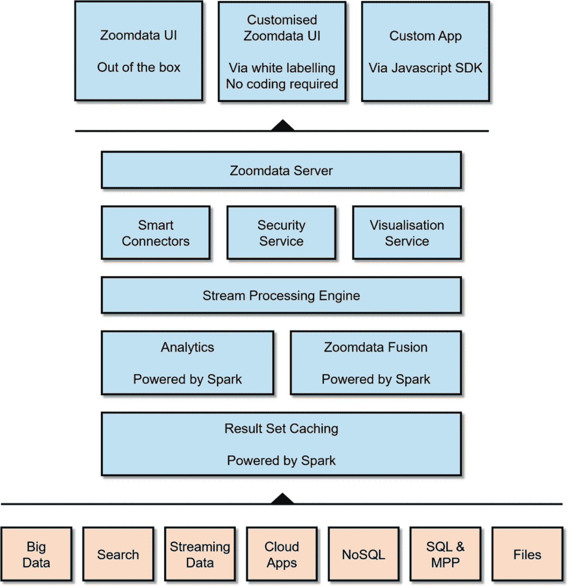

图 9-1

High-level architecture of Zoomdata

### 与 Apache Spark 的深度集成

Zoomdata 最令人印象深刻的特性之一是它与 Apache Spark 的深度集成。如前所述，Zoomdata 使用 Spark 来实现其流特性。Zoomdata 还使用 Spark 进行查询优化，方法是将数据缓存为 Spark 数据帧，然后使用 Spark 对缓存的数据执行计算、聚合和过滤。Spark 还支持另一个名为 SparkIt 的 Zoomdata 特性。SparkIt 提高了慢速数据源的性能，如 S3 桶和文本文件。SparkIt 将这些数据集缓存到 Spark 中，Spark 将它们转换成可查询的高性能 Spark 数据帧。 [<sup>v</sup>](#Sec22) 最后，Zoomdata 使用 Spark 实现了 Zoomdata Fusion，这是一个高性能的数据虚拟化层，将多个数据源虚拟化为一个。

### 缩放数据融合

Zoomdata 使用一个名为 Zoomdata Fusion 的高性能数据虚拟化层。Zoomdata 也是由 Apache Spark 提供支持的，它使多个数据源显示为一个数据源，而无需将数据集一起移动到一个公共位置。 [<sup>vi</sup>](#Sec22) Zoomdata 在优化跨平台连接时使用 Spark 来缓存数据，但将处理推给数据源以获得最大的可伸缩性。通过 Zoomdata Fusion，用户将能够方便地查询和连接不同格式的不同数据集，显著缩短洞察时间，提高生产率，并减少对 ETL 的依赖(见图 [9-2](#Fig2) )。

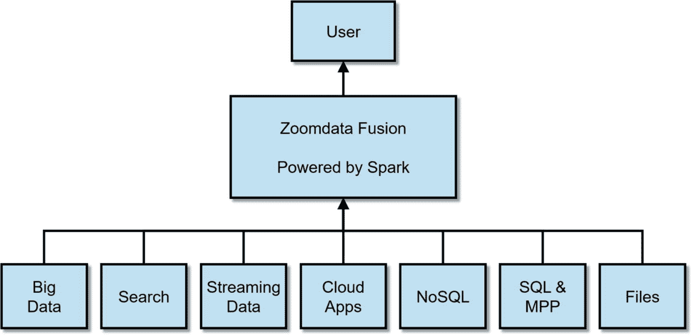

图 9-2

Diagram of Zoomdata Fusion

## 数据锐化

Zoomdata 获得了“数据锐化”专利，这是一种用于可视化大型数据集的优化技术。数据锐化的工作原理是将一个大型查询分成一系列微型查询。然后，这些微查询被发送到数据源并并行执行。Zoomdata 会立即返回第一个微查询的结果，并将其可视化为对最终结果的估计。随着新数据的到来，Zoomdata 会更新可视化效果，逐渐显示更好、更准确的估计，直到查询完成并最终显示完整的可视化效果。当所有这些都发生时，用户仍然可以与图表交互并启动其他仪表板，而无需等待长时间运行的查询完成。在底层，Zoomdata 的流架构使所有这些成为可能，将查询分解为微查询并将结果流回给用户。 [<sup>vii</sup>](#Sec22)

### 支持多种数据源

尽管 Zoomdata 是为大数据而设计的，但它也支持市场上最流行的 MPP 和 SQL 数据库，包括 Oracle、SQL Server、Teradata、MySQL、PostgreSQL、Vertica 和 Amazon Aurora。 [<sup>viii</sup>](#Sec22) 在几乎所有的企业环境中，您都会发现各种风格的 SQL 数据库和 Hadoop 发行版的组合。通过 Zoomdata Fusion，Zoomdata 允许用户轻松地查询这些不同的数据源，就像它是单个数据源一样。其他支持快速可视化分析的 Zoomdata 特性，如数据锐化、数据 DVR 和微查询，也都适用于这些 SQL 和 MPP 数据库。还支持其他流行的数据源，如 MongoDB、Solr、Elasticsearch 和亚马逊 S3(见图 [9-3](#Fig3) )。


图 9-3

Partial list of Zoomdata’s supported data sources Note

有关如何安装 Zoomdata 的最新说明，请参考 Zoomdata 的网站。您还需要安装 Zoomdata 的 Kudu 连接器来连接 Kudu，这也可以在 Zoomdata 的网站上找到。

让我们从一个例子开始。启动 Zoomdata。您将看到一个类似图 [9-4](#Fig4) 的登录页面。

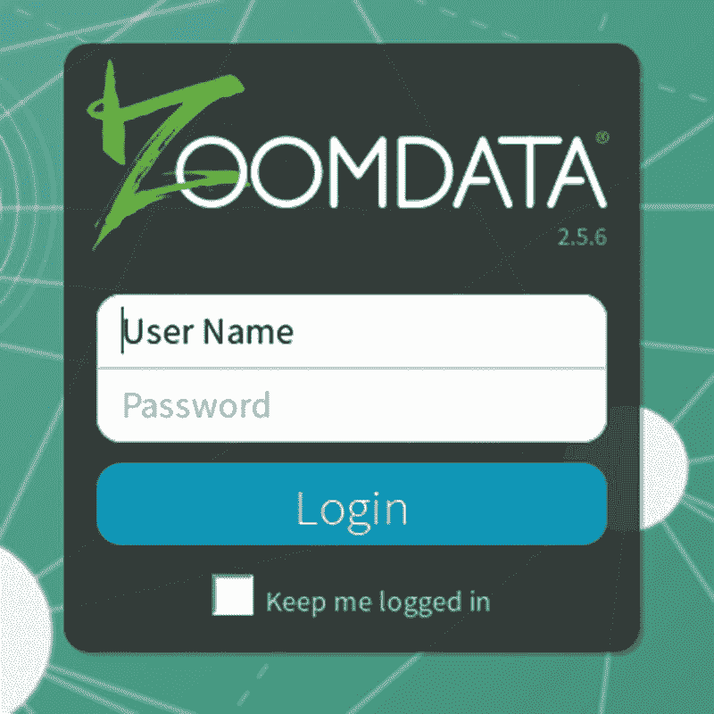

图 9-4

Zoomdata login page

你需要做的第一件事是创建一个新的数据源(见图 [9-5](#Fig5) )。

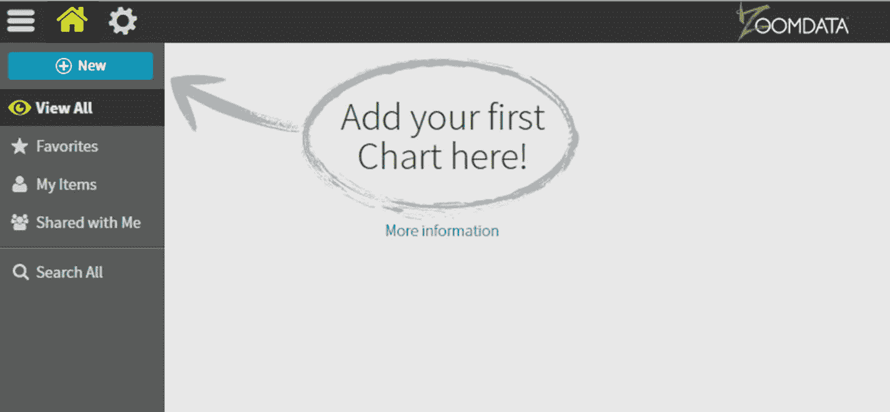

图 9-5

Zoomdata homepage

注意，Kudu Impala 数据源被添加到数据源列表中(参见图 [9-6](#Fig6) )。


图 9-6

Available data sources

您需要输入您的凭证，包括 JDBC URL 和 Kudu Master 的位置(图 [9-7](#Fig7) )。在我们的示例中，Kudu 主机位于 192.168.56.101:7051。将 JDBC 网址更新为 JDBC:hive 2://192 . 168 . 56 . 101:21050/；auth=noSasl。注意，即使我们连接到 Impala，我们也需要在我们的 JDBC URL 中指定“hive2”。完成后点击“下一步”(图 [9-8](#Fig8) )。

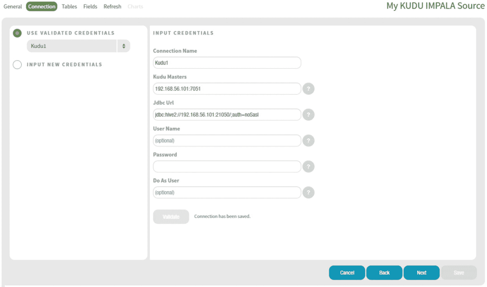

图 9-8

Kudu Impala Connector Input Credentials

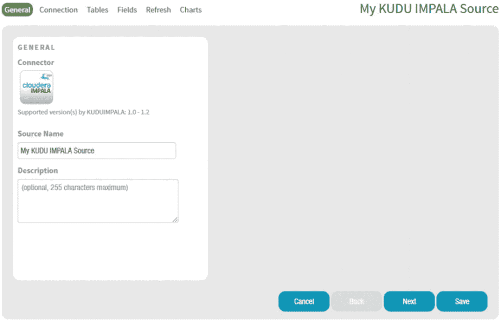

图 9-7

Kudu Impala Connector page

选择我们将在本例中使用的表格(图 [9-9](#Fig9) )。您也可以选择字段(图 [9-10](#Fig10) )。除非内存不足，否则打开缓存总是一个好主意。因为我们的表来自关系数据存储，所以不需要启用 SparkIt。如果您还记得的话，SparkIt 只适用于简单的数据源，比如不提供缓存功能的文本文件。单击“下一步”继续下一步。

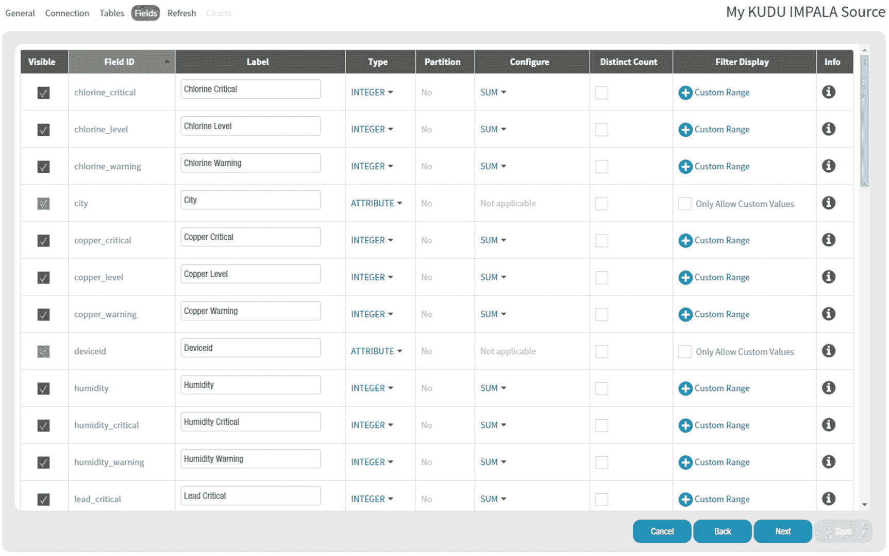

图 9-10

Data Source Fields


图 9-9

Data Source Tables

Zoomdata 可以异步维护某些数据源的缓存结果集(图 [9-11](#Fig11) )。


图 9-11

Data Source Refresh

您还可以安排一个任务来刷新缓存和元数据(图 [9-12](#Fig12) )。


图 9-12

Data Source Scheduler

对于更熟悉 cron Unix 风格调度程序的高级用户，也可以使用类似的界面(图 [9-13](#Fig13) )。


图 9-13

Data Source Cron Scheduler

为了支持实时可视化，必须启用实时模式和回放(图 [9-14](#Fig14) )。只要数据集有时间属性，在我们的例子中就是 sensortimestamp，Zoomdata 就可以使用时间属性进行可视化。我将刷新率和延迟设置为 1 秒。我还设置了从现在-1 分钟到现在的范围。


图 9-14

Time Bar Global Default Settings

您可以配置可用的图表(图 [9-15](#Fig15) )。


图 9-15

Global Default Settings – Charts

根据图表的类型，有不同的配置选项可用(图 [9-16](#Fig16) )。

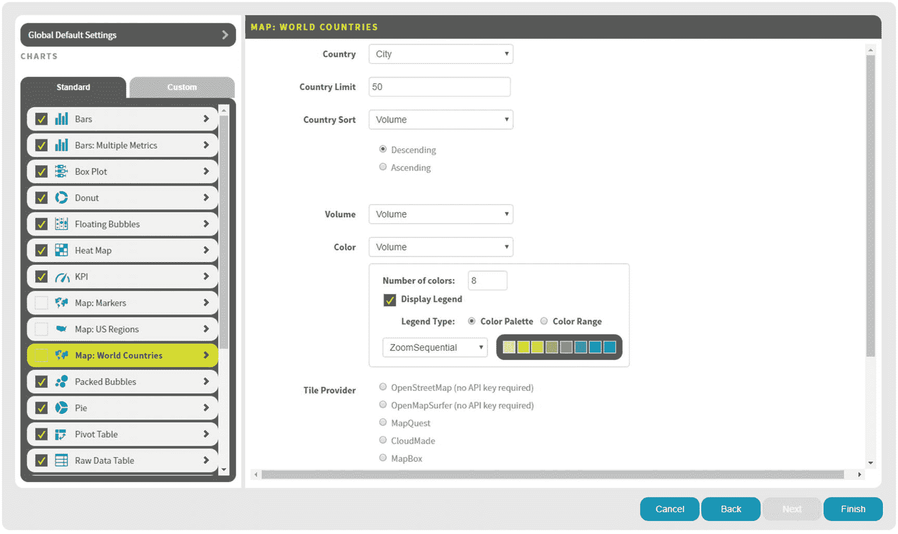

图 9-16

Map: World Countries – Options

单击“完成”后，数据源将被保存您可以立即根据源创建图表(图 [9-17](#Fig17) )。在这种情况下，我们将选择“条形图:多个指标”


图 9-17

Add New Chart

将显示一个类似于图 [9-18](#Fig18) 的条形图。您可以调整不同的条形图选项。


图 9-18

Bar Chart

当图表最大化时，您会得到更多的配置选项，如过滤器、颜色和图表样式等。在图 [9-19](#Fig19) 所示的例子中，我已经将条形图的颜色从黄色和蓝色改为紫色和绿色。

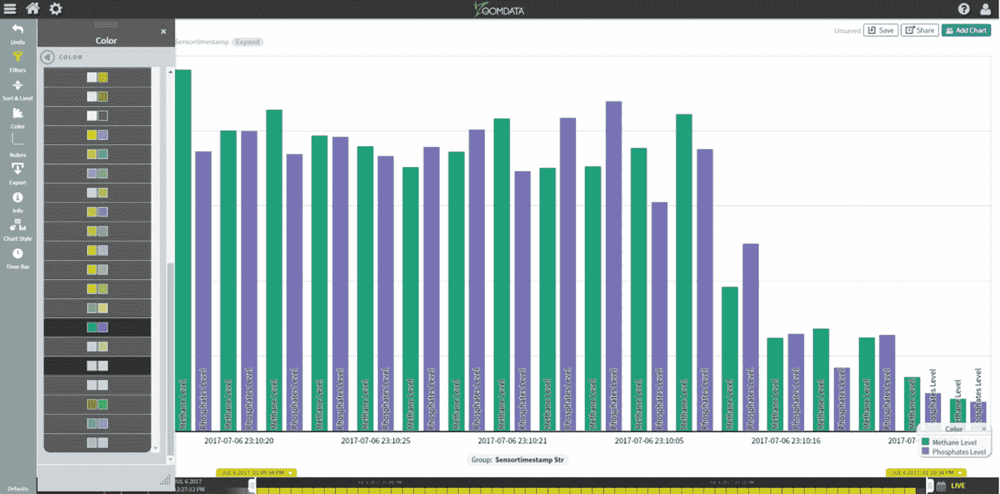

图 9-19

Bar Chart – Color

要添加更多图表，点击位于应用程序右上角附近的“添加图表”(图 [9-20](#Fig20) )。

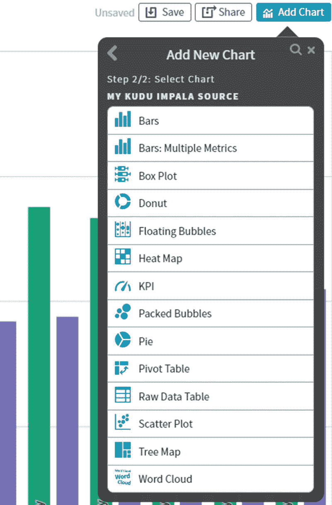

图 9-20

Add New Chart

饼图是最常见的图表类型之一(图 [9-21](#Fig21) )。


图 9-21

Pie Chart

Zoomdata 有多种图表类型，如图 [9-22](#Fig22) 所示。


图 9-22

Multiple Chart Types

Zoomdata 具有映射功能，如图 [9-23](#Fig23) 所示。

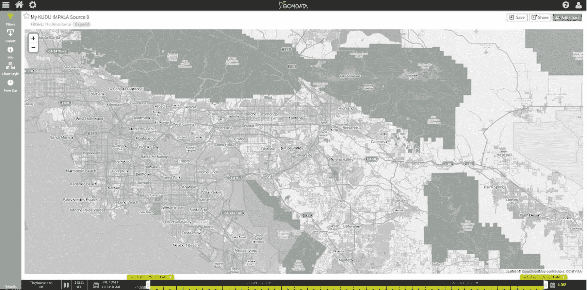

图 9-23

Zoomdata Map

Zoomdata 可以用标记实时更新地图，如图 [9-24](#Fig24) 所示。


图 9-24

Zoomdata Map with Markers

## 具有 StreamSets、Kudu 和 Zoomdata 的实时物联网

最令人兴奋的大数据用例之一是 IoT(物联网)。物联网支持从嵌入硬件的传感器收集数据，例如智能手机、电子设备、电器、制造设备和医疗保健设备等。使用案例包括实时预测医疗保健、管网泄漏检测、水质监控、紧急警报系统、智能家居、智能城市和联网汽车等。物联网数据可以通过规则引擎进行实时决策，或通过机器学习模型进行更高级的实时预测分析。

对于我们的物联网示例，我们将为一家虚构的水务公司检测网络管道泄漏并监控水质。我们将使用一个 shell 脚本来生成随机数据，以模拟来自安装在水管上的传感器的物联网数据。我们将使用 Kudu 进行数据存储，使用 StreamSets 进行实时数据接收和流处理，使用 Zoomdata 进行实时数据可视化。

在真实的物联网项目中，数据源最有可能是通过轻量级消息协议(如 MQTT)提供数据的物联网网关。还强烈建议 Kafka 作为物联网网关和数据存储之间的缓冲区，以提供高可用性和可再生性，以防需要旧数据(图 [9-25](#Fig25) )。

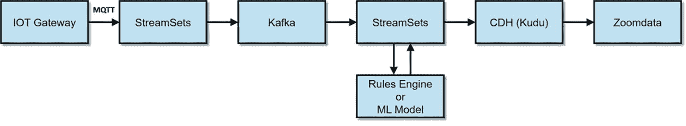

图 9-25

A Typical IoT Architecture using StreamSets, Kafka, Kudu, and Zoomdata

### 创建 Kudu 表

Zoomdata 要求 Kudu 表在时间戳字段上进行分区。要启用实时模式，时间戳字段必须存储为纪元时间中的 BIGINT。Zoomdata 会将时间戳字段识别为“可播放”，并在数据源上启用实时模式(清单 [9-1](#Par39) )。

```scala
CREATE TABLE my_sensors (
rowid BIGINT NOT NULL,
sensortimestamp BIGINT NOT NULL,
deviceid INTEGER,
temperature INTEGER,
pressure INTEGER,
humidity INTEGER,
ozone INTEGER,
sensortimestamp_str STRING,
city STRING,
temperature_warning INTEGER,
temperature_critical INTEGER,
pressure_warning INTEGER,
pressure_critical INTEGER,
humidity_warning INTEGER,
humidity_critical INTEGER,
ozone_warning INTEGER,
ozone_critical INTEGER,
lead_level INTEGER,
copper_level INTEGER,
phosphates_level INTEGER,
methane_level INTEGER,
chlorine_level INTEGER,
lead_warning INTEGER,
lead_critical INTEGER,
copper_warning INTEGER,
copper_critical INTEGER,
phosphates_warning INTEGER,

phosphates_critical INTEGER,
methane_warning INTEGER,
methane_critical INTEGER,
chlorine_warning INTEGER,
chlorine_critical INTEGER,
PRIMARY KEY(rowid,sensortimestamp)
)
PARTITION BY HASH (rowid) PARTITIONS 16,
RANGE (sensortimestamp)
(
PARTITION unix_timestamp('2017-01-01') <= VALUES <
unix_timestamp('2018-01-01'),

PARTITION unix_timestamp('2018-01-01') <= VALUES <
unix_timestamp('2019-01-01'),

PARTITION unix_timestamp('2019-01-01') <= VALUES <
unix_timestamp('2020-01-01')
)
STORED AS KUDU;

Listing 9-1Table for the sensor data. Must be run in impala-shell

```

#### 测试数据源

我们将执行 shell 脚本来生成随机数据:generatetest.sh。我引入了每 50 条记录 1 秒的延迟，这样我就不会淹没我的测试服务器(清单 [9-2](#Par41) )。

```scala
#!/bin/bash

x=0
while true
do
   echo $RANDOM$RANDOM,$(( $RANDOM % 10 + 20 )),
   $(( ( RANDOM % 40 )  + 1 )),$(( ( RANDOM % 80 )  + 1 )),
   $(( ( RANDOM % 30 )  + 1 )),$(( ( RANDOM % 20 )  + 1 )),
   `date "+%Y-%m-%d %T"`,"Melton", 0,0,0,0,0,0,0,0,
   $(( $RANDOM % 10 + 1 )), $(( $RANDOM % 10 + 1 )),
   $(( $RANDOM % 10 + 1 )),$(( $RANDOM % 10 + 1 )),
   $(( $RANDOM % 10 + 1 )),0,0,0,0,0,0,0,0,0,0

        if [ "$x" = 50 ];
        then
                sleep 1
                x=0
        fi

((x++))
Done

Listing 9-2generatetest.sh shell script to generate test data

```

该脚本将生成随机传感器数据。清单 9-3 显示了数据的样子。

```scala
891013984,23,8,4,24,11,2017-07-09 17:31:33,Melton,
0,0,0,0,0,0,0,0,2,8,3,1,4,0,0,0,0,0,0,0,0,0,0
1191723491,29,20,68,14,10,2017-07-09 17:31:33,Melton,
0,0,0,0,0,0,0,0,7,1,6,4,3,0,0,0,0,0,0,0,0,0,0
919749,24,25,67,12,10,2017-07-09 17:31:33,Melton,
0,0,0,0,0,0,0,0,4,6,10,9,4,0,0,0,0,0,0,0,0,0,0
2615810801,22,21,59,24,11,2017-07-09 17:31:33,Melton,
0,0,0,0,0,0,0,0,5,7,10,7,2,0,0,0,0,0,0,0,0,0,0
2409532223,25,6,45,21,3,2017-07-09 17:31:33,Melton,
0,0,0,0,0,0,0,0,4,1,9,4,4,0,0,0,0,0,0,0,0,0,0
2229524773,29,20,68,12,3,2017-07-09 17:31:33,Melton,
0,0,0,0,0,0,0,0,6,7,2,4,9,0,0,0,0,0,0,0,0,0,0
295358267,22,15,16,7,1,2017-07-09 17:31:33,Melton,
0,0,0,0,0,0,0,0,1,4,6,10,8,0,0,0,0,0,0,0,0,0,0
836218647,28,25,59,3,19,2017-07-09 17:31:33,Melton,
0,0,0,0,0,0,0,0,7,2,6,3,4,0,0,0,0,0,0,0,0,0,0
2379015092,24,23,23,10,14,2017-07-09 17:31:33,Melton,

0,0,0,0,0,0,0,0,2,1,10,8,7,0,0,0,0,0,0,0,0,0,0
189463852,20,2,10,30,16,2017-07-09 17:31:33,Melton,
0,0,0,0,0,0,0,0,8,4,7,8,7,0,0,0,0,0,0,0,0,0,0
1250719778,26,15,68,30,4,2017-07-09 17:31:33,Melton,
0,0,0,0,0,0,0,0,7,6,9,8,10,0,0,0,0,0,0,0,0,0,0
1380822028,27,32,40,11,7,2017-07-09 17:31:33,Melton,
0,0,0,0,0,0,0,0,2,6,7,6,5,0,0,0,0,0,0,0,0,0,0
2698312711,21,14,5,29,19,2017-07-09 17:31:33,Melton,
0,0,0,0,0,0,0,0,2,2,8,1,3,0,0,0,0,0,0,0,0,0,0
1300319275,23,33,52,24,4,2017-07-09 17:31:33,Melton,
0,0,0,0,0,0,0,0,2,7,1,1,3,0,0,0,0,0,0,0,0,0,0
2491313552,27,25,69,24,10,2017-07-09 17:31:33,Melton,
0,0,0,0,0,0,0,0,8,2,4,3,8,0,0,0,0,0,0,0,0,0,0
149243062,21,24,2,15,8,2017-07-09 17:31:33,Melton,
0,0,0,0,0,0,0,0,7,3,3,5,7,0,0,0,0,0,0,0,0,0,0
Listing 9-3Sample test sensor data

```

#### 设计管道

我们现在可以设计 StreamSets 管道了。有关流集的更深入讨论，请参考第 9 章。我们需要做的第一件事是定义一个原点，或者数据源。StreamSets 支持不同类型的源，例如 MQTT、JDBC、S3、卡夫卡和 Flume 等等。对于这个例子，我们将使用“文件尾”原点。将数据源设置为 sensordata.csv。稍后我们将运行一个脚本来填充该文件(图 [9-26](#Fig26) )。


图 9-26

StreamSets file tail origin

文件尾数据源需要其元数据的第二个目标。让我们添加一个本地文件系统目的地来存储元数据(图 [9-27](#Fig27) )。

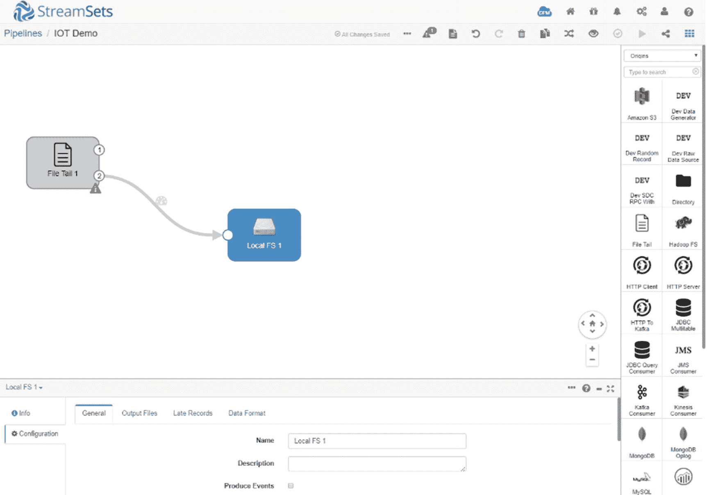

图 9-27

StreamSets local file system

我们需要一个字段拆分器处理器将 CSV 数据拆分成单独的列(图 [9-28](#Fig28) )。我们将在新的拆分字段配置框中指定我们的 SDC 字段(清单 [9-4](#Par47) )。


图 9-28

StreamSets field splitter

```scala
[
 "/rowid",
 "/deviceid",
 "/temperature",
 "/pressure",
 "/humidity",
 "/ozone",
 "/sensortimestamp_str",
 "/city",
 "/temperature_warning",
 "/temperature_critical",
 "/pressure_warning",
 "/pressure_critical",
 "/humidity_warning",
 "/humidity_critical",
 "/ozone_warning",
 "/ozone_critical",
 "/lead_level",
 "/copper_level",
 "/phosphates_level",
 "/methane_level",
 "/chlorine_level",
 "/lead_warning",
 "/lead_critical",
 "/copper_warning",
 "/copper_critical",
 "/phosphates_warning",
 "/phosphates_critical",
 "/methane_warning",
 "/methane_critical",
 "/chlorine_warning",
 "/chlorine_critical"
]
Listing 9-4New SDC Fields

```

我们还需要一个字段类型转换器来转换字段拆分器处理器生成的字段的数据类型(图 [9-29](#Fig29) )。

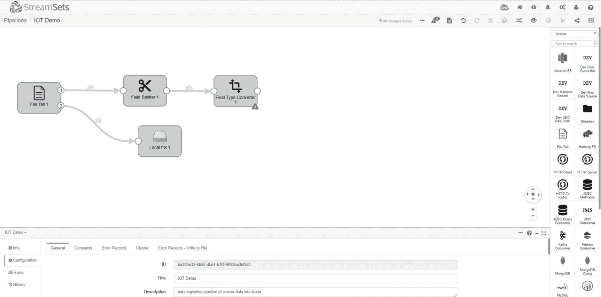

图 9-29

StreamSets field converter

在配置字段类型转换器处理器时，我们必须指定需要转换的字段以及要将数据转换成的数据类型。默认情况下，SDC 将所有字段设置为字符串。您需要将字段转换成正确的数据类型(图 [9-30](#Fig30) )。

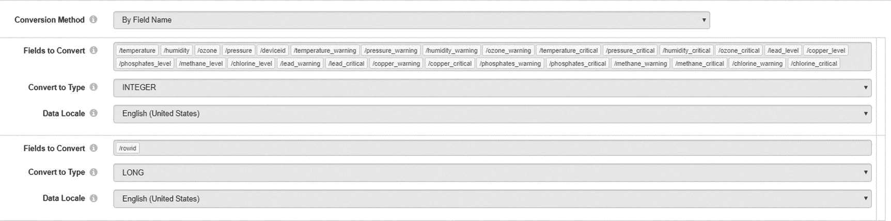

图 9-30

StreamSets field converter

Kudu 希望时间戳采用 Unix 时间格式。我们将使用 JavaScript 评估器(图 [9-31](#Fig31) )并编写代码将时间戳从字符串转换为 Unix 时间格式，如 BIGINT [<sup>ix</sup>](#Sec22) (清单 [9-5](#Par51) )。请注意，Kudu 的最新版本已经解决了这个限制。但是，Zoomdata 仍然希望日期采用 Unix 时间格式。查阅第 [7](07.html) 章，了解更多关于流集赋值器的信息。

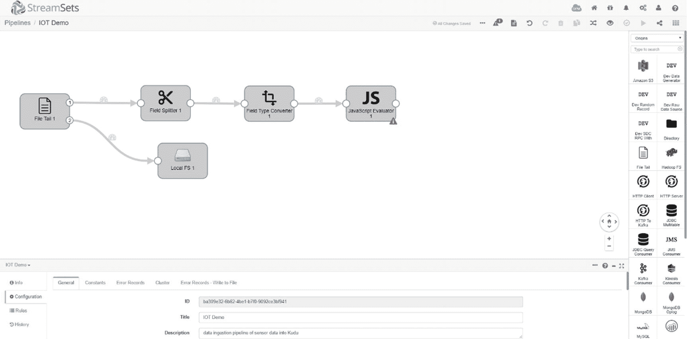

图 9-31

StreamSets Javascript Evaluator

```scala
Date.prototype.getUnixTime = function() { return this.getTime()/1000|0 };
if(!Date.now) Date.now = function() { return new Date(); }
Date.time = function() { return Date.now().getUnixTime(); }

for(var i = 0; i < records.length; i++) {
  try {

    var someDate = new Date(records[i].value['sensortimestamp_str']);
    var theUnixTime = someDate.getUnixTime();

    records[i].value['sensortimestamp'] = theUnixTime;

    output.write(records[i]);

  } catch (e) {
    error.write(records[i], e);
  }

Listing 9-5Javascript Evaluator code

```

最后，我们使用 Kudu 目的地作为数据的最终目的地。确保将 SDC 字段映射到正确的 Kudu 列名(图 [9-32](#Fig32) )。

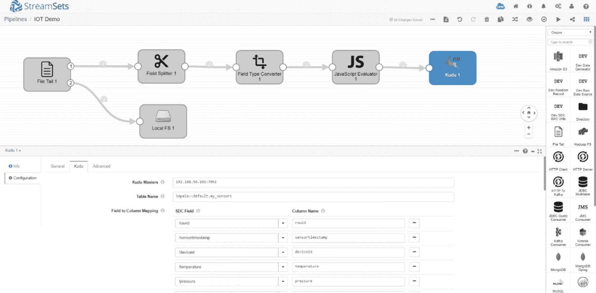

图 9-32

StreamSets Kudu destination

就在 StreamSets 那头。

#### 配置 Zoomdata

让我们为 Zoomdata 配置一个数据源。我们将使用 Kudu Impala 连接器(图 [9-33](#Fig33) )。

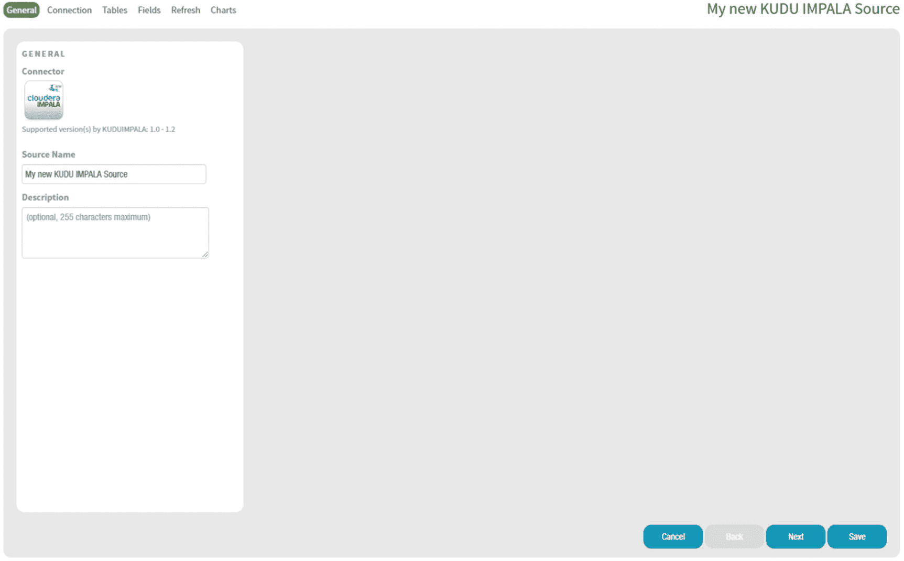

图 9-33

Zoomdata data source

输入连接信息，如 Kudu 主机的 IP 地址和端口号、JDBC URL 等。确保验证您的连接(图 [9-34](#Fig34) )。


图 9-34

Zoomdata data connection input credentials

选择您刚才创建的表。如果您愿意，您可以排除字段(图 [9-35](#Fig35) 和图 [9-36](#Fig36) )。

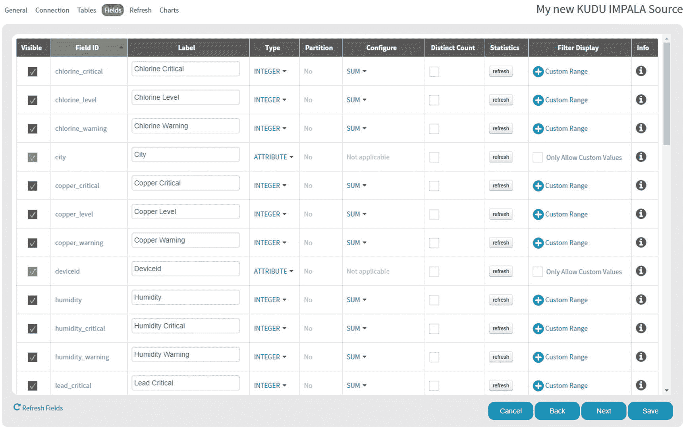

图 9-36

Zoomdata data connection fields


图 9-35

Zoomdata data connection tables

如果愿意，您可以安排数据缓存。如果您有一个大型数据集，缓存可以帮助提高性能和可伸缩性(图 [9-37](#Fig37) )。

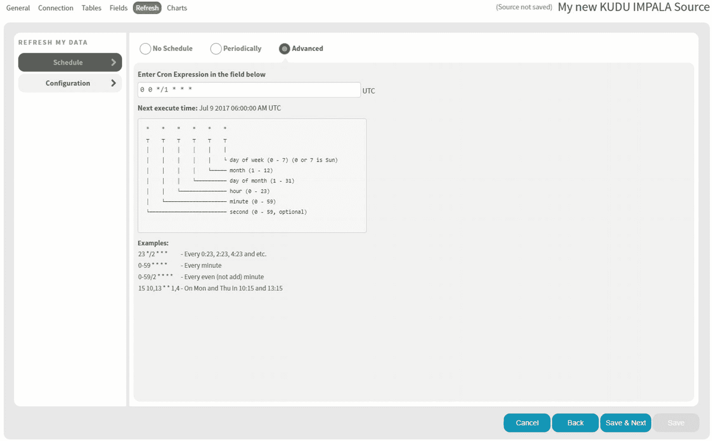

图 9-37

Zoomdata data connection refresh

配置时间栏。确保启用实时模式和回放(图 [9-38](#Fig38) )。

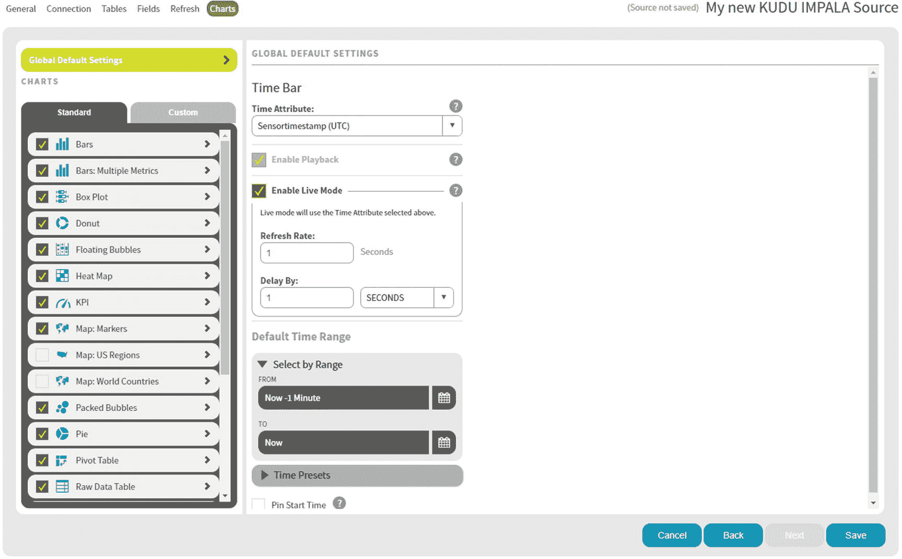

图 9-38

Zoomdata time bar

您还可以设置图表的默认配置选项(图 [9-39](#Fig39) )。


图 9-39

Zoomdata time bar

保存数据源。你现在可以开始设计用户界面了(图 [9-40](#Fig40) )。

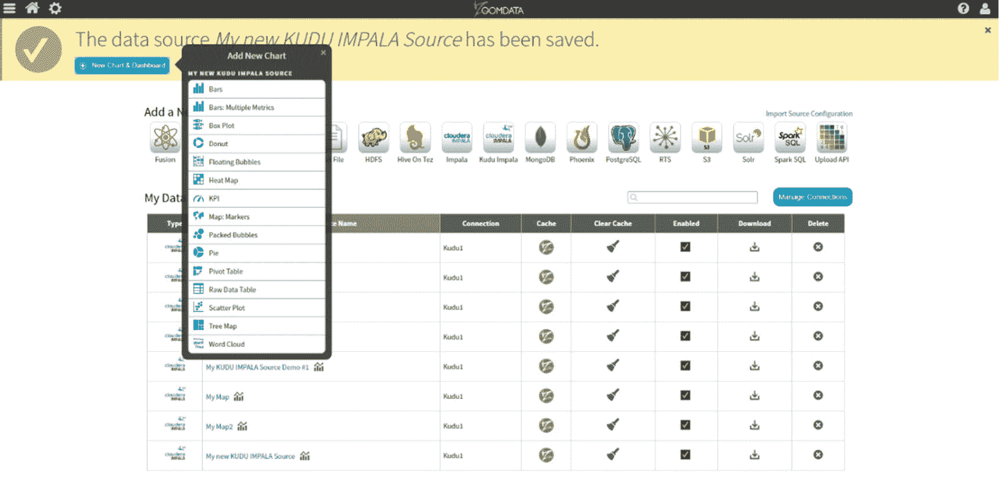

图 9-40

Zoomdata add new chart

我选择棒线:多重指标作为我的第一个图表。您还看不到任何数据，因为我们还没有启动 StreamSets 管道(图 [9-41](#Fig41) )。


图 9-41

An empty chart

让我们开始生成一些数据。在安装 StreamSets 的服务器上，打开一个终端窗口并运行脚本。将输出重定向到文件尾目标:。/generate test . CSV > > sensor data . CSV

启动 StreamSets 管道。接下来，您将通过关于您的管道的不同统计数据(如记录吞吐量、批处理吞吐量、每个步骤的输入和输出记录计数)看到流集中的数据。它还会显示您的管道中是否有任何错误(图 [9-42](#Fig42) )。

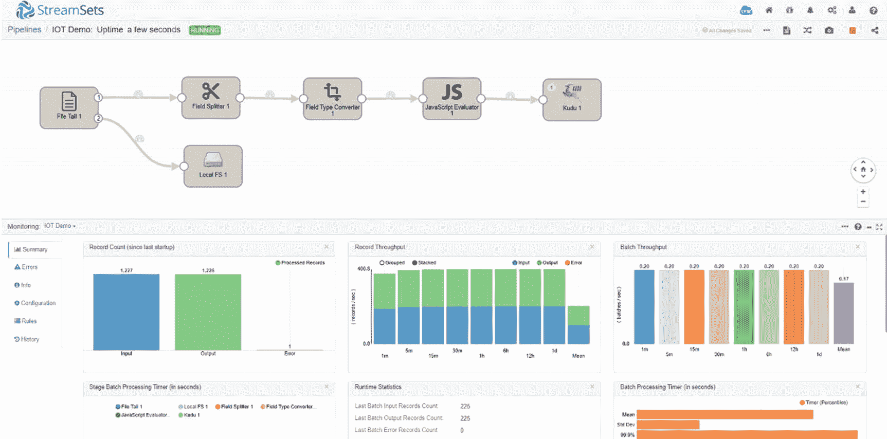

图 9-42

StreamSets canvas

当您设计 Zoomdata 仪表板时，图表会立即填充(图 [9-43](#Fig43) )。

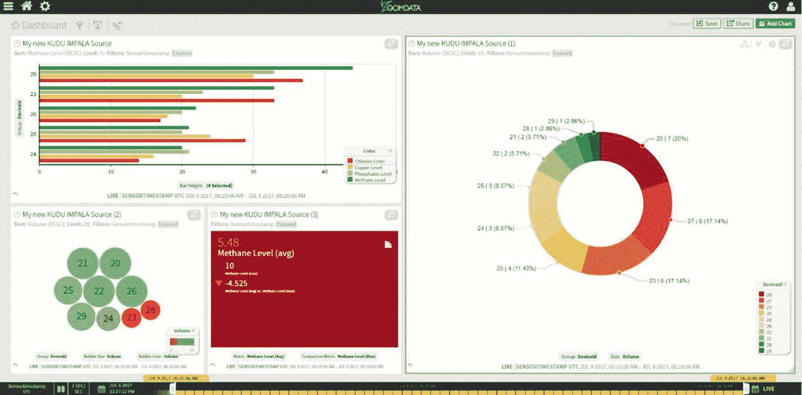

图 9-43

Live Zoomdata dashboard

恭喜你！您刚刚使用 StreamSets、Kudu 和 ZoomData 实现了一个实时物联网管道。

## 数据整理

在大多数情况下，数据不会以适合数据分析的格式出现。可能需要一些数据转换来转换字段的数据类型；可能需要数据清理来处理缺失或不正确的值；或者数据需要与 CRM、天气数据或 web 日志等其他数据源相结合。一项调查表明，数据科学家所做的 80%是数据准备和清理，剩下的 20%用于实际的数据分析。 [<sup>x</sup>](#Sec22) 在传统的数据仓库和商业智能环境中，数据通过提取、转换和加载(ETL)过程适合于分析。在非高峰时段，数据被清理、转换并从在线事务处理(OLTP)源复制到企业数据仓库。各种报告、关键绩效指标(KPI)和数据可视化都用新数据进行了更新，并呈现在企业仪表盘中，随时可供用户使用。OLAP 立方体和数据透视表提供了一定程度的交互性。在某些情况下，超级用户被授予对报告数据库或数据仓库复制副本的 SQL 访问权限，他们可以在其中运行即席 SQL 查询。但是总的来说，传统的数据仓库和商业智能是相当静态的。

大数据的出现使得旧式 ETL 不再适用。数周或数月的前期数据建模和 ETL 设计来适应新的数据集被认为是僵化和过时的。随着越来越多的工作负载被转移到大数据平台，曾经被视为组织的中央数据存储库的企业数据仓库现在与企业“数据中枢”或“数据湖”共享这一称号。在适当的情况下，ETL 已经被 ELT 所取代。提取、加载和转换(ELT)允许用户在很少或没有转换的情况下将数据转储到大数据平台。然后由数据分析师根据他或她的需求使数据适合于分析。ELT 在，ETL 不在。EDW 是僵化和结构化的。大数据快速而敏捷。

与此同时，用户变得更加精明，要求也更高。大量的数据是可用的，等待 ETL 开发人员团队几周或几个月来设计和实现数据摄取管道以使这些数据可供消费不再是一种选择。出现了一系列新的活动，统称为数据整理。

数据整理不仅仅是为分析准备数据。数据整理是数据分析过程本身的一部分。通过执行数据整理、迭代发现、结构化、清理、丰富和验证，用户可以更好地理解他们的数据，并能够提出更好的问题。当用户反复讨论他们的数据时，隐藏的模式就会暴露出来，揭示出分析数据的新方法。数据整理是大数据和 ELT 的完美补充。斯坦福大学和伯克利大学的数据整理先驱们，后来又创办了 Trifacta，提出了数据整理的六个核心活动(表 [9-1](#Tab1) )。[T3】XiT5】](#Sec22)

表 9-1

Six Core Data Wrangling Activities

<colgroup><col align="left"> <col align="left"></colgroup> 
| 活动 | 描述 |
| :-- | :-- |
| 发现 | 这是数据分析和评估阶段。 |
| 结构化 | 确定数据结构的一组活动。创建模式、旋转行、添加或删除列等。 |
| 清洁 | 一组活动，包括修复无效或缺失的值、标准化特定字段的格式(如日期、电话和州)、删除额外字符等。 |
| 浓缩 | 一组活动，涉及将数据与其他数据源连接或混合，以改善数据分析的结果。 |
| 验证 | 一组活动，用于检查所执行的充实和数据清理是否真正实现了其目标。 |
| 出版 | 一旦你对数据整理的结果感到满意，就该公布结果了。结果可以是 Tableau 等数据可视化工具的输入数据，也可以是营销活动计划的输入数据。 |

请注意，数据整理活动本质上是迭代的。您通常会以不同的顺序多次执行这些步骤，以获得想要的结果。

如果您曾经使用 Microsoft Excel 使数值看起来像某种格式，或者使用正则表达式删除某些字符，那么您已经执行了一种简单形式的数据整理。Microsoft Excel 实际上是一个很好的数据辩论工具，尽管它并不是严格为这类任务设计的。然而，当在大型数据集上使用时，或者当数据存储在大数据平台或关系数据库中时，Microsoft Excel 存在不足。一种新型的交互式数据辩论工具被开发出来，以填补市场空白。这些数据整理工具将交互式数据处理提升到了一个新的水平，提供了使通常需要编码专业知识的任务变得容易执行的功能。这些工具中的大多数都可以自动转换，并根据所提供的数据集提供相关的建议。它们与 Cloudera Enterprise 等大数据平台深度集成，可以通过 Impala、Hive、Spark HDFS 或 HBase 进行连接。我将展示如何使用一些最流行的数据整理工具的例子。

### 三连中

Trifacta 是数据整理的先驱之一。由斯坦福大学博士肖恩·坎德尔，加州大学伯克利分校教授乔·赫勒斯坦，华盛顿大学和前斯坦福大学教授杰弗里·赫尔开发。他们开始了一个名为斯坦福/伯克利牧马人的联合研究项目，最终成为 Trifacta。 [<sup>xii</sup>](#Sec22) Trifacta 销售他们产品的两个版本，Trifacta 牧马人和 Trifacta 牧马人企业。Trifacta Wrangler 是一个免费的桌面应用程序，旨在供个人使用小型数据集。Trifacta Wrangler Enterprise 专为集中管理安全和数据治理的团队而设计。 [<sup>xiii</sup>](#Sec22) 如前所述，Trifacta 可以连接到 Impala 以提供高性能的查询能力。 [<sup>xiv</sup>](#Sec22) 关于如何安装 Trifacta 牧马人，请咨询 tri acta 的网站。

我给你看看 Trifacta 牧马人的一些特点。Trifacta 组织基于“流”的数据整理活动。Trifacta 牧马人会在你第一次启动应用的时候要求你创建一个新的流量。

接下来你需要做的是上传一个数据集。Trifacta 可以连接到不同类型的数据源，但是现在我们将上传一个包含客户信息的示例 CSV 文件。上传 CSV 文件后，您现在可以浏览数据。点击“详细信息”按钮旁边的按钮，并选择“新流程中的争论”(图 [9-44](#Fig44) )。


图 9-44

Wrangle in new Flow

您将看到类似图 [9-45](#Fig45) 的 transformer 页面。Trifacta 立即检测并显示各个列中的数据是如何分布的。


图 9-45

Trifacta’s transformer page

您可以滚动到显示数据分布的图表的左侧或右侧，以快速查看该列的内容。这将帮助您确定需要处理或转换的数据(图 [9-46](#Fig46) )。

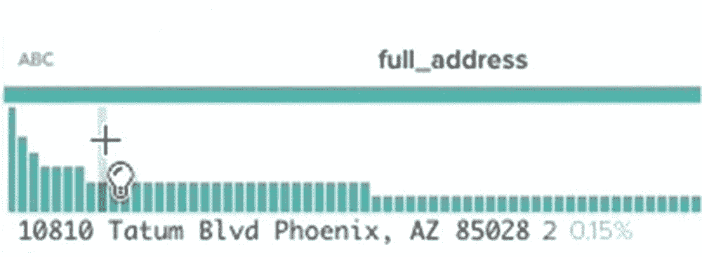

图 9-46

Histogram showing data distribution

在列名称下，您会看到特定列的数据质量指示器。不匹配的数据类型将显示为红色，空行将显示为灰色。如果存储在该栏中的数据全部有效，指示器应为绿色(图 [9-47](#Fig47) )。


图 9-47

Data quality bar

通过单击特定的列，您将看到关于如何转换存储在该列上的数据的各种建议。这项功能由机器学习提供支持。Trifacta 从您过去的数据整理活动中学习，以提出下一步建议(图 [9-48](#Fig48) )。

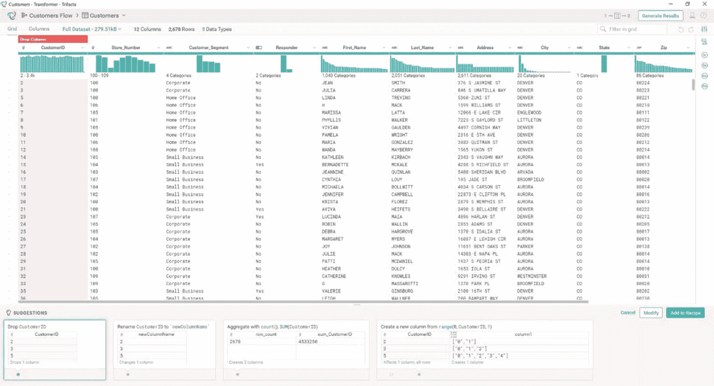

图 9-48

Trifacta’s suggestions

不同的栏目得到不同的建议(图 [9-49](#Fig49) )。


图 9-49

Trifacta has different suggestions for different types of data

单击列名旁边的按钮，获取特定列的数据转换选项列表。您可以重命名列名、更改数据类型、过滤、清理或对列执行聚合等等(图 [9-50](#Fig50) )。


图 9-50

Additional transformation options

几乎每种类型的数据转换都可用(图 [9-51](#Fig51) )。

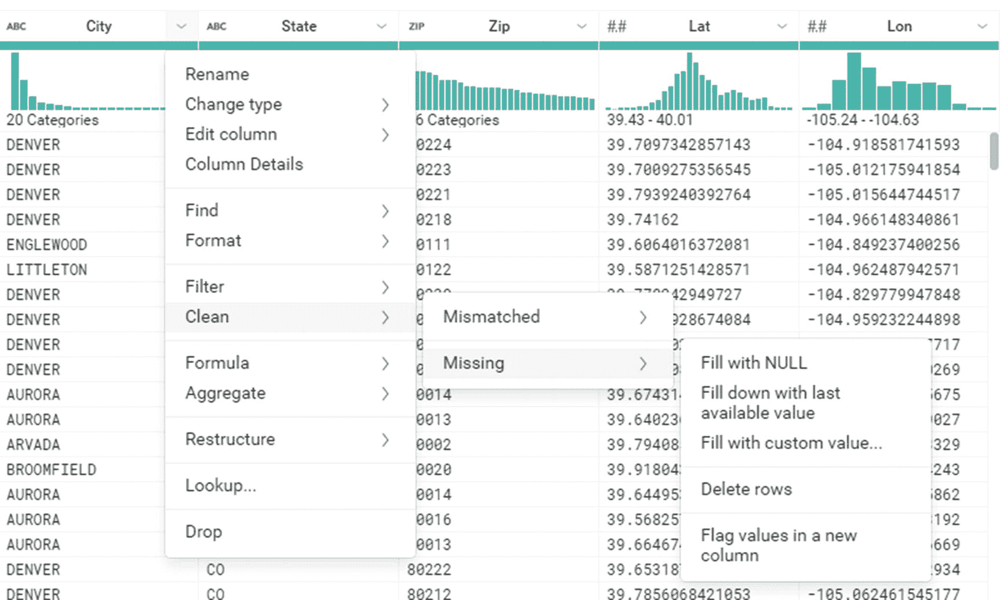

图 9-51

Additional transformation options

双击该列将显示另一个窗口，其中包含关于该列中存储的信息的各种统计信息和有用信息。信息包括最大值、最频繁值和字符串长度统计等(图 [9-52](#Fig52) )。

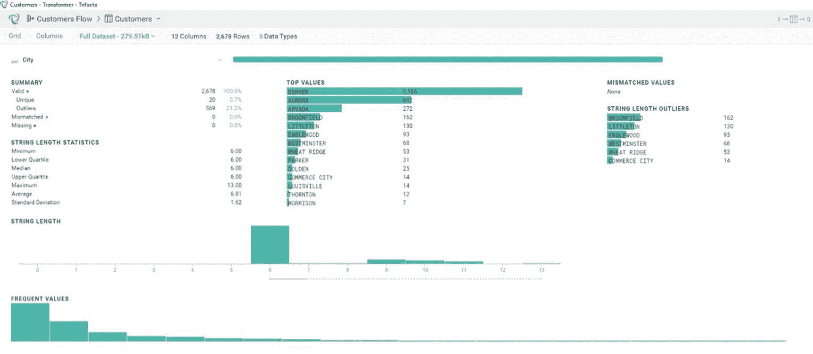

图 9-52

The final output from the Job Results window

Trifacta 足够聪明，能够知道该列是否包含位置信息，比如邮政编码。它将尝试使用地图显示信息(图 [9-53](#Fig53) )。

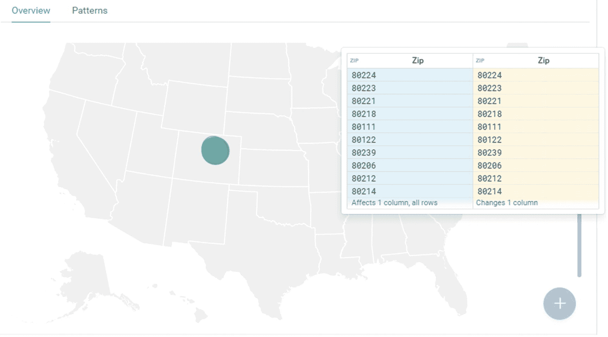

图 9-53

The final output from the Job Results window

让我们尝试一种建议的数据转换。让我们将姓氏从全部大写转换为正确的姓氏(只有第一个字母是大写的)。选择最后一个建议并点击“修改”按钮以应用更改(图 [9-54](#Fig54) )。

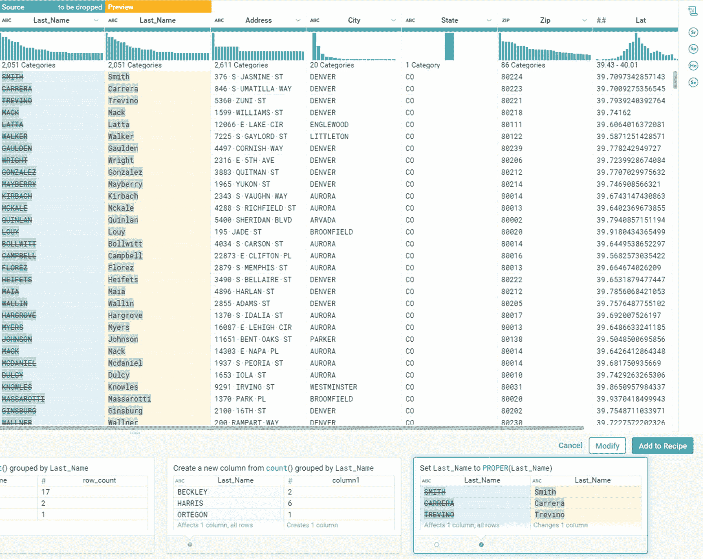

图 9-54

Apply the transformation

姓氏已经转换，如图 [9-55](#Fig55) 所示。

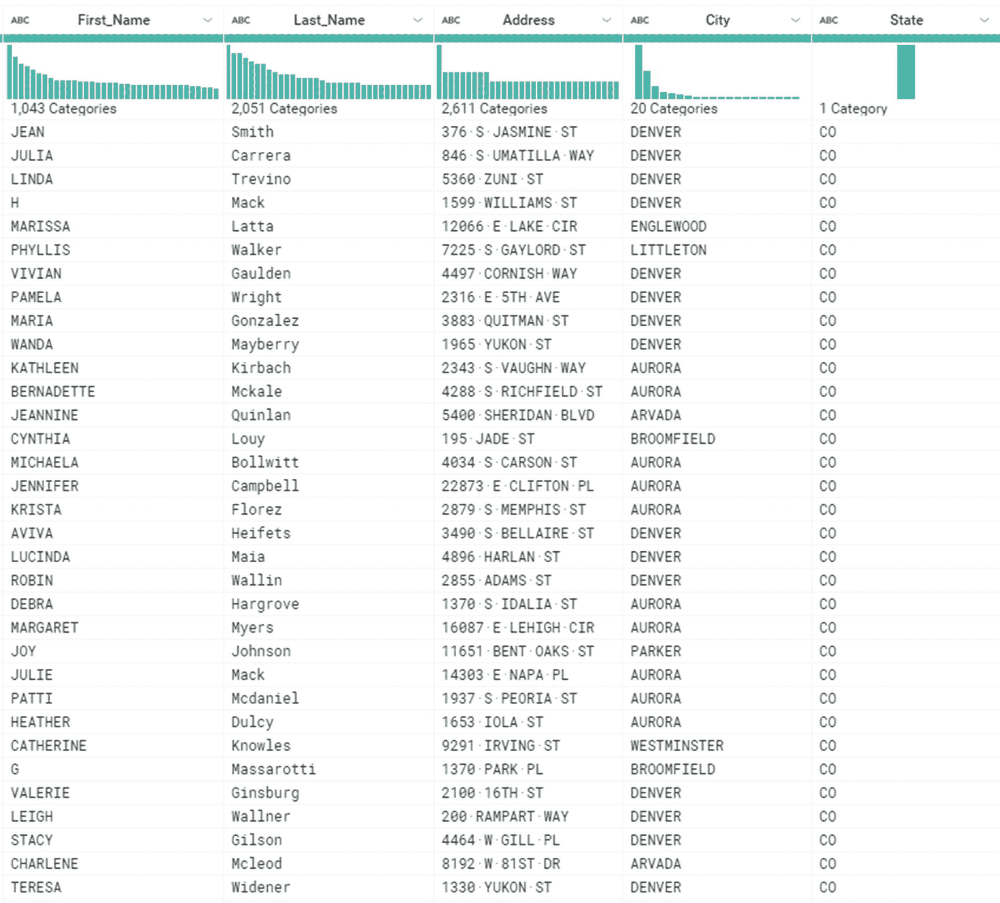

图 9-55

The transformation has been applied

点击页面右上角附近的“生成结果”按钮(图 [9-56](#Fig56) )。


图 9-56

Generate Results

您可以用不同的格式保存结果。为我们的数据集选择 CSV。如果需要，您可以选择压缩结果。确保选中“分析结果”选项，以生成结果的分析结果(图 [9-57](#Fig57) )。


图 9-57

Result Summary

将出现“结果摘要”窗口。它将包括各种统计数据和关于您的数据的信息。检查一下，确保结果如你所愿。Trifacta 没有内置的数据可视化。它依赖于其他工具，如 Tableau、Qlik、Power BI，甚至 Microsoft Excel 来提供可视化。

### Alteryx(变形虫)

Alteryx 是另一家受欢迎的软件开发公司，开发数据整理和分析软件。该公司成立于 2010 年，总部位于加利福尼亚州欧文市。它支持多种数据源，如 Oracle、SQL Server、Hive 和 Impala [<sup>xv</sup>](#Sec22) ，以实现快速的即席查询功能。

第一次启动 Alteryx 时会出现一个入门窗口(图 [9-58](#Fig58) )。您可以浏览教程、打开最近的工作流程或创建新的工作流程。现在，让我们创建一个新的工作流。

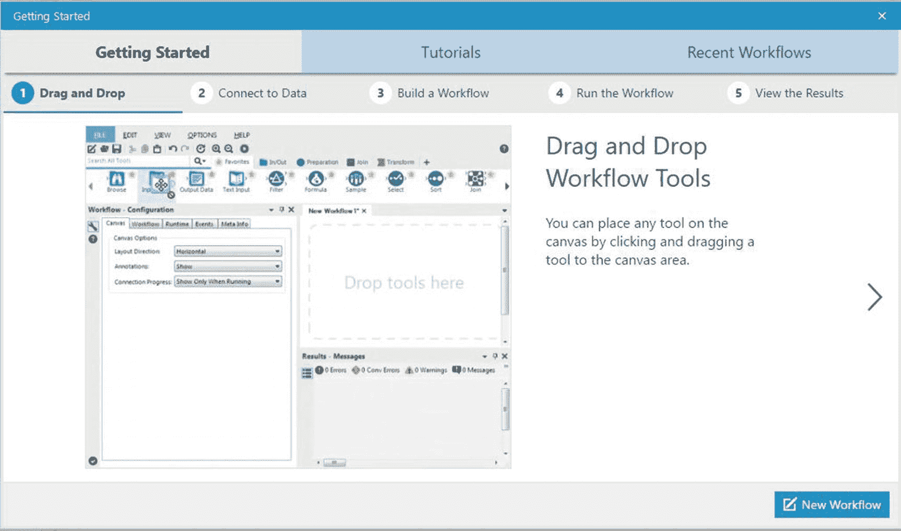

图 9-58

Getting started window

Alteryx 以易用著称。用户与 Alteryx 的大多数交互都涉及到从工具面板中拖放和配置工具(图 [9-59](#Fig59) )。


图 9-59

Alteryx main window

工具选项板为用户提供了按工具类别组织的工具。您将这些工具拖到画布中，并连接它们来设计您的工作流。这些工具允许用户执行不同的操作，用户通常会执行这些操作来处理和分析数据。常见的操作包括选择、过滤、排序、连接、联合、汇总和浏览等等。这些是用户通常通过开发 SQL 查询来执行的任务。Alteryx 提供了一个更加简单和高效的方法(图 [9-60](#Fig60) )。


图 9-60

Tool Palette – Favorites

Alteryx 还为更复杂的操作提供了无数的工具，例如相关性、换位、人口统计分析、行为分析和空间匹配等等。浏览其他选项卡，熟悉可用的工具(图 [9-61](#Fig61) )。

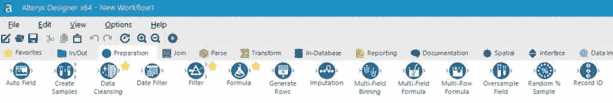

图 9-61

Tool Palette – Preparation

每个工作流都从使用输入数据工具指定数据源开始。将输入数据工具拖放到工作流窗口。您可以指定一个文件或连接到外部数据源，如 Impala、Oracle、SQL Server 或任何提供 ODBC 接口的数据源(图 [9-62](#Fig62) )。

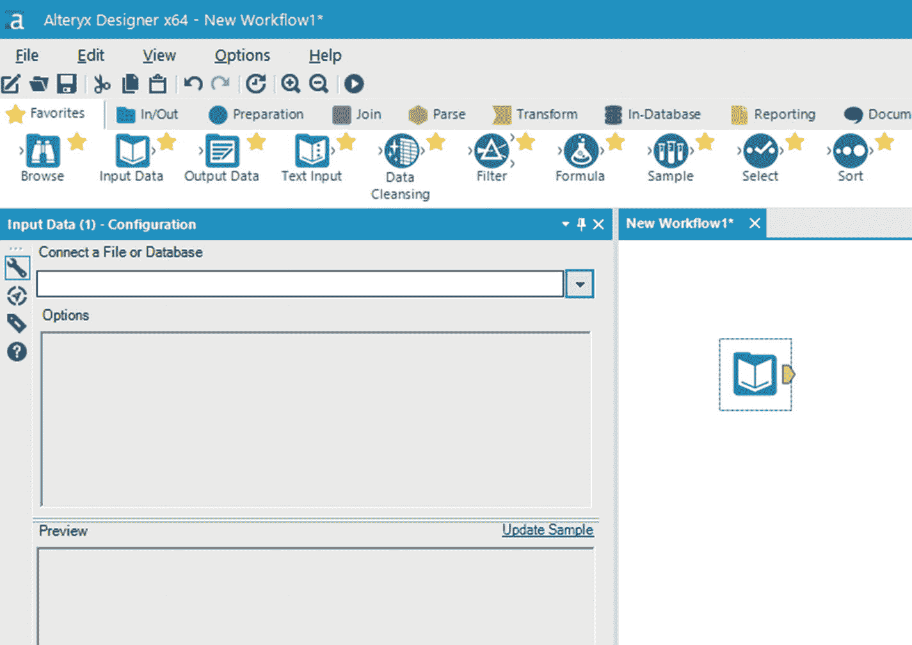

图 9-62

Input Data Tool

在本例中，我们将从一个文件中获取数据(图 [9-63](#Fig63) )。


图 9-63

Select file

Alteryx 附带了几个示例文件。让我们使用 Customers.csv 文件(图 [9-64](#Fig64) )。

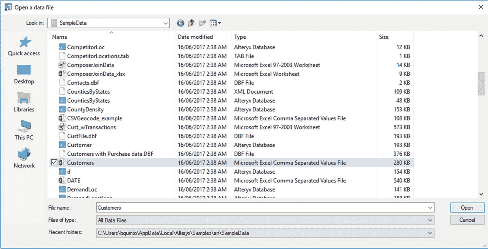

图 9-64

Select Customers.csv

现在您已经配置了一个数据源，让我们拖放选择工具。选择工具允许您选择特定的列。默认情况下，所有的列都是选中的，所以在这个例子中，让我们取消选中一些列。确保连接输入数据并选择工具，如图 [9-65](#Fig65) 所示。

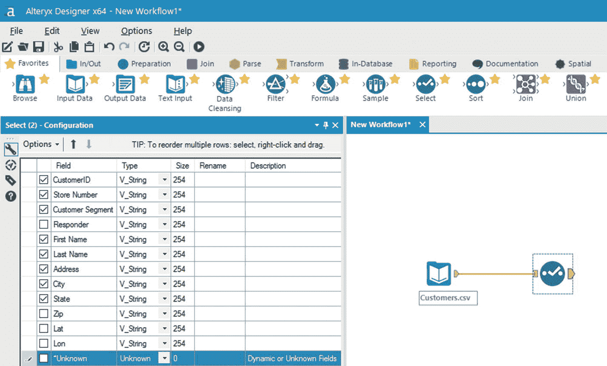

图 9-65

Select tool

在我们选择了几列之后，我们可以使用排序工具对结果进行排序。连接选择工具和排序工具。排序工具允许您指定希望如何对结果进行排序。在本例中，我们将按城市和客户群升序排序。您可以通过配置选项(图 [9-66](#Fig66) )来实现。

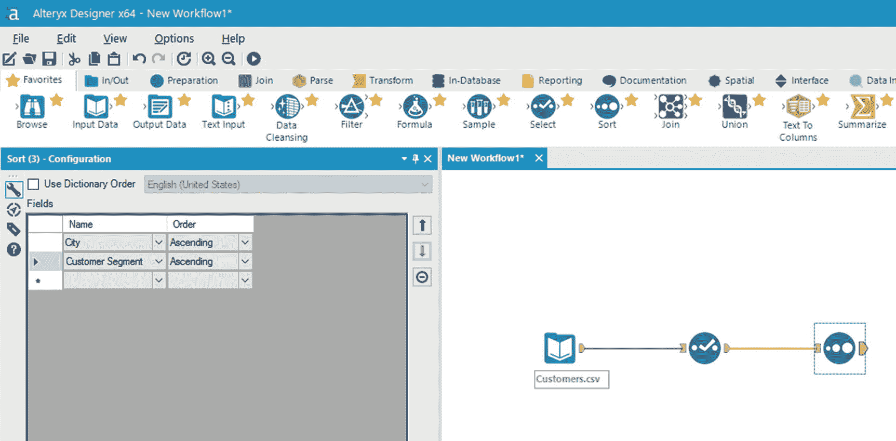

图 9-66

Sort Tool

我们可以继续添加更多的工具，让工作流变得尽可能复杂，但是我们将在这个例子中停止。几乎每个 Alteryx 工作流都以浏览或保存工作流的结果而结束。

让我们浏览结果以确保数据看起来是正确的。在工作流程窗口上拖动一个浏览工具，并确保它与分类工具连接(图 [9-67](#Fig67) )。


图 9-67

Browse data tool

通过单击位于窗口右上角帮助菜单项附近的绿色运行按钮来运行工作流。几秒钟后，工作流的结果将显示在输出窗口中。检查结果，查看是否选择了正确的列，以及排序顺序是否与您之前指定的一致。

像 Trifacta 一样，Alteryx 也可以分析您的数据，并显示有用的统计数据和相关信息，如列中数据的分布、数据质量信息、列的数据类型、空值或空白值的数量、平均长度、最大长度等。在图 [9-68](#Fig68) 中，显示了 CustomerID 字段的统计数据。


图 9-68

Browse data

点击客户细分字段以显示关于该列的统计数据(图 [9-69](#Fig69) )。


图 9-69

Data quality – Customer Segment field

图 [9-70](#Fig70) 显示了城市字段的统计数据。

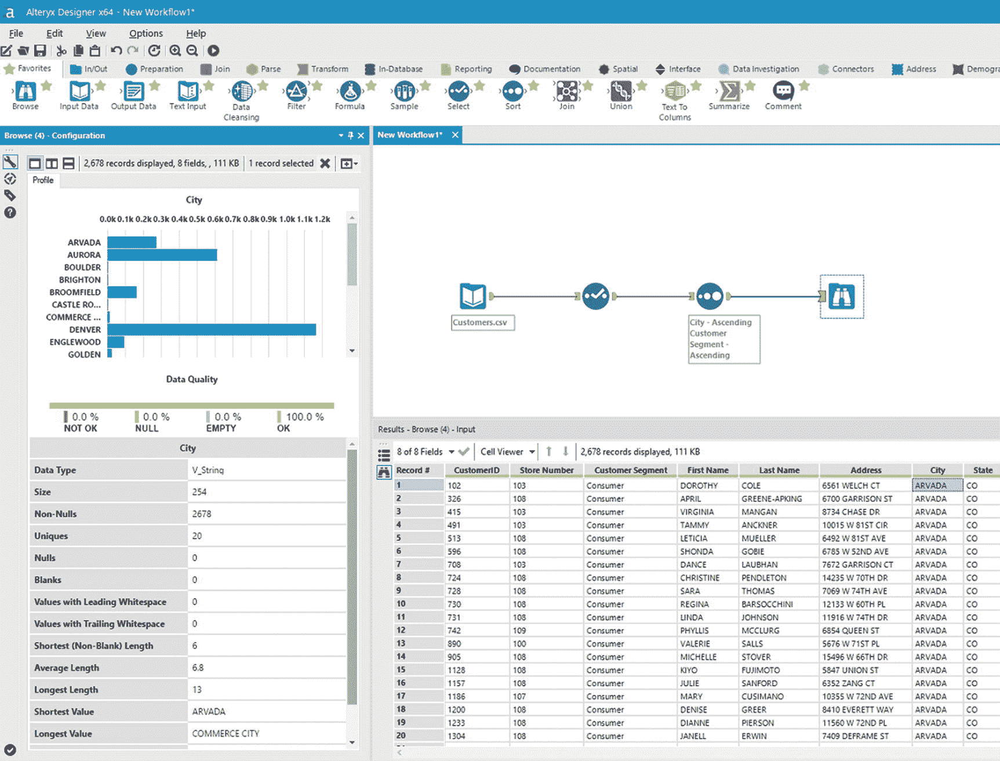

图 9-70

Data quality – City field

如前所述，我们还可以将结果保存到文件或外部数据源，如 Kudu、Oracle、SQL Server 或 HDFS。从工作流窗口中删除浏览工具，并将其替换为输出数据工具(图 [9-71](#Fig71) )。

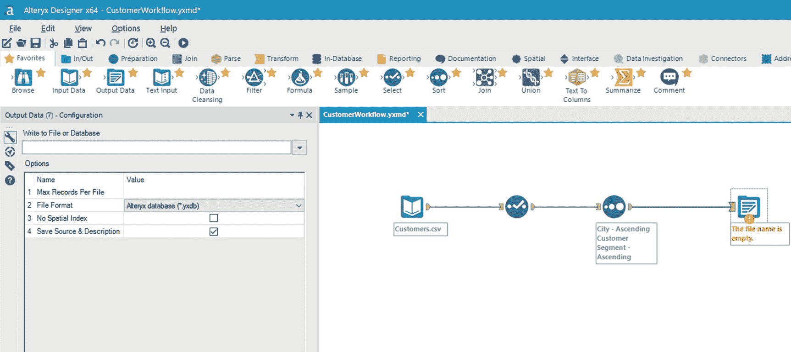

图 9-71

Output Data tool

让我们将结果保存到一个文件中(图 [9-71](#Fig71) )。屏幕左侧的配置窗口将允许您设置如何保存文件的选项，包括文件格式。如图所示，您可以选择以不同的格式保存文件，例如 CSV、Excel、JSON、Tableau data extract 和 Qlikview data eXchange 等。


图 9-72

Select file format

让我们将数据保存为 CSV 格式(图 [9-72](#Fig72) )。保存结果后，让我们用记事本检查文件以确保数据被正确保存(图 [9-73](#Fig73) )。


图 9-73

Validate saved data

恭喜你！现在，您已经对 Alteryx 有了一些基本的了解和实践经验。

### 大数据

Datameer 是另一个流行的数据整理工具，内置了数据可视化和机器学习功能。它有一个类似电子表格的界面，包括 200 多个分析功能。 [<sup>xvi</sup>](#Sec22) Datameer 总部位于美国加州三藩市，成立于 2009 年。与 Trifacta 和 Alteryx 不同，Datameer 没有用于 Impala 的连接器，尽管它有用于 Spark、HDFS、Hive 和 HBase 的连接器。[T5】XVIIT7】](#Sec22)

让我们探索一下 Datameer。你需要做的第一件事是上传一个数据文件(图 [9-74](#Fig74) )。

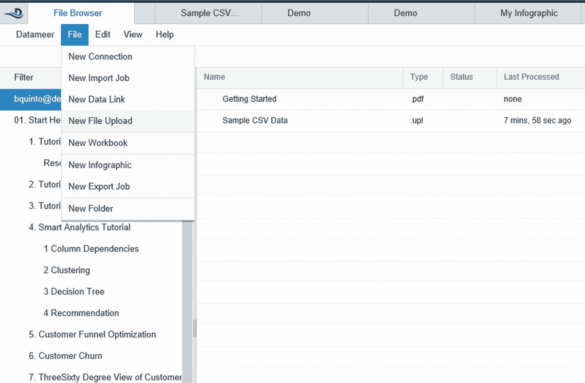

图 9-74

Upload data file

指定文件和文件类型并点击下一步(图 [9-75](#Fig75) )。

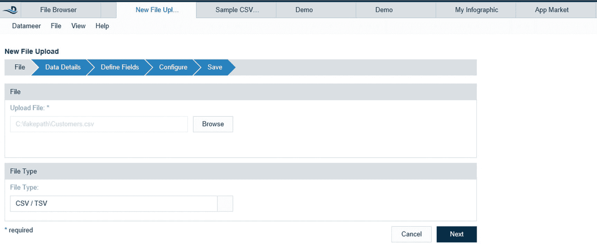

图 9-75

Specify file type

您可以配置数据字段。Datameer 允许你改变数据类型、字段名称等等(图 [9-76](#Fig76) )。

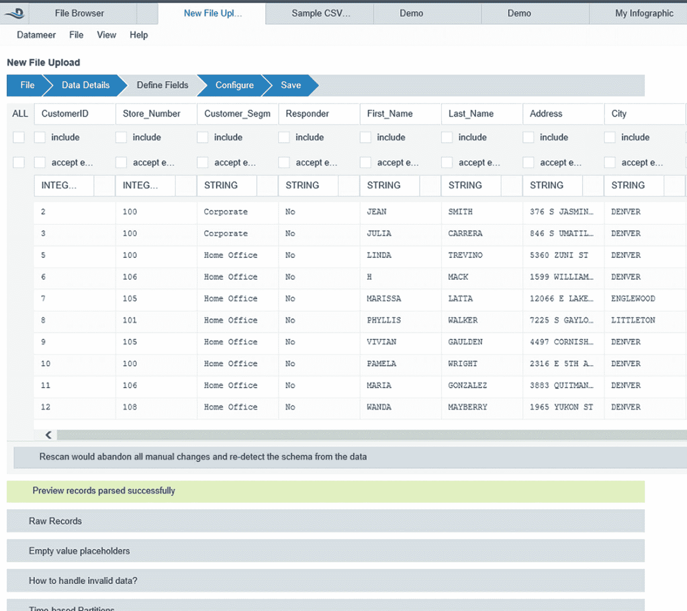

图 9-76

Configure the data fields

数据以电子表格的形式呈现(图 [9-77](#Fig77) )。

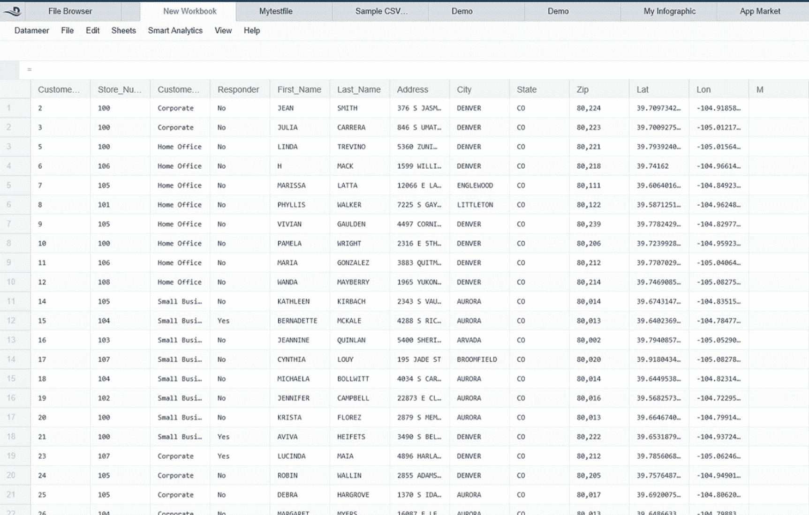

图 9-77

Spreadsheet-like user interface

就像 Trifacta 和 Alteryx 一样，Datameer 对您的数据进行分析，并提供有关您的数据字段的统计数据和信息(图 [9-78](#Fig78) )。


图 9-78

Datameer Flipside for visual data profiling

Datameer 使用一种称为智能分析的功能，为常见的机器学习任务提供内置支持，如聚类、决策树分类和建议(图 [9-79](#Fig79) )。


图 9-79

Smart Analytics

执行聚类可以显示关于我们数据的一些有趣的模式(图 [9-80](#Fig80) )。

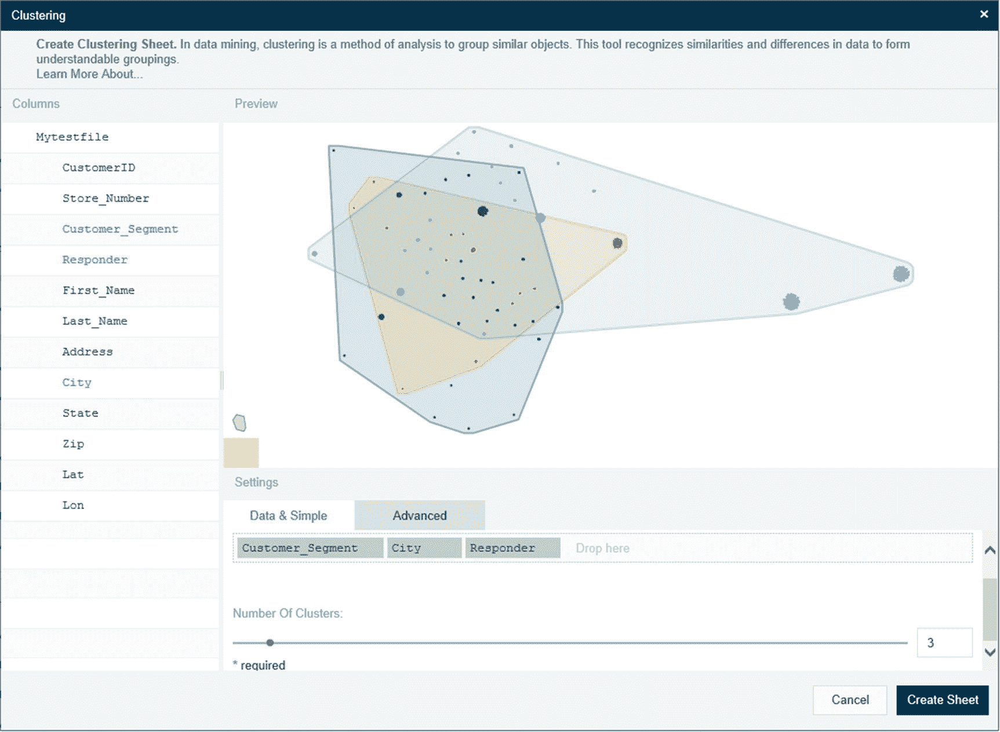

图 9-80

Clustering

数据将被分组到簇中。分组将作为另一列添加到您的数据集中。每个集群将由一个集群 id 标识(图 [9-81](#Fig81) )。


图 9-81

Column ID showing the different clusters

也可以使用决策树进行分类(图 [9-82](#Fig82) )。

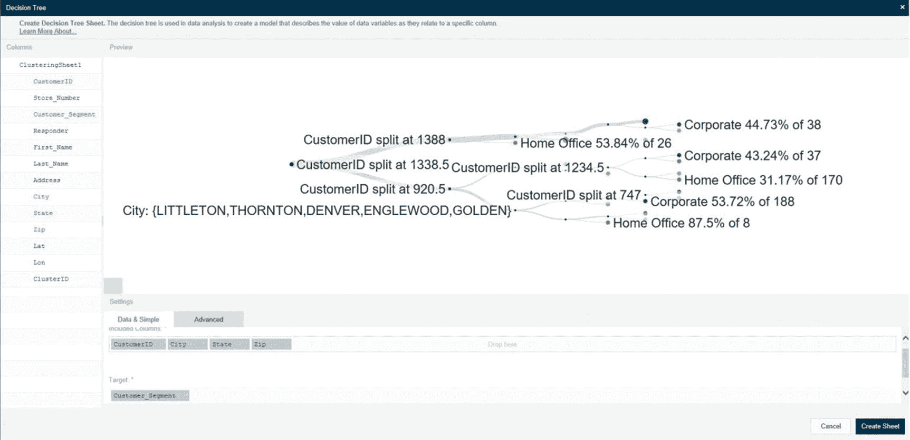

图 9-82

Decision trees

数据将通过如图 [9-83](#Fig83) 所示的附加预测字段进行分类。


图 9-83

Prediction column

如前所述，Datameer 包括内置的数据可视化(图 [9-84](#Fig84) )。

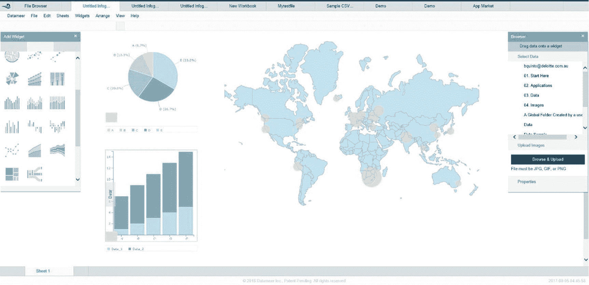

图 9-84

Datameer data visualization

## 摘要

确保您的大数据可视化工具能够处理大数据的三个 V(量、多样性和速度)。如果您正在为您的组织选择工具，请考虑该工具是否能够处理 TB/Pb 大小的数据集。您的数据源是纯关系型的，还是也分析半结构化和非结构化的数据集？您是否要求实时或接近实时地接收和处理数据？尝试利用您现有的 BI 和数据可视化工具，并确定它们是否能够满足您的需求。您可能正在连接到 Hadoop 集群，但是您的数据集可能没有那么大。如今，这是一种常见的情况，组织使用大数据平台作为一种经济高效的方式来整合昂贵的报告服务器和数据集市。

在过去的几年里，数据整理工具变得很流行。用户变得越来越精明，要求也越来越高。谁比最了解数据的人更适合准备数据？如果您的组织中有坚持自己准备和转换数据的高级用户，那么可能值得看看我在本章中介绍的一些数据整理工具。

## 参考

1.  克里斯汀·维特伦，詹姆斯·霍尔曼；“将 SAS 可视化分析添加到现有 SAS 商业智能部署的考虑因素”，SAS，2018， [`http://support.sas.com/resources/papers/proceedings14/SAS146-2014.pdf`](http://support.sas.com/resources/papers/proceedings14/SAS146-2014.pdf)
2.  缩放数据；“关于缩放数据”，2018 年，“t1”【t0”
3.  Zoomdata《实时&流分析》，Zoomdata，2018， [`https://www.zoomdata.com/product/real-time-streaming-analytics/`](https://www.zoomdata.com/product/real-time-streaming-analytics/)
4.  Zoomdata《实时&流分析》，Zoomdata，2018， [`https://www.zoomdata.com/product/stream-processing-analytics/`](https://www.zoomdata.com/product/stream-processing-analytics/)
5.  [T2`https://www.zoomdata.com/product/apache-spark-data-stream-processing/`](https://www.zoomdata.com/product/apache-spark-data-stream-processing/)
6.  Zoomdata《实时&流分析》，Zoomdata，2018， [`https://www.zoomdata.com/product/stream-processing-analytics/`](https://www.zoomdata.com/product/stream-processing-analytics/)
7.  Zoomdata《Zoomdata 中的数据锐化》，Zoomdata，2018， [`https://www.zoomdata.com/docs/2.5/data-sharpening-in-zoomdata.html`](https://www.zoomdata.com/docs/2.5/data-sharpening-in-zoomdata.html)
8.  Zoomdata《实时&流分析》，Zoomdata，2018， [`https://www.zoomdata.com/product/stream-processing-analytics/`](https://www.zoomdata.com/product/stream-processing-analytics/)
9.  Coderwall《如何在 JavaScript 中从任意日期获取正确的 Unix 时间戳》，Coderwall，2018， [`https://coderwall.com/p/rbfl6g/how-to-get-the-correct-unix-timestamp-from-any-date-in-javascript`](https://coderwall.com/p/rbfl6g/how-to-get-the-correct-unix-timestamp-from-any-date-in-javascript)
10.  吉尔出版社；“清洗大数据:最耗时、最不愉快的数据科学任务，调查称”，福布斯，2018， [`https://www.forbes.com/sites/gilpress/2016/03/23/data-preparation-most-time-consuming-least-enjoyable-data-science-task-survey-says/#3bfc5cdc6f63`](https://www.forbes.com/sites/gilpress/2016/03/23/data-preparation-most-time-consuming-least-enjoyable-data-science-task-survey-says/#3bfc5cdc6f63)
11.  Tye Rattenbury《六大核心数据角力活动》，Datanami，2015， [`https://www.datanami.com/2015/09/14/six-core-data-wrangling-activities/`](https://www.datanami.com/2015/09/14/six-core-data-wrangling-activities/)
12.  斯坦福；"牧马人是一个用于数据清理和转换的交互式工具."斯坦福，2013， [`http://vis.stanford.edu/wrangler/`](http://vis.stanford.edu/wrangler/)
13.  Trifacta《组织的数据角力》，Trifacta，2018， [`https://www.trifacta.com/products/wrangler-enterprise/`](https://www.trifacta.com/products/wrangler-enterprise/)
14.  Trifacta《黑斑羚 Hadoop 连接:从 Cloudera 黑斑羚和 Apache Hadoop 及更远》，2018， [`https://www.trifacta.com/impala-hadoop/`](https://www.trifacta.com/impala-hadoop/)
15.  Alteryx" Alteryx 支持以多种方式访问 Cloudera . "，Alteryx，2018， [`https://www.alteryx.com/partners/cloudera`](https://www.alteryx.com/partners/cloudera)
16.  Datameer《Cloudera 与 Datameer》，Datameer，2018， [`https://www.cloudera.com/partners/solutions/datameer.html`](https://www.cloudera.com/partners/solutions/datameer.html)
17.  Datameer《连接器》，Datameer，2018， [`https://www.datameer.com/product/connectors/`](https://www.datameer.com/product/connectors/)