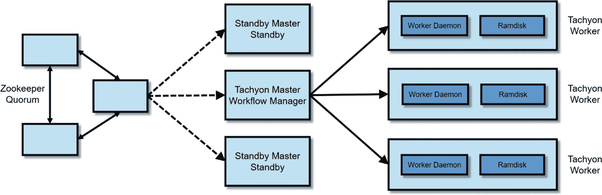
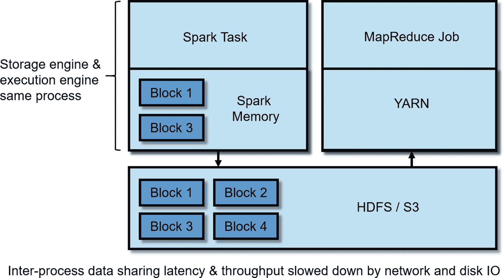
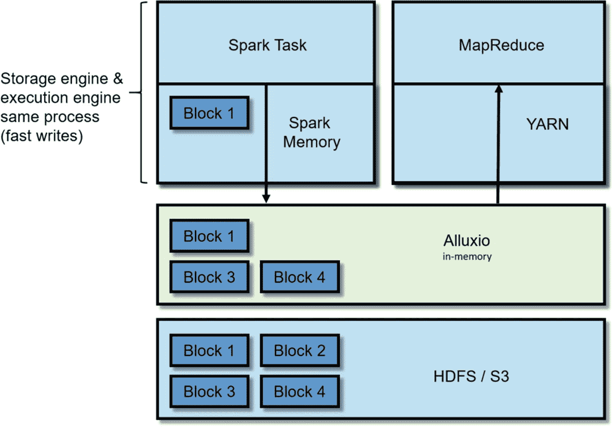
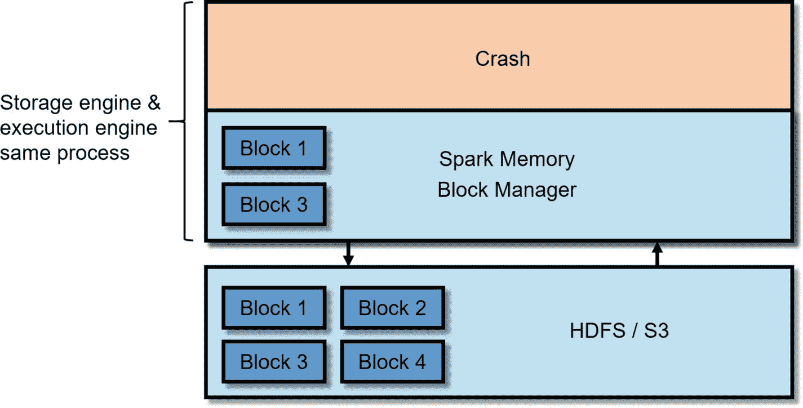
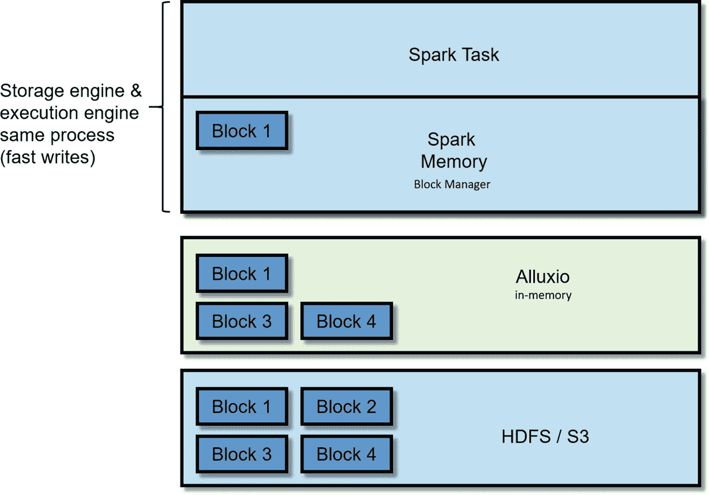
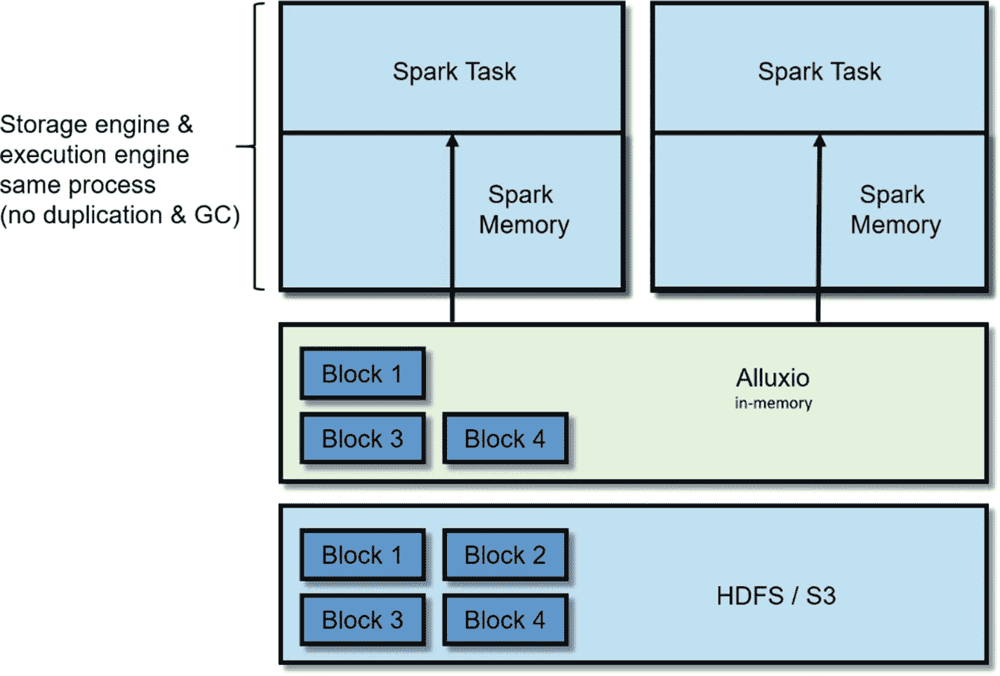
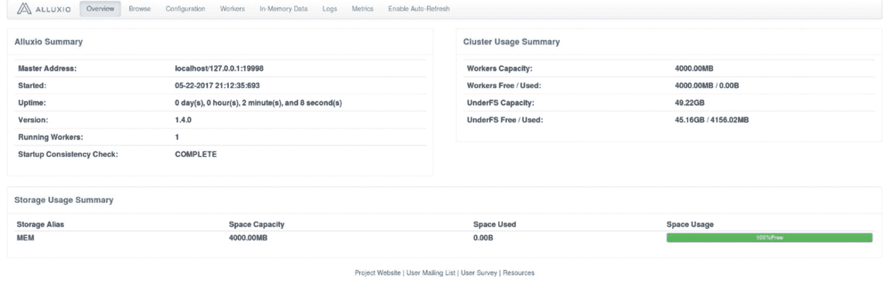

# 十、分布式内存大数据计算

Alluxio，原名 Tachyon，是加州大学伯克利分校 AMPLab 的一个开源项目。Alluxio 是一个以内存为中心的分布式存储系统，最初是由李皓原在 2012 年作为一个研究项目开发的，当时他是 AMPLab 的一名博士生和 Apache Spark 创始人。 [<sup>i</sup>](#Sec21) 项目是 Berkeley Data Analytics Stack(BDAS)的存储层。2015 年，Alluxio，Inc .由李创立，旨在将 Alluxio 商业化，获得了 Andre esen Horowitz 750 万美元的现金注入。如今，Alluxio 拥有来自英特尔、IBM、雅虎和 Red Hat 等全球 50 个组织的 200 多名贡献者。几家知名公司目前正在生产中使用 Alluxio，如百度、阿里巴巴、Rackspace 和巴克莱。 [<sup>ii</sup>](#Sec21)

Spark 的合著者、DataBricks 的联合创始人兼执行主席、加州大学伯克利分校 AMPLab 的联合董事、李皓原大学的博士联合顾问扬·斯托伊察(ion Williams)表示:“作为一个从 Apache Spark 和 Hadoop MapReduce 等集群计算框架中抽象出现有存储系统差异的层，Alluxio 可以实现大数据存储的快速发展，类似于互联网协议(IP)实现互联网发展的方式。” [<sup>iii</sup>](#Sec21)

此外，加州大学伯克利分校计算机科学教授兼 AMPLab 主任 Michael Franklin 表示，“AMPLab 在新的大数据堆栈中创建了一些最重要的开源技术，包括 Apache Spark。Alluxio 是 AMPLab 的下一个具有重大影响的项目。我们看到它在存储层的发展中发挥着巨大的颠覆性作用，以处理不断扩大的大数据使用案例。” [<sup>iv</sup>](#Sec21)

## 体系结构

Alluxio 是一个以内存为中心的分布式存储系统，旨在成为大数据事实上的存储统一层。它提供了一个虚拟化层，统一了对不同存储引擎(如本地文件系统、HDFS、S3 和 NFS)和计算框架(如 Spark、MapReduce、Hive 和 Presto)的访问。图 [10-1](#Fig1) 给你一个 Alluxio 架构的概述。


图 10-1

Alluxio Architecture Overview

Alluxio 是协调数据共享和指导数据访问的中间层，同时为计算框架和大数据应用提供高性能低延迟的内存速度。Alluxio 与 Spark 和 Hadoop 无缝集成，只需要少量的配置更改。通过利用 Alluxio 的统一命名空间功能，应用程序只需连接到 Alluxio 即可访问存储在任何受支持的存储引擎中的数据。Alluxio 有自己的原生 API 以及 Hadoop 兼容的文件系统接口。便利类使用户能够执行最初为 Hadoop 编写的代码，而无需任何代码更改。REST API 提供了对其他语言的访问。我们将在本章的后面探讨 API。

Alluxio 的统一名称空间特性不支持 Kudu 等关系数据存储、Oracle 或 SQL Server 等关系数据库或 MongoDB 等文档数据库。当然，支持对 Alluxio 和提到的存储引擎的读写。开发人员可以使用 Spark 等计算框架从 Kudu 表创建数据帧，并以 Parquet 或 CSV 格式将其存储在 Alluxio 文件系统中，反之亦然(图 [10-2](#Fig2) )。



图 10-2

Alluxio Technical Architecture

## 为什么要用 Alluxio？

典型的 Hadoop 发行版包括 20 多个开源组件。向您的技术堆栈中添加另一个组件可能是您最想不到的事情。尽管如此，Alluxio 提供了大量的好处，这将使你想知道为什么 Alluxio 不是核心 Apache Spark 的一部分。

### 显著提高大数据处理性能和可扩展性

这些年来，内存越来越便宜，而它的性能却越来越快。与此同时，硬盘驱动器的性能只是略有改善。毫无疑问，在内存中处理数据比在磁盘上处理数据快一个数量级。在几乎所有的编程范例中，我们都被建议在内存中缓存数据以提高性能。Apache Spark 优于 MapReduce 的一个主要优势是它能够缓存数据。Alluxio 将这一点提升到了一个新的水平，不仅作为缓存层提供大数据应用，还提供了一个成熟的分布式高性能以内存为中心的存储系统。

百度正在运营世界上最大的 Alluxio 集群之一，1000 个工作节点处理超过 2PB 的数据。借助 Alluxio，百度在查询和处理时间方面的性能平均提高了 10 倍，最高可达 30 倍，显著提高了百度做出重要业务决策的能力。 [<sup>v</sup>](#Sec21) 巴克莱发表文章描述了他们与 Alluxio 的经历。巴克莱数据科学家 Gianmario Spacagna 和高级分析主管 Harry Powell 能够使用 Alluxio 将他们的 Spark 工作从数小时调整到数秒。中国最大的旅游搜索引擎之一 Qunar.com 使用 Alluxio 后，性能提升了 15 到 300 倍。 [<sup>vii</sup>](#Sec21)

### 多个框架和应用程序可以以内存速度共享数据

典型的 Hadoop 集群有多个会话运行不同的计算框架，如 Spark 和 MapReduce。对于 Spark，每个应用程序都有自己的执行器进程，执行器中的每个任务都运行在自己的 JVM 上，将 Spark 应用程序相互隔离。这意味着 Spark(和 MapReduce)应用程序无法共享数据，除了写入 HDFS 或 S3 等存储系统。如图 [10-3](#Fig3) 所示，Spark 作业和 MapReduce 作业使用存储在 HDFS 或 S3 的相同数据。在图 [10-4](#Fig4) 中，多个 Spark 作业使用相同的数据，每个作业在自己的堆空间中存储自己版本的数据。 [<sup>viii</sup>](#Sec21) 不仅数据会重复，通过 HDFS 或 S3 共享数据也会很慢，尤其是当你共享大量数据的时候。


图 10-4

Different jobs sharing data via HDFS or S3



图 10-3

Different frameworks sharing data via HDFS or S3

通过使用 Alluxio 作为堆外存储(图 [10-5](#Fig5) )，多个框架和作业可以以内存速度共享数据，减少数据重复，提高吞吐量，减少延迟。



图 10-5

Different jobs and frameworks sharing data at memory speed

### 在应用程序终止或出现故障时提供高可用性和持久性

在 Spark 中，执行器进程和执行器内存驻留在同一个 JVM 中，所有缓存的数据都存储在 JVM 堆空间中(图 [10-6](#Fig6) )。



图 10-7

Spark job crashes or completes


图 10-6

Spark job with its own heap memory

当作业完成或者由于某种原因 JVM 由于运行时异常而崩溃时，堆空间中缓存的所有数据都将丢失，如图 [10-7](#Fig7) 和 [10-8](#Fig8) 所示。


图 10-8

Spark job crashes or completes. Heap space is lost

解决方案是使用 Alluxio 作为堆外存储(图 [10-9](#Fig9) )。



图 10-9

Spark using Alluxio as off-heap storage

在这种情况下，即使 Spark JVM 崩溃，数据在 Alluxio 中仍然可用(图 [10-10](#Fig10) 和 [10-11](#Fig11) )。


图 10-11

Spark job crashes or completes. Heap space is lost. Off-heap memory is still available.


图 10-10

Spark job crashes or completes

### 优化整体内存使用并最大限度地减少垃圾收集

通过使用 Alluxio，内存使用效率大大提高，因为数据在作业和框架之间共享，并且因为数据存储在堆外，所以垃圾收集也被最小化，从而进一步提高了作业和应用程序的性能(图 [10-12](#Fig12) )。



图 10-12

Multiple Spark and MapReduce jobs can access the same data stored in Alluxio

### 降低硬件要求

Alluxio 的大数据处理速度明显快于 HDFS。IBM 的测试显示，在写入 io 方面，Alluxio 比 HDFS 快 110 倍。 [<sup>ix</sup>](#Sec21) 有了这样的性能，对额外硬件的需求就会减少，从而节省基础设施和许可成本。

### Alluxio 组件

与 Hadoop 和其他 Hadoop 组件类似，Alluxio 有一个主/从架构。

#### 主要主人

第一主节点管理集群的全局元数据。

#### 第二主设备

辅助主节点管理日志并定期执行检查点操作。

#### 工人

工作人员存储数据，并为来自应用程序的读或写数据请求提供服务。工作人员还管理本地资源，如内存和磁盘空间。

#### 客户

Alluxio 客户端提供了一个文件系统 API，供用户与 Alluxio 通信。

### 装置

有几种方法可以安装 Alluxio。Alluxio 运行在 YARN、Mesos、Docker 和 EC2 上。 [<sup>x</sup>](#Sec21) 为了让您快速入门，我将在一台服务器上安装 Alluxio。

从 Alluxio 网站下载 Alluxio 的最新版本。

```scala
wget http://alluxio.org/downloads/files/1.6.1/alluxio-1.4.0-bin.tar.gz
tar xvfz alluxio-1.4.0-bin.tar.gz
cd alluxio-1.4.0

```

让我们格式化 worker 存储目录和 Alluxio 日志，以准备 worker 和 master。

```scala
./bin/alluxio format
Waiting for tasks to finish...
All tasks finished, please analyze the log at /opt/alluxio-1.4.0/bin/../logs/task.log.
Formatting Alluxio Master @ server01

```

开始 Alluxio 吧。

```scala
./bin/alluxio-start.sh local
Waiting for tasks to finish...
All tasks finished, please analyze the log at /opt/alluxio-1.4.0/bin/../logs/task.log.
Waiting for tasks to finish...
All tasks finished, please analyze the log at /opt/alluxio-1.4.0/bin/../logs/task.log.
Killed 0 processes on server01
Killed 0 processes on server01
Starting master @ server01\. Logging to /opt/alluxio-1.4.0/logs
Formatting RamFS: /mnt/ramdisk (4000mb)
Starting worker @ server01\. Logging to /opt/alluxio-1.4.0/logs
Starting proxy @ server01\. Logging to /opt/alluxio-1.4.0/logs

```

我创建了一个 100 MB 的文件，并将其复制到内存中。如果你有更多的内存，你可以创建一个更大的文件。列出目录的内容。

```scala
./bin/alluxio fs ls /
[root@server01 alluxio-1.4.0]# ./bin/alluxio fs copyFromLocal /root/test01.csv /

Copied /root/test01.csv to /
./bin/alluxio fs ls /
-rw-r--r--     root           root           103.39MB  05-22-2017 22:21:14:925  In Memory      /test01.csv

```

让我们将文件从内存保存到本地文件系统。

```scala
./bin/alluxio fs persist /test01.csv
persisted file /test01.csv with size 108416290

```

## 阿帕奇 Spark 和 Alluxio

您在 Alluxio 中访问数据的方式类似于从 Spark 中访问存储在 HDFS 和 S3 的数据。

```scala
val dataRDD = sc.textFile("alluxio://localhost:19998/test01.csv")

val parsedRDD = dataRDD.map{_.split(",")}

case class CustomerData(userid: Long, city: String, state: String, age: Short)

val dataDF = parsedRDD.map{ a => CustomerData (a(0).toLong, a(1), a(2), a(3).toShort) }.toDF

dataDF.show()

+------+---------------+-----+---+
|userid|           city|state|age|
+------+---------------+-----+---+
|   300|       Torrance|   CA| 23|
|   302|Manhattan Beach|   CA| 21|
+------+---------------+-----+---+

```

您还可以从 MapReduce、Hive、Flink 和 Presto 访问 Alluxio。查看 Alluxio 的在线文档了解更多详细信息。

## 管理 Alluxio

Alluxio 提供了一个 web 界面来方便系统管理和监控。您可以获得有关空间容量、使用情况、正常运行时间、启动时间和文件列表等高级和详细信息。Alluxio 为您提供了一个主界面和工作界面。Alluxio 还为典型的文件系统操作提供了命令行界面。

### 掌握

你可以通过访问`http://<Master IP Address >:19999`(图 [10-13](#Fig13) )进入 Alluxio 的主主页。



图 10-13

Master home page

### 工人

您可以通过访问`http://<Worker IP Address>:30000`(图 [10-14](#Fig14) )来访问每个 Alluxio worker 的 web 界面。


图 10-14

Worker home page

## Apache Ignite

Ignite 是另一个类似于 Alluxio 的内存平台。GridGain Systems 最初在 2014 年向 Apache Software Foundation 捐赠了 Apache Ignite。2015 年被提升为顶层项目。 [<sup>xi</sup>](#Sec21) 它功能极其丰富，可以用作内存中数据网格、内存中数据库、内存中分布式文件系统、流分析引擎以及 Hadoop 和 Spark 的加速器等等。[T5】XIIT7】](#Sec21)

## Apache geode(Apache geode)

Geode 是一个分布式内存数据库，专为具有低延迟响应时间和高并发性要求的事务性应用程序而设计。Pivotal 在 2015 年向 Apache 孵化器提交了 Geode。它于 2016 年 11 月从 Apache 孵化器毕业，成为顶级 Apache 项目。Gemfire 是 Geode 的商业版本，是华尔街交易平台中使用的一种流行的低延迟交易系统。[<sup>XIII</sup>T3】](#Sec21)

## 摘要

Spark 是一个快速的内存数据处理框架。Alluxio 提供了一个堆外存储，可用于提高跨作业和框架的数据共享效率，最大限度地减少垃圾收集，并优化整体内存使用，从而显著提高速度。不仅作业运行速度大大加快，而且由于硬件需求减少，您还可以降低成本。Alluxio 不是唯一可用的内存数据库；Apache Ignite 和 Geode 是可行的选择，其他商业替代产品如 Oracle Coherence 和 Times Ten 也是可行的选择。

本章介绍了分布式内存计算，尤其是 Alluxio。Alluxio 是 Spark 的默认堆外存储解决方案。你可以通过访问 Alluxio 在 Alluxio.org 或 Alluxio.com 的网站来了解更多。

## 参考

1.  克里斯·马特曼；“Apache Spark for the Incubator”，Apache Spark，2013， [`http://mail-archives.apache.org/mod_mbox/incubator-general/201306.mbox/%3CCDD80F64.D5F9D%25chris.a.mattmann@jpl.nasa.gov%3E`](http://mail-archives.apache.org/mod_mbox/incubator-general/201306.mbox/%3CCDD80F64.D5F9D%25chris.a.mattmann@jpl.nasa.gov%3E)
2.  李皓原；“Alluxio，原名超光速粒子，随着 1.0 版本进入新时代，”Alluxio，2016， [`https://www.alluxio.com/blog/alluxio-formerly-tachyon-is-entering-a-new-era-with-10-release`](https://www.alluxio.com/blog/alluxio-formerly-tachyon-is-entering-a-new-era-with-10-release)
3.  李皓原；“Alluxio，原名超光速粒子，随着 1.0 版本进入新时代，”Alluxio，2016， [`https://www.alluxio.com/blog/alluxio-formerly-tachyon-is-entering-a-new-era-with-10-release`](https://www.alluxio.com/blog/alluxio-formerly-tachyon-is-entering-a-new-era-with-10-release)
4.  MarketWired“Alluxio 以内存速度虚拟化用于 Pb 级计算的分布式存储，”Alluxio，2016， [`http://www.marketwired.com/press-release/alluxio-virtualizes-distributed-storage-petabyte-scale-computing-in-memory-speeds-2099053.htm`](http://www.marketwired.com/press-release/alluxio-virtualizes-distributed-storage-petabyte-scale-computing-in-memory-speeds-2099053.htm)
5.  MarketWired“Alluxio 以内存速度虚拟化用于 Pb 级计算的分布式存储，”Alluxio，2016， [`http://www.marketwired.com/press-release/alluxio-virtualizes-distributed-storage-petabyte-scale-computing-in-memory-speeds-2099053.htm`](http://www.marketwired.com/press-release/alluxio-virtualizes-distributed-storage-petabyte-scale-computing-in-memory-speeds-2099053.htm)
6.  亨利·鲍威尔、詹马里奥·斯帕卡尼亚；“用超光速粒子让不可能成为可能:将 Spark 工作从数小时加速到数秒，”DZone，2016， [`https://dzone.com/articles/Accelerate-In-Memory-Processing-with-Spark-from-Hours-to-Seconds-With-Tachyon`](https://dzone.com/articles/Accelerate-In-Memory-Processing-with-Spark-from-Hours-to-Seconds-With-Tachyon)
7.  李皓原；“Alluxio 在 Strata+Hadoop World Beijing 2016 上的主题演讲”，Alluxio，2016， [`https://www.slideshare.net/Alluxio/alluxio-keynote-at-stratahadoop-world-beijing-2016-65172341`](https://www.slideshare.net/Alluxio/alluxio-keynote-at-stratahadoop-world-beijing-2016-65172341)
8.  费明·s。《通过用例快速入门》，英特尔，2016， [`https://software.intel.com/en-us/blogs/2016/02/04/getting-started-with-tachyon-by-use-cases`](https://software.intel.com/en-us/blogs/2016/02/04/getting-started-with-tachyon-by-use-cases)
9.  吉尔·韦尔尼克；《用于超快速大数据处理的超光速粒子》，IBM，2015， [`https://www.ibm.com/blogs/research/2015/08/tachyon-for-ultra-fast-big-data-processing/`](https://www.ibm.com/blogs/research/2015/08/tachyon-for-ultra-fast-big-data-processing/)
10.  Alluxio《快速入门指南》，Alluxio，2018， [`https://www.alluxio.org/docs/1.6/en/Getting-Started.html`](https://www.alluxio.org/docs/1.6/en/Getting-Started.html)
11.  尼基塔·伊万诺夫；“用 Apache Ignite 点燃大数据处理”，InfoWorld，2016， [`https://www.infoworld.com/article/3135070/data-center/fire-up-big-data-processing-with-apache-ignite.html`](https://www.infoworld.com/article/3135070/data-center/fire-up-big-data-processing-with-apache-ignite.html)
12.  GridGain“GridGain 内存计算平台的基础”，GridGain，2018， [`https://www.gridgain.com/technology/apache-ignite`](https://www.gridgain.com/technology/apache-ignite)
13.  阿帕奇软件基金会；“Apache Software Foundation 宣布 Apache Geode 为顶级项目，”GlobeNewsWire，2018， [`https://globenewswire.com/news-release/2016/11/21/891611/0/en/The-Apache-Software-Foundation-Announces-Apache-Geode-as-a-Top-Level-Project.html`](https://globenewswire.com/news-release/2016/11/21/891611/0/en/The-Apache-Software-Foundation-Announces-Apache-Geode-as-a-Top-Level-Project.html)