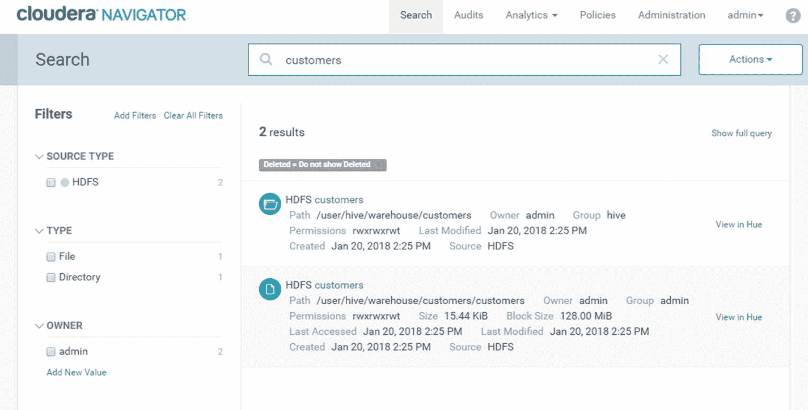
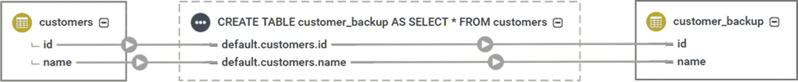
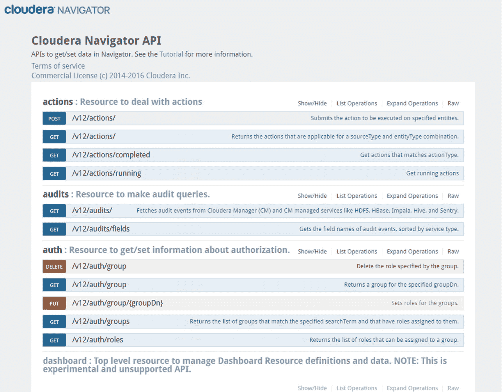

# 十一、大数据治理和管理

数据治理是用于正式管理组织数据的一组策略和流程。数据治理是一个广泛的话题，包括几个功能，比如数据质量、元数据管理、主数据管理和数据安全性等等。数据治理的主要目标是确保组织的数据安全可靠。

数据治理可能是组织信息管理策略中最重要的部分之一。数据治理问题，如缺乏数据质量或数据安全性受损，可能会导致数据驱动型项目失败或造成巨大的收入损失。对于银行和政府机构等组织来说，数据治理是必须的。有几个数据治理和管理框架可供选择，比如 DAMA 框架。DAMA 框架在一个指南中编纂了一个知识领域和过程的集合，该指南被称为“知识的数据管理主体的 DAMA 指南或 DAMA-DMBoK 指南” [ii](#Sec17)

本章的目的不是提供数据治理的详尽内容。已经有整本书都是关于数据治理的。相反，我的目的是从大数据的角度向您介绍数据治理。我使用 Cloudera Navigator 来展示大数据平台上的常见数据治理任务。要了解更多关于数据治理的信息，我推荐 John Ladley 的《数据治理:如何设计、部署和维持有效的数据治理计划》(Morgan Kaufmann，2012)。要了解更多关于 Cloudera Navigator 的信息，请访问 Cloudera 的网站。

## 大数据的数据治理

因为数据被整合到大数据平台(也称为“数据湖”或“数据中心”)中，所以数据治理变得更加重要。在单个平台上存储数百万个文件和表格会成为数据管理的噩梦。想象一下，从不同的数据源获取相同数据的多个版本，或者不得不费力地通过数百万个文件和表来寻找特定的信息。在数据仓库环境中，数据治理至关重要，但在涉及大数据时，这一重要性被放大了。一旦您开始处理以不同类型和格式存储的数百 TB 或数 Pb 的数据，您就会对数据治理有真正的了解。成功的大数据战略依赖于执行良好的数据治理计划。

## Cloudera 导航器

Cloudera 包括一个名为 Cloudera Navigator 的数据治理工具，用于帮助管理和组织存储在数据湖中的数据。在一些组织中，根据组织的规模，通常会有一个指定的人或小组负责数据治理。他们被称为数据管家。一些团队将数据管理员的角色与管理员、架构师或数据质量工程师的角色结合起来。无论您的团队是如何构建的，都应该有一个正式的数据治理框架在您的组织中实现和遵循。

数据管家和管理员可以使用 Cloudera Navigator 来主动管理和监控存储在数据湖中的数据。Cloudera Navigator 允许您执行元数据管理、数据分类、数据审计和访问控制等任务，探索数据谱系，执行影响分析，实现策略，以及自动化数据生命周期。

您可以从 Cloudera Manager 访问 Cloudera Navigator。导航到集群，然后点击 Cloudera Navigator，如图 [11-1](#Fig1) 所示。您也可以通过将浏览器指向在端口 7187 上安装了 Cloudera 元数据服务器的主机名来直接访问 Cloudera Navigator。

图 11-1

How to access Cloudera Navigator from Cloudera Manager

登录后，您会看到一个搜索框，您可以在其中输入实体名称、元数据标签或任何可以帮助您找到想要搜索的实体的关键字。如图 [11-2](#Fig2) 所示，窗口左侧的过滤器可以帮助您执行更精确的分面搜索。

图 11-2

Cloudera Navigator User Interface

### 元数据管理

元数据管理涉及管理描述组织数据的数据。 [iii](#Sec17) 例如，元数据可以是文件的创建日期、表格大小或文件权限等等。Cloudera Navigator 允许用户搜索、定义和更新属性，并标记文件、表和目录等实体。元数据有三种类型 [iv](#Sec17) :技术元数据，包括文件或表格名称；创建日期和时间；大小权限和所有者等等。不允许用户修改技术元数据。自定义元数据是键值对，可以在创建实体之前和之后添加到实体中。托管元数据包括只能在创建实体后添加或更新的标记、描述和键值对。元数据是大多数数据治理任务的基础，如数据分类、搜索和策略实现。我向存储在 HDFS (annie，berkeley 和 marketing)的客户文件添加了一个描述和三个元数据标记，如图 [11-3](#Fig3) 所示。

图 11-3

Adding metadata tags and description to entities

搜索“marketing”会返回我之前标记的客户文件，如图 [11-4](#Fig4) 所示。

图 11-4

Searching using a specific metadata tag

### 数据分类

元数据标签和描述可能非常强大。标签可用于对数据进行分类。例如，可以将文件和表标记为“marketing ”,以标识属于市场营销部门的实体，也可以将实体标记为“finance ”,以让每个人都知道特定的实体属于财务部等等。您可以使用标签和键值对的组合，以任何方式对数据进行分类。您可以使用标签快速搜索分类在一起的实体，如图 [11-5](#Fig5) 所示。

图 11-5

Classifying data using metadata

### 数据沿袭和影响分析

Cloudera Navigator 允许用户查看数据血统。数据沿袭显示了一个实体与其他实体的关系。它显示了针对特定实体执行的所有数据转换(图 [11-6](#Fig6) )。它显示了特定实体是如何创建的、原始数据源以及谁执行了数据转换。检查实体的数据沿袭是确定其可信度的有效方法。它在应用程序开发中也很有用，帮助架构师确定模式更改对其他实体的影响。

图 11-6

Data lineage showing the actual SQL statement used to create the table

### 审计和访问控制

Cloudera Navigator 提供审计功能，允许数据管理员监控 HBase、HDFS、Hive、HUE、Impala、Navigator 元数据服务器、Sentry 和 Solr 等服务上的审计事件。[v](#Sec17)cloud era Navigator 监测用户成功和不成功登录时的事件；创建或删除列、表、文件、文件夹或集合。并授予或撤消对象权限，以提及一些可用的审计事件。审核安全事件可以确保数据不会被没有必要权限的人更改。这在多用户访问数据湖的多租户环境中尤其有用。在大数据环境中跟踪访问尝试和不正确的对象权限可能会很困难。Cloudera Navigator 记录了用户 ID、对象名称、IP 地址以及执行的确切命令或查询。 [vi](#Sec17) 图 [11-7](#Fig7) 显示了一个审计事件，包括时间戳、用户名、IP 地址、资源以及执行的确切命令。

图 11-7

Searching using a specific metadata tag

### 策略实现和数据生命周期自动化

Cloudera Navigator 允许数据管理员定义策略，这些策略可用于自动化某些操作，如执行命令、添加自定义元数据标记以及向 JMS 消息队列发送消息。 [vii](#Sec17) 例如，您可以创建策略，在指定的时间段后自动归档数据，或者根据实体的元数据将数据移动到安全的位置。

### Cloudera Navigator REST API

Cloudera Navigator 拥有 REST API，开发人员可以使用它来提供额外的功能或自动化任务(图 [11-8](#Fig8) )。该 API 使用 HTTP 基本认证，并使用您用于登录 Cloudera Navigator 的相同用户名和密码。

图 11-8

Cloudera Navigator REST API

## Cloudera Navigator 加密

Cloudera Navigator 包括 Cloudera Navigator Encrypt、Cloudera Navigator 密钥托管服务器和 Cloudera Navigator 密钥 HSM，以提供企业加密和密钥管理解决方案。Navigator Encrypt 的讨论超出了本章的范围。有关 Cloudera Navigator Encrypt 的更多信息，请咨询 Cloudera 的网站。

## 其他数据治理工具

这绝不是一个详尽的列表，但它应该让您对当今市场上可用的数据治理工具有所了解。

### Apache Atlas 系统

Apache Atlas 是一个数据治理和元数据帧，主要由 Hortonworks 使用。它提供了与 Cloudera Navigator 类似的特性和功能，如数据分类、审计、数据沿袭和策略引擎。 [viii](#Sec17) 它还提供了一个 REST API，并与第三方商业数据治理工具集成。

### 信息元数据管理器和企业数据目录

Informatica 元数据管理器是 Informatica 的元数据管理工具，与 Cloudera Navigator 集成。元数据管理器提供端到端的企业数据沿袭。Cloudera Navigator 只管理存储在数据湖中的数据，数据湖之外的任何东西都是 Cloudera Navigator 无法触及的。Metadata Manager 提供了从数据仓库到数据湖的数据流和转换的完整视图，以及跨整个 ETL 管道的商业智能工具，使数据管理员能够更好地了解数据转换链和已应用于数据的业务规则。 [ix](#Sec17) Informatica 企业数据目录是 Informatica 的下一代数据治理工具，将很快取代元数据管理器。企业数据目录使用机器学习来分类和组织存储在数据湖中的数据。Informatica 还拥有主数据管理和数据质量解决方案。

### 科里布拉

Collibra 是另一个与 Cloudera Navigator 集成的企业数据治理工具。Collibra 数据治理包括业务术语表、数据字典、参考数据管理、数据管理自动化、摄取控制、分析模型治理和 Hadoop 作业监督。

### 水线数据

Waterline Data 是另一种数据治理工具，它使用机器学习来自动推荐元数据标签，并将其与业务术语表术语进行匹配。水线数据声称，它可以减少 80%以上的数据人工标记。机器学习算法基于数据管理员对标签的接受或拒绝而自动改进。 [x](#Sec17)

### 开始逻辑

Smartlogic 与我讨论的其他数据治理工具略有不同。Smartlogic 提供了一个内容智能平台，它结合了规则引擎和自然语言处理，通过应用元数据标签来自动对数据进行分类。 [xi](#Sec17) 它集成了 Solr、Sharepoint 和 Marklogic，并与 Oracle、微软、Lucidworks 和 SAP 建立了合作伙伴关系。

## 摘要

Cloudera Navigator 是一个企业数据治理工具，使组织能够正确管理和组织他们的数据。目标是通过确保您的数据安全可靠，防止数据湖变成“数据沼泽”。Cloudera Navigator 非常有用，应该成为你的工具集的一部分；然而，它不是一个全面的数据治理和管理工具。例如，它不处理主数据管理和数据质量管理。如前所述，如果您需要这样的功能，您可能需要将 Cloudera Navigator 与第三方数据治理工具(如 Informatica 主数据管理或数据质量)集成。其他工具如 Informatica Enterprise Information Catalog、Waterline Data 和 Smartlogic 使用机器学习来构建分类法和本体，以自动组织数据，提供更高级的数据治理功能。

## 参考

1.  A.R .猜测；《数据治理与数据管理的区别》，Dataversity，2018， [`http://www.dataversity.net/the-difference-between-data-governance-data-management/`](http://www.dataversity.net/the-difference-between-data-governance-data-management/)
2.  帕特里夏·库波利、苏珊·厄尔利、黛博拉·亨德森；《DAMA-DMBOK2 框架》，DAMA，2014， [`https://dama.org/sites/default/files/download/DAMA-DMBOK2-Framework-V2-20140317-FINAL.pdf`](https://dama.org/sites/default/files/download/DAMA-DMBOK2-Framework-V2-20140317-FINAL.pdf)
3.  玛格丽特·劳斯；《元数据管理》，TechTarget，2018， [`http://whatis.techtarget.com/definition/metadata-management`](http://whatis.techtarget.com/definition/metadata-management)
4.  Cloudera《Cloudera Navigator 元数据架构》，Cloudera，2018， [`https://www.cloudera.com/documentation/enterprise/5-11-x/topics/cn_iu_metadata_arch.html`](https://www.cloudera.com/documentation/enterprise/5-11-x/topics/cn_iu_metadata_arch.html)
5.  Cloudera《Cloudera 领航员审计》，Cloudera，2018， [`https://www.cloudera.com/documentation/enterprise/5-6-x/topics/cn_iu_audits.html#cn_topic_7`](https://www.cloudera.com/documentation/enterprise/5-6-x/topics/cn_iu_audits.html#cn_topic_7)
6.  Cloudera“Hadoop 中的数据治理—第 2 部分”，Cloudera，2018， [`https://vision.cloudera.com/data-governance-in-hadoop-part-2/`](https://vision.cloudera.com/data-governance-in-hadoop-part-2/)
7.  Cloudera《元数据政策》，Cloudera，2018， [`https://www.cloudera.com/documentation/enterprise/5-7-x/topics/navigator_policies.html#xd_583c10bfdbd326ba-7dae4aa6-147c30d0933--7c4a`](https://www.cloudera.com/documentation/enterprise/5-7-x/topics/navigator_policies.html#xd_583c10bfdbd326ba-7dae4aa6-147c30d0933--7c4a)
8.  阿帕奇地图集；《Hadoop 的数据治理和元数据帧》，Apache Atlas，2018， [`http://atlas.apache.org/`](http://atlas.apache.org/)
9.  斯科特·亨德里克斯；“与 Cloudera Navigator 的 Informatica 集成现已提供端到端数据血统，”Cloudera，2018， [`https://vision.cloudera.com/end-to-end-data-lineage-now-available-with-informatica-integration-with-cloudera-navigator/`](https://vision.cloudera.com/end-to-end-data-lineage-now-available-with-informatica-integration-with-cloudera-navigator/)
10.  水线数据；《像管理资产一样管理你的数据》，水线数据，2018， [`https://www.waterlinedata.com/product-overview/`](https://www.waterlinedata.com/product-overview/)
11.  彭博；《Smartlogic 信号机有限公司公司概况》，彭博，2018， [`https://www.bloomberg.com/research/stocks/private/snapshot.asp?privcapId=37460152`](https://www.bloomberg.com/research/stocks/private/snapshot.asp?privcapId=37460152)