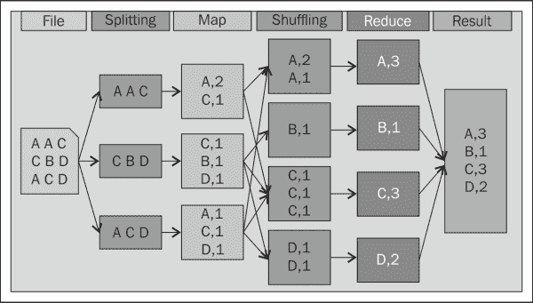

# 一、了解 Hadoop MapReduce

MapReduce，一种流行的数据密集型分布式计算模型，正在成为 Web 索引、数据挖掘、和科学模拟等大规模数据并行应用的重要编程模型。

Hadoop 是 Google 的 MapReduce 编程模型最流行的开源 Java 实现。 它已经被许多公司用于大规模数据分析任务，并且经常用于响应时间短的工作。

在深入研究 MapReduce 编程和 Hadoop 性能调优之前，我们将回顾 MapReduce 模型的基础知识，并了解影响 Hadoop 性能的因素。

在本章中，我们将介绍以下内容：

*   MapReduce 模型
*   Hadoop MapReduce 概述
*   MapReduce 的内部工作原理
*   影响 MapReduce 性能的因素

# MapReduce 模型

MapReduce 是一个编程模型，设计用于通过大型商用硬件集群处理非结构化数据并生成大型数据集。 它能够在集群中的数千个计算节点上处理数 TB 的数据、处理故障、复制任务和聚合结果。

MapReduce 模型很容易理解。 它是由谷歌研究院([http://research.google.com/archive/mapreduce.html](http://research.google.com/archive/mapreduce.html))的工程师在 21 世纪初设计的。 它由两个函数组成，一个是`map`函数，另一个是可以在多台机器上并行执行的`reduce`函数。

要使用 MapReduce，程序员需要编写一个用户定义的`map`函数和一个用户定义的`reduce`函数来表达他们想要的计算。 `map`函数读取键/值对，应用特定于用户的代码，并生成称为中间结果的结果。 然后，这些中间结果由输出最终结果的`reduce`特定于用户的代码聚合。

MapReduce 应用的输入按照将产生键/值对的输入规范组织在记录中，每个键/值对都是`<k1, v1>`对。

因此，MapReduce 过程由两个主要阶段组成：

*   `map()`：用户定义的`map`函数逐个应用于所有输入记录，并为每个记录输出一个包含零个或多个中间键/值对的列表，即`<k2, v2>`条记录。 然后收集并重新组织所有`<k2, v2>`条记录，以便将具有相同关键字(`k2`)的记录放在一起成为`<k2, list(v2)>`条记录。
*   `reduce()`: The user-defined `reduce` function is called once for each distinct key in the map output, `<k2, list(v2)>` records, and for each record the `reduce` function outputs zero or more `<k2, v3>` pairs. All `<k2, v3>` pairs together coalesce into the final result.

    ### 提示

    `map`和`reduce`函数的签名如下：

    *   `map(<k1, v1>)``list(<k2, v2>)`
    *   `reduce(<k2, list(v2)>)``<k2, v3>`

MapReduce 编程模型设计为独立于存储系统。 MapReduce 通过读取器从底层存储系统读取键/值对。 读取器从存储系统检索每条记录，并将记录包装成键/值对以供进一步处理。 用户可以通过实施相应的读卡器来添加对新存储系统的支持。 这种与存储无关的设计被认为对异构系统有利，因为它使 MapReduce 能够分析存储在不同存储系统中的数据。

为了理解 MapReduce 编程模型，让我们假设您想要计算给定输入文件中每个单词的出现次数。 转换为 MapReduce 作业后，字数统计作业由以下步骤定义：

1.  输入数据被分成多个记录。
2.  映射函数处理这些记录，并为每个单词生成键/值对。
3.  由`map`函数输出的所有键/值对被合并在一起，按键分组并排序。
4.  中间结果被传输到`reduce`函数，该函数将产生最终输出。

此 MapReduce 应用的总体步骤如下图所示：

在聚合键/值对时，可以观察到大量的 I/O 和网络流量 I/O。 为了减少 MAP 和 Reduce 步骤之间所需的网络通信量，程序员可以选择通过提供**组合器**函数来执行映射端预聚合。 组合器函数类似于`reduce`函数，不同之处在于它们不会被传递给给定键的所有值；相反，组合器函数发出一个输出值，该输出值汇总传递给它的输入值。

# Hadoop MapReduce 概述

Hadoop 是 Google 提出的 MapReduce 编程模型最流行的开源 Java 实现。 MapReduce 还有许多其他实现(如 Sphere、Starfish、Riak 等)，它们实现了 Google 文档中描述的所有功能，或者只实现了这些功能的一部分。

Hadoop 由分布式数据存储引擎和 MapReduce 执行引擎组成。 它已经成功地用于处理使用大量节点的大量数据集上的高度可分布性问题。 这些节点共同形成一个**Hadoop 集群**，该集群由一个称为**JobTracker**的主节点和多个工作(或从)节点组成；每个工作节点称为**TaskTracker**。 在这个框架中，用户程序被称为作业，分为两个步骤：映射和还原。

与 MapReduce 编程模型中一样，在使用 Hadoop MapReduce 实现时，用户只需定义 map 和 Reduce 函数。 Hadoop MapReduce 系统自动并行执行这些功能，并确保容错。

### 提示

要了解更多关于 Hadoop MapReduce 实现的信息，您可以浏览 Hadoop 的官方网站[http://hadoop.apache.org/](http://hadoop.apache.org/)。

基本上，Hadoop MapReduce 框架利用分布式文件系统来读写其数据。 这个分布式文件系统称为**Hadoop 分布式文件系统**(**HDFS**)，它是**Google 文件系统**(**GFS**)的开源版本。 因此，Hadoop MapReduce 作业的 I/O 性能强烈依赖于 HDFS。

HDFS 由称为**NameNode**的主节点和称为**DataNodes**的从节点组成。 在 HDFS 中，个数据被分成个固定大小的块(块)，并分布在集群中的所有 DataNode 上。 每个数据块通常使用两个副本进行复制：一个放在同一机架内，另一个放在机架外。 NameNode 跟踪哪些 DataNode 保存哪些块的副本。

# Hadoop MapReduce 内部

MapReduce 编程模型可用于通过一个或多个步骤处理许多大型数据问题。 此外，它可以有效地实现以支持使用大量机器处理大量数据的问题。 在大数据环境中，处理的数据量可能非常大，以至于无法将数据存储在一台机器上。

在典型的 Hadoop MapReduce 框架中，数据被分成块并分布在集群中的许多节点上，MapReduce 框架通过将计算传送到数据而不是将数据移动到处理数据的位置来利用数据的局部性。 MapReduce 应用的大多数输入数据块都位于本地节点上，因此可以非常快速地加载它们，并且可以在多个节点上并行读取多个块。 因此，MapReduce 可以获得非常高的聚合 I/O 带宽和数据处理速率。

要启动 MapReduce 作业，Hadoop 需要创建 MapReduce 应用的一个实例，并将该作业提交给 JobTracker。 然后，作业被划分为映射任务(也称为映射器)和 Reduce 任务(也称为 Reducer)。

当 Hadoop 启动 MapReduce 作业时，它会将输入数据集分割成均匀大小的数据块，并使用心跳协议来分配任务。 然后，每个数据块被调度到一个 TaskTracker 节点，并由映射任务处理。

每个任务都在 Worker 节点中的一个可用插槽上执行，该节点配置了固定数量的 MAP 插槽和另一个固定数量的 Reduce 插槽。 如果所有可用插槽都已被占用，则挂起的任务必须等待，直到一些插槽被释放。

TaskTracker 节点定期将其状态发送到 JobTracker。 当 TaskTracker 节点空闲时，JobTracker 节点会为其分配新任务。 JobTracker 节点在传播数据块时会考虑数据局部性。 它总是尝试将本地数据块分配给 TaskTracker 节点。 如果尝试失败，JobTracker 节点将改为向 TaskTracker 节点分配一个机架本地或随机数据块。

当所有映射函数完成执行时，运行时系统将对所有中间对进行分组，并启动一组 Reduce 任务以生成最终结果。 它将执行从改组阶段移到缩减阶段。 在最后的 Reduce 阶段，调用`reduce`函数来处理中间数据并写入最终输出。

用户经常使用不同粒度的术语来指定 Hadoop 映射和归约任务、子任务、阶段和子阶段。 映射任务由两个子任务组成：映射和合并，而 Reduce 任务只包含一个任务。 但是，混洗和排序首先发生，并由系统完成。 每个子任务又被划分为许多子阶段，如读-映射、溢出、合并、复制-映射和减少-写入。

# 影响 MapReduce 性能的因素

使用 MapReduce 处理输入数据的时间可能受许多因素的影响。 其中一个因素是您在实现`map`和`reduce`函数时使用的算法。 其他外部因素也可能影响 MapReduce 的性能。 根据我们的经验和观察，以下是可能影响 MapReduce 性能的主要因素：

*   硬件(或资源)，如 CPU 时钟、磁盘 I/O、网络带宽和内存大小。
*   底层存储系统。
*   输入数据、置乱数据和输出数据的数据大小，它们与作业的运行时间密切相关。
*   作业算法(或程序)，例如映射、约简、分区、合并和压缩。 有些算法可能很难在 MapReduce 中概念化，或者在 MapReduce 中表达起来效率不高。

在运行映射任务时，混洗子任务的中间输出存储在内存缓冲区中，以减少磁盘 I/O。但是，由于此输出的大小可能超过内存缓冲区的大小，并且可能会发生这种溢出，因此需要溢出子阶段将数据刷新到本地文件系统中。 此子阶段可能会影响 MapReduce 的性能，通常使用多线程来实现，以最大限度地提高磁盘 I/O 的利用率并缩短作业的运行时间。

MapReduce 编程模型使用户能够使用自己的`map`和`reduce`函数指定数据转换逻辑。 该模型没有指定如何对映射函数生成的中间对进行分组，以供 Reduce 函数处理。 因此，采用**合并-排序**算法作为默认分组算法。 然而，合并排序算法并不总是最有效的算法，特别是对于聚集和相等连接这样的分析任务，这些任务并不关心中间键的顺序。

### 备注

在 MapReduce 编程模型中，分组/分区是一项*串行*任务！ 这意味着框架需要等待所有映射任务完成，然后才能运行任何 Reduce 任务。

要了解有关合并排序算法的更多信息，请参阅 URL[http://en.wikipedia.org/wiki/Merge_sort](http://en.wikipedia.org/wiki/Merge_sort)。

MapReduce 性能基于`map`和`reduce`的运行时。 这是因为在典型环境中，群集中的节点数或节点中的插槽数等参数是不可修改的。

其他可能影响 MapReduce 性能的因素包括：

*   **I/O 模式**：这是从存储系统检索数据的方式。 从底层存储系统读取数据有两种模式：
    *   **直接 I/O**：这用于通过硬件控制器直接从本地磁盘缓存读取到内存；因此，不需要进程间通信开销。
    *   **Streaming I/O**: This allows you to read data from another running process (typically the storage system process) through certain inter-process communication schemes such as TCP/IP and JDBC.

        ### 提示

        要提高性能，使用直接 I/O 可能比流式 I/O 更高效。

*   **Input data parsing**: This is the conversion process from raw data into the key/value pairs when data is retrieved from the storage system. The data parsing process aims to decode raw data from its native format and transform it into data objects that can be processed by a programming language such as Java.

    可以将输入数据解码为(Java 或其他)对象，以便在创建实例后可以更改内容，通常是在使用对对象实例(这些对象称为**可变**对象)或对内容在创建后无法更改的对象(称为**不可变**对象)的引用时。 在有一百万条记录的情况下，不可变解码过程比可变解码过程慢得多，因为它可能会产生大量的不可变对象。 因此，这可能会导致系统性能不佳。

*   **输入数据存储**：当 MapReduce 检索要处理的数据时，底层存储系统必须确保高速访问和数据可用性(如 HDFS 和 HBase)。 如果您选择使用存储文件系统，而不是建议与 MapReduce 一起使用的存储文件系统，则对输入数据的访问可能会潜在地影响 MapReduce 的性能。

在使用 Hadoop 框架时，许多因素可能会影响整体系统性能和作业的运行时间。 这些因素可能是 Hadoop MapReduce 引擎的一部分，也可能在其外部。

Hadoop 配置参数通常指示可以并发运行的任务数量，并确定作业的运行时间，因为在设置 Hadoop 群集和作业开始执行之后，其他因素不可修改。 错误配置的 Hadoop 框架可能会未充分利用群集资源，从而影响 MapReduce 作业性能。 这是由于控制 Hadoop 框架行为的大量配置参数造成的。

Hadoop 作业通常由实现不同算法的多个子模块组成，这些子模块中的一些是串行连接的，而另一些是并行连接的。 Hadoop 框架的错误配置可能会影响所有内部任务如何协同完成任务。 所有这些参数的设置(将在 C[章节 2](02.html "Chapter 2. An Overview of the Hadoop Parameters")，*Hadoop 参数概述*中介绍)的影响取决于`map`和`reduce`函数的代码、集群资源，当然还有输入数据。

MapReduce 作业性能还可能受到 Hadoop 集群中节点数量以及所有节点可用于运行映射和归约任务的资源的影响。 每个节点容量决定了节点可以执行的映射器和减少器任务的数量。 因此，如果节点资源未得到充分利用或过度利用，将直接影响 MapReduce 任务的性能。

# 摘要

在本章中，我们学习了 MapReduce 编程模型，并回顾了它的内部工作原理。 然后，我们重点介绍了 Hadoop MapReduce，并了解了它的主要组件。 我们还讨论了可能影响 Hadoop MapReduce 性能的内部和外部因素。

在下一章中，我们将研究 Hadoop 的可调参数，并了解 Hadoop 指标和性能工具。