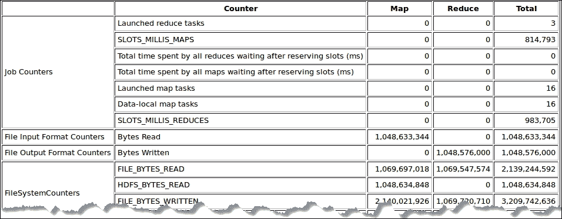

# 第二章 Hadoop 参数概述

运行 Hadoop 作业后，了解集群资源是否得到充分利用非常重要。 幸运的是，Hadoop 框架提供了几个参数，使您能够调优作业并指定它将如何在集群上运行。

性能调优涉及四个主要组件：CPU 利用率、内存占用、磁盘 I/O 和网络流量。 本章描述了与这些组件最相关的参数，并介绍了优化 Hadoop 执行和定义一些配置参数的技术。

拥有一个高效的监视工具非常重要，而且必不可少，它可以在问题正在发展或发生时发出警报，从而直观地指示 Hadoop 群集的运行情况。 本章重点介绍使用配置参数进行 Hadoop 性能调优，并介绍几种用于监视 Hadoop 服务的工具。

在本章中，我们将介绍以下主题：

*   Hadoop 可调参数的研究
*   与 CPU 利用率、内存、磁盘 I/O 和网络相关的 Hadoop 配置参数
*   Hadoop 指标
*   Hadoop 监控工具

# 调查 Hadoop 参数

正如在[第 1 章](01.html "Chapter 1. Understanding Hadoop MapReduce")，*了解 MapReduce*中所讨论的，有很多因素可能会影响 Hadoop MapReduce 的性能。 通常，依赖于工作负载的 Hadoop 性能优化工作必须集中在三个主要类别上：系统硬件、系统软件和 Hadoop 基础架构组件的配置和调优/优化。

需要指出的是，Hadoop 被归类为高度可扩展的解决方案，但不一定是高性能集群解决方案。 管理员可以使用各种配置选项配置和调优 Hadoop 群集。 性能配置参数主要关注 CPU 利用率、内存占用、磁盘 I/O 和网络流量。 除了 Hadoop 的主要性能参数外，机架间带宽等其他系统参数可能会影响集群的整体性能。

Hadoop 可以根据用户需求进行配置和定制；可以修改安装后自动生成的配置文件，以满足应用和集群的特定需求。

配置文件分为两类：只读默认配置和站点特定配置：

*   第一类别包括`core-default.xml`、`hdfs-default.xml`和`mapred-default.xml`
*   第二个类别包括`core-site.xml`、`hdfs-site.xml`和`mapred-site.xml`

Hadoop 配置文件中有大量的变量，您可以定义或覆盖它们来控制 Hadoop配置。 这些变量可以在`core-site.xml`、`hdfs-site.xml`和`mapred-site.xml`中定义。 一些变量用于指定系统上的文件路径，而其他变量则以不同的粒度调整 Hadoop 框架的不同方面。 每个配置文件都有以 XML 格式表示的名称-值对，它们定义了 Hadoop 的不同方面的工作方式。

从系统的硬件角度来看，在性能、可伸缩性和成本方面平衡适当的硬件组件至关重要。 从软件的角度来看，操作系统、**JVM**(**Java 虚拟机**)、特定 Hadoop 版本以及运行 Hadoop 安装程序所需的其他软件组件的选择确实会对环境的性能和稳定性产生深远影响。 任何 Hadoop 项目的设计、设置、配置和调优阶段对于充分受益于分布式 Hadoop 硬件和软件解决方案堆栈至关重要。

## mapred-site.xml 配置文件

可以认为`mapred-site.xml`文件是提高 Hadoop MapReduce 性能的主键。 此配置文件包含 CPU、内存、磁盘 I/O 和网络相关参数。

### CPU 相关参数

以下两个参数与 CPU 利用率最相关。 通过覆盖这些变量，您可以指定 TaskTracker 节点将同时运行的最大 MAP/Reduce 任务数。 默认情况下，这两个参数的值都是`2`。

<colgroup><col style="text-align: left"> <col style="text-align: left"> <col style="text-align: left"></colgroup> 
| 

配置变量

 | 

描述 / 描写 / 形容 / 类别

 | 

默认值

 |
| --- | --- | --- |
| `mapred.tasktracker.map.tasks.maximum` | 用于设置 TaskTracker 将同时运行的地图任务的最大数量[T0 | `2` |
| `mapred.tasktracker.reduce.tasks.maximum` | 用于设置 TaskTracker 将同时运行的最大 Reduce 任务数[T0 | `2` |

从理论上讲，增加这些默认值会增加 CPU 利用率，从而提高性能，但这个必须根据您的集群资源(如 CPU(有/没有超线程因子)和可用内存)灵活地执行。 否则，您可能会降低整个 MapReduce 作业和群集性能的级别。

用户提出的一个典型问题是，应该设置多少个映射器/减少器才能获得最佳性能？ 要设置此值，应考虑 TaskTracker 对 CPU、内存和磁盘 I/O 等资源的利用率。此外，还应考虑正在运行的作业是否占用大量 CPU 资源。

为了说明这些参数设置，假设您有 10 个 Hadoop 集群节点，每个节点都有一个四核 CPU。 那么，守护进程的总数应该不超过*10(节点)x 4(CPU 核心)=40*。 考虑到应该为 DataNode 守护进程保留一个 CPU 核心，为 TaskTracker 保留另一个 CPU 核心，那么只剩下 38 个 CPU 核心用于 map/duce 任务。

您不需要将映射器或减少器计数设置为相同的值，因为它取决于每个任务的 CPU 利用率以及每个映射器和减少器如何完成作业以获得最终结果。 您可以将 50%的 CPU 资源分配给映射器，将 50%的 CPU 资源分配给减速器，将三分之二的 CPU 资源分配给映射器，将三分之一的 CPU 资源分配给减速器，或者使用任何其他允许您使集群以最佳方式运行的分配方案。

将计数值设置为`-1`意味着 Hadoop 将使用管理员为映射器和减少器任务分配的所有内存。 将此值设置为大于物理 CPU 核心计数将导致密集的 CPU 上下文切换(请参阅[第 4 章](04.html "Chapter 4. Identifying Resource Weaknesses")，*识别资源弱点*)，这可能会显著降低群集的性能。

### 磁盘 I/O 相关参数

为了优化磁盘 I/O 操作，您可以决定使用默认关闭的数据压缩。 可以通过更改控制压缩的参数的默认值来启用压缩。 变量`mapred.compress.map.output`启用映射输出压缩，变量`mapred.output.compress`启用作业输出压缩，变量`mapred.map.output.compression.codec`用于定义压缩编解码器。

<colgroup><col style="text-align: left"> <col style="text-align: left"> <col style="text-align: left"></colgroup> 
| 

配置变量

 | 

描述 / 描写 / 形容 / 类别

 | 

默认值

 |
| --- | --- | --- |
| `mapred.compress.map.output` | 这是一个布尔值(TRUE 或 FALSE)，默认情况下设置为`false`。 如果设置为`true`，映射任务的输出将在通过网络发送之前使用`SequenceFile`编解码器压缩进行压缩。 | `false` |
| `mapred.output.compress` | 这是一个布尔值；将其设置为`true`将启用作业输出压缩。 | `false` |
| `mapred.map.output.compression.codec` | 该值用于确定将用于压缩 MAP 输出的压缩编解码器(编码器/解码器)。 | `org.apache.hadoop.io.compress.DefaultCodec` |

为映射任务启用压缩输出将减少要写入存储的中间数据量。 因此，这将加快混洗和写入阶段的磁盘写入操作，并减少数据传输的总时间。 在压缩/解压缩过程中，使用压缩加速磁盘写入操作会带来额外的 CPU 开销。

实际经验表明，只有当输入数据较大且易于拆分(如文本文件)时，才应启用压缩。 否则，启用压缩可能会降低群集的性能。

为了实现磁盘 I/O 均衡，大幅提升 I/O 性能，您可以使用写入多个位置的功能在每个节点的所有磁盘上写入数据。 使用多个物理设备产生的性能比 RAID 0 条带化大约高 50%。

以下两个参数确定在 Hadoop 中存储数据的位置。 您可以使用`mapred.local.dir`变量指定存储中间地图输出数据的位置，使用`dfs.data.dir`变量指定 HDFS 数据的存储位置。

<colgroup><col style="text-align: left"> <col style="text-align: left"> <col style="text-align: left"></colgroup> 
| 

配置变量

 | 

描述 / 描写 / 形容 / 类别

 | 

默认值

 |
| --- | --- | --- |
| `mapred.local.dir` | 它用于指定需要存储映射的中间文件的本地目录。 您可以为此参数定义多个目录，这些目录应该位于不同的物理设备上。 如果提供了多个目录，数据将分布在这些目录中。 不存在的目录将被忽略。 | `${hadoop.tmp.dir}/mapred/local` |
| `dfs.data.dir` (`hdfs-site.xml`) | 这用于指定 DataNode 应在本地文件系统上存储其块的目录。 如果您提供逗号分隔的目录列表，则数据块将存储在所有目录中。 如果此参数丢失，则整个 HDFS 数据集都会丢失。 | `${hadoop.tmp.dir}/dfs/data` |

### 内存相关参数

内存资源是一种非常重要的资源，需要合理分配，以避免交换并允许 Hadoop 作业以最佳方式运行。 您可以使用与内存相关的参数来设置要为 MapReduce 作业保留的物理内存量。 下表显示了最常见的内存相关参数：

<colgroup><col style="text-align: left"> <col style="text-align: left"> <col style="text-align: left"></colgroup> 
| 

配置变量

 | 

描述 / 描写 / 形容 / 类别

 | 

默认值

 |
| --- | --- | --- |
| `mapred.child.java.opts` | 这控制每个 JVM 任务可用的内存量。 默认值将保留 200 MB 内存以运行 MapReduce 作业。 | `-Xmx200m` |
| `Mapred.child.ulimit` | 此参数用于控制将分配给 MapReduce 作业的虚拟内存限制。 |   |

未指定默认值`Mapred.child.ulimit`。 如果选择为此参数指定值，则该值应大于或至少等于`mapred.child.java.opts`的`–Xmx`值。 否则，Java 虚拟机可能无法启动。 要正确设置此值，应将其设置为大于*2*mapred.Child.java.opts*的值。

合并和排序是可以使用与内存相关的参数进行优化的另一个方面。 您可以设置三个主要参数来优化 MapReduce 的合并和排序性能。

<colgroup><col style="text-align: left"> <col style="text-align: left"> <col style="text-align: left"></colgroup> 
| 

配置变量

 | 

描述 / 描写 / 形容 / 类别

 | 

默认值

 |
| --- | --- | --- |
| `io.sort.mb` | 它指定对数据流进行排序时要使用的缓冲区空间量(以 MB 为单位)。 配置错误时，此参数通常会导致小内存计算机上的作业内存不足。 | `100` |
| `io.sort.factor` | 这决定了在对文件进行排序时一次要合并的映射输出分区的个。 | `10` |
| `mapred.job.reduce.input.buffer.percent` | 这决定了在 Reduce 阶段保留映射输出的内存相对于最大堆大小的百分比。 Reduce 任务可以在混洗结束时开始，并且为任何剩余的映射输出分配的内存必须小于此阈值。 | `0.0` |

如果增加`io.sort.mb`和`io.sort.factor`的值，它将为排序和合并操作分配更多内存。 这最大限度地减少了对磁盘的溢出，从而减少了映射器和减速器任务的 I/O 时间。 另一方面，增加这些值会增加每个映射任务所需的内存，并且当分配给每个任务的内存不够大时，可能会增加垃圾收集器活动。

我们的经验表明，如果有大量溢出到磁盘，并且排序/混洗阶段的 I/O 次数很高，则可能需要增加`io.sort.factor`的值。 此外，如果您的映射输出很大，且映射端 I/O 频繁，则应该尝试增加`io.sort.mb`的值。 为了避免“任务内存不足”错误，您应该将`io.sort.mb`设置为大于*0.25*mapred.Child.java.opts*且小于*0.5*mapred.Child.java.opts*的值。

您可以增加`mapred.job.reduce.input.buffer.percent`的值以在内存中获得更多缓冲区，这将在 Reduce 阶段减少本地磁盘 I/O 时间，但如前所述，如果分配了更多内存，则可能会增加垃圾收集器释放未使用内存的活动。 因此，当映射输出较大且本地磁盘 I/O 在 Reduce 排序阶段频繁时，应尝试分配更多内存。

### 网络相关参数

Hadoop 有一个名为**机架感知**的概念。 管理员可以定义群集中每个 DataNode 的机架。 让 Hadoop 机架感知至关重要，因为机架感知可防止数据丢失，而良好的机架感知配置可提高网络性能。 下表中定义的变量可帮助 Hadoop 安装机架识别：

<colgroup><col style="text-align: left"> <col style="text-align: left"> <col style="text-align: left"></colgroup> 
| 

配置变量

 | 

描述 / 描写 / 形容 / 类别

 | 

默认值

 |
| --- | --- | --- |
| `mapred.reduce.parallel.copies` | 它指定在混洗阶段用于获取映射输出的并行传输的个数。 | `5` |
| `topology.script.file.name`(`core-site.xml`) | 这指定要调用的脚本名，以便将 DNS 名称解析为网络拓扑名称(例如，将`host.servers.company`作为参数传递，并返回`/rack1`作为输出)。 |   |

增加`mapred.reduce.parallel.copies`可能会增加网络流量并加快复制映射输出的过程，但代价是 CPU 使用率更高。 我们建议仅当您的映射器任务产生非常大的输出时才增加此值。

Hadoop 机架感知是使用`core-site.xml`文件中的`topology.script.file.name`参数配置的。 此参数应指向确定机架-主机映射的用户定义脚本(Rack1：DataNode1、DataNode2…。 机架 2：数据节点 6、数据节点 7…)。 。 如果未配置`topology.script.file.name`，则会为放置在同一机架上的任何节点的 IP 地址传递`/default-rack`。

### 备注

您可以在[http://hadoop.apache.org/docs/r1.2.1/cluster_setup.html#Hadoop+Rack+Awareness](http://hadoop.apache.org/docs/r1.2.1/cluster_setup.html#Hadoop+Rack+Awareness)了解有关 Hadoop 机架感知设置和配置的更多信息

## hdfs-site.xml 配置文件

`hdfs-site.xml`配置文件包含许多与 HDFS 存储系统相关的参数，您可以覆盖这些参数，以便自定义 Hadoop 安装和/或调整它。 文件系统块大小的值是`hdfs-site.xml`中最常调优的HDFS 参数。 它控制每个映射任务将处理的输入拆分的大小。 输入分割的大小可以通过三个主要变量指定：`dfs.block.size`(在`hdfs-site.xml`中)、`mapred.min.split.size`和`mapred.max.split.size`(都在`mapred-site.xml`中)。

默认情况下，`dfs.block.size`设置为 `67108864`字节(64 MB)。 增加此值将创建更大的输入拆分，从而减少将存储在每个 DataNode 上的块数。

映射任务的总数取决于输入数据大小和总输入分割大小。 虽然贴图输出大小与 HDFS 块大小成正比，但如果与溢出相关的属性没有相应调整，则较大的块大小可能会导致额外的映射端溢出。

通常，为了最大化吞吐量，您应该根据输入数据调整块大小。 对于非常大的输入文件，最好使用非常大的块(128MB 甚至 256MB)，而对于较小的文件，最好使用较小的块大小。 请注意，通过更改`dfs.block.size`参数，在写入文件时，可以在同一文件系统上拥有不同块大小的文件(请参阅[第 5 章](05.html "Chapter 5. Enhancing Map and Reduce Tasks")，*增强**映射和减少任务*，以了解块大小的影响)。

下表显示了可在`hdfs-site.xml`配置文件中设置的主要参数：

<colgroup><col style="text-align: left"> <col style="text-align: left"> <col style="text-align: left"></colgroup> 
| 

配置变量

 | 

描述 / 描写 / 形容 / 类别

 | 

默认值

 |
| --- | --- | --- |
| `dfs.access.time.precision` | 这是维护的访问时间的精度(以毫秒为单位)。 如果此值为 0，则不维护任何访问时间。 默认值为1 小时。 要禁用 HDFS 的访问时间，请将其设置为`0`(零)，这可能会提高繁忙群集的性能，这些群集由于 NameNode 上的日志写入速度较慢而经常出现瓶颈。 | `3600000` |
| `dfs.balance.bandwidthPerSec` | 这指定每个 DataNode 可用于在 Hadoop 群集的 DataNode 之间重新平衡块存储的最大带宽量。 该值以每秒字节数表示。 | `1048576` |
| `dfs.block.size` | 这是新文件的默认块大小。 此参数应根据您的群集和数据作业进行调整。 | `67108864` |
| `dfs.data.dir` | 这决定了数据节点应该在本地文件系统上存储其块的位置。 如果可以提供逗号分隔的目录列表，则数据将存储在所有命名目录中。 如果此数据丢失，则整个 HDFS 数据集也会丢失。 | `${hadoop.tmp.dir}/dfs/data` |
| `dfs.datanode.du.reserved` | 这是在每个用于块存储的位置中必须保留的空闲空间量。 | `0.0` |
| `dfs.datanode.handler.count` | 这决定了处理块请求的服务器线程的数量。 如果您增加此值，则可能会增加 DataNode 吞吐量，特别是当它将数据块存储在多个单独的物理设备上时。 | `3` |
| `dfs.max.objects` | 此变量确定允许的对象(文件、目录和块)的最大数量。 默认情况下，此变量设置为零，表示对对象数量没有限制。 | `0` |
| `dfs.name.dir` | 此变量支持用于数据块存储的个目录路径或逗号分隔的目录列表。 Hadoop 将使用轮询算法处理该列表以存储新数据块。 要获得更好的性能，应将这些位置设置为指向不同的物理设备。 | `${hadoop.tmp.dir}/dfs/name` |
| `dfs.name.edits.dir` | 这决定了事务(编辑)文件应存储在 NameNode 上的何处。 理想情况下，为了实现冗余，您可以定义一个逗号分隔的目录列表，以复制所有目录中的事务文件。 默认值与`dfs.name.dir`相同。 | `${dfs.name.dir}` |
| `dfs.namenode.handler.count` | 它指定 NameNode 的服务器线程数。 如果您有一个大型且繁忙的群集，则应增加此值。 | `10` |
| `dfs.replication` | 这决定了群集上存储的每个数据块的默认数据块复制编号。 此数字可以在创建文件时指定。 定义一个较大的值允许更多的 DataNode 在块不可用之前出现故障；但是，这将增加存储数据所需的网络 I/O 量和磁盘空间要求。 这还可能增加映射任务将具有输入分割的本地副本的概率。 | `3` |
| `dfs.replication.considerLoad` | 这是一个布尔值，用于在挑选复制位置时决定 DataNode 负载。 | `true` |

更改块大小会影响很多事情。 在大多数情况下，拆分数据块大小较大的文件会产生较少的数据块。 因此，这将减少 NameNode 的元数据，这对于非常大的文件非常重要。 此外，客户端可以在不与 NameNode 交互的情况下读取/写入更多数据。

块越少，存储文件所需的节点就越少。 这可能会降低并行访问的总吞吐量，并使数据本地任务的调度更加困难。

降低并行吞吐量还意味着您可能无法获得最大并行度，这可能会降低开销，并且您的集群可能未得到充分利用。 这增加了任务分散的机会，如果任务失败，则需要重做更多工作。

此外，块越少，每个任务要处理的数据就越多，这可能会导致额外的读/写操作。

## core-site.xml 配置文件

`core-site.xml`文件是主要的 Hadoop 配置文件之一，包含整个Hadoop 发行版通用的配置。 它存在于群集中的每台主机上。

基本上，`core-site.xml`的变量允许您覆盖或定义分布式文件系统名称、临时目录和其他一些与网络配置相关的参数。

<colgroup><col style="text-align: left"> <col style="text-align: left"> <col style="text-align: left"></colgroup> 
| 

配置变量

 | 

描述 / 描写 / 形容 / 类别

 | 

默认值

 |
| --- | --- | --- |
| `fs.default.name` | 这决定了默认文件系统的名称(URI)。 此应为`hdfs://NameNodeHostName:PORT`。 | `file:///` |
| `hadoop.tmp.dir` | 这决定了存储临时文件的路径。 | `/tmp/hadoop-${user.name}` |
| `fs.checkpoint.dir` | 它确定辅助 NameNode存储检查点的目录列表。 它将检查点的副本存储在列表中的每个目录中。 | `${hadoop.tmp.dir}/dfs/namesecondary` |
| `io.file.buffer.size` | 这决定了在磁盘文件读/写操作期间缓冲的数据量。 此缓冲区的大小通常是硬件页面大小的倍数(在英特尔 x86 上为 4096)。 | `4096` |

在小型群集的情况下，所有服务器通常由一台交换机连接。 因此，只有两个位置级别：**在机器上**和**离机**。 当将数据从 HDFS 加载到 DataNode 的本地驱动器时，NameNode 将只计划将一个副本传输到本地 DataNode，并将从群集中随机挑选另外两台机器来存储数据的副本。

对于跨多个机架的较大 Hadoop 群集，确保所有机架上都存在数据副本非常重要。 这样，交换机故障不会因为副本可用而导致数据块不可用。

参数`io.file.buffer.size`设置 Hadoop 在 I/O 操作期间使用的缓冲区大小。 此参数默认设置为`4096`字节(4 KB)。 在现代系统上，可以将其增加到`65536`字节(64KB)或`131072`字节(128KB)以提高性能。

# Hadoop MapReduce 指标

由于 Hadoop 系统的规模和分布式特性，诊断 Hadoop 程序的性能问题和监控 Hadoop 系统本身就很困难。 尽管 Hadoop 系统导出了许多文本度量和日志，但这些信息可能很难解释，也不能被许多应用程序员完全理解。

目前，Hadoop 通过日志和指标 API 来报告关于整个系统性能的粗粒度指标。 不幸的是，它缺少每个作业/每个任务级别的重要指标，例如磁盘和网络 I/O 利用率。 在 Hadoop 系统中运行多个作业的情况下，它也缺乏反映每个任务的集群资源利用率的指标。 这导致集群管理员难以测量其集群利用率并设置 Hadoop 系统的正确配置。

此外，Hadoop 生成的日志可能会过大，这使得手动处理它们变得极其困难，并且很难回答这样一个简单的问题：“为什么特定数量的映射器/减少器不能实现最佳吞吐量？” 以下屏幕截图详细显示了部分 Hadoop 作业历史视图：

# 性能监控工具

监视 Hadoop 群集节点上的基本系统资源(如 CPU 利用率和平均磁盘数据传输率)有助于了解这些硬件资源的总体利用率，并在诊断性能问题时识别任何瓶颈。 监控 Hadoop 集群包括监控集群节点上系统资源的使用情况以及监控关键服务指标。 最常监视的资源是 I/O 带宽、每秒磁盘 I/O 操作数、平均数据传输率、网络延迟以及平均内存和交换空间利用率。

Hadoop 性能监视建议收集性能计数器的数据，以确定各种任务的响应时间是否在可接受的执行时间范围内。 一段时间内 MapReduce 任务和 HDFS 存储容量的平均利用率百分比表明您的群集资源是得到最佳利用还是未得到充分利用。

Hadoop 为监控和调试 Hadoop 服务提供了大量的指标和信息源。 它需要从群集节点关联和收集这些系统和服务指标，以分析 Hadoop 群集的整体状态，并诊断发现的任何问题。

您可以通过使用成熟的开源监控系统(如**Chukwa**、**Ganglia**、**Nagios**和**Ambari**(非详尽列表))将 Hadoop 提供的各种指标和信息源整合为更有意义的特定于服务的摘要、图表和警报，从而增强您的监控体验。

## 使用 Chukwa 监控 Hadoop

Chukwa([http://incubator.apache.org/chukwa/](http://incubator.apache.org/chukwa/))是一个开源数据收集系统，用于监视和分析大型分布式系统。 它构建在 Hadoop 之上，包括一个用于监视、分析和查看结果的强大而灵活的工具包。

Chukwa 的许多组件都是可插拔的，便于自定义和增强。 它为处理收集的数据提供了一个标准化的框架，在收集和分析能力方面可以扩展到数千个节点。

## 使用 Ganglia 监控 Hadoop

Ganglia([http://ganglia.sourceforge.net/](http://ganglia.sourceforge.net/))最初是由加州大学伯克利分校(University of California，Berkeley)开发的。 其目的是提供一个健壮且耗费资源的解决方案来监控计算集群的性能。 此群集可以包含数百或数千个节点。 基本上，Ganglia 收集每个受监视节点的高级变量，如 CPU 利用率和空闲磁盘空间。 此外，它还可用于监视出现故障的群集节点。

当前的 Hadoop 版本内置了对 Ganglia(3.0+版本)的支持。 它是一个高度可扩展的群集监控工具，可提供有关单个群集或一组群集或群集中单个计算机的状态的图形化视图信息。

Ganglia 的架构和 Hadoop 上的实现支持集群的联合，监控每个集群中的状态并聚合这些状态。 该体系结构包括一个**Ganglia Collector**，它运行监视守护进程并收集每个集群的指标。 它还运行一个元守护程序，用于聚合所有群集的指标。 Ganglia Collector 提供了一个 Web 用户界面，可以显示内存使用情况、磁盘使用情况、网络统计信息、正在运行的进程和其他指标的实时动态视图。

## 使用 Nagios 监控 Hadoop

Nagios([http://www.nagios.org/](http://www.nagios.org/))是一个流行的开源监控工具系统，在**高性能计算**(**HPC**)等环境中大量使用，旨在获取系统资源指标。 您可以使用它监视 Hadoop 集群资源以及应用和操作系统属性的状态，例如 CPU 使用率、磁盘空间和内存使用率。

Nagios 有一个集成的内置通知系统，它侧重于警报，而不是收集和跟踪系统指标(如 Ganglia)。 当前版本的 Nagios 允许您在目标主机上运行代理，并为收集有关 Hadoop 集群状态的指标和信息数据提供了灵活且可定制的框架。

Nagios 可用于解决不同的监控角度：

*   获取有关您的 Hadoop 基础架构组织的即时信息
*   在系统故障时发出和接收警报
*   分析、报告和生成有关群集利用率的图表，并就未来的硬件采购做出决策
*   检测和预测未来的问题
*   监视如何耗尽队列，并查找用于运行作业的节点的可用性

### 备注

Nagios 将被视为健康检查和警报监控工具。

## 使用 Apache Ambari 监控 Hadoop

ApacheAmbari 项目([Hadoop](http://incubator.apache.org/ambari/))简化了 http://incubator.apache.org/ambari/管理和集群监控。 其主要目标是简化多实例环境中 Hadoop 群集的部署和管理。

Ambari 提供了一组直观且易于使用的工具来监控 Hadoop 集群，隐藏了 Hadoop 框架的复杂性。 它为管理员提供 REST 风格的 API，以允许与其他系统集成。 此外，Ambari 依靠 Ganglia 和 Nagios 提供的警报系统功能在需要时发送电子邮件以引起管理员的注意(例如，当节点出现故障时，剩余磁盘空间较低，等等)。 此外，Ambari 支持安装安全的(基于 Kerberos 的)Hadoop 群集，提供基于角色的用户身份验证、授权、审核以及与 LDAP 和 Active Directory 集成以进行用户管理，从而支持 Hadoop 安全性。

### 提示

如果通过 Apache Ambari 设置 Hadoop 集群，还可以使用它设置 Ganglia 或 Nagios 等监控工具。

# 摘要

在本章中，我们讨论了 Hadoop MapReduce 性能调优，并了解了应用开发人员和集群管理员如何调优 Hadoop 以提高 MapReduce 作业的性能。

我们了解了与 CPU、磁盘 I/O、内存和网络利用率相关的大多数配置变量，并讨论了这些变量可能如何影响 MapReduce 作业的性能。

然后，我们了解了 Hadoop 指标，并推荐了一些开源监控工具，这些工具增强了 Hadoop 监控体验，对 Hadoop 集群管理员和应用开发人员非常方便。

在下一章中，我们将学习如何根据性能指标识别资源瓶颈，并了解常见的性能调优方法。