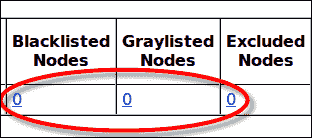
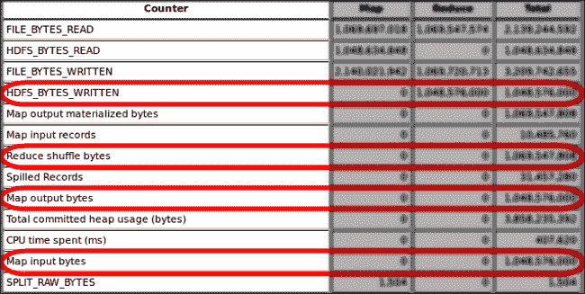
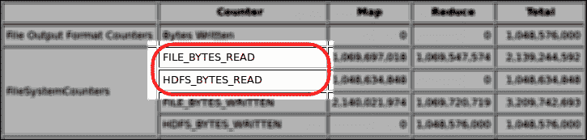
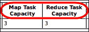
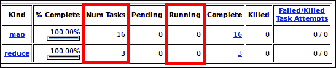
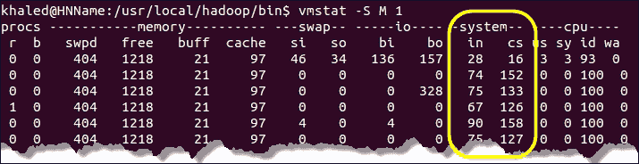
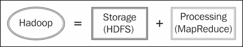

# 四、识别资源弱点

每个 Hadoop 集群由不同的机器和不同的硬件组成。 这意味着每个 Hadoop 安装都应该针对其独特的集群设置进行优化。 为了确保 Hadoop 高效地执行作业，您需要检查集群并识别潜在的瓶颈，以便消除它们。

本章介绍了一些识别群集弱点的方案和技术。 然后，我们将介绍一些公式，这些公式将有助于确定 NameNode 和 DataNode 的最佳配置。 之后，您将学习如何正确配置集群，以及如何确定集群的映射器和减少器的数量。

在本章中，您将了解以下内容：

*   根据一些场景检查集群的弱点
*   识别 CPU 争用和不适当数量的映射器和减少器
*   识别大量 I/O 和网络流量
*   要调整群集大小并定义其大小，请执行以下操作
*   要正确配置群集，请执行以下操作

# 识别群集弱点

事实证明，根据集群的硬件和节点数量调整 Hadoop 框架的配置可以提高性能。 为了确保 Hadoop 框架有效地使用您的硬件，并且您已经正确定义了映射器和减少器的数量，您需要检查您的环境，以确定是否存在节点、CPU 或网络弱点。 然后，您可以决定 Hadoop 框架是应该作为一组新的配置运行，还是需要优化。

在接下来的几节中，我们将介绍可能导致您的工作表现不佳的常见情况。 每个场景都有自己的技术来显示如何识别问题。 该场景涵盖集群节点的健康状况、输入数据大小、大量 I/O 和网络流量、并发任务不足、和 CPU 争用(当任何较高优先级的 CPU 绑定任务正在运行时，所有较低优先级的任务都必须等待，并且没有其他 CPU 可以处理其他工作时，就会发生这种情况)。

## 检查 Hadoop 群集节点的运行状况

通常，在多节点 Hadoop 群集中，节点可能会由于硬件故障(如硬盘故障或电源故障)而出现故障。 在这种情况下，Hadoop 无法使用该节点处理作业，并且该节点将被框架标记为**黑名单**、**灰名单**、或**排除**。 这也可能发生在单节点群集中。 在这种情况下，节点关闭，您无法处理任何 MapReduce 作业。 检查 Hadoop 是否正在使用集群中的所有节点是获得集群完全性能的第一步。

要确定您的群集中是否有未使用的节点，您应该检查 JobTracker 页面上显示的群集摘要。 群集摘要必须显示**黑名单节点**、**灰名单节点**和**排除的节点**的每个**0**节点。 以下屏幕截图显示了部分群集摘要，其中显示了列入黑名单、灰名单和排除的节点：

您的群集不应该有任何未使用的节点。

Hadoop 框架会忽略个排除的节点，并且不允许它们连接到群集。 此外，Hadoop 不会调度任何作业处理到列入黑名单的节点，它们不会对集群做出贡献；从集群中删除列入黑名单的节点可能会对作业的性能产生重大影响。

灰色列出的节点是具有间歇性故障(可能成为永久性故障)的节点，并且会由于任务失败而影响作业的性能和执行时间。 您应该通过更换或删除节点故障来快速做出反应。 虽然管理员通过维护`dfs.hosts.exclude`属性(对于 HDFS)和`mapred.hosts.exclude`属性(对于 MapReduce)来控制排除的节点，但是最好使用 Hadoop 集群管理工具(如**Nagios**、**Ganglia**、或**Cacti**)为列入黑名单和灰色名单的节点设置监视。

## 检查输入数据大小

在某些情况下，您可能会运行 MapReduce 作业，这会花费一定的时间来处理数据，如果您重新运行相同的作业，您会发现处理输入数据所需的时间更长。 这不一定是由于 MAP 功能的低效实现或资源瓶颈，而可能是由于在第一次和第二次运行之间增长的输入数据。 例如，如果您在特定日期运行 Web 日志处理作业，而这一天的日志文件比正常日志文件大得多，则可能会发生这种情况，这可能是映射作业运行缓慢的原因。

要确定映射中是否存在不同的输入数据大小(或减小输入大小)，可以将慢速作业的映射输入和输出数据大小与以前作业的基线的输入和输出大小进行比较。 基本上，您需要比较四个计数器：**HDFS_BYTES_WRITED**、**Reduce Shuffle Bytes**、**Map Output Bytes**和**Map Input Bytes**。

下面的屏幕截图显示了您需要关注的 Hadoop 计数器，并将它们的值与您的基准值进行比较：

## 检查海量 I/O 和网络流量

正如在[第 3 章](03.html "Chapter 3. Detecting System Bottlenecks")，*检测系统瓶颈*中所讨论的，磁盘 I/O 或网络带宽上的瓶颈可能会导致作业性能降低，甚至导致 Java 异常(通常是超时异常)。 读取输入数据或写入输出数据时可能会发生大量 I/O。 如果磁盘 I/O 或网络流量的吞吐量不高，计算资源将受到限制，只能等待传入的数据，并将花费时间等待数据进行处理。

读取非常大的输入数据时可能会出现瓶颈，这可能会限制映射器在处理输入数据之前等待(或空闲)。 要识别大量输入数据导致的大量 I/O，您应该关注两个 Hadoop 计数器值：**FILE_BYTES_READ**和**HDFS_BYTES_READ**。 如果您有非常大的输入数据，则这些计数器值应该很大。

下面的屏幕截图显示了您应该关注的 Hadoop 计数器，以便识别由于大量输入数据而产生的大量 I/O：

大量输出数据也可能导致大量 I/O。 当 Reducer 将其输出写入 HDFS 时，通常会出现这种情况，这需要大量的 I/O 写入操作。 要识别任何巨大的瓶颈 I/O 或网络流量，如果看到很大的数字，可以检查**Bytes Write**和**HDFS_Bytes_Writed**Hadoop 计数器值。 如果出现这样的瓶颈，您应该观察到两个计数器的高值。 下面的屏幕截图显示了应特别注意的计数器，以识别由大量输出数据引起的大量 I/O 和网络流量：

您还应该考虑复制因子(通过`dfs.replication`参数配置)。 它确定集群中存储的每个块的默认块复制数量(请参阅[第 2 章](02.html "Chapter 2. An Overview of the Hadoop Parameters")，*Hadoop 参数概述*)。 如果您的复制系数大于 1，则意味着要读/写的数据更多，数据将通过网络复制。 因此，您通常会在 I/O 和网络使用率的计数器中观察到较高的值。

要解决任何海量 I/O 或网络带宽瓶颈，您可以压缩数据或使用组合器。 这些技术将在[第 6 章](06.html "Chapter 6. Optimizing MapReduce Tasks")，*优化 MapReduce 任务*中讨论。

## 检查并发任务是否不足

糟糕的 MapReduce 作业配置可能会使许多资源处于空闲状态。 基本上，并发任务由集群的 Map 和 Reduce 插槽的总容量以及为处理特定作业而定义的 Map 和 Reduce 作业的数量决定。

如果群集或作业的并发任务配置错误，CPU 资源通常会空闲或超载。 最常见的错误配置是使集群中的 CPU 核心处于空闲状态，没有分配给它们任何工作。 这种错误配置还可能导致 I/O 吞吐量和网络带宽未得到充分利用，因为没有来自 CPU 核心的请求。 如果您错误配置了集群或作业容量，您将看到 DataNode 上的 CPU 利用率很低。

要检查未充分利用的配置，应关注 Hadoop**num Tasks**、**Running**、**Map Task Capacity**和**Reduce Task Capacity**计数器，这些计数器有助于检查 CPU 核心是否已满负荷使用。 **Map Task Capacity**和**Reduce Task Capacity**值应至少设置为 CPU 的核数，即 1。

以下屏幕截图显示了 MapReduce 管理页面中的部分群集摘要(**映射任务容量**和**归约任务容量**)：

下面的屏幕截图显示了部分作业详细信息，您可以在其中找到运行 Hadoop 计数器的**Num Tasks**和**。 在本章后面的部分中，您将了解如何正确设置这些值。**

## 检查 CPU 争用

如今，所有操作系统都是多任务系统，并使用多核 CPU。 为了实现多任务处理，并使多个进程共享一个 CPU，操作系统需要在进程之间切换时存储和恢复 CPU 状态(上下文)，以便以后可以从相同的时间点恢复执行。 这就是所谓的**上下文切换**。 操作系统为将由 CPU 执行的每个任务分配优先级。 当所有较低优先级的任务在任何较高优先级的 CPU 绑定任务正在运行时等待，并且没有其他 CPU 可以处理其他任务时，就会发生争用。 因此，当每秒的上下文切换次数很高时，这意味着 CPU 很忙，并且花费了大量时间来存储和恢复进程状态。

因此，过度的上下文切换意味着您可能在主机上运行了太多任务。 配置 MapReduce 时，根据经验，`mapred.tasktracker.map.tasks.maximum`和`mapred.tasktracker.reduce.tasks.maximum`的总和应该在总 CPU 核心数左右，即在正常情况下为 1，或主机上逻辑核心数的 120%到 150%。 由于超线程，CPU 可能一次处理多个作业。

为了显示上下文切换的统计信息，您可以使用`vmstat`Linux 工具，该工具非常有助于显示 CPU 的利用率统计信息(**cs**=上下文切换)。

下面的屏幕截图显示了一台不常用机器上的`vmstat`输出。 列中的**表示每秒中断数。 如果该数字很高(*值*1000*或更高)，则表示机器使用率很高或硬件有问题。**

### 备注

`vmstat`工具是使用`–S M 1`命令启动的。 `–S`参数用于设置单位大小，`M`表示单位大小：1048576，最后一个参数`1`表示更新之间的延迟。

下面的屏幕截图显示了一台使用率很高的机器上的`vmstat`输出。 您可以观察到，与使用率较低的机器相比，每秒的中断次数(列中的**)较高。**

# 调整您的 Hadoop 群集

正如前面所讨论的，Hadoop 的性能取决于多种因素，这些因素基于配置良好的软件层和规模合理的硬件资源，这些资源可以有效地利用其 CPU、内存、硬盘(存储 I/O)和网络带宽。

规划 Hadoop 集群仍然是一项复杂的任务，需要最少的 Hadoop 体系结构知识，这可能超出了本书的范围。 这就是我们在本节中试图通过提供解释和公式来帮助您最好地估计您的需求来更清楚地说明这一点。 我们将介绍一个基本指导原则，它将帮助您在调整群集规模时做出决策，并回答一些*如何规划*有关群集需求的问题，如下所示：

*   如何规划我的存储空间？
*   如何规划我的 CPU？
*   如何规划我的记忆？
*   如何规划网络带宽？

在调整 Hadoop 集群的大小时，您还应该考虑最终用户将在集群上处理的数据量。 这个问题的答案将引导您确定集群中需要多少台机器(节点)才能有效地处理输入数据，并确定每台机器(节点)的磁盘/内存容量。

Hadoop 是主/从架构，需要大量内存和 CPU 限制。 它有两个主要组件：

*   **JobTracker**：这是此体系结构中的关键组件，用于监视群集上运行的作业
*   **TaskTracker**：这将在群集的每个节点上运行个任务

要高效工作，HDFS 必须拥有高吞吐量硬盘驱动器以及支持 HDFS 读写模式(大数据块)的底层文件系统。 此模式每次定义一个大的读取(或写入)，块大小分别为 64MB、128MB 和 256MB。 此外，网络层应该足够快，以处理中间数据传输和阻塞。

HDFS 本身基于主/从体系结构，有两个主要组件：NameNode/辅助 NameNode 和 DataNode 组件。 这些都是关键组件，需要大量内存来存储文件的元数据信息，如属性和文件本地化、目录结构、名称以及处理数据。 NameNode 组件可确保在群集中正确复制数据块。 第二个组件是 DataNode 组件，它管理 HDFS 节点的状态并与其数据块交互。 它需要大量的 I/O 来处理和数据传输。

通常，MapReduce 层有两个主要先决条件：输入数据集必须足够大，足以填充一个数据块，并拆分成较小的独立数据块(例如，一个 10 GB 的文本文件可以拆分成 40,960 个块，每个块大小为 256 MB，并且任何数据块中的每行文本都可以单独处理)。 第二个先决条件是它应该考虑**数据局部性**，这意味着 MapReduce 代码被移动到数据所在的位置，而不是相反(移动几兆字节的代码以接近要处理的数据比通过网络或磁盘移动许多数据块更有效)。 这涉及到拥有一个分布式存储系统，该系统公开数据局部性并允许在任何存储节点上执行代码。

关于网络带宽，它在两种情况下使用：在复制过程中和在文件写入之后，以及在节点发生故障时的复制因子平衡期间。

调整 Hadoop 群集的最常见做法是根据所需的存储量调整群集。 输入系统的数据越多，需要的机器就越多。 每次向群集中添加新节点时，除了新的存储容量外，还会获得更多的计算资源。

让我们考虑一个基于存储的示例集群增长计划，并了解如何确定所需的存储、内存量和集群中的 DataNode 数量。

<colgroup><col style="text-align: left"> <col style="text-align: left"> <col style="text-align: left"></colgroup> 
| **每日数据输入** | 100 GB | *每日数据输入占用的存储空间=每日数据输入*复制系数=300 GB* |
| **HDFS 复制系数** | 3. |
| **月度增长** | 5% | *月量=(300*30)+5%=9450 GB**一年后=9450*(1+0.05)^12=16971 GB* |
| **中间 MapReduce 数据** | 25% | *专用空间=硬盘大小*(1-每个磁盘的非 HDFS 保留空间/100+中间 MapReduce 数据/100)**=4*(1-(0.25+0.30))=1.8 TB(节点容量)* |
| **每个磁盘的非 HDFS 保留空间** | 百分之三十 |
| **硬盘大小** | 4 TB |
| **需要处理的 DataNode 数量：***整月数据=9.450/1800~=6 个节点**12 个月数据=16.971/1800~=10 个节点**全年数据=157.938/1800~=88 节点* |

### 提示

请勿在 DataNode 上使用 RAID 阵列磁盘。 HDFS 提供自己的复制机制。 还需要注意的是，对于每个磁盘，其容量的 30%应该保留给非 HDFS 使用。

很容易确定 NameNode 和辅助 NameNode 所需的内存。 NameNode 管理内存中的 HDFS 集群元数据所需的内存必须与操作系统所需的内存相加。 通常，辅助 NameNode 所需的内存应该与 NameNode 相同。 然后，您可以应用以下公式来确定内存量：

<colgroup><col style="text-align: left"> <col style="text-align: left"> <col style="text-align: left"></colgroup> 
| **NameNode 内存** | 2 GB-4 GB | *内存量=HDFS 集群管理内存+NameNode 内存+操作系统内存* |
| **辅助 NameNode 内存** | 2 GB-4 GB |
| **操作系统内存** | 4 GB-8 GB |
| **HDFS 内存** | 2 GB-8 GB |
| *至少 NameNode(二级 NameNode)内存=2+2+4=8 GB* |

确定 DataNode 内存量也很容易。 但是，这一次，内存量取决于安装在每个 DataNode 上的个物理 CPU 的核心编号。

<colgroup><col style="text-align: left"> <col style="text-align: left"> <col style="text-align: left"></colgroup> 
| **数据节点进程内存** | 4 GB-8 GB | *内存量=每个 CPU 核的内存量*CPU 核数+DataNode 进程内存+DataNode TaskTracker 内存+OS 内存* |
| **DataNode TaskTracker 内存** | 4 GB-8 GB |
| **操作系统内存** | 4 GB-8 GB |
| **CPU 核心号** | 4+4+ |
| **每个 CPU 核心的内存** | 4 GB-8 GB |   |
| *至少数据节点内存=4*4+4+4+4=28 GB* |

关于如何确定 CPU 和网络带宽，我们建议使用现在使用的多核 CPU，每个 CPU 至少有四个物理核心。 物理 CPU 内核越多，就越能提高作业的性能(根据讨论的所有规则，以避免未充分利用或过度利用)。 对于网络交换机，我们建议使用具有高吞吐量(例如 10 Gb)的以太网机架和 N x 10 Gb 以太网机架。

# 正确配置您的群集

要运行 Hadoop 并获得最高性能，需要对其进行正确配置。 但问题是如何做到这一点。 那么根据我们的经验呢，我们可以说这个问题没有一个单一的答案。 这些经验清楚地告诉我们，Hadoop 框架应该适用于它运行的集群，有时还应该适用于作业。

为了正确配置您的集群，我们建议您第一次使用默认配置运行 Hadoop 作业以获得基准(请参阅[第 3 章](03.html "Chapter 3. Detecting System Bottlenecks")，*检测系统瓶颈*)。 然后，您将通过分析作业历史日志文件来检查资源的弱点(如果存在)，并报告结果(运行作业所花费的测量时间)。 之后，您将反复调优 Hadoop 配置并重新运行该作业，直到获得满足业务需求的配置。

作业应该使用的映射器和减速器任务的数量很重要。 为作业选择合适的任务量可能会对 Hadoop 的性能产生巨大影响。

减少器任务数应小于映射器任务数。 谷歌报告说，一个减速器对应 20 个映射员；其他减速器给出了不同的指导方针。 这是因为映射器任务通常会处理大量数据，而这些任务的结果会传递给 Reducer 任务。 通常，Reducer 任务只是一个聚合函数，与映射器任务相比，它只处理一小部分数据。 此外，还必须考虑减速器的正确数量。

映射器和减少器的数量与 DataNode 上的物理核心数相关，这决定了可以在 DataNode 上并行运行的最大作业数。

在 Hadoop 集群中，**主节点**节点通常由机器组成，其中一台机器被设计为 NameNode，另一台机器被设计为 JobTracker，而集群中的所有其他机器都是充当 DataNode 和 TaskTracker 的从节点。 启动集群时，您开始启动主节点上的 HDFS 守护进程和所有数据节点计算机上的 DataNode 守护进程。 然后，在主节点上启动 MapReduce 守护进程：JobTracker，在所有从节点上启动 TaskTracker 守护进程。 下图显示了 Hadoop 守护进程的伪公式：

在配置集群时，您需要考虑需要分配给这些守护进程的 CPU 核心和内存资源。 在大数据环境中，建议在每个 DataNode 上为 HDFS 和 MapReduce 守护进程预留 2 个 CPU 核心。 在中小型数据环境中，您只能在每个 DataNode 上保留一个 CPU 核心。

一旦确定了最大映射器的插槽编号，就需要确定减速机的最大插槽编号。 根据我们的经验，DataNode 上的 Map 和 Reduce 任务之间有一种分布，可以提供良好的性能结果，将 Reducer 的插槽编号定义为与映射器的插槽编号相同或至少等于三分之二的映射器插槽。

让我们学习如何正确配置映射器和缩减器的数量，并假设以下集群示例：

<colgroup><col style="text-align: left"> <col style="text-align: left"> <col style="text-align: left"> <col style="text-align: left"></colgroup> 
| 

集群机

 | 

犯规投球 / 同 no-ball

 | 

中等数据大小

 | 

大数据量

 |
| --- | --- | --- | --- |
| DataNode CPU 核心 | 8 个 | 预留 1 个 CPU 核心 | 预留 2 个 CPU 核心 |
| DataNode TaskTracker 后台进程 | 1. | 1. | 1. |
| DataNode HDFS 守护程序 | 1. | 1. | 1. |
| 数据块大小 |   | 128 MB | 256 MB |
| 数据节点 CPU 利用率% |   | 95%至 120% | 95%至 150% |
| 群集节点 |   | 20 个 | 40 岁 |
| 复制因子 |   | 2 个 | 3. |

我们希望至少使用 95%的 CPU 资源，并且由于超线程，一个 CPU 内核可能会同时处理多个作业，因此我们可以将超线程因子范围设置在 120%和 170%之间。

<colgroup><col style="text-align: left"> <col style="text-align: left"></colgroup> 
| 大型数据上下文中一个节点上的最大映射器插槽数 | *=物理核数-保留核数*(0.95->1.5)**TaskTracker 保留核心=1+HDFS*保留核心=1 |
| 假设节点上的 CPU 将使用高达 120%的空间(使用超线程)：*最大映射器插槽数=(8-2)*1.2=7.2 向下舍入为 7* |
| 让我们应用 2/3 映射器/减少器技术：*减速器槽的最大数量=7*2/3=5* |
| 让我们定义群集的插槽数量：*映射器插槽：=7*40=280**减速器槽：=5*40=200* |

块大小(在[第 2 章](02.html "Chapter 2. An Overview of the Hadoop Parameters")，Hadoop 参数*概述*中讨论)也用于增强性能。 默认的 Hadoop 配置使用 64MB 的块，而我们建议在您的配置中对中等数据上下文使用 128MB，对非常大的数据上下文使用 256MB。 这意味着映射器任务只能通过打开一个块来处理一个数据块(例如，128MB)。 在默认 Hadoop 配置(默认设置为`2`)中，需要两个映射器任务来处理相同数量的数据。 这可能会被认为是一个缺点，因为初始化一个以上的映射器任务和打开一个以上的文件需要更多的时间。

# 摘要

在本章中，我们介绍了一些场景和技术，它们可以帮助您识别集群的弱点。 您了解了如何检查 Hadoop 集群节点的运行状况以及如何识别大量 I/O 流量。 此外，我们还讨论了如何使用`vmstat`Linux 工具识别 CPU 争用。

然后，我们了解了一些公式，您需要使用这些公式来正确调整 Hadoop 集群的大小。 此外，在上一节中，您了解了如何使用新的专用公式正确配置映射器和减少器的数量。

在下一章中，您将了解更多关于分析映射和归约任务的信息，并将更深入地研究 Hadoop 映射和归约任务。