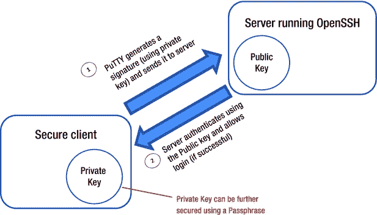
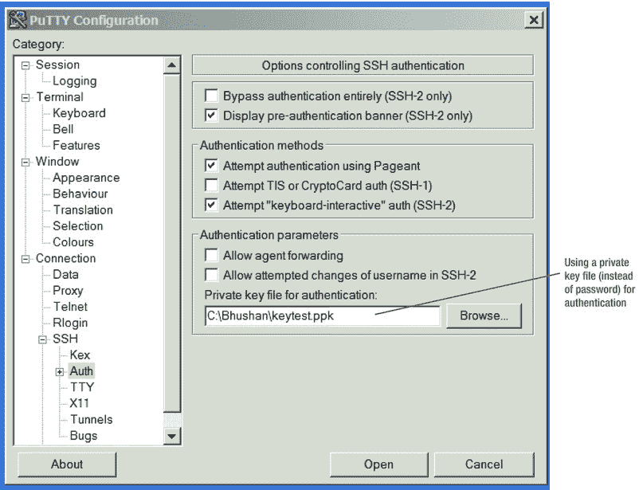

# 四、Hadoop 中的开源认证

在前面的章节中，您了解了什么是安全系统，以及与业界认为的安全系统 Microsoft SQL Server(关系数据库系统)相比，Hadoop 安全性缺失了什么。本章将着重于实现安全系统的一些特性，以保护您的 Hadoop 集群免受所有大灰狼的攻击。微调安全性与其说是科学，不如说是艺术。对于一个环境来说，没有什么规则是“刚刚好”的，但是你可以依靠一些基本的约定来帮助你更接近——如果不是“刚刚好”的话例如，由于 Hadoop 是一个分布式系统，主要通过 Windows PC 上的客户端软件进行访问，因此从保护客户端开始是有意义的。接下来，您可以考虑通过添加强身份认证来保护 Hadoop 集群，等等。

然而，在你衡量成功之前，你需要一个标准。在这种情况下，您需要一个理想的 Hadoop 安全设置的愿景。您将在下一节中找到详细信息。

安全拼图的碎片

[图 4-1](#Fig1) 显示了一个 Hadoop 广泛安全设置的例子。它始于一个安全的客户端。SSH 协议使用密钥对保护客户端；服务器使用公钥，客户端使用私钥。这是为了对抗*欺骗*(拦截并重定向到攻击者系统的连接)以及黑客攻击或泄露的密码。在接下来的“建立安全的客户端访问”一节中，您将更深入地研究安全客户端设置的细节。在 Hadoop 系统允许访问之前，它使用 Kerberos(一种用于认证的开源应用程序)对客户端进行认证。在“构建安全的用户认证”一节中，您将了解如何设置 Kerberos 并使其与 Hadoop 一起工作。

一旦用户被连接，重点是根据用户的角色限制权限。图 4-1 中的[用户可以访问除敏感的薪资数据之外的所有用户数据。通过将数据分成多个文件并为它们分配适当的权限，可以很容易地实现这一点。](#Fig1)[第 5 章](05.html)关注这些授权问题及更多。


[图 4-1](#_Fig1) 。理想的 Hadoop 安全性，具备所有必需的组件

您还将观察到各种 Hadoop 进程之间(例如 NameNode 和 DataNodes 之间)的进程间通信是安全的，这对于分布式计算环境是至关重要的。这样的环境涉及各种主机之间的大量通信，并且不安全的数据容易受到各种类型的恶意攻击。本章的最后一节探讨了如何保护或加密 Hadoop 中的进程间流量。

这些是 Hadoop 安全难题的主要部分。缺少的一部分是静态数据的加密，但是您将在第 8 章中了解更多。

建立安全的客户端访问

对 Hadoop 集群的访问从您使用的客户端开始，因此从保护客户端开始。不安全的数据容易受到恶意攻击，这可能导致数据被破坏或窃取用于非法用途。对于数据块分布在大量节点上的分布式系统(如 Hadoop ),这种危险更大。客户端就像是实际数据的网关。在你考虑保护房子之前，你需要保护大门。

OpenSSH 或 SSH 协议通常用于通过使用登录/密码或访问密钥来保护客户端。密钥是更好的选择，因为密码可能被泄露、破解或伪造。对于基于 Windows 和基于 Linux 的客户端来说，PuTTY ( `www.chiark.greenend.org.uk/~sgtatham/putty`)都是支持 SSH 协议的优秀开源客户端。除了免费之外，PuTTY 的一个主要优势是它允许使用密钥和密码短语而不是密码进行访问的能力。PuTTY 有一个不太明显但同样重要的额外好处，那就是帮助对抗欺骗，这值得你关注。

用 PuTTY 的主机密钥对抗欺骗

正如您所记得的，欺骗是一种用于提取您的个人信息(如密码)以备滥用的技术，通过将您的连接重定向到攻击者的计算机(而不是您认为您所连接的计算机)，从而将您的密码发送到攻击者的计算机。利用这种技术，攻击者可以访问您的密码、登录并使用您的帐户来达到他们自己的恶意目的。

为了对抗欺骗，一个独特的代码(称为*主机密钥* ) 被分配给每个服务器。创建这些密钥的方式是，一个服务器不可能伪造另一个服务器的密钥。因此，如果您连接到一个服务器，它向您发送了一个不同的主机密钥(与您预期的不同)，SSH(或者像 PuTTY 这样使用 SSH 的安全客户端)可以警告您您连接到了一个不同的服务器，这可能意味着正在进行欺骗攻击！

PuTTY 通过 Windows 注册表中的条目存储主机密钥(对于您成功连接的服务器)。然后，下次连接到以前连接过的服务器时，PuTTY 会将服务器提供的主机密钥与上次存储在注册表中的密钥进行比较。如果不匹配，您将看到一个警告，然后有机会在您提供密码或任何其他私人信息之前放弃您的连接。

然而，当您第一次连接到服务器时，PuTTY 无法检查主机密钥是否正确。因此它会发出一个警告，询问您是否想要信任这个主机密钥:

```scala
The server's host key is not cached in the registry. You
have no guarantee that the server is the computer you
think it is.
The server's rsa2 key fingerprint is:
ssh-rsa 1024 5c:d4:6f:b7:f8:e9:57:32:3d:a3:3f:cf:6b:47:2c:2a
If you trust this host, hit Yes to add the key to
PuTTY's cache and carry on connecting.
If you want to carry on connecting just once, without
adding the key to the cache, hit No.
If you do not trust this host, hit Cancel to abandon the
connection.

```

如果您不知道该主机，或者您对该主机是否是您想要连接的主机有任何疑问，您可以取消连接，以避免成为欺骗的受害者。

使用 PuTTY 的基于密钥的认证

假设一个超级黑客进入了您的网络，并获得了从您的客户端到您希望连接的服务器的通信。假设这个黑客捕获了真实主机发送给你的客户端的主机认证字符串，并把它作为自己的字符串返回，让你连接到他的服务器，而不是真实的服务器。现在，他可以很容易地获得您的密码，并使用该密码访问敏感数据。

你如何能阻止这样的攻击？答案是用 *基于密钥的认证*代替密码。没有公钥，黑客就无法访问！

实现认证密钥的一种方法是使用 SSH，SSH 是一种用于通过公共通道或公共的不安全网络进行安全通信的协议。通信的安全性依赖于用于数据加密和解密的密钥对。SSH 可以以多种方式使用(或实现)。您可以自动生成公钥/私钥对来加密网络连接，然后使用密码验证来登录。使用 SSH 的另一种方法是手动生成一个公钥/私钥对来执行认证，这将允许用户或程序在不指定密码的情况下登录。

对于基于 Windows 的客户端，可以使用 PuTTYgen 生成密钥对，PuTTYgen 是开源的，可以免费获得。密钥对由复制到服务器的公钥和位于安全客户端的私钥组成。

私钥可以用来生成新的签名。没有私钥的任何人都无法伪造用私钥生成的签名。然而，拥有相应公钥的人可以检查特定签名是否真实。

当使用密钥对进行认证时，PuTTY 可以使用您的私钥(使用密钥文件指定)生成签名。服务器可以检查签名是否真实(使用您的公钥)，并允许您登录。如果您的客户端被欺骗，攻击者截获的只是一个无法重用的签名，但您的私钥或密码不会被泄露。[图 4-2](#Fig2) 说明了认证过程。



[图 4-2](#_Fig2) 。使用 PuTTY 的基于密钥的认证

要使用 PuTTY 设置基于密钥的认证，您必须首先选择所需的密钥类型。例如，我将使用 RSA 并设置一个可以用于 Hadoop 集群的密钥对。要设置密钥对，打开 PuTTY 密钥生成器(`PuTTYgen.exe`)。在窗口底部，在生成密钥之前选择参数。例如，要生成用于 SSH-2 协议的 RSA 密钥，选择**密钥类型下的 **SSH-2 RSA** 以生成**。生成的密钥中的**位数的值决定了密钥的大小或强度。对于这个例子，1024 就足够了，但是在现实世界中，为了更好的安全性，您可能需要一个更长的密钥，比如 2048。需要记住的重要一点是，密钥越长越安全，但是加密/解密处理时间会随着密钥长度的增加而增加。输入一个密钥密码(为了保护您的私钥而加密)并记下它，因为您稍后需要使用它来解密。**

 **注意**可用于 PuTTY 的最常见的公钥算法是 RSA 和 DSA。PuTTY 开发者*强烈*推荐你使用 RSADSA(也称为 DSS，美国的联邦数字签名标准)有一个固有的弱点，即可以轻松创建包含足够信息的签名，从而泄露*私有*密钥。(为了更好的理解为什么 RSA 几乎不可能被破解，参见[第八章](img/08.html)。)

接下来，点击**生成**按钮。作为回应，PuTTYgen 让你四处移动鼠标来产生随机性(那是 PuTTYgen 开发者在跟我们开玩笑！).在“关键点”窗口的空白区域上绕圈移动鼠标；进度条会随着 PuTTYgen 收集到足够的随机性并生成密钥而逐渐填满，如图[图 4-3](#Fig3) 所示。


[图 4-3](#_Fig3) 。生成用于实现安全客户端的密钥对

生成密钥后，点击**保存公钥**和**保存私钥**按钮保存密钥。

接下来，您需要将公钥复制到位于您试图连接的服务器上的`home`目录下的`.ssh`目录中的文件`authorized_keys`。为此，请参见[图 4-3](#Fig3) 中**公钥粘贴到打开的 SSH authorized_keys 文件**部分。将光标移动到该部分并复制所有文本(如图所示)。然后，打开一个 PuTTY 会话，使用您的登录名和密码进行连接。转到目录`.ssh`，用你选择的编辑器打开`authorized_keys`文件。将使用 PuTTYgen 创建的公钥文本粘贴到文件中，并保存文件([图 4-4](#Fig4) )。


[图 4-4](#_Fig4) 。在`authorized_keys`文件中粘贴公钥

使用密码短语

如果有人进入了你的电脑会怎么样？他们可以像您一样生成签名。然后，他们可以使用您的凭据轻松连接到您的 Hadoop 集群！这当然可以通过使用您选择的的*密码*在存储到您的本地机器之前加密您的私钥来轻松避免。然后，为了生成签名，PuTTY 将需要解密密钥，这将需要您的密码，从而防止任何未经授权的访问。

现在，无论何时登录都需要输入密码短语，这很不方便。因此，Putty 提供了 Pageant，这是一个*认证代理*，它存储解密的私钥，并根据请求使用它们来生成签名。你所需要做的就是开始 Pageant 并输入你的私钥和密码。然后，您可以任意次数调用 PuTTY Pageant 会自动生成签名。这种安排将一直有效，直到您重新启动 Windows 客户端。Pageant 的另一个很好的特性是，当它关闭时，它永远不会将您解密的私钥存储在您的本地磁盘上。

因此，作为最后一步，配置您的 PuTTY 客户端使用私钥文件而不是密码进行认证([图 4-5](#Fig5) )。点击选项 **SSH** 旁边的 **+** 打开下钻，然后点击该选项下的选项 **Auth** (授权)。浏览并选择您之前保存的私钥文件(通过 PuTTYgen 生成)。点击**打开**打开新的会话。



[图 4-5](#_Fig5) 。使用 PuTTY 进行私钥认证的配置选项

现在你已经准备好通过服务器使用登录和密码进行认证，如图 4-6 中的[所示。在登录提示符下输入登录名(本例中为`root`),并输入密码进行连接！](#Fig6)


[图 4-6](#_Fig6) 。使用登录名和密码进行安全认证

在某些情况下(例如，预定的批处理)，不可能键入密码短语；在这种情况下，你可以输入一次密码，启动 Pageant 并加载你的私钥。请参考[附录 A](09.html) 中关于 Pageant 使用和实现的示例，以及[附录 B](10.html) 中关于基于 Linux 的客户端的 PuTTY 实现。

构建安全的用户认证

安全的客户端连接至关重要，但这只是一个好的起点。当这个安全客户端连接到您的 Hadoop 集群时，您需要保护它。用户安全过程从认证用户开始。虽然 Hadoop 本身没有认证用户的方法，但是目前所有主要的 Hadoop 发行版都可以安装 Kerberos，并且 Kerberos 提供了认证。

对于早期版本的 Hadoop，当用户试图访问 Hadoop 集群时，Hadoop 只需检查 ACL 以确保底层操作系统用户被允许访问，然后提供这种访问。这不是一个非常安全的选项，也没有限制用户的访问(因为用户可以很容易地模拟 Hadoop 超级用户)。然后，用户可以访问 Hadoop 集群中的所有数据，并可以根据需要修改或删除这些数据。因此，您需要配置 Kerberos 或另一个类似的应用程序，在允许访问数据之前对用户进行认证——当然，还要限制访问！

Kerberos 是 Hadoop 用于认证的最流行的选项之一。Kerberos 是由麻省理工学院开发的，自 20 世纪 80 年代以来一直存在，并经过多次增强。目前的版本 Kerberos 是在 1993 年设计的，可以作为开源下载免费获得。Kerberos 最常用于保护 Hadoop 集群和提供安全的用户认证。在本节中，您将了解 Kerberos 是如何工作的，它的主要组件是什么，以及如何安装它。安装之后，我将讨论 Hadoop 的一个简单的 Kerberos 实现。

Kerberos 概述

Kerberos 是一种用于“不可信网络上的可信主机”的认证协议这仅仅意味着 Kerberos 假设它与之通信的所有主机都是可信的，并且不涉及欺骗或者它使用的密钥没有被泄露。为了更有效地使用 Keberos，请考虑其他几个关键事实:

*   Kerberos 一直依赖于中央服务器。如果中央服务器不可用，任何人都无法登录。可以使用多个“中央”服务器(以降低风险)或额外的认证机制(作为后备)。
*   Kerberos 非常依赖于时间，因此所有受控主机的时钟必须在配置的限制范围内保持同步(默认为 5 分钟)。大多数情况下，网络时间协议守护程序有助于保持受控主机的时钟同步。
*   Kerberos 提供了单点登录方法。客户只需要在每次会话中提供一次密码，然后就可以透明地访问所有授权服务。
*   密码不应保存在客户端或任何中间应用服务器上。Kerberos 将它们集中存储，没有任何冗余。

[图 4-7](#Fig7) 提供了 Kerberos 认证架构的概述。如图所示，认证服务器和票据授予服务器是 Kerberos 密钥分发中心的主要组件。


[图 4-7](#_Fig7) 。Kerberos 密钥分发中心及其主要组件(TGT =票证授予票证)

客户端使用 Kerberos 客户端库请求访问启用 Kerberos 的服务。Kerberos 客户端联系 Kerberos 分发中心或 KDC(托管凭证数据库的中央 Kerberos 服务器)并请求访问。如果提供的凭据有效，KDC 将提供请求的访问权限。KDC 使用一个内部数据库来存储凭证，以及两个主要组件:认证服务器(AS)和票据授予服务器(TGS)。

证明

Kerberos 认证过程包含三个主要步骤:

1.  AS 向用户(和主机)授予票据授予票据(TGT)作为认证令牌。TGT 仅在特定时间内有效(有效性由管理员通过配置文件进行配置)。在服务原则(用于运行服务或后台进程的登录)请求 TGT 的情况下，凭证通过名为 *keytabs* 的特殊文件提供给 AS。
2.  客户端使用凭证解密 TGT，然后使用 TGT 从票证授予服务器获取服务票证，以访问“Kerberos 化”的服务。一个客户端可以对多个 TGS 请求使用同一个 TGT(直到 TGT 过期)。
3.  用户(和主机)使用服务票来验证和访问特定的支持 Kerberos 的服务。

重要术语

要完全理解 Kerberos，您需要使用它的领域、主体、票据和数据库语言。举一个 Kerberos 实现的例子，您正在名为`pract_hdp_sec`的单个节点集群上实现 Kerberos，并且您正在使用名为`EXAMPLE.COM`的虚拟域或领域。

术语*域*表示用于认证的管理域(类似于 Windows 域)。其目的是建立虚拟边界，供 AS 用来对用户、主机或服务进行认证。这并不意味着用户和服务之间的认证强制他们在同一个领域中！如果两个对象属于不同的领域，但它们之间有信任关系，那么认证仍然可以进行(称为*交叉认证* )。对于我们的实现，我创建了一个名为`EXAMPLE.COM`的领域(注意，按照惯例，一个领域通常使用大写字母)。

*主体*是与领域相关联的用户、主机或服务，并作为条目存储在通常位于 KDC 的 as 数据库中。Kerberos 5 中的主体使用以下格式定义:`Name[/Instance]@REALM` *。*用户常用的用法是*用户名* `@` *领域*或*用户名* `/` *角色* `@` *领域*(例如`alex/admin@REALM`和`alex@REALM`可能是两个不同的主体)。对于服务主体，常见的格式是*服务* `/` *主机名* `@` *领域*(例如`hdfs/host1.myco.com`)。注意，Hadoop 期望它的服务主体有一个特定的格式。对于我们的实现，我定义了一些原则，比如`hdfs/pract_hdp_sec@EXAMPLE.COM`(NameNode 和 DataNode 的`hdfs`)，`mapred/pract_hdp_sec@EXAMPLE.COM`(JobTracker 和 TaskTracker 的`mapred`)等等。

*票*是客户端请求认证时由 AS 生成的令牌。票证中的信息包括:请求用户的主体(通常是用户名)、服务的主体、客户端的 IP 地址、有效日期和时间(以时间戳格式)、票证的最大生命周期和会话密钥(这具有基本的作用)。每个票证通常在 24 小时后过期，尽管这对于给定的 Kerberos 安装是可配置的。

此外，票据可以由用户请求更新，直到从发行开始的可配置的时间段(例如，从发行开始的 7 天)。如果系统管理员已经将登录客户端(例如 SSH)配置为在登录时自动获得票据，则用户可以明确地使用 Kerberos 客户端来获得票据，或者被自动提供一个票据。服务通常使用 keytab 文件(包含服务密码的受保护文件)来运行后台线程，这些线程根据需要获取和更新服务的 TGT。所有 Hadoop 服务都需要一个 keytab 文件放在各自的主机上，这个文件的位置在服务站点 XML 中定义。

Kerberos 使用一个加密的*数据库* 来存储所有与用户和服务相关的主体条目。每个条目包含以下信息:主体名称、加密密钥、与主体相关联的票证的最大有效期、与主体相关联的票证的最大续订时间、密码到期日期以及主体的到期日期(在此之后将不会颁发任何票证)。

还有更多与 Kerberos 架构相关的细节，但是因为本章主要关注为 Hadoop 安装和配置 Kerberos，所以对 Kerberos 架构的基本理解将满足我们的目的。所以让我们从 Kerberos 安装开始。

安装和配置 Kerberos

安装 Kerberos 的第一步是为您的新 KDC 安装所有 Kerberos 服务。对于 Red Hat Enterprise Linux (RHEL)或 CentOS 操作系统，使用以下命令:

```scala
yum install krb5-server krb5-libs krb5-auth-dialog krb5-workstation

```

安装服务器后，您必须编辑两个主要配置文件，缺省情况下，它们位于以下目录中(如果没有，请使用 Linux 实用程序“find”找到它们):

*   `/etc/krb5.conf`
*   `/var/kerberos/krb5kdc/kdc.conf`

下一步是指定您的领域(例如`EXAMPLE.COM`)，并将 KDC 值更改为完全合格的 Kerberos 服务器主机的名称(这里是`pract_hdp_sec`)。您还必须将`/etc/krb5.conf`的更新版本复制到集群中的每个节点。下面是我们的例子中的`/etc/krb5.conf`:

```scala
[logging]
 default = FILE:/var/log/krb5libs.log
 kdc = FILE:/var/log/krb5kdc.log
 admin_server = FILE:/var/log/kadmind.log

[libdefaults]
 default_realm = EXAMPLE.COM
 dns_lookup_realm = false
 dns_lookup_kdc = false
 ticket_lifetime = 24h
 renew_lifetime = 7d
 forwardable = true

[kdc]
profile = /var/kerberos/krb5kdc/kdc.conf

[realms]
 EXAMPLE.COM = {
  kdc = pract_hdp_sec
  admin_server = pract_hdp_sec
 }

[domain_realm]
 .example.com = EXAMPLE.COM
  example.com = EXAMPLE.COM

```

请注意领域名称和 KDC 名称的更改值。示例票证在创建后的 24 小时内有效，因此`ticket_lifetime`被设置为`24h`。7 天后这些票可以续签，因为`renew_lifetime`被设置为`7d`。以下是我正在使用的`/var/kerberos/krb5kdc/kdc.conf`:

```scala
[kdcdefaults]
 kdc_ports = 88
 kdc_tcp_ports = 88

[realms]
 EXAMPLE.COM = {
  profile = /etc/krb5.conf
  supported_enctypes = aes128-cts:normal des3-hmac-sha1:normal
arcfour-hmac:normal des-hmac-sha1:normal des-cbc-md5:normal des-cbc-crc:normal
allow-null-ticket-addresses = true
database_name = /var/Kerberos/krb5kdc/principal
#master_key_type = aes256-cts
  acl_file = /var/kerberos/krb5kdc/kadm5.acl
  admin_keytab = /var/kerberos/krb5kdc/kadm5.keytab
  dict_file = /usr/share/dict/words
  max_life = 2d 0h 0m 0s
  max_renewable_life = 7d 0h 0m 0s
  admin_database_lockfile = /var/kerberos/krb5kdc/kadm5_adb.lock
  key_stash_file = /var/kerberos/krb5kdc/.k5stash
  kdc_ports = 88
  kadmind_port = 749
  default_principle_flags = +renewable
}

```

在领域`EXAMPLE.COM`的设置中，`acl_file`参数指定 ACL(RHEL 或 CentOS 中的文件`/var/kerberos/krb5kdc/kadm5.acl`),用于定义对 Kerberos 数据库具有管理(修改)访问权限的主体。该文件可以简单到只有一个条目:

```scala
*/admin@EXAMPLE.COM *

```

这个条目指定所有具有`/admin` *实例扩展*的主体对数据库具有完全访问权限。Kerberos 服务`kadmin`需要重新启动才能使更改生效。

此外，请注意`max_life`(最长票证寿命)设置对于领域`EXAMPLE.COM`是`2d` (2 天)。您可以覆盖特定领域的配置设置。您也可以为主体指定这些值。

注意，在前面代码的`[realms]`部分，我已经禁用了 256 位加密。如果要使用 256 位加密，必须下载 Java Cryptography Extension(JCE)，并按照说明将其安装在任何运行使用 Kerberos 的 Java 进程的节点上(对于 Hadoop，所有集群节点)。如果您想跳过这一步，只使用 128 位加密，在生成您的 KDC 主密钥之前，删除行`#master_key_type = aes256-cts`并删除对`aes-256`的引用，如“创建数据库”一节所述

这包括安装和设置 Kerberos。请注意，不可能涵盖所有可能的选项(操作系统、版本等。)和 Kerberos 安装的细微差别。关于 Kerberos 安装的更多讨论，请参考麻省理工学院的 Kerberos 安装指南。奥莱利的 *Kerberos:权威指南*也是一个很好的参考。

回到 Kerberos 实现，让我创建一个数据库并设置主体(用于 Hadoop)。

为 Kerberos 实现做准备

Kerberos 使用内部数据库(存储为文件)来保存为使用而设置的主体的详细信息。该数据库包含用户(主体)及其私钥。主体包括 Kerberos 使用的内部用户以及您定义的用户。数据库文件存储在配置文件`kdc.conf`文件中定义的位置；对于这个例子，`/var/kerberos/krb5kdc/principal.`

创建数据库

要设置数据库，请使用实用程序 kdb5_util:

```scala
kdb5_util create -r EXAMPLE.COM –s

```

您将会看到类似这样的响应:

```scala
Loading random data
Initializing database '/var/kerberos/krb5kdc/principal' for realm 'EXAMPLE.COM',
master key name 'K/M@EXAMPLE.COM'
You will be prompted for the database Master Password.
It is important that you NOT FORGET this password.
Enter KDC database master key:
Re-enter KDC database master key to verify:

```

请记下万能钥匙。另外，请注意`-s`选项允许您将数据库的主服务器密钥保存在*隐藏*文件中(使用`kdc.conf`中的参数`key_stash_file`定义)。如果 stash 文件不存在，您需要在每次启动时使用主密码(在安装过程中指定)登录 KDC。这将自动重新生成主服务器密钥。

既然已经创建了数据库，那么就创建第一个用户主体。这必须在 KDC 服务器上完成，同时您以`root`身份登录:

```scala
/usr/sbin/kadmin.local -q "addprinc root/admin"

```

系统将提示您输入密码。请记下委托人`root/admin@EXAMPLE.COM`的密码。您可以稍后创建其他主体；现在，是时候开始 Kerberos 了。要为 RHEL 或 CentOS 操作系统执行此操作，请发出以下命令来启动 Kerberos 服务(对于其他操作系统，请参考相应的命令参考):

```scala
/sbin/service kadmin start
/sbin/service krb5kdc start

```

创建服务主体

接下来，我将使用 kadmin 实用程序创建用于 Hadoop 的服务主体。主要名称`hdfs`将用于 HDFS；`mapred`将用于 MapReduce，`HTTP`用于 HTTP，`yarn`用于 YARN 相关的服务(在这段代码中，`kadmin:`是提示；命令以粗体显示):

```scala
[root@pract_hdp_sec]# kadmin
Authenticating as principal root/admin@EXAMPLE.COM with password.
Password for root/admin@EXAMPLE.COM:
kadmin:  addprinc -randkey hdfs/pract_hdp_sec@EXAMPLE.COM
Principal "hdfs/pract_hdp_sec@EXAMPLE.COM" created.
kadmin:  addprinc -randkey mapred/pract_hdp_sec@EXAMPLE.COM
Principal "mapred/pract_hdp_sec@EXAMPLE.COM" created.
kadmin:  addprinc -randkey HTTP/pract_hdp_sec@EXAMPLE.COM
Principal "HTTP/pract_hdp_sec@EXAMPLE.COM" created.
kadmin:  addprinc -randkey yarn/pract_hdp_sec@EXAMPLE.COM
Principal "yarn/pract_hdp_sec@EXAMPLE.COM" created.
kadmin:

```

创建 Keytab 文件

Keytab 文件用于以非交互方式验证服务。因为您可以安排服务远程运行或在特定时间运行，所以您需要将认证信息保存在一个文件中，以便可以与 Kerberos 内部数据库进行比较。Keytab 文件用于此目的。

回到文件创建，提取相关的 keytab 文件(使用 kadmin)并将其放在各个组件的 keytab 目录(`/etc/security/keytabs`)中(`kadmin:`)是提示；命令以粗体显示):

```scala
[root@pract_hdp_sec]# kadmin
Authenticating as principal root/admin@EXAMPLE.COM with password.
Password for root/admin@EXAMPLE.COM:
kadmin: xst -k mapred.keytab hdfs/pract_hdp_sec@EXAMPLE.COM HTTP/pract_hdp_sec@EXAMPLE.COM
Entry for principal hdfs/pract_hdp_sec@EXAMPLE.COM with kvno 5, encryption type aes128-cts-hmac-sha1-96 added to keytab WRFILE:mapred.keytab.
Entry for principal hdfs/pract_hdp_sec@EXAMPLE.COM with kvno 5, encryption type des3-cbc-sha1 added to keytab WRFILE:mapred.keytab.
Entry for principal hdfs/pract_hdp_sec@EXAMPLE.COM with kvno 5, encryption type arcfour-hmac added to keytab WRFILE:mapred.keytab.
Entry for principal hdfs/pract_hdp_sec@EXAMPLE.COM with kvno 5, encryption type des-hmac-sha1 added to keytab WRFILE:mapred.keytab.
Entry for principal hdfs/pract_hdp_sec@EXAMPLE.COM with kvno 5, encryption type des-cbc-md5 added to keytab WRFILE:mapred.keytab.
Entry for principal HTTP/pract_hdp_sec@EXAMPLE.COM with kvno 4, encryption type aes128-cts-hmac-sha1-96 added to keytab WRFILE:mapred.keytab.
Entry for principal HTTP/pract_hdp_sec@EXAMPLE.COM with kvno 4, encryption type des3-cbc-sha1 added to keytab WRFILE:mapred.keytab.
Entry for principal HTTP/pract_hdp_sec@EXAMPLE.COM with kvno 4, encryption type arcfour-hmac added to keytab WRFILE:mapred.keytab.
Entry for principal HTTP/pract_hdp_sec@EXAMPLE.COM with kvno 4, encryption type des-hmac-sha1 added to keytab WRFILE:mapred.keytab.
Entry for principal HTTP/pract_hdp_sec@EXAMPLE.COM with kvno 4, encryption type des-cbc-md5 added to keytab WRFILE:mapred.keytab.

```

请注意，所有受支持加密类型的密钥条目(在配置文件`kdc.conf`中定义为参数`supported_enctypes`)都被添加到主体的 keytab 文件中。

回到 keytab 创建，为其他主体创建 keytab 文件(在 kadmin 提示符下),如下所示:

```scala
kadmin:xst -k mapred.keytab hdfs/pract_hdp_sec@EXAMPLE.COM http/pract_hdp_sec@EXAMPLE.COM
kadmin:xst -k yarn.keytab hdfs/pract_hdp_sec@EXAMPLE.COM http/pract_hdp_sec@EXAMPLE.COM

```

您可以使用`klist`命令验证正确的 keytab 文件和主体是否与正确的服务相关联。例如，在 NameNode 上:

```scala
[root@pract_hdp_sec]# klist -kt mapred.keytab
Keytab name: FILE:mapred.keytab
KVNO Timestamp Principal
---- ----------------- --------------------------------------------------------
   5 10/18/14 12:42:21 hdfs/pract_hdp_sec@EXAMPLE.COM
   5 10/18/14 12:42:21 hdfs/pract_hdp_sec@EXAMPLE.COM
   5 10/18/14 12:42:21 hdfs/pract_hdp_sec@EXAMPLE.COM
   5 10/18/14 12:42:21 hdfs/pract_hdp_sec@EXAMPLE.COM
   5 10/18/14 12:42:21 hdfs/pract_hdp_sec@EXAMPLE.COM
   4 10/18/14 12:42:21 HTTP/pract_hdp_sec@EXAMPLE.COM
   4 10/18/14 12:42:21 HTTP/pract_hdp_sec@EXAMPLE.COM
   4 10/18/14 12:42:21 HTTP/pract_hdp_sec@EXAMPLE.COM
   4 10/18/14 12:42:21 HTTP/pract_hdp_sec@EXAMPLE.COM
   4 10/18/14 12:42:21 HTTP/pract_hdp_sec@EXAMPLE.COM

```

到目前为止，您已经为 HDFS、MapReduce 和 YARN 相关的主体定义了主体并提取了 keytab 文件。您将需要遵循相同的过程，并为运行在您的 Hadoop 集群上的任何其他组件服务(如 Hive、HBase、Oozie 等)定义主体。注意，web 通信的主体*必须*命名为`HTTP`，因为使用 Kerberos 的基于 web 的协议实现需要这个命名。

要将 keytab 文件部署到从节点，请将 keytab 文件复制(或移动，如果是新创建的)到`/etc/hadoop/conf`文件夹。您需要保护 keytab 文件(只有所有者可以看到此文件)。因此，您需要将所有者更改为访问 keytab 的服务用户名(例如，如果 HDFS 进程作为用户`hdfs`运行，那么用户`hdfs`应该拥有 keytab 文件)并设置文件权限 400。请记住，`hdfs`、`mapred`和`http`的服务主体有一个与用户名相关联的 FQDN(完全合格域名)。此外，服务主体是特定于主机的，对于每个节点都是唯一的。

```scala
[root@pract_hdp_sec]# sudo mv hdfs.keytab mapred.keytab /etc/hadoop/conf/
[root@pract_hdp_sec]# sudo chown hdfs:hadoop /etc/hadoop/conf/hdfs.keytab
[root@pract_hdp_sec]# sudo chown mapred:hadoop /etc/hadoop/conf/mapred.keytab
[root@pract_hdp_sec]# sudo chmod 400 /etc/hadoop/conf/hdfs.keytab
[root@pract_hdp_sec]# sudo chmod 400 /etc/hadoop/conf/mapred.keytab

```

为 Hadoop 实现 Kerberos

到目前为止，我已经安装并配置了 Kerberos，还创建了数据库、主体和 keytab 文件。那么，对 Hadoop 使用这种认证的下一步是什么呢？我需要将 Kerberos 设置信息添加到相关的 Hadoop 配置文件中，并将之前设置的 Kerberos 主体映射到操作系统用户(因为操作系统用户将用于实际运行 Hadoop 服务)。我还需要假设一个处于非安全模式的 Hadoop 集群已经配置好并且可用。总而言之，为 Kerberos 配置 Hadoop 将分两个阶段完成:

*   将服务主体映射到其操作系统用户名
*   向各种 Hadoop 配置文件添加信息

将服务主体映射到其操作系统用户名

规则用于将服务主体映射到它们各自的操作系统用户名。这些规则在 Hadoop 配置文件`core-site.xml`中被指定为可选键`hadoop.security.auth_to_local`的值。

默认规则简单地命名为`DEFAULT`。它将默认域中的所有主体转换为它们的第一个组件。例如，`hdfs@EXAMPLE.COM`和`hdfs/admin@EXAMPLE.COM`都变成了`hdfs`，假设你的默认域或领域是`EXAMPLE.COM`。因此，如果服务主体和操作系统用户名相同，默认规则就足够了。如果两个名称不相同，您必须创建规则来进行映射。

每个规则分为三个部分:基本、过滤和替换。 *base* 首先指定主体名称(不包括领域)中的组件数量，然后是一个冒号，以及从主体名称的各个部分构建用户名的模式。在模式部分中，`$0`翻译成领域，`$1`翻译成第一个组件，`$2`翻译成第二个组件。例如，`[2:$1]`将`hdfs/admin@EXAMPLE.COM`翻译成`hdfs`。

过滤器由括号中的正则表达式组成，该表达式必须与要应用的规则所生成的字符串相匹配。例如，(`.*@EXAMPLE.COM`)匹配任何以`@EXAMPLE.COM`结尾的字符串。

替换是一个 sed(流行的 Linux 流编辑器)规则，它将正则表达式转换成固定的字符串。例如:`s/@[A-Z]*\.COM//`删除`@`的第一个实例，后面跟一个大写字母名称，后面跟`.COM`。

在我的例子中，我使用操作系统用户`hdfs`来运行 NameNode 和 DataNode 服务。因此，如果我创建了 Kerberos 主体`nn/pract_hdp_sec@EXAMPLE.COM`和`dn/pract_hdp_sec@EXAMPLE.COM`用于 Hadoop，那么我需要将这些主体映射到 os 用户`hdfs`。为此目的的规则是:

```scala
RULE: [2:$1@$0] ([nd]n@.*EXAMPLE.COM) s/.*/hdfs/

```

向各种 Hadoop 配置文件添加信息

要使 Kerberos 能够与 HDFS 一起工作，您需要修改两个配置文件:

*   `core-site.xml`
*   `hdfs-site.xml`

[表 4-1](#Tab1) 显示了`core-site.xml`内属性的修改。请记住将这些更改传播到集群中的所有主机。

[表 4-1](#_Tab1) 。修改 Hadoop 配置文件`core-site.xml` 中的属性

| 

属性名称

 | 

属性值

 | 

描述

 |
| --- | --- | --- |
| `hadoop.security.authentication` | `kerberos` | 设置群集的认证类型。有效值为`simple`(默认值)或`Kerberos`。 |
| `hadoop.security.authorization` | `true` | 为不同的协议启用授权 |
| `hadoop.security.auth_to_local` | `[2:$1]``DEFAULT` | 使用映射规则从 Kerberos 主体名称到本地 os 用户名的映射 |
| `hadoop.rpc.protection` | `privacy` | 可能的值有`authentication`、`integrity`和`privacy`。`authentication` =相互客户端/服务器认证`integrity` =认证和完整性；保证客户端和服务器之间交换的数据以及认证的完整性`privacy` =认证、完整性和保密性；加密客户端和服务器之间交换的数据 |

`hdfs-site.xml`配置文件指定了 keytab 位置以及各种 HDFS 守护进程的主体名称。请记住，`hdfs`和`http`主体是特定于特定节点的。

Hadoop 集群可能包含大量的 DataNodes，实际上不可能为每个 DataNodes 手动配置主体。因此，Hadoop 提供了一个在运行时解析为完全限定域名的`_HOST`变量。该变量允许站点 XML 在整个集群中保持一致。但是，请注意`_HOST`变量不能用于所有的 Hadoop 配置文件。比如 Zookeeper 使用的`jaas.conf`文件(它提供了跨集群节点的资源同步，应用程序可以使用它来确保跨集群的任务是序列化或同步的)和 Hive 不支持`_HOST`变量。[表 4-2](#Tab2) 显示了对`hdfs-site.xml`中属性的修改，其中一些使用了`_HOST`变量。请记住将这些更改传播到集群中的所有主机。

[表 4-2](#_Tab2) 。修改了 Hadoop 配置文件`hdfs-site.` `xml`的属性

| 

属性名称

 | 

属性值

 | 

描述

 |
| --- | --- | --- |
| `dfs.block.access.token.enable` | `True` | 如果为 true，则访问令牌用于访问 DataNodes |
| `dfs.namenode.kerberos. principal` | `hdfs/_HOST@`*EXAMPLE.COM* | NameNode 的 Kerberos 主体名称 |
| `dfs.secondary.namenode. kerberos.principal` | `hdfs/_HOST @`*EXAMPLE.COM* | 辅助 NameNode 服务器的地址 |
| `*dfs.secondary.https.port` | `50490` | 辅助 NameNode 绑定到的 https 端口 |
| `dfs.web.authentication.kerberos. principal` | `HTTP/_HOST`*@例。COM* | Hadoop 使用的 Kerberos 主体 |
| `dfs.namenode.kerberos.``internal.spnego.``principal` | `HTTP/_HOST`*@例。COM* | 这是`http`校长对于 HTTP 服务 |
| `dfs.secondary.namenode.``kerberos.internal.``spnego.principal` | `HTTP/_HOST`*@例。COM* | 这是`http`校长对于 http 服务 |
| `*dfs.secondary.http.address` | `192.168.142.135:50090` | 辅助 NameNode 主机的 IP 地址和端口 50090 |
| `dfs.web.authentication. kerberos.keytab` | `/etc/hadoop/conf/spnego.service.keytab` | 带有`http`主体凭证的 Kerberos keytab 文件 |
| `dfs.datanode.kerberos.principal` | `hdfs/_HOST`*@例。COM* | 运行 DataNode 的 Kerberos 主体 |
| `dfs.namenode. keytab.file` | `/etc/hadoop/conf/``hdfs.keytab` | 包含 NameNode 服务和主机主体的 keytab 文件 |
| `dfs.secondary.namenode. keytab.file` | `/etc/hadoop/conf/``hdfs.keytab` | 包含 NameNode 服务和主机主体的 keytab 文件 |
| `dfs.datanode. keytab.file` | `/etc/hadoop/conf/``hdfs.keytab` | DataNode 的 keytab 文件 |
| `*dfs.https.port` | `50470` | NameNode 绑定到的 https 端口 |
| `*dfs.https.address` | `192.168.142.135:50470` | NameNode 的 https 地址(主机的 IP 地址+端口 50470) |
| `dfs.datanode.address` | `0.0.0.0:1019` | 用于数据传输的 DataNode 服务器地址和端口。 |
| `dfs.datanode.http.address` | `0.0.0.0:1022` | DataNode http 服务器地址和端口 |

[<sup>*</sup>](#ch4fn_1) 这些值可能会因集群而异

文件`core-site.xml`和`hdfs-site.` `xml`包含在下载中供您参考。它们还包含为其他组件(如 Hive、Oozie 和 HBase)设置的 Kerberos 相关属性。

MapReduce 相关配置

对于 MapReduce(版本 1)，`mapred-site.xml`文件需要配置为与 Kerberos 一起工作。它需要指定 keytab 文件的位置以及 JobTracker 和 TaskTracker 守护程序的主体名称。使用[表 4-3](#Tab3) 作为指南，记住`mapred`原则是特定于特定节点的。

[表 4-3](#_Tab3) 。`mapred`校长

| 

属性名称

 | 

属性值

 | 

描述

 |
| --- | --- | --- |
| `mapreduce.jobtracker.``kerberos.principal` | `mapred/_HOST`*@例。COM* | `mapred`用于启动 JobTracker 守护程序的主体 |
| `mapreduce.jobtracker.``keytab.file` | `/etc/hadoop/conf/mapred.keytab` | `mapred`用户的 keytab 文件的位置 |
| `mapreduce.tasktracker.``kerberos.principal` | `mapred/_HOST`*@例。COM* | `mapred`用于启动 TaskTracker 守护程序的主体 |
| `mapreduce.tasktracker.``keytab.file` | `/etc/hadoop/conf/mapred.keytab` | `mapred`用户的 keytab 文件的位置 |
| `mapred.task.tracker.``task-controller` | `org.apache.``hadoop.mapred.``LinuxTaskController` | `TaskController`用于启动子 JVM 的类 |
| `mapreduce.tasktracker.group` | `mapred` | 运行 TaskTracker 的组 |
| `mapreduce.jobhistory.keytab` | `/etc/hadoop/conf/``mapred.keytab` | `mapred`用户的 keytab 文件的位置 |
| `mapreduce.jobhistory.principal` | `mapred/_HOST`*@例。COM* | `mapred`用于启动作业历史守护程序的主体 |

对于 YARN，需要配置`yarn-site.xml`文件来指定 keytab 和 principal details[表 4-4](#Tab4) 保存了详细信息。

[表 4-4](#_Tab4) 。纱校长

| 

属性名称

 | 

属性值

 | 

描述

 |
| --- | --- | --- |
| `yarn.resourcemanager.principal` | `yarn/_HOST`*@例。COM* | `yarn`用于启动资源管理器守护程序的主体 |
| `yarn.resourcemanager.keytab` | `/etc/hadoop/conf/yarn.keytab` | `yarn`用户的 keytab 文件的位置 |
| `yarn.nodemanager.principal` | `yarn/_HOST`*@例。COM* | `yarn`用于启动节点管理器守护进程的主体 |
| `yarn.nodemanager.keytab` | `/etc/hadoop/conf/yarn.keytab` | `yarn`用户的 keytab 文件的位置 |
| `yarn.nodemanager.container-executor.class` | `org.apache.hadoop.yarn.server.nodemanager.``LinuxContainerExecutor` | 用于在`yarn`中启动应用程序的执行器类 |
| `yarn.nodemanager.linux-containerexecutor.group` | `yarn` | 执行 Linux 容器的组 |

对于 MapReduce(版本 1)，`TaskController`类定义启动(和控制)哪个 Map 或 Reduce 任务，并使用一个名为`task-controller.cfg`的配置文件。该配置文件存在于 Hadoop 配置文件夹(`/etc/hadoop/conf/`)中，应该具有[表 4-5](#Tab5) 中列出的配置。

[表 4-5](#_Tab5) 。`TaskController`配置

| 

属性名称

 | 

属性值

 | 

描述

 |
| --- | --- | --- |
| `hadoop.log.dir` | `/var/log/hadoop-``0.20-mapreduce` | Hadoop 日志目录(将因您的 Hadoop 发行版而异)。该位置用于确保存在写入日志文件的适当权限。 |
| `mapreduce.``tasktracker.group` | `mapred` | 任务跟踪器所属的组 |
| `banned.users` | `mapred, hdfs,`和`bin` | 应该向其展示的用户运行 MapReduce |
| `min.user.id` | `1000` | 允许运行 MapReduce 任务的用户 ID |

这里有一个例子:

```scala
hadoop.log.dir=/var/log/hadoop-0.20-mapreduce/
mapred.local.dir=/opt/hadoop/hdfs/mapred/local
mapreduce.tasktracker.group=mapred
banned.users=mapred,hdfs,bin
min.user.id=500

```

请注意，`min.user.id`的值可能会因操作系统而异。一些操作系统使用 0 值而不是 500。

对于纱线，需要用[表 4-6](#Tab6) 中的配置定义`containerexecutor.cfg`。

[表 4-6](#_Tab6) 。纱线`containerexecutor.cfg`配置

| 

属性名称

 | 

属性值

 | 

描述

 |
| --- | --- | --- |
| `yarn.nodemanager.log-dirs` | `/var/log/yarn` | Hadoop 日志目录(将因您的 Hadoop 发行版而异)。该位置用于确保存在写入日志文件的适当权限。 |
| `yarn.nodemanager.linux-containerexecutor.group` | `yarn` | 容器所属的组 |
| `banned.users` | `hdfs, yarn, mapred,` *和* `bin` | 运行 mapreduce 时应该显示的用户 |
| `min.user.id` | `1000` | 允许运行 MapReduce 任务的用户 ID |

最后一步，您必须在文件`/etc/default/hadoop-hdfs-datanode`中的所有 DataNodes 上设置以下变量。这些变量为 Jsvc 提供了必要的信息，Jsvc 是一组使 Java 应用程序更容易在 Unix 上运行的库和应用程序，因此它可以在安全模式下运行 DataNode。

```scala
export HADOOP_SECURE_DN_USER=hdfs
export HADOOP_SECURE_DN_PID_DIR=/var/lib/hadoop-hdfs
export HADOOP_SECURE_DN_LOG_DIR=/var/log/hadoop-hdfs
export JSVC_HOME=/usr/lib/bigtop-utils/

```

如果目录`/usr/lib/bigtop-utils`不存在，将`JSVC_HOME`变量设置为`/usr/libexec/bigtop-utils`，如下所示:

```scala
export JSVC_HOME=/usr/libexec/bigtop-utils

```

因此，最后，在安装、配置和实现了 Kerberos 并修改了各种 Hadoop 配置文件(带有 Kerberos 实现信息)之后，您就可以启动带有认证的 NameNode 和 DataNode 服务了！

使用认证启动 Hadoop 服务

首先启动 NameNode。以`root`的身份执行以下命令，并替换正确的路径(Hadoop 启动脚本所在的位置):

```scala
su -l hdfs -c "export HADOOP_LIBEXEC_DIR=/usr/lib/hadoop/libexec && /usr/lib/hadoop/sbin/hadoop-daemon.sh --config /etc/hadoop/conf start namenode";

```

NameNode 启动后，您可以在 NameNode 日志文件中看到与 Kerberos 相关的消息，表明使用 keytab 文件成功进行了认证(对于主体`hdfs`和`http`):

信息安全。用户组信息(用户组信息. Java:loginUserFromKeytab(844))-用户 hdfs/pract_hdp_sec@EXAMPLE.COM 使用 Keytab 文件/etc/hadoop/conf/hdfs.keytab 成功登录

2013-12-10 14:47:24288 信息服务器。KerberosAuthenticationHandler(KerberosAuthenticationHandler . Java:init(185))-使用 keytab/etc/Hadoop/conf/HDFS . keytab 登录，用于主体 HTTP/pract_hdp_sec@EXAMPLE.COM

现在启动 DataNode:以`root`的身份执行以下命令，并替换正确的路径(Hadoop 启动脚本所在的位置):

```scala
su -l hdfs -c "export HADOOP_LIBEXEC_DIR=/usr/lib/hadoop/libexec && /usr/lib/hadoop/sbin/hadoop-daemon.sh --config /etc/hadoop/conf start datanode"

```

在 DataNode 启动后，您可以在 DataNode 日志文件中看到以下与 Kerberos 相关的消息，这些消息指示使用 keytab 文件成功进行了认证(针对主体`hdfs`)

信息安全。用户组信息(用户组信息. Java:loginUserFromKeytab(844))-用户 hdfs/pract_hdp_sec@EXAMPLE.COM 使用 Keytab 文件/etc/hadoop/conf/hdfs.keytab 成功登录

2013-12-08 10:34:34587 信息 http。http server(http server . Java:addGlobalFilter(525))-添加了全局过滤器' safety '(class = org . Apache . Hadoop . http . http server $ QuotingInputFilter)

2013-12-08 10:34:35，502 信息数据节点。DataNode(blockpoolmanager . Java:doRefreshNamenodes(193))-为名称服务启动 BPOfferServices:<default></default>

2013-12-08 10:34:35，554 信息数据节点。DataNode(bpserviceactor . Java:run(658))-块池<registering>(存储 id 未知)服务到 pract _ HDP _ sec/192 . 168 . 142 . 135:8020 开始提供服务</registering>

最后，启动 SecondaryNameNode。以`root`的身份执行以下命令，并替换正确的路径(Hadoop 启动脚本所在的位置):

```scala
su -l hdfs -c "export HADOOP_LIBEXEC_DIR=/usr/lib/hadoop/libexec && /usr/lib/hadoop/sbin/hadoop-daemon.sh --config /etc/hadoop/conf start secondarynamenode";

```

祝贺您，您已经成功地“kerberized 化”了 HDFS 服务！您现在也可以启动 MapReduce 服务了(您已经在 MapReduce 配置文件中设置了必要的主体和配置)。

请理解，我在本节中使用的命令可能会因操作系统(和 Hadoop 发行版)的版本而异。最好是查阅您的操作系统和 Hadoop 发行商的手册，以防出现任何错误或意外行为。

保护客户端-服务器通信

对于早期的 Hadoop 版本，当守护进程(或服务)相互通信时，它们不会验证另一个服务是否真的是它所声称的那样。因此，很容易启动一个流氓 TaskTracker 来访问数据块。模拟服务可以很容易地访问敏感数据、破坏数据或关闭集群！即使现在，除非您安装并配置了 Kerberos，并且加密了正确的通信协议，否则情况不会有很大的不同。对于 Hadoop 来说，保证进程间通信的安全是非常重要的。仅仅使用认证机制(比如 Kerberos)是不够的。您还必须保护 Hadoop 用于在其守护进程之间传输数据的所有通信方式，以及客户端和 Hadoop 集群之间的通信。

Hadoop 中的节点间通信使用 RPC、TCP/IP 和 HTTP 协议。具体来说，RPC(远程过程调用)用于 NameNode、JobTracker、DataNodes 和 Hadoop 客户端之间的通信。此外，客户端和 DataNodes 之间文件数据的实际读写使用 TCP/IP 协议，默认情况下该协议并不安全，这使得通信容易受到攻击。最后，HTTP 协议用于 web 控制台的通信，用于 NameNode/二级 NameNode 之间的通信，也用于 MapReduce shuffle 数据传输。除非受到保护，否则这种 HTTP 通信也容易受到攻击。

因此，您必须保护所有这些 Hadoop 通信，以便保护存储在 Hadoop 集群中的数据。你最好的选择是使用加密。恶意攻击者无法使用加密的数据，除非他们有解密的方法。您使用的加密方法取决于所涉及的协议。例如，为了加密 TCP/IP 通信，在 Hadoop 数据传输协议之上需要一个 SASL 包装器，以确保 Hadoop 客户端和 DataNode 之间的安全数据传输。Hadoop 的当前版本通过在配置文件`core-site.xml`和`hdfs-site.xml`中设置显式值来允许网络加密(结合 Kerberos)。为了保护使用 RPC 协议的 Hadoop 守护进程之间的进程间通信，您需要使用 SASL 框架。接下来的几节将进一步研究加密，从基于 RPC 的通信开始。

安全的进程间通信

Hadoop 中的进程间通信是通过 RPC 调用实现的。这包括 Hadoop 客户端和 HDFS 之间的通信，以及 Hadoop 服务之间的通信(例如，JobTracker 和 TaskTrackers 或 NameNode 和 DataNodes 之间的通信)。

SASL(简单认证和安全层)是认证框架，可用于保证客户端和服务器之间交换的数据被加密，并且不易受到“中间人”攻击(请参考[第 1 章](01.html)了解此类攻击的详细信息)。SASL 支持可用于不同上下文的多种认证机制(例如，MD5-DIGEST、GSSAPI、SASL 平原、CRAM-MD5)。

例如，如果您使用 Kerberos 进行认证，那么 SASL 会使用 GSSAPI(通用安全服务应用程序接口)机制来验证 Hadoop 客户端和 Hadoop 守护程序之间的任何通信。对于提交作业的安全 Hadoop 客户端(使用 Kerberos 进行认证),使用委托令牌认证，该认证基于 SASL MD5-DIGEST 协议。客户端向 NameNode 请求一个令牌，并将收到的令牌传递给 TaskTracker，并可以使用它与 NameNode 进行任何后续通信。

当您将 Hadoop 配置文件`core-site.xml`中的`hadoop.rpc.protection`属性设置为 privacy 时，RPC 上的数据将使用对称密钥加密。下面是 XML:

```scala
<property>
<name>hadoop.rpc.protection</name>
<value>privacy</value>
<description>authentication, integrity & confidentiality guarantees that data exchanged between client and server is encrypted
</description>
</property>

```

然而，加密是有代价的。如[表 4-1](#Tab1) 所述，将`hadoop.rpc.protection`设置为`privacy`意味着 Hadoop 执行完整性检查、加密和认证，所有这些额外的处理都会降低性能。

加密 HTTP 通信

Hadoop 将 HTTP 通信用于 web 控制台、NameNode/二级 NameNode 之间的通信以及 MapReduce(混洗数据)。对于 MapReduce 作业，数据通过 HTTP 协议在映射器和 Reducers 之间移动，这个过程称为 *shuffle* 。缩减器启动到映射器的连接，请求数据，并充当 SSL 客户端。下面将详细介绍启用 HTTPS 加密无序传输流量的步骤。

证书用于保护使用 HTTP 协议的通信。您可以使用 Java 实用工具 keytool 来创建和存储证书。证书存储在*密钥库*(文件)中，包含*密钥*(私钥和身份)或*证书* (公钥和身份)。有关密钥库的其他详细信息，请参考第 8 章和附录 c。一个*信任库*文件包含来自可信来源的证书，由安全 HTTP (https)客户端使用。Hadoop HttpServer 使用密钥库文件。

创建 HTTPS 证书并将其分发到所有节点后，您可以为 HTTP 加密配置 Hadoop。具体来说，您需要通过在 Hadoop 配置文件`hdfs-site.xml`中将属性`dfs.https.enable`设置为`true`来在 NameNode 和所有 DataNodes 上配置 SSL。

大多数时候，SSL 被配置为只对服务器进行认证，这种模式被称为*单向 SSL* 。对于单向 SSL，您只需要在 NameNode(和每个 DataNode)上配置 KeyStore，使用表 4-7 中的[所示的属性。这些参数在 NameNode 和每个 DataNodes 上的`ssl-server.xml`文件中设置。](#Tab7)

您还可以配置 SSL 来验证客户端；这种模式被称为*相互认证* 或*双向 SSL* 。要配置双向 SSL，除了将属性`dfs.https.enable`设置为`true`之外，还要在 Hadoop 配置文件`hdfs-site.xml`中将属性`dfs.client.https.need-auth`设置为`true`(在 NameNode 和每个 DataNode 上)。

[表 4-7](#_Tab7) 。加密 HTTP 通信的 SSL 属性

| 

财产

 | 

缺省值

 | 

描述

 |
| --- | --- | --- |
| `ssl.server.keystore.type` | `jks` | 密钥库文件类型 |
| `ssl.server.keystore.location` | `NONE` | 密钥库文件位置。`mapred`用户应该拥有这个文件，并拥有对它的独占读取权限。 |
| `ssl.server.keystore.password` | `NONE` | 密钥库文件密码 |
| `ssl.server.truststore.type` | `jks` | 信任库文件类型 |
| `ssl.server.truststore.location` | `NONE` | 信任库文件位置。`mapred`用户必须是具有独占读取权限的文件所有者。 |
| `ssl.server.truststore.password` | `NONE` | 信任库文件密码 |
| `ssl.server.truststore.reload.interval` | `10000` | 信任库重新加载间隔，以毫秒为单位 |

[附录 C](11.html) 详细介绍了如何设置用于 HTTP 加密的密钥库和信任库。

要配置加密混洗，需要在集群中所有节点的`core-site.xml`文件中设置[表 4-8](#Tab8) 中列出的属性。

[表 4-8](#_Tab8) 。`core-site.xml`启用加密随机播放的属性(适用于 MapReduce)

| 

财产

 | 

价值

 | 

说明

 |
| --- | --- | --- |
| `hadoop.ssl.enabled` | `true` | 对于 MRv1，将该值设置为`true`将启用加密随机播放和加密 Web UI 功能。对于 MRv2，该属性只启用加密的 WebUI 如“加密 HTTP 通信”中所述，使用`mapred-site.xml`文件中的一个属性启用加密无序播放 |
| `hadoop.ssl.require. client.cert` | `true` | 当设置为`true`时，所有随机播放操作和用于访问 Web 用户界面的所有浏览器都需要客户端证书。 |
| `hadoop.ssl.hostname. verifier` | `DEFAULT` | 为`HttpsURLConnections`提供的主机名验证器。有效值为`DEFAULT`、`STRICT`、`STRICT_I6`、`DEFAULT_AND_LOCALHOST`和`ALLOW_ALL`。 |
| `hadoop.ssl.keystores. factory.class` | `org.apache.hadoop.security. ssl.FileBasedKeyStoresFactory` | 要使用的`KeyStoresFactory`实现。 |
| `hadoop.ssl.server.conf` | `ssl-server.xml` | 从中提取 SSL 服务器密钥库信息的资源文件。在类路径中查找该文件；通常它应该在`/etc/hadoop/conf/`目录中。 |
| `hadoop.ssl.client.conf` | `ssl-client.xml` | 从中提取 SSL 服务器密钥库信息的资源文件。在类路径中查找该文件；通常它应该在`/etc/hadoop/conf/`目录中。 |

要为 MRv2 启用加密混洗，请在集群中的每个节点上将`mapred-site.xml`文件中的属性`mapreduce.shuffle.ssl.enabled`设置为`true`。

总而言之，要配置加密随机播放(针对 MapReduce 作业)和加密 Web 用户界面，需要使用/修改以下配置文件:

*   `core-site.xml` / `hdfs-site.xml`:启用 HTTP 加密，定义实现
*   `mapred-site.xml`:启用 MRv2 的加密洗牌
*   `ssl-server.xml`:存储服务器的密钥库和信任库设置
*   `ssl-client.xml`:存储客户端的密钥库和信任库设置

保护数据通信

客户端和 DataNodes 之间的数据传输(读/写)使用 Hadoop 数据传输协议。因为这里没有使用 SASL 框架进行认证，所以如果数据传输需要安全或加密，则需要 SASL *握手*或*包装器*。这个包装器可以通过在配置文件`hdfs-site.xml`中将属性 dfs.encrypt.data.transfer 设置为 true 来启用。当启用 SASL 包装器时，NameNode 会生成一个数据加密密钥，并将其传递给 DataNodes 和客户端。客户端使用该密钥作为任何后续通信的凭证。NameNode 和 DataNodes 使用它来验证客户端通信。

如果您对想要用于加密的实际算法有偏好，可以使用属性`dfs.encrypt.data.transfer.algorithm`来指定。可能的值是`3des`或`rc4`(默认值通常是 3DES。)3DES 或“三重 DES”是流行的对称密钥算法 DES 的变体，它使用三个密钥(而不是 DES 使用的单个密钥)来增强协议。你用一个密钥加密，用第二个解密，用第三个加密。该过程给出了相当于 112 位密钥(而不是 DES 的 56 位密钥)的强度，并使加密更强，但速度较慢(由于加密需要多次迭代)。有关 DES 协议的更多详细信息，请参考第 8 章中的[。RC4 是另一种对称密钥算法，与 3DES 相比，它执行加密的速度快得多，但具有潜在的不安全性(微软和思科都在逐步淘汰这种算法，并向用户提供了避免使用它的明确指南)。](08.html)

请注意，由于 RPC 协议用于向客户端发送数据加密密钥，因此有必要在配置文件`core-site.xml`中将`hadoop.rpc.protection`设置配置为`privacy`(客户端和服务器都适用)，以确保密钥本身的传输是加密和安全的。

摘要

在本章中，您学习了如何从客户端开始，为您的 Hadoop 集群建立整体安全性或“防护”。目前，PuTTY 为保护您的客户端提供了最好的开源选项。我讨论了使用密钥对和密码短语，而不是我们熟悉的登录/密码。原因很简单——让恶意攻击更难突破您的安全。每个人都使用过 PuTTY，但是很多时候他们没有考虑底层技术和使用一些可用选项的原因。我曾试图阐明腻子的这些方面。

我不确定麻省理工学院开发 Kerberos 时是否考虑了 Hadoop 但是目前 Kerberos 和 Hadoop 的使用可能会让你有不同的想法！同样，这是(到目前为止)Hadoop 认证最流行的替代方案。

对于非 Java 人员来说，处理密钥库和信任库总是有点困难。如果你需要另一个例子，附录 C 将帮助你进一步理解这些概念。

使用 SASL 协议进行 RPC 加密和加密数据传输协议的底层技术是复杂的主题。本章中实现安全集群的例子仅仅是为了介绍这个主题。

你从这里去哪里？既然您的群集外围已经安全，那么这项工作是否已经完成？肯定不是！这就是它开始的地方——它通过指定更详细的授权来进一步保护您的集群。那是下一章的主题。