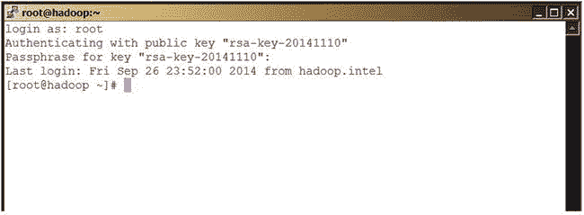

# 十、附录 B：基于 Linux 的客户端的 PuTTY 和 SSH 实现

在第 4 章的“使用 PuTTY 进行基于密钥的认证”一节中，您回顾了 PuTTY 如何有效地用于基于 Windows 的客户端的基于密钥的认证。对于基于 Linux 的客户端，基于密钥的认证怎么样？答案又是油灰。

您可以从各种来源下载基于 Linux 的 PuTTY 版本。对于 CentOS 6.2 的最新 PuTTY 版本(0.63)，我使用了 rpm (Red Hat Package Manager，一种用于 Linux 域软件分发的包管理系统)；文件是`putty-0.63-1.el6.rf.x86_64.rpm`。您可以从各种来源下载 rpm 你只需要搜索你的操作系统。下载文件后，安装 rpm:

```scala
rpm -Uvh putty-0.63-1.el6.rf.x86_64.rpm

```

要在 PuTTY 的 Linux 版本中生成一对私有和公共密钥，您需要使用一个名为 PuTTYgen 的命令行实用程序，它会在您通过 rpm 安装 PuTTY 时自动安装。要生成密钥对，请使用以下命令:

```scala
puttygen -t rsa -C "my key pair" -o bcl.ppk

```

然后，PuTTYgen 会提示您输入一个密码短语。请记下来，因为每次使用密钥对连接到主机时，您都需要指定相同的密码。

您可以将密钥保存在您的主目录中(容易记住位置)，然后使用以下命令将公钥导出到`authorized_keys`文件:

```scala
puttygen -L bcl.ppk >> $HOME/.ssh/authorized_keys

```

接下来，将`authorized_keys`文件复制到需要连接的主机上(使用 PuTTY)。注意，如果您的主机在`$HOME/.ssh`目录中已经有一个`authorized_keys`文件，那么使用不同的名称复制您新创建的文件，并将其内容附加到现有的`authorized_keys`文件中。

接下来，通过在命令提示符下键入 **putty** 来调用 PuTTY。该界面看起来与基于 Windows 的界面完全相同([图 B-1](#Fig1) )。


[图 B-1](#_Fig1) 。具有基于密钥的认证的 Linux PuTTY

要连接到服务器，请单击选项 SSH 以打开下拉列表，然后单击该列表下的选项 Auth(授权)。在 PuTTY 界面的右侧，单击 Browse 并选择您之前保存的私钥文件(在本例中为`/root/bcl.ppk`)。单击“打开”打开一个新会话。

就是这样！现在，您已经准备好使用 PuTTY 进行基于密钥的认证了！[图 B-2](#Fig2) 显示了登录提示和密码提示。



[图 B-2](#_Fig2) 。使用带有密码短语的 Linux PuTTY

使用 SSH 进行远程访问

您还可以使用 SSH 远程连接到主机。如果您想使用一个密钥对通过 SSH 进行认证，首先需要使用一个名为 ssh-keygen 的实用程序来生成密钥。默认情况下，密钥以文件`id_rsa`(私钥)和`id_rsa.pub`(公钥)的形式保存在`$HOME/.ssh`目录中。[图 B-3](#Fig3) 显示了在默认位置生成的不带密码短语的密钥对(您可以指定一个密码短语以增加安全性)。


[图 B-3](#_Fig3) 。使用 ssh-keygen 为远程访问生成密钥对

可以将公钥复制到适当的主机，并附加到`$HOME/.ssh`目录中现有的`authorized_keys`文件中。要使用私钥文件连接到主机，请使用以下语法:

```scala
ssh -i ~/.ssh/id_rsa root@Master

```

这里，`root`是用户，`Master`是您试图连接的服务器。

如果您有多个主机，并且您想要组织连接到它们的过程，您可以在目录`$HOME/.ssh`中的一个名为`config`的文件中创建主机条目。使用以下格式创建条目:

```scala
Host Master
User root
HostName Master
IdentityFile ~/.ssh/id_rsa

```

然后，您可以简单地连接为:

```scala
ssh -f -N Master

```