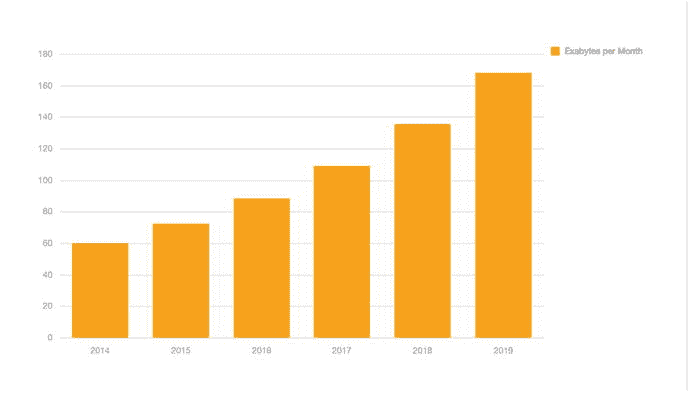
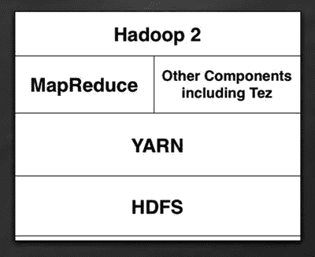
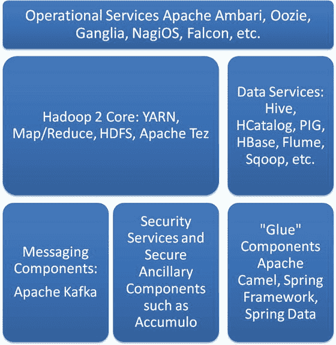
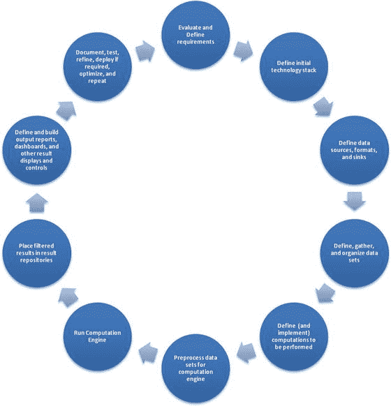
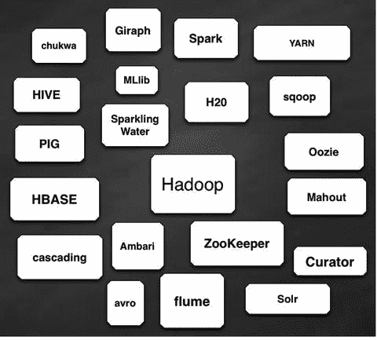
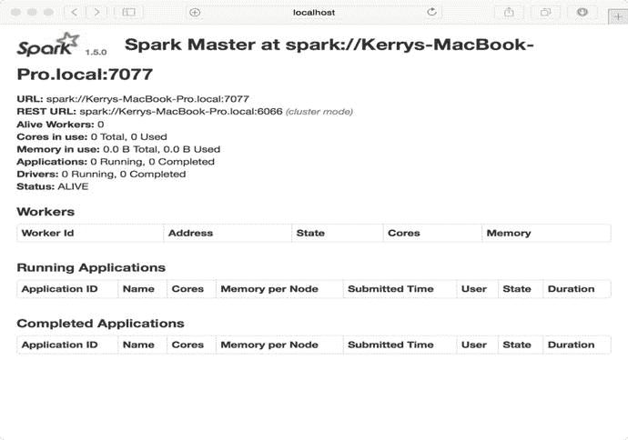
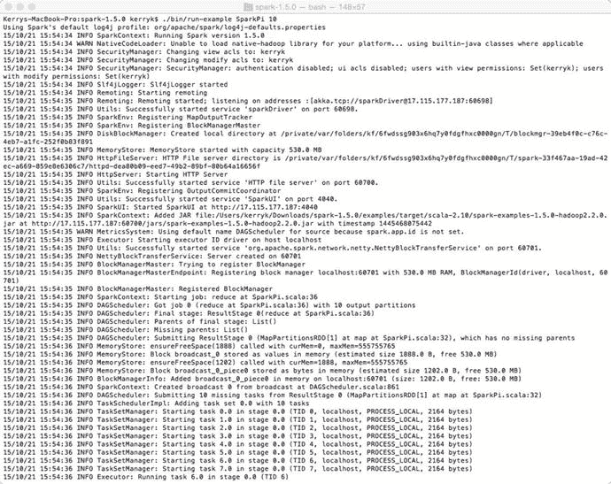

# 一、概述：使用 Hadoop 构建数据分析系统

这本书是关于设计和实现摄取、分析和可视化大数据集的软件系统。在整本书中，我们将使用缩写词 BDA 或 BDAs(大数据分析系统)来描述这种软件。大数据本身值得解释一下。作为计算机程序员和架构师，我们知道我们现在所说的“大数据”已经存在了很长时间，事实上已经有几十年了，因为“大数据”一直是一个相对的多维术语，一个不仅仅由数据大小定义的空间。复杂性、速度、准确性，当然还有数据的大小和数量，都是任何现代“大数据集”的维度。

在本章中，我们将讨论什么是使用 Hadoop 的大数据分析系统(BDA ),为什么它们很重要，可以使用哪些数据源、接收器和存储库，以及适合和不适合使用 Hadoop 的分布式系统方法的候选应用程序。我们还简要讨论了构建这种类型系统的 Hadoop/Spark 范例的一些替代方案。

软件开发一直都有一种紧迫感，大数据分析的开发也不例外。即使在即将成为新兴行业的早期，大数据分析也要求能够以更快的速度和更深层次的理解来处理和分析越来越多的数据。当我们检查软件系统架构和开发的实际细节时，以更全面的方式处理越来越多的数据的基本需求一直是抽象计算机科学和应用计算机技术等的关键目标。同样，大数据应用和系统也不例外。如图 [1-1](#Fig1) 所示，当我们考虑到可用的全球数据资源在过去几年中是如何爆炸式增长的，这就不足为奇了。



图 1-1。

Annual data volume statistics [Cisco VNI Global IP Traffic Forecast 2014–2019]

由于软件组件的快速发展和廉价的现成处理能力，再加上软件开发本身的快速发展，希望为自己的应用程序构建 BDA 的架构师和程序员常常会对他们在 BDA 舞台上面临的技术和战略选择感到不知所措。在这一介绍性章节中，我们将对 BDA 的景观做一个高层次的概述，并试图确定在建设 BDAs 时我们需要问自己的一些技术问题。

## 1.1 对分布式分析系统的需求

我们需要分布式大数据分析，因为传统的业务分析不足以满足现代分析应用程序对数据量、复杂性、多样性和高数据处理速率的需求。除了软件之外，大数据分析形势在另一方面发生了巨大变化。硬件成本——包括计算和存储——已经大幅下降。Hadoop 等工具依赖于成本相对较低的机器和磁盘集群，使分布式处理成为日常现实，对于大规模数据项目来说，分布式处理也是必要的。也有许多支持软件(框架、库和工具包)用于进行分布式计算。事实上，选择技术堆栈的问题已经成为一个严重的问题，仔细关注应用程序需求和可用资源是至关重要的。

历史上，硬件技术定义了软件组件的能力限制，尤其是在数据分析方面。传统的数据分析意味着对简单的基于文件的数据集或与关系数据存储的直接连接进行统计可视化(直方图、饼图和表格报告)。计算引擎通常使用单个服务器上的批处理来实现。在分布式计算这个勇敢的新世界中，使用计算机集群分而治之解决大数据问题已经成为一种标准的计算方式:这种可扩展性允许我们超越单台计算机的能力界限，并根据我们的需要(或我们的承受能力)添加尽可能多的现成硬件。Ambari、Zookeeper 或策展人等软件工具帮助我们管理集群，并提供集群资源的可伸缩性和高可用性。

## 1.2 Hadoop 核心和少量历史

一些软件想法已经存在了很长时间，以至于它甚至不再是计算机历史——而是计算机考古学。“map-reduce”问题解决方法的思想可以追溯到第二古老的编程语言 LISP(列表处理),可以追溯到 20 世纪 50 年代。"地图" "缩小"“send”和“lambda”是 LISP 语言本身的标准函数！几十年后，我们现在所知的 Apache Hadoop，即基于 Java 的开源分布式处理框架，并不是“从零开始”的。它是从 Apache Nutch 演化而来的，Apache Nutch 是一个开源的网络搜索引擎，而后者又是基于 Apache Lucene 的。有趣的是，R 统计库(我们也将在后面的章节中深入讨论)也受到 LISP 的影响，并且最初是用 LISP 语言编写的。

在我们谈论 Hadoop 生态系统之前，Hadoop 核心组件值得一提。顾名思义，Hadoop 核心是 Hadoop 框架的本质[图 1.1]。支持组件、架构，当然还有辅助库、问题解决组件和称为 Hadoop 生态系统的子框架都构建在 Hadoop 核心基础之上，如图 [1-2](#Fig2) 所示。请注意，在本书的范围内，我们将不会讨论 Hadoop 1，因为它已经被使用 YARN(又一个资源协商器)的新的重新实现所取代。请注意，在 Hadoop 2 系统中，MapReduce 并没有消失，它只是被模块化并抽象成一个组件，可以与其他数据处理模块很好地配合。



图 1-2。

Hadoop 2 Core diagram

## 1.3 Hadoop 生态系统概述

Hadoop 及其生态系统，加上围绕它们发展起来的新框架和库，仍然是大数据分析领域不可忽视的力量。本书的其余部分将帮助您针对大数据分析挑战制定有针对性的应对措施，同时提供最基本的背景知识，帮助您学习解决大数据分析问题的新方法。Hadoop 及其生态系统通常分为四个主要类别或功能块，如图 [1-3](#Fig3) 所示。您会注意到，我们包括了几个额外的模块，以显示对软件“粘合”组件以及某种安全功能的需求。您还可以根据自己的需求向 BDA 系统添加支持库和框架。



图 1-3。

Hadoop 2 Technology Stack diagram Note

在本书中，我们将继续强调免费的第三方组件，比如前面提到的 Apache 组件和库。这并不意味着您不能将您喜欢的图数据库(或者关系数据库)作为数据源集成到您的 BDAs 中。我们还将强调开源组件的灵活性和模块化，这允许您用最少的附加软件“粘合剂”将数据管道组件连接在一起在我们的讨论中，我们将使用 Spring 框架的 Spring 数据组件，以及 Apache Camel，来提供集成的“粘合”支持来链接我们的组件。

## 1.4 人工智能技术、认知计算、深度学习和大数据分析

大数据分析不再仅仅是简单的统计分析。随着 BDA 及其支持框架的发展，来自机器学习(ML)人工智能(AI)、图像和信号处理以及其他复杂技术(包括所谓的“认知计算”技术)的技术已经成熟，并成为数据分析师工具包的标准组件。

## 1.5 自然语言处理和 BDAs

事实证明，自然语言处理(NLP)组件在大量不同的领域都很有用，从扫描和解释收据和发票到复杂的药房处方数据和医院病历处理，以及大量存在非结构化和半结构化数据的许多其他领域。在处理这种“混合搭配”的数据源时，Hadoop 是一个自然的选择，在这种数据源中，条形码、签名、图像和信号、地理空间数据(GPS 位置)和其他数据类型可能会混合在一起。Hadoop 也是进行各种大规模文档分析的一种非常强大的手段。

我们将在单独的一章中讨论所谓的“语义网”技术，如分类法和本体论、基于规则的控制和 NLP 组件。现在，可以说 NLP 已经走出了研究领域，进入了实际应用程序开发的领域，有各种各样的工具包和库可供选择。我们将在本书中讨论的一些 NLP 工具包是基于 Python 的自然语言工具包(NLTK)、斯坦福 NLP 和 Digital Pebble 的庞然大物，这是一个基于 Apache Hadoop 的用于大规模文档分析的开源平台。 [<sup>1</sup>](#Fn1)

## 1.6 SQL 和 NoSQL 查询

除非被查询，否则数据是没有用的。查询数据集的过程——无论是键值对集合、Oracle 或 MySQL 的关系数据库结果集，还是 Neo4j 或 Apache Giraph 等图数据库中的顶点和边的表示——都需要我们对数据进行过滤、排序、分组、组织、比较、分区和评估。这导致了 SQL 等查询语言的发展，以及与 HBase、Cassandra、MongoDB、CouchBase 等“NoSQL”组件和数据库相关的查询语言的所有变种和变体。在本书中，我们将集中使用 read-eval-print 循环(REPLs)、交互式 shells(如 IPython)和其他交互式工具来表达我们的查询，并且我们将尽可能地将我们的查询与众所周知的 SQL 概念相关联，而不管它们与什么软件组件相关联。例如，一些图数据库如 Neo4j(我们将在后面的章节中详细讨论)有它们自己的类似 SQL 的查询语言。在整本书中，我们将尽可能地坚持类似 SQL 的查询传统，但是我们会指出一些有趣的 SQL 范例的替代方案。

## 1.7 必要的数学

在本书中，我们将保持数学最小化。然而，有时候，一个数学等式不仅仅是一个必要的邪恶。有时候，理解你的问题并实现你的解决方案的最佳方式是数学途径——同样，在某些情况下,“必要的数学”成为解决难题的关键因素。数据模型、神经网络、单个或多个分类器以及贝叶斯图技术要求至少对这些系统的潜在动态有所了解。而且，对于程序员和架构师来说，必要的数学几乎总是可以被转换成有用的算法，并从那里转换成有用的实现。

## 1.8 设计和构建 BDA 系统的循环流程

如今，在构建 BDAs 方面有很多好消息。Apache Spark 及其内存计算模型的出现是一个重要的积极因素，但是还有其他几个原因可以解释为什么构建 BDAs 从来没有这么简单。这些原因包括:

*   丰富的框架和 ide 来帮助开发；
*   成熟且经过充分测试的组件，用于帮助构建 BDAs，如果您需要，还可以使用公司支持的 BDA 产品。框架成熟度(比如 Spring 框架、Spring Data subframework、Apache Camel 等等)通过提供可靠的核心基础设施来帮助分布式系统开发。
*   一个重要的在线和面对面的 BDA 开发社区，有无数的开发者论坛和聚会。如果您遇到了与 BDA 设计和开发相关的架构或技术问题，用户社区中的某个人可能会为您提供有用的建议。

在本书中，我们将使用以下九个步骤来指定和创建我们的 BDA 示例系统。这个过程只是提示性的。您可以按原样使用下面列出的过程，对其进行自己的修改，添加或减少结构或步骤，或者提出自己的开发过程。这取决于你。我们发现以下步骤对于规划和组织 BDA 项目以及我们开发和构建项目时出现的一些问题特别有用。

您可能会注意到问题和需求定义、实现、测试和文档被合并到一个整体过程中。这里描述的过程非常适合于快速迭代开发过程，其中所使用的需求和技术在开发周期中相对稳定。

定义和构建 BDA 系统的基本步骤如下。整体循环如图 [1-4](#Fig4) 所示。

1.  确定 BDA 系统的要求。开发的初始阶段需要生成技术、资源、技术和策略以及实现目标所需的其他组件的概要。最初的目标集(当然会有变化)需要被固定、排序和明确定义。众所周知，随着对项目需求了解的加深，目标和其他要求也会发生变化。BDA 系统有特殊要求(可能包括 Hadoop 集群中的内容、特殊数据源、用户界面、报告和仪表板要求)。列出数据源类型、数据接收器类型、必要的解析、转换、验证和数据安全问题。能够使您的需求适应 BDA 技术的可塑性和易变的本质，将确保您能够以模块化、有组织的方式修改您的系统。确定组件中的计算和进程，确定是否需要批处理或流处理(或两者都需要),并绘制计算引擎的流程图。这将有助于定义和理解系统的“业务逻辑”。
2.  定义初始技术堆栈。初始技术堆栈将包括一个 Hadoop 核心以及适合您在上一步中定义的要求的适当生态系统组件。如果您需要流支持，您可以包括 Apache Spark，或者您正在使用我们在本书后面讨论的基于 Spark 的机器学习库。记住你将要使用的编程语言。如果你使用的是 Hadoop，Java 语言将是栈的一部分。如果你用的是 Apache Spark，也会用到 Scala 语言。Python 有许多非常有趣的特殊应用，我们将在后面的章节中讨论。如果其他语言绑定是需求的一部分，也可以使用。
3.  定义数据源、输入和输出数据格式以及数据清理过程。在需求收集阶段(步骤 0)，您制作了数据源/接收器类型的初始列表，并制作了顶层流程图来帮助定义您的数据管道。在 BDA 系统中可能会用到很多外来的数据源，包括图像、地理空间位置、时间戳、日志文件等等，所以要保持一个数据源(和数据宿)的最新列表。)类型，就像您做最初的设计工作一样方便。
4.  定义、收集和组织初始数据集。您可能有项目的初始数据、测试和训练数据(本书后面会有更多关于训练数据的内容)、来自以前系统的遗留数据，或者根本没有数据。考虑数据集的最小数量(数量、种类和容量),并制定一个获取或生成所需数据的计划。请注意，当您添加新代码时，可能需要新的数据集来执行充分的测试。初始数据集应该测试数据管道的每个模块，确保正确执行端到端处理。
5.  定义要执行的计算。概念形式的业务逻辑来自需求阶段，但是这个逻辑是什么以及它是如何实现的将随着时间的推移而改变。在这个阶段，定义要在数据元素上执行的输入、输出、规则和转换。这些定义在步骤 6 中被转化为计算引擎的实现。
6.  预处理数据集以供计算引擎使用。有时数据集需要预处理:验证、安全检查、清理、转换成更适合处理的格式，以及其他几个步骤。有一个要满足的预处理目标的清单，并在整个开发周期中继续关注这些问题，并随着开发的进展进行必要的修改。
7.  定义计算引擎步骤；定义结果格式。计算引擎的业务逻辑、流程、结果的准确性、算法和实现的正确性以及效率将总是需要被质疑和改进。
8.  将过滤后的结果放入数据接收器的结果存储库中。数据接收器是保存数据管道最终输出的数据仓库。在准备好报告或显示您的输出数据之前，可能有几个过滤或转换步骤。您的分析的最终结果可以存储在文件、数据库、临时存储库、报告或任何需求中。请记住，用户在 UI 或仪表板上的操作可能会影响输出的格式、音量和显示。这些交互结果中的一些可能需要持久存储回数据存储。组织专门针对数据输出、报告、表示和持久性的需求列表。
9.  定义和构建输出报告、仪表板和其他输出显示和控制。生成的输出显示和报告清楚地显示了所有分析计算的结果。BDA 系统的这一组件通常至少部分是用 JavaScript 编写的，并且可以使用复杂的数据可视化库来辅助不同种类的仪表板、报告和其他输出显示。
10.  记录、测试、提炼和重复。如果有必要的话，我们可以在细化需求、栈、算法、数据集等之后，再一次经历这些步骤。文档最初由您在最后七个步骤中所做的笔记组成，但是随着项目的进展，需要进行改进和重写。测试需要在每个周期中被创建、精炼和改进。顺便提一下，每个开发周期都可以被认为是一个版本，一次迭代，或者你喜欢的组织你的程序周期的方式。



图 1-4。

A cyclic process for designing and building BDAs

这就是了。系统地使用这个迭代过程将使你能够设计和构建与本书中描述的系统相媲美的 BDA 系统。

## 1.9 Hadoop 生态系统如何实现大数据分析

Hadoop 生态系统通过在数据管道架构中将所有必要的分析要素(数据源、转换、基础设施、持久性和可视化)链接在一起来实现大数据分析，同时允许这些组件以分布式方式运行。Hadoop 核心(或者在某些情况下，Apache Spark 甚至是同时使用 Hadoop 和 Storm 的混合系统)通过 ZooKeeper、Curator 和 Ambari 等组件提供分布式系统基础设施和集群(节点)协调。在 Hadoop 核心之上，生态系统为分析、可视化、持久性和报告提供了复杂的库。

Hadoop 生态系统不仅仅是 Hadoop 核心功能的附加库。该生态系统提供了集成的无缝组件，Hadoop 核心专为解决特定的分布式问题而设计。例如，Apache Mahout 提供了一个分布式机器学习算法工具包。

拥有一些经过深思熟虑的 API 可以很容易地将我们的数据源链接到我们的 Hadoop 引擎和其他计算元素。借助 Apache Camel、Spring Framework、Spring Data 和 Apache Tika 的“粘合”功能，我们将能够将所有组件链接到一个有用的数据流引擎中。

## 1.10“图像即大数据”的理念(IABD)

图像——实际上是各种图片和信号——是“大数据类型”信息的最广泛、最有用、最复杂的来源之一。

图像有时被认为是称为像素的原子单元的二维阵列，事实上(以及一些相关联的元数据)，这通常是图像在诸如 Java 的计算机编程语言中以及在诸如 Java 高级成像(JAI)、OpenCV 和 BoofCV 等相关联的图像处理库中的表示方式。然而，生物系统从这些“二维阵列”中“拉出东西”:线条和形状、颜色、元数据和上下文、边缘、曲线以及所有这些之间的关系。很快就变得显而易见的是，图像(顺便提一下，相关数据，如时间序列和来自传感器(如麦克风或测距仪)的“信号”)是大数据的最佳示例类型之一，有人可能会说，图像的分布式大数据分析是受生物系统的启发。毕竟，我们中的许多人每次驾驶汽车时都会将非常复杂的三维立体视觉处理作为一个分布式系统来执行。

关于将影像作为大数据源的好消息是，它不再像以前那样困难了。复杂的库可用于与 Hadoop 和其他必要的组件接口，如图数据库或 Apache Kafka 等消息传递组件。如有必要，OpenCV 或 BoofCV 等低级库可以提供图像处理原语。编写代码既简洁又容易。例如，我们可以用下面的 Java 类编写一个简单的、可滚动的图像查看器(如清单 [1-1](#Par41) 所示)。


图 1-5。

Sophisticated third-party libraries make it easy to build image visualization components in just a few lines of code

```scala
package com.kildane.iabt;

import java.awt.image.RenderedImage;

import java.io.File;

import java.io.IOException;

import javax.media.jai.JAI;

import javax.imageio.ImageIO;

import javax.media.jai.PlanarImage;

import javax.media.jai.widget.
ScrollingImagePanel;

import javax.swing.JFrame;

/**
 * Hello IABT world!
 * The worlds most powerful image processing toolkit (for its size)?
 */

public class App
{
    public static void main(String[] args)
    {
        JAI jai = new JAI();
        RenderedImage image = null;
                try {
                        image = ImageIO.read(new File("/Users/kerryk/Documents/SA1_057_62_hr4.png"));
                } catch (IOException e) {
                        e.printStackTrace();
                }
                if (image == null){ System.out.println("Sorry, the image was null"); return; }
                JFrame f = new JFrame("Image Processing Demo for Pro Hadoop Data Analytics");
        ScrollingImagePanel panel = new ScrollingImagePanel
(image, 512, 512);
        f.add(panel);
        f.setSize(512, 512);
        f.setVisible(true);
        System.out.println("Hello IABT World, version of JAI is: " + JAI.getBuildVersion());
    }

}

Listing 1-1.Hello image world: Java code for an image visualizer stub

as shown in Figure 1-5

```

然而，一个简单的图像浏览器只是图像 BDA 系统的开始。有低级别的图像处理、特征提取、转换成适当的数据表示以供分析，最后将结果加载到报告、仪表板或定制的结果显示中。

我们将在第 [14](14.html) 章中更全面地探讨图像作为大数据(IABD)的概念。

### 使用的编程语言

首先，说一下编程语言。虽然 Hadoop 及其生态系统最初是用 Java 编写的，但现代 Hadoop 子系统拥有几乎所有可以想到的语言的语言绑定，包括 Scala 和 Python。这使得在一个应用程序中构建开发各种编程语言的有用特性所必需的多语言系统变得非常容易。

### 1 . 10 . 2 Hadoop 生态系统的多语言组件

在现代大数据分析领域，单一语言系统少之又少。虽然我们在本书中讨论的许多旧组件和库主要是用一种编程语言编写的(例如，Hadoop 本身是用 Java 编写的，而 Apache Spark 主要是用 Scala 编写的)，但 BDA 通常是不同组件的组合，有时在同一个应用程序中使用 Java、Scala、Python 和 JavaScript。这些多语言、模块化的系统通常被称为多语言系统。

现代程序员习惯于多语言系统。对多语言方法的一些需求是不必要的:例如，为互联网编写仪表板适合于 JavaScript 这样的语言，尽管人们可以在被迫的情况下使用 Java Swing 在独立甚至 web 模式下编写仪表板。对于手头的应用程序来说，什么是最有效和最高效的，这完全是一个问题。在本书中，我们将拥抱多语言理念，本质上使用 Java 开发基于 Hadoop 的组件，使用 Scala 开发基于 Spark 的组件，根据需要使用 Python 和脚本，使用基于 JavaScript 的工具包开发前端、仪表盘、各种图形和绘图示例。

### 1.10.3 Hadoop 生态系统结构

虽然 Hadoop 核心提供了构建分布式系统功能的基础，但被称为“Hadoop 生态系统”的附加库和框架提供了与 API 和功能的有用连接，这些 API 和功能可解决应用问题并构建分布式系统。

我们可以将 Hadoop 生态系统想象成一种“太阳系”，生态系统的各个组件依赖于中心 Hadoop 组件，Hadoop 核心位于中心“太阳”位置，如图 [1-6](#Fig6) 所示。除了为 Hadoop 集群本身提供管理和簿记(例如 Zookeeper 和 Curator)，Hive 和 Pig 等标准组件提供数据仓库，Mahout 等其他辅助库提供标准的机器学习算法支持。



图 1-6。

A simplified “solar system” graph of the Hadoop ecosystem

Apache ZooKeeper(zookeeper.apache.org)是一个分布式协调服务，用于各种基于 Hadoop 和 Spark 的系统。它具有命名服务、组成员资格、用于分布式同步的锁和载体，以及高度可靠的集中式注册表。ZooKeeper 有一个由“znodes”组成的分层名称空间数据模型。Apache ZooKeeper 是开源的，由一个有趣的辅助组件 Apache Curator 支持，这是一个 ZooKeeper 的客户端包装器，也是一个支持以 ZooKeeper 为中心的组件的丰富框架。我们将在设置运行 Kafka 消息系统的配置时再次见到 ZooKeeper 和策展人。

## 1.11 关于“软件胶水”和框架的说明

“胶水”是任何建设项目都必须的，软件项目也不例外。事实上，一些软件组件，如自然语言处理(NLP)组件 Digital Pebble Behemoth(我们将在后面详细讨论)将自己称为“glueware”。幸运的是，也有一些通用集成库和包非常适合构建 BDA，如表 [1-1](#Tab1) 所示。

表 1-1。

Database types and some examples from industry

<colgroup><col> <col> <col></colgroup> 
| 名字 | 位置 | 描述 |
| --- | --- | --- |
| 弹簧框架 | http://projects.spring.io/spring-framework/ | 一个基于 Java 的应用程序开发框架，对应用程序开发需求的几乎任何部分都有库支持 |
| 阿帕奇是 | tika.apache.org | 从各种文件类型中检测和提取元数据 |
| 阿帕奇骆驼 | Camel.apache.org | 实现企业集成模式(EIP)的“glueware”组件 |
| 春季数据 | [T2`http://projects.spring.io/spring-data/`](http://projects.spring.io/spring-data/) | 数据访问工具包，与 Spring 框架的其余部分紧密耦合 |
| 巨大的 | [T2`https://github.com/DigitalPebble/behemoth`](https://github.com/DigitalPebble/behemoth) | 大规模文档分析“glueware” |

为了有效地使用 Apache Camel，了解企业集成模式(EIP)很有帮助。有几本关于 EIP 的好书，它们对于使用 Apache Camel 尤其重要。 [<sup>2</sup>](#Fn2)

## 1.12 Apache Lucene、Solr 等等:开源搜索组件

对于分布式计算，尤其是大数据分析，搜索组件与查询引擎本身一样重要。事实上，有时候像 Apache Lucene 或 Apache Solr 这样的搜索引擎是查询引擎实现本身的关键部分。我们可以在图 [1-7](#Fig7) 中看到这些组件之间的相互作用。事实证明，Lucene 的 Solr 组件有自己的生态系统，尽管规模不如 Hadoop 生态系统大。尽管如此，Lucene 生态系统包含一些与大数据分析非常相关的软件资源。除了 Lucene 和 Solr，Lucene 生态系统还包括 Nutch，这是一个可扩展和高度可伸缩的网络爬虫(nutch.apache.org)。NGDATA 的 Lily 项目是一个非常有趣的软件框架，我们可以使用它无缝地利用 HBase、Zookeeper、Solr 和 Hadoop。Lily 客户端可以使用基于 Avro 的协议来提供到 Lily 的连接。回想一下，Apache Avro(avro.apache.org)是一个数据序列化系统，它提供了一种紧凑而快速的二进制数据格式，并与动态语言简单集成。


图 1-7。

A relationship diagram between Hadoop and other Apache search-related components

## 1.13 用于构建大数据分析系统的架构

构建 BDAs 时的部分问题是，软件开发并不是真正在建造一座大楼。这只是一个比喻，尽管很有用。当我们设计一个软件时，我们已经在使用大量的隐喻和类比来思考我们正在做的事情。我们称之为软件架构，因为它是一个类似于建造房子的过程，一些基本原则适用于设计一个购物中心，就像设计一个软件系统一样。

我们希望从我们技术的历史中吸取教训，而不是重新发明轮子或犯与我们的前辈同样的错误。因此，我们有“最佳实践”、软件“模式”和“反模式”、诸如敏捷或迭代开发的方法，以及其他技术和策略的整个调色板。这些资源帮助我们实现质量，降低成本，并为我们的软件需求提供有效和可管理的解决方案。

“软件架构”的比喻因为软件开发的某些现实而不成立。如果你正在建造一个豪华酒店，你突然决定要给每个套房增加私人水疗室或壁炉，这是一个问题。很难重新设计平面图，或者使用什么品牌的地毯。改变主意会受到重罚。偶尔我们必须打破建筑的比喻，看看是什么使软件架构从根本上不同于它的比喻。

这种差异大部分与软件本身的动态和可变性质有关。需求变化，数据变化，软件技术快速发展。客户改变了他们对自己需要什么和如何需要的想法。经验丰富的软件工程师认为软件的这种可塑性和易弯曲性是理所当然的，这些现实——软件和数据的流动性——影响了从工具包到方法的一切，尤其是敏捷风格的方法，它几乎理所当然地假设快速变化的需求。

这些抽象的想法影响了我们实际的软件架构选择。简而言之，在设计大数据分析系统时，经受住时间考验的标准架构原则仍然适用。例如，我们可以使用任何标准 Java 编程项目通用的组织原则。我们可以使用企业集成模式(EIP)来帮助组织和集成整个项目中不同的组件。如果我们愿意，我们可以继续使用传统的 n 层、客户端-服务器或对等原则来组织我们的系统。

作为架构师，我们还必须了解分布式系统(尤其是 Hadoop)如何改变实际系统构建的等式。架构师必须考虑专门适用于 Hadoop 技术的模式:例如，mapReduce 模式和反模式。知识是关键。因此，在下一节中，我们将告诉您为了构建有效的 Hadoop BDAs，您需要知道些什么。

## 1.14 您需要了解的内容

当我们写这本书的时候，我们必须对你，读者，做一些假设。我们做了很多假设:您是一名经验丰富的程序员和/或架构师，您已经了解 Java，您了解一些 Hadoop，熟悉 Hadoop 2 核心系统(包括 YARN)、Hadoop 生态系统，并且您习惯于从头开始构建 Java 风格的应用程序的基本机制。这意味着你熟悉一个 IDE(比如 Eclipse，我们下面会简要介绍)，你知道 Ant 和 Maven 等构建工具，你有一个大数据分析问题要解决。我们假设您非常熟悉您想要解决的技术问题:这些问题包括选择您的编程语言、您的技术栈，并且您知道您的数据源、数据格式和数据接收器。你可能也已经熟悉 Python 和 Scala 编程语言，但是我们在下一章包括了对这些语言的快速复习——以及关于它们特别有用的一些想法。Hadoop 生态系统有许多组件，其中只有一些与我们将要讨论的内容相关，因此在表 [1-3](#Tab3) 中，我们简要描述了我们将使用的一些 Hadoop 生态系统组件。

我们假设的不仅仅是你的编程能力。我们还假设你是一个战略思考者:你明白当软件技术改变、发展和变异时，合理的战略和方法(包括计算机科学和任何其他种类的科学)允许你适应新技术和新的问题领域。作为一名战略思考者，你对数据格式感兴趣。

虽然数据格式肯定不是大数据科学最迷人的方面，但它们是与架构师和软件工程师最相关的问题之一，因为数据源及其格式在一定程度上决定了任何数据管道的一个非常重要的部分:最初的软件组件或预处理器，它清理、验证、确认、确保安全性，并从数据源获取数据，以供管道的计算引擎阶段处理。Hadoop 是本书中讨论的大数据分析的关键组件，为了从本书中获得最大收益，您应该对 Hadoop 核心和 Hadoop 生态系统的基本组件有深刻的理解。这包括“经典生态系统”组件，如 Hive、Pig 和 HBase，以及 glue 组件，如 Apache Camel、Spring Framework、Spring Data 子框架和 Apache Kafka 消息传递系统。如果您对使用关系数据源感兴趣，了解标准 Java 编程中使用的 JDBC 和 Spring Framework JDBC 将会有所帮助。JDBC 在 Apache Phoenix(Phoenix . Apache . org)等组件中卷土重来，这是关系型技术和基于 Hadoop 的技术的有趣结合。Phoenix 提供对 HBase 数据的低延迟查询，在查询中使用标准的 SQL 语法。Phoenix 是一个客户端嵌入式 JDBC 驱动程序，因此只需一行 Java 代码就可以访问 HBase 集群。Apache Phoenix 还提供对模式定义、事务和元数据的支持。

表 1-2。

Database types and some examples from industry

<colgroup><col> <col> <col> <col></colgroup> 
| 数据库类型 | 例子 | 位置 | 描述 |
| --- | --- | --- | --- |
| 有关系的 | 关系型数据库 | mahout.apache.org | 这种类型的数据库已经存在了足够长的时间，可以获得复杂的支持框架和系统。 |
| 文件 | 阿帕奇兔 | jackrabbit.apache.org | Java 中的内容存储库 |
| 图表 | Neo4j | Neo4j.com | 多用途图数据库 |
| 基于文件的 | 全文搜索引擎 | Lucene.apache.org | 通用统计 |
| 混合物 | Solr+骆驼 | Camel.apache.org Lucene.apache.org/solr | Lucene、Solr 和 glue 合二为一 |

Note

设置和有效使用 Hadoop 的最佳参考之一是 Jason Venner 和 Sameer Wadkhar 所著的《Pro Apache Hadoop，第二版》,可从 Apress 出版社获得。

表 1-3。

A sampling of BDA components in and used with the Hadoop Ecosystem

<colgroup><col> <col> <col> <col></colgroup> 
| 名字 | 小贩 | 位置 | 描述 |
| --- | --- | --- | --- |
| 象夫 | 街头流氓 | mahout.apache.org | 面向 Hadoop 的机器学习 |
| MLlib(密西西比州) | 街头流氓 | Spark.apache.org/mllib | Apache Spark 的机器学习 |
| 稀有 |   | [T2`https://www.r-project.org`](https://www.r-project.org) | 通用统计 |
| 新西兰黑秧鸡 | 新西兰怀卡托大学 | [T2`http://www.cs.waikato.ac.nz/ml/weka/`](http://www.cs.waikato.ac.nz/ml/weka/) | 统计分析和数据挖掘(基于 Java) |
| H2O | H20 | H2o.ai | 基于 JVM 的机器学习 |
| scikit_learn |   | scikit-learn.org | Python 中的机器学习 |
| Spark | 街头流氓 | spark.apache.org | 开源集群计算框架 |
| 卡夫卡 | 街头流氓 | kafka.apache.org | 分布式消息传递系统 |

表 [1-3](#Tab3) 简要总结了我们将讨论的一些工具包。

## 1.15 数据可视化和报告

数据可视化和报告可能是数据管道架构的最后一步，但它肯定与其他阶段一样重要。数据可视化允许系统的最终用户交互式地查看和操作数据。它可能是基于 web 的，使用 RESTful APIs 和浏览器、移动设备或设计为在高性能图形显示器上运行的独立应用程序。数据可视化的一些标准库如表 [1-4](#Tab4) 所示。

表 1-4。

A sampling of front-end components for data visualization

<colgroup><col> <col> <col></colgroup> 
| 名字 | 位置 | 描述 |
| --- | --- | --- |
| D3 | `D3.org` | Javascript 数据可视化 |
| Ggplot2 | `http://ggplot2.org` | Python 中的数据可视化 |
| matplotlib | `http://matplotlib.org` | 用于基本绘图的 Python 库 |
| 三. js | `http://threejs.org` | 用于三维图形和绘图的 JavaScript 库 |
| 角度 JS | `http://angularjs.org` | 允许使用 JavaScript 创建模块化数据可视化组件的工具包。它特别有趣，因为 AngularJS 与 Spring 框架和其他管道组件集成得很好。 |

使用这些库或类似的库创建仪表板或前端用户界面非常简单。大多数高级 JavaScript 库包含高效的 API 来连接数据库、RESTful web 服务或 Java/Scala/Python 应用程序。


图 1-8。

Simple data visualization displayed on a world map, using the DevExpress toolkit

使用 Hadoop 进行大数据分析是很特别的。对于 Hadoop 系统架构师来说，Hadoop BDA 提供并允许利用标准的主流架构模式、反模式和策略。例如，BDAs 可以使用标准的 ETL(提取-转换-加载)概念，以及在“云中”开发分析系统的架构原则来开发。标准的系统建模技术仍然适用，包括设计的“应用层”方法。

应用层设计的一个例子可能包含“服务层”(它提供应用程序的“计算引擎”或“业务逻辑”)和数据层(它存储和管理输入和输出数据，以及数据源和接收器，以及由系统用户访问的输出层，它向输出设备提供内容)。当内容被提供给 web 浏览器时，这通常被称为“web 层”。

Issues of the Platform

在本书中，我们在 Mac OS X 环境中表达了很多例子。这是故意的。我们使用 Mac 环境的主要原因是，它似乎是 Linux/Unix 语法(毕竟，这是 Hadoop 赖以生存的地方)和规模更小的开发环境之间的最佳妥协，在这种环境中，开发人员可以尝试这里显示的一些想法，而不需要大型 Hadoop 集群，甚至不需要一台笔记本电脑。这并不意味着你不能在 Cygwin 的 Windows 平台或类似的环境中运行 Hadoop。


图 1-9。

A simple data pipeline

一个简单的数据管道如图 [1-9](#Fig9) 所示。在某种程度上，当考虑 BDAs 时，这个简单的管道就是“Hello world”程序。它对应于所有数据分析师都熟悉的那种简单的主流 ETL(提取-转换-加载)过程。管道的后续阶段转换先前的输出内容，直到数据被发送到最终的数据接收器或结果存储库。

### 1.15.1 使用 Eclipse IDE 作为开发环境

Eclipse IDE 已经存在很长时间了，关于使用 Eclipse 进行现代应用程序开发的争论在大多数使用 Java 或 Scala 的开发中心都很激烈。现在有许多替代 Eclipse 的 IDE，您可以选择其中任何一个来试验和扩展本书中开发的示例系统。或者，如果您愿意，您甚至可以使用常规的文本编辑器并从命令行运行系统，只要您身边有最新版本的 Apache Maven。附录 A 向您展示了如何为各种 ide 和平台(包括现代 Eclipse 环境)设置和运行示例系统。顺便提一下，Maven 是一个非常有效的工具，用于组织构成任何 BDA 的模块化的基于 Java 的组件(以及用 Scala 或 JavaScript 等其他语言实现的组件),并且被直接集成到 Eclipse IDE 中。Maven 在命令行上构建、测试和运行 BDA 同样有效。

我们发现，在开发本书中讨论的一些混合应用程序示例时，Eclipse IDE 特别有价值，但这可能是个人喜好的问题。请随意将示例导入到您选择的 IDE 中。


图 1-10。

A useful IDE for development : Eclipse IDE with Maven and Scala built in Data Sources and Application Development

在主流应用程序开发中——大多数时候——我们只会遇到一些基本类型的数据源:关系、各种文件格式(包括原始的非结构化文本)、逗号分隔的值，甚至是图像(可能是流数据，甚至是更奇特的东西，比如 Neo4j 等图数据库的导出)。在大数据分析领域，可能会用到信号、图像和多种非结构化数据。这些可能包括空间或 GPS 信息、来自传感器的时间戳以及各种其他数据类型、元数据和数据格式。在本书中，特别是在示例中，我们将向您展示各种各样的常见数据格式以及外来数据格式，并提供关于如何对数据进行标准 ETL 操作的提示。在适当的时候，我们将根据需要讨论数据验证、压缩以及从一种数据格式到另一种数据格式的转换。

### 1.15.2 本书不是什么

既然我们已经注意到了这本书是关于什么的，我们现在必须检查它不是什么。

这本书不是对 Apache Hadoop、大数据分析组件或 Apache Spark 的介绍。已经有许多优秀的书籍描述了“vanilla Hadoop”(直接从 hadoop.apache.org 获得)及其生态系统的特性和机制，以及最近的 Apache Spark 技术，这些技术取代了 Hadoop 的原始 map-reduce 组件，并允许批处理和内存处理。

在整本书中，我们将描述有用的 Hadoop 生态系统组件，尤其是那些与我们将在本书其余部分构建的示例系统相关的组件。这些组件是我们的 BDAs 或大数据分析组件的构建模块，因此本书不会深入讨论组件功能。对于标准的 Hadoop 兼容组件，如 Apache Lucene、Solr、Apache Camel 或 Spring Framework，书籍和互联网教程比比皆是。

我们也不会深入讨论方法论(例如迭代或敏捷方法论)，尽管这些是构建大数据分析系统的非常重要的方面。我们希望我们在这里讨论的系统对你有用，不管你选择什么样的方法风格。

How to Build The BDA Evaluation System

在这一节中，我们将简要介绍如何建立 BDA 评估系统。成功完成后，这将为您提供评估本书剩余部分中讨论的代码和示例所需的一切。各个组件在其各自的网站上都有完整的安装说明。

1.  如果您还没有设置基本开发环境，请设置好。这包括 Java 8.0、Maven 和 Eclipse IDE。有关 Java 的最新安装说明，请访问 oracle.com。不要忘记相应地设置适当的环境变量，比如 JAVA_HOME。下载并安装 Maven (maven.apache.org)，设置 M2_HOME 环境变量。要确保 Maven 已经正确安装，请在命令行中键入 mvn–version。还要在命令行上键入‘which mvn ’,以确保 Maven 可执行文件在您认为的位置。
2.  确保安装了 MySQL。从 [`www.mysql.com/downloads`](http://www.mysql.com/downloads) 下载合适的安装包。使用本书中包含的示例模式和数据来测试功能。你应该可以运行“mysql”和“mysqld”。
3.  安装 Hadoop 核心系统。在本书的例子中，我们使用 Hadoop 版本 2.7.1。如果你在 Mac 上，你可以用自制软件来安装 Hadoop，或者从网站上下载并按照说明安装。在. bash_profile 文件中设置 HADOOP_HOME 环境变量。
4.  Insure that Apache Spark is installed. Experiment with a single-machine cluster by following the instructions at [`http://spark.apache.org/docs/latest/spark-standalone.html#installing-spark-standalone-to-a-cluster`](http://spark.apache.org/docs/latest/spark-standalone.html#installing-spark-standalone-to-a-cluster) . Spark is a key component for the evaluation system. Make sure the SPARK_HOME environment variable is set in your.bash_profile file .

    

    图 1-11。

    Successful installation and run of Apache Spark results in a status page at localhost:8080 To make sure the Spark system is executing correctly, run the program from the `SPARK_HOME` directory.

    ```scala
    ./bin/run-example SparkPi 10

    ```

    You will see a result similar to the picture in Figure [1-12](#Fig12).

    

    图 1-12。

    To test your Spark installation, run the Spark Pi estimator program. A console view of some expected results.  
5.  安装 Apache Mahout (mahout.apache.org)。这是一个非常有用的分布式分析工具包。设置适当的环境变量，包括 MAHOUT_HOME。运行 Mahout 测试套件以确保它安装正确。
6.  安装 Apache Kafka (kafka.apache.org)。这个消息传递系统将在我们的示例中占据显著位置。第 3 章列出了建立和彻底运用卡夫卡体系的所有必要步骤。
7.  安装你最喜欢的 NoSQL 和图数据库。其中可能包括 Cassandra (Cassandra.apache.org)、mongoDB ( [`https://www.mongodb.org/downloads#production`](https://www.mongodb.org/downloads#production) )等。如果你对这本书的图形分析部分感兴趣，Neo4j ( [`http://neo4j.com`](http://neo4j.com) )是一个非常受欢迎的图数据库。我们的图表分析示例都基于 Neo4j。在本书中，我们选择 Cassandra 作为我们的 NoSQL 数据库。
8.  安装 Apache Solr(Lucene . Apache . org/Solr)。下载 Solr 服务器 zip 文件，解压缩，并遵循 README 文件中的附加说明。这种可配置的基于 Java 的搜索组件可以与 Hadoop 无缝耦合，利用 Hadoop 和 Spark 基础设施提供复杂、可扩展和可定制的搜索功能。
9.  安装 Scala 编程语言和 Akka。确保您的 Eclipse IDE 中有一个支持 Scala 的插件。通过在命令行中键入“scalac–version”和“which scala ”,确保 Scala 和 Scala 编译器安装正确。
10.  安装 Python 和 IPython。在 MacOS 系统上，Python 已经可以使用了。您可能希望安装 Anaconda 系统，它在一个包中提供了 Python、交互式 Python 和许多有用的库。
11.  安装 H2O(H2O . ai)和苏打水。一旦安装了阿帕奇 Spark 和 Akka，我们就可以安装 H20 和苏打水组件。
12.  安装合适的“粘合”组件。应该安装 Spring Framework、Spring Data、Apache Camel 和 Apache Tika。在附录 a 所示的 Maven pom.xml 中已经有了这些组件的适当依赖关系。您可能希望安装一些辅助组件，如 SpatialHadoop、distributed Weka for Hadoop 等。

当您安装完所有这些组件后，恭喜您。现在，您已经有了一个基本的软件环境，可以在其中彻底研究大数据分析系统(BDAs)。以这个基本系统为起点，我们准备探索各个模块，并为所提供的基本 BDA 功能编写一些扩展。

## 1.16 摘要

在这一介绍性章节中，我们探讨了不断变化的大数据环境，以及摄取、分析、存储、可视化和理解我们所处的不断增长的大数据海洋的方法。我们了解到，大数据源种类繁多，这些大数据源为有抱负的大数据分析师提出了新的挑战性问题。如今，大数据分析师面临的主要挑战之一是在可用于大数据分析的所有库和工具包、技术堆栈和方法中做出选择。

我们还简要概述了 Hadoop 框架，包括核心组件和相关的生态系统组件。尽管对 Hadoop 及其生态系统可以为我们这些数据分析师做些什么进行了必要的简要介绍，但我们随后探索了可供我们使用的架构和策略，目的是设计和实现有效的基于 Hadoop 的分析系统，或 BDA。这些系统将具有可扩展性和灵活性，以解决广泛的分析挑战。

在选择大数据工具包时，数据分析师有很多选择，能够浏览令人眼花缭乱的功能列表以提出有效的整体技术堆栈是成功开发和部署的关键。我们通过关注与 Hadoop 核心及其生态系统相对无缝集成的组件来保持简单(尽可能简单)。

在本书中，我们将试图向您证明，上面概述的设计和实现步骤可以产生适用于广泛领域和问题领域的可行的数据管道架构和系统。由于所讨论的系统的灵活性，我们将能够随着技术的变化“替换”模块化组件。例如，我们可能会发现一个机器学习或图像处理库更适合使用，并且我们可能希望用这些库中的一个来替换当前存在的应用程序库。首先，模块化设计让我们可以自由轻松地更换组件。在后面的章节中，当我们开发“作为大数据的图像”应用示例时，我们将看到这一原理的实际应用。

在下一章中，我们将快速回顾两种最流行的大数据分析语言——Scala 和 Python，并探索这两种语言特别有用的应用示例。

Footnotes [1](#Fn1_source)

对“语义网”方法最好的介绍之一是 Dean Allemang 和 Jim Hendler 的“工作本体学家的语义网:RDFS 和 OWL 中的有效建模”，2008 年，摩根-考夫曼/爱思唯尔出版社，马萨诸塞州伯灵顿。国际标准书号 978-0-12-373556-0。

  [2](#Fn2_source)

关于企业集成模式(EIPs)的最佳书籍是 Gregor Hohpe 和 Bobby Woolf 的《企业集成模式:设计、构建和部署消息传递解决方案》, 2004 年，Pearson Education Inc. Boston，MA。国际标准书号 0-321-20068-3。