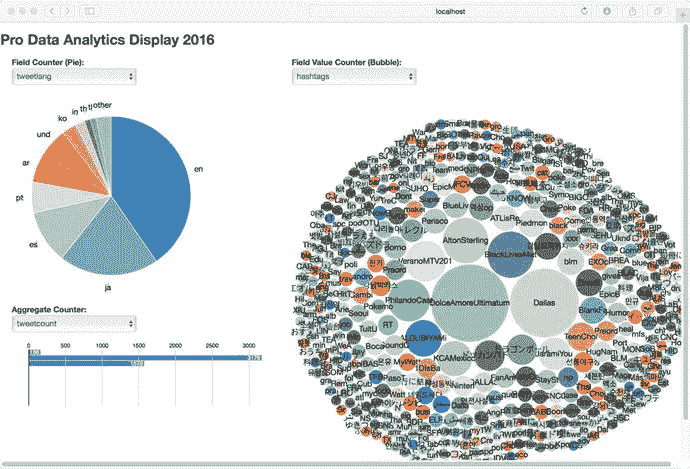
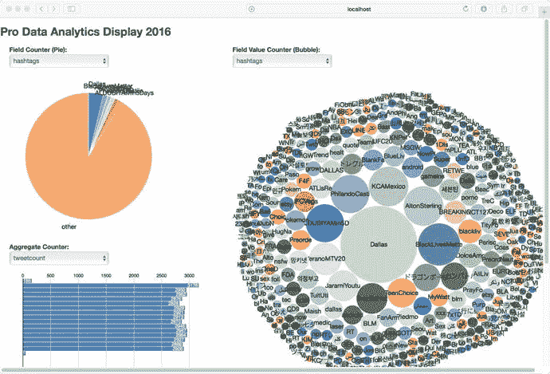
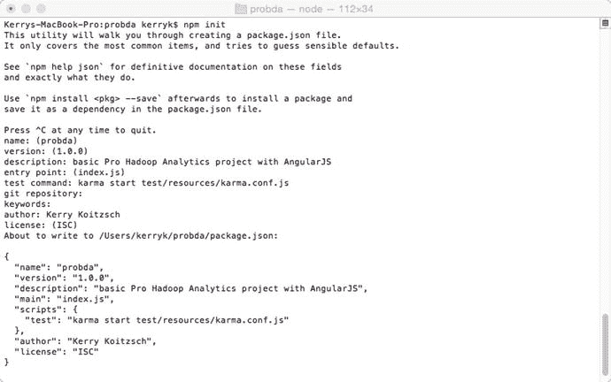
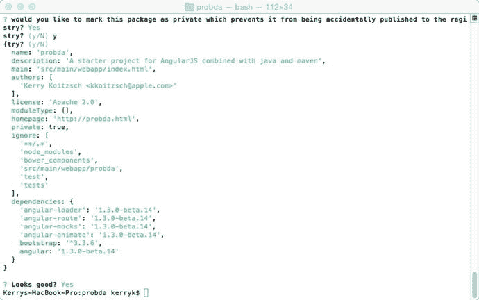
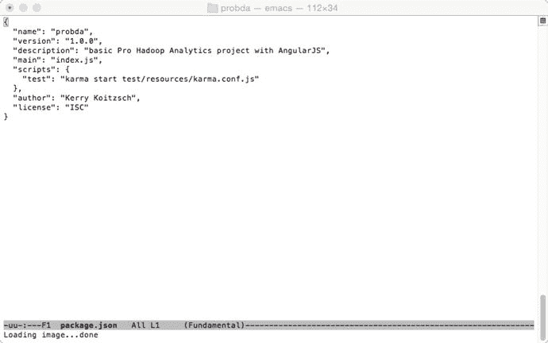
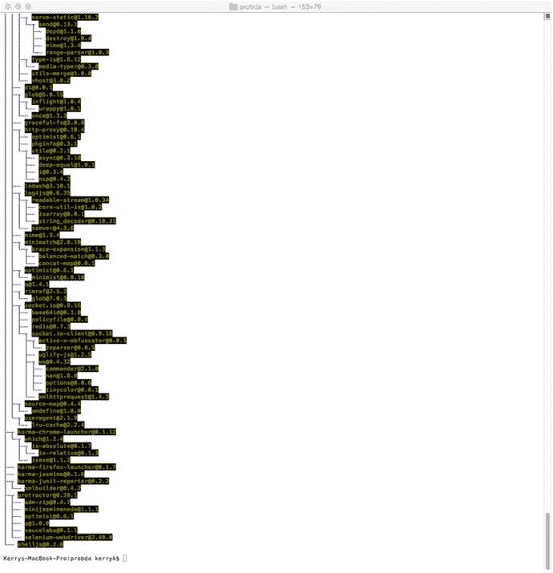
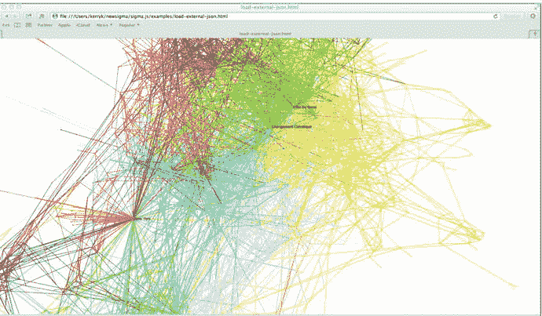
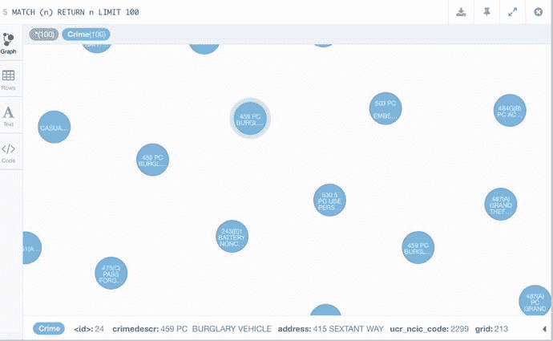

# 十、数据可视化工具：查看分析并与之交互

在这一章中，我们将讨论如何查看—可视化—我们的分析结果。这其实是一个相当复杂的过程，或者说可以。这完全是为您的应用程序所需的可视化类型选择合适的技术堆栈的问题。分析应用程序中的可视化任务可以从创建简单的报表到成熟的交互系统。在本章中，我们将主要讨论 Angular JS 及其生态系统，包括 ElasticUI 可视化工具 Kibana，以及用于图形、图表和表格的其他可视化组件，包括一些基于 JavaScript 的工具，如 D3.js 和 sigma.js。

## 10.1 简单的可视化

最简单的可视化架构之一如图 [10-1](#Fig1) 所示。前端控制界面可以是基于网络的，或者是独立的应用程序。控制 UI 可以基于单个网页，或者更先进的软件插件或多个页面组件。前端的“Glueware”可能涉及可视化框架，比如 Angular JS，我们将在下面的小节中详细讨论。在后端，像 Spring XD 这样的 glueware 可以使可视化界面更加简单。


图 10-1。

Typical visualization component architecture

让我们简单谈谈图 [10-1](#Fig1) 中的不同组件。每个圆圈代表使用分析软件组件时典型用例的不同方面。你可能会认为这些圆圈是我们试图解决的个别子问题或问题。例如，分组、排序、合并和整理可能由一个标准的表格结构来处理，如图 [10-2](#Fig2) 所示。大多数排序和分组问题都可以通过内置的表格功能来解决，比如单击一列来对行进行排序，或者对项目进行分组。


图 10-2。

One tabular control can solve several visualization concerns

提供有效的显示功能非常简单，只需选择适当的表格组件用于面向行的数据。图 [10-2](#Fig2) 所示的表格组件是一个很好的例子，它提供了数据导入、排序、分页和易于编程的特性。此组件在 [`https://github.com/wenzhixin/bootstrap-table`](https://github.com/wenzhixin/bootstrap-table) 可用。这里显示的控件利用一个名为 Bootstrap.js ( [`http://getbootstrap.com/javascript/`](http://getbootstrap.com/javascript/) )的助手库来提供高级功能。能够将 JSON 数据集导入可视化组件是一个关键特性，它支持与其他 UI 和后端组件的无缝集成。

图 [10-1](#Fig1) 中发现的许多问题可以通过嵌入网页的前端控件来控制。例如，我们都熟悉“Google 风格”的文本搜索机制，它只包含一个文本字段和一个按钮。我们可以使用 d3 实现一个可视化工具，对脸书的推文进行简单的分析，作为数据可视化的介绍。如图 [10-2](#Fig2) 和图 [10-3](#Fig3) 所示，我们可以控制显示的“内容”以及“方式”:我们可以看到示例数据集的饼图、条形图和气泡图版本，它来自 Spring XD 数据流。



图 10-3。

Simple data visualization example of Twitter tweets using Spring XD showing trending topics and languages

我们在图 [10-1](#Fig1) 中看到的大多数关注点(数据集选择、显示类型选择和其他)在图 [10-3](#Fig3) 和图 [10-4](#Fig4) 中有所体现。下拉框等标准控件用于选择数据集和显示类型。呈现类型可以包括各种图形和图表类型、二维和三维显示以及其他类型的呈现和报告格式。Apache POI ( [`https://poi.apache.org`](https://poi.apache.org) )等组件可用于编写与 Excel 兼容的微软格式的报告文件。



图 10-4。

An additional simple data visualization example of Twitter tweets using Spring XD

当新的 tweet 数据通过 Spring XD 数据流到达时，这里显示的内容会动态更新。图 [10-3](#Fig3) 显示了推特数据的一个稍微不同的可视化，其中我们可以看到一些圆圈的大小是如何增长的，代表了推特中的数据“趋势”。

我们将在下一节讨论 Spring XD，因为它在构建可视化工具时作为 glueware 特别有用。

Setting Up the Spring XD Component

像所有 Spring 框架组件一样，设置 Spring XD 组件基本上很简单。

安装 Spring XD 后，在“单节点模式”下用

```scala
bin/xd-singlenode
cd bin

```

使用以下命令运行 XD shell

```scala
./xd-shell

```

使用以下命令创建流

```scala
 stream create tweets --definition "twitterstream | log"

 stream create tweetlang  --definition "tap:stream:tweets > field-value-counter --fieldName=lang" --deploy

stream create tweetcount --definition "tap:stream:tweets > aggregate-counter" --deploy

stream create tagcount --definition "tap:stream:tweets > field-value-counter --fieldName=entities.hashtags.text --name=hashtags" --deploy
stream deploy tweets

```


图 10-5。

Architecture diagram for Twitter ➤ Spring XD ➤ visualization


图 10-6。

Bringing up the Spring XD shell successfully


图 10-7。

Using Spring XD to implement a Twitter tweet stream and then sdeploy the stream

在下一节中，我们将深入一些特别有用的工具包 Angular JS 的综合例子。

## 10.2 介绍 Angular JS 和朋友

Angular JS ( [`https://angularjs.org`](https://angularjs.org) )是一个基于 JavaScript 的工具包，已经成为数据可视化库领域非常突出的竞争者。它有一个简单的模型-视图-控制器(MVC)架构，可以简化设计和实现过程。

顺便提一下，一些 Angular JS 组件，如 Elastic UI(elasticui.com ),可以直接开箱即用，与 Elastic 搜索引擎一起使用。带有 Kibana 的 ElasticUI 是添加可视化组件的一种快速且相对容易的方式。

我们将在本章余下的大部分时间里讨论如何使用 Angular JS 和一些其他可视化工具包来设置一些示例，包括一个非常有趣的新成员 JHipster。

## 10.3 使用 JHipster 集成 Spring XD 和 Angular JS

JHipster ( [`https://jhipster.github.io`](https://jhipster.github.io) )是一个开源的 Yeoman()生成器，用于创建集成的 Spring Boot 和 Angular JS 组件。这使得以无缝的方式集成 Spring Framework 生态系统的其他组件成为可能。例如，您可以使用一个基于 Spring Data Hadoop 的组件来构建一个数据管道，在前端使用 AngularJS 编写摘要显示。

我们将构建一个简单的 JHipster 迷你项目来展示这可能是如何工作的。


图 10-8。

Successful setup of a “probda-hipster” project How to Build the Angular JS Example System

构建一个 Angular JS 示例系统相对简单，我们将在本节中描述如何实现。

构建 Angular JS 示例系统的第一步是在命令行上创建原型项目。Cd 到您希望构建的主目录。然后执行下面的命令，如清单 13.1 所示。

```scala
mvn archetype:generate -DgroupId=nl.ivonet -DartifactId=java-angularjs-seed -DarchetypeArtifactId=maven-archetype-webapp -DinteractiveMode=false

```

这将创建如清单 10-2 所示的目录和文件。Cd 到目录，并确保它们确实在那里。

```scala
./pom.xml
./src
./src/main
./src/main/resources
./src/main/webapp
./src/main/webapp/index.jsp
./src/main/webapp/WEB-INF
./src/main/webapp/WEB-INF/web.xml

```

构建新的文件和目录来配置项目，如清单 10-3 所示。

```scala
mkdir -p src/main/java
mkdir -p src/test/java
mkdir -p src/test/javascript/unit
mkdir -p src/test/javascript/e2e
mkdir -p src/test/resources
rm -f ./src/main/webapp/WEB-INF/web.xml
rm -f ./src/main/webapp/index.jsp
mkdir -p ./src/main/webapp/css
touch ./src/main/webapp/css/specific.css
mkdir -p ./src/main/webapp/js
touch ./src/main/webapp/js/app.js
touch ./src/main/webapp/js/controllers.js
touch ./src/main/webapp/js/routes.js
touch ./src/main/webapp/js/services.js
touch ./src/main/webapp/js/filters.js
touch ./src/main/webapp/js/services.js
mkdir -p ./src/main/webapp/vendor
mkdir -p ./src/main/webapp/partials
mkdir -p ./src/main/webapp/img
touch README.md
touch .bowerrc

```

运行 npm 初始化，以交互方式构建程序。“npm init”将提供一个逐步问答的方法来创建项目，如清单 x.y 所示

```scala
npm init

This utility will walk you through creating a package.json file.
It only covers the most common items, and tries to guess sane defaults.

See `npm help json` for definitive documentation on these fields
and exactly what they do.

Use `npm install  --save` afterwards to install a package and
save it as a dependency in the package.json file.

Press ^C at any time to quit.
name: (java-angularjs-seed)
version: (0.0.0)
description: A starter project for AngularJS combined with java and maven
entry point: (index.js)
test command: karma start test/resources/karma.conf.js
git repository: https://github.com/ivonet/java-angular-seed
keywords:
author: Ivo Woltring
license: (ISC) Apache 2.0
About to write to /Users/ivonet/dev/ordina/LabTime/java-angularjs-seed/package.json:

{
  "name": "java-angularjs-seed",
  "version": "0.0.0",
  "description": "A starter project for AngularJS combined with java and maven",
  "main": "index.js",
  "scripts": {
    "test": "karma start test/resources/karma.conf.js"
  },
  "repository": {
    "type": "git",
    "url": "https://github.com/ivonet/java-angular-seed"

  },
  "author": "Ivo Woltring",
  "license": "Apache 2.0",
  "bugs": {
    "url": "https://github.com/ivonet/java-angular-seed/issues"
  },
  "homepage": "https://github.com/ivonet/java-angular-seed"
}

Is this ok? (yes)

```

现在将以下内容添加到文件中:_ _ _ _ _ _ _。



图 10-11。

Additional configuration file for the Angular JS example application



图 10-10。

Configuration file for the Angular JS example


图 10-9。

Building the Maven stub for the Angular JS project successfully on the command line

```scala
{
  "name": "java-angular-seed",
  "private": true,
  "version": "0.0.0",
  "description": "A starter project for AngularJS combined with java and maven",
  "repository": "https://github.com/ivonet/java-angular-seed",
  "license": "Apache 2.0",
  "devDependencies": {
    "bower": "^1.3.1",
    "http-server": "^0.6.1",
    "karma": "∼0.12",
    "karma-chrome-launcher": "^0.1.4",
    "karma-firefox-launcher": "^0.1.3",
    "karma-jasmine": "^0.1.5",
    "karma-junit-reporter": "^0.2.2",
    "protractor": "∼0.20.1",
    "shelljs": "^0.2.6"
  },
  "scripts": {
    "postinstall": "bower install",
    "prestart": "npm install",
    "start": "http-server src/main/webapp -a localhost -p 8000",
    "pretest": "npm install",
    "test": "karma start src/test/javascript/karma.conf.js",
    "test-single-run": "karma start src/test/javascript/karma.conf.js  --single-run",
    "preupdate-webdriver": "npm install",
    "update-webdriver": "webdriver-manager update",
    "preprotractor": "npm run update-webdriver",
    "protractor": "protractor src/test/javascript/protractor-conf.js",
    "update-index-async": "node -e \"require('shelljs/global'); sed('-i', /\\/\\/@@NG_LOADER_START@@[\\s\\S]*\\/\\/@@NG_LOADER_END@@/, '//@@NG_LOADER_START@@\\n' + cat('src/main/webapp/vendor/angular-loader/angular-loader.min.js') + '\\n//@@NG_LOADER_END@@', 'src/main/webapp/index.html');\""
  }
}

```

```scala
{
    "directory": "src/main/webapp/vendor"
}
bower install angular#1.3.0-beta.14
bower install angular-route#1.3.0-beta.14
bower install angular-animate#1.3.0-beta.14
bower install angular-mocks#1.3.0-beta.14
bower install angular-loader#1.3.0-beta.14
bower install bootstrap

bower init
[?] name: java-angularjs-seed
[?] version: 0.0.0
[?] description: A java / maven / angularjs seed project
[?] main file: src/main/webapp/index.html
[?] what types of modules does this package expose?
[?] keywords: java,maven,angularjs,seed
[?] authors: IvoNet
[?] license: Apache 2.0
[?] homepage: http://ivonet.nl
[?] set currently installed components as dependencies? Yes
[?] add commonly ignored files to ignore list? Yes
[?] would you like to mark this package as private which prevents it from being accidentally pub[?] would you like to mark this package as private which prevents it from being accidentally published to the registry? Yes

...

[?] Looks good? (Y/n) Y

{
    "name": "java-angularjs-seed",
    "version": "0.0.0",
    "authors": [
        "IvoNet <webmaster@ivonet.nl>"
    ],
    "description": "A java / maven / angularjs seed project",
    "keywords": [
        "java",
        "maven",
        "angularjs",
        "seed"
    ],
    "license": "Apache 2.0",
    "homepage": "http://ivonet.nl",
    "private": true,
    "ignore": [
        "**/.*",
        "node_modules",
        "bower_components",
        "src/main/webapp/vendor",

        "test",
        "tests"
    ],
    "dependencies": {
        "angular": "1.3.0-beta.14",
        "angular-loader": "1.3.0-beta.14",
        "angular-mocks": "1.3.0-beta.14",
        "angular-route": "1.3.0-beta.14",
        "bootstrap": "3.2.0"
    },
    "main": "src/main/webapp/index.html"
}
rm -rf ./src/main/webapp/vendor
npm install

```

现在我们配置。/src/test/JavaScript/karma . conf . js:



图 10-13。

Data configuration in the package.json file



图 10-12。

Console result of Angular component install

```scala
module.exports = function(config){
  config.set({

    basePath : '../../../',

    files : [
      'src/main/webapp/vendor/angular**/**.min.js',
      'src/main/webapp/vendor/angular-mocks/angular-mocks.js',
      'src/main/webapp/js/**/*.js',
      'src/test/javascript/unit/**/*.js'
    ],

    autoWatch : true,

    frameworks: ['jasmine'],

    browsers : ['Chrome'],

    plugins : [
            'karma-chrome-launcher',
            'karma-firefox-launcher',
            'karma-jasmine',
            'karma-junit-reporter'
            ],

    junitReporter : {
      outputFile: 'target/test_out/unit.xml',

      suite: 'src/test/javascript/unit'
    }

  });
};

```

把下面的内容放进去。/src/main/WEB app/we b-INF/beans . XML:

```scala
<?xml version="1.0" encoding="UTF-8"?>
<beans 
       xmlns:xsi="http://www.w3.org/2001/XMLSchema-instance"
       xsi:schemaLocation="http://xmlns.jcp.org/xml/ns/javaee http://xmlns.jcp.org/xml/ns/javaee/beans_1_1.xsd"
       bean-discovery-mode="annotated">
</beans>

<project  xmlns:xsi="http://www.w3.org/2001/XMLSchema-instance"
         xsi:schemaLocation="http://maven.apache.org/POM/4.0.0 http://maven.apache.org/maven-v4_0_0.xsd">
    <modelVersion>4.0.0</modelVersion>
    <groupId>nl.ivonet</groupId>
    <artifactId>java-angularjs-seed</artifactId>
    <packaging>war</packaging>
    <version>1.0-SNAPSHOT</version>

    <name>java-angularjs-seed Maven Webapp</name>

    <url>http://ivonet.nl</url>

    <properties>
        <artifact.name>app</artifact.name>
        <endorsed.dir>${project.build.directory}/endorsed</endorsed.dir>
        <project.build.sourceEncoding>UTF-8</project.build.sourceEncoding>
    </properties>

    <dependencies>
        <dependency>
            <groupId>junit</groupId>
            <artifactId>junit</artifactId>
            <version>4.11</version>
            <scope>test</scope>
        </dependency>
        <dependency>
            <groupId>org.mockito</groupId>
            <artifactId>mockito-all</artifactId>
            <version>1.9.5</version>
            <scope>test</scope>
        </dependency>

        <dependency>
            <groupId>javax</groupId>
            <artifactId>javaee-api</artifactId>

            <version>7.0</version>
            <scope>provided</scope>
        </dependency>

    </dependencies>
    <build>
        <finalName>${artifact.name}</finalName>
        <plugins>
            <plugin>
                <groupId>org.apache.maven.plugins</groupId>
                <artifactId>maven-compiler-plugin</artifactId>
                <version>3.1</version>
                <configuration>
                    <source>1.8</source>
                    <target>1.8</target>
                    <compilerArguments>
                        <endorseddirs>${endorsed.dir}</endorseddirs>
                    </compilerArguments>
                </configuration>
            </plugin>
            <plugin>
                <groupId>org.apache.maven.plugins</groupId>
                <artifactId>maven-war-plugin</artifactId>
                <version>2.4</version>
                <configuration>
                    <failOnMissingWebXml>false</failOnMissingWebXml>
                </configuration>
            </plugin>
            <plugin>
                <groupId>org.apache.maven.plugins</groupId>
                <artifactId>maven-dependency-plugin</artifactId>
                <version>2.6</version>
                <executions>
                    <execution>
                        <phase>validate</phase>
                        <goals>
                            <goal>copy</goal>
                        </goals>
                        <configuration>
                            <outputDirectory>${endorsed.dir}</outputDirectory>
                            <silent>true</silent>
                            <artifactItems>
                                <artifactItem>
                                    <groupId>javax</groupId>
                                    <artifactId>javaee-endorsed-api</artifactId>

                                    <version>7.0</version>
                                    <type>jar</type>
                                </artifactItem>
                            </artifactItems>
                        </configuration>
                    </execution>
                </executions>
            </plugin>
        </plugins>
    </build>
</project>

```

## 10.4 使用 d3.js、sigma.js 等

D3.js ( [`https://d3js.org`](https://d3js.org) )和 sigma.js ( [`http://sigmajs.org`](http://sigmajs.org) )是流行的用于数据可视化的 JavaScript 库。

d3 和 sigmajs 工具包可能实现的图形可视化示例


图 10-15。

Another typical data visualization of a portion of a graph database



图 10-14。

A portion of a sigma.js-based graph visualization example

我们可以手工制作用户界面来适应我们的应用程序，或者我们可以选择使用一些已经作为独立库、插件和工具包提供的复杂的可视化工具。

回想一下，我们也可以直接从图数据库中可视化数据集。例如，在 Neo4j 中，我们可以在加载 CSV 数据集后浏览萨克拉门托的犯罪统计数据。点击单个节点会导致字段摘要出现在图形显示的底部，如图 [10-16](#Fig16) 所示。



图 10-16。

Browsing crime statistics as individual nodes from a query in a Neo4j graph database

## 10.5 摘要

在这一章中，我们看了分析问题的视觉方面:如何看到和理解我们分析过程的结果。可视化挑战的解决方案可以像 Excel 中的 CSV 报告一样简单，也可以是复杂的交互式仪表板。我们强调了 Angular JS 的使用，这是一个基于模型-视图-控制器(MVC)范式的复杂的可视化工具包。

在下一章中，我们将讨论基于规则的控制和编排模块的设计和实现。规则系统是一种在计算机软件中有着悠久历史的控制系统，并且随着时间的推移，已经在广泛的控制和调度应用中证明了它们的有效性。

我们将发现，基于规则的模块在分布式分析系统中是一个有用的组件，特别是对于在整个应用程序执行中调度和编排单个流程。

## 10.6 参考

福特，布莱恩和鲁贝克，卢卡斯。Angular JS 在行动。马萨诸塞州波士顿:奥赖利出版社，2015 年。

亚当·弗里曼。亲角。纽约州纽约市:阿普瑞斯出版社，2014 年。

弗里斯比，马特。AngularJS Web 应用程序开发指南。英国伯明翰:PACKT 出版社，2013 年。

默里斯科特。面向 Web 的交互式数据可视化。马萨诸塞州波士顿:奥赖利出版社，2013 年。

皮考夫，克利福德 a，图克斯伯里，斯图尔特 k(编辑)。科学可视化的前沿。纽约州纽约市:威利-Interscience，1994 年，

泰勒斯威兹克。用 d3.js 实现数据可视化。英国伯明翰:PACKT 出版公司，2013 年。

沃尔夫，罗伯特 s，耶格尔，拉里。自然现象的可视化。纽约州纽约市:泰洛斯/施普林格出版社，1993 年。

朱，尼克齐。用 D3.js Cookbook 实现数据可视化。英国伯明翰:PACKT 出版社，2013 年。