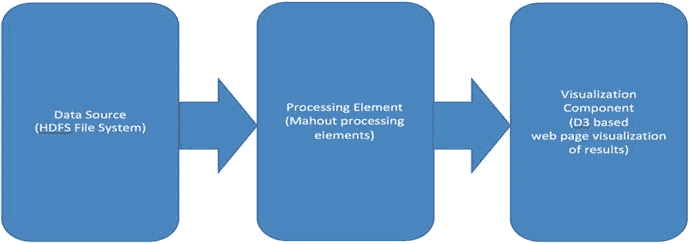
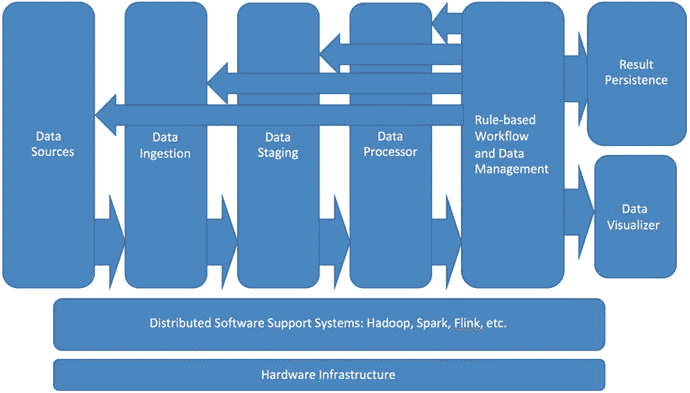
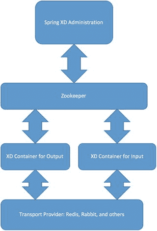

# 十五、构建通用数据管道

在这一章中，我们详细介绍了一个端到端的分析系统，该系统使用了我们在整本书中讨论的许多技术，以提供一个评估系统，用户可以扩展和编辑该系统来创建自己的 Hadoop 数据分析系统。讨论了开发数据管道时使用的五种基本策略。然后，我们看看如何应用这些策略来构建通用数据管道组件。

## 15.1 示例系统的架构和描述

我们在第 [5](05.html) 章构建了一些基本的数据管道。现在是时候将我们提到的思想扩展到更通用的数据管道应用程序中了。

请记住，最简单的数据管道类似于图 [15-1](#Fig1) 。它是由数据传输步骤连接起来的一系列数据处理阶段。数据传输步骤从数据源收集数据，并将其发送到数据接收器。对于不同的传输步骤，传输方法可能不同，并且数据处理级对数据输入执行转换，向后续级发出数据输出。最终输出被输出到数据存储或可视化/报告组件。

图 15-1。

A simple abstraction of a general purpose data pipeline

让我们看一个更真实的通用数据管道的例子。图 [15-2](#Fig2) 显示了一种最简单的有用配置。它由一个数据源(在这个例子中是 HDFS)、一个处理元素(在这个例子中是 Mahout)和一个输出阶段(在这个例子中是一个 D3 可视化工具，它是附带的大数据工具包的一部分)。

图 15-2。

A real-world distributed pipeline can consist of three basic elements

我们的第一个示例将一个数据集导入 HDFS，使用 Mahout 执行一些简单的分析处理，并将分析结果传递给一个简单的可视化组件。

## 15.2 如何获取和运行示例系统

示例系统是一个基于 Maven 的以 Java/Scala 为中心的系统，类似于本书中描述的许多软件组件，可以在 Apress code contribution 站点上找到。详见附录 A 和 B。这个示例系统的安装非常简单:只需遵循软件下载中包含的说明。Java、Ant 和 Maven 等基础设施工具的使用在整本书中都有详细描述，尽管组件的版本号可能已经改变。您可以轻松地在 pom.xml Maven 文件中为您的项目更新版本号。

## 15.3 管道建设的五大策略

本书的大部分内容都提到了数据管道构建的不同策略。虽然软件组件、平台、工具和库可能会发生变化，但数据管道设计的基本战略设计方法保持不变。

构建数据管道有许多策略，但是，从广义上讲，有五种基于“工作方式”的主要策略下面简要讨论这五种基本策略类型。

### 15.3.1 使用数据源和数据汇

当您有预先存在的或遗留的数据源要使用时，从数据源和接收器开始工作是一个很好的组织策略。特别是，这些可能包括关系数据、CSV 平面文件，甚至是充满图像或日志文件的目录。

当使用这种数据源和接收器策略时，一种有组织的方法将包括以下内容:

*   确定数据源/接收器类型，并为数据接收、数据验证和数据清理(如果需要)提供组件。出于这个例子的目的，我们将使用 Splunk、Tika 和 Spring 框架。
*   将“业务逻辑”视为黑盒。最初集中于数据输入和输出以及支持技术栈。如果业务逻辑相对简单，已经打包成一个库，定义良好并且易于实现，我们可以将业务逻辑组件视为一个自包含的模块或“插件”如果业务逻辑需要手工编码或者更复杂

### 中端开发

中间向外的开发意味着它所说的:从应用程序结构的“中间”开始，向任一端努力，在我们的例子中，这将总是过程开始时的数据源和数据管道末端的数据接收器或最终结果存储库。我们首先开发的“中间”本质上是要开发的“业务逻辑”或“目标算法”。我们可以从一般的技术栈考虑开始(比如选择使用 Hadoop、Spark 或 Flink，或者使用其中一种或多种的混合方法)。

### 15.3.3 基于企业集成模式(EIP)的开发

基于 EIP 的开发是开发管道的有用方式。正如我们所看到的，一些标准工具包是专门为实现 EIP 组件而设计的，系统的其他部分可以使用 EIPs 来概念化。让我们先看几张 EIP 图。

图 15-3。

A simple Enterprise Integration Pattern (EIP)

我们可以使用任何免费提供的 EIP 图编辑器，如 draw.io 工具(draw.io)或 Omnigraffle (omnigraffle.com)，来绘制 EIP 图。然后，我们可以使用 Spring Integration 或 Apache Camel 来实现管道。

关于 EIP 符号的完整描述可以在 Hohpe 和 Woolf (2004)中找到。

抽象图图 [15-4](#Fig4) 中显示的组件可以使用 Apache Camel 或 Spring 集成来实现。这两个端点分别是数据接收和数据持久化。类似电视屏幕的小符号表示数据可视化组件和/或管理控制台。

图 15-4。

A more extended example of an EIP

### 15.3.4 基于规则的消息传递渠道开发

我们在第 [8](08.html) 章讨论了基于规则的系统以及它们如何用于控制、调度和面向 ETL 的操作。然而，基于规则的系统可以作为数据流水线流程的中心或核心控制机制，如图 [15-5](#Fig5) 所示。

图 15-5。

A rule-based data flow pipeline architecture

图 [15-5](#Fig5) 显示了基于规则的数据管道的典型架构，其中管道中的所有处理组件都由基于规则的工作流/数据管理组件控制。让我们看看这样一个架构是如何实现的。

### 15.3.5 控制+数据(控制流)流水线

当我们定义一个控制机制和要控制的数据阶段时，我们基本上可以回到经典的管道-过滤器设计模式，如图 15-7 的 EIP 图所示。

图 15-6。

An EIP diagram showing a different incarnation of the data pipeline

## 15.4 摘要

在本章中，我们讨论了通用数据管道的构建。通用数据管道是大数据分析系统的重要起点:无论是在概念上还是在现实世界的应用构建中。这些通用管道充当更多特定应用扩展以及实验性概念验证系统的暂存区，这些系统在进一步开发之前可能需要更多的修改和测试。从一个强大的通用技术基础开始，可以更容易有效地执行返工，并在应用程序需求发生变化时“后退一步”。

讨论了五种基本的管道构建策略:从源和汇开始工作，中间向外开发(以分析堆栈为中心的开发)，企业集成模式(EIP)管道开发，基于规则的消息传递管道，以及控制+数据(控制流)管道。还讨论了支持这五种通用流水线策略的支持库、技术和代码。

在下一章也是最后一章，我们将讨论大数据分析的未来发展方向，以及这类系统的未来发展趋势。

## 15.5 参考

霍佩，格雷戈尔，和伍尔夫，鲍比。企业集成模式:设计、构建和部署消息传递解决方案。波士顿，麻州:艾迪生-卫斯理出版公司，2004 年。

易卜生，克劳斯，和安斯利，乔纳森。骆驼在行动。康涅狄格州斯坦福德:曼宁出版公司，2011 年。

卡维斯迈克尔。云计算服务模型的设计决策。新泽西州霍博肯:约翰·威利父子公司，2014 年。

麦，加里。春季食谱:解决问题的方法。纽约州纽约市:斯普林格出版社，2008 年。