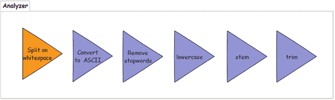
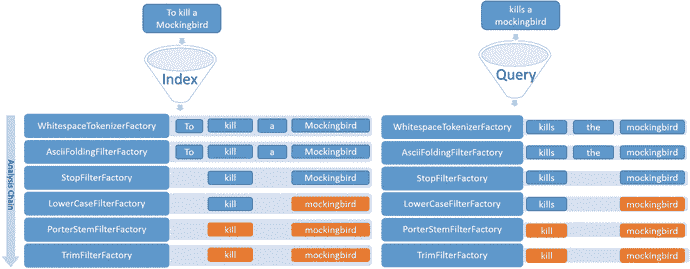
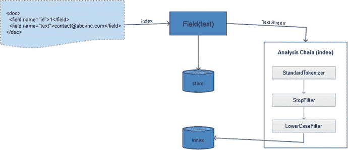
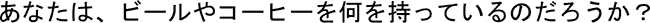

# 四、模式设计和文本分析

Solr 中的搜索引擎开发最初遵循四个连续的步骤:Solr 设置、模式设计、索引文档和搜索结果。模式设计是定义数据结构的过程，是索引和搜索过程的先决条件。

本章包括定义字段、指定类型和其他功能。

文本分析在信息检索中的作用至关重要。是文本分析过程决定了术语(最小的信息，用于文档的匹配和评分)。本章涵盖了文本分析过程，包括分析器做什么，Solr 中可用的各种分析器/记号赋予器，以及将它们链接在一起。

在本章中，你将学习在无模式模式下运行 Solr，使用托管模式，以及使用 REST APIs。

本章分为以下几节:

*   模式设计
*   文本分析
*   无模式化
*   用于管理模式的 REST API
*   solrconfig.xml 文件
*   常见问题

## 模式设计

模式设计是构建有效搜索引擎的最基本步骤之一。它是定义数据结构并应用文本分析来控制匹配行为的过程。

在定义模式之前，您应该理解您试图解决的问题，并准备好您的策略。你应该能够回答几个问题，包括这些:你用 Solr 做什么？你会提供什么样的搜索体验？数据的哪一部分应该是可搜索的？要检索什么信息？

Solr 通常用于索引非规范化数据。如果您的数据是规范化的，您可能希望在建立索引之前将其展平并定义结构。如果完全反规范化是一个挑战，Solr 允许您连接索引。但是 Solr 中的连接不同于数据库连接，它有自己的局限性。Solr 还支持索引层次数据，具有父子关系。第 7 章介绍了这些高级搜索功能。

所有的搜索引擎都是独一无二的，要么是因为领域、数据的性质，要么是其他因素。可以对全文或元数据进行搜索。此外，Solr 不仅仅局限于作为一个文本搜索引擎，它还被广泛用作 NoSQL 数据库和执行分析；已经看到了许多新的创新用例。例如，一个名为 Lucene Image Retrieval (LIRE)的项目使用 Solr 进行图像搜索。

如果您使用 Solr 作为 NoSQL 数据存储，或者想要快速开始，或者没有完整的数据可见性，或者正在使用动态的数据结构，您可以选择无模式，让 Solr 自动检测`fieldType`和索引文档。从 5.0 版开始，Solr 默认以无模式模式创建一个内核。在本章的最后你会学到更多关于这个主题的知识。

### 文档

在 Solr 中，每个搜索结果对应一个文档。这个基本的信息单元类似于数据库表中的记录。开发搜索引擎时，模式设计的第一步是确定搜索引擎的文档内容。相同的数据可以用不同的方式表示和索引，文档的定义也可以不同，这取决于您对引擎及其用途的预期结果。

比如印度电影业，大部分电影都有五到十首歌。如果你正在构建一个电影搜索引擎，每部电影就是一个文档。每个文档包含多首歌曲，索引为一个`multiValued`字段。相比之下，如果您正在构建一个音乐搜索引擎，每首歌曲的名称将是一个唯一的文档，而电影名称在这些文档中是多余的。

类似地，如果您正在开发一个在线书店，每本书或期刊都将是一个文档，其中包含 ISBN、书名、作者和出版商等信息。但是如果你正在为研究人员开发一个搜索引擎，也许这本书或杂志的每一章、主题或文章都可以是一个文档。

### schema.xml 文件

`schema.xml`文件定义了文档结构及其包含的字段。向 Solr 添加数据或查询结果时会用到这些字段。在下一节中，您将了解 Solr 中的字段。

在 Solr 中，`schema.xml`和`solrconfig.xml`是两个主要的配置文件。通常你会用它们来修改你的搜索策略和增强用户体验。这些文件可以位于`$SOLR_HOME`内核的`conf`目录中，也可以位于指定的配置集中。

`schema.xml`文件有明确的目的，而`solrconfig.xml`文件用于所有其他配置。以下是`schema.xml`支持的配置列表:

*   定义`field type` s 和文本分析，如果支持的话
*   定义每个字段及其适用的属性
*   定义动态字段
*   指定评分算法
*   将数据从一个字段复制到另一个字段
*   指定其他与字段相关的定义，例如唯一字段或默认字段的标识

Note

本章末尾讨论了`solrconfig.xml`文件。

正如文件扩展名`schema.xml`所述，配置是以 XML 格式指定的，其中`<schema>`是根元素。该元素支持两个属性:`name`和`version`。`name`属性为可用于显示的模式指定一个名称。属性声明支持的语法和行为的版本号。Solr 5.3.1 的最新版本是 1.5。以下是一个样本`schema.xml`文件:

`<schema name="example" version="1.5">`

`<field name="title" type="string" indexed="true" stored="true"/>`

`<field name="isbn" type="string" indexed="true" stored="true"/>`

`..`

`<fieldType name="string" class="solr.StrField" sortMissingLast="true"/>`

`<fieldType name="int" class="solr.TrieIntField" precisionStep="0" positionIncrementGap="0"/>`

`..`

`</schema>`

应该重新加载核心以反映该文件中的任何更改。如果在索引时处理过程中进行了任何更改，那么在重新加载核心之后，应该重新索引文档。

### 菲尔茨

文档中的每一部分信息(例如，ISBN、书名、作者和出版商)都是一个字段，类似于数据库表中的一列。以下是`schema.xml`中一个字段的示例定义:

`<field name="title" type="string" indexed="true" stored="true"/>`

`<field name="isbn" type="string" indexed="true" stored="true"/>`

`..`

Solr 支持一组属性来配置字段的行为。在这些属性中，`type`定义了`fieldType`，它类似于 Java 的数据类型，但功能更强大。它将字段链接到索引和查询时要对其数据执行的分析链。

Note

Solr 的早期版本要求在`<fields>`元素中定义字段。最近的版本已经简化了结构，您可以直接在`<schema>`元素中指定字段。

#### 字段属性

以下是字段支持的属性的描述。您还可以在`field`元素中定义`fieldType`的属性，这将覆盖在`fieldType`元素中指定的值。

##### 名字

这个强制参数为字段指定一个名称，在对其执行任何操作(如索引、查询和突出显示)时都会引用该名称。

您只能使用字母字符、数字和下划线来命名字段。名称区分大小写。以下划线开头和结尾的名称(如`_version_`和`_root_`)被保留。

命名字段没有其他规范，但是建议遵循一个约定—例如，保持所有单词小写并用下划线分隔，或者遵循 camel 大小写以提高可读性。

##### 类型

该强制参数指定了`fieldType`的名称。您将在下一节了解更多关于`fieldType`的内容。

##### 系统默认值

此参数指定为文档编制索引时未提供值的字段的默认值。

当您希望自动索引字段的值而不是在每个文档中指定它时，此参数也很有用。一个经典的例子是索引时间戳，它指示文档被添加到 Solr 的时间。以下是用于索引时间戳的字段定义示例:

`<field name="timestamp" type="date" indexed="true" stored="true"``default="NOW"`T2】

在这个例子中，`type="date"`属性将`fieldType`指定为`TrieDateField`，并且`NOW`被提供为`default`属性的值，该值指定当前时间戳。

该示例还包含`indexed`和`stored`属性，它们是`fieldType`的属性，已经在我们的字段定义中被覆盖。有些`fieldType`参数通常会被字段覆盖，这种情况经常发生，以至于你可能会觉得它们是`field`而不是`fieldType`的属性。

#### 保留字段名称

Solr 保留了以下划线开头和结尾的字段名，用于特殊目的。以下是一些保留字段名称:

*   `_version_` : Solr 使用该字段进行事务日志记录，以支持 SolrCloud 中文档的乐观锁定和实时 get 操作。
*   `_root_`:支持嵌套文档(层次数据)需要该字段。它标识嵌套文档块中的根文档。
*   `_text_`:该字段为预定义的总括字段，支持无模式下的单字段搜索。

### 螺纹类型

`fieldType`元素决定了一个字段可以保存的值的类型、应该如何解释该值、可以对其执行的操作以及该字段将经历的文本分析。

字段类型的重要性在 Solr 中至关重要。字段类型和指定的分析链决定了在索引和查询文档时要应用的文本分析管道。匹配策略可以表示为字段定义中的一系列分析器、记号赋予器和记号过滤器。每当您想要调整查询词的搜索以匹配或不匹配索引词时，您通常会更改`fieldType`定义或其分析链。

下面是一个`fieldType`元素的例子，其中`name`是`fieldType`标识符，`class`是 Solr 的实现类名，`sortMissingLast`是实现类所需的属性:

`<fieldType name="string" class="solr.StrField" sortMissingLast="true" />`

Note

Solr 的早期版本要求在`<types>`元素中定义字段类型。最近的版本已经简化了结构，可以在`<schema>`元素中直接指定字段类型。

支持的值的类型、字段的行为以及要对字段执行的文本分析取决于三种类型的配置:

*   实现类
*   属性
*   文本分析

接下来将对每种方法进行描述。

#### 实现类

实现类实现字段类型的功能。它决定了字段可以容纳的值的类型以及应该如何解释这些值。为了定制文本处理，实现类通常支持一组属性，其中一些被标记为强制的。

根据数据和要在字段上执行的操作类型，您需要选择一个`fieldType`。假设你的数据是布尔型的；您将选择实现类`solr.BoolField`。如果您的数据是整数类型，您可以选择实现类`solr.TrieIntField`。表 [4-1](#Tab1) 显示了 Solr 提供的数据类型和支持的实现类。

表 4-1。

Primary Data Types Provided and Their Implementation Classes

<colgroup><col> <col></colgroup> 
| 数据 | 实现类 |
| --- | --- |
| 线 | `solr.StrField` `solr.TextField` |
| 布尔代数学体系的 | `solr.BoolField` |
| 数字 | `solr.TrieIntField` `solr.TrieLongField` |
| 浮动 | `solr.TrieFloatField` `solr.TrieDoubleField` |
| 日期 | `solr.TrieDateField` `solr.DateRangeField` |
| 二进制数据 | `solr.BinaryField` |
| 空间坐标数据 | `solr.LatLonType``solr.PointType`T2】 |
| 闭集值 | `solr.EnumField` |
| 随机唯一 ID | `solr.UUIDField` |
| 外部来源的价值 | `solr.ExternalFileField` |

以下是关于实现类的一些要点:

*   添加到`solr.StrField`的文本按原样被索引和查询。没有分析(没有修改)可以应用于它。如果你想用空格分割输入的文本或者把它变成小写，那么`solr.StrField`并不适合你`fieldType`。如果您想按原样索引文本，它是合适的—例如，在文档标识符(如产品 SKU)的情况下。
*   `solr.TextField`允许您对文本执行定制分析，方法是应用一个包含分析器或标记器的链，以及在索引或查询文档时可以应用的标记过滤器列表。在执行分析时，您可以以任何想要的方式转换文本；例如，您可以拆分令牌、引入新令牌、删除令牌或用另一个令牌替换一个令牌。
*   `solr.DateRangeField`提供了在查询中表示日期范围的附加条款。与`solr.TrieDateField`的另一个区别是响应格式是字符串而不是日期。

有关 Solr 中可用字段类型的完整列表，请参考位于 [`https://cwiki.apache.org/confluence/display/solr/Field+Types+Included+with+Solr`](https://cwiki.apache.org/confluence/display/solr/Field+Types+Included+with+Solr) 的 Solr 官方指南。

Note

以`solr`开头的类名是指一个标准包中的 Java 类(比如`org.apache.solr.analysis`)，不需要提供完整的包名。

#### 字段类型属性

在定义`fieldType`时，可以将附加属性指定为元素的一部分。这些属性可以是通用的，可以应用于任何`fieldType`，也可以是特定于实现类的。

下面是一个示例`fieldType`定义，用于具有不同的`precisionStep`属性值的数值数据。`precisionStep`属性支持更快范围的查询，但是增加了索引的大小。如果需要对字段执行范围查询，使用`fieldType tint`。否则，使用`fieldType int`。`precisionStep="0"`禁用不同精度级别的索引数据。

`<fieldType name="int" class="solr.TrieIntField"`

`precisionStep="0" positionIncrementGap="0" sortMissingLast="true"/>`

`<fieldType name="tint" class="solr.TrieIntField"`

`precisionStep="8" positionIncrementGap="0" sortMissingLast="true"/>`

在这个例子中，`sortMissingLast`是可以应用于任何`fieldType`的通用属性，`precisionStep`是实现类`TrieIntField`的属性。

以下是 Solr 提供的主要`fieldType`属性。

##### 编入索引的

要使字段可搜索，必须对其进行索引。如果您要查询匹配文档的字段，必须通过设置属性`indexed="true"`对其进行索引。只有在启用该属性时，才能对生成的令牌进行索引，并使术语变得可搜索。如果您设置了`indexed="false"`，这个字段上的查询操作将不会获取任何结果，因为没有术语被索引。

当您添加一个永远不会被查询的显示字段时，您可以设置`indexed="false"`。

##### 存信息的

只能显示存储的字段。如果您设置了`stored="false"`，则无法显示该字段中的数据。

当您知道您永远不会将该字段的值返回给用户时，您可以设置`stored="false"`。此外，如果您将相同的文本索引到多个字段以执行不同的分析，在这种情况下，您可以将所有副本设置为`indexed="true"`并只存储它的一个副本。无论何时需要显示值，都可以从存储的字段中获取。以下是这种情况的模式定义示例:

`<field name="title" type="string" indexed="true" stored="true"/>`

`<field name="title_ws" type="text_ws" indexed="true" stored="false"/>`

`<field name="title_gen" type="text_general" indexed="true" stored="false"/>`

假设您想要查询并显示`title_gen`字段。在这种情况下，查询`title_gen`字段并显示`title`字段。下面是针对这种情况的一个示例查询:

`$ curl``http://localhost:8983/solr/hellosolr/select?q=user`T2】

如果可能，设置`stored="false"`，因为它将提供更好的性能并减小索引大小(存储信息的大小)。存储的字段越大，检索起来就越费钱。

以下是索引和存储参数的可能组合:

*   `indexed="true" & stored="true"`:当您对查询和显示字段的值都感兴趣时。
*   `indexed="true" & stored="false"`:当你想查询一个字段，但不需要显示它的值时。例如，您可能希望只查询提取的元数据，但显示从中提取元数据的源字段。
*   `indexed="false" & stored="true"`:如果你从来不打算查询一个字段，只显示它的值。
*   `indexed="false" & stored="false"`:忽略字段的输入值。如果被索引的文档或 Lucene 查询包含一个不存在的字段，Solr 可能会报告一个异常。您可以通过创建一个被忽略的字段(禁用这两个属性的字段)来处理此异常。现在，假设您有一个从字段中提取元数据的更新处理器，并且您只对提取的元数据感兴趣，而对非结构化字段的值不感兴趣。这个属性对于忽略这样的字段非常有用。

Note

需要注意的是，存储在字段中的值是它接收到的原始值，而不是经过分析的值。如果要在存储值之前对其进行转换，应该使用转换器或预处理器来完成转换。第 5 章涵盖了这一主题。

##### 需要

将该属性设置为`true`会指定一个强制字段。如果被索引的文档不包含任何字段值，则不会被索引。默认情况下，所有字段都设置为`required="false"`。

##### 多值的

此布尔参数指定字段是否可以存储多个值。例如，一首歌可以有多个歌手，一个杂志可以有多个作者，等等。您可能希望将歌手和作者字段设置为`multiValued="true"`。以下是`schema.xml`中对`singer`和`author`字段的示例定义:

`<field name="singer" type="string" indexed="true" stored="true" multiValued="true"/>`

`<field name="actor" type="string" indexed="true" stored="true" multiValued="true"/>`

因为您通常索引非规范化的数据，所以在`schema.xml`中很少有`multiValued`字段是很常见的。如果您将数据从多个源字段复制到一个目标字段，请确保您将目标字段定义为`multiValued`，因为 Solr 不允许将多个值复制到一个单值字段。如果源字段是`multiValued`，那么目的字段也应该定义为`multiValued`。默认情况下，所有字段都是单值的。

##### 文档值

`docValues`是 Solr 4.0 中引入的一个有趣的特性。如果该布尔参数设置为`true`，则为该字段创建一个前向索引。倒排索引在排序、分面和突出显示方面效率不高，这种方法有望提高速度，并释放`fieldCache`。以下是启用了`docValues`的字段定义示例:

`<field name="language" type="string" indexed="true" stored="false" docValues="true"/>`

启用`docValues`需要重新索引所有文档。

##### 排序丢失优先/排序丢失最后

这两个属性都有助于处理排序场景，在这种场景中，被排序的字段不包含某些文档的任何值。在字段上指定`sortMissingLast="true"`属性会将没有字段值的文档排在最后(在包含字段值的文档之后)。相反，指定`sortMissingFirst="true"`对结果集顶部没有字段值的文档进行排序。无论排序顺序是升序还是降序，都会保持这个位置。

默认情况下，这两个属性都设置为`false`，在这种情况下，升序排序会将所有缺少值的文档放在最前面，降序排序会将所有缺少值的文档放在最后。

##### 位置增量间隙

在内部，`multiValued`字段通过填充值之间的空格来实现(在一个值的最后一个标记和下一个值的第一个标记之间)。可选属性`positionIncrementGap`指定值之间的虚拟空格数，以避免错误的短语匹配。

假设一个文档的`multiValued`字段`singer`有两个值`bob marley`和`elvis presley`。如果您指定`positionIncrementGap="0"`，短语 query marley elvis 将匹配该文档，因为没有填充，它被视为同一个令牌流的一部分。如果您指定`positionIncrementGap="100"`，即使是带有中度 slop 的短语也不会匹配，因为 marley 和 elvis 相距一百个空格。

##### 精确步骤

这是一个高级主题，用于对数值和日期字段执行更快的范围查询。范围查询是对具有指定范围内的字段值的文档的搜索请求，例如价格范围为$500 到$1，000 的产品。范围查询在第 6 章中有更详细的介绍。

Solr 为数值字段指定的默认精度步长是 4，这对于执行更快的范围查询是最佳的。如果您不需要对数值字段执行范围查询，请指定`precisionStep="0"`，这将提供更高效的排序。Solr 提供的`schema.xml`包含一般用途的数值型字段，如 int、float、`precisionStep="0"`和前缀为 t 的字段，如`tint`、`precisionStep="8"`用于需要范围查询的数值型字段。

步长值越小，生成的令牌越多，范围查询的速度越快，但消耗的磁盘空间也越多。通常，该值应保持在 1 到 8 之间。具体实现请参考 [`http://lucene.apache.org/core/5_3_1/core/org/apache/lucene/search/NumericRangeQuery.html#precisionStepDesc`](http://lucene.apache.org/core/5_3_1/core/org/apache/lucene/search/NumericRangeQuery.html#precisionStepDesc) 的 Lucene Javadoc。

##### omitNorms

字段有与之相关联的规范，它包含额外的信息，如索引时间提升和长度规范化。指定`omitNorms="true"`会丢弃这些信息，从而节省一些内存。

长度规范化允许 Solr 对较长的字段赋予较低的权重。如果长度规范在您的排序算法中不重要(比如元数据字段)，并且您没有提供索引时间提升，那么您可以设置`omitNorms="true"`。默认情况下，Solr 禁用基本字段的规范。

##### omitTermFreqAndPositions

索引张贴还存储诸如词频、位置信息和有效载荷(如果有的话)之类的信息。您可以通过设置`omitTermFreqAndPositions="true"`来禁用这些附加信息。禁用此属性可以节省内存，减小索引大小，并提供更好的性能。如果您需要支持字段上的查询，如短语查询或跨度查询，您不应该禁用`omitTermFreqAndPositions`，因为这些查询依赖于位置信息。在文档中出现频率较高的查询术语通常被认为与全文域更相关，并且该信息由术语频率维护。因此，您可能不希望在全文字段中禁用它。

##### 省略位置

指定布尔属性`omitPosition="true"`省略了位置信息，但保留了术语频率。

##### 术语向量

指定布尔属性`termVectors="true"`保留了完整的术语向量信息。该属性一般与`termPositions`和`termOffsets`一起使用。这些由诸如突出显示和“更像这样”之类的功能使用，以提供更好的性能；否则，将使用存储的值重新分析该字段。

##### 期限头寸

指定布尔参数`termPositions="true"`会保留术语在文档中的位置。

##### 术语偏移量

指定布尔参数`termOffsets="true"`会保留文档中术语的偏移信息。

##### 术语有效负载

指定布尔参数`termPayloads="true"`将保留文档中该术语的有效负载信息。有效负载允许您给术语添加数值，您可以在评分中使用该数值。当您想给一个术语(如名词或相关词)一个高权重时，这个特性很有用。

Tip

如果记住类的实现、属性和(尚未涉及的)文本分析似乎太多而难以消化，不要担心！设计自己的模式的最好方法是使用 Solr 发行版中提供的成熟的`schema.xml`并编辑它。在 Solr 5.x 中，命名配置集`sample_techproducts_configs`中提供的`schema.xml`文件可以作为设计模式的参考点。

#### 文本分析(如果适用)

表 [4-1](#Tab1) 介绍了字符串数据的字段类型`solr.` `TextField`。`TextField`是一个字段类型的特殊实现，它支持带有单个标记器和多个标记过滤器的可配置链的分析器进行文本分析。分析器可以将输入文本分解成标记，这些标记用于匹配，而不是对整个文本执行精确匹配。反过来，`solr.StrField`只执行精确匹配，不能应用分析器。

关于`TextField`的文本分析将在下一节详细介绍。

### copyField(复制字段)

您可能希望以多种方式分析同一文本，或者将多个字段中的文本复制到单个字段中。`schema.xml`中的`copyField`元素提供将数据从一个字段复制到另一个字段的功能。您在`source`属性中指定复制源字段名称，在`dest`属性中指定复制目的字段名称，每当您添加包含源字段的文档时，Solr 将自动将数据复制到目的字段。下面是一个`copyField`的例子，它将`album`字段的文本复制到多个字段进行不同的分析:

`<copyField source="album" dest="album_tokenized"/>`

`<copyField source="album" dest="album_gram"/>`

`<copyField source="album" dest="album_phonetic"/>`

如果您将数据从多个源复制到一个目标，或者任何源字段是`multiValued`，请确保目标字段也被定义为`multiValued="true"`。否则，Solr 将在索引文档时抛出异常。

#### 复制字段属性

以下是`copyField`支持的属性。

##### 来源

`source`属性指定要从中复制数据的字段。源字段必须存在。字段名可以以星号开始和结束，以便从所有匹配该模式的源字段中复制。

##### 建筑环境及 HVAC 系统模拟的软件平台

`dest`属性指定数据将被复制到的目标字段。目标字段必须存在。字段名可以以星号开始和结束，以便将文本复制到与模式匹配的所有目标字段。只有在源字段中指定了通配符，才能在目标字段中指定通配符。

##### 麦斯查斯

这个可选的 integer 属性允许您检查字段大小，防止索引急剧增长。如果索引到目标字段的字符数超过了`maxChars`值，这些多余的字符将被跳过。

### 定义唯一键

`schema.xml`中的元素`<uniqueKey>`类似于数据库中的主键。此元素指定唯一标识文档的字段名称。下面是一个示例定义，它将一本书的`isbn`指定为文档的唯一标识符。

`<uniqueKey>isbn</uniqueKey>`

声明一个`uniqueKey`不是强制性的，但是强烈建议定义它。您的应用程序也很有可能有一个。以下是定义`uniqueKey`字段的规则和建议:

*   该字段应为字符串或 UUID 类型。
*   对该字段的任何索引时间分析都可能破坏 SolrCloud 中的文档替换或文档路由，应该避免。
*   具有多个标记的字段不允许作为`uniqueKey`。
*   动态字段不能用于声明`uniqueKey`。
*   不能使用`copyField`填充该字段的值。

如果您为一个文档编制索引，并且另一个文档已经存在，并且具有相同的唯一键，则现有文档将被覆盖。要更新文档而不是替换它，请使用 Solr 的原子更新特性。第 5 章提供了更多关于原子更新的细节。

### 动态字段

Solr 允许您通过指定创建字段的模式来定义动态字段，而不是显式声明所有字段。当索引一个文档时，如果任何指定的字段没有在`schema.xml`中定义，Solr 会寻找一个匹配的动态字段模式。如果一个模式存在，Solr 创建一个在`<dynamicField>`元素中定义的`fieldType`的新字段。

如果您想要对多个字段执行类似的分析，那么您可以为那个`fieldType`定义一个`dynamicField`，而不是显式地声明它们。假设您想要为字段电影名称、演员和导演创建 N 元语法。您可以创建如下所示的动态字段，而不是为每个字段显式定义字段:

`<dynamicField name="*_gram" type="ngrams" indexed="true" stored="false"/>`

同样，如果您正在执行多语言操作，动态字段对于存储特定于语言的信息会很有用:

`<dynamicField name="*_ut_en" type="ngrams" indexed="true" stored="true"/>`

`<dynamicField name="*_ut_fr" type="ngrams" indexed="true" stored="true"/>`

`<dynamicField name="*_ut_sp" type="ngrams" indexed="true" stored="true"/>`

有时，直到文档被索引时，您才知道字段类型—例如，从富文档中提取元数据时。在这种情况下，动态字段很有用。

`dynamicField`元素支持与字段定义相同的属性，所有行为保持不变。

### 默认搜索字段

如果搜索请求不包含要查询的字段名，Solr 将搜索默认字段。此元素指定要查询的默认字段。下面是一个不包含字段名的示例查询，Solr 使用默认字段进行查询。

schema.xml:

`<defaultSearchField>aggregate_text</defaultSearchField>`

Sample query:

`select?q=solr rocks&defType=standard // lucene`

`select?q=solr rocks&defType=edismax  // qf parameter is not specified`

在 Solr 3.6 中，该元素已被弃用，不应用作后备。相反，应该使用`df`请求参数。

### 索尔克尔·帕塞尔

如果查询中没有指定操作符，这个元素指定查询解析器使用的默认操作符。此处提供了一个示例`solrQueryParser`定义:

`<solrQueryParser defaultOperator="OR"/>`

这个元素从 Solr 3.6 开始就被弃用了，应该用`q.op`请求参数来代替。

### 类似

Lucene 使用`Similarity`类实现对文档评分。要使用默认实现之外的实现，可以通过使用该元素并在`class`属性中指定类名来声明它。下面是`schema.xml`中默认相似性的规范:

`<similarity class="solr.DefaultSimilarityFactory"/>`

可以对所有字段或特定字段应用不同的相似性算法。以下是在特定字段上指定不同相似性的示例:

`<fieldType name="text_ib">`

`<analyzer/>`

`<similarity class="solr.IBSimilarityFactory">`

`<str name="distribution">SPL</str>`

`<str name="lambda">DF</str>`

`<str name="normalization">H2</str>`

`</similarity>`

`</fieldType>`

`<similarity class="solr.SchemaSimilarityFactory"/>`

相似性实现在第 8 章中有更详细的介绍。

## 文本分析

我们对模式设计的讨论提供了文本分析的概述。在本节中，您将更详细地了解这一过程。

分析是将文本流转换成术语的阶段。术语是 Lucene 用来匹配和计算文档分数的最小信息单位。术语不一定是输入文本中的单词；术语的定义取决于你如何分析文本流。术语可以是整个输入文本、两个或多个单词的序列、单个单词或文本流中任何字符的序列。

图 [4-1](#Fig1) 描述了一个例子:由于不同的分析，相同的输入文本流发出不同的术语。如您所见，`KeywordTokenizerFactory`没有对流进行任何更改，发出的术语是整个输入文本；相比之下，`WhitespaceTokenizerFactory`在空白上拆分，并发出多个术语。在本章的后面，你会学到分析器和记号赋予器。

图 4-1。

Text stream and the emitted terms

为了理解匹配行为，表 [4-2](#Tab2) 提供了几个简单的用户查询，这些用户查询通过该分析在字段上进行搜索(或匹配)。为了简单起见，该表提供了一个单词的查询，您可以假设在查询时没有执行任何分析。

表 4-2。

Query Match Status

<colgroup><col> <col> <col> <col></colgroup> 
| 询问 | Tokenizer | 匹配状态 | 描述 |
| --- | --- | --- | --- |
| 拿铁咖啡 | `KeywordTokenizerFactory` | 不匹配 | "喝拿铁咖啡或卡布奇诺."是索引术语。 |
| 拿铁咖啡 | `WhitespaceTokenizerFactory` | 比赛 | “拿铁”是索引术语。 |
| 拿铁咖啡 | `WhitespaceTokenizerFactory` | 不匹配 | 索引术语是“latte ”,由于大小写不同，这些术语不会匹配。 |
| 卡普契诺咖啡 | `WhitespaceTokenizerFactory` | 不匹配 | 索引术语“卡布奇诺”包含一个额外的句点，因此术语不同。 |

如果您在标记化之后应用了`PatternReplaceCharFilterFactory`来删除特殊字符，那么表 [4-2](#Tab2) 中的 Cappuccino 查询将会匹配。

这些是简单的示例，您可以根据需要应用其他处理(例如小写、转换为最接近的 ASCII 字符或删除特殊字符和符号)。您执行的处理取决于您的匹配要求；这并不是说使用`KeywordTokenizerFactory`进行的分析是错误的，而是因为它有不同的目的。

Lucene 同时使用布尔模型(BM)和向量空间模型(VSM)来确定文档与查询的相关性。组合工作如下:由 BM 匹配的文档由 VSM 排序。BM 确定一个术语在一个字段中是否匹配。然后，文本分析开始起作用，控制匹配行为，并确定与索引中的术语匹配的查询术语。分析链在文档匹配中起着至关重要的作用。

Note

查询解析器在确定匹配文档时也起着重要的作用。你会在第 6 章中了解到。

分析器定义了一个进程链，每个进程执行一个特定的操作，比如拆分空白、删除停用词、添加同义词或者转换成小写。每个进程的输出都称为令牌。由分析链中的最后一个过程生成的标记(要么被索引，要么被用于查询)被称为术语，并且只有被索引的术语才是可搜索的。被过滤掉的标记(例如通过停用词移除)在搜索中没有意义，并且被完全丢弃。

图 [4-1](#Fig1) 过度简化了 Solr 中一个术语的例子。Solr 允许您在索引和查询时对令牌流执行相同或不同的分析。大多数情况下还需要查询时分析。例如，即使您在索引时执行小写，表 [4-2](#Tab2) 中的后一个查询将导致不匹配，因为查询标记本身以大写字母开始。您通常在索引和搜索时执行相同的分析，但是您可能希望仅在索引时或仅在搜索时应用某些分析，如同义词扩展的情况。

图 [4-2](#Fig2) 描述了一个对文本流执行一系列分析的典型分析器。链中的第一个进程接收输入流，在空白上分割它，并发出一组标记。下一个进程检查非 ASCII 字符的标记；如果有的话，它们被转换成最接近的等效 ASCII 码。转换后的标记被输入到去除停用词的过程中，该过程过滤掉停用词列表中存在的关键词。下一个过程将所有标记转换成小写，然后词干分析器将标记转换成它们的基本格式。最后，修整标记，最后这个过程发出的术语最终被索引或用于查询。

图 4-2。

A typical analysis chain

以下是构建图 [4-2](#Fig2) 中指定的分析链的示例`fieldType`定义:

`<fieldType name="text_analysis" class="solr.TextField" positionIncrementGap="100">`

`<analyzer>`

`<tokenizer class="solr.WhitespaceTokenizerFactory"/>`

`<filter class="solr.AsciiFoldingFilterFactory"/>`

`<filter class="solr.StopFilterFactory" ignoreCase="true" words="stopwords.txt" />`

`<filter class="solr.LowerCaseFilterFactory"/>`

`<filter class="solr.PorterStemFilterFactory"/>`

`<filter class="solr.TrimFilterFactory"/>`

`</analyzer>`

`</fieldType>`

图 [4-3](#Fig3) 描述了该`fieldType`定义的文本分析示例。假设您正在构建一个为用户发现电影的电影搜索引擎，即使查询部分匹配。系统使用前面的文本分析并将电影名索引为“杀死一只嘲鸟”,如您所见,“嘲鸟”中的字母“I”错误地带有重音。您将看到当一个几乎不记得正确的电影名称搜索的用户杀死知更鸟时，匹配是如何工作的。还要注意，像这位用户一样，大多数用户通常用小写字母提供查询。以下步骤说明了分析链如何导致用户找到《杀死拟声鸟》这部电影:

`WhitespaceTokenizerFactory` splits the text stream on whitespace. In the English language, whitespace separates words, and this tokenizer fits well for such text analysis. Had it been an unstructured text containing sentences, a tokenizer that also splits on symbols would have been a better fit, such as for the “Cappuccino.” example in Figure [4-1](#Fig1).   `AsciiFoldingFilterFactory` removes the accent as the user query or content might contain it.   `StopFilterFactory` removes the common words in the English language that don’t have much significance in the context and adds to the recall.   `LowerCaseFilterFactory` normalizes the tokens to lowercase, without which the query term mockingbird would not match the term in the movie name.   `PorterStemFilterFactory` converts the terms to their base form without which the tokens kill and kills would have not matched.   `TrimFilterFactory` finally trims the tokens.

图 4-3。

Text analysis and term matching  

### 代币

令牌存储文本和附加元数据，包括文本的开始和结束偏移量、令牌类型、位置增量信息、应用程序定义的位标志和字节有效负载。

如果您正在编写用于文本分析的自定义实现，那么不应该忽略额外的元数据，因为一些组件需要这些额外的信息才能工作。偏移值由突出显示等功能使用。位置增量值标识字段中每个标记的位置，在短语和跨度查询中起着重要作用。大于 1 的位置增量值表示有间隙(该位置的单词已被删除)，例如，停用词的删除会留下间隙。值为 0 会将标记放置在与前一个标记相同的位置；例如，同义词丰富将同义词放在相同的位置。位置增量的默认值为 1。

### 条款

术语是分析过程的输出，每个术语都被索引并用于匹配。除了令牌类型和标志之外，术语包含与令牌相同的信息。

Note

术语令牌和术语有时可互换使用，以指代发出的令牌。

### 分析者

分析过程由分析器定义，分析器被指定为`schema.xml`中`<fieldType>`的子元素。它分析输入文本，并有选择地通过分析链运行它。分析仪可以执行两种类型的分析，如下所述。

#### 简单分析

元素指定了实现分析的类的名称。例如:

`<fieldType name="text_simple" class="solr.TextField">`

`<analyzer class="org.apache.lucene.analysis.WhitespaceAnalyzer"/>`

`</fieldType>`

前面用于简单分析的`fieldType`定义通过在空白上分割输入令牌流来发出术语。如果输入流是鲍勃·马利，那么类型为`text_simple`的字段的分析项将是`Bob`和`Marley`。

#### 分析链

`analyzer`元素包含一系列名为`tokenizer`和`filter`的子元素，而不是指定实现分析的类。这些元素链接在一起形成了处理和分析输入文本的管道。元素在链中的指定顺序很重要:它们应该按照您希望它们运行的顺序来指定。在高层次上，分析链可用于执行以下操作:

*   根据空白、符号或大小写变化拆分文本
*   常化
*   清除垃圾
*   执行浓缩

图 [4-2](#Fig2) 中的`fieldType`定义提供了一个分析链的例子。您会注意到这个分析器的`fieldType`定义不包含`classname`属性，就像简单分析一样。相反，它包含一组子元素，每个子元素对应于链中的一个文本分析过程。

### 分析阶段

在前面的例子中，我们为索引和查询文档执行了相同的分析。Solr 允许您在两个阶段(索引和查询)执行不同的分析，一个阶段甚至可以没有任何分析。例如，如果您希望 inc 与 incorporated 匹配，您可能需要进行同义词扩展，并且在一个阶段中进行，无论是索引还是查询，都将匹配这两个术语。

以下是关于文本分析的一些要点:

*   分析器的范围限于它所应用的领域。它不能创建新的字段，并且不能将一个字段发出的术语复制到另一个字段。
*   `copyField`复制字段的存储值，而不是分析链发出的术语。

两个分析阶段的描述如下。

#### 索引

当一个文档被添加到 Solr 时，索引时间分析适用。每个字段都有一个类型。如果`fieldType`定义了一个分析器，那么文本流将被分析，发出的术语将与位置和频率等发布信息一起被编入索引。图 [4-4](#Fig4) 描述了一个指数时间分析过程。需要注意的是，分析过程只影响索引词，存储的值始终是字段接收的原始文本。转换后的文本只能被查询，不能被检索。

图 4-4。

Index-time analysis

通过使用`type="index"`属性指定 analyzer 元素，可以在索引时执行不同的分析，如下所示:

`<fieldType name="text_analysis" class="solr.TextField" positionIncrementGap="100">`

`<analyzer type="index">`

`<tokenizer class="solr.WhitespaceTokenizerFactory"/>`

`<filter class="solr.AsciiFoldingFilterFactory"/>`

`...`

`</analyzer>`

`<analyzer type="query">`

`<tokenizer class="solr.WhitespaceTokenizerFactory"/>`

`<filter class="solr.AsciiFoldingFilterFactory"/>`

`...`

`</analyzer>`

`</fieldType>`

Note

索引时间分析器或其分析链中的任何变化都需要对所有文档进行核心重载和重新索引。

#### 询问

查询解析器为用户查询调用对字段的查询时分析。图 4-5 描述了一个查询时分析过程。您可以看到该分析不同于索引时间分析。

图 4-5。

Query-time analysis

通过用`fieldType`的`type="query"`属性指定 analyzer 元素，可以在查询时执行不同的分析。

Note

查询时分析器或其分析链中的任何更改只需要重新加载核心，而不需要重新索引。

### 分析工具

为了检查字段和分析过程，可以使用以下工具。

#### Solr 管理控制台

为了检查在`schema.xml`中定义的字段和`fieldTypes`，Solr 在管理控制台中提供了 Analysis 选项卡。关联页面为索引时和查询时分析提供了单独的字段。您需要输入要分析的文本，选择字段或`fieldType`，点击分析值。如果在两个文本框中都提供了值，则该过程会突出显示匹配的标记。如果您只对分析器发出的术语感兴趣，可以禁用详细输出选项。

在分析屏幕上，您可以在分析字段名下拉列表旁边找到一个问号符号，它会将您带到模式浏览器屏幕。此屏幕允许您查看字段的属性并检查索引术语。图 [4-6](#Fig6) 显示了一个字段的模式浏览器屏幕。它显示字段属性和索引到该字段的顶级术语以及术语频率。

图 4-6。

Schema Browser

#### 卢克(男子名)

Lucene Index Toolbox (Luke)是一个很棒的开源工具，用于检查和修改索引。你应该使用与 Lucene 库相同的 Luke 版本。您可以在 [`https://github.com/DmitryKey/luke`](https://github.com/DmitryKey/luke) 找到该工具。

### 分析仪组件

分析链在`<analyzer>`元素中指定，由下面描述的三种组件组合而成。图 [4-7](#Fig7) 描述了一个文本流是如何流经分析器并发出令牌的。

图 4-7。

Analyzer components chaining

#### 字符过滤器

该组件在记号赋予器处理字符之前对字符进行清理和预处理。多个`CharFilters`可以链接在一起，并且应该总是在`Tokenizer`之前配置。

#### 令牌设备

`Tokenizer`接受文本流，处理字符，并发出一系列标记。它可以根据空格或符号等字符来中断文本流。相邻的字符序列构成了记号。它还可以添加、删除或替换字符。

`Tokenizers`应始终在`TokenFilters`之前指定，并且在分析器中只能指定一次。此外，记号赋予器没有关于它被指定的字段的信息。表 [4-3](#Tab3) 指定了 Solr 提供的记号赋予器实现。

表 4-3。

Tokenizer Implementations

<colgroup><col> <col></colgroup> 
| 履行 | 描述 |
| --- | --- |
| `KeywordTokenizerFactory` | 没有符号化。为整个文本创建单个标记。首选用于对元数据等字段进行精确匹配。输入:“鲍勃·马利是一位传奇歌手。”输出:“鲍勃·马利是一个传奇歌手。” |
| `StandardTokenizerFactory` | 精密智能的通用型`Tokenizer`。它分割空白和标点符号，识别句子边界和网址。它使用 Unicode 标准单词边界规则。输入:“鲍勃·马利是一位传奇歌手。”输出:"鲍勃" "马利" "是" "一个" "传奇" "歌手" |
| `WhitespaceTokenizerFactory` | 它只是在空白上分割。输入:“鲍勃·马利是一位传奇歌手。”输出:"鲍勃" "马利" "是" "一个" "传奇" "歌手。" |
| `ClassicTokenizerFactory` | 它支持 Solr 3.1 中的`StandardTokenizer`行为。它可以识别电子邮件 ID，并保持它们的完整性(当前的`StandardTokenizer`因为有了`@`符号而将 ID 分开)。输入:“bob 的 id 是 contact@bob.com”输出:“Bob 的“id”是“contact@bob.com” |
| `LetterTokenizerFactory` | 它将连续的字母视为记号，其他的都被丢弃。输入:“bob 的 id 是 contact@bob.com”输出:“Bob 的 id”是“contact”“Bob”“com” |

#### 令牌过滤器

`TokenFilter`处理`Tokenizer`产生的令牌。`Tokenizers`和`TokenFilters`的重要区别在于`Tokenizer`输入是`Reader`，而`TokenFilter`输入是另一个`TokenStream`。

`TokenFilters`应该总是在`Tokenizer`之后指定，并且可以指定任意次。另外，`TokenFilter`没有关于它正在处理的字段的信息。

Solr 提供了广泛的令牌过滤器工厂。下一节将介绍初级过滤器工厂。有关 Solr 提供的过滤器的完整列表，请参考位于 [`https://cwiki.apache.org/confluence/display/solr/Filter+Descriptions`](https://cwiki.apache.org/confluence/display/solr/Filter+Descriptions) 的 Solr 官方参考指南。

### 常见文本分析技术

Solr 开箱即用提供了各种各样的分析器、令牌化器和令牌过滤器，可以快速轻松地构建一个有效的搜索引擎。在本节中，您将了解文本处理技术，使用这些字段分析器可以实现所需的搜索行为。

#### 同义词匹配

在探索同义词匹配之前，让我们考虑一个例子。定义一词的同义词包括描述、详述、解释、说明和说明。在执行搜索之前，最终用户会考虑使用哪些关键字来表达意图和制定查询。假设用户正在寻找单词同义词的定义；他的查询可以是定义同义词、描述同义词、或定义一词的任何其它同义词。因此，维护术语的同义词非常重要。否则，即使您的语料库包含用户正在寻找的信息，系统也无法检索到它。

Solr 提供了`SynonymFilterFactory`来执行基于字典的同义词匹配。可以在一个文本文件中配置同义词，该文件包含一系列关键字及其匹配的同义词。以下是`schema.xml`中`SynonymFilterFactory`的定义示例:

`<fieldType name="text_synonyms" class="solr.TextField">`

`<analyzer>`

`<tokenizer class="solr.WhitespaceTokenizerFactory"/>`

`<filter class="solr.SynonymFilterFactory" synonyms="synonyms.txt"`

`ignoreCase="true" expand="false"/>`

`</analyzer>`

`</fieldType>`

有关文件格式，请参考命名配置集中提供的样本`synonyms.txt`文件。

##### 因素

`SynonymFilterFactory`支持以下参数:

*   `synonyms`:指定包含同义词映射的外部文本文件的名称。
*   `ignoreCase`:如果设置为`true`，查找时将忽略关键字的大小写。
*   `expand`:如果`true`，令牌将被扩展。如果`false`，同义词将折叠到关键字。

考虑到拥有一个通用同义词(适用于该语言)和特定同义词(特定于您的领域)的需要，您可以在一个分析链中配置多个`SynonymFilters`。基本上，如果需要，任何`TokenFilter`都可以被多次配置。

`SynonymFilterFactory`可以在索引时和查询时应用，但通常应用于两者之一。索引时同义词扩展会导致更大的索引大小，列表中的任何更改都需要重新编制索引。但它也有好处。扩展的标记将有助于逆文档频率(IDF ),其给予更稀有的单词更高的重要性。

查询时同义词扩展不会增加索引大小，也不会让您在更改同义词列表后重新建立索引，但是它会增加查询响应时间。查询时间扩展的问题在于包含多个单词的同义词，比如电影明星。在被分析器处理之前，这些词已经被`QueryParser`标记成电影和明星。短语查询的另一个问题是:短语中的标记会被扩展，这导致短语有多个标记，最终可能是不匹配的。例如，电影明星可以扩展到`"(movie | cinema) (star | actor | cast)"`，最终无法匹配包含电影明星的文档。

#### 语音匹配

语音匹配算法用于匹配发音相似的单词。当单词拼写错误时，编辑距离和 N-grams 特别适用，但当单词的写法不同但发音总是相同时，语音学也适用。

名字匹配是一个典型的例子:一个名字可以有多种拼写，但发音相同。为了匹配一个人的名字，语音算法变得更加重要，因为没有标准的名字定义或字典。一个名字可以有多个发音相同的变体。比如 Christy 和 Christie 是同一个名字的音素，两者都是正确的。

语音匹配可能不适用于打字错误，这是无意的，通常包括顺序错误的字母(例如，good typed as godo)。然而，如果错误是故意的，语音匹配可能是有效的，例如在 tweets 或短信中，用户可能会用 gud 替换 good，或者用 u 替换 you。

语音匹配的目的是提高召回率，并确保不会遗漏可能匹配的术语。建议对语音字段给予较低的提升，因为这可能最终匹配完全不相关的单词，要么是因为单词在语音上相似，但代表不同的概念，要么是因为算法的限制。

语音学是高度特定于语言的，并且大多数算法是为英语开发的。这些算法对记号进行编码，并且对于发音相似的单词应该是相同的。表 [4-4](#Tab4) 提供了 Solr 和样本定义支持的语音算法列表。

表 4-4。

Phonetic Algorithms

<colgroup><col> <col></colgroup> 
| 算法 | 定义 |
| --- | --- |
| 贝德-莫尔斯语音匹配(BMPM) | 为名字和姓氏提供了更好的代码。配置:`<filter class="solr.BeiderMorseFilterFactory" nameType="GENERIC" ruleType="APPROX" concat="true" languageSet="auto"/>` |
| 桑迪克斯 | 发展到匹配发音相似的姓氏。它生成四个字符的代码，以一个字母开头，后跟三个数字。配置:`<filter class="solr.PhoneticFilterFactory" encoder="Soundex"/>` |
| 变音 | 它通常用于匹配发音相似的单词，并不限于姓氏。配置:`<filter class="solr.PhoneticFilterFactory" encoder="Metaphone"/>` |
| 双重变音 | 变音位的这种扩展解决了英语以外的语言的特殊性。配置:`<filter class="solr.DoubleMetaphoneFilterFactory"/>` `<filter class="solr.PhoneticFilterFactory" encoder="DoubleMetaphone"/>` |
| 精制 Soundex | Soundex 的改进版本，它为相同的代码匹配更少的名称。配置:`<filter class="solr.PhoneticFilterFactory" encoder="RefinedSoundex"/>` |
| 戴奇-莫科托夫 Soundex | Soundex 的改进。它为匹配姓名提供了很高的准确性，尤其是斯拉夫语和欧洲语。它生成六位数字的代码。配置:`<filter class="solr.DaitchMokotoffSoundexFilterFactory" inject="true"/>` |
| 穴居人 | 针对新西兰口音进行了优化。配置:`<filter class="solr.PhoneticFilterFactory" encoder="Caverphone"/>` |
| 科隆音素(科隆音素) | 适合德语单词。配置:`<filter class="solr.PhoneticFilterFactory" encoder="ColognePhonetic"/>` |
| 纽约州身份识别和情报系统 | 提供比 Soundex 更好的结果，使用更复杂的代码生成规则。配置:`<filter class="solr.PhoneticFilterFactory" encoder="Nysiis"/>` |

#### N-Grams

`N-Gram`将输入的单词分解成多个子单词，称为 grams。例如，大小为 4 的输入令牌 hellosolr 的克数将是 hell、ello、llos、loso、osol 和 solr。如果用户查询是 solr，您可以看到最后生成的 gram 将匹配。

n-gram 对于匹配子字符串和拼写错误的单词很有用。它对于自动完成、前缀和后缀查询以及通配符搜索等功能也很有用。n 元语法提高了召回率，并匹配了否则会被遗漏的标记。

Solr 为 N 元语法提供了`Tokenizers`和`TokenFilters`。如果要在标记化的文本上生成克，可以使用`TokenFilter`；否则，可以使用`Tokenizer`。表 [4-5](#Tab5) 列出了 Solr 为 N-gram 提供的实现。

表 4-5。

N-Gram Implementations

<colgroup><col> <col> <col></colgroup> 
| 履行 | 定义 | 例子 |
| --- | --- | --- |
| `NGramTokenizerFactory` `NGramFilterFactory` | 从所有字符位置生成指定范围内所有大小的 N 元字符属性:`minGramSize`:最小字符大小`maxGramSize`:最大字符大小配置:`<tokenizer class="solr.NGramTokenizerFactory" minGramSize="3" maxGramSize="4"/>` `<filter class="solr.NGramFilterFactory" minGramSize="3" maxGramSize="4"/>` | 输入:hellosolr 输出:hel，ell，llo，go，oso，sol，olr，hell，that，llos，loso，oso，solr |
| `EdgeNGramTokenizerFactory` `EdgeNGramFilterFactory` | 从指定的边生成指定范围内所有大小的 N-gram 属性:`minGramSize`:最小 gram 大小`maxGramSize`:最大 gram 大小`side`:应该从其生成 gram 的边。值可以是`front`或`back`。默认为`front`。配置:`<tokenizer class="solr.EdgeNGramTokenizerFactory" minGramSize="4" maxGramSize="5"/>` `<filter class="solr.EdgeNGramFilterFactory" minGramSize="4" maxGramSize="5" side="front"/>` | 输入:hellosolr 输出:hell，hello |

与 N 元文法相比，边 N 元文法生成的令牌更少，性能更好。N-gram 提供了更好的回忆，但应该小心使用，因为它可能导致过匹配。

如果保持`minGramSize`较小，将会生成大量令牌，索引大小和索引时间将会增加，并会对性能产生影响。你应该只为几个字段生成 N-gram，并尽量保持`minGramSize`高和`maxGramSize`低。

#### 叠瓦作用

Shingling 是以单词为基础而不是以字符为基础生成 grams 的。对于输入流 apache solr rocks，生成的瓦片区将是 apache solr 和 solr rocks。

通过允许您匹配子短语，Shingling 提供了一种提高相关性排名和精确度的机制。短语查询匹配整个标记序列，基于标记的匹配匹配一个发出的术语，而瓦片区介于两者之间。与短语相比，Shingling 提供了更好的查询性能，但需要额外的令牌。

瓦片区通常在索引时应用，但是也可以在索引和查询时应用。此外，瓦片区通常会得到很大的提升。

以下是`schema.xml`中`SynonymFilterFactory`的示例定义:

`<fieldType name="text_shingles" class="solr.TextField">`

`<analyzer>`

`<tokenizer class="solr.WhitespaceTokenizerFactory"/>`

`<filter class="solr.ShingleFilterFactory" minShingleSize="2" maxShingleSize="3" outputUnigrams="false"/>`

`</analyzer>`

`</fieldType>`

##### 因素

`ShingleFilterFactory`支持以下参数:

*   `minShingleSize`:每个瓦片区的最小令牌数。默认值为 2。
*   `maxShingleSize`:每个瓦片区的最大令牌数。默认值为 2。
*   `outputUnigrams`:该布尔参数指定是否应该生成单个令牌。默认情况下，这被设置为`true`。如果这个参数是`true`，并且你正在给这个领域一个很高的提升，评估这个提升不会对相关性产生负面影响，因为你的总体意图是给由多个令牌组成的瓦片区更高的提升。
*   `outputUnigramsIfNoShingles`:该布尔参数指定如果没有生成瓦片区，是否应该生成单独的令牌。默认情况下，这被设置为`false`。
*   `tokenSeparator`:这指定了用于连接形成瓦片区的标记的分隔符。默认值为`" "`。

#### 堵塞物

词干处理是将单词转换成基本形式的过程，以匹配单词的不同时态、语气和其他变化。基词也叫词干。值得注意的是，在信息检索中，词干提取的目的是匹配一个单词的不同词形变化；茎不一定是形态根。

词干分析器通常是特定于语言的。英语有多种词干分析器可供选择。对于其他语言，词干分析器也可用。表 [4-6](#Tab6) 指定了 Solr 中支持的主要词干分析器。

表 4-6。

Stemming Algorithms

<colgroup><col> <col> <col> <col></colgroup> 
| 史泰克 | 工厂级 | 特征 | 语言 |
| --- | --- | --- | --- |
| 波特茎 | `solr.PorterStemFilterFactory` | 基于算法。快速算法。 | 英语 |
| 克斯特姆 | `solr.KStemFilterFactory` | 与波特斯干相似，但攻击性较弱，速度较快。 | 英语 |
| 雪球 | `Solr.SnowballPorterFilterFactory` | 基于算法。比波特斯干慢。更有侵略性。 | 多种语言 |
| 洪斯佩尔 | `solr.HunspellStemFilterFactory` | 基于词典和基于规则的词干分析器的组合。使用与 Apache OpenOffice 中相同的词典。 | 支持 99 种语言 |
| 英语最小词干 | `solr.EnglishMinimalStemFilterFactory` | 不那么咄咄逼人。适用于轻词干和情况，如复数到单数的转换。 | 多种语言 |

图 [4-8](#Fig8) 显示了以旅行为基础的单词的词干结果。我们在索引时应用了`PorterStemFilter`,在查询时应用了`EnglishMinimalStemFilter`,以说明两种算法在结果和激进程度上的差异。`PorterStemFilter`更具攻击性，将 travel 的所有词形变化转换为其基本词，而`EnglishMinimalStemFilter`只对少数词形变化进行转换。

图 4-8。

Stemming algorithm comparison Caution

在图 [4-8](#Fig8) 中，为了进行比较，在索引时和查询时配置了不同的词干分析器。很少会出现您希望这样配置的情况。

在对标记进行词干提取时，可能会出现过度提取和不足提取的问题，因此在选择词干提取算法时应考虑这些误差测量值。在越界中，两个完全不相关的单词源于同一个词根，尽管它们不应该是这样的(误报)。在理解中，两个相关的单词并不是源于同一个词根，尽管它们应该是(一个真正的否定)。比如，`EnglishMinimalStemFilter`不把 travel 词干化为 travel 就是理解不足的情况，`PorterStemFilter`把 university 和 universe 词干化为 universe 就是逾越的情况。

词干通常应该在索引和查询时使用。词干不会增加索引的大小。

Solr 分别用`KeywordMarkerFilter`和`StemmerOverrideFilter`提供解决过度转向和转向不足问题的规定。

##### 关键字标记过滤器

通过在文件中指定受保护的单词，防止单词被词干化。文件名应该在过滤器工厂的`protected`属性中指定。

`KeywordMarkerFilter`针对因越界而导致误报的黑名单词做出有效的解决方案。在前面的例子中，你看到大学被超越了。假设你不希望一个词被词干化；您可以将其添加到受保护的单词文件中并配置`KeywordMarkerFilter`。以下是`schema.xml`中的`fieldType`配置示例:

`<fieldType name="text_stem" class="solr.TextField">`

`<analyzer>`

`<tokenizer class="solr.WhitespaceTokenizerFactory"/>`

`<filter class="solr.KeywordMarkerFilterFactory" protected="protwords.txt" />`

`<filter class="solr.PorterStemFilterFactory" />`

`</analyzer>`

`</fieldType>`

`KeywordMarkerFilterFactory`应始终在出厂前配置词干分析器。如果在词干分析器之后配置它，它将不起作用。

##### StemmerOverrideFilter

为了解决理解不足的问题，Solr 提供了`StemmerOverrideFilter`。它覆盖由配置的词干分析器完成的词干，词干映射到词干覆盖文件中的单词。

词干替代文件名是在过滤器工厂的`dictionary`属性中配置的，它包含单词到制表符分隔文件中词干的映射。以下是`schema.xml`中的`fieldType`配置示例:

`<fieldType name="text_stem" class="solr.TextField">`

`<analyzer>`

`<tokenizer class="solr.WhitespaceTokenizerFactory"/>`

`<filter class="solr.StemmerOverrideFilterFactory" dictionary="stemdict.txt" />`

`<filter class="solr.PorterStemFilterFactory" />`

`</analyzer>`

`</fieldType>`

`StemmerOverrideFilterFactory`应始终在出厂前配置词干分析器。如果在词干分析器之后配置它，它将不起作用。

#### 黑名单(停用词)

有些术语对你的搜索引擎来说并不重要。例如，像 a、an 和 the 这样的词会添加到单词包中，最终会增加误报率。您可能希望阻止这些词被索引和查询。Solr 提供`StopFilterFactory`将停用词文件中指定的词从字段标记中列入黑名单并丢弃。下面是一个配置示例:

`<analyzer>`

`<tokenizer class="solr.WhitespaceTokenizerFactory"/>`

`<filter class="solr.StopFilterFactory" words="stopwords.txt"/>`

`</analyzer>`

图 [4-9](#Fig9) 以电影搜索引擎为例说明停用词的去除；单词 movie 被假定为停用词。我们在停用词文件中添加了关键字 movie，并分析了电影《肖申克的救赎》的文本评论。停用字词过滤器从令牌流中移除令牌电影。此外，它在流中创建了一个间隙，这可以由令牌元数据确定，如位置、开始和结束偏移量。

图 4-9。

Stop-words removal

在`sample_techproducts_configs`配置集中提供的`stopwords.txt`文件是空白的，它不包含任何条目。常见的英语单词如 a、an 和 the 通常是`stopwords.txt`文件的良好候选。要找到特定于您的内容的停用词，Solr 管理控制台中的模式浏览器是一个很好的起点。您可以选择一个字段，并通过单击“加载术语信息”按钮加载出现频率最高的术语。然后，您可以检查这些高频术语，以确定其中是否有一些可以作为停用词。

#### 白名单(保留单词)

白名单与停用词删除或黑名单相反。这仅允许出现在指定列表中的那些令牌通过，所有其他令牌都被丢弃。假设您的应用程序支持一组指定的语言；在这种情况下，您可能希望应用只保留受支持的语言并丢弃所有其他文本的筛选器。

您可以通过使用`KeepWordFilterFactory`类在 Solr 中实现这一点。该过滤器通常在索引时应用。以下是一个配置示例:

`<analyzer>`

`<tokenizer class="solr.WhitespaceTokenizerFactory"/>`

`<filter class="solr.KeepWordFilterFactory" words="keepwords.txt"/>`

`</analyzer>`

以下是支持的参数:

*   `words`:包含允许单词的文本文件的路径。文件定义规则与停用字词文件相同。
*   `ignoreCase`:该布尔参数，如果设置为`true`，使过滤器对大小写变化不敏感。默认值为`false`。

#### 其他标准化

在上一节中，您了解了词干化，这是文本规范化的一种形式。类似地，您可能需要通过向分析链添加令牌过滤器来执行其他文本规范化。以下是其他常用的规范化器。

##### 用小写字体书写

用户查询通常不遵循语言的大小写约定，大多以小写形式提供。因此，您可能希望您的搜索不区分大小写。实现这一点的最好方法是遵循一个惯例，即所有的标记都使用相同的大小写。Solr 提供了`LowerCaseFilterFactory`来将令牌中的所有字母转换成小写，如果不是的话。例如，鲍勃马利必须匹配鲍勃马利。以下是一个配置示例:

`<analyzer>`

`<tokenizer class="solr.WhitespaceTokenizerFactory"/>`

`<filter class="solr.LowerCaseFilterFactory"/>`

`</analyzer>`

这通常适用于索引和查询。

##### 转换为最接近的 ASCII 字符

如果您希望您的搜索体验对重音不敏感，以便重音和非重音字符都匹配相同的文档，那么您应该将`ASCIIFoldingFilterFactory`添加到分析链中。此过滤器将 Unicode 字符转换为最接近的 ASCII 等效字符(如果有)。例如，Bełżec 应该与贝尔泽奇相匹配。下面是一个配置示例:

`<analyzer>`

`<tokenizer class="solr.WhitespaceTokenizerFactory"/>`

`<filter class="solr.ASCIIFoldingFilterFactory"/>`

`</analyzer>`

这通常适用于索引和查询。

##### 移除重复的令牌

在对文本执行一系列操作之后，这个链可能最终会生成重复的标记，比如执行 enrichments 或 synonym expansion，然后进行词干分析。Solr 提供了`RemoveDuplicatesTokenFilterFactory`实现来删除相同位置的重复标记。以下是一个配置示例:

`<analyzer>`

`<tokenizer class="solr.WhitespaceTokenizerFactory"/>`

`<filter class="solr.RemoveDuplicatesTokenFilterFactory"/>`

`</analyzer>`

这通常在步进时应用。

#### 多语言支持

您执行的文本分析在很大程度上取决于您需要支持的语言。您可能正在开发一个特定语言的搜索引擎，或者您可能需要支持多种语言。为了支持特定的语言，您可以根据该语言的语言学来定义所有的`fieldTypes`。如果需要支持多种语言，可以为每种语言定义不同的`fieldTypes`，并将文本复制到相应的字段中。Solr 提供的命名配置集包含各种语言的`fieldType`定义，这里提供了一个例子:

`<!-- German -->`

`<fieldType name="text_de" class="solr.TextField" positionIncrementGap="100">`

`<analyzer>`

`<tokenizer class="solr.StandardTokenizerFactory"/>`

`<filter class="solr.LowerCaseFilterFactory"/>`

`<filter class="solr.StopFilterFactory" ignoreCase="true"`

`words="lang/stopwords_de.txt" format="snowball" />`

`<filter class="solr.GermanNormalizationFilterFactory"/>`

`<filter class="solr.GermanLightStemFilterFactory"/>`

`<!-- less aggressive: <filter class="solr.GermanMinimalStemFilterFactory"/> -->`

`<!-- more aggressive: <filter class="solr.SnowballPorterFilterFactory" language="German2"/> -->`

`</analyzer>`

`</fieldType>`

前面的`fieldType`定义是针对德语的。可以看到 Solr 提供了特定于它的工厂。在所提供的工厂中，它为词干分析器提供了多种实现，您可以使用最适合您需求的实现。

许多语言的字母表使用发音符号，如法语脚本，来改变它们所添加的字母的发音。规范化的一个简单方法是使用`ASCIIFoldingFilterFactory`，我们在上一节中讨论过，将带有重音符号的单词转换为最接近的 ASCII 字符。但是这对于像阿拉伯语这样的语言不起作用，因为阿拉伯语的发音符号不能转换成 ASCII 字符。

对于某些语言，Solr 提供了特定的记号赋予器和过滤器工厂，如`ElisionFilterFactory`来处理适用于所选语言的省略符号。此外，一些过滤器工厂接受包含特定于该语言的内容的不同输入文件。例如，英语中的停用词与保加利亚语中的停用词不同。Solr 在`conf`中提供了一个`lang`子目录，其中包含工厂可以使用的特定于语言的文件列表。

在像英语这样的语言中，您可以很容易地根据空格来识别单词，但是有些语言(例如，日语)不使用空格来分隔单词。在这些情况下，很难确定要索引哪些标记。下面是一个句子“你要喝什么，啤酒还是咖啡？”

Solr 提供了`CJKTokenizerFactory`，它将中文、日文和韩文文本分解成记号。生成的令牌是文本流中发现的双精度、重叠的 CJK 字符对。它还为日语提供了`JapaneseTokenizerFactory`和其他过滤器，这些过滤器在 Solr 附带的`schema.xml`文件中的`fieldType text_ja`中定义。图 [4-10](#Fig10) 中的例子显示了`text_ja`对日语文本进行的分析。

图 4-10。

Text analysis example for Japanese language

您可以在 [`https://cwiki.apache.org/confluence/display/solr/Language+Analysis`](https://cwiki.apache.org/confluence/display/solr/Language+Analysis) 查阅官方指南，了解 Solr 提供的语言特定工厂的完整列表。

## 无模式化

无模式模式是开始使用 Solr 的最快方式。它允许您从零模式手工制作开始 Solr，并简单地索引文档，而不用担心字段定义。在无模式模式下，你可以先跳过本章前面所读的内容。如果想要更好地控制字段定义或其他模式配置，可以使用托管模式和 REST APIs。

无模式模式本质上是一组 Solr 特性的适当打包，可以轻松设置和动态创建字段。以下是可以一起使用来支持这种动态模式的功能。

*   自动字段类型识别
*   自动字段创建
*   托管模式和 REST APIs
*   动态字段

如果您不熟悉 Solr，或者不知道文档结构或者结构经常变化，那么无模式模式非常有用。

Solr 为无模式模式捆绑了一个示例配置集。您可以通过运行 Solr 脚本来测试它，如下所示:

`$ ./solr start -e schemaless`

如果您想要创建一个无模式核心，您可以创建一个没有任何配置信息的核心/集合，或者指定预绑定的配置集`data_driven_schema_configs`。下面是一个创建无模式核心的示例:

`$ ./solr create -c schemaless -d data_driven_schema_configs`

`$ ./solr create -c schemaless // by default uses data_driven_schema_configs`

### 什么使 Solr Schemaless

如您所知，Solr 通过将一组特性捆绑在一起实现了无模式化。以下是可以用来实现无模式化的特性。

#### 自动字段类型识别

每当 Solr 遇到模式中没有定义的新字段时，它都会对字段内容运行一组解析器，以识别字段类型。目前，Solr 只为原语`fieldTypes`提供字段类型猜测:Integer、Long、Float、Double、Boolean 和 Date。

请记住，使用动态字段的字段类型猜测是基于字段名模式的，但这里是基于字段内容的。Solr 通过提供以名称`Parse*`开始的更新处理器工厂来实现这个特性，它在预处理时标识字段类型。你会在第五章中读到更多关于更新处理器工厂的细节。

#### 自动字段添加

对于未知的字段，如果 Solr 成功地猜出了`fieldType`，它会将该字段添加到模式中。字段添加由配置在用于字段类型猜测的处理器之后的`AddSchemaFieldsUpdateProcessorFactory`处理。

#### 托管模式和 REST API

自动字段类型识别和字段添加仅限于原始字段类型。如果您想要为任何字段指定一个`fieldType`或者在其上定义文本分析，您可能想要添加一个字段和/或`fieldType`。您可以通过使用托管模式和 REST APIs 动态地完成这项工作。我们将在下一节更详细地讨论这一点。

#### 动态字段

从早期版本开始，Solr 就支持动态字段，它支持有限但强大的无模式功能。它允许您将一个复杂的`fieldType`分配给一个匹配字段命名模式的新字段。

### 配置

本节指定了将 Solr 配置为无模式的步骤。如果您正在使用`data_driven_schema_configs`配置集创建一个核心，Solr 已经有了配置，您只需要开始索引文档。如果您想要手动定义或修改现有的无模式核心，请遵循以下步骤:

Define the following `updateRequestProcessorChain` with the update processor factories specified in sequence in `solrconfig.xml`. All the defined factories starting with `Parse*` perform the `fieldType` identification. The `AddSchemaFieldsUpdateProcessorFactory` is responsible for creating fields automatically, and the `UUIDUpdateProcessorFactory` generates unique identifiers for the document. The `RemoveBlankFieldUpdateProcessorFactory` and `FieldNameMutatingUpdateProcessorFactory` are for normalization of a field and its value. `<updateRequestProcessorChain name="add-unknown-fields-to-the-schema">`     `<!-- UUIDUpdateProcessorFactory will generate an id if` `none is present in the incoming document -->`     `<processor class="solr.UUIDUpdateProcessorFactory" />`     `<processor class="solr.LogUpdateProcessorFactory"/>`     `<processor class="solr.DistributedUpdateProcessorFactory"/>`     `<processor class="solr.RemoveBlankFieldUpdateProcessorFactory"/>`     `<processor class="solr.FieldNameMutatingUpdateProcessorFactory">`       `<str name="pattern">[^\w-\.]</str>`       `<str name="replacement">_</str>`     `</processor>`     `<processor class="solr.ParseBooleanFieldUpdateProcessorFactory"/>`     `<processor class="solr.ParseLongFieldUpdateProcessorFactory"/>`     `<processor class="solr.ParseDoubleFieldUpdateProcessorFactory"/>`     `<processor class="solr.ParseDateFieldUpdateProcessorFactory">`       `<arr name="format">`         `<str>yyyy-MM-dd’T’HH:mm:ss.SSSZ</str>`         `<str>yyyy-MM-dd’T’HH:mm:ss,SSSZ</str>`         `<str>yyyy-MM-dd’T’HH:mm:ss.SSS</str>`         `<str>yyyy-MM-dd’T’HH:mm:ss,SSS</str>`         `<str>yyyy-MM-dd’T’HH:mm:ssZ</str>`         `<str>yyyy-MM-dd’T’HH:mm:ss</str>`         `<str>yyyy-MM-dd’T’HH:mmZ</str>`         `<str>yyyy-MM-dd’T’HH:mm</str>`         `<str>yyyy-MM-dd HH:mm:ss.SSSZ</str>`         `<str>yyyy-MM-dd HH:mm:ss,SSSZ</str>`         `<str>yyyy-MM-dd HH:mm:ss.SSS</str>`         `<str>yyyy-MM-dd HH:mm:ss,SSS</str>`         `<str>yyyy-MM-dd HH:mm:ssZ</str>`         `<str>yyyy-MM-dd HH:mm:ss</str>`         `<str>yyyy-MM-dd HH:mmZ</str>`         `<str>yyyy-MM-dd HH:mm</str>`         `<str>yyyy-MM-dd</str>`       `</arr>`     `</processor>`     `<processor class="solr.AddSchemaFieldsUpdateProcessorFactory">`       `<str name="defaultFieldType">strings</str>`       `<lst name="typeMapping">`         `<str name="valueClass">java.lang.Boolean</str>`         `<str name="fieldType">booleans</str>`       `</lst>`       `<lst name="typeMapping">`         `<str name="valueClass">java.util.Date</str>`         `<str name="fieldType">tdates</str>`       `</lst>`       `<lst name="typeMapping">`         `<str name="valueClass">java.lang.Long</str>`         `<str name="valueClass">java.lang.Integer</str>`         `<str name="fieldType">tlongs</str>`       `</lst>`       `<lst name="typeMapping">`         `<str name="valueClass">java.lang.Number</str>`         `<str name="fieldType">tdoubles</str>`       `</lst>`     `</processor>`     `<processor class="solr.RunUpdateProcessorFactory"/>`   `</updateRequestProcessorChain>`   For the chain to be usable, `UpdateRequestProcessorChain` should be registered in the update handler that gets invoked for indexing the documents: `<initParams path="/update/**">`     `<lst name="defaults">`       `<str name="update.chain">add-unknown-fields-to-the-schema</str>`     `</lst>` `</initParams>`   Enable support for the managed schema in `solrconfig.xml`: `<schemaFactory class="ManagedIndexSchemaFactory">`   `<bool name="mutable">true</bool>`   `<str name="managedSchemaResourceName">managed-schema</str>` `</schemaFactory>`   After making the preceding changes, you are all set to index documents without worrying about whether the field is defined in `schema.xml`.  

### 限制

在完全无模式模式下运行 Solr 有局限性。以下是需要注意的重要问题:

*   自动字段添加支持一组有限的原语`fieldTypes`，并且不允许您应用`analyzer`或执行一组特定的文本分析。
*   `Field Type`识别可能导致错误的`fieldType`猜测，因为 Solr 通过处理器级联来识别`fieldType`。如果被索引的文档包含一个数字，Solr 将创建一个类型为`TrieIntField`的字段。现在，如果下一个文档包含浮点数，Solr 将无法索引该文档，因为它已经将该字段的`fieldType`定义为`TrieIntField`，并且字段一旦定义就不能自动更改。
*   在定义一个字段时，您可能希望通过指定额外的属性(如`precisionStep`)来对其进行微调。一个自动的`fieldType`定义忽略了这个观点。

Tip

在无模式模式下运行 Solr 时，不应该手动修改模式。

## 用于管理模式的 REST API

在讨论无模式模式之前，我们使用`schema.xml`来定义模式。模式中的任何更改都需要您手动编辑`schema.xml`并重新加载核心。自从 Solr 诞生以来，这就是`schema.xml`被使用的方式。但是 Solr 的最新版本允许您通过 REST APIs 管理模式。Solr 提供 REST APIs 来读取、添加、删除和更新元素，以管理`field`、`fieldType`、`copyField`和`dynamicField`元素。

Solr 提供了基类`IndexSchemaFactory`的两个实现来管理模式。您需要在`solrconfig.xml`的`schemaFactory`元素中定义实现类:

*   `ClassicIndexSchemaFactory`:这是默认实现，您可以手动定义模式。`schema.xml`文件必须存在于`conf`目录中，并且应该手动修改。这个实现不支持通过 REST APIs 管理模式。
*   `ManagedIndexSchemaFactory`:这是通过 REST APIs 管理模式的实现。

### 配置

下面是使用 REST APIs 配置托管模式的步骤。

Define the `schemaFactory` element in `solrconfig.xml` and provide the implementation class as `ManagedIndexSchemaFactory`: `<schemaFactory class="ManagedIndexSchemaFactory">`   `<bool name="mutable">true</bool>`   `<str name="managedSchemaResourceName">managed-schema</str>` `</schemaFactory>` In Solr 5.x, if you create a core without specifying the configuration directory, it will by default use the `data_driven_schema_configs` configset, which creates a managed schema to support REST calls. The `data_driven_schema_configs` configset is provided with the Solr distribution and can be located in the `$SOLR_DIST/server/solr/configsets` directory. The following is the `schemaFactory` element in `solrconfig.xml` for the traditional approach to a schema definition: `<schemaFactory class="ClassicIndexSchemaFactory"/>`   The default file for a managed schema definition is `managed-schema`. You can change the filename by modifying the `managedSchemaResourceName` parameter. On creating a core, if the `schema.xml` exists but the managed-schema file doesn’t exist, in that case Solr will copy `schema.xml` to the `managed-schema` file and rename `schema.xml` to `schema.xml.bak`. Solr doesn’t allow you to change the name of managed schema file to `schema.xml`. The following is the property to be set for specifying the managed schema file name: `<str name="managedSchemaResourceName">managed-schema</str>`   If your schema is finalized, you may be interested in disallowing all future edits. To limit the REST APIs to support only read access, set the `mutable` Boolean parameter to `false`: `<bool name="mutable">false</bool>` It’s good to disable the mutable setting in production.  

### 休息端点

一旦设置好`managed-schema`,就可以开始使用 REST API 执行读写操作了。所有写请求都会自动在内部触发核心重载，因此您不应该调用这些请求来反映这些更改。表 [4-7](#Tab7) 列出了 REST API 支持的操作、要调用的端点以及示例。

表 4-7。

REST Endpoints for Managing Schema

<colgroup><col> <col> <col></colgroup> 
| 操作 | 端点和命令 | 例子 |
| --- | --- | --- |
| 读取模式 | `GET /core/schema` | `curl http://localhost:8983/solr/core/schema?wt=json` |
| 读取字段 | `GET /core/schema/fields` `GET /core/schema/fields/fieldname` | `curl http://localhost:8983/solr/core/schema/fields?wt=json` |
| 修改字段 | `POST /core/schema`命令:`add-field` `delete-field` `replace-field` | `curl -X POST -H ’Content-type:application/json’ --data-binary ’{` `"add-field":{` `"name":"title",` `"type":"text_general",` `"stored":true }` |
| 读取字段类型 | `GET /core/schema/fieldtypes` `GET /core/schema/fieldtypes/name` | `curl http://localhost:8983/solr/core/schema/fieldtypes?wt=json` |
| 修改字段类型 | `POST /core/schema`命令:`add-field-type` `delete-field-type` `replace-field-type` | `curl -X POST -H ’Content-type:application/json’ --data-binary ’{``"add-field-type" : {``"name":"text_ws",``"class":"solr.TextField",``"positionIncrementGap":"100",``"analyzer" : {``"tokenizer":{``"class":"solr.WhitespaceTokenizerFactory" }}}``}’ http://localhost:8983/solr/core/schema` |
| 读取动态字段 | `GET /core/schema/dynamicfields` `GET /core/schema/dynamicfields/name` | `curl http://localhost:8983/solr/core/schema/dynamicfields?wt=json` |
| 修改动态字段 | `POST /core/schema`命令:`add-dynamic-field` `delete-dynamic-field` `replace-dynamic-field` | `curl -X POST -H ’Content-type:application/json’ --data-binary ’{` `"add-dynamic-field":{` `"name":"*_en",` `"type":"text_general",` `"stored":true }` |
| 读取副本字段 | `GET /core/schema/copyfields` | `curl http://localhost:8983/solr/core/schema/copyfields?wt=json` |
| 修改副本字段 | `POST /core/schema`命令:`add-copy-field` `delete-copy-field` `replace-copy-field` | `curl -X POST -H ’Content-type:application/json’ --data-binary ’{``"add-copy-field":{``"source":"title",``"dest":[ "title_ut", "title_pn" ]}`T4】 |

### 其他托管资源

Solr 提供了使用 REST APIs 管理其他资源(如停用词和同义词)的条款。

#### 使用步骤

下面是使用 REST APIs 管理停用词和同义词的步骤。

Add the implementing filter factory to the analysis chain `<filter class="solr.ManagedStopFilterFactory" managed="product" /> // stopwords` `<filter class="solr.ManagedSynonymFilterFactory" managed="product" /> // synonyms`   Assign a name to the managed resource The managed attribute assigns a name to the resource, as shown in the preceding example. This is useful if you want to support multiple stop words or synonyms, such as for the domain, feature, or language.   Access the resource over REST endpoint `/core/schema/analysis/stopwords/<name> // syntax` `/core/schema/analysis/stopwords/product // example`  

关于 REST 端点的完整列表和使用信息，请参考 Solr 手册 [`https://cwiki.apache.org/confluence/display/solr/Managed+Resources`](https://cwiki.apache.org/confluence/display/solr/Managed+Resources) 。

## solrconfig.xml 文件

Solr 支持无数的特性，并允许对这些特性进行广泛的定制和控制。您可以使用`solrconfig.xml`来定义和配置您想要在搜索解决方案中提供的特性，并通过更改 XML 来管理它的行为和属性。在`solrconfig.` `xml`中可以配置的重要特性如下:

*   定义请求处理程序，该处理程序指定 REST 端点和在其上公开的相应 Solr 特性。例如，`/select`端点的所有请求处理搜索请求，而`/update`端点处理索引请求。
*   定义搜索组件、更新请求处理器和查询解析器，并将它们配置到一个处理程序或其他可以链接它们的组件。假设您想在搜索引擎中启用点击突出显示功能。您可以通过定义突出显示组件、配置参数以实现所需的行为，并最终将其链接到搜索处理程序来实现这一点。
*   配置 Solr 核心使用的路径和文件，例如模式文件的名称。
*   配置其他核心级属性，如缓存、包含的库、自动提交、索引合并行为和复制。

`solrconfig.xml`在定义和公开特性方面提供了高度的灵活性。您定义和配置 Solr 提供的组件或您通过扩展 Solr 基类开发的定制组件，然后将它们组装在一起以快速公开一个特性。

Note

没有一章专门介绍`solrconfig.xml`支持的定义和配置。相反，当我们讨论 Solr 提供的一个特性或搜索功能时，您将了解它们。

## 常见问题

本节提供了开发人员在定义`schema.xml.`时经常问的一些问题的答案

### 我如何处理异常，指示 _version_ field 必须存在于模式中？

SolrCloud 中的乐观并发需要`_version_`字段，它支持实时 get 操作。Solr 希望它在`schema.xml`中定义如下:

`<field name="_version_" type="long" indexed="true" stored="true" />`

建议在`schema.xml`中有这个字段，但是如果你仍然想禁用它，你可以在`solrconfig.xml`的`updateHandler`部分注释掉`updateLog`声明。

`<!--updateLog>`

`<str name="dir">${solr.ulog.dir:}</str>`

`<int name="numVersionBuckets">${solr.ulog.numVersionBuckets:65536}</int>`

`</updateLog-->`

### 为什么我的模式更改没有反映在 Solr 中？

为了反映`schema.xml`中的变化，应该重新加载内核。如果某个字段的索引时处理发生了任何变化，所有文档也应该重新编制索引。

### 我在 Solr 5.0 中创建了一个核心，但是缺少 Schema.xml。我能在哪里找到它？

默认情况下，Solr 5.0 创建的核心是无模式的。它将`managed-schema`用于所有的模式定义。如果您想创建一个包含用于手工制作的`schema.xml`的型芯，请按如下步骤操作:

`solr create -c corename -d sample_techproducts_configs`

## 摘要

良好的模式设计是构建真正有效的搜索引擎的基本步骤之一。如果您知道数据的结构，模式设计应该总是在索引过程之前。尽管随着搜索引擎的发展，您可能需要回头调整模式，但第一次就做对总是好的。

Solr 提供了一组适用于大多数情况的`fieldTypes`,但是我们都有自己独特的挑战，这可能需要我们配置自己的分析链。正如您所看到的，将流程配置到链上很简单，因为所有 Solr 配置都是在 XML 文件中定义的，您只需要添加新元素并适当地映射它们。

一些文本分析过程在处理时间和索引大小方面都是很昂贵的，所以应该仔细定义链。此外，无论何时对字段的索引时间处理进行更改，都必须重新编制索引才能反映这些更改。

本章主要关注设计模式和文本分析。您了解了各种分析过程、它们的用途以及可以使用它们的场景。“无模式化”将在单独的章节中介绍。

通过这一章，你可以深入到期待已久的索引和搜索概念中。下一章将介绍索引过程，接下来的章节将介绍搜索和高级功能。