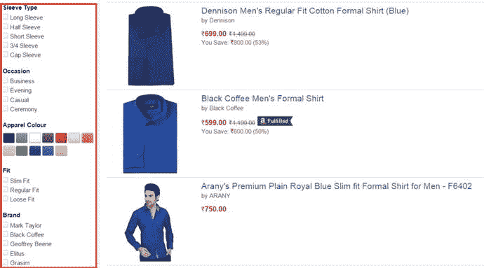

# 七、搜索数据：第二部分

这一章是前一章的延伸。在上一章中，你学习了搜索数据。您看到了在搜索过程中扮演重要角色的各种组件、Solr 支持的各种类型的查询和解析器，以及可以用来控制搜索行为的请求参数。

本章涵盖了搜索文档的其他重要方面。除了核心功能之外，搜索引擎还需要提供其他功能，以满足实际使用案例和用户需求。此外，每个领域都有自己独特的挑战。网络搜索引擎应该将来自同一网站的结果进行分组。电子商务网站通常提供分面导航，以便用户可以根据产品的特性轻松浏览目录。Solr 为此类常见问题提供了开箱即用的解决方案。

最重要的是，文档之间的文本相似性并不总是计算相关性的最佳标准。音乐发现网站通常认为流行和流行歌曲比具有相似分数的其他歌曲更相关。Solr 提供了函数 query 来计算这些数值的分数。Solr 允许你结合所有这些因素——包括文本相似性、受欢迎程度和评分——来推断实际的相关性排名和驯服现实世界的搜索问题。

本章描述了 Solr 的搜索特性以及实际的用例和先决条件，以便您可以轻松地分析某个特性是否可以解决您的业务问题，并了解在您的项目中实现它所面临的挑战。因为范例是最好的学习方法，所以每一节都以范例结尾。

本章涵盖以下主题:

*   局部参数
*   结果分组
*   统计数字
*   分面搜索
*   重新排序查询
*   连接查询和块连接
*   函数查询
*   `ExternalFileField`

## 局部参数

本地参数，也称为`LocalParams`，允许您在请求参数中提供额外的属性，并定制它们的行为。LocalParams 仅受某些参数支持，并且它们的效果仅限于该参数。例如，您可以更改`q`参数使用的`QParser`，而无需更改其他参数，如`fq`。记住，Solr 只允许每个请求参数有一个`LocalParam`。

### 句法

要使用`LocalParam`，它应该加在参数值的开头。LocalParams 应该以`{!`开始，以`}`结束，所有的本地参数应该在它们之间指定为由空格分隔的键值对。以下是在请求参数中使用`LocalParam`的语法:

`<query-parameter>={!<key1>=<value1> <key2>=<value2> .. <keyN>=<valueN>}<query>`

#### 指定查询解析器

要在本地参数部分使用的查询解析器的名称可以在`type`参数中指定。Solr 还为它提供了一个简短的表示，允许您只指定值，Solr 为它指定了一个隐式名称`type`。以下是语法:

`{!type=<query-parser> <key1>=<value1> .. <keyN>=<valueN>}<query> // explicit`

`{!<query-parser> <key1>=<value1> .. <keyN>=<valueN>}<query> // implicit`

#### 在 LocalParams 部分中指定查询

除了在右括号`}`后指定查询，您还可以通过使用`v`键在`LocalParam`中指定查询。

`<query-paramter>={!<query-parser> <key1>=<value1> .. <keyN>=<valueN> v=<query>}`

#### 使用参数解引用

使用参数解引用，可以进一步简化查询。您在同一个请求参数中指定查询，要么跟在右花括号后面，要么作为键`v`的值，但是参数解引用允许您从另一个参数读取查询。这种方法为客户端应用程序提供了便利，它可以只提供 LocalParams 引用的附加参数的值，并在`solrconfig.xml`中配置 LocalParams。参数取消引用的语法如下:

`<query-paramter>={!<query-parser> <key>=<value> v=$<param>}&param=query`

### 例子

在本节中，您将看到一些 LocalParams 及其语法的示例。

所有请求的默认操作符是`OR`，但是您可以使用 LocalParams 将`q`参数的操作符改为`AND`，如下所示。当您使用这个语法时，`fq`参数的操作符仍然保持不变(`OR`):

`$ curl``http://localhost:8983/solr/music/select`T2】

`q={!q.op=AND}singer:(bob marley)&fq=genre:(reggae beat)`

假设您想要查找关键字`bob marley`的结果，确保两个标记必须匹配，并且使用的解析器是 Lucene。以下示例显示了解决同一问题的各种方法:

`q={!type=lucene q.op=AND}bob marley // type parameter specifies the parser`

`q={!lucene q.op=AND}bob marley // shortened form for specifying the parser`

`q={!lucene q.op=AND v=’bob marley’} // v key for specifying query`

`q={!lucene q.op=AND v=$qq}&qq=bob marley // query dereferencing`

## 结果分组

结果分组是一种基于公共值对结果进行分组的功能。在 Solr 中，文档可以根据字段的值或函数查询的结果进行分组。对于查询，结果分组返回前 N 个组和每个组中的前 N 个文档。此功能也称为字段折叠，因为从概念上讲，您是基于一个公共值折叠结果的。

假设您正在构建一个 web 搜索引擎，对于一个查询，所有的顶级结果都来自同一个网站。这将导致糟糕的用户体验，而且你会无缘无故地惩罚所有其他网站。字段折叠对于消除重复和将每个网站的结果折叠成几个条目非常有用。连谷歌都这么干！

电子商务网站也经常使用结果分组来处理在不同类别中找到匹配的查询——例如，`shirt`可以是`formal`、`casual`或`party wear`类型。结果分组允许您返回每个类别的最佳结果。

### 先决条件

以下是使用结果分组的先决条件:

*   如果使用函数查询进行分组，则被分组的字段应该有索引，并且应该支持函数查询。
*   该字段必须是单值的。
*   该字段不应被标记化。

Note

到目前为止，函数查询的结果分组在分布式搜索中不起作用。

### 请求参数

Solr 为启用结果分组和控制其行为提供了额外的请求参数。支持的参数在表 [7-1](#Tab1) 中指定。

表 7-1。

Result Grouping Request Parameters

<colgroup><col> <col></colgroup> 
| 参数 | 描述 |
| --- | --- |
| `group` | 默认情况下，结果分组是禁用的。可以通过指定`group=true`来启用。 |
| `group.field` | 指定共享公共属性的 Solr 字段，并根据该字段对结果进行分组。可以多次指定该参数。 |
| `group.query` | 所有匹配查询的文档作为一个组返回。可以多次指定该参数。 |
| `group.func` | 指定函数查询，根据其唯一输出对结果进行分组。可以多次指定。分布式搜索不支持此功能。 |
| `start` | 指定组的初始偏移。 |
| `rows` | 指定要返回的组数。默认情况下，它返回 10 个组。 |
| `group.offset` | 指定每个组中文档的初始偏移量。 |
| `group.limit` | 默认情况下，只返回组的顶部文档。此参数指定每组要返回的文档数。 |
| `sort` | 默认情况下，组按`score desc`排序。您可以使用此参数更改组排序顺序。 |
| `group.sort` | 此参数对每个组中的文档进行排序。默认情况下，这也按`score desc`排序。 |
| `group.format` | 结果分组支持两种响应格式:`grouped`和`simple`。默认情况下，结果是`grouped`。`simple`格式提供了一个扁平的结果，便于解析。在此功能中，`rows`和`start`执行`group.limit`和`group.offset`的任务。 |
| `group.ngroups` | 如果设置为`true`，该参数返回匹配组的数量。如果一个查询有两个匹配的组，附加信息将被添加到响应中，如下所示:`<int name="ngroups">2</int>`在分布式搜索中，只有当组中的所有文档都存在于同一个 shard 中时，该参数才会给出正确的计数。 |
| `group.facet` | 该布尔参数默认为`false`。如果启用，在第一个指定组的基础上，在`facet.field`参数中指定的字段上执行分组刻面。在分布式环境中，只有当组中的所有文档都存在于同一个碎片中时，它才会给出正确的计数。 |
| `group.truncate` | 该布尔参数默认为`false`。如果启用，刻面计数基于每组中的顶部文档。 |
| `group.cache.percent` | 如果该值大于 0，结果分组将在第二阶段为查询启用缓存。默认值 0 禁用缓存分组。根据 Solr 官方参考指南，缓存可以提高布尔查询、通配符查询和模糊查询的性能。对于其他类型的查询，它可能会对性能产生负面影响。 |
| `group.main` | 如果`true`，第一个字段分组命令的结果被用作响应中的主结果列表，使用`group.format=simple`。必须提供至少一个分组条款(应提供`group.field`或`group.query`或`group.func`参数)。如果所有这些参数都丢失，Solr 将报告错误:`<lst name="error">` `<str name="msg">` `Specify at least one field, function or query to group by.` `</str>` `<int name="code">400</int>` `</lst>` |

### 例子

本节提供了每种结果分组类型的示例:字段分组、查询分组和函数查询分组。该示例假设您有一个名为`ecommerce`的核心，它包含满足所有分组先决条件的各个字段。

Group the results of each brand that manufactures a shirt, using field grouping

`$ curl` `http://localhost:8983/solr/ecommerce/select?q=product:shirt&wt=xml&group=true&group.field=brand`

`<lst name="grouped">`

`<lst name="brand">`

`<int name="matches">5</int>`

`<arr name="groups">`

`<lst>`

`<str name="groupValue">wrangler</str>`

`<result name="doclist" numFound="2" start="0">`

`<doc>`

`<str name="id">2</str>`

`<str name="sku">A111</str>`

`<str name="product">Blue Shirt</str>`

`<str name="category">Shirt</str>`

`<str name="brand">wrangler</str>`

`<str name="size">M</str>`

`<int name="price">1500</int>`

`</doc>`

`</result>`

`</lst>`

`<lst>`

`<str name="groupValue">adidas</str>`

`<result name="doclist" numFound="3" start="0">`

`<doc>`

`<str name="id">1</str>`

`<str name="sku">A110</str>`

`<str name="product">Blue T-Shirt</str>`

`<str name="category">T-shirt</str>`

`<str name="brand">adidas</str>`

`<str name="size">M</str>`

`<int name="price">1000</int>`

`</doc>`

`</result>`

`</lst>`

`</arr>`

`</lst>`

`</lst>`

Group documents in two price ranges using a group.query for the product “shirt”

`$ curl``http://localhost:8983/solr/ecommerce/select`T2】

`q=product:shirt&wt=xml&group=true&group.query=price:[1 TO 1000]`

`&group.query=price:[1001 TO *]`

`<lst name="grouped">`

`<lst name="price:[1 TO 1000]">`

`<int name="matches">5</int>`

`<result name="doclist" numFound="2" start="0">`

`<doc>`

`<str name="id">1</str>`

`<str name="sku">A110</str>`

`<str name="product">Blue T-Shirt</str>`

`<str name="category">T-shirt</str>`

`<str name="brand">adidas</str>`

`<str name="size">M</str>`

`<int name="price">1000</int>`

`</doc>`

`</result>`

`</lst>`

`<lst name="price:[1001 TO *]">`

`<int name="matches">5</int>`

`<result name="doclist" numFound="3" start="0">`

`<doc>`

`<str name="id">2</str>`

`<str name="sku">A111</str>`

`<str name="product">Blue Shirt</str>`

`<str name="category">Shirt</str>`

`<str name="brand">wrangler</str>`

`<str name="size">M</str>`

`<int name="price">1500</int>`

`</doc>`

`</result>`

`</lst>`

`</lst>`

Group documents on price range in multiples of 1,000, using a group function query

`$ curl``http://localhost:8983/solr/ecommerce/select?q=product:shirt&wt=xml&group=true&group.func=ceil(div(price,1000`T2】

`<lst name="grouped">`

`<lst name="ceil(div(price,1000))">`

`<int name="matches">5</int>`

`<arr name="groups">`

`<lst>`

`<double name="groupValue">2.0</double>`

`<result name="doclist" numFound="3" start="0">`

`<doc>`

`<str name="id">2</str>`

`<str name="sku">A111</str>`

`<str name="product">Blue Shirt</str>`

`<str name="category">Shirt</str>`

`<str name="brand">wrangler</str>`

`<str name="size">M</str>`

`<int name="price">1500</int>`

`</doc>`

`</result>`

`</lst>`

`<lst>`

`<double name="groupValue">1.0</double>`

`<result name="doclist" numFound="2" start="0">`

`<doc>`

`<str name="id">1</str>`

`<str name="sku">A110</str>`

`<str name="product">Blue T-Shirt</str>`

`<str name="category">T-shirt</str>`

`<str name="brand">adidas</str>`

`<str name="size">M</str>`

`<int name="price">1000</int>`

`</doc>`

`</result>`

`</lst>`

`</arr>`

`</lst>`

`</lst>`

## 统计数字

Solr 的`StatsComponent`允许您生成数字、日期或字符串字段的统计数据。并非所有统计数据都支持字符串和日期字段。

### 请求参数

在讨论这些方法之前，让我们看一下统计组件支持的请求参数。参数在表 [7-2](#Tab2) 中指定。

表 7-2。

Statistics Request Parameters

<colgroup><col> <col></colgroup> 
| 参数 | 描述 |
| --- | --- |
| `stats` | 您可以通过将此布尔参数设置为`true`来启用`StatsComponent`。 |
| `stats.field` | 指定应生成统计数据的字段名称。可以多次指定该参数，以生成多个字段的统计数据。 |
| `stats.facet` | 指定将为其生成统计信息的每个唯一值的方面。该参数的一个更好的替代方法是使用带枢轴刻面的`stats.field`。在本章的后面，你将会了解到旋转面。 |
| `stats.calcdistinct` | 当该布尔参数设置为`true`时，该字段中的所有不同值将与其计数一起返回。如果不同值的数量很大，此操作的成本可能会很高。默认设置为`false`。该请求参数已被弃用，建议使用`countDistinct`和`distinctValues LocalParams`。 |

### 支持的方法

`StatsComponent`支持多种统计方法。除了`percentiles`、`countDistinct`、`distinctValues`和`cardinality`之外的所有方法都是默认计算的。您可以通过将其值指定为`LocalParam`来启用该方法。如果您显式启用任何统计信息，其他默认统计信息将被禁用。`percentiles`方法接受数值，比如 99.9，而其他所有方法都是布尔型的。表 [7-3](#Tab3) 列出了主要统计数据。

表 7-3。

Statistical Methods and Types Supported

<colgroup><col> <col> <col></colgroup> 
| 局部参数 | 描述 | 支持的类型 |
| --- | --- | --- |
| `min` | 查找输入集中的最小值 | 全部 |
| `max` | 查找输入集中的最大值 | 全部 |
| `sum` | 计算输入集中所有值的总和 | 日期/号码 |
| `count` | 计算输入集中值的数量 | 全部 |
| `missing` | 计算缺少值的文档数 | 全部 |
| `mean` | 计算输入集中所有值的平均值 | 数据/数字 |
| `stddev` | 计算输入集中值的标准差 | 数据/数字 |
| `sumOfSquares` | 通过对每个值求平方然后求和来计算输出 | 数据/数字 |
| `percentiles` | 基于指定的截止值计算百分位数 | 数字 |
| `countDistinct` | 返回文档集中字段或函数中不同值的计数。这种计算可能很昂贵。 | 全部 |
| `distinctValues` | 返回文档集中字段或函数的所有不同值。这种计算可能很昂贵。 | 全部 |
| `cardinality` | 统计方法不能很好地扩展，因为它需要将所有东西都放入内存。`cardinality`方法使用 HyperLogLog，这是一种计算不同值的概率方法，它估计计数而不是返回确切的值。参见 [`http://algo.inria.fr/flajolet/Publications/FlFuGaMe07.pdf`](http://algo.inria.fr/flajolet/Publications/FlFuGaMe07.pdf) 了解超对数算法的详细信息。可以提供介于 0.0 和 1.0 之间的浮点数作为输入值，以指定算法的积极程度，其中 0.0 表示较不积极，1.0 表示较积极。高积极性提供了更准确的计数，但导致更高的内存消耗。或者，可以指定布尔值`true`来指示浮点值 0.3。 | 全部 |

### 局部参数

除了前面的统计，`StatsComponent`还支持表 [7-4](#Tab4) 中的 LocalParams。

表 7-4。

StatsComponent LocalParams

<colgroup><col> <col></colgroup> 
| 参数 | 描述 |
| --- | --- |
| `ex` | 排除过滤器的本地参数 |
| `key` | 参数来更改字段的显示名称 |
| `tag` | 用于标记统计数据的参数，以便它可以与透视分面一起使用 |

### 例子

本节给出了在 Solr 中生成各种类型的统计数据的例子。

Generate statistics on the “price” field

`$ curl` `http://localhost:8983/solr/ecommerce/select?q=*:*&wt=xml&rows=0&indent=true&stats=true&stats.field=price`

`<lst name="stats">`

`<lst name="stats_fields">`

`<lst name="price">`

`<double name="min">1000.0</double>`

`<double name="max">5000.0</double>`

`<long name="count">6</long>`

`<long name="missing">0</long>`

`<double name="sum">11500.0</double>`

`<double name="sumOfSquares">3.393E7</double>`

`<double name="mean">1916.6666666666667</double>`

`<double name="stddev">1541.968438933387</double>`

`<lst name="facets"/>`

`</lst>`

`</lst>`

`</lst>`

Generate facet on the field “size” and for each value of it, get the statistics. The statistics will be generated as a subsection in stats on the field “price”.

`$ curl` `http://localhost:8983/solr/ecommerce/select?q=*:*&wt=xml&rows=0`

`&indent=true&stats=true&stats.field=price&stats.facet=size`

`<lst name="facets">`

`<lst name="size">`

`<lst name="L">`

`<double name="min">1000.0</double>`

`<double name="max">5000.0</double>`

`<long name="count">2</long>`

`<long name="missing">0</long>`

`<double name="sum">6000.0</double>`

`<double name="sumOfSquares">2.6E7</double>`

`<double name="mean">3000.0</double>`

`<double name="stddev">2828.42712474619</double>`

`<lst name="facets"/>`

`</lst>`

`<lst name="M">`

`<double name="min">1000.0</double>`

`<double name="max">1800.0</double>`

`<long name="count">4</long>`

`<long name="missing">0</long>`

`<double name="sum">5500.0</double>`

`<double name="sumOfSquares">7930000.0</double>`

`<double name="mean">1375.0</double>`

`<double name="stddev">350.0</double>`

`<lst name="facets"/>`

`</lst>`

`</lst>`

`</lst>`

Change the display name for the price field to “mrp”

`$ curl` `http://localhost:8983/solr/ecommerce/select?q=*:*&wt=xml&rows=0&indent=true&stats=true&stats.field={!key=mrp}price`

`<lst name="stats">`

`<lst name="stats_fields">`

`<lst name="mrp">`

`...`

`</lst>`

`</lst>`

`</lst>`

Get the mininum value for the “price” field using min method

`$ curl` `http://localhost:8983/solr/ecommerce/select?q=*:*&wt=xml&rows=0&indent=true&stats=true&stats.field={!min=true}price`

`<lst name="stats">`

`<lst name="stats_fields">`

`<lst name="price">`

`<double name="min">1000.0</double>`

`</lst>`

`</lst>`

`</lst>`

## 刻面

Solr 的刻面特性不亚于一把瑞士军刀，这是一个可以做很多事情的特性——尤其是在 Solr 5.1 中，当组件被修改时，以及在 5.2 版本中，当更多的特性被添加时。分面是一种将搜索结果分为几个类别的功能，允许用户过滤掉不想要的结果或深入到更具体的结果。此功能提供了更好的用户体验，使用户能够轻松导航到特定的文档。

分面是电子商务网站的必备功能，尤其是那些有大量产品目录的网站。用户发出搜索请求，响应在页面的左边或右边显示类别，这就是方面。每个类别中的项目要么是可点击的，要么带有一个复选框来过滤结果。对于像蓝色正式衬衫这样的用户查询，网站可能会返回数百或数千个结果。例如，用户可以通过筛选首选品牌、最喜欢的颜色或合适的尺寸来轻松导航到自己选择的产品。图 [7-1](#Fig1) 显示了 Amazon.com 分面搜索的一个例子；小平面显示在矩形框中。

图 7-1。

Faceting in an e-commerce web site

刻面在 Solr 中很容易使用。例如，字段分面是一种基于字段数据的分面类型，它从字段中获取索引术语，并显示分面值和搜索结果。因为值是从索引中检索的，所以 Solr 总是返回该字段的唯一值。当用户选择一个分面值时，可以用它来创建一个带有附加过滤条件的新查询，比如`fq=<facet-field>:’<user selected facet value>’`，并获得一个新的结果，它将是原始结果的子集。类似地，如果用户取消选择一个方面值，可以使用它进行新的搜索请求，在过滤查询中不使用该子句，以扩大搜索结果。这种方法允许用户轻松浏览产品。

分面广泛用于以下情况:

*   结果分类
*   引导导航
*   自动完成
*   决策图表
*   分析和聚合
*   趋势识别

在 5.1 版之前，Solr 只提供了刻面的计数。但是现在它支持聚合，聚合运行一个分面函数来生成分类结果的统计数据。使用分面函数，可以检索统计信息，如平均值、总和以及唯一值。Solr 5.1 还支持新的 JSON API 进行请求，这有助于提供特定于字段的参数和嵌套命令。

### 先决条件

以下是在 Solr 中使用刻面的先决条件:

*   该字段必须有索引或者应该有`docValues`。
*   分面也适用于多值字段。

由于分面处理索引术语，返回的分面将是索引值(索引时文本分析后发出的标记)。因此，您需要以不同的方式分析 facet 字段，以便这些术语符合您的响应需求。您可以使用`copyField`将数据从可搜索字段复制到 facet 字段。接下来提供一些刻面的标准实践。

#### 标记化

如果对字段进行标记，分面将返回每个标记，这对用户来说可能没有意义。例如，一个标记化的`brand`字段将生成像`"facet_fields":{"brand":["Giorgio",6,"Armani",8]}`这样的方面，但是用户希望得到`"facet_fields":{"brand":["Giorgio Armani",5]}`，这样一旦他选择了这个品牌，他就只能看到这个品牌的结果。因此，对于刻面，通常避免标记化。

#### 用小写字体书写

如果你应用`LowerCaseFilterFactory`，结果将是乔治·阿玛尼，而不是你想要的乔治·阿玛尼。因此，刻面时通常避免使用小写。如果您的数据格式不佳，您可以进行一些清理并应用标准化来确保格式的一致性。

### 句法

Solr 为分面搜索提供了两个条款:传统的请求参数和 JSON API。

#### 传统请求参数

您可以通过指定附加的请求参数来启用分面，就像您对其他特性所做的那样。这里提供了语法:

`facet.<parameter>=<value>`

一些请求参数可以在每个字段的基础上指定。它们遵循语法`f.<fieldname>.facet.<parameter>`。例如，如果刻面参数`facet.count`特别应用于字段`brand`，则请求参数将为`f.brand.facet.count`。

#### JSON API(JSON API)

JSON 的嵌套结构为构造请求提供了易用性，特别是对于特定于字段的请求参数。Solr 提供了新的基于 JSON 的 API。JSON 被指定为`json.facet`请求参数的一部分:

`json.facet={`

`<facet_name>:{`

`<facet_type>:{`

`<param1>:<value1>,`

`<param2>:<value2>,`

`..`

`<paramN>:<valueN>`

`}`

`}`

`}`

### 例子

本节提供了两种分面方法的示例。

Traditional request parameter–based approach

`$ curl` `http://localhost:8983/solr/ecommerce/select?q=*:*&facet=true`

`&facet.field={!key=brand}ut_brand&facet.limit=10&facet.mincount=5`

New JSON API–based approach

`$ curl ’``http://localhost:8983/solr/ecommerce/select?q=*:*&json.facet`T2】

`brand: {`

`type : "term"`

`field : "ut_brand",`

`limit : 10,`

`mincount : 5`

`}`

`}’`

### 刻面类型

本节描述了 Solr 支持的刻面类型。每种分面类型都支持一组请求参数，其中一些是通用的，适用于所有分面类型，还有一些是特定于分面类型的。JSON API 基于键`type`识别刻面类型，键的值对应于刻面的类型。

#### 一般参数

本节指定了适用于所有类型的分面请求的分面参数。

##### 方面

刻面是在`SearchHandler`中注册的默认组件之一，但其执行被禁用。可以通过提供参数`facet=true`来启用。除了这个参数之外，还应该提供另一个支持参数，它包含有关刻面类型或如何刻面的信息。

#### 现场刻面

字段分面也称为术语分面，允许您在字段中的索引值上构建分面。您指定要刻面的字段名称，Solr 返回其中所有唯一的术语。请记住，您可能希望将构建方面的字段保持为未标记的。

##### 特定参数

以下是特定于字段分面的请求参数。

###### facet.field

这指定了刻面的字段。可以多次指定它，以便在多个字段上生成方面。

###### facet .前缀

这将返回与指定前缀匹配的方面，对于构建自动建议等功能非常有用。该参数可以在每个字段的基础上应用。在第 9 章中，你将学习使用 facets 来构建一个自动建议功能。

###### facet.contains

这将返回包含指定文本的方面。该参数可以在每个字段的基础上应用。

###### facet.contains.ignoreCase

将该布尔参数设置为`true`以在执行`facet.contains`匹配时忽略大小写。

###### 刻面.排序

该参数支持两个值:`index`和`count`。默认情况下，结果按`index`排序(按索引词的字典顺序)，但是如果`facet.limit`参数设置为大于 0 的值，结果将按`count`排序。该参数也可以在每个字段的基础上指定。

###### facet.offset

这指定了多面结果的偏移。该参数可以在每个字段的基础上指定。该参数与`facet.limit`一起可用于启用分页。

###### 方面.限制

这指定了为每个字段返回的分面结果的最大数量。负值指定无限制的结果。默认情况下，返回 100 个结果。该参数可以在每个字段的基础上指定。

###### facet.mincount

默认情况下，分面返回字段中所有唯一的术语。使用此参数，您可以过滤掉频率小于最小计数的术语。它允许 faceting 只返回那些最不突出的术语。默认值为 0。该参数可以在每个字段的基础上指定。

###### 面. missing

在设置`facet.missing=true`时，faceting 返回那些没有方面值的文档的计数(匹配用户查询的文档，但是缺少该方面字段的值)。默认情况下，该参数设置为`false`。该参数可以在每个字段的基础上指定。

###### facet .方法

`facet.method`参数允许您选择刻面的算法。该参数可以在每个字段的基础上指定。以下是支持的方法:

*   `enum`:这个方法获取一个字段中的所有术语，并对匹配它的所有文档和匹配查询的所有文档进行交集运算。字段中的每个唯一术语都会创建一个过滤器缓存，因此当唯一术语的数量有限时，应该使用这种方法。使用这种方法时，确保`filterCache`的尺寸足够大。
*   `fc`:名字`fc`代表`FieldCache`。这个方法遍历所有匹配的文档，计算 faceted 字段中的术语。这种方法对于字段中不同术语的数量很高但文档中术语的数量很低的索引更有效。此外，它比其他方法消耗更少的内存，并且是默认方法。该方法为匹配创建字段值的未转换表示，因此第一次请求会很慢。
*   `fcs`:这个方法只对单值字符串字段有效，并支持对频繁变化的索引进行更快的分面，因为`fc`在索引变化时不进行反版本化。

###### facet.enum.cache.minDF

该参数仅适用于`enum`刻面方法，并允许您调整缓存。默认情况下，`enum`方法对所有术语使用`filterCache`。如果将此参数设置为值 N，则文档频率小于 N 的术语将不会被缓存。较高的值会向`filterCache`添加较少的文档，因此所需的内存会较少，但您会有一个性能上的折衷。

###### 刻面.线程

这指定了为分面生成的最大线程数。默认情况下，它使用主请求的线程。如果该值为负，将创建最多到`Integer.MAX_VALUE`的线程。如果值为 0，请求将由主线程处理。

###### facet.overrequest.count

在分布式环境中，返回的方面计数不准确。为了提高准确性，您需要从每个碎片中请求比`facet.limit`指定的更多的面。超额请求基于以下公式:

`facet.overrequest.count +  (facet.limit * facet.overrequest.ratio)`

`facet.overrequest.count`的默认值是 10。

###### 方面。过度要求。比率

正如您在前面的参数中看到的，`facet.overrequest.ratio`通过乘以`facet.limit`也有助于控制从每个碎片获取的面的数量。该参数的默认值为 1.5。

如果您没有指定这些参数中的任何一个，Solr 默认为每个字段获取 25 个方面，基于计算 10 + (10 * 1.5)，其中第一个 10 是`facet.overrequest.count`的默认值，第二个 10 是`facet.limit`的默认值，1.5 是`facet.overrequest.ratio`的默认值。

#### 查询分面

Query faceting 允许您为 faceting 提供 Lucene 查询。您可以多次指定此参数来生成多个面。

##### 特定参数

以下是查询分面的请求参数。

###### facet.query

这指定了用于生成方面的 Lucene 查询。如果您想使用另一个查询解析器，可以使用 LocalParams 来指定。以下是一个方面查询的示例:

`facet=true&facet.query=singer:"bob marley"&facet.query=genre:pop // lucene query`

`facet=true&facet.query={!dismax}bob marley // faceting with dismax qparser`

#### 范围刻面

假设您想要基于产品的日期或价格构建一个方面。显示所有唯一的日期或价格并不是一个好主意。相反，您应该显示年份范围，如 2001–2010，或者价格，如$ 201–300。使用字段方面建立这种关系的一种方法是在单独的字段中索引该范围。但是，要在将来更改范围，您需要重新索引所有文档。嗯，这似乎不是一个好主意。您可以使用分面查询来实现这一点，但是您需要指定多个查询。

Solr 通过距离分面为这个问题提供了一个内置的解决方案。这可以应用于支持范围查询的任何字段。

##### 特定参数

以下是特定于距离分面的请求参数。

###### 方面.范围

这指定了应该应用范围查询的字段。可以多次提供它来对多个字段执行范围查询。

###### 面.范围.开始

这指定了范围的下限。低于该范围的索引值将被忽略。它可以在每个字段的基础上指定。

###### 面.范围.结束

这指定了范围的上限。超出该范围的索引值将被忽略。它可以在每个字段的基础上指定。

###### 刻面.范围.间隙

这指定了范围的大小。对于日期字段，范围应该符合`DataMathParser`语法。该参数可以在每个字段的基础上指定。

###### 刻面.范围.硬化

假设你设置起点为 1，终点为 500，设置缺口为 200。生成的面将是 1–200 和 201–400，但是对于第三个范围，范围应该是 401–500 还是 401–600 并不明确。

布尔参数`facet.range.hardend`允许您指定是否应该严格遵循结尾。如果将此参数设置为`true`，最后的范围将是 401–500；如果您将其设置为`false`，最后的范围将是 401–600。该参数的默认值为`false`，允许基于每个字段。

###### 面.范围.包含

此参数允许您处理下限值和上限值。以下是可用的选项:

*   `lower`:包含下边界。
*   `upper`:包含上边界。
*   `edge`:包含边缘边界(包含第一个范围的下边界和最后一个范围的上边界)。
*   `outer`:当`facet.range.other`参数被指定时，其前后范围将包括边界值。
*   `all`:应用前面的所有选项。

可以多次指定该参数来设置多个选项。默认情况下，刻面包括下边界，不包括上边界。如果您同时设置了`lower`和`upper`或`outer`或`all`，这些值将会重叠，因此请相应地进行设置。该参数可以在每个字段的基础上应用。

###### facet.range .其他

此参数允许您获得额外的计数。以下是可用的选项:

*   `below`:低于最低范围(`facet.range.start`)的所有值的刻面。
*   `above`:超出最高范围的所有值的刻面。
*   `between`:上下边界之间所有记录上的面。
*   `all`:应用前面的所有选项。
*   `none`:不要应用这些选项中的任何一个。

可以多次指定该参数来设置多个选项，但`none`选项会覆盖所有选项。它可以在每个字段的基础上应用。

###### facet.mincount

此参数指定计数，在该计数以下的范围方面应被忽略。您也可以在现场刻面中看到该参数。

##### 例子

本节提供了一个范围分面的示例。在本例中，您将对价格字段应用范围分面，以获得价格范围为 201–400 的产品数量；401–600;601–800;801–1,000;以及 1001–1200。您设置了`hardend=false`，因此最高刻面是 1001–1200，而不是 1001–1100。为所有低于最小范围的值和所有高于最大范围的值创建一个方面。只包括最小计数为 5 的术语。

`$ curl` `http://localhost:8983/solr/ecommerce/select?q=*:*`

`&facet.range=price&facet.range.start=201&facet.range.end=1100`

`&facet.range.gap=200&facet.mincount=5&facet=true`

`&facet.range.hardend=false&f.price.facet.range.include=lower`

`&f.price.facet.range.other=below&f.price.facet.range.other=above`

#### 间隔刻面

这种形式的分面是使用范围查询执行分面查询的一种替代方式，但实现方式不同。间隔分面在`docValues`上起作用，因此需要在您分面的字段上启用`docValues`，并根据内容提供不同的性能。您需要运行一些测试来确定是区间分面查询还是具有范围查询的分面查询为您提供了更好的性能。当获取同一个字段的多个范围时，区间分面提供了更好的性能，但是分面查询对于具有有效缓存的系统来说是很好的。

##### 特定参数

以下是特定于间隔 faceting.facet.interval 的请求参数

此参数指定应应用间隔分面的字段名称。该参数可以在每个字段的基础上应用。

###### 刻面.间隔.集

在此参数中，您可以指定构建区间分面的语法。您可以为多个时间间隔多次指定它，并且它可以应用于每个字段。以下是设置间隔的语法:

`[<start-value>,<end-value>]`

方括号可以用圆括号代替。方括号表示值包含在内，圆括号表示值不包含在内。左方括号可以以右括号结束，反之亦然。你选择的托槽将取决于你的情况。以下是几个例子:

*   `(1,100)`:大于 1 小于 100
*   `[1,100)`:大于等于 1，小于 100
*   `[1,100]`:大于等于 1，小于等于 100
*   `(1,100]`:大于 1，小于等于 100

对于无界区间，可以使用特殊字符`*`作为值。

##### 例子

本节给出了间隔刻面的例子。

Example of interval faceting

`$ curl` `http://localhost:8983/solr/ecommerce/select?q=*:*`

`&facet=true&facet.interval=mrp&f.mrp.facet.interval.set=[1,500]`

`&f.mrp.facet.interval.set=[501,1000]&f.mrp.facet.interval.set=[1001,*]`

Interval faceting also supports key replacement. The same query can be written as follows:

`$ curl` `http://localhost:8983/solr/ecommerce/select?q=*:*&facet=true`

`&facet.interval={!key=price}mrp&f.mrp.facet.interval.set={!key=less than 500}[1,500]&f.mrp.facet.interval.set={!key=500 to 1000}[501,1000]&f.mrp.facet.interval.set={!key=more than 1000}[1001,*]`

#### 透视刻面:决策树

枢轴刻面帮助您构建多级刻面(刻面中的刻面)。前面提到的所有方面都只提供顶级方面。现在，要在这个方面上构建另一个方面，需要向 Solr 发送另一个请求。但是支点面拯救了这一天。您可以构建一个决策树，而不需要向 Solr 发送带有额外过滤查询的额外请求。因此，枢轴刻面减少了往返次数。

##### 特定参数

以下是特定于 pivot 刻面的请求参数。

###### facet.pivot

此参数指定要透视的字段的逗号分隔列表。这个参数可以被多次指定，每个参数将在响应中添加一个单独的`facet_pivot`部分。

`facet.pivot=brand,size`

###### facet.pivot.mincount

此参数指定下限阈值。计数小于`mincount`的术语将被忽略。

枢纽分面还支持以下字段分面的请求参数(详情请参考字段分面部分):

*   `facet.limit`
*   `facet.offset`
*   `facet.sort`
*   `facet.overrequest.count`
*   `facet.overrequest.ratio`

##### 例子

本节提供了一个透视刻面的示例。

In a single request, build a facet on a brand, and for each brand build a facet on size

`$ curl` `http://localhost:8983/solr/ecommerce/select?q=*:*&facet=true&facet.pivot=brand,size`

`<lst name="facet_pivot">`

`<arr name="brand,size">`

`<lst>`

`<str name="field">brand</str>`

`<str name="value">adidas</str>`

`<int name="count">3</int>`

`<arr name="pivot">`

`<lst>`

`<str name="field">size</str>`

`<str name="value">M</str>`

`<int name="count">2</int>`

`</lst>`

`<lst>`

`<str name="field">size</str>`

`<str name="value">L</str>`

`<int name="count">1</int>`

`</lst>`

`</arr>`

`</lst>`

`...`

`</arr>`

`</lst>`

## 重新排序查询

Solr 4.9 引入了重新排序查询，它允许您提供一个附加查询来重新排序主查询返回的前 N 个结果。如果您希望运行一个代价太高而无法在所有文档上运行的查询，或者希望根据自定义要求对前 N 个结果进行重新排序，则此功能非常有用。有可能对 N 个结果之外的文档感兴趣，而重新排序的查询可能会错过它。但这是对性能的一种权衡。

可以使用附加请求参数`rq`中的本地参数指定重新排序属性。Solr 提供了一个查询解析器 ReRankQParserPlugin，用于解析重排序查询。这个解析器由名称`rerank`标识。

当您设置`debug=true`时，重新排序查询提供调试和自定义解释信息。您可以使用它来分析文档的重新分级分数。重排序查询也可以很好地与 Solr 的其他特性配合使用，您可以一起使用它们。

### 请求参数

以下是`ReRankQParserPlugin`支持的请求参数。

#### 重新查询

这个强制参数指定了由`ReRankQParser`解析的查询，以重新排列顶部的文档。

#### reRankDocs

该参数指定要考虑进行重新排序的主查询中的最少顶级文档数。默认值为 200。

#### 重新称重

此参数指定重新排序查询的分数所乘以的因子。结果分数被添加到主查询的分数中。默认值为 2.0。

### 例子

本节提供了一个重新排序查询的示例。

这个例子使用`ReRankQParser`来重新排列由主查询返回的前 200 个文档，主查询在`q`参数中提供。通过解引用在`reRankQuery`参数中提供重新排序查询，为了方便起见使用了`rrq`参数。该示例查询所有摇滚歌曲并对类型为`reggae`和`beat`的摇滚音乐进行重新排序:

`$ curl` `http://localhost:8983/solr/music/select?q=genre:rock`

`&rq={!rerank reRankQuery=$rrq reRankDocs=200 reRankWeight=3.0}`

`&rrq=genre:(regge beat)`

## 连接查询

通常，在将数据索引到 Solr 之前，您需要对其进行反规范化，但是反规范化并不总是一个选项。假设您有一个经常变化的值，对于每个变化，您需要找到该值的所有出现，并更新包含它的文档。对于这样的场景，Solr 提供了连接查询，您可以使用它来连接两个索引。

Solr 通过使用`JoinQParser`实现这个特性，它解析作为 LocalParam 提供的用户查询并返回`JoinQuery`。下面是`JoinQuery`的语法:

`{!join fromIndex=<core-name> from=<from-field> to=<to-field>}`

### 限制

Solr 中的连接查询不同于 SQL 连接，它有以下限制:

*   您可以连接到`from`文档，但是不能将来自`from`文档的值与来自`to`文档的结果一起返回。
*   `from`文档的分数不能用于计算`to`文档的分数。
*   `from`和`to`字段应该兼容，并且应该经过类似的分析，以便文档匹配。
*   `from`和`to`索引应该存在于同一个节点上。

### 例子

本节给出了一个连接查询的例子。

Find a list of all titles sung by the singer Bob Marley, where the song metadata is in the music core and the singer information is in the singer core

`$ curl``http://localhost:8983/solr/music/select?q`T2】

`singer:"Bob Marley"&fl=title`

## 块连接

联接查询在查询时执行联接，以匹配不同索引中的相关字段。使用块连接，您可以索引嵌套文档并使用`BlockJoinQuery`查询它们。块连接可以提供更好的查询时性能，因为关系作为父子关系存储在块中，并且不需要在查询时执行文档匹配。

### 先决条件

以下是块连接的先决条件:

*   在`schema.xml`中定义附加字段`_root_`。
*   索引附加字段，用于区分父文档和子文档。
*   在索引过程中，子文档应该嵌套在父文档中。
*   更新嵌套文档时，需要一次重新索引整个块。您不能仅重新索引子文档或父文档。

Solr 提供了两个解析器来支持块连接:`BlockJoinParentQParser`和`BlockJoinChildQParser`。

`BlockJoinChildQParser`将查询与父文档进行匹配，并返回该块中的子文档。下面是语法:

`{!child of=<field:value>}<parent-condition>`

LocalParam `of`包含区分父文档和子文档的字段名和值。右括号后面的条件可以是针对父文档的 Lucene 查询，用于查找匹配的子文档。返回的结果集将是匹配块中的嵌套文档。

`BlockJoinParentQParser`根据子文档匹配查询，并返回该块的父文档。下面是语法:

`{!parent which=<field:value>}<children-condition>`

LocalParam `which`包含字段名和值，用于区分父文档和子文档。右括号后面的条件可以是针对子文档的 Lucene 查询，用于查找匹配的父文档。返回的结果集将是匹配块中的嵌套文档。

### 例子

本节提供了一个使用块连接子查询和块连接父查询来索引块文档和执行搜索的示例。

Index an album as a parent document and all its tracks as children documents. Add the Boolean field isParent to differentiate the parent document from the child. The following is an XML document.

`<add>`

`<doc>`

`<field name="id">1</field>`

`<field name="album">Imagine</field>`

`<field name="singer">John Lennon</field>`

`<field name="isParent">true</field>`

`<doc>`

`<field name="id">2</field>`

`<field name="title">Imagine</field>`

`<field name="length">3.01</field>`

`</doc>`

`<doc>`

`<field name="id">3</field>`

`<field name="title">Crippled Inside</field>`

`<field name="length">3.47</field>`

`</doc>`

`</doc>`

`<doc>`

`<field name="id">4</field>`

`<field name="album">Confrontation</field>`

`<field name="singer">Bob Marley</field>`

`<field name="isParent">true</field>`

`<doc>`

`<field name="id">5</field>`

`<field name="title">Buffalo Soldier</field>`

`<field name="length">3.01</field>`

`</doc>`

`</doc>`

`</add>`

Solr also supports indexing nested documents in native JSON format or using SolrJ. For indexing in JSON format, you need to specify key _childDocuments_ to differentiate the child documents. A sample structure of nested JSON is provided here.

`[`

`{`

`"id":"1",`

`...`

`"_childDocuments_": [`

`{`

`...`

`}`

`]`

`}`

`]`

Search for an album named “imagine” by using a block-join child query

`$ curl` `http://localhost:8983/solr/music/select?q={!child of=isParent:true}album:imagine`

Search for a singer named “bob marley” by using a block-join parent query

`$ curl``http://localhost:8983/solr/music/select`T2】

`q={!parent which=isParent=true}singer:(“bob marley”)`

## 函数查询

当一个搜索查询提交给 Solr 来检索文档时，它会执行一个排名公式来计算每个匹配查询词的文档的分数。得到的文档根据相关性排序。

Lucene 使用布尔模型(BM)和向量空间模型(VSM)的修改形式的组合来对文档进行评分。你在第 3 章中学习了这些信息检索模型的基础知识。分数主要基于术语频率(表示包含查询术语的文档更频繁地被排名更高)和逆文档频率(表示越少的术语排名越高)。[第 8 章](08.html)涵盖了 Solr 评分的更多细节。

现在，假设您已经定义了所需的可搜索字段，对它们进行了适当的提升，并创建了适当的文本分析链，Solr 将使用其评分公式将用户查询与文档术语进行匹配。这种评分算法在确定文档的相关性方面可能做得很好，但是它有一个限制:分数是在文本相似性的基础上计算的。从该分数获得的排名可能没有考虑实际重要性和用户需求的因素，尤其是在需要考虑其他因素的真实世界的情况下。以下是来自不同领域的例子，其中其他因素发挥了重要作用:

*   音乐搜索引擎通常在决定歌曲的相关性时考虑流行度和用户评级。这个想法是，对于两个文本相似的文档，具有较高流行度和评级的文档应该被排列得较高。
*   在新闻网站中，新闻的新鲜度至关重要，因此新近性和创建时间成为重要因素。
*   餐馆发现应用程序为查询订购比萨饼的用户将附近的餐馆排名更高。在任何地理搜索系统中，位置和坐标是比文本相似性更重要的因素。

函数查询允许您根据外部因素(如数值或数学表达式)计算文档的分数，这可以补充现有的 Solr 分数，从而得出文档的最终分数。

函数查询使用函数来计算分数，可以是表 [7-5](#Tab5) 中列出的任何类型。

表 7-5。

Function Types

<colgroup><col> <col> <col></colgroup> 
| 类型 | 描述 | 例子 |
| --- | --- | --- |
| 不变价值 | 分配一个常数分数。 | `_val_:2.0` |
| 字符串文字 | 使用字符串值计算分数。并非所有函数都支持字符串文字。 | `literal("A literal value")` |
| Solr 字段 | 可以指定 Solr 字段。该字段必须存在于`schema.xml`中，并遵循下一节提到的先决条件。 | `sqrt(popularity)` |
| 功能 | Solr 允许您在一个函数中使用另一个函数。 | `sqrt(sum(x,100))` |
| 参数代换 | Solr 允许您将参数替换用作函数。 | `q=_val_:sqrt($val1)&val1=100` |

DisMax、e DisMax 和标准查询解析器支持函数查询。

### 先决条件

如果在函数查询中使用 Solr 字段，它具有以下先决条件:

*   该字段必须是索引的单值字段。
*   它必须从文本分析中只发出一个术语。

### 使用

函数查询不限于补充文档相关性排序的分数。这些查询还可以用于对结果进行排序，或者计算响应中要返回的值。Solr 中可以通过以下方式使用函数查询:

*   `FunctionQParserPlugin` : Solr 提供了`FunctionQParserPlugin`，一个专用的`QParserPlugin`，用于从输入值创建函数查询。可以通过使用 LocalParams 或者通过在`defType`参数中指定解析器来调用它，如下例所示:`q={!func}sqrt(clicks) // LocalParams` `q=sqrt(clicks)&defType=func // defType`
*   `FunctionRangeQParserPlugin`:这与`FunctionQParserPlugin`相似，但是创建了一个函数的范围查询。 [`https://lucene.apache.org/solr/5_3_1/solr-core/org/apache/solr/search/FunctionRangeQParserPlugin.html`](https://lucene.apache.org/solr/5_3_1/solr-core/org/apache/solr/search/FunctionRangeQParserPlugin.html) 处的 Javadoc 提供了支持的参数列表。可以通过 LocalParams 在过滤查询中使用，如下所示:`fq={!frange l=0 u=2.0}sum(user_rating,expert_rating)`
*   `q`参数:可以使用`_val_`钩子将函数查询嵌入到常规的搜索查询中。`_val_`的所有规则都适用于它。`q=singer:(bob marley) _val_:"sqrt(clicks)"`
*   `bf`参数:DisMax 和扩展 DisMax 中的`bf`参数允许您指定由空格分隔的函数查询列表。您可以选择为查询分配一个提升。下面是一个使用`bf`参数的函数查询的例子。`q=singer:(bob marley)&bf="sqrt(clicks)^0.5 recip(rord(price),1,1000,1000)^0.3"`
*   `boost`参数:与`bf`类似，函数查询可以应用在 boost 参数或 boost 查询解析器上，如下图所示。`q=singer:(bob marley)&boost="sqrt(clicks)^0.5 recip(rord(price),1,1000,1000)^0.3"`T3】
*   `sort`参数:Solr 允许您使用函数查询对结果进行排序。以下是根据`user_rating`和`expert_rating`字段之和计算得出的降序结果排序示例:`q=singer:(bob marley)&sort=sum(user_rating,expert_rating) desc`
*   `fl`参数:可以在`fl`参数中使用函数查询来创建一个伪字段，并返回函数查询的输出作为响应。以下示例返回通过取`user_rating`和`expert_rating` : `q=singer:(bob marley)&fl=title,album, div(sum(user_rating,expert_rating),2),score`的平均值计算的标题等级

### 功能类别

在上一节中，您看到了一些函数的例子，如`sqrt()`、`sum()`和`rord()`。Solr 支持的功能可以大致分为以下几组:

*   数学函数:这些函数支持数学计算，如`sum()`、`div()`、`log()`、`sin()`、`cos()`。有关这些数学函数的详细信息，请参考`java.util.Math` Javadocs。
*   日期功能:对于像新闻和博客这样的用例，文档需要根据最近的时间来增加。Solr 提供了`ms()`函数来返回从 UTC 1970 年 1 月 1 日午夜开始的毫秒差。在下一节中，您将看到一个提升最近文档的示例。
*   布尔函数:如果满足某个条件，布尔函数可用于采取适当的行动。下面的示例修改了前面的`FunctionQParserPlugin`示例，如果字段`fq={!frange l=0 u=2.0}sum(def(user_rating,5),expert_rating)`中缺少值，则指定默认值`user_rating`为 5
*   关联函数:Solr 提供了一组关联函数来检索关于索引术语的信息，比如文档频率和术语频率。`q=idf(color,’red’)`
*   距离函数:Solr 提供了计算两点之间距离的函数，例如，使用欧几里德距离或曼哈顿距离。它还允许您通过使用诸如 Levenshtein 距离或 Jaro-Winkler 之类的公式来计算两个字符串之间的距离。以下示例使用 Jaro-Winkler 编辑距离公式计算 red 和 raid 这两个词之间的距离。`strdist("red","raid",jw)`
*   地理空间搜索:Solr 支持位置数据和地理空间搜索，并提供功能查询，如`geodist()`。用于计算点之间距离的前述函数也广泛用于空间搜索。有关空间搜索的更多详细信息，请参考位于 [`https://cwiki.apache.org/confluence/display/solr/Spatial+Search`](https://cwiki.apache.org/confluence/display/solr/Spatial+Search) 的 Solr 文档。
*   其他函数:Solr 支持一些额外的函数，比如`ord()`，它返回索引字段值在该字段的术语索引列表中的序号。

Note

参考 Solr 官方文档 [`https://cwiki.apache.org/confluence/display/solr/Function+Queries`](https://cwiki.apache.org/confluence/display/solr/Function+Queries) 获取支持方法及其用途的完整列表。

### 例子

在我们关于函数查询的讨论中，您已经看到了几个例子。让我们再看几个例子，说明使用函数查询调整文档相关性排序的一些常见需求。

Function query to specify that the recently released titles are more relevant

`$ curl``http://localhost:8983/solr/music/select`T2】

`q=bob marley&boost=recip(ms(NOW,releasedate),3.16e-11,1,1)`

`&defType=edismax`

Function query to specify that titles that have been played more than a certain number of times are more relevant

`$ curl`

`http://localhost:8983/solr/music/select` `?`

`q=bob marley&boost=div(log(sum(clicks,1),10))&defType=edismax`

### 警告

函数查询是解决现实世界排名需求的一个很好的工具，但是需要谨慎使用。以下是使用它时需要注意的一些重要因素:

*   函数查询应该是公平的，它的影响应该被优化设置。如果函数查询的输出或提升值非常高，则可能导致文本相似性差的文档排名也非常高。在最坏的情况下，无论您给出什么查询，一个具有很高功能分数的文档总是作为最相关的文档出现。
*   对每个匹配的文档运行函数查询。因此，应避免代价高昂的计算，因为它会极大地影响性能。Solr 推荐快速随机存取的函数。
*   在写数学表达式时，应该适当地处理默认值。例如，如果任一输入值为 0，则`product(x,y)`的得分为 0。

Note

如果索引中没有字段值，则在函数查询中使用 0 代替。

### 自定义函数查询

在上一节中，您了解了 Solr 提供的用于函数查询的函数。有时 Solr 提供的函数可能不适合您的业务需求，您可能希望将自己的命名函数插入 Solr。

Lucene 在包`org.apache.lucene.queries.function.*`中为函数查询定义了类。要编写您的自定义函数，您需要扩展以下两个 Lucene 类:

*   `ValueSourceParser`:解析用户查询生成`ValueSource`实例的工厂。
*   `ValueSource`:创建函数查询的抽象类。自定义函数将在扩展它的类中定义。

在本节中，您将学习编写一个自定义函数。

假设你在一家非常时尚的电子商务公司工作，在那里销售的大部分产品都是最流行的产品。你已经分析过，在你的公司里，每个趋势都是从小处开始，慢慢增长，达到一个峰值，然后开始下跌，慢慢脱离图表。趋势像钟形曲线一样移动。对于这一特定需求，您决定使用高斯公式开发一个函数，该函数提供一个遵循钟形曲线的分数。以下是您需要遵循的步骤:

Extend the `ValueSourceParser` abstract class. `public class GaussianValueSourceParser extends ValueSourceParser {` `}`   Implement the `parse()` abstract method and return an instance of the custom `ValueSource` implementation, which you will create in the next step. Also, get the `ValueSource` from `FunctionQParser` and pass it to the custom `ValueSource`. You will need it in your custom algorithm. You can optionally pass additional parameters, as shown in this example. `@Override` `public ValueSource parse(FunctionQParser fp) throws SyntaxError {`   `ValueSource vs = fp.parseValueSource();`   `return new GaussianValueSource(vs, stdDeviation, mean);` `}`   If you want to read parameters from the factory definition in `solrconfig.xml`, you can optionally extend the `init()` method. You read the standard deviation and mean values and provide them to the constructor of the custom `ValueSource`. `public void init(NamedList namedList) {`   `this.stdDeviation = (Float) namedList.get(STD_DEVIATION_PARAM);`   `this.mean = (Float) namedList.get(MEAN_PARAM);` `}`   Create a custom class by extending the `ValueSource` abstract class. Define the constructor for setting the instance variables. `protected final ValueSource source;` `protected float stdDeviation = 1.0f;` `protected float mean = 1.0f;` `protected float variance = 1.0f;` `public GaussianValueSource(ValueSource source, float stdDeviation, float mean) {`   `this.source = source;`   `this.stdDeviation = stdDeviation;`   `this.variance = stdDeviation * stdDeviation;`   `this.mean = mean;` `}`   Override the `getValues()` method of `ValueSource`. The method should return an implementation of `FloatDocValues`, an abstract class to support float values. In this method, also get the `FunctionValues`, using the `getValues()` method of the `ValueSource` instance provided by the factory. `@Override` `public FunctionValues getValues(Map context, LeafReaderContext readerContext)`       `throws IOException {`   `final FunctionValues aVals =  source.getValues(context, readerContext);`   `return new FloatDocValues(this) {` `..`   `};` `}`   Override the `floatVal()` method of the `FloatDocValues` class and get the value from the `floatVal()` method of the `FunctionValues` class that you instantiated in the previous step. This value is based on the function query type, such as the value of a Solr field. `@Override` `public float floatVal(int doc) {`   `float val1 = aVals.floatVal(doc);` `..` `}`   Write your custom logic that acts as the value and return the float score. The Gaussian formula is shown here; you can replace it with any other formula. `float score = (float) Math.pow(Math.exp(-(((val1 - mean)`   `* (val1 - mean)) / ((2 * variance)))), 1 /`              `(stdDeviation * Math.sqrt(2 * Math.PI)));` `return score;`   Override the abstract methods `toString()` in the `FloatDocValues` implementation. `@Override` `public String toString(int doc) {`   `return "Gaussian function query (" + aVals.toString(doc) + ’)’;` `}`   Override the abstract method `hashCode()` in the `ValueSource` implementation. `@Override` `public int hashCode() {`   `return source.hashCode() + "Gaussian function query".hashCode();` `}`   Build the program and add the path of Java binary JAR to the lib definition in solrconfig.xml. `<lib dir="./lib" />`   Register the custom `ValueSourceParser` in `solrconfig.xml`. `<valueSourceParser name="gaussian"` `class="com.apress.solr.pa.chapter07` `.functionquery.GaussianValueSourceParser" >`   `<float name="stdDeviation">1.0</float>`   `<float name="mean">8</float>` `</valueSourceParser>`   Use the new named function in your search, `gaussian` in this case. `$ curl` `http://localhost:8983/solr/ecommerce/select?q=blazer&defType=edismax` `&fl=score,product,trendcount&boost=gaussian(trendcount)`  

#### Java 源代码

下面是本节中讨论的 Gaussian `ValueSource`的完整 Java 源代码。

GaussianValueSourceParser.java

`package com.apress.solr.pa.chapter07` `.functionquery;`

`import org.apache.lucene.queries.function.ValueSource;`

`import org.apache.solr.common.util.NamedList;`

`import org.apache.solr.common.util.Utils;`

`import org.apache.solr.search.FunctionQParser;`

`import org.apache.solr.search.SyntaxError;`

`import org.apache.solr.search.ValueSourceParser;`

`public class GaussianValueSourceParser extends ValueSourceParser {`

`private static final String STD_DEVIATION_PARAM = "stdDeviation";`

`private static final String MEAN_PARAM = "mean";`

`private float stdDeviation;`

`private float mean;`

`public void init(NamedList namedList) {`

`this.stdDeviation = (Float) namedList.get(STD_DEVIATION_PARAM);`

`this.mean = (Float) namedList.get(MEAN_PARAM);`

`}`

`@Override`

`public ValueSource parse(FunctionQParser fp) throws SyntaxError {`

`ValueSource vs = fp.parseValueSource();`

`return new GaussianValueSource(vs, stdDeviation, mean);`

`}`

`}`

GaussianValueSource.java

`package com.apress.solr.pa.chapter``7`T2】

`import java.io.IOException;`

`import java.util.Map;`

`import org.apache.lucene.index.LeafReaderContext;`

`import org.apache.lucene.queries.function.FunctionValues;`

`import org.apache.lucene.queries.function.ValueSource;`

`import org.apache.lucene.queries.function.docvalues.FloatDocValues;`

`import org.apache.lucene.queries.function.valuesource.FloatFieldSource;`

`public class GaussianValueSource extends ValueSource {`

`protected final ValueSource source;`

`protected float stdDeviation = 1.0f;`

`protected float mean = 1.0f;`

`protected float variance = 1.0f;`

`public GaussianValueSource(ValueSource source, float stdDeviation, float mean) {`

`this.source = source;`

`this.stdDeviation = stdDeviation;`

`this.variance = stdDeviation * stdDeviation;`

`this.mean = mean;`

`}`

`@Override`

`public String description() {`

`return "Gaussian function query (" + source.description() + ")";`

`}`

`@Override`

`public boolean equals(Object arg0) {`

`return false;`

`}`

`@Override`

`public FunctionValues getValues(Map context, LeafReaderContext readerContext)`

`throws IOException {`

`final FunctionValues aVals =  source.getValues(context, readerContext);`

`return new FloatDocValues(this) {`

`@Override`

`public float floatVal(int doc) {`

`float val1 = aVals.floatVal(doc);`

`float score = (float) Math.pow(Math.exp(-(((val1 - mean) * (val1 - mean)) / ((2 * variance)))), 1 / (stdDeviation * Math.sqrt(2 * Math.PI)));`

`return score;`

`}`

`@Override`

`public String toString(int doc) {`

`return "Gaussian function query (" + aVals.toString(doc) + ’)’;`

`}`

`};`

`}`

`@Override`

`public int hashCode() {`

`return source.hashCode() + "Gaussian function query".hashCode();`

`}`

`}`

## 引用外部文件

函数查询使用用户评级、下载计数或趋势计数等信息来计算函数得分。如果观察这些值，它们比其他字段中的值变化得更频繁。例如，像 YouTube 这样的视频分享网站需要每隔几个小时更新一次趋势计数，因为如今一个视频一天内获得一百万次点击是很常见的。

索引这种频繁变化的信息还需要更新其他字段，这些字段的变化不太频繁。为了解决这样的用例，Solr 提供了`ExternalFileField`，这是`FieldType`的一个特殊实现，允许您在外部文件中指定字段值。外部文件包含从文档中的关键字段到外部值的映射。Solr 允许您以期望的频率修改文件，而无需重新索引其他字段。

注意，外部字段是不可搜索的。它们只能用于函数查询或返回响应。

### 使用

以下是在搜索引擎中配置`ExternalFileField`的步骤:

Define the `FieldType` for `ExternalFileField` in `schema.xml` and specify the appropriate parameters. The following are the special parameters provided by `ExternalFileField`:

*   `keyField`:指定用于映射值的 Solr 字段。
*   `defVal`:如果外部文件中缺少密钥条目，则定义默认值。
*   `valType`:指定文件中数值的类型。该属性的有效值为`float`、`pfloat`和`tfloat`。

A sample `fieldType` definition is provided here: `<fieldType name="trendingCount" stored="false" indexed="false"` `keyField="trackId" defVal="0" class="solr.ExternalFileField"` `valType="pfloat"/>`   Create the external file with the name `external_<fieldname>` in Solr’s index directory, which is `$SOLR_HOME/<core>/data` by default. The file should contain a key-value pair delimited by `=`. The external file for the `trendingCount` field mentioned previously should look like this: `$ cat external_` `trendingCount` `doc1=1.0` `doc2=0.8` `doc3=2` The external file name can also end with an extension, such as `external_trendingCount.txt`. If Solr discovers multiple files with a `.*` pattern, it will sort the files on name and refer the last one.   Solr allows you to define an event listener, which activates whenever a new searcher is opened or an existing searcher is reloaded. Register the `ExternalFileField` to the desired listener. The following is an example for registering to the listener: `<listener event="newSearcher"` `class="org.apache.solr.schema.ExternalFileFieldReloader"/>` `<listener event="firstSearcher"` `class="org.apache.solr.schema.ExternalFileFieldReloader"/>`  

完成这些步骤后，`ExternalFileField`就可以在任何字段定义中配置了，它可以像您见过的任何其他字段一样在函数查询中使用。

## 摘要

前一章关注 Solr 的核心组件:查询。在本章中，您学习了如何通过使用 LocalParams 和 reranking 查询来获得对查询的粒度控制，如何通过使用联接查询来联接索引，以及如何通过使用块联接来索引分层数据。然后您学习了其他特性，比如结果分组、分面和统计。

您看到了流行度、新近度和趋势等非文本信息对于决定文档的相关性排序是多么重要，以及如何在 Solr 中使用这些信息。您还学习了如何编写自定义命名函数，以便在函数查询中使用。

在下一章，你将学习 Solr 评分。在本章结束时，您将理解一个文档如何在结果集中的特定位置排名，以及为什么一个文档出现在另一个文档之前或之后。